# 31 - Diagrames de classes del SIF

## 1. Objectiu i abast

Aquest document representa les classes PHP que articulen el nucli SIF, els fluxos manuals i el circuit asíncron de Redsys. És una vista derivada del codi i no substitueix els contractes funcionals ni el model SQL.

Estat de les fonts el 2026-09-14:

- `[BASE]`: codi present al checkout `checkpoint/sif-fase-0-4` (`4c16b52`), inclosos els canvis locals encara no confirmats;
- `[ASYNC]`: codi present a la branca i worktree `feature/redsys-async-queue` (`2742135`), amb el circuit asíncron Redsys complet;
- `[DISSENY]`: comportament descrit documentalment però sense classe executable equivalent al codi revisat.

Fonts principals:

- `sif/src/Service/`;
- `sif/src/Repository/`;
- `sif/src/Domain/`;
- `sif/database/migrations/`;
- `03-canvis-pendents/13-cua-asincrona-callbacks-redsys.md`;
- `04-estat-final/17-estat-final-bd-relacions.md`.

## 2. Nucli d'emissió i cobrament `[BASE]`

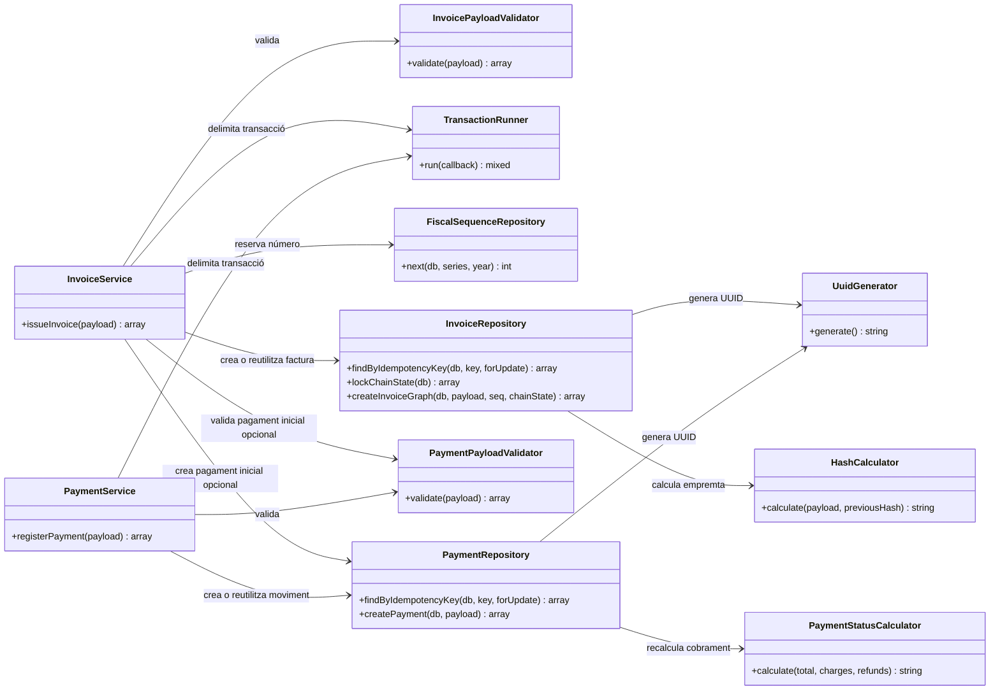
```mermaid
classDiagram
direction LR

class InvoiceService {
  +issueInvoice(payload) array
}
class InvoicePayloadValidator {
  +validate(payload) array
}
class TransactionRunner {
  +run(callback) mixed
}
class FiscalSequenceRepository {
  +next(db, series, year) int
}
class InvoiceRepository {
  +findByIdempotencyKey(db, key, forUpdate) array
  +lockChainState(db) array
  +createInvoiceGraph(db, payload, seq, chainState) array
}
class HashCalculator {
  +calculate(payload, previousHash) string
}
class UuidGenerator {
  +generate() string
}
class PaymentService {
  +registerPayment(payload) array
}
class PaymentPayloadValidator {
  +validate(payload) array
}
class PaymentRepository {
  +findByIdempotencyKey(db, key, forUpdate) array
  +createPayment(db, payload) array
}
class PaymentStatusCalculator {
  +calculate(total, charges, refunds) string
}

InvoiceService --> InvoicePayloadValidator : valida
InvoiceService --> TransactionRunner : delimita transacció
InvoiceService --> FiscalSequenceRepository : reserva número
InvoiceService --> InvoiceRepository : crea o reutilitza factura
InvoiceService --> PaymentPayloadValidator : valida pagament inicial opcional
InvoiceService --> PaymentRepository : crea pagament inicial opcional
InvoiceRepository --> UuidGenerator : genera UUID
InvoiceRepository --> HashCalculator : calcula empremta

PaymentService --> PaymentPayloadValidator : valida
PaymentService --> TransactionRunner : delimita transacció
PaymentService --> PaymentRepository : crea o reutilitza moviment
PaymentRepository --> UuidGenerator : genera UUID
PaymentRepository --> PaymentStatusCalculator : recalcula cobrament
```

Responsabilitats persistents:

| Classe | Taules principals que consulta o modifica |
| --- | --- |
| `InvoiceRepository` | `factura`, `factura_linia`, `factura_registres`, `fiscal_chain_state`, `fiscal_queue`, `fact_rels` |
| `FiscalSequenceRepository` | `fiscal_sequence` |
| `PaymentRepository` | `payment_transaction`, `payment_allocation`, `factura` |

La frontera funcional és deliberada: `issueInvoice()` pot crear número, registre fiscal, cadena i cua AEAT; `registerPayment()` només crea el moviment econòmic i les assignacions sobre factures existents.

## 3. Orquestradors d'emissió `[BASE]`

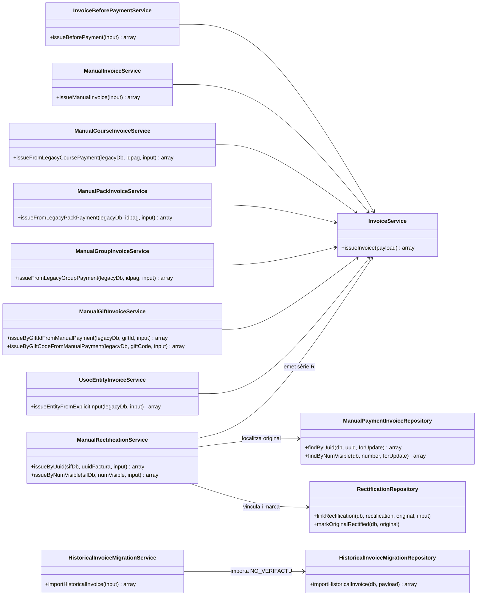
```mermaid
classDiagram
direction LR

class InvoiceService {
  +issueInvoice(payload) array
}
class InvoiceBeforePaymentService {
  +issueBeforePayment(input) array
}
class ManualInvoiceService {
  +issueManualInvoice(input) array
}
class ManualCourseInvoiceService {
  +issueFromLegacyCoursePayment(legacyDb, idpag, input) array
}
class ManualPackInvoiceService {
  +issueFromLegacyPackPayment(legacyDb, idpag, input) array
}
class ManualGroupInvoiceService {
  +issueFromLegacyGroupPayment(legacyDb, idpag, input) array
}
class ManualGiftInvoiceService {
  +issueByGiftIdFromManualPayment(legacyDb, giftId, input) array
  +issueByGiftCodeFromManualPayment(legacyDb, giftCode, input) array
}
class UsocEntityInvoiceService {
  +issueEntityFromExplicitInput(legacyDb, input) array
}
class ManualRectificationService {
  +issueByUuid(sifDb, uuidFactura, input) array
  +issueByNumVisible(sifDb, numVisible, input) array
}
class HistoricalInvoiceMigrationService {
  +importHistoricalInvoice(input) array
}
class ManualPaymentInvoiceRepository {
  +findByUuid(db, uuid, forUpdate) array
  +findByNumVisible(db, number, forUpdate) array
}
class RectificationRepository {
  +linkRectification(db, rectification, original, input)
  +markOriginalRectified(db, original)
}
class HistoricalInvoiceMigrationRepository {
  +importHistoricalInvoice(db, payload) array
}

InvoiceBeforePaymentService --> InvoiceService
ManualInvoiceService --> InvoiceService
ManualCourseInvoiceService --> InvoiceService
ManualPackInvoiceService --> InvoiceService
ManualGroupInvoiceService --> InvoiceService
ManualGiftInvoiceService --> InvoiceService
UsocEntityInvoiceService --> InvoiceService

ManualRectificationService --> ManualPaymentInvoiceRepository : localitza original
ManualRectificationService --> InvoiceService : emet sèrie R
ManualRectificationService --> RectificationRepository : vincula i marca

HistoricalInvoiceMigrationService --> HistoricalInvoiceMigrationRepository : importa NO_VERIFACTU
```

Cada orquestrador de curs, pack, grup, regal o USOC també depèn del seu repositori de snapshot legacy i del seu constructor de payload. S'han omès aquestes parelles del gràfic per mantenir-lo llegible; el patró és:

```text
entrada controlada -> snapshot immutable -> payload específic -> InvoiceService
```

La migració històrica és l'excepció intencionada: escriu factures `NO_VERIFACTU` mitjançant el seu repositori propi i no crida `InvoiceService`, perquè no ha de crear registre fiscal retroactiu, cadena ni cua AEAT.

## 4. Orquestradors de moviments econòmics `[BASE]`

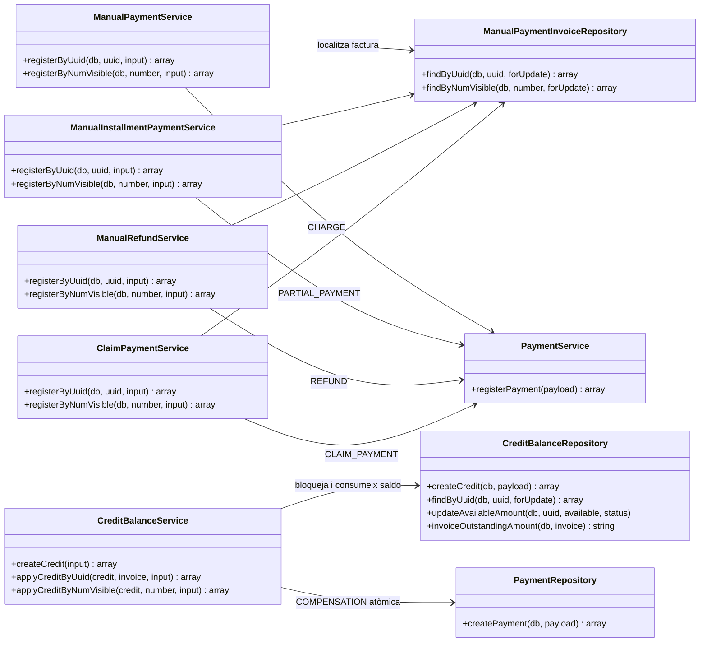
```mermaid
classDiagram
direction LR

class PaymentService {
  +registerPayment(payload) array
}
class ManualPaymentInvoiceRepository {
  +findByUuid(db, uuid, forUpdate) array
  +findByNumVisible(db, number, forUpdate) array
}
class ManualPaymentService {
  +registerByUuid(db, uuid, input) array
  +registerByNumVisible(db, number, input) array
}
class ManualInstallmentPaymentService {
  +registerByUuid(db, uuid, input) array
  +registerByNumVisible(db, number, input) array
}
class ManualRefundService {
  +registerByUuid(db, uuid, input) array
  +registerByNumVisible(db, number, input) array
}
class ClaimPaymentService {
  +registerByUuid(db, uuid, input) array
  +registerByNumVisible(db, number, input) array
}
class CreditBalanceService {
  +createCredit(input) array
  +applyCreditByUuid(credit, invoice, input) array
  +applyCreditByNumVisible(credit, number, input) array
}
class CreditBalanceRepository {
  +createCredit(db, payload) array
  +findByUuid(db, uuid, forUpdate) array
  +updateAvailableAmount(db, uuid, available, status)
  +invoiceOutstandingAmount(db, invoice) string
}
class PaymentRepository {
  +createPayment(db, payload) array
}

ManualPaymentService --> ManualPaymentInvoiceRepository : localitza factura
ManualPaymentService --> PaymentService : CHARGE
ManualInstallmentPaymentService --> ManualPaymentInvoiceRepository
ManualInstallmentPaymentService --> PaymentService : PARTIAL_PAYMENT
ManualRefundService --> ManualPaymentInvoiceRepository
ManualRefundService --> PaymentService : REFUND
ClaimPaymentService --> ManualPaymentInvoiceRepository
ClaimPaymentService --> PaymentService : CLAIM_PAYMENT
CreditBalanceService --> CreditBalanceRepository : bloqueja i consumeix saldo
CreditBalanceService --> PaymentRepository : COMPENSATION atòmica
```

Els constructors de payload específics (`ManualPaymentPayloadBuilder`, `ManualInstallmentPaymentPayloadBuilder`, `ManualRefundPayloadBuilder`, `ClaimPaymentPayloadBuilder` i `CreditBalancePayloadBuilder`) tradueixen l'entrada funcional al contracte comú de pagament.

## 5. Circuit asíncron Redsys `[ASYNC]`

Aquest diagrama correspon a `feature/redsys-async-queue`. Les classes noves no són totes presents al checkout base indicat a l'apartat 1.

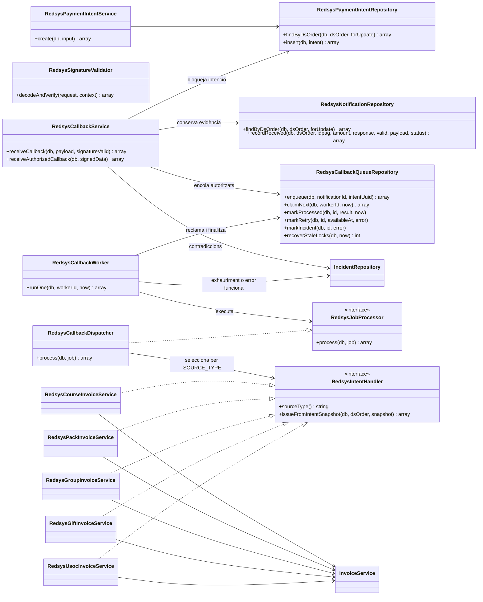
```mermaid
classDiagram
direction LR

class RedsysPaymentIntentService {
  +create(db, input) array
}
class RedsysPaymentIntentRepository {
  +findByDsOrder(db, dsOrder, forUpdate) array
  +insert(db, intent) array
}
class RedsysSignatureValidator {
  +decodeAndVerify(request, context) array
}
class RedsysCallbackService {
  +receiveCallback(db, payload, signatureValid) array
  +receiveAuthorizedCallback(db, signedData) array
}
class RedsysNotificationRepository {
  +findByDsOrder(db, dsOrder, forUpdate) array
  +recordReceived(db, dsOrder, idpag, amount, response, valid, payload, status) array
}
class RedsysCallbackQueueRepository {
  +enqueue(db, notificationId, intentUuid) array
  +claimNext(db, workerId, now) array
  +markProcessed(db, id, result, now)
  +markRetry(db, id, availableAt, error)
  +markIncident(db, id, error)
  +recoverStaleLocks(db, now) int
}
class RedsysCallbackWorker {
  +runOne(db, workerId, now) array
}
class RedsysJobProcessor {
  <<interface>>
  +process(db, job) array
}
class RedsysCallbackDispatcher {
  +process(db, job) array
}
class RedsysIntentHandler {
  <<interface>>
  +sourceType() string
  +issueFromIntentSnapshot(db, dsOrder, snapshot) array
}
class RedsysCourseInvoiceService
class RedsysPackInvoiceService
class RedsysGroupInvoiceService
class RedsysGiftInvoiceService
class RedsysUsocInvoiceService
class InvoiceService
class IncidentRepository

RedsysPaymentIntentService --> RedsysPaymentIntentRepository
RedsysCallbackService --> RedsysPaymentIntentRepository : bloqueja intenció
RedsysCallbackService --> RedsysNotificationRepository : conserva evidència
RedsysCallbackService --> RedsysCallbackQueueRepository : encola autoritzats
RedsysCallbackService --> IncidentRepository : contradiccions
RedsysCallbackWorker --> RedsysCallbackQueueRepository : reclama i finalitza
RedsysCallbackWorker --> RedsysJobProcessor : executa
RedsysCallbackWorker --> IncidentRepository : exhauriment o error funcional
RedsysCallbackDispatcher ..|> RedsysJobProcessor
RedsysCallbackDispatcher --> RedsysIntentHandler : selecciona per SOURCE_TYPE

RedsysCourseInvoiceService ..|> RedsysIntentHandler
RedsysPackInvoiceService ..|> RedsysIntentHandler
RedsysGroupInvoiceService ..|> RedsysIntentHandler
RedsysGiftInvoiceService ..|> RedsysIntentHandler
RedsysUsocInvoiceService ..|> RedsysIntentHandler

RedsysCourseInvoiceService --> InvoiceService
RedsysPackInvoiceService --> InvoiceService
RedsysGroupInvoiceService --> InvoiceService
RedsysGiftInvoiceService --> InvoiceService
RedsysUsocInvoiceService --> InvoiceService
```

El callback no emet la factura dins la petició HTTP. Persisteix la notificació i un únic treball; el worker consumeix `SNAPSHOT_JSON`, delega segons `SOURCE_TYPE` i confia en la idempotència d'`InvoiceService` i `PaymentService` davant reintents.

## 6. Límits que el diagrama no ha de confondre

- `fiscal_queue` i `redsys_callback_queue` són cues diferents: la primera és per remissió AEAT i la segona per transformar un cobrament Redsys confirmat en operació SIF.
- `redsys_payment_intent`, `redsys_notifications` i `payment_transaction` representen, respectivament, el context anterior al TPV, l'evidència rebuda i el moviment econòmic confirmat.
- No s'ha identificat encara una classe executable de client/worker AEAT, ni les classes de `RegistroAnulacion` o subsanació. Aquestes peces continuen en estat `[DISSENY]`.
- Els permisos i rols estan definits documentalment, però els serveis de domini revisats no incorporen per si mateixos una capa comuna d'autorització; l'endpoint o adaptador servidor ha de validar-los.

## 7. Infraestructura, HTTP i errors `[BASE]`

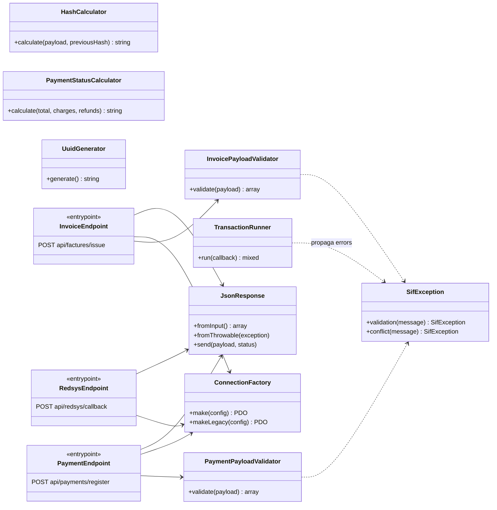
```mermaid
classDiagram
direction LR

class ConnectionFactory {
  +make(config) PDO
  +makeLegacy(config) PDO
}
class TransactionRunner {
  +run(callback) mixed
}
class JsonResponse {
  +fromInput() array
  +fromThrowable(exception)
  +send(payload, status)
}
class SifException {
  +validation(message) SifException
  +conflict(message) SifException
}
class InvoicePayloadValidator {
  +validate(payload) array
}
class PaymentPayloadValidator {
  +validate(payload) array
}
class HashCalculator {
  +calculate(payload, previousHash) string
}
class PaymentStatusCalculator {
  +calculate(total, charges, refunds) string
}
class UuidGenerator {
  +generate() string
}
class InvoiceEndpoint {
  <<entrypoint>>
  POST api/factures/issue
}
class PaymentEndpoint {
  <<entrypoint>>
  POST api/payments/register
}
class RedsysEndpoint {
  <<entrypoint>>
  POST api/redsys/callback
}

InvoiceEndpoint --> JsonResponse
InvoiceEndpoint --> ConnectionFactory
InvoiceEndpoint --> InvoicePayloadValidator
PaymentEndpoint --> JsonResponse
PaymentEndpoint --> ConnectionFactory
PaymentEndpoint --> PaymentPayloadValidator
RedsysEndpoint --> JsonResponse
RedsysEndpoint --> ConnectionFactory
InvoicePayloadValidator ..> SifException
PaymentPayloadValidator ..> SifException
TransactionRunner ..> SifException : propaga errors
```

Els tres endpoints són punts de composició procedural, no classes PHP. Es representen com a `entrypoint` perquè connecten HTTP, configuració, PDO, serveis i resposta JSON.

## 8. Snapshots legacy i construcció de payloads `[BASE]`

### 8.1. Curs, pack, grup i regal

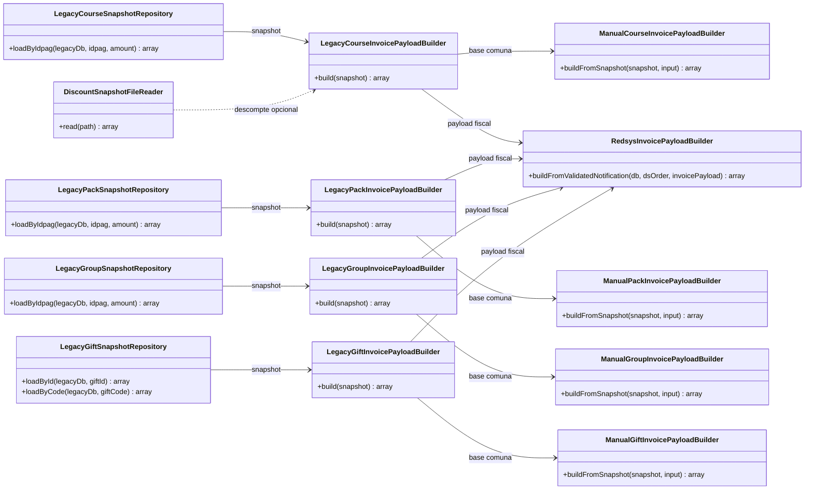
```mermaid
classDiagram
direction LR

class LegacyCourseSnapshotRepository {
  +loadByIdpag(legacyDb, idpag, amount) array
}
class LegacyPackSnapshotRepository {
  +loadByIdpag(legacyDb, idpag, amount) array
}
class LegacyGroupSnapshotRepository {
  +loadByIdpag(legacyDb, idpag, amount) array
}
class LegacyGiftSnapshotRepository {
  +loadById(legacyDb, giftId) array
  +loadByCode(legacyDb, giftCode) array
}
class LegacyCourseInvoicePayloadBuilder {
  +build(snapshot) array
}
class LegacyPackInvoicePayloadBuilder {
  +build(snapshot) array
}
class LegacyGroupInvoicePayloadBuilder {
  +build(snapshot) array
}
class LegacyGiftInvoicePayloadBuilder {
  +build(snapshot) array
}
class ManualCourseInvoicePayloadBuilder {
  +buildFromSnapshot(snapshot, input) array
}
class ManualPackInvoicePayloadBuilder {
  +buildFromSnapshot(snapshot, input) array
}
class ManualGroupInvoicePayloadBuilder {
  +buildFromSnapshot(snapshot, input) array
}
class ManualGiftInvoicePayloadBuilder {
  +buildFromSnapshot(snapshot, input) array
}
class RedsysInvoicePayloadBuilder {
  +buildFromValidatedNotification(db, dsOrder, invoicePayload) array
}
class DiscountSnapshotFileReader {
  +read(path) array
}

LegacyCourseSnapshotRepository --> LegacyCourseInvoicePayloadBuilder : snapshot
LegacyPackSnapshotRepository --> LegacyPackInvoicePayloadBuilder : snapshot
LegacyGroupSnapshotRepository --> LegacyGroupInvoicePayloadBuilder : snapshot
LegacyGiftSnapshotRepository --> LegacyGiftInvoicePayloadBuilder : snapshot

LegacyCourseInvoicePayloadBuilder --> ManualCourseInvoicePayloadBuilder : base comuna
LegacyPackInvoicePayloadBuilder --> ManualPackInvoicePayloadBuilder : base comuna
LegacyGroupInvoicePayloadBuilder --> ManualGroupInvoicePayloadBuilder : base comuna
LegacyGiftInvoicePayloadBuilder --> ManualGiftInvoicePayloadBuilder : base comuna
LegacyCourseInvoicePayloadBuilder --> RedsysInvoicePayloadBuilder : payload fiscal
LegacyPackInvoicePayloadBuilder --> RedsysInvoicePayloadBuilder : payload fiscal
LegacyGroupInvoicePayloadBuilder --> RedsysInvoicePayloadBuilder : payload fiscal
LegacyGiftInvoicePayloadBuilder --> RedsysInvoicePayloadBuilder : payload fiscal
DiscountSnapshotFileReader ..> LegacyCourseInvoicePayloadBuilder : descompte opcional
```

### 8.2. USOC, factura manual i moviments sobre factura

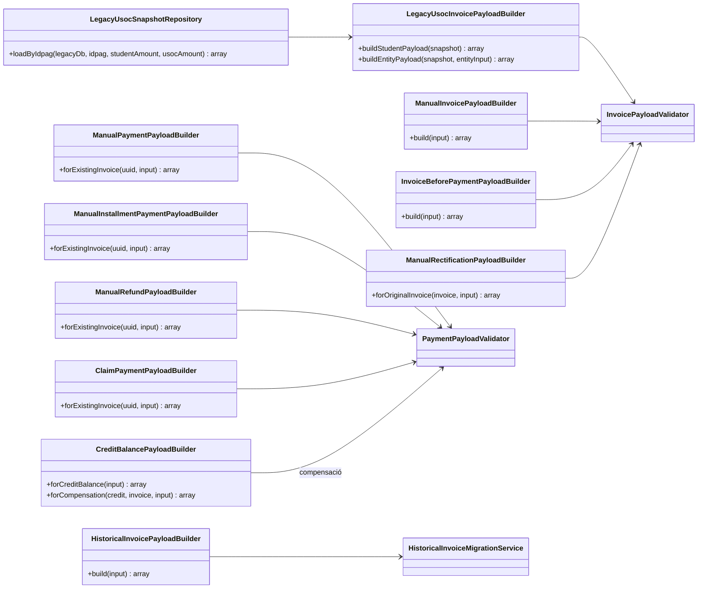
```mermaid
classDiagram
direction LR

class LegacyUsocSnapshotRepository {
  +loadByIdpag(legacyDb, idpag, studentAmount, usocAmount) array
}
class LegacyUsocInvoicePayloadBuilder {
  +buildStudentPayload(snapshot) array
  +buildEntityPayload(snapshot, entityInput) array
}
class ManualInvoicePayloadBuilder {
  +build(input) array
}
class InvoiceBeforePaymentPayloadBuilder {
  +build(input) array
}
class ManualPaymentPayloadBuilder {
  +forExistingInvoice(uuid, input) array
}
class ManualInstallmentPaymentPayloadBuilder {
  +forExistingInvoice(uuid, input) array
}
class ManualRefundPayloadBuilder {
  +forExistingInvoice(uuid, input) array
}
class ClaimPaymentPayloadBuilder {
  +forExistingInvoice(uuid, input) array
}
class ManualRectificationPayloadBuilder {
  +forOriginalInvoice(invoice, input) array
}
class CreditBalancePayloadBuilder {
  +forCreditBalance(input) array
  +forCompensation(credit, invoice, input) array
}
class HistoricalInvoicePayloadBuilder {
  +build(input) array
}
class InvoicePayloadValidator
class PaymentPayloadValidator

LegacyUsocSnapshotRepository --> LegacyUsocInvoicePayloadBuilder
LegacyUsocInvoicePayloadBuilder --> InvoicePayloadValidator
ManualInvoicePayloadBuilder --> InvoicePayloadValidator
InvoiceBeforePaymentPayloadBuilder --> InvoicePayloadValidator
ManualRectificationPayloadBuilder --> InvoicePayloadValidator
HistoricalInvoicePayloadBuilder --> HistoricalInvoiceMigrationService

ManualPaymentPayloadBuilder --> PaymentPayloadValidator
ManualInstallmentPaymentPayloadBuilder --> PaymentPayloadValidator
ManualRefundPayloadBuilder --> PaymentPayloadValidator
ClaimPaymentPayloadBuilder --> PaymentPayloadValidator
CreditBalancePayloadBuilder --> PaymentPayloadValidator : compensació
```

## 9. Documents, incidències, migració i compatibilitat `[BASE]`

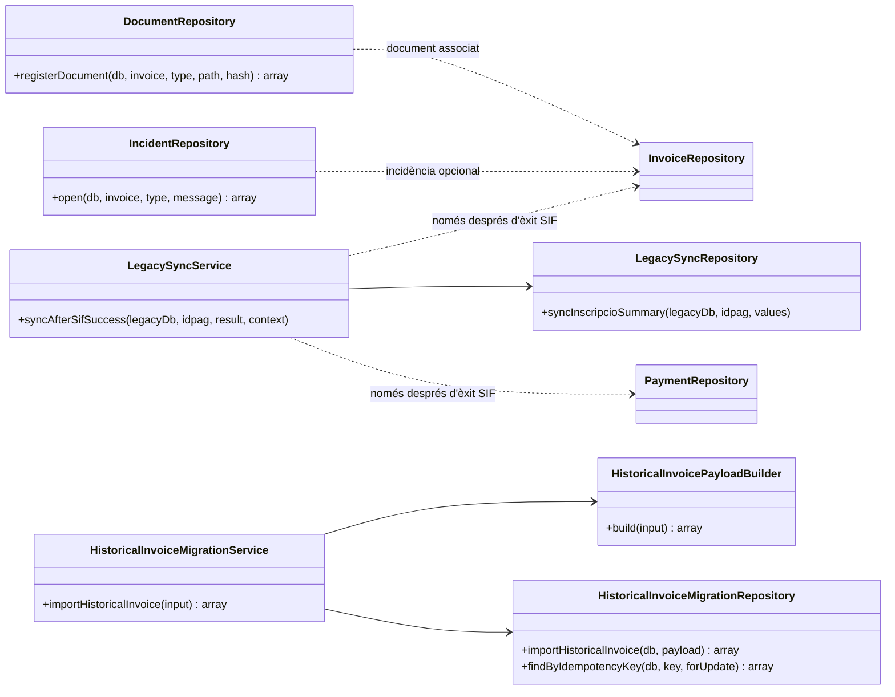
```mermaid
classDiagram
direction LR

class DocumentRepository {
  +registerDocument(db, invoice, type, path, hash) array
}
class IncidentRepository {
  +open(db, invoice, type, message) array
}
class LegacySyncService {
  +syncAfterSifSuccess(legacyDb, idpag, result, context)
}
class LegacySyncRepository {
  +syncInscripcioSummary(legacyDb, idpag, values)
}
class HistoricalInvoiceMigrationService {
  +importHistoricalInvoice(input) array
}
class HistoricalInvoicePayloadBuilder {
  +build(input) array
}
class HistoricalInvoiceMigrationRepository {
  +importHistoricalInvoice(db, payload) array
  +findByIdempotencyKey(db, key, forUpdate) array
}
class InvoiceRepository
class PaymentRepository

LegacySyncService --> LegacySyncRepository
HistoricalInvoiceMigrationService --> HistoricalInvoicePayloadBuilder
HistoricalInvoiceMigrationService --> HistoricalInvoiceMigrationRepository
DocumentRepository ..> InvoiceRepository : document associat
IncidentRepository ..> InvoiceRepository : incidència opcional
LegacySyncService ..> InvoiceRepository : només després d'èxit SIF
LegacySyncService ..> PaymentRepository : només després d'èxit SIF
```

`DocumentRepository` i `IncidentRepository` són peces persistents ja disponibles, però encara no hi ha un worker complet de PDF/QR/XML ni el workflow final del panell. `LegacySyncService` és explícit i posterior al SIF; no forma part de la transacció fiscal.

## 10. Classes del codi candidat i actual `[LEGACY/CANDIDAT]`

El primer inventari només contenia els 25 PHP de les dues carpetes candidates i deu classes principals. Ara `codi-drive/` també conté cinc còpies actuals amb 1.895 PHP. El diagrama següent continua representant estrictament les deu classes dels 25 fitxers candidats; no s'ha de confondre amb tot el codi actual.

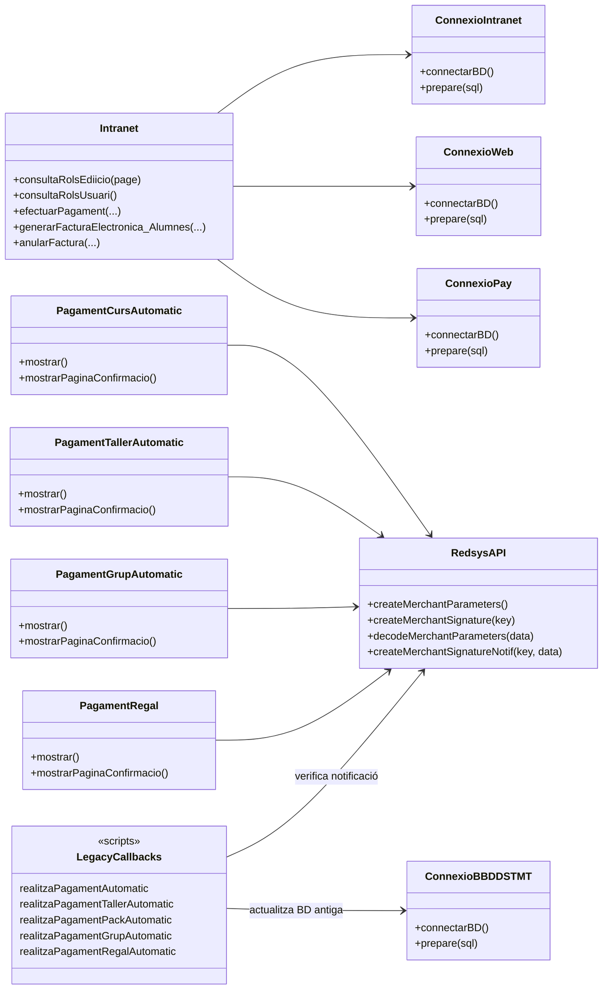
```mermaid
classDiagram
direction LR

class Intranet {
  +consultaRolsEdiicio(page)
  +consultaRolsUsuari()
  +efectuarPagament(...)
  +generarFacturaElectronica_Alumnes(...)
  +anularFactura(...)
}
class PagamentCursAutomatic {
  +mostrar()
  +mostrarPaginaConfirmacio()
}
class PagamentTallerAutomatic {
  +mostrar()
  +mostrarPaginaConfirmacio()
}
class PagamentGrupAutomatic {
  +mostrar()
  +mostrarPaginaConfirmacio()
}
class PagamentRegal {
  +mostrar()
  +mostrarPaginaConfirmacio()
}
class RedsysAPI {
  +createMerchantParameters()
  +createMerchantSignature(key)
  +decodeMerchantParameters(data)
  +createMerchantSignatureNotif(key, data)
}
class ConnexioBBDDSTMT {
  +connectarBD()
  +prepare(sql)
}
class ConnexioWeb {
  +connectarBD()
  +prepare(sql)
}
class ConnexioPay {
  +connectarBD()
  +prepare(sql)
}
class ConnexioIntranet {
  +connectarBD()
  +prepare(sql)
}
class LegacyCallbacks {
  <<scripts>>
  realitzaPagamentAutomatic
  realitzaPagamentTallerAutomatic
  realitzaPagamentPackAutomatic
  realitzaPagamentGrupAutomatic
  realitzaPagamentRegalAutomatic
}

PagamentCursAutomatic --> RedsysAPI
PagamentTallerAutomatic --> RedsysAPI
PagamentGrupAutomatic --> RedsysAPI
PagamentRegal --> RedsysAPI
LegacyCallbacks --> RedsysAPI : verifica notificació
LegacyCallbacks --> ConnexioBBDDSTMT : actualitza BD antiga
Intranet --> ConnexioIntranet
Intranet --> ConnexioWeb
Intranet --> ConnexioPay
```

L'objectiu de migració és substituir les escriptures fiscals disperses dels callbacks i d'`Intranet` per crides controlades a `InvoiceService` o `PaymentService`, mantenint `codi-drive/` només com a font de contrast.

### 10.1. Domini comercial i de pagament de `web-actual`

Aquest diagrama mostra les classes pròpies que intervenen en producte, inscripció, descompte, regal i pagament. Les relacions indiquen responsabilitat funcional observada; no impliquen que totes les classes cridin directament el SIF.

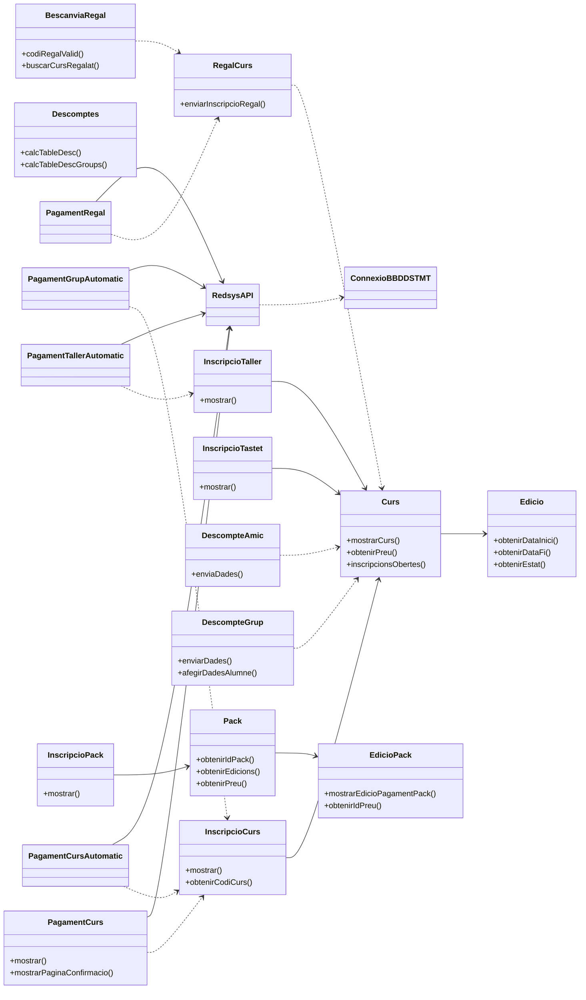
```mermaid
classDiagram
direction LR

class Curs {
  +mostrarCurs()
  +obtenirPreu()
  +inscripcionsObertes()
}
class Edicio {
  +obtenirDataInici()
  +obtenirDataFi()
  +obtenirEstat()
}
class Pack {
  +obtenirIdPack()
  +obtenirEdicions()
  +obtenirPreu()
}
class EdicioPack {
  +mostrarEdicioPagamentPack()
  +obtenirIdPreu()
}
class InscripcioCurs {
  +mostrar()
  +obtenirCodiCurs()
}
class InscripcioPack {
  +mostrar()
}
class InscripcioTaller {
  +mostrar()
}
class InscripcioTastet {
  +mostrar()
}
class Descomptes {
  +calcTableDesc()
  +calcTableDescGroups()
}
class DescompteAmic {
  +enviaDades()
}
class DescompteGrup {
  +enviarDades()
  +afegirDadesAlumne()
}
class RegalCurs {
  +enviarInscripcioRegal()
}
class BescanviaRegal {
  +codiRegalValid()
  +buscarCursRegalat()
}
class PagamentCurs {
  +mostrar()
  +mostrarPaginaConfirmacio()
}
class PagamentCursAutomatic
class PagamentTallerAutomatic
class PagamentGrupAutomatic
class PagamentRegal
class RedsysAPI
class ConnexioBBDDSTMT

Curs --> Edicio
Pack --> EdicioPack
InscripcioCurs --> Curs
InscripcioPack --> Pack
InscripcioTaller --> Curs
InscripcioTastet --> Curs
DescompteAmic ..> Curs
DescompteGrup ..> Curs
RegalCurs ..> Curs
BescanviaRegal ..> RegalCurs
PagamentCurs ..> InscripcioCurs
PagamentCursAutomatic ..> InscripcioCurs
PagamentTallerAutomatic ..> InscripcioTaller
PagamentGrupAutomatic ..> InscripcioCurs
PagamentRegal ..> RegalCurs
PagamentCurs --> RedsysAPI
PagamentCursAutomatic --> RedsysAPI
PagamentTallerAutomatic --> RedsysAPI
PagamentGrupAutomatic --> RedsysAPI
PagamentRegal --> RedsysAPI
RedsysAPI ..> ConnexioBBDDSTMT
```

### 10.2. Portals actuals que envolten el pagament

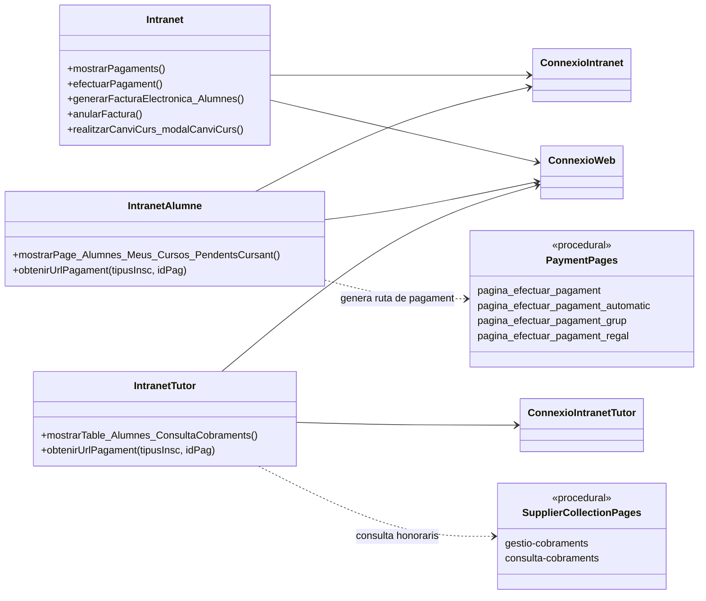
```mermaid
classDiagram
direction LR

class Intranet {
  +mostrarPagaments()
  +efectuarPagament()
  +generarFacturaElectronica_Alumnes()
  +anularFactura()
  +realitzarCanviCurs_modalCanviCurs()
}
class IntranetAlumne {
  +mostrarPage_Alumnes_Meus_Cursos_PendentsCursant()
  +obtenirUrlPagament(tipusInsc, idPag)
}
class IntranetTutor {
  +mostrarTable_Alumnes_ConsultaCobraments()
  +obtenirUrlPagament(tipusInsc, idPag)
}
class ConnexioIntranet
class ConnexioWeb
class ConnexioIntranetTutor
class PaymentPages {
  <<procedural>>
  pagina_efectuar_pagament
  pagina_efectuar_pagament_automatic
  pagina_efectuar_pagament_grup
  pagina_efectuar_pagament_regal
}
class SupplierCollectionPages {
  <<procedural>>
  gestio-cobraments
  consulta-cobraments
}

Intranet --> ConnexioIntranet
Intranet --> ConnexioWeb
IntranetAlumne --> ConnexioIntranet
IntranetAlumne --> ConnexioWeb
IntranetAlumne ..> PaymentPages : genera ruta de pagament
IntranetTutor --> ConnexioIntranetTutor
IntranetTutor --> ConnexioWeb
IntranetTutor ..> SupplierCollectionPages : consulta honoraris
```

`IntranetTutor` reutilitza un mètode d'URL de pagament, però el circuit `cobraments` de tutors tracta factures/rebuts i honoraris de col·laboradors. Es manté separat del SIF de factures emeses a alumnes.

### 10.3. Adaptadors que cal programar a `pay.prisma.cat` `[DISSENY]`

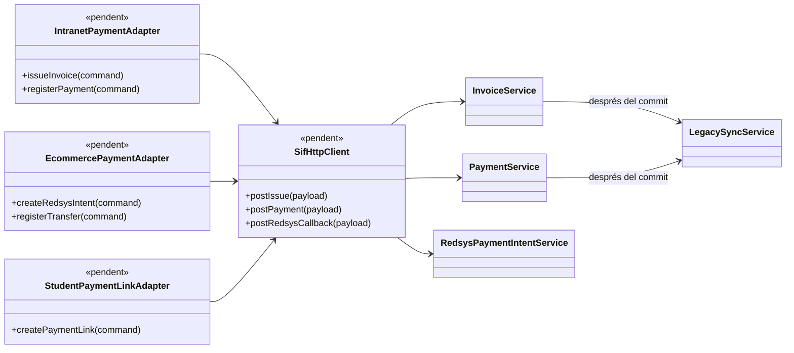
```mermaid
classDiagram
direction LR

class IntranetPaymentAdapter {
  <<pendent>>
  +issueInvoice(command)
  +registerPayment(command)
}
class EcommercePaymentAdapter {
  <<pendent>>
  +createRedsysIntent(command)
  +registerTransfer(command)
}
class StudentPaymentLinkAdapter {
  <<pendent>>
  +createPaymentLink(command)
}
class SifHttpClient {
  <<pendent>>
  +postIssue(payload)
  +postPayment(payload)
  +postRedsysCallback(payload)
}
class InvoiceService
class PaymentService
class RedsysPaymentIntentService
class LegacySyncService

IntranetPaymentAdapter --> SifHttpClient
EcommercePaymentAdapter --> SifHttpClient
StudentPaymentLinkAdapter --> SifHttpClient
SifHttpClient --> InvoiceService
SifHttpClient --> PaymentService
SifHttpClient --> RedsysPaymentIntentService
InvoiceService --> LegacySyncService : després del commit
PaymentService --> LegacySyncService : després del commit
```

Aquestes classes d'adaptació no existeixen encara amb aquests noms al codi revisat. Representen la responsabilitat que falta: la intranet i la web preparen una ordre autenticada, però la decisió fiscal i econòmica s'executa al SIF de `pay.prisma.cat`.

## 11. Catàleg exhaustiu de classes del checkout base

Aquest catàleg evita que una classe real quedi invisible encara que s'agrupi en un diagrama simplificat.

| Àrea | Classes presents |
| --- | --- |
| Base de dades | `ConnectionFactory`, `TransactionRunner` |
| Domini i errors | `HashCalculator`, `PaymentStatusCalculator`, `UuidGenerator`, `SifException` |
| HTTP | `JsonResponse` |
| Repositoris fiscals | `FiscalSequenceRepository`, `InvoiceRepository`, `PaymentRepository`, `RectificationRepository`, `DocumentRepository`, `IncidentRepository`, `CreditBalanceRepository`, `HistoricalInvoiceMigrationRepository` |
| Repositoris d'integració | `RedsysNotificationRepository`, `ManualPaymentInvoiceRepository`, `LegacyCourseSnapshotRepository`, `LegacyPackSnapshotRepository`, `LegacyGroupSnapshotRepository`, `LegacyGiftSnapshotRepository`, `LegacyUsocSnapshotRepository`, `LegacySyncRepository` |
| Serveis centrals | `InvoiceService`, `PaymentService`, `CreditBalanceService`, `HistoricalInvoiceMigrationService`, `LegacySyncService` |
| Validació i entrada | `InvoicePayloadValidator`, `PaymentPayloadValidator`, `DiscountSnapshotFileReader`, `RedsysSignatureValidator` |
| Payloads fiscals | `LegacyCourseInvoicePayloadBuilder`, `LegacyPackInvoicePayloadBuilder`, `LegacyGroupInvoicePayloadBuilder`, `LegacyGiftInvoicePayloadBuilder`, `LegacyUsocInvoicePayloadBuilder`, `RedsysInvoicePayloadBuilder`, `InvoiceBeforePaymentPayloadBuilder`, `ManualInvoicePayloadBuilder`, `HistoricalInvoicePayloadBuilder`, `ManualRectificationPayloadBuilder` |
| Payloads econòmics | `ManualPaymentPayloadBuilder`, `ManualInstallmentPaymentPayloadBuilder`, `ManualRefundPayloadBuilder`, `ClaimPaymentPayloadBuilder`, `CreditBalancePayloadBuilder` |
| Emissió manual | `InvoiceBeforePaymentService`, `ManualInvoiceService`, `ManualCourseInvoiceService`, `ManualPackInvoiceService`, `ManualGroupInvoiceService`, `ManualGiftInvoiceService`, `UsocEntityInvoiceService`, `ManualRectificationService` |
| Moviments manuals | `ManualPaymentService`, `ManualInstallmentPaymentService`, `ManualRefundService`, `ClaimPaymentService` |
| Emissió Redsys del checkout base | `RedsysCallbackService`, `RedsysCourseInvoiceService`, `RedsysPackInvoiceService`, `RedsysGroupInvoiceService`, `RedsysGiftInvoiceService`, `RedsysUsocInvoiceService` |

Total comprovat: **69 classes** al checkout base.

## 12. Addicions exclusives de `feature/redsys-async-queue`

| Classe | Funció |
| --- | --- |
| `RedsysPaymentIntentRepository` | Recupera i insereix la intenció immutable per `DS_ORDER`. |
| `RedsysCallbackQueueRepository` | Encola, reclama, reintenta, finalitza i recupera locks. |
| `RedsysPaymentIntentService` | Valida i crea la intenció abans de redirigir al TPV. |
| `RedsysCallbackWorker` | Processa un job i decideix èxit, reintent o incidència. |
| `RedsysCallbackDispatcher` | Selecciona el handler per `SOURCE_TYPE`. |
| `RedsysIntentHandler` | Contracte dels cinc orquestradors de canal. |
| `RedsysJobProcessor` | Contracte consumit pel worker. |

Total addicional comprovat: **7 classes o interfícies**, fins a **76 peces PHP orientades a objectes** entre checkout base i branca asíncrona.

## 13. Classes de prova i arnès executable

El recompte anterior és de codi de producció de `sif/src`; no inclou les classes de prova. El checkout base conté, a més, 112 classes `*Test` i 234 mètodes `test*` distribuïts en 117 fitxers PHP. La branca asíncrona puja a 118 classes de prova, 276 mètodes i 123 fitxers PHP de prova.

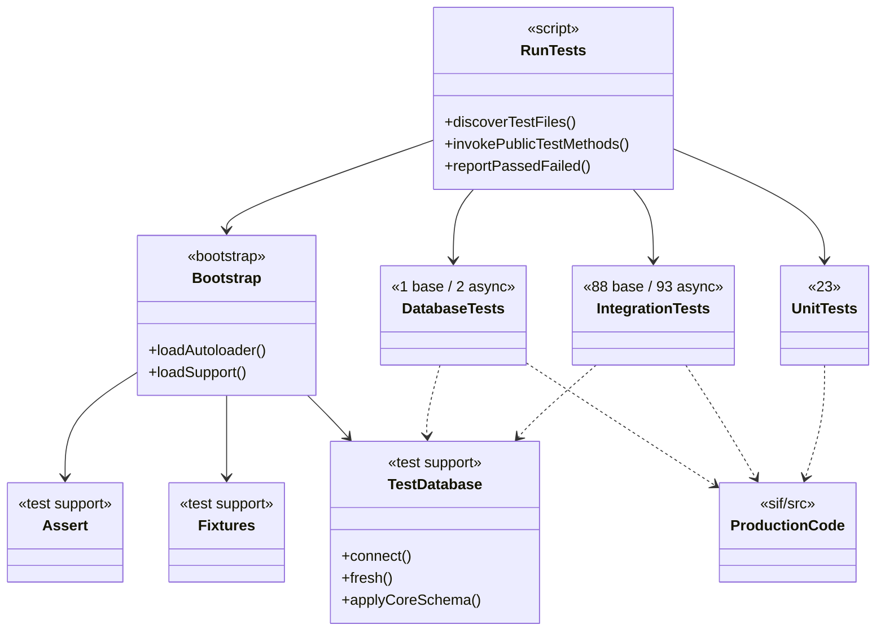
```mermaid
classDiagram
  class RunTests {
    <<script>>
    +discoverTestFiles()
    +invokePublicTestMethods()
    +reportPassedFailed()
  }

  class Bootstrap {
    <<bootstrap>>
    +loadAutoloader()
    +loadSupport()
  }

  class Assert {
    <<test support>>
  }

  class Fixtures {
    <<test support>>
  }

  class TestDatabase {
    <<test support>>
    +connect()
    +fresh()
    +applyCoreSchema()
  }

  class DatabaseTests {
    <<1 base / 2 async>>
  }

  class IntegrationTests {
    <<88 base / 93 async>>
  }

  class UnitTests {
    <<23>>
  }

  class ProductionCode {
    <<sif/src>>
  }

  RunTests --> Bootstrap
  RunTests --> DatabaseTests
  RunTests --> IntegrationTests
  RunTests --> UnitTests
  Bootstrap --> Assert
  Bootstrap --> Fixtures
  Bootstrap --> TestDatabase
  DatabaseTests ..> TestDatabase
  IntegrationTests ..> TestDatabase
  DatabaseTests ..> ProductionCode
  IntegrationTests ..> ProductionCode
  UnitTests ..> ProductionCode
```

Les 36 declaracions de classe auxiliars addicionals detectades dins fitxers de prova són dobles, subclasses o classes anònimes de suport; no formen part de l'API de producció ni del conjunt de classes `*Test` que descobreix el runner.

## 14. Descomposició de la classe monolítica `Intranet`

La còpia `intranet-actual/Intranet.php` té 39.229 línies, 510 declaracions `function`, 304 mètodes públics, 117 privats i 89 sense visibilitat explícita. La candidata `intranet-nova-canvis-verifactu/Intranet.php` és més antiga o incompleta: 37.603 línies, 495 funcions, 292 públiques, 117 privades i 86 sense visibilitat. Un únic rectangle amagaria aquesta superfície; per això es mostra per famílies funcionals.


```mermaid
flowchart TB
  Intranet[Intranet actual<br/>510 funcions / 304 públiques]

  Intranet --> Navigation[Navegació, menú i rols]
  Intranet --> Student[Cerca, fitxa i inscripcions]
  Intranet --> Payments[Pagaments, assignacions i fraccions]
  Intranet --> Billing[Factures, proformes i entitats]
  Intranet --> Changes[Canvi de curs, baixa i devolució]
  Intranet --> Discounts[Validació de descomptes]
  Intranet --> Debt[Reclamacions i morositat]
  Intranet --> Comms[Correus i notificacions]
  Intranet --> Courses[Cursos, Moodle, certificats i comunicats]
  Intranet --> Other[Altres mòduls no fiscals]

  Payments --> P1[mostrarPagaments]
  Payments --> P2[mostrarModalConfPag]
  Payments --> P3[efectuarPagament]
  Billing --> F1[generarFacturaElectronica_Alumnes]
  Billing --> F2[buscarUsuaris_Factures]
  Billing --> F3[guardarDadesFactura_Factures]
  Billing --> F4[anularFactura]
  Billing --> F5[generaFacturaProforma]
  Changes --> C1[realitzarCanviCurs_modalCanviCurs]
  Changes --> C2[confirmaBaixa_modalDonarBaixa]
  Discounts --> D1[sendMsgValidatCurosDescomptes]
  Debt --> M1[saveMoneyClaim_DonarBaixa]
  Comms --> N1[MailSMTPComvive i plantilles]
```

Només les famílies que poden crear, cobrar, corregir, mostrar o comunicar una factura entren al perímetre SIF. Cursos, Moodle, certificats acadèmics, comunicats, calendaris i màrqueting continuen sent dependències o funcionalitats de negoci, però no s'han de confondre amb classes del motor fiscal.

## 15. Dependències ara localitzades i exclusions

Les cinc còpies actuals han aportat dependències que abans només estaven referenciades: `IntranetProva.php`, `ConnexioMoodle.php`, `ConnexioMoodleAntic.php`, `MailSMTPComvive.php`, `MailSMTPComviveBBCC.php`, `Text.php`, `Date.php`, `Numero.php`, `Template.php` i `Usuari.php`. També han aparegut `IntranetAlumne`, `IntranetTutor` i moltes classes de catàleg/inscripció de la web.

Això no converteix en classes de domini SIF les biblioteques incorporades com PHPMailer, NuSOAP o Dompdf, ni les còpies datades i de prova. Els fitxers de paràmetres i qualsevol literal sensible queden fora del model i s'han de sanejar abans d'afegir les còpies actuals a Git.

## 16. Serveis de gestió i registre que faltaven `[DISSENY]`

Els diagrames anteriors cobreixen bé el nucli d'emissió i cobrament, però no representaven amb prou precisió la transformació de les accions administratives actuals. Les classes següents són responsabilitats de disseny: no s'han detectat amb aquests noms al codi actual.

### 16.1. Classificació de canvis administratius

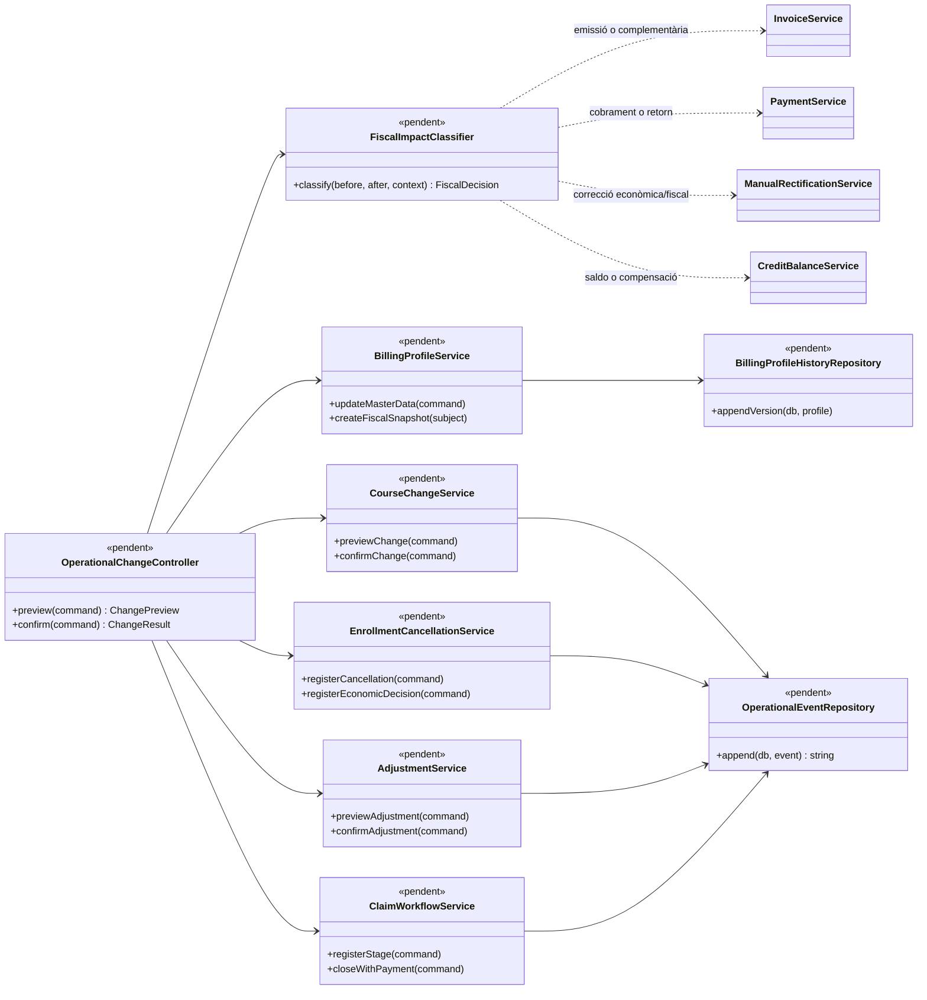
```mermaid
classDiagram
direction LR

class OperationalChangeController {
  <<pendent>>
  +preview(command) ChangePreview
  +confirm(command) ChangeResult
}
class FiscalImpactClassifier {
  <<pendent>>
  +classify(before, after, context) FiscalDecision
}
class BillingProfileService {
  <<pendent>>
  +updateMasterData(command)
  +createFiscalSnapshot(subject)
}
class CourseChangeService {
  <<pendent>>
  +previewChange(command)
  +confirmChange(command)
}
class EnrollmentCancellationService {
  <<pendent>>
  +registerCancellation(command)
  +registerEconomicDecision(command)
}
class AdjustmentService {
  <<pendent>>
  +previewAdjustment(command)
  +confirmAdjustment(command)
}
class ClaimWorkflowService {
  <<pendent>>
  +registerStage(command)
  +closeWithPayment(command)
}
class OperationalEventRepository {
  <<pendent>>
  +append(db, event) string
}
class BillingProfileHistoryRepository {
  <<pendent>>
  +appendVersion(db, profile)
}
class InvoiceService
class PaymentService
class ManualRectificationService
class CreditBalanceService

OperationalChangeController --> FiscalImpactClassifier
OperationalChangeController --> BillingProfileService
OperationalChangeController --> CourseChangeService
OperationalChangeController --> EnrollmentCancellationService
OperationalChangeController --> AdjustmentService
OperationalChangeController --> ClaimWorkflowService
BillingProfileService --> BillingProfileHistoryRepository
CourseChangeService --> OperationalEventRepository
EnrollmentCancellationService --> OperationalEventRepository
AdjustmentService --> OperationalEventRepository
ClaimWorkflowService --> OperationalEventRepository
FiscalImpactClassifier ..> InvoiceService : emissió o complementària
FiscalImpactClassifier ..> PaymentService : cobrament o retorn
FiscalImpactClassifier ..> ManualRectificationService : correcció econòmica/fiscal
FiscalImpactClassifier ..> CreditBalanceService : saldo o compensació
```

Aquest bloc substitueix conceptualment els updates dispersos de `guardarDadesPagament_modalsresultatCerca()`, `realitzarCanviCurs_modalCanviCurs()`, `confirmaBaixa_modalDonarBaixa()`, `guardarDadesFactura_Factures()` i `anularFactura()`. El controlador no modifica una factura: construeix una proposta, la classifica i executa serveis específics.

### 16.2. Registres fiscals, evidències i operació

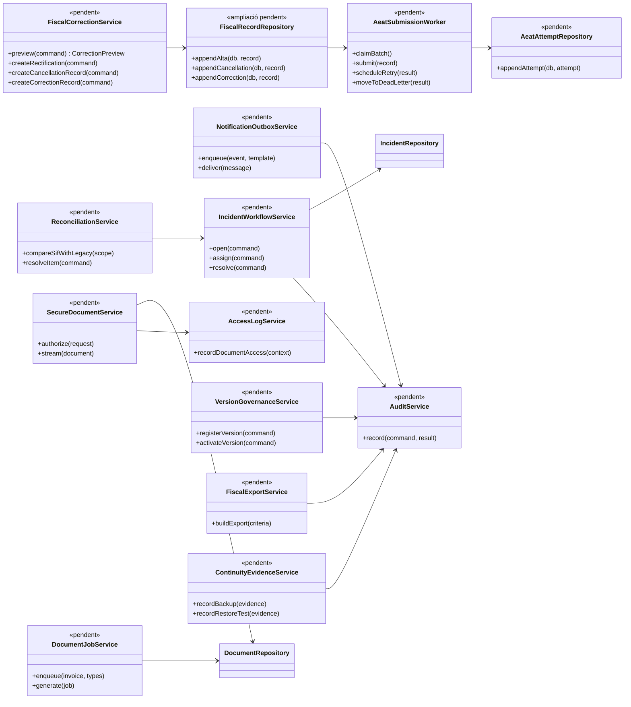
```mermaid
classDiagram
direction LR

class FiscalCorrectionService {
  <<pendent>>
  +preview(command) CorrectionPreview
  +createRectification(command)
  +createCancellationRecord(command)
  +createCorrectionRecord(command)
}
class FiscalRecordRepository {
  <<ampliació pendent>>
  +appendAlta(db, record)
  +appendCancellation(db, record)
  +appendCorrection(db, record)
}
class AeatSubmissionWorker {
  <<pendent>>
  +claimBatch()
  +submit(record)
  +scheduleRetry(result)
  +moveToDeadLetter(result)
}
class AeatAttemptRepository {
  <<pendent>>
  +appendAttempt(db, attempt)
}
class DocumentJobService {
  <<pendent>>
  +enqueue(invoice, types)
  +generate(job)
}
class SecureDocumentService {
  <<pendent>>
  +authorize(request)
  +stream(document)
}
class NotificationOutboxService {
  <<pendent>>
  +enqueue(event, template)
  +deliver(message)
}
class IncidentWorkflowService {
  <<pendent>>
  +open(command)
  +assign(command)
  +resolve(command)
}
class AuditService {
  <<pendent>>
  +record(command, result)
}
class AccessLogService {
  <<pendent>>
  +recordDocumentAccess(context)
}
class VersionGovernanceService {
  <<pendent>>
  +registerVersion(command)
  +activateVersion(command)
}
class FiscalExportService {
  <<pendent>>
  +buildExport(criteria)
}
class ReconciliationService {
  <<pendent>>
  +compareSifWithLegacy(scope)
  +resolveItem(command)
}
class ContinuityEvidenceService {
  <<pendent>>
  +recordBackup(evidence)
  +recordRestoreTest(evidence)
}
class DocumentRepository
class IncidentRepository

FiscalCorrectionService --> FiscalRecordRepository
FiscalRecordRepository --> AeatSubmissionWorker
AeatSubmissionWorker --> AeatAttemptRepository
DocumentJobService --> DocumentRepository
SecureDocumentService --> DocumentRepository
SecureDocumentService --> AccessLogService
NotificationOutboxService --> AuditService
IncidentWorkflowService --> IncidentRepository
IncidentWorkflowService --> AuditService
FiscalExportService --> AuditService
VersionGovernanceService --> AuditService
ReconciliationService --> IncidentWorkflowService
ContinuityEvidenceService --> AuditService
```

`DocumentRepository` i `IncidentRepository` ja existeixen, però el seu esquema i API actuals no equivalen al workflow complet anterior. `FiscalRecordRepository` representa l'ampliació de `factura_registres`; no exigeix necessàriament una taula amb aquest nom.

### 16.3. Frontera de seguretat comuna

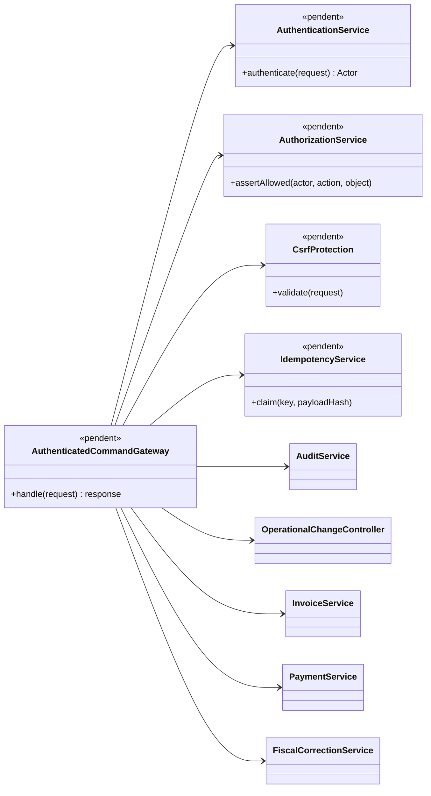
```mermaid
classDiagram
direction LR

class AuthenticatedCommandGateway {
  <<pendent>>
  +handle(request) response
}
class AuthenticationService {
  <<pendent>>
  +authenticate(request) Actor
}
class AuthorizationService {
  <<pendent>>
  +assertAllowed(actor, action, object)
}
class CsrfProtection {
  <<pendent>>
  +validate(request)
}
class IdempotencyService {
  <<pendent>>
  +claim(key, payloadHash)
}
class AuditService
class OperationalChangeController
class InvoiceService
class PaymentService
class FiscalCorrectionService

AuthenticatedCommandGateway --> AuthenticationService
AuthenticatedCommandGateway --> AuthorizationService
AuthenticatedCommandGateway --> CsrfProtection
AuthenticatedCommandGateway --> IdempotencyService
AuthenticatedCommandGateway --> AuditService
AuthenticatedCommandGateway --> OperationalChangeController
AuthenticatedCommandGateway --> InvoiceService
AuthenticatedCommandGateway --> PaymentService
AuthenticatedCommandGateway --> FiscalCorrectionService
```

La validació visual de botons o rols del menú no substitueix aquesta frontera. Tota comanda crítica ha de passar pel mateix control, encara que provingui d'AJAX antic, d'un endpoint nou, d'un worker o del panell SIF.

La matriu completa de gestions, registres i criteris de tancament és `38-matriu-transformacio-funcional-verifactu.md`.

### 16.4. Traça universal d'accions sobre pagaments `[DISSENY/BLOQUEJANT]`

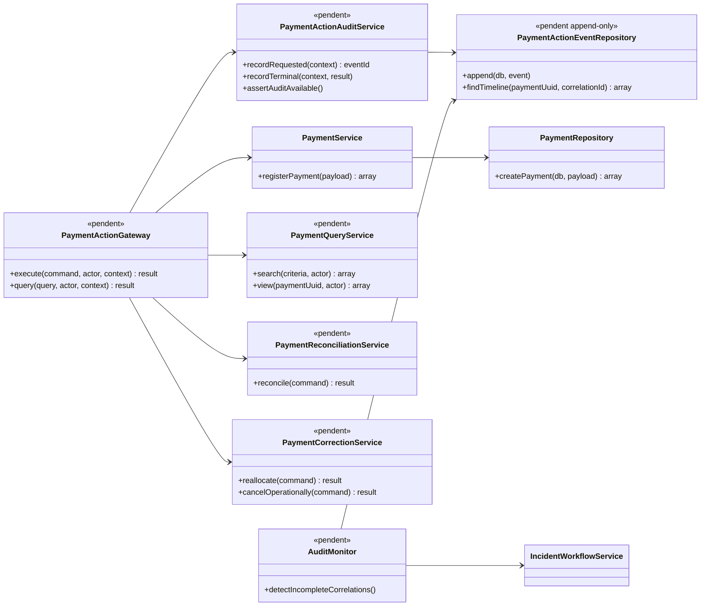
```mermaid
classDiagram
direction LR

class PaymentActionGateway {
  <<pendent>>
  +execute(command, actor, context) result
  +query(query, actor, context) result
}
class PaymentActionAuditService {
  <<pendent>>
  +recordRequested(context) eventId
  +recordTerminal(context, result)
  +assertAuditAvailable()
}
class PaymentActionEventRepository {
  <<pendent append-only>>
  +append(db, event)
  +findTimeline(paymentUuid, correlationId) array
}
class PaymentService {
  +registerPayment(payload) array
}
class PaymentRepository {
  +createPayment(db, payload) array
}
class PaymentQueryService {
  <<pendent>>
  +search(criteria, actor) array
  +view(paymentUuid, actor) array
}
class PaymentReconciliationService {
  <<pendent>>
  +reconcile(command) result
}
class PaymentCorrectionService {
  <<pendent>>
  +reallocate(command) result
  +cancelOperationally(command) result
}
class AuditMonitor {
  <<pendent>>
  +detectIncompleteCorrelations()
}
class IncidentWorkflowService

PaymentActionGateway --> PaymentActionAuditService
PaymentActionGateway --> PaymentService
PaymentActionGateway --> PaymentQueryService
PaymentActionGateway --> PaymentReconciliationService
PaymentActionGateway --> PaymentCorrectionService
PaymentService --> PaymentRepository
PaymentActionAuditService --> PaymentActionEventRepository
AuditMonitor --> PaymentActionEventRepository
AuditMonitor --> IncidentWorkflowService
```

`PaymentService` i `PaymentRepository` existeixen, però actualment no depenen d'un ledger d'accions. El gateway i el servei d'auditoria han de cobrir tots els entorns i aplicar `fail closed`: si no es pot registrar l'acció, no es pot executar ni retornar la consulta.

## 17. Operació comercial prèvia a factura i pagament `[DISSENY/BLOQUEJANT]`

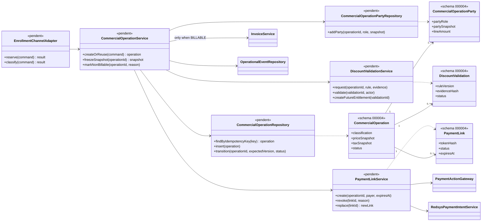
```mermaid
classDiagram
direction LR

class EnrollmentChannelAdapter {
  <<pendent>>
  +reserve(command) result
  +classify(command) result
}
class CommercialOperationService {
  <<pendent>>
  +createOrReuse(command) operation
  +freezeSnapshot(operationId) snapshot
  +markNonBillable(operationId, reason)
}
class CommercialOperationRepository {
  <<pendent>>
  +findByIdempotencyKey(key) operation
  +insert(operation)
  +transition(operationId, expectedVersion, status)
}
class CommercialOperationPartyRepository {
  <<pendent>>
  +addParty(operationId, role, snapshot)
}
class DiscountValidationService {
  <<pendent>>
  +request(operationId, rule, evidence)
  +validate(validationId, actor)
  +createFutureEntitlement(validationId)
}
class PaymentLinkService {
  <<pendent>>
  +create(operationId, payer, expiresAt)
  +revoke(linkId, reason)
  +replace(linkId) newLink
}
class RedsysPaymentIntentService
class InvoiceService
class PaymentActionGateway
class OperationalEventRepository
class CommercialOperation {
  <<schema 000004>>
  +classification
  +priceSnapshot
  +taxSnapshot
  +status
}
class CommercialOperationParty {
  <<schema 000004>>
  +partyRole
  +partySnapshot
  +lineAmount
}
class DiscountValidation {
  <<schema 000004>>
  +ruleVersion
  +evidenceHash
  +status
}
class PaymentLink {
  <<schema 000004>>
  +tokenHash
  +status
  +expiresAt
}

EnrollmentChannelAdapter --> CommercialOperationService
CommercialOperationService --> CommercialOperationRepository
CommercialOperationService --> CommercialOperationPartyRepository
CommercialOperationService --> DiscountValidationService
CommercialOperationService --> PaymentLinkService
CommercialOperationService --> OperationalEventRepository
PaymentLinkService --> PaymentActionGateway
PaymentLinkService --> RedsysPaymentIntentService
CommercialOperationService --> InvoiceService : only when BILLABLE
CommercialOperationRepository ..> CommercialOperation
CommercialOperationPartyRepository ..> CommercialOperationParty
DiscountValidationService ..> DiscountValidation
PaymentLinkService ..> PaymentLink
CommercialOperation "1" --> "1..*" CommercialOperationParty
CommercialOperation "1" --> "0..*" DiscountValidation
CommercialOperation "1" --> "0..*" PaymentLink
```

Les quatre classes marcades `schema 000004` representen taules ja descrites a
la migració, no classes PHP implementades. Aquest límit evita tornar a confondre
una inscripció o un `IDPAG` amb factura, intenció Redsys o pagament.
