# 32 - Diagrames de seqüència del SIF

## 1. Abast i llegenda

Els diagrames descriuen el comportament observable del codi i els contractes documentats. Les etiquetes d'estat són:

- `[BASE]`: implementat al checkout `checkpoint/sif-fase-0-4`;
- `[ASYNC]`: implementat a `feature/redsys-async-queue`;
- `[PARCIAL]`: nucli implementat, però integració final de pantalla, permisos, entorn o desplegament encara pendent;
- `[DISSENY]`: flux acordat sense implementació executable completa detectada.

## 2. Emetre o reutilitzar una factura `[BASE]`

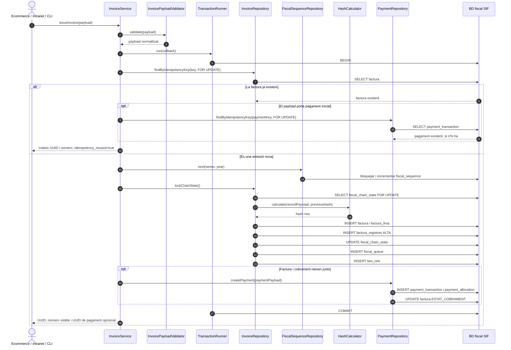

Si una inserció concurrent provoca una clau duplicada, `InvoiceService` torna a obrir una transacció, rellegeix per `IDEMPOTENCY_KEY` i retorna la factura guanyadora sense consumir un segon número.

## 3. Factura abans de cobrar i cobrament posterior `[PARCIAL]`

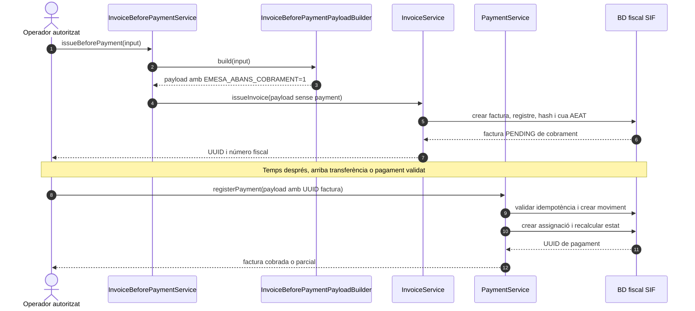

La pantalla final, l'autorització servidor i les evidències de preproducció continuen pendents, però els dos contractes de servei estan implementats.

## 4. Callback i worker Redsys `[ASYNC]`

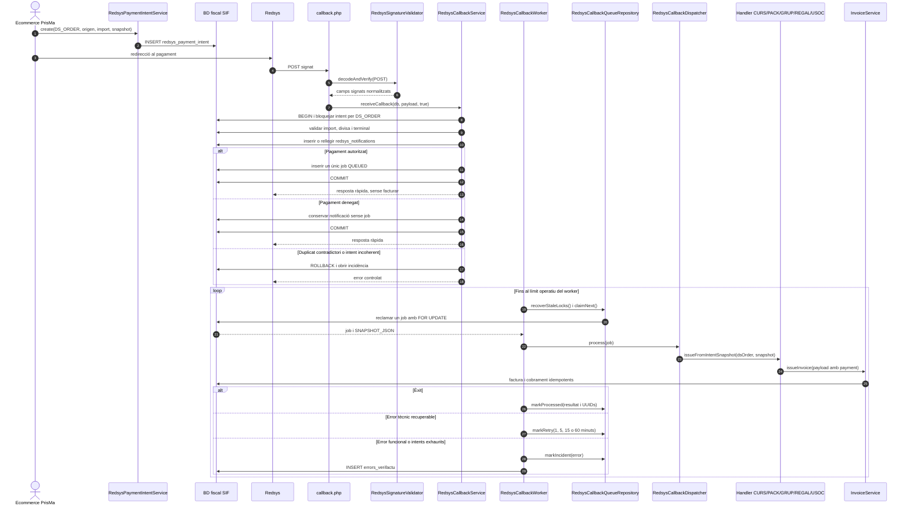

El worker no rellegeix la BD legacy per recalcular la factura: el `SNAPSHOT_JSON` de la intenció és la font immutable. La sincronització legacy automàtica queda fora del primer tall perquè encara no és idempotent.

## 5. Rectificació i devolució són seqüències diferents `[PARCIAL]`

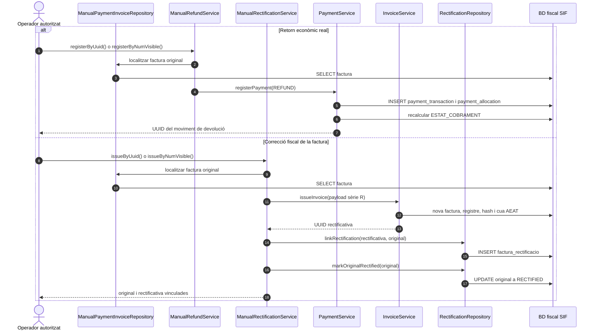

Una devolució pot requerir després una rectificativa, però no són el mateix moviment. El codi actual implementa els dos circuits manuals per separat. `RegistroAnulacion` i subsanació AEAT continuen en estat `[DISSENY]`.

## 6. Consulta i resolució d'incidència `[DISSENY]`

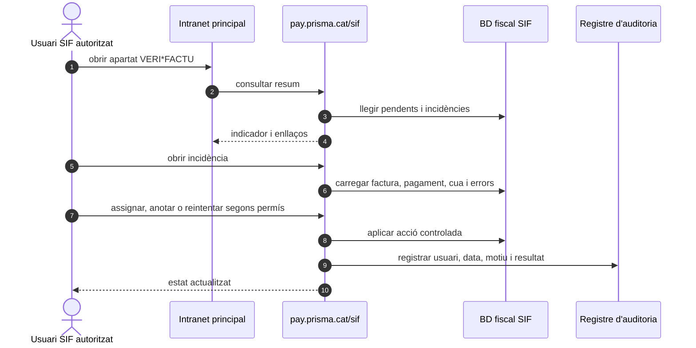

Aquest últim diagrama és el contracte operatiu previst. No s'ha identificat encara el panell complet ni una capa comuna d'autorització/auditoria executable al codi `sif/` revisat.

## 7. Seqüència AEAT encara pendent `[DISSENY]`

La cadena fins a `fiscal_queue` ja existeix en l'emissió. El tram següent encara necessita client/worker AEAT, certificat de client, XML/XSD, resposta i reintents:

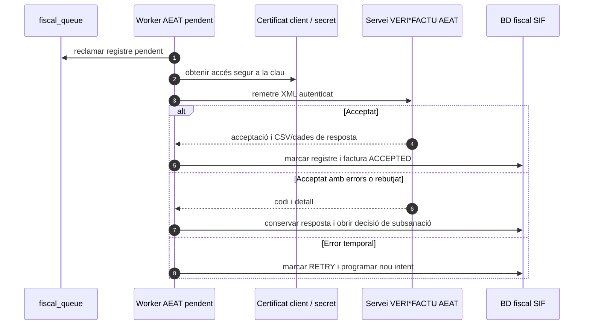

No s'ha de confondre aquesta seqüència prevista amb funcionalitat disponible per activar en producció.

## 8. Curs, taller o jornada amb descompte `[ASYNC/PARCIAL]`

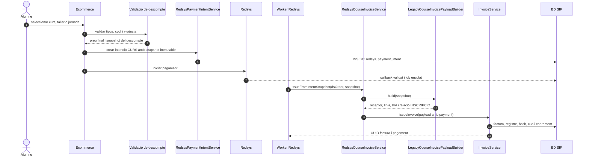

Taller i jornada comparteixen el patró de curs, però necessiten prova específica de concepte, URL i payload. La congelació de descomptes està preparada; la integració ecommerce final continua parcial.

## 9. Pack `[BASE/ASYNC/PARCIAL]`

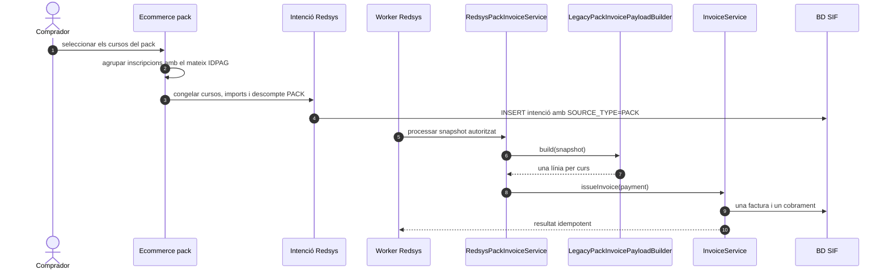

La regla funcional és una factura per pagament real i una línia per curs. Queden per validar el SQL legacy final de preus/pack i les proves amb dades reals.

## 10. Grup de persones `[BASE/ASYNC/PARCIAL]`

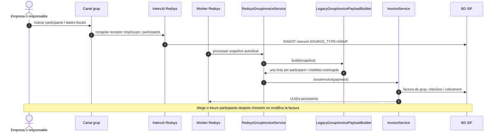

Un canvi posterior de participants deriva a rectificativa, complementària, devolució o saldo. Falta validar `descomptes_grup`, dades reals de `respGrups` i permisos de visibilitat.

## 11. Regal: compra i bescanvi `[BASE/ASYNC/PARCIAL]`

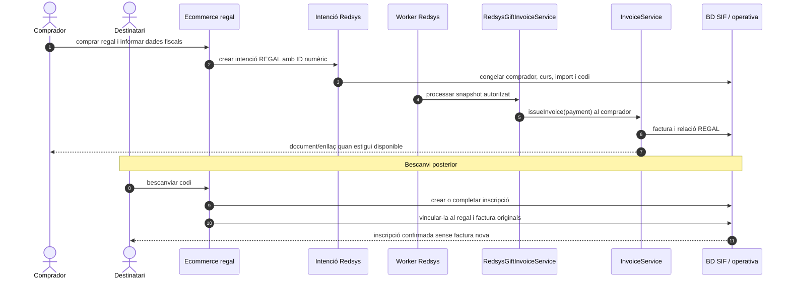

La facturació del comprador està preparada. El bescanvi, caducitat, doble ús, correus i targeta regal final encara necessiten integració i proves.

## 12. USOC: dues factures relacionades `[BASE/ASYNC/PARCIAL]`

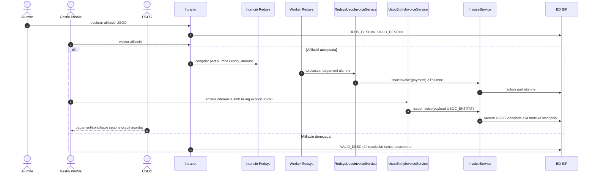

La factura d'entitat és deliberadament separada i no s'emet automàticament des del callback de l'alumne. Falten dades fiscals reals d'USOC i decisió final sobre `anticipi-preu-usoc`.

## 13. Emissió manual de curs, pack, grup o regal `[BASE/PARCIAL]`

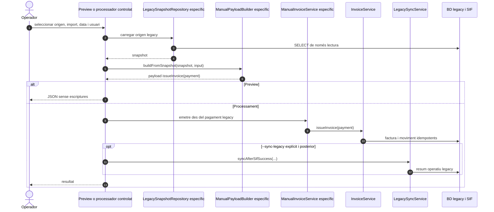

El patró existeix per curs, pack, grup i regal. La sincronització legacy no forma part de la transacció fiscal i no s'executa automàticament al worker asíncron.

## 14. Factura manual lliure controlada `[BASE/PARCIAL]`

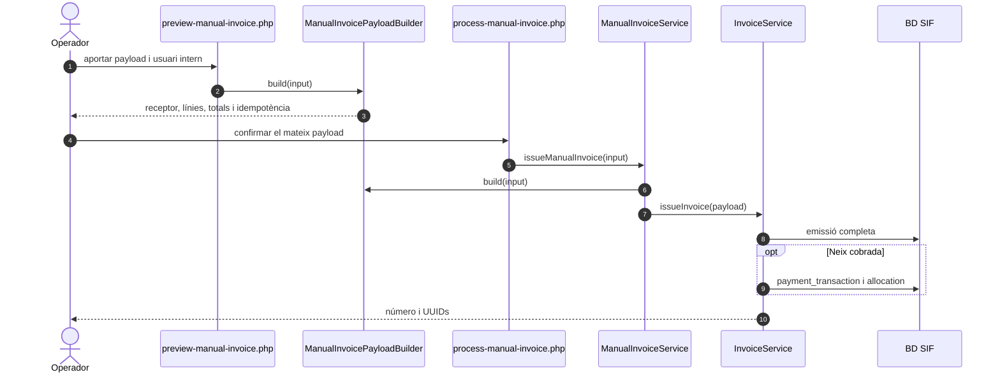

Falten la pantalla definitiva, l'autorització comuna servidor, correus i enllaç segur.

## 15. Transferència, fracció i cobrament de reclamació `[BASE/PARCIAL]`

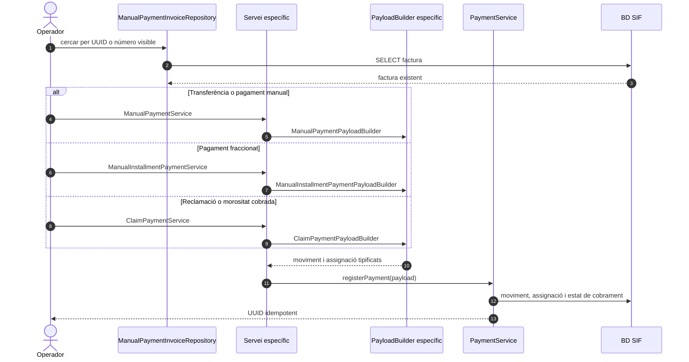

Cap variant emet una factura nova si la factura ja existeix. Les pantalles, referència bancària final i correus/URLs de reclamació continuen pendents.

## 16. Crear i aplicar saldo `[BASE/PARCIAL]`

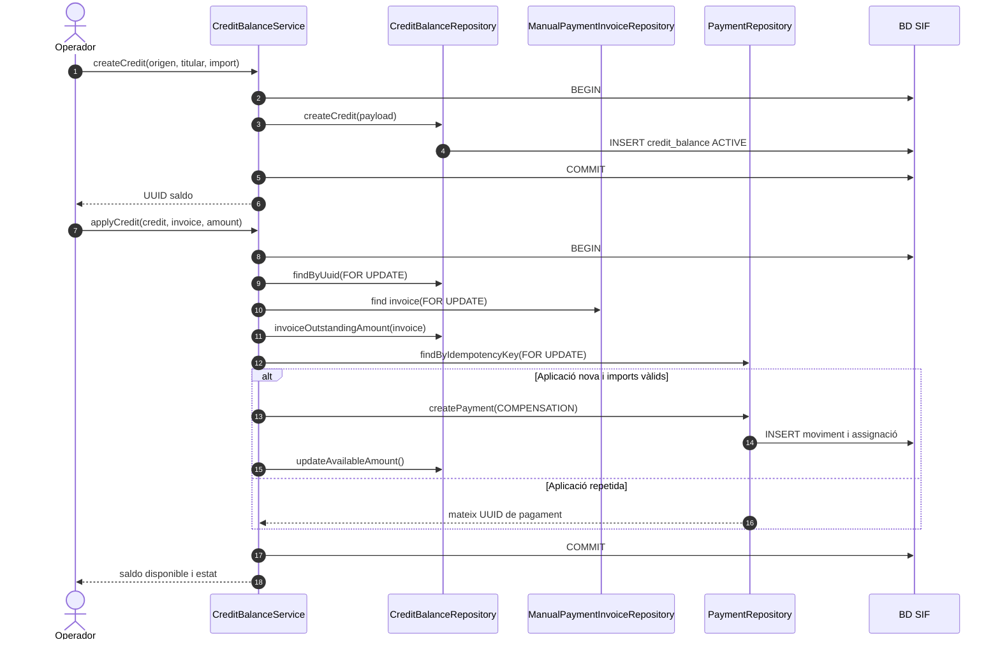

La baixa o el canvi de curs que origina el saldo i la rectificativa fiscal corresponent són decisions separades del consum posterior.

## 17. Migrar factura històrica `[BASE/PARCIAL]`

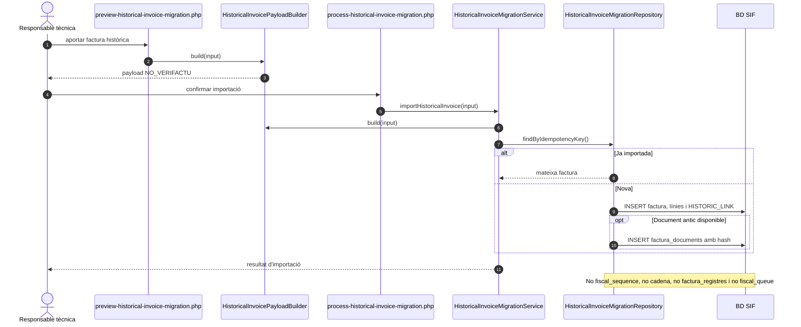

Falten execució amb dades reals, totals de control i criteri final de tall de numeració.

## 18. Generar i servir PDF, QR o XML `[PARCIAL/DISSENY]`

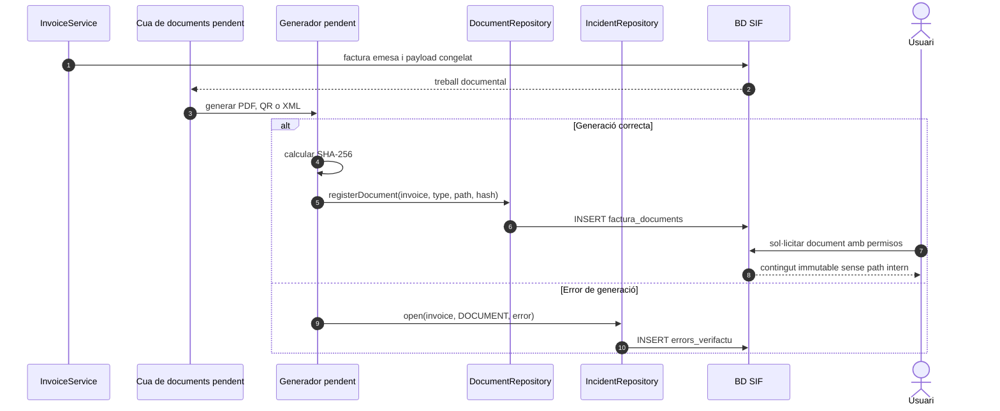

El repositori de documents i el registre d'incidències existeixen; la cua/generador i el servei segur de descàrrega encara no.

## 19. Preflight, preview, processament i go/no-go `[BASE]`

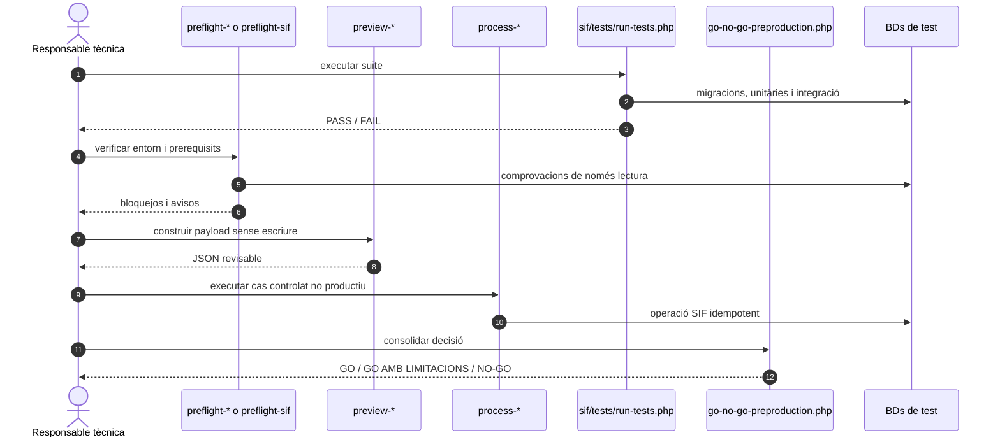

El checkout base conté 14 preflights, 20 previews, 20 processadors i 2 scripts d'infraestructura. La branca asíncrona hi afegeix el preflight i el processador de la cua Redsys.

## 20. Sincronització legacy posterior `[BASE/PARCIAL]`

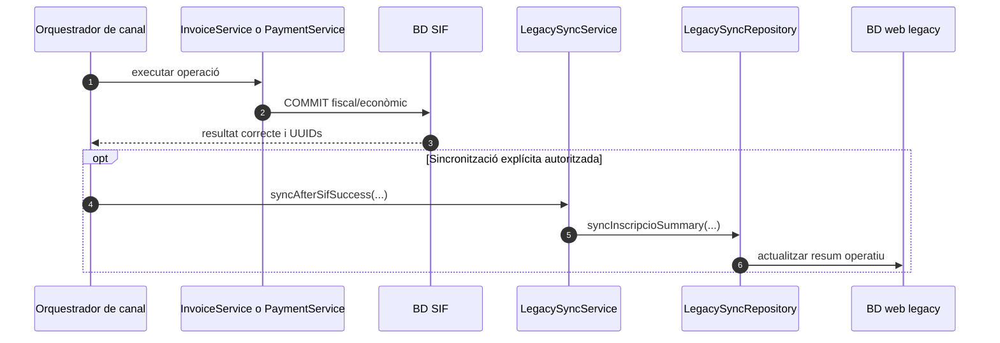

Si la sincronització legacy falla, no es desfà la factura o el pagament SIF. El worker Redsys asíncron l'exclou fins que l'actualització d'observacions sigui idempotent.

## 21. Canvi de curs i baixa `[DISSENY/PARCIAL]`

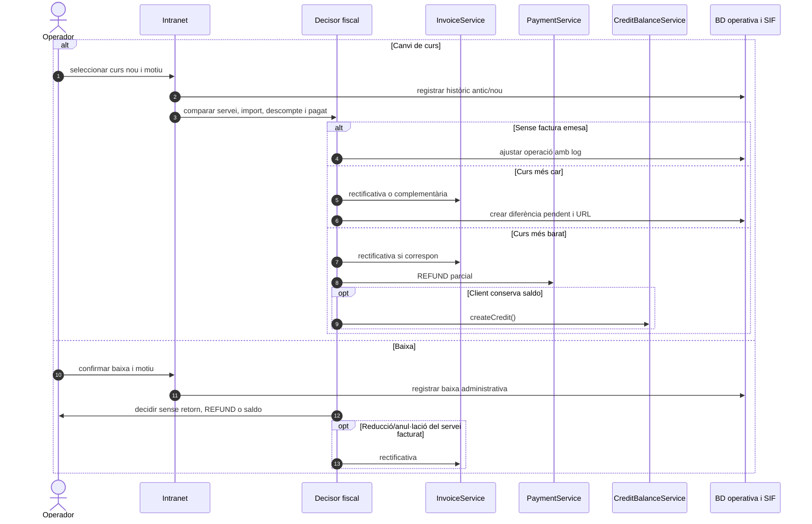

El codi legacy de canvi/baixa està identificat i els serveis econòmics/fiscals parcials existeixen, però falta l'orquestrador final que uneixi decisió, permisos, pantalla i auditoria.

## 22. Conciliació de fitxer TPV `[DISSENY]`

```mermaid
sequenceDiagram
autonumber
actor Operador
participant Intranet
participant Analyzer as Analitzador TPV pendent
participant DB as BD SIF
participant Invoice as InvoiceService
participant Payment as PaymentService
participant Incident as IncidentRepository

Operador->>Intranet: pujar fitxer TPV
Intranet->>Analyzer: validar format, hash, usuari i línies
Analyzer->>DB: cercar intenció, notificació, moviment i factura
alt CONCILIADA
  Analyzer->>DB: registrar auditoria
else DUPLICADA
  Analyzer-->>Operador: cap efecte nou
else PENDENT_ASSIGNACIO
  Analyzer->>Payment: proposar registerPayment()
else PENDENT_EMISSIO
  Analyzer->>Invoice: proposar issueInvoice(payment)
else INCIDENCIA
  Analyzer->>Incident: open(TPV, detall)
end
Analyzer-->>Operador: resum per estat
```

La lògica i els resultats estan definits documentalment, però l'analitzador SIF executable encara no s'ha detectat.

## 23. Endpoint real `POST /api/payments/register` `[BASE]`

```mermaid
sequenceDiagram
  autonumber
  actor Client as Intranet o adaptador autoritzat
  participant Endpoint as payments/register.php
  participant JSON as JsonResponse
  participant Config as config/sif.php
  participant DB as ConnectionFactory
  participant Service as PaymentService
  participant Tx as TransactionRunner
  participant Validator as PaymentPayloadValidator
  participant Repo as PaymentRepository

  Client->>Endpoint: POST JSON de cobrament
  Endpoint->>JSON: fromInput()
  alt JSON invàlid
    JSON-->>Client: 400 Invalid JSON
  else JSON vàlid
    Endpoint->>Config: require configuració
    Endpoint->>DB: make(config)
    Endpoint->>Service: registerPayment(payload)
    Service->>Tx: run(callback)
    Tx->>Validator: validate(payload)
    Tx->>Repo: findByIdempotencyKey()
    alt moviment existent
      Repo-->>Client: 200 resultat reutilitzat
    else moviment nou
      Tx->>Repo: createTransactionAndAllocations()
      Tx->>Repo: refreshInvoicePaymentStatus()
      Tx-->>Client: 200 UUID i estat
    end
  end
```

L'endpoint existeix al checkout base. No incorpora encara una capa comuna d'autenticació/autorització; aquesta responsabilitat ha de quedar al frontal servidor o afegir-se abans d'exposar-lo.

## 24. Callback Redsys del checkout base `[BASE]`

```mermaid
sequenceDiagram
  autonumber
  participant Redsys
  participant Endpoint as redsys/callback.php
  participant Signature as RedsysSignatureValidator
  participant Callback as RedsysCallbackService
  participant Notification as RedsysNotificationRepository
  participant DB as BD SIF

  Redsys->>Endpoint: POST notificació i dades signades
  Endpoint->>Signature: decodeAndVerify(POST, GET)
  Signature-->>Endpoint: ds_order, idpag, import, resposta
  Endpoint->>Callback: receiveCallback(DB, payload, true)
  Callback->>Callback: validatePayload()
  Callback->>Callback: statusForResponseCode()
  Callback->>Notification: recordReceived(...)
  Notification->>DB: INSERT o recuperar duplicat
  DB-->>Callback: notification_id, status, duplicate
  Callback-->>Redsys: JSON ok
```

En aquesta base el callback només valida i registra la notificació. No valida encara contra `redsys_payment_intent`, no crea un job i no emet factura; aquestes operacions són de la branca asíncrona.

## 25. Crear la intenció abans de redirigir a Redsys `[ASYNC/PARCIAL]`

```mermaid
sequenceDiagram
  autonumber
  actor Buyer as Alumne o pagador
  participant Channel as Ecommerce/adaptador pendent
  participant Intent as RedsysPaymentIntentService
  participant Repo as RedsysPaymentIntentRepository
  participant DB as BD SIF
  participant Redsys

  Buyer->>Channel: confirmar compra
  Channel->>Channel: construir snapshot immutable
  Channel->>Intent: create(ds_order, origen, import, moneda, terminal, snapshot)
  Intent->>Intent: validar i normalitzar
  Intent->>Repo: findByDsOrder(ds_order)
  alt mateixa intenció
    Repo-->>Intent: reutilitzar UUID_INTENT
  else DS_ORDER contradictori
    Repo-->>Channel: 409 conflicte
  else nova intenció
    Intent->>Repo: insert(intent)
    Repo->>DB: INSERT redsys_payment_intent
  end
  Intent-->>Channel: intenció persistent
  Channel->>Redsys: redirecció amb paràmetres signats
```

El servei i repositori existeixen a `feature/redsys-async-queue`, però no hi ha un quart endpoint públic d'intencions al repositori. L'adaptador ecommerce que el cridi continua pendent d'integració.

## 26. Resultats alternatius del callback asíncron `[ASYNC]`

```mermaid
sequenceDiagram
  autonumber
  participant Redsys
  participant Callback as RedsysCallbackService
  participant Intent as PaymentIntentRepository
  participant Notification as NotificationRepository
  participant Queue as CallbackQueueRepository
  participant Incident as IncidentRepository

  Redsys->>Callback: callback verificat
  Callback->>Intent: findByDsOrder(for update)
  alt intenció desconeguda
    Callback-->>Redsys: 422
  else import, moneda o terminal no coincideixen
    Callback->>Incident: open(REDSYS_CALLBACK)
    Callback-->>Redsys: 422
  else callback denegat
    Callback->>Notification: recordReceived(ERROR)
    Callback-->>Redsys: ok sense job
  else callback autoritzat
    Callback->>Notification: recordReceived(VALIDATED)
    Callback->>Queue: enqueue(notification, intent)
    alt duplicat equivalent
      Queue-->>Callback: mateix job/resultat
    else notificació nova
      Queue-->>Callback: PENDING
    end
    Callback-->>Redsys: ok immediat
  end
```

## 27. Recuperació de locks, reintents i incidència Redsys `[ASYNC]`

```mermaid
sequenceDiagram
  autonumber
  participant Cron
  participant Script as process-redsys-callback-queue.php
  participant Queue as RedsysCallbackQueueRepository
  participant Worker as RedsysCallbackWorker
  participant Dispatcher as RedsysCallbackDispatcher
  participant Incident as IncidentRepository

  Cron->>Script: executar worker_id
  Script->>Queue: recoverStaleLocks(now)
  Script->>Worker: runOne(db, worker_id, now)
  Worker->>Queue: claimNext()
  alt cua buida
    Worker-->>Script: processed=false
  else job reclamat
    Worker->>Dispatcher: process(job)
    alt èxit idempotent
      Worker->>Queue: markProcessed(result)
    else error recuperable i intents menors que 5
      Worker->>Queue: markRetry(1, 5, 15 o 60 min)
    else límit o error final
      Worker->>Queue: markIncident(error)
      Worker->>Incident: open(REDSYS_CALLBACK_QUEUE)
    end
  end
```

## 28. Autorització i auditoria abans d'una operació fiscal `[DISSENY]`

```mermaid
sequenceDiagram
  autonumber
  actor User as Usuari intern
  participant UI as Intranet o panell SIF
  participant Auth as Sessió, rol i CSRF pendents
  participant Adapter as Adaptador servidor
  participant SIF as Servei SIF
  participant Audit as Registre d'esdeveniments pendent

  User->>UI: demanar emissió, cobrament o rectificació
  UI->>Auth: validar sessió, rol i segon control
  alt no autoritzat
    Auth-->>User: 403 sense efecte
  else autoritzat
    Auth->>Adapter: identitat, acció i abast
    Adapter->>Adapter: validar payload, motiu i idempotència
    Adapter->>SIF: executar operació
    SIF-->>Adapter: UUID, estat o error
    Adapter->>Audit: usuari, data, acció, objecte i resultat
    Adapter-->>User: resposta controlada
  end
```

La capa `Auth` i un audit log transversal no estan implementats als tres endpoints revisats; el diagrama és un requisit de frontera, no una descripció del codi actual.

## 29. Descàrrega segura de PDF, QR o XML `[DISSENY/PARCIAL]`

```mermaid
sequenceDiagram
  autonumber
  actor Viewer as Alumne, empresa, operador o auditor
  participant UI as Canal de consulta
  participant Auth as Autorització servidor
  participant Invoice as InvoiceRepository
  participant Relations as fact_rels
  participant Docs as DocumentRepository
  participant Storage as Emmagatzematge fora del webroot
  participant Audit as Auditoria

  Viewer->>UI: consultar o descarregar document
  UI->>Auth: identitat i recurs sol·licitat
  Auth->>Invoice: carregar factura immutable
  Auth->>Relations: validar receptor, visibilitat i abast
  alt sense permís o document no disponible
    Auth-->>Viewer: 403 o 404
  else autoritzat
    Auth->>Docs: obtenir metadades i hash
    Docs->>Storage: llegir fitxer sense exposar path
    Storage-->>Viewer: stream amb tipus i nom controlats
    Auth->>Audit: registrar consulta/descàrrega
  end
```

## 30. Outbox de notificacions i correus `[DISSENY]`

```mermaid
sequenceDiagram
  autonumber
  participant Domain as Factura, pagament o incidència
  participant Outbox as Outbox pendent
  participant Worker as Worker de notificacions pendent
  participant Docs as Documents SIF
  participant SMTP as Servei de correu
  participant Log as Auditoria d'enviament

  Domain->>Outbox: crear missatge amb tipus, receptor i objecte
  Worker->>Outbox: reclamar pendent
  Worker->>Docs: comprovar document/enllaç disponible
  alt dades o document incomplets
    Worker->>Outbox: RETRY o INCIDENT
  else preparat
    Worker->>SMTP: enviar plantilla versionada
    SMTP-->>Worker: acceptat o error
    Worker->>Log: persistir destinatari, plantilla i resultat
  end
```

Els correus directes del llegat no equivalen a aquesta outbox. La persistència, les plantilles versionades i el worker continuen pendents.

## 31. Detectar divergència entre SIF i BD antiga `[DISSENY]`

```mermaid
sequenceDiagram
  autonumber
  participant Monitor as Procés de reconciliació pendent
  participant SIF as BD SIF
  participant Legacy as BD web/intranet/pay
  participant Incident as errors_verifactu
  actor Operator as Responsable tècnica

  Monitor->>SIF: llegir factura, pagament i fact_rels
  Monitor->>Legacy: llegir IDPAG, FACT_REL, estat i import
  Monitor->>Monitor: comparar existència, imports i vincles
  alt concordança
    Monitor->>SIF: registrar control correcte
  else divergència
    Monitor->>Incident: open(LEGACY_DIVERGENCE, detall)
    Operator->>Incident: revisar sense editar factura emesa
    Operator->>SIF: executar compensació, rectificativa o sync controlada
  end
```

## 32. Backup, restauració i prova de continuïtat `[DISSENY]`

```mermaid
sequenceDiagram
  autonumber
  participant Scheduler as Planificador
  participant DB as BD SIF
  participant Storage as Còpia xifrada
  participant Verify as Verificador
  actor Technical as Responsable tècnica
  participant Restore as Entorn de restauració

  Scheduler->>DB: snapshot consistent
  Scheduler->>Storage: escriure còpia xifrada i checksum
  Verify->>Storage: validar checksum, retenció i llegibilitat
  Technical->>Restore: restaurar còpia seleccionada
  Restore->>Verify: comprovar taules, hashes, documents i cues
  Verify-->>Technical: evidència de RPO/RTO i resultat
```

## 33. Flux web de pagament de la còpia legacy `[LEGACY]`

```mermaid
sequenceDiagram
  autonumber
  actor Buyer as Alumne o pagador
  participant Page as pagina_efectuar_pagament_*.php
  participant Payment as Pagament*Automatic
  participant Ajax as ajax/efectuarPagament*.php
  participant API as RedsysAPI
  participant Redsys
  participant Callback as realitzaPagament*Automatic.php
  participant LegacyDB as ConnexioBBDDSTMT/Web/Pay/Intranet
  participant Mail as Correu legacy

  Buyer->>Page: obrir URL de pagament
  Page->>Payment: carregar curs, taller, grup o regal
  Payment->>LegacyDB: consultar operació i preu
  Buyer->>Ajax: confirmar forma de pagament
  Ajax->>API: crear paràmetres i signatura
  Ajax-->>Buyer: formulari/redirecció TPV
  Buyer->>Redsys: autoritzar pagament
  Redsys->>Callback: notificació segons origen
  Callback->>API: verificar resposta
  Callback->>LegacyDB: inserir factura/pagament i actualitzar inscripció
  opt notificació al client
    Callback->>Mail: enviar confirmació
  end
```

Aquest és el comportament històric de referència que s'ha de substituir per intenció, callback curt, worker i serveis SIF; no s'ha d'activar directament des de `codi-drive`.

## 34. Càrrega de configuració i resposta d'error `[BASE]`

```mermaid
sequenceDiagram
  autonumber
  participant Request as Petició HTTP o script
  participant Entrypoint as Entrypoint PHP
  participant Config as config/sif.php
  participant Env as Variables SIF_*
  participant Factory as ConnectionFactory
  participant PDO
  participant JSON as JsonResponse

  Request->>Entrypoint: iniciar operació
  Entrypoint->>Config: require
  Config->>Env: llegir entorn, BD, legacy, emissor, sèries i Redsys
  Entrypoint->>Factory: make() o makeLegacy()
  alt DSN absent o connexió fallida
    Factory-->>Entrypoint: Throwable
    Entrypoint->>JSON: fromThrowable()
    JSON-->>Request: codi 4xx/5xx i error JSON
  else connexió correcta
    Factory->>PDO: ERRMODE_EXCEPTION i utf8mb4
    PDO-->>Entrypoint: connexió
  end
```

Els valors locals per defecte són útils per a test, però secrets, DSN productius i clau Redsys han d'entrar per configuració protegida; no s'han d'afegir al repositori.

## 35. Enllaç de pagament des de la intranet de l'alumne `[LEGACY/OBJECTIU]`

```mermaid
sequenceDiagram
  autonumber
  actor Student as Alumne
  participant Portal as Intranet alumne
  participant LegacyDB as BD intranet
  participant Adapter as Adaptador d'enllaç pendent
  participant Pay as pay.prisma.cat
  participant Intent as RedsysPaymentIntentService

  Student->>Portal: consultar cursos i imports pendents
  Portal->>LegacyDB: llegir A_PAGAR, PAGAMENT, IDPAG i TIPUS_INSC
  LegacyDB-->>Portal: pendent i context comercial
  Note over Portal: Avui obtenirUrlPagament xifra IDPAG<br/>i genera /pagament o /pagaments
  Portal->>Adapter: demanar enllaç/intenció segura
  Adapter->>Pay: ordre autenticada amb context servidor
  Pay->>Intent: crear DS_ORDER i snapshot immutable
  Intent-->>Pay: intenció persistent
  Pay-->>Portal: URL/token opac amb caducitat
  Portal-->>Student: obrir pàgina de pagament
```

L'objectiu elimina l'autoritat fiscal d'`IDPAG`: pot continuar com a correlació llegat, però l'enllaç i la intenció els crea `pay.prisma.cat`.

## 36. Pagament o factura iniciats des de la intranet principal `[OBJECTIU]`

```mermaid
sequenceDiagram
  autonumber
  actor Staff as Operador
  participant Intranet
  participant Adapter as Adaptador intranet pendent
  participant Pay as pay.prisma.cat
  participant Invoice as InvoiceService
  participant Payment as PaymentService
  participant SifDB as BD SIF
  participant LegacyDB as BD intranet/web

  Staff->>Intranet: confirmar factura o cobrament
  Intranet->>Adapter: ordre, usuari, rol i origen legacy
  Adapter->>LegacyDB: carregar snapshot necessari
  Adapter->>Pay: petició autenticada i idempotent
  alt cal emetre factura
    Pay->>Invoice: issueInvoice(payload)
    Invoice->>SifDB: número, hash, registre i cua fiscal
  else factura SIF existent
    Pay->>Payment: registerPayment(payload)
    Payment->>SifDB: moviment i assignació
  end
  SifDB-->>Pay: commit
  Pay-->>Adapter: UUID, número i estat
  Adapter->>LegacyDB: sync mínima posterior al commit
  Adapter-->>Intranet: resultat traçable
  Intranet-->>Staff: confirmació o incidència
```

Les funcions llegades `efectuarPagament*`, `generaFactura*`, `anularFactura` i els fluxos de canvi/baixa no s'han de reimplementar dins el canal: han de traduir-se a ordres del SIF o a operacions específiques ja documentades.

## 37. Venda web i Redsys centralitzats a `pay.prisma.cat` `[ASYNC/OBJECTIU]`

```mermaid
sequenceDiagram
  autonumber
  actor Buyer as Alumne o pagador
  participant Web as Web/ecommerce
  participant Adapter as Adaptador ecommerce pendent
  participant Pay as pay.prisma.cat
  participant Intent as Servei d'intencions
  participant Redsys
  participant Callback as Callback curt
  participant Queue as Cua Redsys
  participant Worker
  participant SIF as Serveis Invoice/Payment
  participant Legacy as BD llegades

  Buyer->>Web: inscriure curs, pack, grup o regal
  Web->>Adapter: dades comercials i de facturació
  Adapter->>Pay: crear intenció amb snapshot immutable
  Pay->>Intent: reservar DS_ORDER
  Pay-->>Web: formulari Redsys signat
  Web-->>Buyer: redirigir al TPV
  Buyer->>Redsys: autoritzar
  Redsys->>Callback: notificació signada
  Callback->>Queue: conservar i encolar
  Callback-->>Redsys: resposta ràpida
  Worker->>Queue: claim únic
  Worker->>SIF: emetre/reutilitzar factura i cobrament
  SIF-->>Worker: commit idempotent
  Worker->>Legacy: sincronització mínima posterior
```

Aquest flux substitueix els callbacks `realitzaPagament*` que avui actualitzen directament `factures` i `inscripcions`.

## 38. Reconciliar codi candidat amb codi actual abans del desplegament `[CONTROL]`

```mermaid
sequenceDiagram
  autonumber
  actor Technical as Responsable tècnica
  participant Actual as Còpia *-actual
  participant Candidate as Carpeta canvis-verifactu
  participant Diff as Inventari/diff
  participant Tests as Proves per canal
  participant Preprod as Preproducció

  Technical->>Diff: seleccionar punts d'entrada actius
  Diff->>Actual: calcular classes, mètodes i rutes vigents
  Diff->>Candidate: detectar iguals, canvis i absències
  Diff-->>Technical: 14 idèntics, 8 diferents, 3 sense homòleg
  Technical->>Candidate: integrar adaptadors sense perdre canvis actuals
  Candidate->>Tests: curs, taller, jornada, pack, grup, regal i USOC
  Tests->>Preprod: executar amb SIF i BDs de prova
  alt traça completa i sense escriptura fiscal duplicada
    Preprod-->>Technical: candidat a GO
  else divergència, secret o doble escriptura
    Preprod-->>Technical: NO-GO i incidència
  end
```

## 39. Factures de tutors i col·laboradors `[ADJACENT]`

```mermaid
sequenceDiagram
  autonumber
  actor Tutor as Tutor o col·laborador
  participant Portal as Intranet col·laboradors
  participant Cobraments as Mòdul cobraments
  participant DB as BD cobraments/honoraris
  participant Mail as Facturació/secretaria
  participant SIF as SIF de vendes

  Tutor->>Portal: gestionar tutoria, duo, autoria o coordinació
  Portal->>DB: consultar honoraris, bestretes i pagats
  Tutor->>Cobraments: adjuntar factura o rebut PDF
  Cobraments->>DB: inserir registre de cobrament del tutor
  Cobraments->>Mail: enviar avís i document
  Cobraments-->>Tutor: confirmar recepció
  Note over SIF: Circuit de proveïdors separat<br/>no emet factura de venda a alumne
```

Si en el futur s'ha d'integrar comptabilitat de factures rebudes, caldrà un abast diferent del motor de factures emeses VERI*FACTU.

## 40. Editar dades mestres sense alterar factures emeses `[DISSENY]`

```mermaid
sequenceDiagram
  autonumber
  actor Operator as Gestió
  participant UI as Fitxa alumne o entitat
  participant Gateway as Gateway segur
  participant Profile as BillingProfileService
  participant History as Historial de dades
  participant SIF as Consulta SIF
  participant Audit as Auditoria

  Operator->>UI: proposar canvi de NIF, nom o adreça
  UI->>Gateway: comanda, motiu i versió llegida
  Gateway->>SIF: consultar factures relacionades
  SIF-->>Gateway: snapshots emesos i estats
  Gateway->>Profile: actualitzar només dades mestres
  Profile->>History: conservar abans/després, actor i motiu
  Profile->>Audit: registrar resultat
  Profile-->>UI: canvi aplicable a futures factures
  alt cal corregir una factura emesa
    UI-->>Operator: oferir decisor de correcció fiscal separat
  else no cal correcció
    UI-->>Operator: confirmar dades mestres actualitzades
  end
```

## 41. Canvi de curs o baixa com a event abans de l'efecte fiscal `[DISSENY/PARCIAL]`

```mermaid
sequenceDiagram
  autonumber
  actor Operator as Gestió
  participant UI as Intranet
  participant Change as OperationalChangeController
  participant Classifier as FiscalImpactClassifier
  participant Events as Registre d'events
  participant Invoice as InvoiceService
  participant Payment as PaymentService
  participant Credit as CreditBalanceService
  participant RectSvc as RectificationService

  Operator->>UI: indicar canvi/baixa, motiu i proposta
  UI->>Change: preview amb estat i versió llegida
  Change->>Classifier: comparar operació i factura
  Classifier-->>Change: sense efecte / diferència / retorn / saldo / rectificació
  Change-->>UI: previsualització i registres previstos
  Operator->>UI: confirmar
  UI->>Change: comanda idempotent
  Change->>Events: append event administratiu
  alt diferència nova facturable
    Change->>Invoice: factura complementària o nova emissió
  else cobrament posterior
    Change->>Payment: registrar i assignar cobrament
  else saldo a favor
    Change->>Credit: crear crèdit
  else reducció de factura emesa
    Change->>RectSvc: crear rectificativa
  else sense efecte fiscal
    Change->>Events: tancar event sense acció fiscal
  end
  Change-->>UI: resultat, UUIDs i pendents
```

## 42. Decidir entre rectificativa, anul·lació i subsanació `[DISSENY/BLOQUEJANT]`

```mermaid
sequenceDiagram
  autonumber
  actor Technical as Responsable autoritzada
  participant UI as Panell SIF
  participant Gateway as Gateway segur
  participant Classifier as FiscalImpactClassifier
  participant Correction as FiscalCorrectionService
  participant Records as Registres fiscals
  participant Chain as Cadena fiscal
  participant Queue as Cua AEAT
  participant Audit as Auditoria

  Technical->>UI: seleccionar factura/registre i motiu
  UI->>Gateway: sol·licitar previsualització
  Gateway->>Classifier: estat, causa, abans i després
  alt canvia realitat econòmica o dades de factura
    Classifier-->>UI: RECTIFICATIVA o COMPLEMENTÀRIA
  else registre improcedent
    Classifier-->>UI: REGISTRO_ANULACION
  else error registral subsanable
    Classifier-->>UI: SUBSANACION
  else cas no classificable
    Classifier-->>UI: BLOQUEJAT, revisió fiscal
  end
  Technical->>UI: confirmar decisió previsualitzada
  UI->>Correction: comanda autoritzada i idempotent
  Correction->>Records: afegir registre, mai esborrar l'anterior
  Correction->>Chain: reservar ordre i hash
  Correction->>Queue: encolar enviament
  Correction->>Audit: actor, motiu i resultat
  Correction-->>UI: UUID, estat i següent acció
```

## 43. Generar document, comunicar-lo i registrar-ne l'accés `[DISSENY]`

```mermaid
sequenceDiagram
  autonumber
  participant Commit as Commit factura/registre
  participant DocQueue as Cua documents
  participant Generator as Generador PDF/QR/XML
  participant Store as Storage privat
  participant Outbox as Outbox notificacions
  participant Mailer as Worker comunicacions
  actor Recipient as Receptor autoritzat
  participant Access as Servei document segur
  participant Log as Registre d'accés
  participant Incident as Incidències

  Commit->>DocQueue: crear job amb versió i tipus
  DocQueue->>Generator: claim únic
  alt generació correcta
    Generator->>Store: guardar fitxer i hash
    Generator->>Outbox: missatge document disponible
    Outbox->>Mailer: enviar adjunt o enllaç segur
    Mailer->>Outbox: resultat i intents
    Recipient->>Access: obrir token/document
    Access->>Log: actor, document, resultat i data
    Access-->>Recipient: stream autoritzat
  else error de generació o entrega
    Generator->>Incident: obrir incidència sense desfer factura
    Generator->>DocQueue: retry o dead-letter
  end
```

## 44. Gestionar incidència fins a resolució i evidència `[DISSENY]`

```mermaid
sequenceDiagram
  autonumber
  participant Source as Worker, API o reconciliador
  participant Incident as IncidentWorkflowService
  participant Actions as Historial d'accions
  participant Notify as Notificació intranet
  actor Owner as Responsable assignada
  participant Audit as Auditoria

  Source->>Incident: obrir amb tipus, prioritat i objecte
  Incident->>Actions: estat OPEN i context immutable
  Incident->>Notify: publicar resum/indicador
  Owner->>Incident: acknowledge i assignar
  Incident->>Actions: OPEN a ACKNOWLEDGED
  Owner->>Incident: iniciar treball i afegir nota
  Incident->>Actions: ACKNOWLEDGED a IN_PROGRESS
  alt resolució validada
    Owner->>Incident: resoldre amb evidència
    Incident->>Actions: IN_PROGRESS a RESOLVED
    Incident->>Audit: conservar decisió i referències
    Incident->>Notify: retirar o actualitzar indicador
  else no és incidència real
    Owner->>Incident: descartar amb motiu
    Incident->>Actions: estat DISMISSED
  end
```

Aquestes seqüències completen el canvi de gestió i registres. La seva matriu d'origen, estat d'implementació i criteri de tancament és el document 38.

## 45. Registrar qualsevol acció sobre un pagament `[DISSENY/BLOQUEJANT]`

```mermaid
sequenceDiagram
  autonumber
  actor Source as Usuari o procés de qualsevol entorn
  participant Gateway as PaymentActionGateway
  participant Auth as Autorització
  participant Audit as PaymentActionAuditService
  participant Ledger as payment_action_event
  participant Domain as Servei de pagament/consulta
  participant DB as Ledger econòmic
  participant Monitor as AuditMonitor
  participant Incident as Incidències

  Source->>Gateway: acció, context i request id
  Gateway->>Auth: autenticar i autoritzar
  Gateway->>Audit: registrar REQUESTED
  alt auditoria no disponible
    Audit-->>Gateway: error
    Gateway-->>Source: acció bloquejada
  else intent registrat
    Audit->>Ledger: append REQUESTED
    alt permís o validació rebutjats
      Gateway->>Audit: append REJECTED
      Gateway-->>Source: resposta controlada
    else acció autoritzada
      Gateway->>Domain: executar amb correlation id
      alt mutació correcta o idempotència reutilitzada
        Domain->>DB: commit moviment/assignació
        Domain->>Ledger: append SUCCEEDED/REUSED en commit
        Domain-->>Gateway: resultat i UUID
        Gateway-->>Source: resposta
      else consulta correcta
        Domain->>Ledger: append SUCCEEDED abans de retornar dades
        Domain-->>Gateway: dades autoritzades
        Gateway-->>Source: resposta
      else error funcional o tècnic
        Domain-->>Gateway: error
        Gateway->>Audit: append FAILED
        Gateway-->>Source: error controlat
      end
    end
  end
  Monitor->>Ledger: detectar REQUESTED sense terminal
  opt correlació incompleta
    Monitor->>Incident: obrir incidència de traça
  end
```

La mateixa seqüència s'aplica a web, intranet, portal d'alumne, panell SIF, API, callbacks, workers, CLI, migració, conciliació i sincronització. No s'audita cada `SELECT` intern; s'audita cada petició/decisió externa i cada transició de negoci.

## 46. Reservar, deduplicar i congelar una inscripció `[DISSENY/BLOQUEJANT]`

```mermaid
sequenceDiagram
  autonumber
  actor Student as Alumne o gestió
  participant Web as Canal d'inscripció
  participant Gateway as Gateway autenticat
  participant Operation as CommercialOperationService
  participant Repo as commercial_operation
  participant Parties as commercial_operation_party
  participant Audit as operational_event

  Student->>Web: producte, edició, identitat i dades provisionals
  Web->>Gateway: reserve(command, idempotencyKey)
  Gateway->>Operation: crear o reutilitzar reserva
  Operation->>Repo: buscar clau i persona/producte/edició
  alt reintent equivalent o reserva activa
    Repo-->>Operation: reserva existent
    Operation->>Audit: REUSED o DUPLICATE_DETECTED
    Operation-->>Student: mateix UUID i estat
  else reserva nova
    Operation->>Repo: inserir DRAFT/RESERVED i caducitat
    Operation->>Parties: participant, pagador i receptor provisionals
    Operation->>Audit: reserva creada, sense factura ni pagament
    Operation-->>Student: UUID_OPERATION i següent pas
  end
  Student->>Web: confirmar dades i regla comercial
  Web->>Operation: freezeSnapshot(UUID_OPERATION)
  Operation->>Repo: preu, places, descompte i fiscalitat versionats
  Operation->>Audit: snapshot congelat i classificació
```

## 47. Classificar tastet gratuït o curs subvencionat `[DISSENY/BLOQUEJANT]`

```mermaid
sequenceDiagram
  autonumber
  actor Student as Alumne
  participant Web as Ecommerce
  participant Operation as CommercialOperationService
  participant Repo as commercial_operation
  participant Mailing as Consentiment mailing
  participant Review as Revisió fiscal/negoci
  participant SIF as Factura i pagament

  Student->>Web: sol·licitar inscripció
  Web->>Operation: classificar producte i finançament
  alt tastet o repte gratuït
    Operation->>Repo: FREE_SAMPLE, import 0 i accés temporal
    Operation->>Mailing: registrar consentiment independent
    Operation-->>Student: inscripció confirmada
    Note over Operation,SIF: No factura, no pagament, no enllaç
  else curs subvencionat
    Operation->>Repo: SUBSIDISED_PENDING_DECISION i evidència
    Operation->>Review: decidir finançador, receptor i document
    alt decisió fiscal aprovada
      Review->>Operation: BILLABLE o NON_BILLABLE amb motiu
      Operation->>SIF: derivar només l'efecte aprovat
    else decisió absent
      Operation-->>Student: reserva pendent, sense inventar factura zero
    end
  end
```

## 48. Descompte d'amics i intenció pre-TPV `[DISSENY/BLOQUEJANT]`

```mermaid
sequenceDiagram
  autonumber
  actor Payer as Persona pagadora
  participant Web as Descompte d'amics
  participant Operation as CommercialOperationService
  participant Parties as commercial_operation_party
  participant Discount as DiscountValidationService
  participant PayLink as PaymentLinkService
  participant Intent as RedsysPaymentIntentService
  participant Audit as payment_action_event

  Payer->>Web: dues persones, dos cursos i pagador
  Web->>Operation: crear operació idempotent
  Operation->>Parties: PARTICIPANT 1 i curs/edició
  Operation->>Parties: PARTICIPANT 2 i curs/edició
  Operation->>Parties: PAYER i FISCAL_RECIPIENT explícits
  Operation->>Discount: validar regla/percentatge per cada línia
  Discount-->>Operation: imports i regla versionada
  Operation->>Operation: congelar parts, preu, descompte i fiscalitat
  Operation->>PayLink: crear token hash, import i caducitat
  PayLink->>Audit: CREATE_REQUEST
  PayLink->>Intent: crear DS_ORDER des del snapshot
  Intent-->>PayLink: UUID_INTENT
  PayLink->>Audit: CREATE SUCCEEDED
  PayLink-->>Payer: URL segura
  Note over Intent,Audit: El callback no recalcula cursos ni descomptes vius
```
