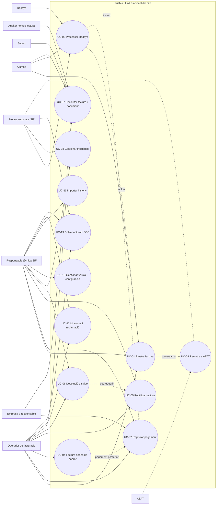
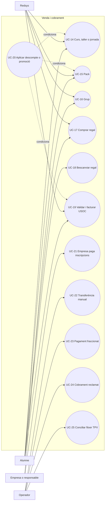
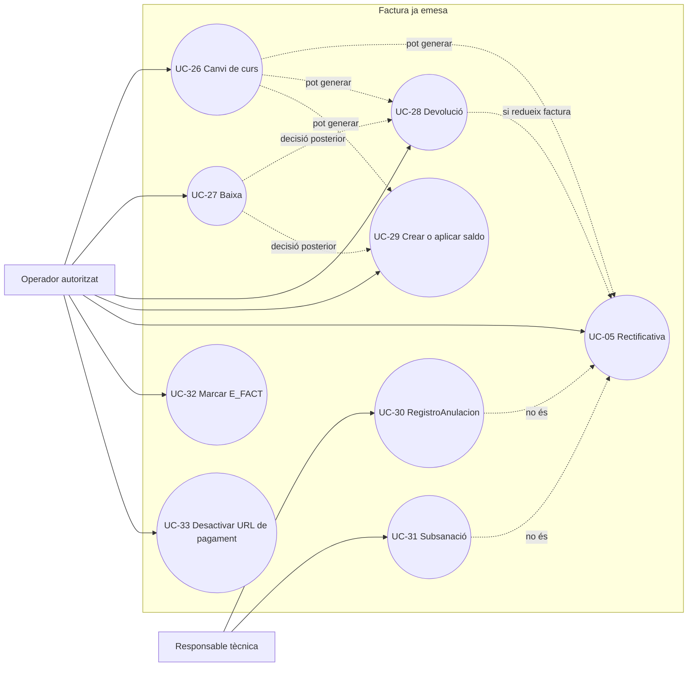
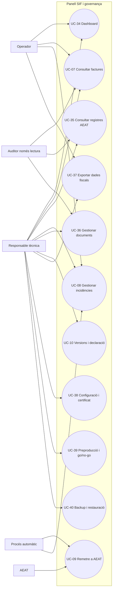
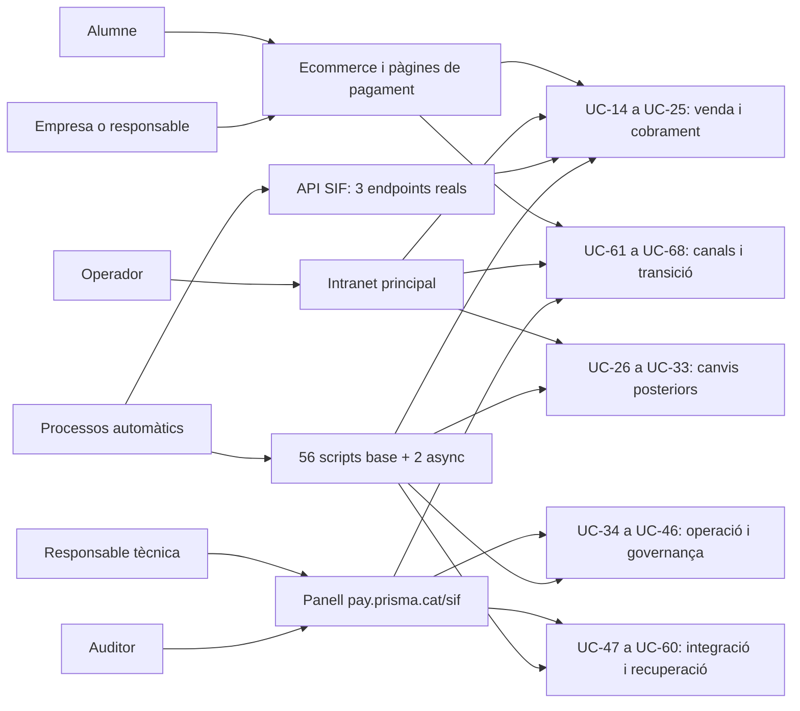
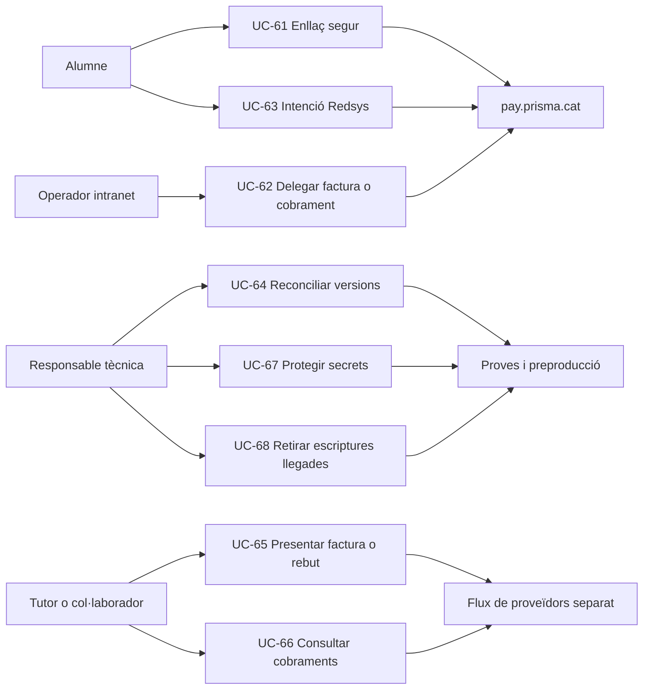
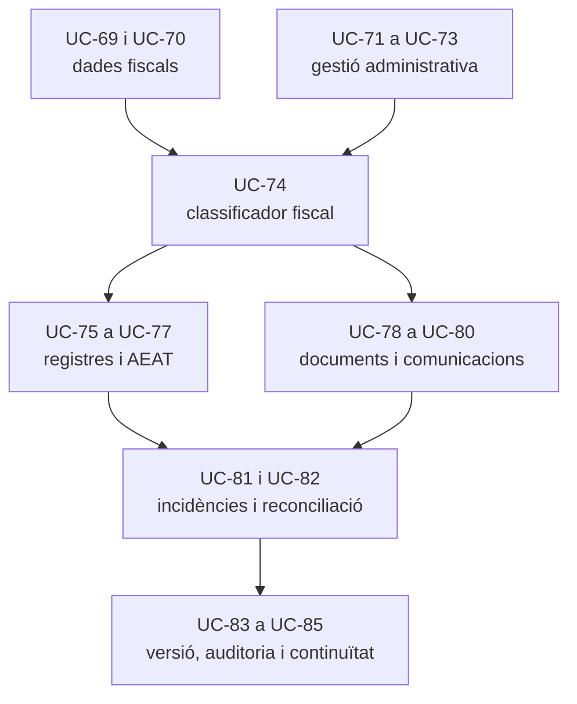

# 33 - Casos d'ús del SIF

## 1. Objectiu

Consolidar els actors i casos d'ús de PrisMa que interactuen amb el SIF. El document combina el comportament implementat amb el contracte funcional final i indica l'estat de cada cas.

Llegenda:

- `[BASE]`: servei o repositori executable al checkout base;
- `[ASYNC]`: implementat a `feature/redsys-async-queue`;
- `[LEGACY]`: comportament observat a les còpies actuals o històriques de `codi-drive`;
- `[PARCIAL]`: nucli disponible, però falten pantalla, permisos, dades reals o preproducció;
- `[DISSENY]`: acordat documentalment, sense implementació completa detectada.

## 2. Actors

| Actor | Responsabilitat principal |
| --- | --- |
| Alumne | Comprar, pagar i consultar només les factures pròpies visibles. |
| Empresa o responsable | Rebre i consultar les factures on és receptor; pagar factures pendents mitjançant un enllaç segur. |
| Operador de facturació | Adam o Pablo, segons pantalla i permís: emetre, registrar cobraments, iniciar rectificatives i consultar. |
| Responsable tècnica SIF | Meriem: configuració, versions, incidències, proves, documents, exportacions i operació tècnica. |
| Suport | Isa: consulta operativa quan el rol ho permet, sense accions fiscals crítiques. |
| Auditor/AEAT només lectura | Consultar declaració, versió, registres, documents, logs i exportacions autoritzades. |
| Procés automàtic SIF | Executar cues, reintents, documents i incidències segons regles predefinides. |
| Redsys | Confirmar o denegar intents de pagament mitjançant callback signat. |
| AEAT | Rebre registres VERI*FACTU i retornar-ne l'estat. La integració executable continua pendent. |

## 3. Diagrama general de casos d'ús

Les associacions discontínues amb AEAT indiquen funcionalitat prevista, no disponibilitat productiva.

## 4. Matriu de cobertura

| ID | Cas d'ús | Estat | Evidència principal |
| --- | --- | --- | --- |
| UC-01 | Emetre o reutilitzar factura | `[BASE]` | `InvoiceService`, `InvoiceRepository` |
| UC-02 | Registrar pagament sobre factura | `[BASE]` | `PaymentService`, `PaymentRepository` |
| UC-03 | Processar cobrament Redsys asíncron | `[ASYNC]` | callback, intenció, cua, worker i dispatcher de `feature/redsys-async-queue` |
| UC-04 | Emetre factura abans de cobrar | `[PARCIAL]` | `InvoiceBeforePaymentService`; integració de pantalla pendent |
| UC-05 | Crear rectificativa | `[PARCIAL]` | `ManualRectificationService`; anul·lació/subsanació no incloses |
| UC-06 | Registrar devolució, saldo o compensació | `[PARCIAL]` | `ManualRefundService`, `CreditBalanceService`; decisió funcional/UI pendent |
| UC-07 | Consultar factura, estat i document | `[DISSENY]` | model de pantalles i permisos; panell complet no detectat |
| UC-08 | Gestionar incidència | `[PARCIAL]` | `IncidentRepository`; workflow de panell pendent |
| UC-09 | Remetre registre a AEAT | `[DISSENY]` | `fiscal_queue` existent; client/certificat/respostes pendents |
| UC-10 | Gestionar configuració i versió | `[DISSENY]` | documentació de governança i panell previst |
| UC-11 | Importar factura històrica | `[BASE]` | `HistoricalInvoiceMigrationService` i repositori propi |
| UC-12 | Gestionar el cicle de morositat i reclamació | `[PARCIAL]` | pantalles legacy i decisió funcional; correus/outbox pendents |
| UC-13 | Orquestrar la doble facturació USOC | `[PARCIAL]` | `RedsysUsocInvoiceService` i `UsocEntityInvoiceService`; dades fiscals reals pendents |

## 5. UC-01 - Emetre o reutilitzar una factura

Actors principals: ecommerce, intranet, operador autoritzat o orquestrador automàtic.

Precondicions:

- receptor fiscal, línies, totals, sèrie, origen i clau d'idempotència validables;
- si hi ha cobrament inicial, bloc `payment` complet;
- autorització validada a l'adaptador servidor, encara que el servei de domini no gestioni rols.

Flux principal:

1. El canal prepara un snapshot i un payload.
2. `InvoiceService` valida el contracte i cerca la clau idempotent.
3. Si és nou, reserva número per sèrie/any i bloqueja la cadena global.
4. Crea factura, línies, registre `ALTA`, hash, cua AEAT i relacions.
5. Si factura i cobrament neixen junts, crea el moviment i l'assignació dins la mateixa transacció.
6. Retorna UUID, número visible i UUID de pagament opcional.

Alternatives:

- mateixa clau: retorna la factura existent;
- curs, pack, grup, regal, USOC o factura manual: un orquestrador específic construeix el payload;
- error de document posterior: la factura no es desfà; s'ha d'obrir incidència.

Postcondició: existeix una única factura immutable per operació facturable i una entrada pendent de remissió AEAT.

## 6. UC-02 - Registrar un pagament sobre factura existent

Actors principals: operador, empresa/responsable mitjançant flux segur o procés automàtic.

Precondicions:

- factura SIF identificada inequívocament;
- import, mètode, data, origen, assignacions i idempotència validats;
- el pagament no s'utilitza per crear una factura que encara no existeix.

Flux principal:

1. El cas específic construeix el payload de moviment.
2. `PaymentService` valida i cerca la clau idempotent.
3. `PaymentRepository` crea `payment_transaction` i una o més `payment_allocation`.
4. Es recalcula `factura.ESTAT_COBRAMENT`.
5. Es retorna l'UUID del pagament.

Alternatives: pagament parcial, reclamació, devolució o compensació. Cap variant crea número fiscal, registre nou o hash.

## 7. UC-03 - Processar un cobrament Redsys asíncron

Actors principals: ecommerce, Redsys i procés automàtic SIF.

Estat: `[ASYNC]`, implementat a `feature/redsys-async-queue` i no activat en producció.

Flux principal:

1. Abans del TPV, el servidor crea una intenció amb `DS_ORDER`, origen, import, divisa, terminal i snapshot.
2. Redsys envia el callback signat.
3. El servidor valida la signatura i contrasta el callback amb la intenció bloquejada.
4. Persisteix una notificació i, si està autoritzada, un únic job.
5. Respon sense esperar l'emissió.
6. El worker reclama el job i el dispatcher selecciona curs, pack, grup, regal o USOC.
7. L'orquestrador emet factura i cobrament idempotents des del snapshot.
8. El worker persisteix `PROCESSED`, `RETRY` o `INCIDENT`.

Alternatives:

- denegat: notificació sense job;
- duplicat equivalent: es reutilitza notificació/job/resultat;
- duplicat contradictori o origen desconegut: incidència;
- error tècnic: reintents d'1, 5, 15 i 60 minuts, màxim cinc intents.

## 8. UC-04 - Emetre factura abans de cobrar

Actor principal: operador autoritzat.

Flux principal:

1. Selecciona operació i receptor fiscal complet.
2. El sistema emet una factura real amb `EMESA_ABANS_COBRAMENT = 1` i estat de cobrament `PENDING`.
3. La factura entra a registre, cadena i cua AEAT com qualsevol altra.
4. Quan arriba el cobrament, el sistema executa UC-02 sobre la mateixa factura.

Regla: el cobrament posterior no crea una segona factura. La integració final de pantalla i permisos continua pendent.

## 9. UC-05 - Rectificar una factura

Actor principal: operador autoritzat.

Flux principal implementat:

1. Localitza la factura original per UUID o número visible.
2. Indica motiu i mode `DIFERENCIES` o `SUBSTITUCIO`.
3. El sistema emet una nova factura sèrie `R` amb `InvoiceService`.
4. Insereix la relació a `factura_rectificacio`.
5. Marca l'original com `RECTIFIED`.

Alternatives pendents:

- registre improcedent: `RegistroAnulacion`;
- dada corregible sense rectificativa: subsanació;
- dubte fiscal: incidència bloquejant.

La pantalla antiga d'“anul·lar factura” no pot decidir directament quina alternativa aplicar.

## 10. UC-06 - Registrar devolució, saldo o compensació

Actors principals: operador i responsable tècnica en incidències.

Fluxos possibles:

- devolució: `ManualRefundService` crea un moviment `REFUND` contra la factura;
- saldo: `CreditBalanceService` crea `credit_balance`;
- compensació: bloqueja saldo i factura, comprova imports i crea `COMPENSATION` atòmica;
- si es redueix o anul·la el servei facturat, s'inicia també UC-05.

Postcondició: el moviment econòmic i la correcció fiscal, si cal, queden separats però relacionables.

## 11. UC-07 - Consultar factura i document

Actors: alumne, empresa/responsable, operador, suport autoritzat i auditor només lectura.

Regles de visibilitat:

- l'alumne només veu factures on és receptor i `fact_rels.VISIBLE_ALUMNE` ho permet;
- una factura de grup o empresa no exposa dades d'altres participants;
- l'empresa/responsable accedeix per correu, enllaç segur o futur espai específic, no per la intranet principal;
- l'auditor és només lectura;
- el PDF/QR es serveix des del SIF, sense exposar paths interns.

Estat: model funcional definit; panell i control d'accés final encara no detectats al codi revisat.

## 12. UC-08 - Gestionar una incidència SIF

Actors: responsable tècnica i, segons rol, operadors autoritzats. El procés automàtic pot obrir incidències però no resoldre decisions funcionals.

Flux objectiu:

1. Un servei o worker detecta un error i crea una entrada a `errors_verifactu`.
2. La intranet mostra un resum; la font oficial és `pay.prisma.cat/sif/incidencies`.
3. Un usuari autoritzat assigna responsable, afegeix notes i executa una acció controlada.
4. El SIF registra usuari, data, motiu i resultat.

Estat: `IncidentRepository::open()` està implementat; falta el workflow complet de panell.

## 13. UC-09 - Remetre registres a AEAT

Actors: procés automàtic SIF i AEAT.

Precondicions pendents:

- client/worker de remissió;
- XML conforme a XSD;
- certificat client qualificat i clau fora del repositori i del webroot;
- configuració de proves/producció separada;
- persistència de respostes, errors i reintents.

La creació de `fiscal_queue` dins UC-01 està implementada. La comunicació autenticada i el tractament complet de resposta continuen en `[DISSENY]` i bloquegen qualsevol afirmació de disponibilitat VERI*FACTU productiva.

## 14. Regles transversals d'autorització

| Acció | Responsable tècnica | Operador facturació | Suport | Auditor | Procés automàtic |
| --- | --- | --- | --- | --- | --- |
| Consultar factura segons abast | Sí | Sí | Només suport autoritzat | Sí, només lectura | Només per procés |
| Emetre factura ordinària/manual | Sí | Sí, segons pantalla | No | No | Només flux predefinit |
| Registrar pagament | Sí | Sí, segons pantalla | No | No | Només flux predefinit |
| Crear rectificativa | Sí | Sí, segons pantalla | No | No | No decideix la causa |
| Resoldre incidència funcional | Sí | Segons rol final | No | No | No |
| Reintentar tasca tècnica | Sí | Segons rol final | No | No | Sí, segons política |
| Configurar o activar versió | Sí | No | No | No | No |
| Descarregar exportació fiscal | Sí | Adam, segons rol | No | Segons autorització | Pot generar-la |

La validació visual del front no és autorització. Cada endpoint o adaptador servidor ha de tornar a validar sessió, rol, estat fiscal, motiu i idempotència, i ha de deixar traça de les accions crítiques.

## 15. Diagrama de venda, pagament i descomptes

## 16. Diagrama de canvis posteriors a l'emissió

`RegistroAnulacion` i subsanació són casos d'ús propis i pendents; no són sinònims de baixa, devolució o rectificativa.

## 17. Diagrama del panell, compliment i governança

## 18. Inventari funcional complet

La taula següent amplia la matriu inicial i manté separats el cas de negoci, el nucli tècnic disponible i la integració que encara falta.

| ID | Cas d'ús | Actor principal | Estat | Nucli o decisió |
| --- | --- | --- | --- | --- |
| UC-14 | Comprar curs normal per Redsys | Alumne | `[ASYNC/PARCIAL]` | Handler `CURS`; ecommerce final pendent. |
| UC-14a | Comprar taller | Alumne | `[PARCIAL]` | Variant de curs; prova específica pendent. |
| UC-14b | Comprar jornada | Alumne | `[PARCIAL]` | Variant de curs; prova específica pendent. |
| UC-15 | Comprar pack | Alumne | `[BASE/ASYNC/PARCIAL]` | Snapshot, payload i handlers preparats; SQL legacy real pendent. |
| UC-16 | Facturar grup | Empresa/responsable | `[BASE/ASYNC/PARCIAL]` | Una línia per participant; permisos i SQL final pendents. |
| UC-16a | Afegir participant després d'emetre | Operador | `[DISSENY]` | Complementària o rectificativa, mai edició directa. |
| UC-16b | Treure participant després d'emetre | Operador | `[DISSENY]` | Rectificativa i possible devolució/saldo. |
| UC-17 | Comprar regal | Comprador | `[BASE/ASYNC/PARCIAL]` | Factura al comprador; integració final pendent. |
| UC-18 | Bescanviar regal | Destinatari | `[DISSENY]` | Inscripció vinculada sense factura nova. |
| UC-18a | Gestionar regal caducat o duplicat | Operador | `[DISSENY]` | Incidència operativa, no emissió automàtica. |
| UC-19 | Validar afiliació USOC | Gestió | `[DISSENY]` | `TIPUS_DESC=4`, `VALID_DESC`; pantalla final pendent. |
| UC-19a | Facturar part de l'alumne USOC | Alumne / automàtic | `[BASE/ASYNC/PARCIAL]` | `RedsysUsocInvoiceService`. |
| UC-19b | Facturar diferència a USOC | Gestió | `[BASE/PARCIAL]` | `UsocEntityInvoiceService`; dades fiscals reals pendents. |
| UC-20 | Aplicar Alumne PrisMa | Ecommerce/intranet | `[PARCIAL]` | Snapshot fiscal de descompte. |
| UC-20a | Validar Carnet Jove | Ecommerce/intranet | `[DISSENY]` | API/verificació i text visible pendents. |
| UC-20b | Aplicar descompte sensible | Operador | `[DISSENY]` | Motiu intern protegit i text visible genèric. |
| UC-20c | Aplicar promoció temporal | Ecommerce | `[PARCIAL]` | `DESC_ID`, import/percentatge i vigència congelats. |
| UC-20d | Aplicar codi promocional | Ecommerce | `[PARCIAL]` | `DESC_CODI_PROMO` congelat; SQL/validació final pendents. |
| UC-21 | Empresa/responsable paga inscripcions | Empresa/responsable | `[PARCIAL]` | Factura abans de cobrar i pagament posterior. |
| UC-22 | Registrar transferència | Operador | `[BASE/PARCIAL]` | `ManualPaymentService`; pantalla i referència final pendents. |
| UC-23 | Registrar fracció | Operador | `[BASE/PARCIAL]` | `ManualInstallmentPaymentService`. |
| UC-24 | Registrar cobrament de reclamació | Operador | `[BASE/PARCIAL]` | `ClaimPaymentService`; correus/URL pendents. |
| UC-25 | Analitzar fitxer TPV | Operador | `[DISSENY]` | Resultats `CONCILIADA`, `DUPLICADA`, pendents o incidència. |
| UC-25a | Comprovar IDPAG duplicats | Operador | `[DISSENY]` | Eina legacy identificada; integració SIF pendent. |
| UC-26 | Canviar de curs | Operador | `[DISSENY/PARCIAL]` | Històric i decisió fiscal definits; orquestrador final pendent. |
| UC-27 | Donar de baixa | Operador | `[DISSENY/PARCIAL]` | Baixa administrativa abans de decidir retorn/saldo. |
| UC-28 | Registrar devolució | Operador | `[BASE/PARCIAL]` | `ManualRefundService`; rectificativa separada si cal. |
| UC-29 | Crear saldo | Operador | `[BASE/PARCIAL]` | `CreditBalanceService::createCredit()`. |
| UC-29a | Aplicar compensació | Operador | `[BASE/PARCIAL]` | Consum atòmic i moviment `COMPENSATION`. |
| UC-30 | Anul·lar registre improcedent | Responsable tècnica | `[DISSENY]` | `RegistroAnulacion`, hash i cua AEAT pendents. |
| UC-31 | Subsanar registre | Responsable tècnica | `[DISSENY]` | Mateix identificador quan pertoqui; XML/XSD pendent. |
| UC-32 | Marcar o desmarcar factura electrònica | Operador | `[DISSENY]` | Acció separada amb usuari, data i motiu. |
| UC-33 | Desactivar URL de pagament | Operador | `[DISSENY]` | No esborra ni altera una factura emesa. |
| UC-34 | Consultar dashboard | Tècnica/operador | `[DISSENY]` | Panell `pay.prisma.cat/sif` pendent. |
| UC-35 | Consultar registre, cadena i estat AEAT | Tècnica/auditor | `[DISSENY]` | Dades base existents; UI i respostes AEAT pendents. |
| UC-36 | Generar/consultar PDF, QR o XML | Automàtic/usuari | `[PARCIAL]` | `DocumentRepository` existeix; generador i servei segur pendents. |
| UC-37 | Exportar període fiscal | Tècnica/Adam/auditor | `[DISSENY]` | Format, hash, registre i permisos pendents. |
| UC-38 | Configurar SIF i certificat | Responsable tècnica | `[DISSENY]` | Secrets i certificat fora del repo; implementació pendent. |
| UC-39 | Executar proves i go/no-go | Responsable tècnica | `[BASE/PARCIAL]` | Runner, preflights i gate disponibles; entorn real pendent. |
| UC-40 | Fer backup i restauració | Responsable tècnica | `[DISSENY]` | Procediment definit; execució i evidència pendents. |
| UC-41 | Crear o editar entitat/responsable | Operador | `[DISSENY]` | Afecta dades prèvies; factura emesa no s'edita. |
| UC-42 | Consultar/modificar alumne | Gestió/suport | `[DISSENY]` | Fitxa operativa; canvis fiscals deriven a flux específic. |
| UC-43 | Gestionar notificacions i recordatoris | Gestió | `[DISSENY]` | No crea efecte fiscal per si sol. |
| UC-44 | Consultar i mantenir `fact_rels` i origen legacy | Responsable tècnica/operador | `[BASE/PARCIAL]` | Model existent; panell, divergències i manteniment controlat pendents. |
| UC-45 | Activar auditor temporal | Responsable tècnica | `[DISSENY]` | Només lectura, abast i caducitat controlats. |
| UC-46 | Activar versió i declaració responsable | Responsable tècnica/direcció | `[DISSENY]` | Requereix proves, certificat i aprovació formal. |

## 19. Pantalles i casos d'ús relacionats

| Pantalla o ruta | Casos principals |
| --- | --- |
| `/alumnes/mostrar-alumne/` | UC-42, UC-26, UC-27, UC-07 |
| `/alumnes/pagaments/` | UC-22, UC-23, UC-24, UC-25 |
| `/alumnes/factura/` | UC-07, UC-05, UC-28, UC-30, UC-31, UC-32 |
| `/alumnes/genera-factura-abans-pagar/` | UC-04, UC-21 |
| `/alumnes/genera-entitat/` | UC-41 |
| `/alumnes/validar-descomptes/` | UC-19, UC-20 |
| `/facturacio/comprovar-idpags/` | UC-25, UC-25a |
| `/facturacio/primera-reclamacio/` | UC-24, UC-43 |
| `/facturacio/baixes/` | UC-27, UC-28, UC-29 |
| `/facturacio/recordatori-pagament/` | UC-24, UC-43 |
| `/facturacio/reclamacio-final/` | UC-24, UC-43 |
| `/facturacio/morosos/` | UC-24, UC-27, UC-43 |
| `pay.prisma.cat/sif/dashboard` | UC-34 |
| `pay.prisma.cat/sif/factures` | UC-07, UC-02, UC-05, UC-28 |
| `pay.prisma.cat/sif/registres` | UC-35, UC-09, UC-30, UC-31 |
| `pay.prisma.cat/sif/incidencies` | UC-08 |
| `pay.prisma.cat/sif/documents` | UC-36 |
| `pay.prisma.cat/sif/versions` | UC-10, UC-46 |
| `pay.prisma.cat/sif/exports` | UC-37 |
| `pay.prisma.cat/sif/configuracio` | UC-38 |

## 20. Resultats de conciliació i resposta esperada

| Resultat | Efecte permès |
| --- | --- |
| `CONCILIADA` | Registrar l'auditoria; cap moviment duplicat. |
| `DUPLICADA` | Retornar l'operació existent. |
| `PENDENT_ASSIGNACIO` | Proposar UC-02 contra una factura existent. |
| `PENDENT_EMISSIO` | Proposar UC-01 amb `payment` si la venda és facturable. |
| `INCIDENCIA` | Obrir UC-08 i bloquejar l'efecte automàtic. |
| Callback denegat | Conservar notificació; no crear job ni factura. |
| Callback contradictori | Obrir incidència; no confiar en dades externes. |
| Factura ja existent | Reutilitzar per idempotència; no consumir número nou. |
| Pagament ja existent | Reutilitzar moviment; no duplicar assignació. |

## 21. Criteri de completitud dels casos d'ús

Un cas no es considera complet només perquè tingui servei o diagrama. Per passar a `COMPLET` necessita:

1. decisió funcional i fiscal tancada;
2. payload, idempotència i persistència implementats;
3. autorització servidor i auditoria;
4. pantalla, endpoint, callback o CLI final segons el canal;
5. proves unitàries, integració i concurrència quan pertoqui;
6. prova en preproducció amb evidència;
7. procediment d'incidència i recuperació;
8. documentació i captures actualitzades.

## 22. Cobertura de les 192 pantalles i apartats inventariats

La matriu `03-canvis-pendents/12-matriu-pantalles-abans-despres.md` conté 192 pantalles o apartats, cadascun amb quatre fases Trello. No és llegible convertir-los en 192 el·lipses en un únic diagrama; aquesta vista els agrupa per responsabilitat sense eliminar el catàleg individual.

```mermaid
flowchart TB
  Catalog[192 pantalles o apartats inventariats]

  Catalog --> Fiscal[35 factura o document legacy]
  Catalog --> Visibility[32 consulta, visibilitat i dades personals]
  Catalog --> SifPanel[28 operació o panell SIF]
  Catalog --> Review[25 pendents de validar en detall]
  Catalog --> Redsys[16 TPV, Redsys, IDPAG i callbacks]
  Catalog --> Admin[14 canvi, baixa, devolució o saldo]
  Catalog --> Comms[12 comunicacions]
  Catalog --> PayWeb[9 URL o estat de pagament web]
  Catalog --> Collection[8 cobrament o assignació legacy]
  Catalog --> Discounts[6 regles comercials i descomptes]
  Catalog --> Debt[4 morositat i reclamacions]
  Catalog --> BeforePay[3 factura abans de cobrar]

  Fiscal --> UC07[UC-07, UC-36, UC-48, UC-55]
  Visibility --> UC41[UC-41, UC-42, UC-45, UC-59]
  SifPanel --> UC34[UC-08, UC-34 a UC-40, UC-46, UC-60]
  Redsys --> UC03[UC-03, UC-25, UC-49, UC-51, UC-52]
  Admin --> UC05[UC-05, UC-06, UC-26 a UC-33]
  Comms --> UC43[UC-43, UC-49, UC-58]
  PayWeb --> UC50[UC-04, UC-21, UC-33, UC-50]
  Collection --> UC56[UC-02, UC-22 a UC-24, UC-56]
  Discounts --> UC20[UC-20 i variants]
  Debt --> UC24[UC-24, UC-27, UC-43]
  BeforePay --> UC04[UC-04, UC-21]
```

| Família de la matriu de pantalles | Nombre | Casos d'ús de referència |
| --- | ---: | --- |
| Factura/document amb dependències legacy | 35 | UC-07, UC-30 a UC-33, UC-35 a UC-37, UC-48, UC-55 |
| Consulta/visibilitat de persones, cursos o receptors | 32 | UC-07, UC-14 a UC-21, UC-41, UC-42, UC-45, UC-59 |
| Panell o operació interna SIF | 28 | UC-08 a UC-10, UC-34 a UC-40, UC-46, UC-52 a UC-55, UC-57 a UC-60 |
| Pendent de validar en detall | 25 | Requereix assignació individual durant implementació; no es marca cobert per defecte |
| TPV/Redsys/IDPAG/callbacks | 16 | UC-03, UC-25, UC-49, UC-51, UC-52 |
| Operació administrativa amb impacte econòmic/fiscal | 14 | UC-05, UC-06, UC-26 a UC-31 |
| Comunicacions | 12 | UC-43, UC-49, UC-58 |
| URL o estat de pagament web | 9 | UC-04, UC-21, UC-33, UC-50 |
| Cobrament/intranet/camps legacy | 8 | UC-02, UC-22 a UC-24, UC-56 |
| Regla comercial o descompte | 6 | UC-20 i variants |
| Morositat i comunicacions | 4 | UC-24, UC-27, UC-43 |
| Factura abans de cobrament | 3 | UC-04, UC-21 |
| **Total** | **192** | Catàleg individual a la matriu de pantalles |

El risc de la matriu també és material: 113 elements són de risc alt, 36 de risc mitjà/alt i 43 de risc mitjà. Agrupar-los en un diagrama no els converteix en implementats ni tanca les quatre fases de cada pantalla.

## 23. Casos d'ús operatius que faltaven a l'inventari inicial

| ID | Cas d'ús | Actor principal | Estat | Criteri |
| --- | --- | --- | --- | --- |
| UC-47 | Sincronitzar l'estat mínim cap al llegat després del commit SIF | Procés/adaptador | `[BASE/PARCIAL]` | `LegacySyncService`; mai abans del commit fiscal ni com a font de veritat. |
| UC-48 | Crear o consultar una proforma no fiscal | Operador | `[LEGACY/DISSENY]` | Ha d'indicar clarament que no és factura ni consumir numeració/hash. |
| UC-49 | Enviar factura, document o avis per correu | Procés/operador | `[LEGACY/DISSENY]` | Plantilla versionada, destinatari verificat, document disponible i evidència d'enviament. |
| UC-50 | Crear, consultar, desactivar o caducar un enllaç de pagament | Operador/empresa | `[DISSENY]` | Token segur, caducitat, estat i auditoria; desactivar-lo no altera la factura. |
| UC-51 | Tractar callback Redsys denegat, tardà, duplicat o contradictori | Redsys/procés | `[ASYNC]` | Cap factura duplicada; incidència quan les dades signades entren en conflicte. |
| UC-52 | Operar la cua Redsys | Procés/responsable tècnica | `[ASYNC/PARCIAL]` | Claim únic, lock caducat, retry, màxim cinc intents, incidència i consulta operativa pendent. |
| UC-53 | Detectar i resoldre divergències SIF-llegat | Procés/responsable tècnica | `[DISSENY]` | Comparació per UUID, IDPAG, `fact_rels`, imports i estats; correcció sempre traçada. |
| UC-54 | Operar la cua fiscal i tractar la resposta AEAT | Procés/responsable tècnica | `[DISSENY]` | Enviament autenticat, retry/dead-letter, resposta persistent i subsanació quan pertoqui. |
| UC-55 | Generar, reintentar i custodiar documents fiscals | Procés/responsable tècnica | `[PARCIAL/DISSENY]` | Font immutable, hash, versió, storage protegit i incidència si falla. |
| UC-56 | Cercar i assignar un cobrament | Operador | `[PARCIAL]` | Cerca per NIF/NIE, regal, factura, IDPAG o referència; assignació idempotent a factura existent. |
| UC-57 | Mantenir i optimitzar la BD SIF | Responsable tècnica | `[DISSENY]` | Índexs, retenció i manteniment sense esborrar evidència fiscal ni trencar hashes. |
| UC-58 | Gestionar l'outbox de notificacions | Procés/responsable tècnica | `[DISSENY]` | Missatge persistent, retries, plantilla, destinatari i resultat auditables. |
| UC-59 | Concedir, caducar i revocar accés auditor | Responsable tècnica | `[DISSENY]` | Només lectura, abast temporal i registre de consultes/exportacions. |
| UC-60 | Monitorar salut, cues, documents, backups i versió activa | Responsable tècnica | `[DISSENY]` | Dashboard basat en dades reals, alertes accionables i cap falsa situació de `GO`. |

## 24. Relació entre canals i paquets de casos d'ús

Els tres endpoints reals són `POST /api/factures/issue`, `POST /api/payments/register` i `POST /api/redsys/callback`. La consulta d'incidències i la resta del panell són objectius de disseny, no endpoints detectats al checkout.

## 25. Casos d'ús de canal i transició descoberts a les còpies actuals

Aquests casos no dupliquen la venda de curs, pack, grup, regal o USOC. Afegeixen la interacció concreta dels portals i el treball necessari per retirar l'escriptura fiscal del llegat.

| ID | Cas d'ús | Actor principal | Estat | Criteri |
| --- | --- | --- | --- | --- |
| UC-61 | Consultar un import pendent i obtenir un enllaç de pagament | Alumne | `[LEGACY/OBJECTIU]` | `IntranetAlumne` mostra el pendent; `pay.prisma.cat` ha de crear token/intenció segura i caducable. |
| UC-62 | Iniciar factura o cobrament des de la intranet | Operador | `[LEGACY/DISSENY]` | L'adaptador envia una ordre autenticada a `InvoiceService` o `PaymentService`; cap escriptura fiscal paral·lela. |
| UC-63 | Crear la intenció Redsys des de l'ecommerce | Alumne/pagador | `[ASYNC/PARCIAL]` | Snapshot immutable abans del TPV i `DS_ORDER` resolt al servidor; adaptador web encara pendent. |
| UC-64 | Reconciliar la candidata amb el codi actual | Responsable tècnica | `[CONTROL/PENDENT]` | Preservar els canvis vigents, seleccionar fitxers actius i provar cada canal abans de desplegar. |
| UC-65 | Presentar una factura o rebut de col·laborador | Tutor/col·laborador | `[LEGACY/ADJACENT]` | Registre d'honoraris/proveïdor separat de les factures de venda del SIF. |
| UC-66 | Consultar i gestionar cobraments d'un col·laborador | Tutor/facturació | `[LEGACY/ADJACENT]` | `cobraments`, `dates_cobraments`, `bestretes` i estat gestionat; no crea una venda. |
| UC-67 | Externalitzar i rotar secrets de pagament | Responsable tècnica | `[PENDENT/BLOQUEJANT]` | Cap clau Redsys, xifrat o credencial al codi o webroot; secret protegit i rotació provada. |
| UC-68 | Retirar callbacks i escriptures fiscals llegades | Responsable tècnica | `[DISSENY]` | Cada punt actiu té substitut, prova i evidència; els callbacks antics queden desactivats sense doble processament. |

La frontera funcional queda així: UC-61 a UC-63 connecten els canals de venda amb el SIF; UC-64, UC-67 i UC-68 controlen la transició; UC-65 i UC-66 documenten un circuit adjacent per evitar confondre les factures de tutors amb les factures emeses a alumnes.

## 26. Casos d'ús de transformació funcional i registral

Els casos següents fan explícit el canvi de gestió que no quedava prou representat quan el catàleg estava centrat en emissió i cobrament.

| ID | Cas d'ús | Actor principal | Estat | Resultat obligatori |
| --- | --- | --- | --- | --- |
| UC-69 | Confirmar i congelar dades fiscals | Pagador/operador | `[DISSENY/PARCIAL]` | Snapshot validat i versionat abans d'emetre; receptor i contacte diferenciats. |
| UC-70 | Modificar dades mestres després d'emetre | Gestió | `[DISSENY]` | Historial abans/després; cap canvi a snapshots emesos; derivació a correcció si cal. |
| UC-71 | Registrar un canvi de curs complet | Gestió | `[DISSENY/PARCIAL]` | Event, origen/destí, imports, descompte, despeses, diferència i acció fiscal relacionada. |
| UC-72 | Registrar baixa i decisió econòmica | Gestió | `[DISSENY/PARCIAL]` | Baixa separada de retorn, saldo o no retorn; actor, motiu i dates. |
| UC-73 | Documentar un ajust, descompte o despesa | Gestió/validador | `[DISSENY]` | Valor anterior/nou, motiu, aprovació i línia fiscal quan tingui import. |
| UC-74 | Classificar una correcció fiscal | Responsable autoritzada | `[DISSENY/BLOQUEJANT]` | Decisió entre rectificativa, complementària, anul·lació, subsanació o cap efecte. |
| UC-75 | Crear un registre d'anul·lació | Responsable tècnica | `[DISSENY/BLOQUEJANT]` | Registre immutable, encadenat, en cua i relacionat amb l'original. |
| UC-76 | Crear un registre de subsanació | Responsable tècnica | `[DISSENY/BLOQUEJANT]` | Registre anterior i corrector, indicadors AEAT, hash, intents i resposta. |
| UC-77 | Operar enviament AEAT, retry i dead-letter | Procés/responsable tècnica | `[DISSENY/BLOQUEJANT]` | Cada intent persistent; resposta/CSV/error; reintent segur o incidència. |
| UC-78 | Generar i custodiar PDF, QR i XML | Procés/responsable tècnica | `[PARCIAL/DISSENY]` | Job, versió generador, fitxer privat, hash, estat i incidència. |
| UC-79 | Enviar una comunicació fiscal auditable | Procés/gestió | `[DISSENY]` | Outbox posterior al commit, plantilla/versionat, destinataris, intents i resultat. |
| UC-80 | Servir i registrar accés a document fiscal | Receptor/auditor | `[DISSENY]` | Autorització, token/caducitat, document immutable i registre d'accés o denegació. |
| UC-81 | Gestionar el cicle complet d'una incidència | Responsable assignada | `[PARCIAL/DISSENY]` | Prioritat, assignació, accions, canvis d'estat, resolució i evidència. |
| UC-82 | Reconciliar SIF amb la BD llegada | Procés/responsable tècnica | `[DISSENY]` | Execució i items de diferència per UUID/IDPAG/import/estat, resolució traçada. |
| UC-83 | Registrar i activar versió i declaració | Responsable tècnica/direcció | `[DISSENY/BLOQUEJANT]` | Versió, artefacte, configuració, proves, declaració i activació vinculades. |
| UC-84 | Crear un paquet fiscal d'auditoria | Responsable tècnica/auditor | `[DISSENY]` | Filtres, motiu, fitxer, hash, sol·licitant i descàrregues conservats. |
| UC-85 | Executar backup, restauració i reconciliació | Responsable tècnica | `[DISSENY/BLOQUEJANT]` | Evidència de backup i restauració, integritat, RPO/RTO i incidències. |
| UC-86 | Auditar qualsevol acció sobre un pagament | Usuari/procés autoritzat | `[DISSENY/PARCIAL]` | Event immutable d'intent, decisió i resultat amb actor, origen, correlació, factura/pagament i evidència; desenvolupat a l'apartat 27. |

### 26.1. Precondicions comunes

- actor autenticat i rol verificat al servidor;
- estat i versió de l'objecte rellegits abans del commit;
- cap factura emesa editable;
- motiu estructurat per canvis, correccions i accions excepcionals;
- clau idempotent i hash del payload;
- previsualització dels registres i moviments que es crearan;
- bloqueig si el cas és ambigu o requereix criteri fiscal no tancat.

### 26.2. Postcondicions comunes

- event d'auditoria amb correlació de tota l'operació;
- resultat persistent encara que no hi hagi factura o moviment econòmic;
- UUIDs i relacions retornats al canal;
- sync llegada només després de l'èxit SIF i només com a resum;
- error parcial convertit en retry o incidència, mai en update manual alternatiu;
- comunicació i document coherents amb l'estat real;
- prova i evidència vinculades a la pantalla afectada.

La descripció detallada de les àrees, registres i punts de codi afectats és `38-matriu-transformacio-funcional-verifactu.md`.

## 27. UC-86 - Registrar qualsevol acció sobre un pagament

| Camp | Definició |
| --- | --- |
| Actor | Qualsevol usuari, sistema o procés autoritzat de web, intranet, alumne, SIF, Redsys, CLI, migració, conciliació o sincronització. |
| Objectiu | Poder reconstruir què s'ha intentat o fet sobre cada pagament, des d'on, per qui, per què i amb quin resultat. |
| Precondició | Identitat resolta pel servidor, `REQUEST_ID`, `CORRELATION_ID`, acció tipificada i ledger d'auditoria disponible. |
| Disparador | Crear, reutilitzar, cercar, consultar, exportar, assignar, reassignar, conciliar, retornar, compensar, cancel·lar, reintentar, importar, sincronitzar o intentar modificar un pagament. |
| Flux principal | Registrar `REQUESTED`; executar la validació i l'acció; registrar resultat terminal i relacions derivades. |
| Alternatives | `REUSED`, `NO_CHANGE`, `REJECTED`, `FAILED`, `QUEUED` o `PARTIAL`. |
| Postcondició | Existeix almenys un `payment_action_event` correlacionable; les mutacions correctes tenen event terminal atòmic amb el commit. |
| Regla de seguretat | Si no es pot registrar la traça, l'acció queda bloquejada i no es retornen dades. |
| Regla d'immutabilitat | Els events no s'editen ni s'esborren; les correccions generen nous events i moviments. |
| Estat | `[DISSENY/BLOQUEJANT]`: `PaymentService` actual encara no implementa aquesta dependència. |

### 27.1. Escenaris mínims de prova

1. alta correcta de pagament;
2. reutilització per idempotència;
3. consulta autoritzada i consulta denegada;
4. assignació única i repartiment entre factures;
5. reassignació/correcció append-only;
6. conciliació correcta, duplicada i amb incidència;
7. callback i worker Redsys;
8. devolució, compensació i reclamació cobrada;
9. sincronització llegada;
10. error tècnic, retry i correlació incompleta;
11. exportació de cronologia;
12. intent d'update o delete directe bloquejat.

UC-86 és transversal: acompanya UC-02, UC-03, UC-06, UC-22 a UC-25, UC-28, UC-29, UC-47, UC-51 a UC-53, UC-56, UC-61 a UC-63, UC-68, UC-72, UC-79, UC-81, UC-82 i qualsevol cas futur que consulti o actuï sobre pagaments.

## 28. Casos absents recuperats en la reconciliació final

La primera comparació entre aquest catàleg, les 145 targetes de la llista
`Fitxes mare` del tauler 2, les 192 pantalles/estats i les còpies de codi
actuals va identificar dinou
responsabilitats que no quedaven prou definides amb un identificador propi. No
són 145 casos nous: dins les `Fitxes mare` hi ha duplicats, targetes de detecció,
metadades i vistes que es mapen a un mateix cas canònic.

| ID | Cas d'ús | Actor principal | Estat | Resultat obligatori |
| --- | --- | --- | --- | --- |
| UC-87 | Validar receptor estranger o amb dades fiscals incompletes | Pagador/operador | `[DISSENY/BLOQUEJANT]` | Validació per país i tipus d'identificador; cap emissió amb receptor ambigu o incomplet. |
| UC-88 | Decidir agrupació i línies d'una factura multiconcepte | Operador/orquestrador | `[DISSENY/PARCIAL]` | Una regla explícita decideix factura única amb línies o factures separades, sense dependre només del pagament. |
| UC-89 | Canviar concepte després del cobrament o emissió | Operador | `[DISSENY/BLOQUEJANT]` | Abans d'emetre es versiona l'esborrany; després d'emetre es classifica rectificació o cap efecte, mai update directe. |
| UC-90 | Resoldre un descompte validat després de la compra | Gestió/validador | `[DISSENY/BLOQUEJANT]` | Sol·licitud, evidència, moment de validació i diferència queden registrats; després d'emetre passa pel classificador fiscal. |
| UC-91 | Aplicar descompte de grup per trams | Gestió/orquestrador | `[DISSENY/PARCIAL]` | Tram, participants, preu unitari i descompte de cada línia queden congelats. |
| UC-92 | Registrar venda manual des d'intranet o telèfon | Operador | `[DISSENY/PARCIAL]` | L'operador crea l'operació i el SIF emet/cobra segons l'estat real, amb la mateixa idempotència que ecommerce. |
| UC-93 | Canviar el receptor fiscal sol·licitat després d'una compra particular | Client/operador | `[DISSENY/BLOQUEJANT]` | La petició no reescriu la factura; es valida si cal rectificació o una altra actuació documentada. |
| UC-94 | Ajustar manualment l'import a pagar amb justificació | Operador/validador | `[DISSENY/BLOQUEJANT]` | Valor anterior/nou, motiu i aprovació queden a `operational_event`; si hi ha factura emesa, s'impedeix la mutació. |
| UC-95 | Gestionar estat acadèmic amb deute pendent | Gestió | `[DISSENY]` | Estat acadèmic i cobrament es mantenen separats; certificat, reclamació i visibilitat depenen de regles explícites. |
| UC-96 | Concedir una pròrroga de pagament fins a la segona setmana | Gestió | `[DISSENY]` | Excepció temporal, justificació, venciment i resultat queden registrats abans de baixa o morositat. |
| UC-97 | Consultar històric barrejat Associació/SL | Operador/auditor | `[DISSENY/BLOQUEJANT]` | Cada document conserva emissor jurídic i origen; no es converteix retroactivament en VERI*FACTU. |
| UC-98 | Classificar el circuit fiscal de botiga de llibres/SL | Direcció/responsable tècnica | `[PENDENT/BLOQUEJANT]` | Es decideixen titular SIF, sèries, dades i separació respecte de PrisMa abans d'implementar. |
| UC-99 | Limitar la intranet de tutors a un circuit no fiscal | Tutor/gestió | `[DISSENY/PENDENT]` | Consulta i honoraris de proveïdor no permeten emetre, modificar ni veure factures de venda alienes. |
| UC-100 | Registrar una operació informativa o no facturable | Usuari/procés autoritzat | `[DISSENY]` | Event auditable amb motiu i classificació `NONE`; no crea factura ni pagament. |
| UC-101 | Operar domini, TLS i separació d'entorns de `pay.prisma.cat` | Responsable tècnica | `[PARCIAL/BLOQUEJANT]` | DNS/TLS, headers, secrets i proves diferencien test i producció amb evidència. |
| UC-102 | Autoritzar l'accés de l'alumne sense rol d'intranet | Alumne | `[DISSENY/BLOQUEJANT]` | Identitat externa o token segur limita l'accés a recursos propis i registra denegacions. |
| UC-103 | Delegar anul·lació o canvi de pagament web al SIF | Alumne/operador | `[DISSENY/BLOQUEJANT]` | Web no actualitza el pagament; envia una comanda a `pay.prisma.cat`, que registra intent, decisió i resultat. |
| UC-104 | Gestionar un excés de cobrament | Operador/responsable tècnica | `[DISSENY/BLOQUEJANT]` | L'excés queda sense assignar o deriva a devolució/saldo segons decisió; mai força `PAID` silenciosament. |
| UC-105 | Reassignar o repartir un pagament | Operador autoritzat | `[DISSENY/BLOQUEJANT]` | Es conserven assignacions anteriors, motiu, noves assignacions i cronologia append-only, sense editar el moviment original. |

## 29. Casos absents detectats en el codi funcional actual

La revisió de les set carpetes de `codi-drive` ha demostrat que la
reconciliació per títol de les targetes Trello no cobria tot el comportament
productiu. Els casos següents provenen de branques reals del codi de la web i
no es poden absorbir en una frase genèrica de venda o pagament.

| ID | Cas d'ús | Actor principal | Estat | Resultat obligatori |
| --- | --- | --- | --- | --- |
| UC-106 | Crear una reserva o inscripció abans del pagament | Alumne/ecommerce/gestió | `[LEGACY/DISSENY/BLOQUEJANT]` | La reserva queda identificada, amb edició, plaça, preu, regla comercial, pagador, receptor fiscal provisional, estat i caducitat; encara no implica factura ni cobrament. |
| UC-107 | Detectar una inscripció duplicada i evitar efectes econòmics dobles | Alumne/ecommerce/gestió | `[LEGACY/DISSENY/BLOQUEJANT]` | La comprovació usa persona, producte i edició; un reintent reutilitza la reserva i no crea un segon `IDPAG`, enllaç, factura, pagament ni comunicació contradictòria. |
| UC-108 | Registrar un tastet o repte gratuït com a operació no facturable | Alumne/ecommerce | `[LEGACY/DISSENY]` | Es registra la inscripció i la classificació `NON_BILLABLE/FREE_SAMPLE`; no es crea factura, pagament ni enllaç, i el consentiment de mailing queda separat i acreditable. |
| UC-109 | Registrar una inscripció a curs subvencionat sense cobrament individual | Alumne/ecommerce/gestió | `[LEGACY/PENDENT/BLOQUEJANT]` | L'operació queda classificada com `SUBSIDISED_PENDING_DECISION`, amb finançador i evidència; no s'inventa un pagament de zero ni es decideix sense acord si cal factura a l'alumne, al finançador o cap factura. |
| UC-110 | Gestionar el descompte d'amics amb dues inscripcions i un pagador | Dos participants/pagador | `[LEGACY/DISSENY/BLOQUEJANT]` | Dues persones poden triar cursos diferents, compartir operació/intenció i tenir un pagador; cada participant, línia, descompte i relació amb la factura queda congelat sense confondre pagador i receptor. |
| UC-111 | Validar docent novell i generar un dret de descompte futur | Alumne/validador/gestió | `[LEGACY/DISSENY/BLOQUEJANT]` | La titulació i validació són evidència separada; després del pagament confirmat es crea una promoció o crèdit comercial futur idempotent, mai una alteració de la factura ja emesa. |
| UC-112 | Congelar preu, descompte, places i classificació fiscal abans del TPV | Ecommerce/SIF | `[LEGACY/DISSENY/BLOQUEJANT]` | Abans de crear la intenció Redsys es persisteix un snapshot versionat de producte, edició, places, import, descompte, pagador, receptor i tractament fiscal; el callback no recalcula dades vives. |

### 29.1. Evidència de codi

- `web-actual/ajax/enviarInscripcio.php` crea la inscripció abans del pagament,
  diferencia cursos subvencionats (`tipusCurs == 'S'`), descomptes pendents de
  validar i el circuit `recent_titulat`/docent novell.
- `web-actual/ajax/enviarInscripcioTastet.php` escriu a
  `inscripcions_reptes`, declara el tastet gratuït i gestiona el mailing sense
  cap operació de cobrament.
- `web-actual/DescompteAmic.php` crea dues inscripcions, un únic `IDPAG`, una
  persona pagadora a `respGrups` i calcula el descompte sobre dos cursos que
  poden ser diferents.

### 29.2. Regla de frontera

`inscripció`, `operació comercial`, `intenció de pagament`, `pagament` i
`factura` són objectes relacionats però diferents. Cap identificador legacy
(`IDPAG`, id d'inscripció o URL xifrada) els pot fusionar en un únic estat. El
SIF només emet quan UC-112 ha congelat les dades i la classificació decideix
que l'operació és facturable.

### 29.3. Frontera amb casos ja existents

- UC-87 amplia UC-69, però tracta el bloqueig i les variants internacionals com un
  recorregut propi.
- UC-88 no duplica UC-15 o UC-16: defineix la regla general que decideix la
  composició de qualsevol factura multiconcepte.
- UC-89, UC-90, UC-93 i UC-94 obliguen a passar per UC-74 quan ja existeix una
  factura emesa.
- UC-95 i UC-96 amplien UC-12 sense confondre estat acadèmic, pròrroga i morositat.
- UC-97 i UC-98 no autoritzen emissió retroactiva ni barregen titulars SIF.
- UC-99 manté el circuit de col·laboradors fora de la facturació de venda, però
  n'especifica permisos i visibilitat.
- UC-100 dona persistència pròpia als canvis sense efecte fiscal o econòmic.
- UC-103, UC-104 i UC-105 queden sotmesos sempre a UC-86.

## 30. Segona ampliació descoberta en gestió, web i portal d'alumne

La inspecció de les escriptures reals de la intranet, l'ecommerce i el portal
d'alumne ha trobat dotze responsabilitats que no es poden donar per cobertes
amb un cas genèric de venda, descompte o canvi de dades.

| ID | Cas d'ús | Actor principal | Estat | Resultat obligatori |
| --- | --- | --- | --- | --- |
| UC-113 | Importar o crear inscripcions manualment o en lot sense inventar cobrament | Gestió/procés d'importació | `[LEGACY/DISSENY/BLOQUEJANT]` | Cada execució i fila conserva origen, validació, resultat i operació creada o reutilitzada; l'alta acadèmica no crea factura, pagament ni import fictici. |
| UC-114 | Versionar canvis de producte o edició amb operacions obertes | Gestió acadèmica/validador | `[LEGACY/DISSENY/BLOQUEJANT]` | Nom, dates, hores, preu, fiscalitat i regles queden versionats; les reserves acceptades mantenen snapshot o entren en un canvi explícit, mai en una mutació silenciosa. |
| UC-115 | Reservar i alliberar places amb aforament, caducitat i concurrència | Alumne/ecommerce/gestió | `[LEGACY/DISSENY/BLOQUEJANT]` | La plaça té titular, quantitat, estat, venciment i lock; no hi ha sobrevenda i llista d'espera, cancel·lació i expiració són transicions registrades. |
| UC-116 | Custodiar i revisar evidències sensibles de descompte | Alumne/validador/DPO | `[LEGACY/DISSENY/BLOQUEJANT]` | Cada document té hash, custòdia protegida, finalitat, accés, decisió i termini de retenció; no queda exposat al webroot ni reduït a un correu. |
| UC-117 | Gestionar el cicle de vida d'un codi promocional o dret futur | Gestió/ecommerce/titular | `[LEGACY/DISSENY/BLOQUEJANT]` | Emissió, titular, regla, caducitat, reserva, consum, anul·lació i reversió són idempotents i traçables; el codi no reescriu una factura emesa. |
| UC-118 | Gestionar un grup abans d'emetre o cobrar | Responsable de grup/participants/gestió | `[LEGACY/DISSENY/BLOQUEJANT]` | Responsable, participants, cursos, tram, pagador, receptor i línies es poden preparar i validar; el snapshot es bloqueja abans del TPV i els canvis posteriors es classifiquen. |
| UC-119 | Gestionar el cicle complet d'un regal o codi de bescanvi | Comprador/beneficiari/gestió | `[LEGACY/DISSENY/BLOQUEJANT]` | Compra, emissió, lliurament, activació, validació, bescanvi, caducitat, canvi i devolució conserven titulars i imports sense confondre regal, inscripció i pagament. |
| UC-120 | Tramitar una sol·licitud de canvi de dades personals i la seva propagació | Alumne/gestió | `[LEGACY/DISSENY/BLOQUEJANT]` | Abans/després, justificació, aprovació o rebuig, actor i sistemes afectats queden registrats; cap factura emesa ni snapshot històric es reescriu. |
| UC-121 | Repreuar o renovar una reserva caducada abans del pagament | Pagador/ecommerce/SIF | `[DISSENY/BLOQUEJANT]` | L'operació caducada no recupera automàticament el preu antic; es genera proposta versionada, nova reserva/enllaç i acceptació explícita abans de cobrar. |
| UC-122 | Gestionar la composició d'un pack i la indisponibilitat d'un component | Alumne/gestió/SIF | `[LEGACY/DISSENY/BLOQUEJANT]` | Cada component és una línia identificada amb plaça, preu, descompte i tractament fiscal; substitució, baixa parcial o cancel·lació tenen decisió econòmica i fiscal. |
| UC-123 | Generar i lliurar una factura electrònica en format i canal acordats | Receptor/gestió/procés documental | `[LEGACY/DISSENY/BLOQUEJANT]` | La preferència `E_FACT` no és el document: format, versió, destinatari, consentiment, hash, lliurament, error i reintent queden acreditats. |
| UC-124 | Reconciliar accés acadèmic i certificat amb baixa, deute i pagador de grup | Gestió/procés acadèmic | `[LEGACY/DISSENY/BLOQUEJANT]` | Estat acadèmic, accés Moodle, certificat, inscripció i estat econòmic evolucionen separadament però amb regles i events correlacionats. |

### 30.1. Evidència directa

- `intranet-actual/Intranet.php::pujar_Inscripcions()` dona d'alta alumnes i
  genera fitxers per Moodle sense crear una operació econòmica explícita.
- `desarCanvisDadesEdicio()` i `desarCanvisDadesAulaEdicio()` modifiquen dades
  mestres de curs/edició que poden conviure amb inscripcions obertes.
- `inscripcionOberta()` i `inscripcioVisible()` participen en obertura i
  disponibilitat, però no constitueixen un ledger de places.
- `sendMsgValidatCurosDescomptes()` valida documentació sensible, recalcula
  l'import i pot crear enllaços llegats sense una custòdia/evidència completa.
- `DescompteGrup.php`, `enviarInscripcioBescanvia.php`,
  `enviarInscripcioPack.php`, `obtenirCorreusValidsPromo.php` i
  `enviarImatgeCarnetInscripcio.php` implementen cicles de vida diferents que
  no poden quedar fusionats en “aplicar descompte”.
- `IntranetAlumne::enviarMsgSolicitantModificacioDades()` només envia un correu
  amb el canvi sol·licitat, sense entitat persistent d'aprovació i propagació.
- Els mètodes de superació/no superació, deute, enllaç de pagament i aula oberta
  demostren que estat acadèmic i estat econòmic no són el mateix estat.

### 30.2. Conseqüència sobre la completitud

UC-95, UC-106, UC-111 i els casos de packs, grups, regals i descomptes previs
continuen sent antecedents, però no substitueixen aquests cicles complets. La
matriu 41 conserva la correspondència amb les superfícies executables i
distingeix `MAPPED`, `PARTIAL`, `GAP` i `ADJACENT`.

El catàleg canònic resultant conté **129 identificadors numèrics i 13 variants
amb sufix**, és a dir, **142 fitxes funcionals estructurades**. El document
`39-auditoria-fitxes-funcionals.md` inventaria i classifica 185 `Fitxes mare`
en tres taulers; els documents 40 i 41 expliquen per què això encara no
acredita completitud de contingut ni cobertura executable.

## 31. Tercera ampliació: registres transversals entre canals i sistemes

Una tercera lectura dirigida dels mètodes i endpoints que no quedaven a la
matriu ha identificat cinc cicles addicionals. No són pantalles noves del SIF:
són expedients i events que impedeixen que una acció acadèmica o de dades
personals alteri indirectament operacions, pagaments o documents sense traça.

| ID | Cas d'ús | Actor principal | Estat | Resultat obligatori |
| --- | --- | --- | --- | --- |
| UC-125 | Gestionar consentiment de comunicacions separat de la inscripció | Persona interessada/gestió/procés de comunicacions | `[LEGACY/DISSENY/BLOQUEJANT]` | Alta, confirmació, denegació, canvi i retirada conserven finalitat, canal, abast, versió del text, font, data i evidència; cap alta acadèmica ni factura implica consentiment comercial. |
| UC-126 | Resoldre identitat i dades de contacte en conflicte entre sistemes | Gestió/suport/persona interessada | `[LEGACY/DISSENY/BLOQUEJANT]` | Cada identificador extern queda enllaçat a un subjecte canònic o en expedient de conflicte; fusionar o separar persones no barreja inscripcions, pagaments, factures ni accessos. |
| UC-127 | Canviar l'estat d'una edició i resoldre totes les operacions afectades | Gestió acadèmica/cobraments/responsable autoritzat | `[LEGACY/DISSENY/BLOQUEJANT]` | Activació, ajornament, tancament o cancel·lació crea un event massiu, inventaria reserves/inscripcions/factures/pagaments i exigeix una decisió individual de trasllat, devolució, saldo, rectificació o cap efecte. |
| UC-128 | Validar i normalitzar adreça, codi postal i població abans de congelar dades fiscals | Alumne/gestió/validador | `[LEGACY/DISSENY/BLOQUEJANT]` | Es conserva l'entrada original, la proposta normalitzada, la regla, decisió i propagació; una correcció no reescriu el receptor d'una factura o snapshot ja emès. |
| UC-129 | Reconciliar inscripcions, usuaris, cursos i matrícules entre Prisma i Moodle | Procés acadèmic/gestió/suport | `[LEGACY/DISSENY/BLOQUEJANT]` | Cada execució registra absències, sobrants, correus divergents, curs/aula i resolució; corregir Moodle o Prisma és idempotent i no crea ni modifica pagaments o factures. |

### 31.1. Evidència directa

- `web-actual/ajax/mailing.php`, `mailingNou.php` i
  `inscripcio_mailing.php` demanen consentiment, creen una sol·licitud i envien
  confirmació, però el codi revisat no conserva una cronologia comuna de text,
  finalitat, font i retirada.
- `Intranet::mostrarTable_Alumnes_CorreuDiferentBDCampus()` compara el correu
  de la inscripció amb Moodle i només deriva a un avís; les comprovacions de
  DNI i duplicats tampoc defineixen una identitat canònica compartida.
- `desarCanvisEstatEnviarMsg_PreviIniciCursos()` canvia curs/edició entre
  pendent, actiu i anul·lat, dona de baixa alumnes, consulta factura i forma de
  pagament, busca edicions futures i envia avisos. Aquest conjunt no cap en una
  baixa individual ni en un canvi de dades mestres.
- disset writers d'inscripció detectats introdueixen parelles desconegudes a
  `poblacions_validar`; no s'ha trobat en el codi revisat un expedient complet
  de revisió, normalització i propagació.
- `mostrar_Dades_ComprovacioNombreAlumnes()` compara usuaris Prisma/Moodle i
  els mètodes de correu/perfil detecten divergències addicionals. UC-124 regula
  la decisió acadèmica individual; UC-129 regula la reconciliació massiva entre
  sistemes.

### 31.2. Límits per no duplicar casos

- UC-125 usa l'outbox d'UC-58 per enviar, però el consentiment és el permís i
  la seva evidència, no el missatge.
- UC-126 pot originar UC-120, però una petició de canvi de dades no decideix si
  dos identificadors de sistemes diferents són la mateixa persona.
- UC-127 es recolza en UC-27, UC-28, UC-29 i UC-74 per cada afectat; el seu
  resultat propi és l'orquestració completa i auditable de l'edició.
- UC-128 només modifica dades vives o operacions no congelades; una dada fiscal
  emesa conserva el seu snapshot i passa per UC-74 si requereix correcció.
- UC-129 reutilitza `reconciliation_run`, UC-124 i els adaptadors acadèmics,
  però no es confon amb UC-82, que reconcilia SIF i resum econòmic llegat.

Els peus legals també anuncien drets d'accés, rectificació, cancel·lació i
oposició. Amb l'evidència actual, rectificació i propagació continuen dins
UC-120; no s'ha creat un cas independent de gestió integral de drets perquè no
s'ha localitzat un circuit executable que en defineixi entrada, decisió i
resultat.
