# 34 - Diagrames de dades i estats del SIF

## 1. Objectiu i abast

Completar les vistes de classes, seqüències i casos d'ús amb el model persistent que governa idempotència, numeració, cadena fiscal, cobraments, cues, documents i incidències.

Estat de les fonts:

- les taules del nucli i `redsys_payment_intent` són al checkout base;
- `redsys_callback_queue` i l'enduriment de `redsys_notifications` són a `feature/redsys-async-queue`;
- estats i fluxos AEAT finals continuen parcialment en disseny.

## 2. Model entitat-relació SIF

```mermaid
erDiagram
  factura {
    bigint ID PK
    char UUID_FACTURA UK
    varchar IDEMPOTENCY_KEY UK
    varchar NUM_VISIBLE UK
    varchar ESTAT_FACTURA
    varchar ESTAT_COBRAMENT
    varchar ESTAT_AEAT
    decimal TOTAL
  }
  factura_linia {
    bigint ID PK
    char UUID_FACTURA FK
    int ORDRE
    varchar CONCEPTE
    varchar DESC_ORIGEN
    decimal TOTAL
  }
  factura_registres {
    bigint ID PK
    char UUID_FACTURA FK
    bigint FISCAL_ORDER UK
    varchar TIPUS_REGISTRE
    char HASH_FACT
    char HASH_FACT_ANT
  }
  factura_rectificacio {
    bigint ID PK
    char UUID_FACTURA_RECTIFICATIVA FK
    char UUID_FACTURA_RECTIFICADA FK
    varchar MOTIU
    varchar MODE_RECTIFICACIO
  }
  fiscal_sequence {
    bigint ID PK
    char TIPUS_SERIE
    smallint ANY_FACT
    int LAST_NUM
  }
  fiscal_chain_state {
    tinyint ID PK
    bigint LAST_FISCAL_ORDER
    char LAST_HASH
  }
  fiscal_queue {
    bigint ID PK
    char UUID_FACTURA FK
    varchar IDEMPOTENCY_KEY UK
    varchar STATUS
    int ATTEMPTS
  }
  payment_transaction {
    bigint ID PK
    char UUID_PAYMENT UK
    varchar IDEMPOTENCY_KEY UK
    varchar TIPUS_MOVIMENT
    decimal IMPORT
    varchar DS_ORDER
  }
  payment_allocation {
    bigint ID PK
    char UUID_PAYMENT FK
    char UUID_FACTURA FK
    decimal IMPORT_ASSIGNAT
    varchar TIPUS_ASSIGNACIO
  }
  fact_rels {
    bigint ID PK
    char UUID_FACTURA FK
    bigint ID_FACTURA_LINIA FK
    varchar SOURCE_TYPE
    bigint SOURCE_ID
    int IDPAG
    varchar DS_ORDER
  }
  factura_documents {
    bigint ID PK
    char UUID_FACTURA FK
    varchar TIPUS
    varchar PATH_FITXER
    char HASH_FITXER
  }
  redsys_payment_intent {
    char UUID_INTENT PK
    varchar DS_ORDER UK
    varchar SOURCE_TYPE
    varchar SOURCE_ID
    decimal EXPECTED_AMOUNT
    json SNAPSHOT_JSON
  }
  redsys_notifications {
    bigint ID PK
    varchar DS_ORDER UK
    decimal IMPORT
    varchar RESPONSE_CODE
    varchar STATUS
  }
  redsys_callback_queue {
    bigint ID PK
    char UUID_JOB UK
    bigint NOTIFICATION_ID FK
    char UUID_INTENT FK
    varchar STATUS
    int ATTEMPTS
  }
  credit_balance {
    bigint ID PK
    char UUID_CREDIT UK
    decimal IMPORT_ORIGINAL
    decimal IMPORT_DISPONIBLE
    varchar ESTAT
  }
  errors_verifactu {
    bigint ID PK
    char UUID_FACTURA
    varchar TIPUS_INCIDENCIA
    varchar ESTAT
  }

  factura ||--|{ factura_linia : conté
  factura ||--|{ factura_registres : genera
  factura ||--o{ fiscal_queue : envia
  factura ||--o{ factura_documents : conserva
  factura ||--o{ fact_rels : relaciona
  factura_linia o|--o{ fact_rels : concreta
  payment_transaction ||--|{ payment_allocation : distribueix
  factura ||--o{ payment_allocation : rep
  factura ||--o{ factura_rectificacio : rectificativa
  factura ||--o{ factura_rectificacio : rectificada
  redsys_payment_intent ||--o{ redsys_callback_queue : origina
  redsys_notifications ||--o| redsys_callback_queue : encola
```

`fiscal_sequence`, `fiscal_chain_state`, `credit_balance` i `errors_verifactu` no tenen totes les relacions expressades com a foreign keys. `fact_rels` és el pont lògic amb les BDs antigues; no es creen foreign keys entre bases de dades.

## 3. Separació entre bases de dades

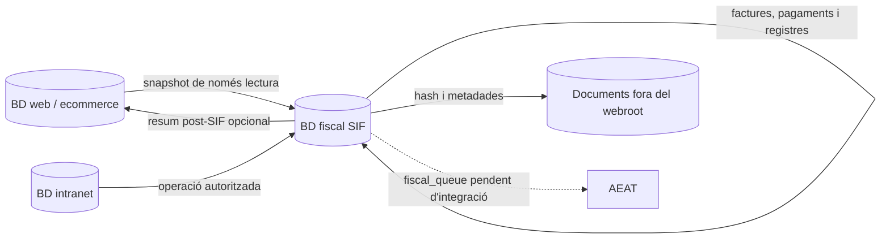

La font fiscal és el SIF. Les taules web/intranet conserven operativa i compatibilitat, però no decideixen numeració, hash, registre ni estat AEAT.

## 4. Numeració i cadena fiscal

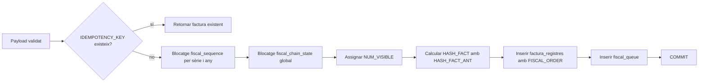

La numeració humana segueix `TIPUS_SERIE + ANY_FACT + NUM_SEQ`; la cadena segueix l'ordre temporal global `FISCAL_ORDER`. No s'utilitza `SELECT MAX()+1`.

## 5. Estat de factura

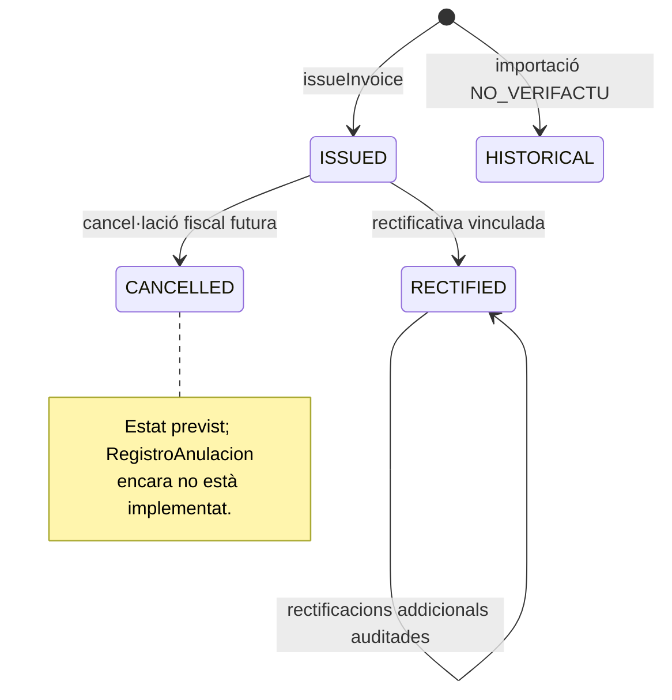

Una factura emesa no torna a esborrany ni s'edita. `HISTORICAL` és el valor utilitzat pel circuit d'importació, encara que el diccionari documental original necessiti actualitzar-se perquè el reculli explícitament.

## 6. Estat de cobrament

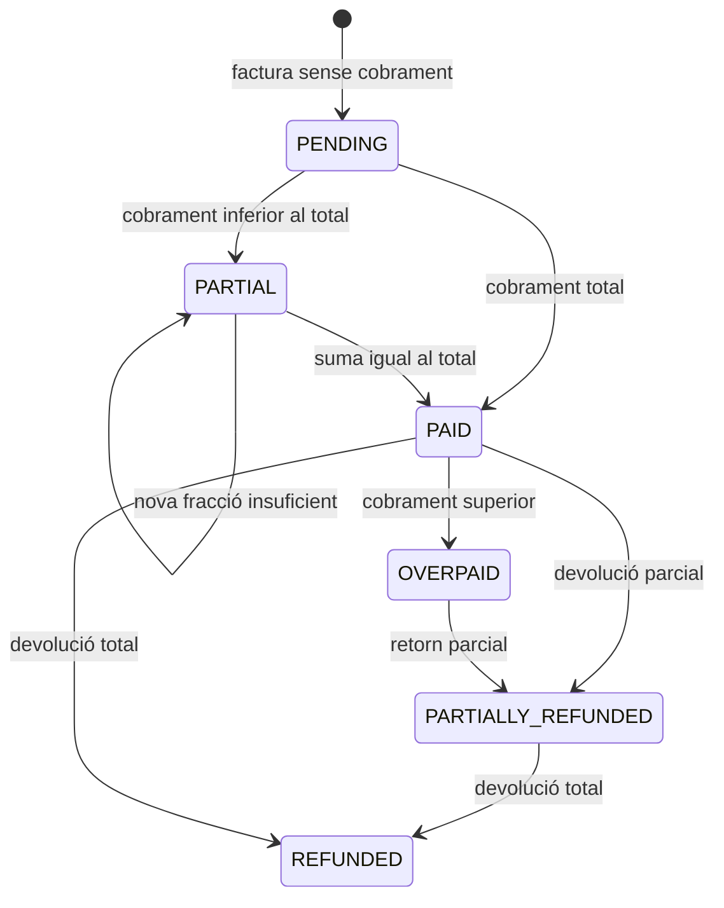

`PaymentStatusCalculator` deriva l'estat dels càrrecs i devolucions assignats. Una compensació entra com a moviment econòmic i també participa en el saldo aplicat a la factura.

## 7. Cua fiscal AEAT `[BASE/DISSENY]`

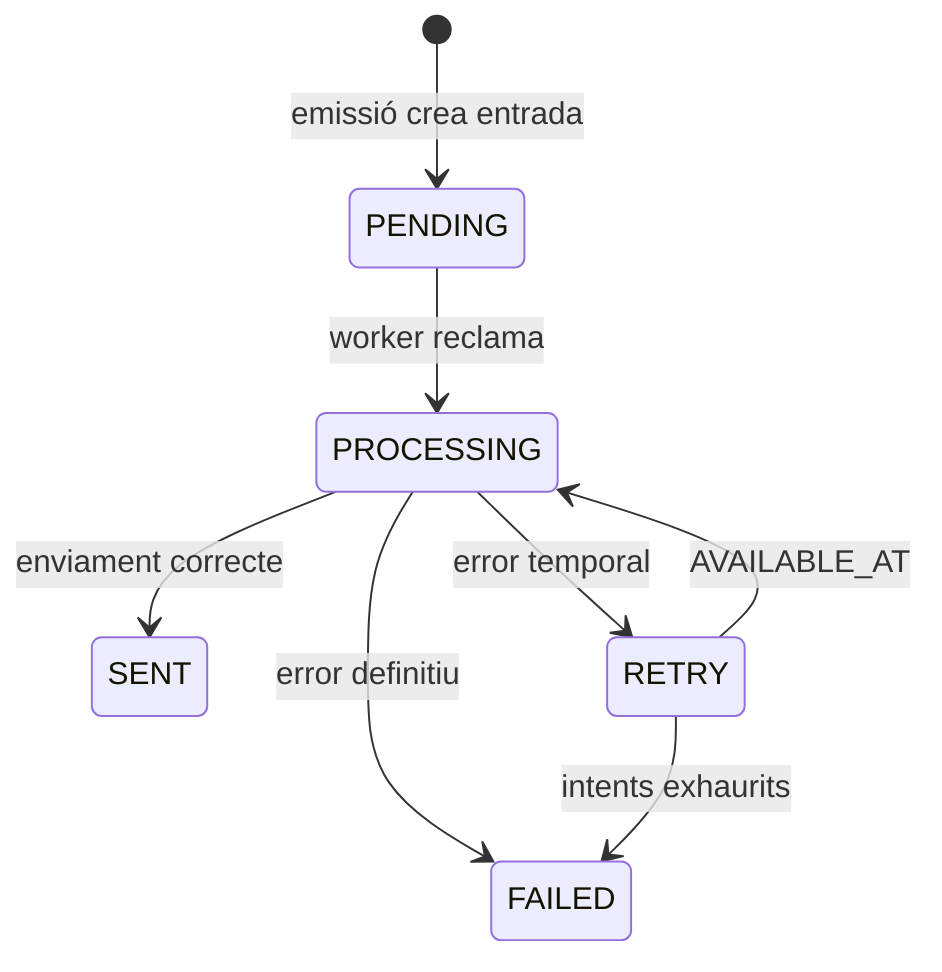

La taula i l'entrada `PENDING` existeixen. El worker/client AEAT, el certificat, l'XML/XSD i les transicions efectives encara no estan implementats al codi revisat.

## 8. Intenció, notificació i cua Redsys `[ASYNC]`

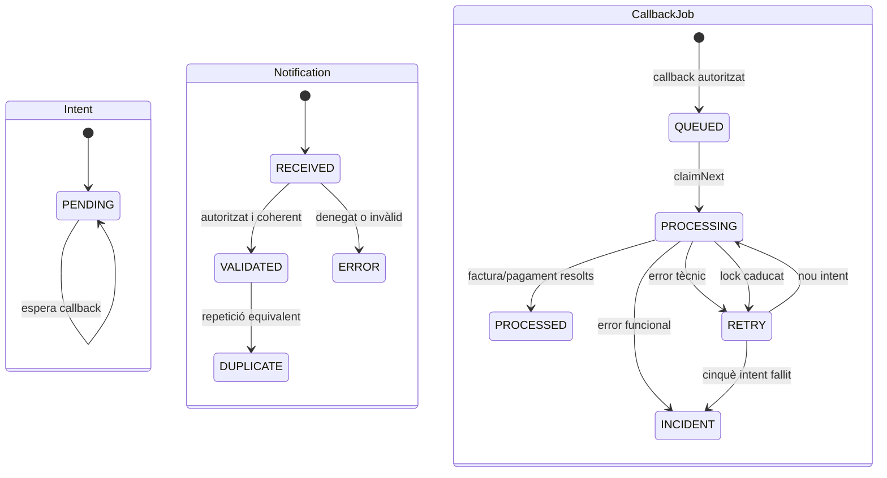

Un callback denegat conserva notificació però no crea job. Un duplicat contradictori obre incidència. El resultat `PROCESSED` conserva els UUIDs de factura i pagament.

## 9. Moviments i assignacions

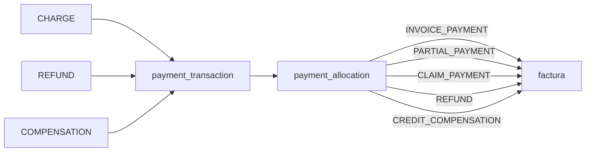

Els valors `CLAIM_PAYMENT` i `CREDIT_COMPENSATION` apareixen als circuits implementats i han de mantenir-se sincronitzats amb el diccionari de camps, que encara mostra una llista inicial més curta.

## 10. Claus d'idempotència

| Àmbit | Clau única o patró | Efecte evitat |
| --- | --- | --- |
| Factura | `factura.IDEMPOTENCY_KEY` | Factura o número duplicats. |
| Pagament | `payment_transaction.IDEMPOTENCY_KEY` | Moviment i assignació duplicats. |
| Cua AEAT | `fiscal_queue.IDEMPOTENCY_KEY` | Doble remissió planificada. |
| Notificació Redsys | `redsys_notifications.DS_ORDER` | Reprocessament del callback. |
| Intenció Redsys | `redsys_payment_intent.DS_ORDER` | Context previ ambigu. |
| Job Redsys | `NOTIFICATION_ID UNIQUE` | Dos jobs per notificació. |
| Registre fiscal | `factura_registres.FISCAL_ORDER` | Fork de la cadena global. |
| Rectificació | parella rectificativa/original única | Vincle duplicat. |

## 11. Cobertura de les setze taules

| Grup | Taules | Estat |
| --- | --- | --- |
| Facturació | `factura`, `factura_linia`, `factura_registres`, `factura_rectificacio` | Base implementada; anul·lació/subsanació pendents. |
| Ordre fiscal | `fiscal_sequence`, `fiscal_chain_state`, `fiscal_queue` | Escriptura base implementada; consumidor AEAT pendent. |
| Economia | `payment_transaction`, `payment_allocation`, `credit_balance` | Serveis base implementats. |
| Relacions/documents/errors | `fact_rels`, `factura_documents`, `errors_verifactu` | Repositoris base; panell/workers pendents. |
| Redsys | `redsys_notifications`, `redsys_payment_intent`, `redsys_callback_queue` | Circuit complet a la branca asíncrona. |

## 12. Dades llegades descobertes a les còpies actuals

Aquest model és inferit de consultes i escriptures PHP, no d'un `SHOW CREATE TABLE`. Només mostra els camps necessaris per entendre la migració de pagament i factura.

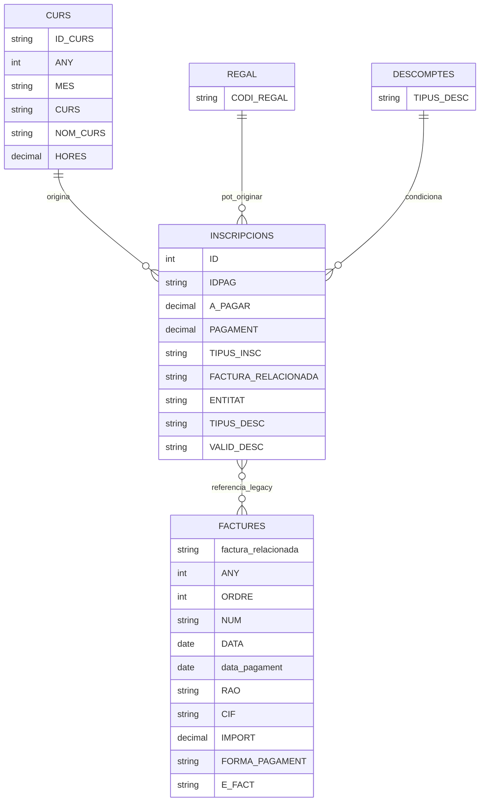

La relació `INSCRIPCIONS`–`FACTURES` no s'ha de traslladar com una clau fiscal fiable sense conciliació. `IDPAG`, `FACTURA_RELACIONADA`, `ANY`, `ORDRE` i `NUM` són identificadors o resums llegats; el SIF ha de generar i conservar els seus UUID, idempotency keys, número visible i cadena fiscal.

### 12.1. Traducció cap al SIF

| Dada llegada | Destí o tractament SIF | Regla |
| --- | --- | --- |
| `inscripcions.IDPAG` | `fact_rels` / `ORIGIN_REF` / context de la intenció | Correlació, mai única autoritat fiscal. |
| `A_PAGAR`, `PAGAMENT` | Snapshot comercial i conciliació | El saldo SIF es deriva dels moviments persistits. |
| `FACTURA_RELACIONADA` | Relació llegada auditada | No substitueix l'UUID de factura. |
| `RAO`, `CIF`, `ADRECA`, `CP`, `POBLACIO` | Snapshot del receptor | Es congela en emetre; no es rellegeix per reescriure una factura emesa. |
| `CONCEPTE1`, `CONCEPTE2`, `IMPORT`, `CURS`, `HORES` | `factura_linia` | Construcció específica per curs, pack, grup, regal o USOC. |
| `data_pagament`, `FORMA_PAGAMENT` | `payment_transaction` i `payment_allocation` | Moviment separat de la factura. |
| `ANY`, `ORDRE`, `NUM` | Migració/relació o número visible validat | La nova numeració es reserva només al SIF. |
| `E_FACT` | Preferència/estat d'e-factura | Canvi auditat; no altera l'empremta d'una factura emesa. |

### 12.2. Dades de col·laboradors separades

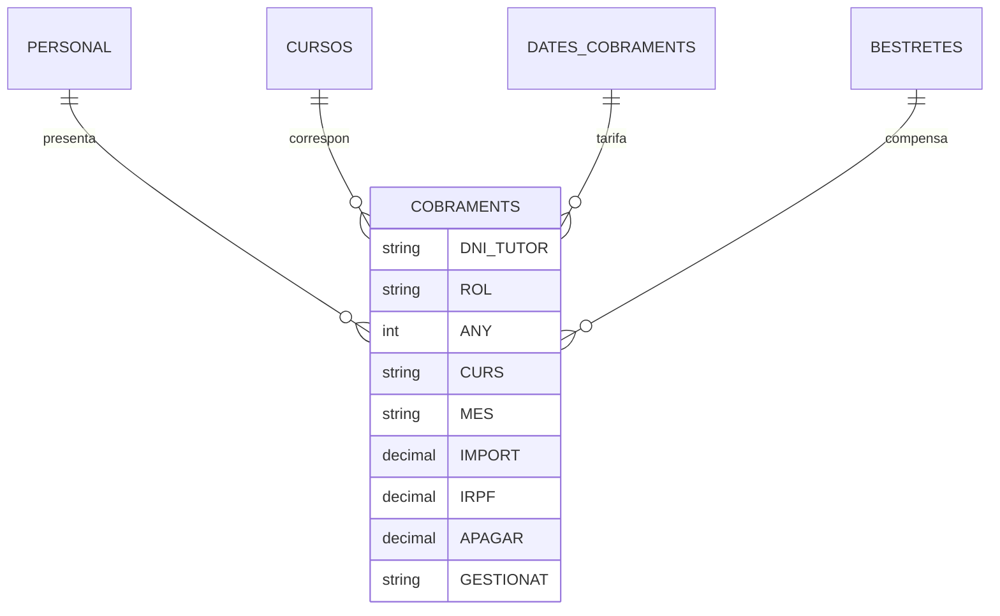

Aquest segon grup representa honoraris i factures/rebuts rebuts de tutors. No s'ha de barrejar amb `payment_transaction` de cobraments a clients ni amb les factures emeses pel SIF.

## 13. Model registral ampliat que falta `[DISSENY]`

Les setze taules inventariades cobreixen el nucli fiscal/econòmic i la branca Redsys, però no totes les evidències necessàries per gestionar el sistema complet. Aquest diagrama és un model conceptual; els noms finals s'han de concretar en una migració revisada.

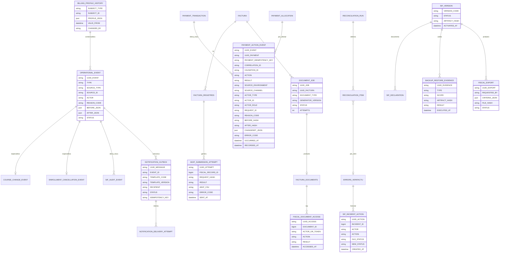

### 13.1. Ampliacions imprescindibles de taules existents

Abans d'aquestes ampliacions cal afegir `payment_action_event` com a ledger append-only. Ha de permetre correlacionar intents previs a la creació, consultes, canvis, denegacions, errors i resultats de tots els entorns. Les mutacions confirmades han de conservar l'event terminal en la mateixa transacció que el moviment o assignació.

| Taula actual | Mancança detectada | Ampliació mínima a validar |
| --- | --- | --- |
| `factura` | L'esquema base no conserva tots els camps tipificats al diccionari normatiu amb la mateixa granularitat. | Emissor, descripció d'operació, règims/causes, SIF/productor, timestamps i versionat necessaris per reconstruir el registre. |
| `factura_registres` | Està orientada a `ALTA`; no hi ha circuit executable d'anul·lació/subsanació. | Tipus i indicadors registrals, referència al registre anterior/corregit, dades `RechazoPrevio`/`SinRegistroPrevio`, XML i estat per registre. |
| `fiscal_queue` | Conserva payload i últim error, però no tots els intents/respostes. | Proper retry, primer/últim enviament, lock owner, request hash, dead-letter i relació amb `aeat_submission_attempt`. |
| `factura_documents` | Registre base curt. | Job, versió del generador, storage ref no públic, estat controlat, QR data/hash, metadades d'enviament i accessos. |
| `errors_verifactu` | Només conté factura, tipus, estat i details. | Prioritat, origen, objecte genèric, error, responsable, resolució i historial d'accions. |
| `fact_rels` | Aporta origen i visibilitat bàsica. | Política/subjecte de visibilitat, relació amb event operatiu i justificació d'excepcions. |
| `redsys_notifications` | Conserva recepció normalitzada. | Relació explícita amb intenció/job/resultat quan s'integri la branca asíncrona. |

La migració 000004 materialitza les ampliacions de `factura`,
`factura_linia`, `factura_registres`, `fiscal_queue` i `factura_documents`.
Continuaran sent pendents fins que s'apliquin, els writers les omplin i es
validin amb dades de preproducció. `errors_verifactu`, `fact_rels` i la relació
completa de notificacions Redsys mantenen les ampliacions en taules de control
o en disseny.

### 13.2. Invariants del ledger de pagaments

- no hi ha petició externa sobre pagament sense `CORRELATION_ID` i `payment_action_event`;
- `UUID_PAYMENT` pot ser nul en `REQUESTED`, `REJECTED` o `FAILED` previs a la creació, però la clau idempotent ha de permetre correlació;
- tota mutació confirmada té un event terminal `SUCCEEDED`, `REUSED` o `NO_CHANGE` dins el mateix commit;
- una consulta o exportació només retorna dades després de persistir l'event d'accés;
- un `REQUESTED` sense event terminal dins el temps previst genera incidència;
- no hi ha `UPDATE` o `DELETE` funcional sobre `payment_action_event`;
- no es guarden secrets ni dades completes de targeta dins `CHANGESET_JSON`;
- correccions d'assignació generen nous registres i events, no reescriptura silenciosa.

## 14. Estats de correcció i incidència que també formen part del model

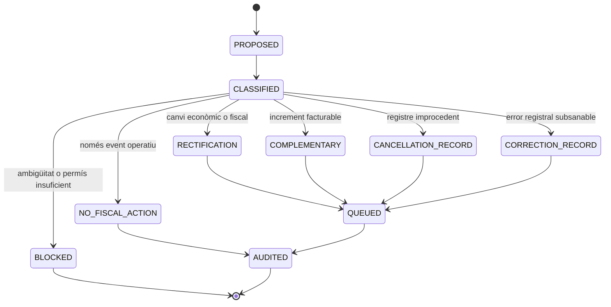

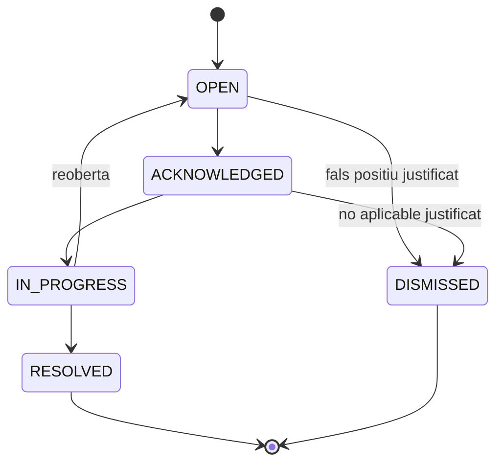

La definició funcional, l'origen i el criteri de completitud d'aquests registres és el document 38.

## 15. Esquema físic incorporat per la migració 000003

El diagrama següent mostra les relacions principals de la migració additiva. Les
taules de log poden existir abans que l'objecte de negoci; per això algunes
relacions amb pagament o document són opcionals.

```mermaid
erDiagram
  PAYMENT_TRANSACTION ||--o{ PAYMENT_ACTION_EVENT : "pot relacionar"
  FACTURA ||--o{ OPERATIONAL_EVENT : "context fiscal"
  PAYMENT_TRANSACTION ||--o{ OPERATIONAL_EVENT : "context economic"
  OPERATIONAL_EVENT ||--o| COURSE_CHANGE_EVENT : "especialitza"
  OPERATIONAL_EVENT ||--o| ENROLLMENT_CANCELLATION_EVENT : "especialitza"
  FACTURA_REGISTRES ||--|| FACTURA_REGISTRE_CONTROL : "amplia"
  FACTURA_REGISTRES ||--o{ AEAT_SUBMISSION_ATTEMPT : "genera intents"
  FISCAL_QUEUE ||--o{ AEAT_SUBMISSION_ATTEMPT : "programa"
  FACTURA ||--o{ DOCUMENT_JOB : "demana"
  FACTURA_DOCUMENTS ||--o| DOCUMENT_JOB : "resultat"
  FACTURA_DOCUMENTS ||--o{ FISCAL_DOCUMENT_ACCESS : "acces"
  FACTURA ||--o{ NOTIFICATION_OUTBOX : "pot notificar"
  PAYMENT_TRANSACTION ||--o{ NOTIFICATION_OUTBOX : "pot notificar"
  NOTIFICATION_OUTBOX ||--o{ NOTIFICATION_DELIVERY_ATTEMPT : "intenta"
  ERRORS_VERIFACTU ||--o{ SIF_INCIDENT_ACTION : "historial"
  SIF_VERSION ||--o{ SIF_DECLARATION : "documenta"
  FISCAL_EXPORT ||--o{ FISCAL_EXPORT_ACCESS : "registra acces"
  RECONCILIATION_RUN ||--o{ RECONCILIATION_ITEM : "conte"
  FACT_RELS ||--|| FACT_RELS_CONTEXT : "justifica"
  OPERATIONAL_EVENT ||--o{ FACT_RELS_CONTEXT : "origina"
```

### 15.1. Diferència entre disseny conceptual i disponibilitat

| Capa | Estat després d'aquesta revisió |
| --- | --- |
| Disseny de responsabilitats | Documentat per a les 21 taules de la migració. |
| SQL i índexs | Implementats en una migració forward-only/idempotent per `CREATE TABLE IF NOT EXISTS`. |
| Repositoris append-only bàsics | Implementats per `payment_action_event` i `operational_event`. |
| Integració amb tots els casos/canals | Pendent i bloquejant. |
| Permisos reals de preproducció/producció | Plantilla disponible; execució i evidència pendents. |
| Certificació de compliment | No assolida; requereix implementació, proves i aprovació. |

## 16. Esquema físic d'operació comercial incorporat per la migració 000004

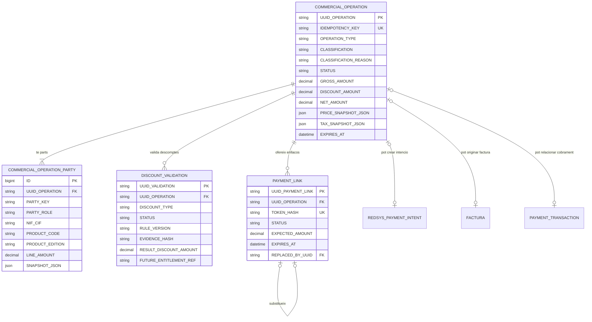

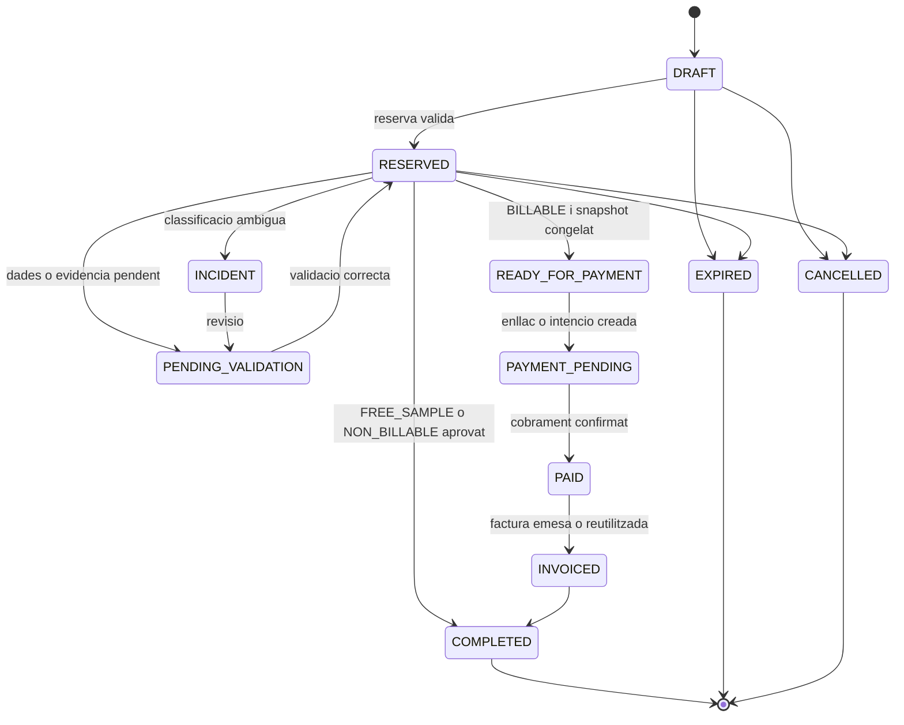

`FREE_SAMPLE` i `SUBSIDISED_PENDING_DECISION` són classificacions, no estats
econòmics. La primera pot acabar en `COMPLETED` sense factura ni pagament; la
segona no pot avançar a `READY_FOR_PAYMENT` fins que negoci/fiscalitat decideixi
finançador, receptor i document aplicable.
