# 36 - Mapa de components, punts d'entrada i integracions del SIF

Data de tall: 2026-09-15

## 1. Objectiu i límits

Aquest document completa les vistes de classes, seqüències, casos d'ús i dades amb els elements que no són classes: fitxers procedimentals, endpoints, scripts, configuració, migracions, proves, bases de dades, processos externs i fronteres de seguretat.

Llegenda:

- `[BASE]`: present al checkout `checkpoint/sif-fase-0-4`;
- `[ASYNC]`: present a `feature/redsys-async-queue`;
- `[LEGACY]`: còpies actuals o històriques dins `codi-drive`, no nou codi SIF;
- `[CANDIDAT]`: fitxers que pretenen incorporar canvis VERI*FACTU, encara no demostrats com a integració completa;
- `[DISSENY]`: component requerit però no implementat completament al repositori.

## 2. Context complet del sistema

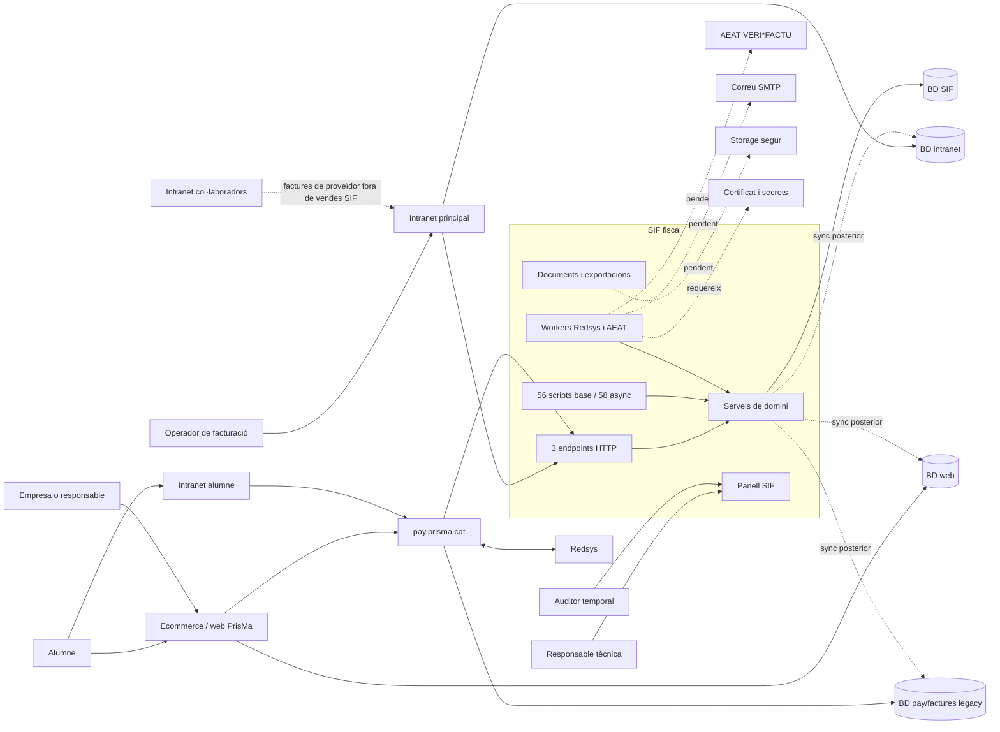

La font fiscal ha de ser la BD SIF. Les tres BDs llegades aporten snapshots o reben compatibilitat posterior, però no poden modificar una factura SIF emesa.

## 3. Topologia real del repositori

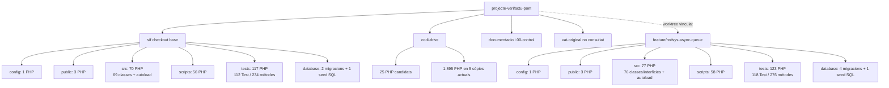

| Tall | PHP totals | SQL totals | Observació |
| --- | ---: | ---: | --- |
| `sif/` base | 247 | 3 | 69 classes de producció, 56 scripts, 3 endpoints i 117 fitxers de prova. |
| `sif/` branca asíncrona | 262 | 5 | Afegeix 7 peces OO, 2 scripts, 6 classes `*Test`, 42 mètodes de prova i 2 migracions. |
| `codi-drive/` | 1.920 | 0 | Set carpetes: 25 PHP candidats i 1.895 PHP de còpies actuals/històriques; inclou biblioteques, proves i còpies datades. |

## 4. Les set carpetes de `codi-drive` i els 25 PHP candidats

### 4.1. Inventari de carpetes

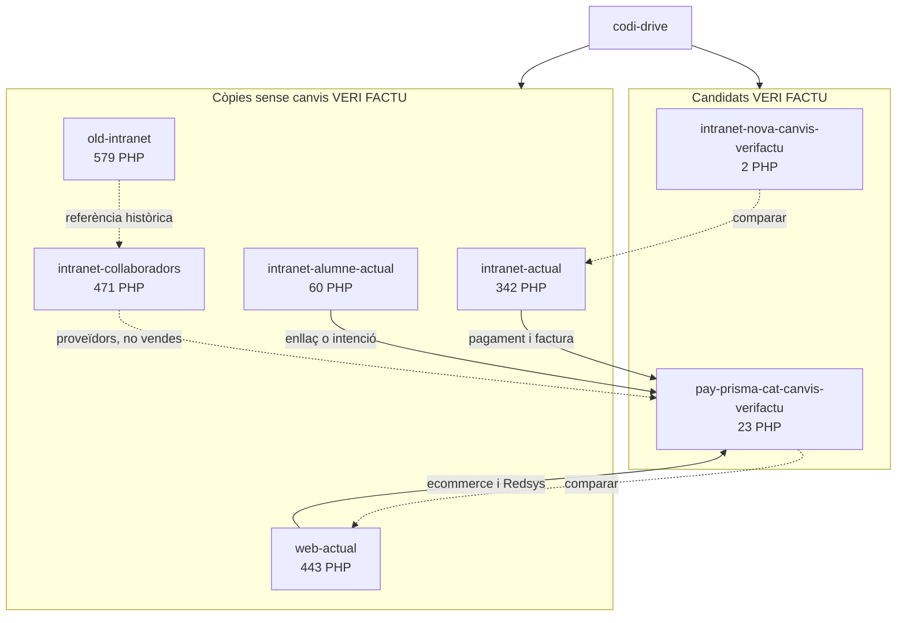

| Carpeta | Fitxers totals | PHP | Paper |
| --- | ---: | ---: | --- |
| `intranet-nova-canvis-verifactu` | 2 | 2 | Candidata d'intranet. |
| `pay-prisma-cat-canvis-verifactu` | 23 | 23 | Candidata de pagament. |
| `intranet-actual` | 1.638 | 342 | Operació interna actual. |
| `web-actual` | 792 | 443 | Ecommerce i pagament actual. |
| `intranet-alumne-actual` | 101 | 60 | Consulta i enllaç de pagament de l'alumne. |
| `old-intranet` | 769 | 579 | Històric procedimental. |
| `intranet-collaboradors` | 3.523 | 471 | Tutors, honoraris i factures/rebuts de proveïdor. |
| **Total** | **6.848** | **1.920** |  |

### 4.2. Els 25 fitxers de les carpetes candidates

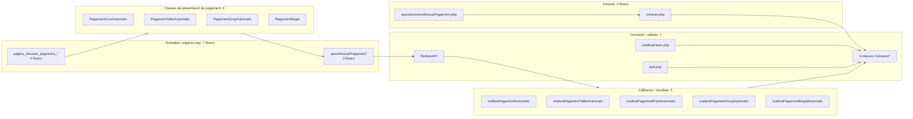

| Grup | Fitxers exactes | Nombre |
| --- | --- | ---: |
| Intranet | `Intranet.php`, `ajax/alumnes/efectuarPagament.php` | 2 |
| AJAX pay | `ajax/efectuarPagament.php`, `ajax/efectuarPagamentRegal.php`, `ajax/efectuarPagamentRegalAutomatic.php` | 3 |
| Connexions | `ConnexioBBDD_PreparedStatment.php`, `ConnexioIntranet.php`, `ConnexioPay.php`, `ConnexioWeb.php` | 4 |
| Utilitats | `codificarHash.php`, `doit.php`, `inc/apiRedsys.php` | 3 |
| Classes de pagament | `PagamentCursAutomatic.php`, `PagamentTallerAutomatic.php`, `PagamentGrupAutomatic.php`, `PagamentRegalAutomatic.php` | 4 |
| Pàgines | `pagina_efectuar_pagament_automatic.php`, `pagina_efectuar_pagament_taller_automatic.php`, `pagina_efectuar_pagament_grup_automatic.php`, `pagina_efectuar_pagament_regal_automatic.php` | 4 |
| Callbacks | `realitzaPagamentAutomatic.php`, `realitzaPagamentTallerAutomatic.php`, `realitzaPagamentPackAutomatic.php`, `realitzaPagamentGrupAutomatic.php`, `realitzaPagamentRegalAutomatic.php` | 5 |
| **Total** |  | **25** |

El pack té callback propi però no una classe/pàgina `PagamentPackAutomatic` separada en aquesta còpia; el comportament de pack apareix dins el flux de grup i fitxers associats. Aquesta asimetria s'ha de preservar en la migració i validar amb el codi actual.

La comparació dels 25 PHP dona 14 fitxers idèntics, 8 de diferents i 3 sense homòleg directe. No s'hi ha trobat cap crida als endpoints SIF; el detall i els criteris de comparació són al document 37.

## 5. Composició dels tres endpoints reals `[BASE]`

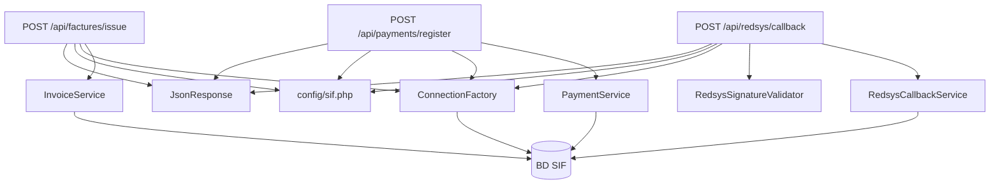

No existeix `GET /api/incidencies` al checkout. La consulta d'incidències pertany al panell objectiu i s'ha de considerar `[DISSENY]` fins que hi hagi ruta, autorització i proves.

## 6. Fronteres de confiança i desplegament objectiu

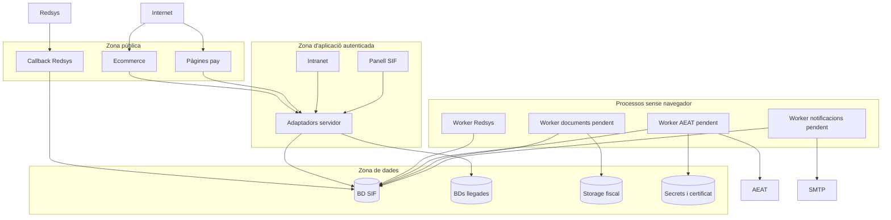

Controls necessaris a cada travessa: TLS, autenticació servidor, rol i abast, CSRF quan hi ha sessió web, validació de signatura Redsys, idempotència, mínim privilegi de BD, secrets fora del repo/webroot i auditoria de les operacions crítiques.

## 7. Runtime asíncron Redsys `[ASYNC]`

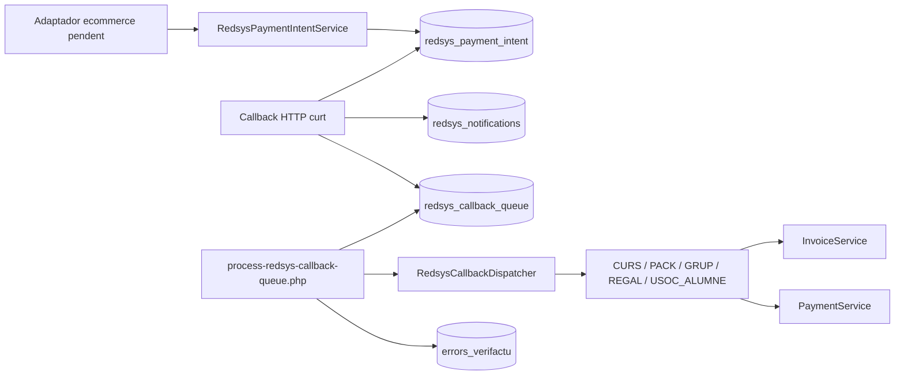

La branca implementa el circuit intern, però l'adaptador que crea la intenció abans del TPV i la integració/desplegament sobre la base principal continuen pendents.

## 8. Proves, migracions i porta de desplegament

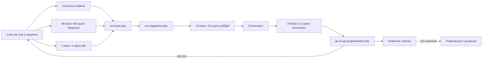

Els recomptes de preflight/process de la branca inclouen els dos scripts nous de cua; preview no incorpora cap script nou. Un resultat de proves correcte no substitueix la connexió a preproducció, el certificat AEAT, les proves de permisos ni l'autorització formal.

## 9. Arquitectura d'informació de les 192 pantalles/apartats

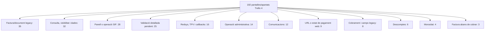

Aquesta agrupació reprodueix les 12 famílies disjuntes de la matriu i totalitza 192, però no substitueix el seguiment individual de les quatre fases de cada pantalla.

## 10. Allò que aquest mapa no pot afirmar

- Les carpetes `*-actual` són còpies locals declarades com a actuals, però aquesta auditoria no certifica que coincideixin byte a byte amb cada servidor productiu.
- Les 510 funcions d'`intranet-actual/Intranet.php` inclouen molta funcionalitat no fiscal; només s'han de portar al SIF les operacions amb impacte en factura, cobrament, document, incidència o auditoria.
- El volum de 1.920 PHP inclou biblioteques, proves, còpies datades i codi procedimental; no equival a 1.920 components a migrar.
- El nom `canvis-verifactu` no prova integració: els 25 candidats encara no invoquen els endpoints SIF detectats.
- Els 112/118 tests descriuen el que el repositori prova, no certifiquen per si sols producció ni compliment AEAT.
- Panell, client/worker AEAT, documents segurs, outbox, auditoria transversal, backup executable i reconciliació SIF-llegat continuen pendents o parcials.
- Qualsevol diagrama del sistema productiu complet requerirà contrastar els fitxers no copiats i l'entorn real, sense importar credencials al repositori.

## 11. Relació amb el volum Trello i el backlog granular

Els casos d'ús no són sinònims de targetes. El repositori conté una base reconciliada de 13.277 targetes petites, procedent de documents, Trellos històrics i 6.842 ítems de checklist. Els exports del 2026-06-14 mostren 3.241 targetes obertes a Trello 1, 4.101 a Trello 4, 3.194 a Trello 5 i 3.528 a Trello 6. Són fotografies i conjunts amb deduplicació diferent; no s'han de sumar ni equiparar sense reconciliació.

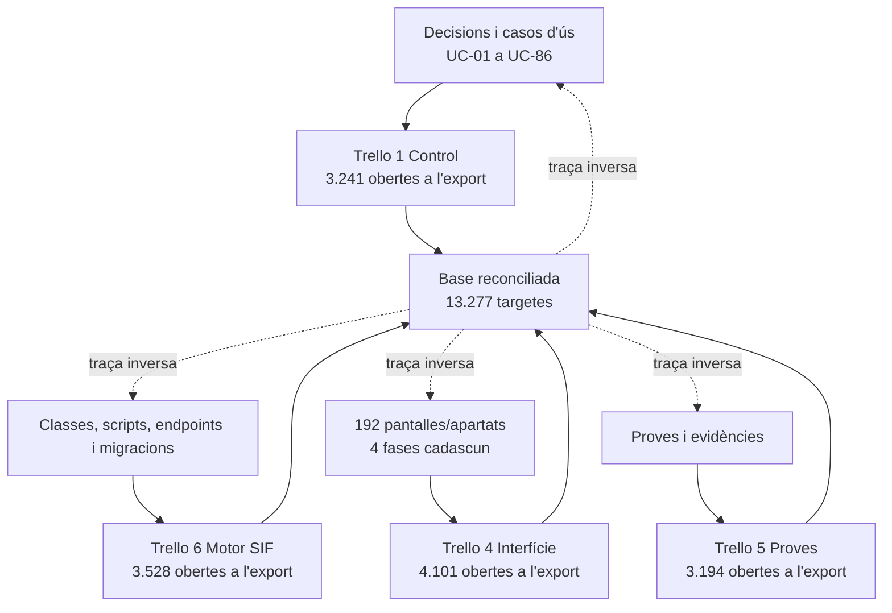

No es dibuixen 13.277 nodes: moltes targetes són passos d'implementació, proves, captures, textos, errors o duplicats històrics, no casos d'ús independents. La completitud correcta és conservar la cadena `decisió/cas -> criteri -> codi -> pantalla -> prova -> evidència -> documentació`, amb `30-mapa-trello-repo.md` i els inventaris de `00-control` com a traça granular.

## 12. Frontera d'integració de pagaments acordada

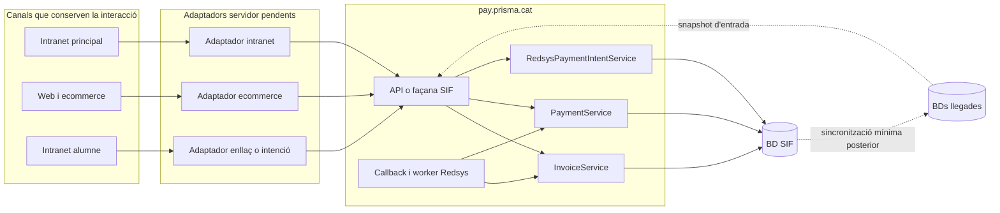

La lògica de pagament amb efecte fiscal que avui està repartida entre intranet i web s'ha de programar i operar a `pay.prisma.cat`. Els canals no han de reproduir numeració, hash, factura ni cobrament en paral·lel; només preparen l'ordre, presenten el resultat i reben compatibilitat posterior.

## 13. Mapa complet de gestió, registre i control

La frontera de pagament anterior no cobreix tota la transformació. `pay.prisma.cat` també ha d'allotjar el pla de control del SIF: correccions fiscals, evidències, cues, incidències, auditoria i governança. La intranet manté la gestió diària, però delega qualsevol decisió que afecti una factura emesa o un registre fiscal.

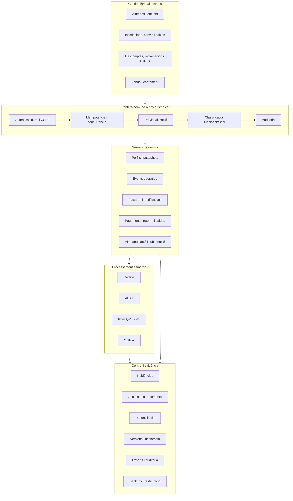

### 13.1. Propietat de cada responsabilitat

| Responsabilitat | Canal | SIF `pay.prisma.cat` | Llegat |
| --- | --- | --- | --- |
| Capturar dades i intenció de l'usuari | Sí | Valida | Pot aportar dades d'origen |
| Decidir emissió, cobrament o correcció | No | Sí | No |
| Crear factura, registre, pagament o document | No | Sí | Només resum posterior |
| Registrar canvi de curs, baixa o reclamació | Inicia i consulta | Conserva event/impacte si és crític | Pot mantenir operativa sincronitzada |
| Autoritzar una acció fiscal | UI orientativa | Autoritat servidor | No |
| Gestionar AEAT, retries i dead-letter | No | Sí | No |
| Resoldre incidència fiscal | Enllaça i mostra resum | Sí | No |
| Servir document fiscal | Demana accés | Autoritza, registra i serveix | No exposa fitxer |
| Versionar, exportar i demostrar continuïtat | No | Sí | Font de contrast en reconciliació |

La matriu executable de canvi és `38-matriu-transformacio-funcional-verifactu.md`. Cap adaptador de pagament es pot donar per complet si les gestions que l'envolten continuen modificant factures o imports per una ruta alternativa.
