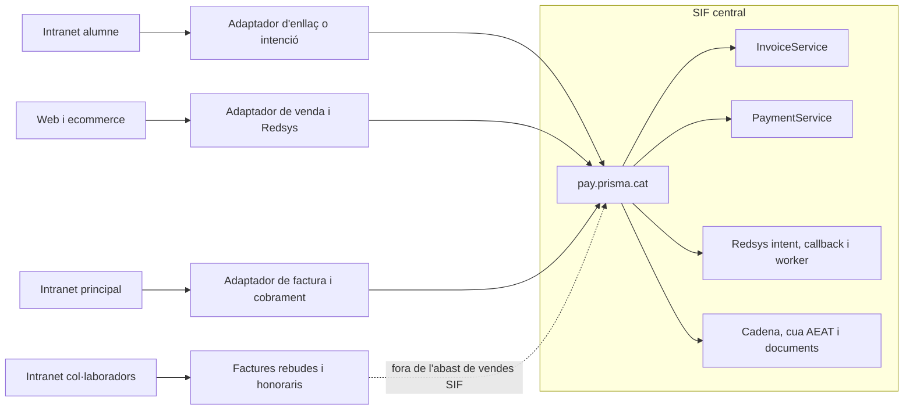
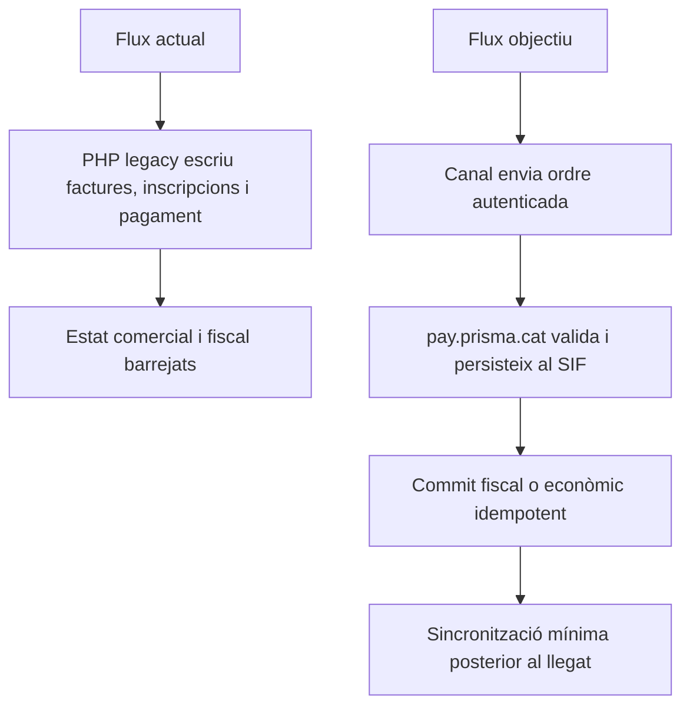

# 37 - Auditoria comparativa de les còpies de `codi-drive`

Data de tall: 2026-09-15

## 1. Objectiu

Aquest document contrasta les dues carpetes que pretenen contenir els canvis VERI*FACTU amb les cinc còpies declarades com a sistemes actuals. L'objectiu no és convertir tot el llegat en SIF, sinó identificar tant els punts de pagament i facturació com les gestions, registres, documents, permisos i evidències que la intranet i la web han de delegar o coordinar amb el SIF central de `pay.prisma.cat`.

No s'ha llegit el JSONL de `xat-original`. L'auditoria deriva exclusivament dels fitxers copiats, el codi `sif/` i la documentació vigent.

## 2. Inventari rebut

| Carpeta | Funció declarada | Fitxers | PHP |
| --- | --- | ---: | ---: |
| `intranet-nova-canvis-verifactu` | Proposta d'intranet adaptada | 2 | 2 |
| `pay-prisma-cat-canvis-verifactu` | Proposta de pagament adaptada | 23 | 23 |
| `intranet-actual` | Intranet actual sense VERI*FACTU | 1.638 | 342 |
| `web-actual` | Web/ecommerce actual sense VERI*FACTU | 792 | 443 |
| `intranet-alumne-actual` | Portal de l'alumne actual | 101 | 60 |
| `old-intranet` | Intranet històrica | 769 | 579 |
| `intranet-collaboradors` | Portal de tutors/col·laboradors | 3.523 | 471 |
| **Total** |  | **6.848** | **1.920** |

Els 1.895 PHP de les cinc còpies actuals no són tots codi actiu: hi ha biblioteques incorporades, còpies datades, proves i fitxers procedimentals. Per això la cobertura correcta combina inventari de fitxers, classes pròpies, punts d'entrada i famílies funcionals.

## 3. Comparació dels 25 PHP candidats

S'ha escollit com a homòleg `intranet-actual` per a la proposta d'intranet i `web-actual` per a la proposta `pay`, amb la còpia d'intranet com a segon origen per a connexions compartides.

| Resultat | Nombre | Fitxers o grups |
| --- | ---: | --- |
| Idèntics | 14 | `ajax/alumnes/efectuarPagament.php`; els 3 `ajax/efectuarPagament*`; `codificarHash.php`; `ConnexioBBDD_PreparedStatment.php`; `ConnexioIntranet.php`; `inc/apiRedsys.php`; `PagamentGrupAutomatic.php`; `PagamentRegalAutomatic.php`; `PagamentTallerAutomatic.php`; callbacks de grup, pack i taller. |
| Diferents | 8 | `Intranet.php`; `ConnexioWeb.php`; `PagamentCursAutomatic.php`; les 4 pàgines `pagina_efectuar_pagament_*_automatic.php`; callback de regal. |
| Sense homòleg directe | 3 | `ConnexioPay.php`, `doit.php`, `realitzaPagamentAutomatic.php`. |

### 3.1. `Intranet.php` candidata no és una fusió completa de l'actual

| Mesura | `intranet-actual/Intranet.php` | `intranet-nova-canvis-verifactu/Intranet.php` |
| --- | ---: | ---: |
| Línies | 39.229 | 37.603 |
| Declaracions `function` | 510 | 495 |
| Noms de mètode únics | 444 | 432 |
| Mètodes públics | 304 | 292 |
| Mètodes privats | 117 | 117 |
| Sense visibilitat explícita | 89 | 86 |

La comparació de línies dona 112 addicions i 1.738 supressions a la candidata. No s'ha trobat cap línia fiscal nova afegida que invoqui el SIF; en canvi, la candidata no conté dotze mètodes presents a l'actual, principalment de comunicacions. Això obliga a reconciliar versions abans d'aplicar cap adaptador.

### 3.2. Diferències de `pay`

Les diferències detectades a `pay` són sobretot:

- canvi de rutes i recursos des de `www.prisma.cat` cap a `pay.prisma.cat`;
- canvi de formularis de confirmació i callbacks;
- reorganització de dades personals i de facturació a `PagamentCursAutomatic`;
- canvis menors de presentació i de signatures de constructors;
- selecció de configuració Redsys de prova en codi.

Aquests canvis poden preparar el trasllat del canal, però no substitueixen per si mateixos les escriptures directes a `factures` i `inscripcions` ni demostren la integració amb el nucli `sif/`.

## 4. Prova negativa d'integració SIF

Als 25 PHP candidats no s'ha detectat cap referència als tres endpoints executables:

- `POST /api/factures/issue`;
- `POST /api/payments/register`;
- `POST /api/redsys/callback`.

Tampoc no s'hi han detectat referències a les taules `factura_registres`, `payment_transaction`, `fiscal_queue`, `redsys_payment_intent` o `redsys_callback_queue`. En canvi, set scripts candidats continuen contenint escriptures o actualitzacions sobre `factures`, `inscripcions`, `PAGAMENT`, `GENERAT` o `FACTURA_RELACIONADA`.

Conclusió: l'estat actual és `[CANDIDAT/PARCIAL]`, no `[INTEGRAT]`.

## 5. Superfície funcional que ara sí consta al repositori

### 5.1. Intranet principal

`intranet-actual` aporta 342 PHP. La classe `Intranet` concentra 510 declaracions de funció i exposa famílies que afecten el SIF:

- consulta, cerca i edició d'alumnes, entitats i responsables;
- `mostrarPagaments`, `mostrarModalConfPag` i `efectuarPagament*`;
- `generaFactura`, proforma, factura abans de pagar i factura electrònica;
- consulta, descàrrega i anul·lació de factura;
- canvi de curs, baixa, devolució, saldo i reclamacions;
- conciliació TPV, duplicats `IDPAG`, descomptes i morositat.

S'han detectat 137 PHP amb un nom relacionat amb alumnes, factures, pagaments, TPV, entitats, reclamacions o descomptes. No tots s'han de migrar: els punts amb efecte fiscal han de convertir-se en adaptadors al SIF.

### 5.2. Web/ecommerce

`web-actual` aporta 443 PHP i classes pròpies de catàleg, inscripció, promocions, pagament i regal. Les famílies principals són:

- producte: `Curs`, `Edicio`, `Pack`, `EdicioPack`, `RegalCurs`;
- inscripció: `InscripcioCurs`, `InscripcioPack`, `InscripcioTaller`, `InscripcioTastet`;
- descompte: `Descomptes`, `DescompteAmic`, `DescompteGrup`;
- pagament: `PagamentCurs`, `PagamentCursAutomatic`, `PagamentGrupAutomatic`, `PagamentRegal`, `PagamentTallerAutomatic`;
- TPV: `RedsysAPI`, pàgines de pagament i callbacks `realitzaPagament*`.

S'han detectat 178 PHP amb nom funcional relacionat amb inscripcions, productes, descomptes, regals, pagaments o Redsys. Les còpies datades i de prova s'han de separar dels punts d'entrada actius abans de desplegar.

### 5.3. Intranet de l'alumne

`IntranetAlumne` té 68 noms de mètode únics. Consulta `A_PAGAR`, `PAGAMENT`, `IDPAG`, `TIPUS_INSC` i `ENTITAT`, mostra el pendent i genera una ruta `/pagament/{token}` o `/pagaments/{token}` amb `obtenirUrlPagament()`.

Aquest canal no ha d'emetre la factura directament. Ha d'obtenir del servidor una intenció o un enllaç segur creat per `pay.prisma.cat`, sense exposar secrets ni usar `IDPAG` com a autoritat fiscal.

### 5.4. Intranet de col·laboradors i `old-intranet`

`IntranetTutor` té 71 noms de mètode únics i les pantalles de col·laboradors gestionen `cobraments`, `dates_cobraments`, `bestretes`, honoraris i factures/rebuts aportats pels tutors. `old-intranet` conserva una versió procedimental anterior del mateix circuit.

És un flux de proveïdors o col·laboradors, no el cobrament de vendes a alumnes. Es manté com a sistema adjacent i no entra al motor de factures emeses del SIF sense una decisió fiscal específica.

## 6. Arquitectura acordada





## 7. Buits que cal programar

1. Identificar els punts d'entrada actius, descartant còpies datades i `*Prova*`.
2. Crear un adaptador servidor autenticat per intranet, web i intranet alumne.
3. Crear la intenció Redsys al servidor abans de redirigir al TPV.
4. Fer que el callback públic sigui curt i delegui al worker asíncron.
5. Substituir les insercions directes a `factures` per `InvoiceService`.
6. Substituir les actualitzacions de cobrament per `PaymentService`.
7. Sincronitzar `GENERAT`, `PAGAMENT`, `FACTURA_RELACIONADA` i l'estat mínim només després del commit SIF.
8. Mapar curs, taller, jornada, pack, grup, regal, USOC, empresa i descomptes a snapshots immutables.
9. Connectar canvi de curs, baixa, devolució, rectificació, saldo, morositat i reclamació amb els serveis corresponents.
10. Externalitzar les claus Redsys, claus de xifrat i credencials; no poden quedar literals al webroot.
11. Afegir autorització, CSRF, auditoria, idempotència i proves d'integració per canal.
12. Reconciliar la candidata `Intranet.php` amb l'actual abans de modificar producció.
13. Substituir l'edició directa de dades de factura per un decisor de rectificació, anul·lació o subsanació.
14. Convertir canvi de curs i baixa en events auditables amb decisió econòmica/fiscal posterior.
15. Versionar dades mestres d'alumne/entitat i congelar snapshots de receptor.
16. Registrar ajusts, descomptes i despeses amb abans/després, motiu i aprovador.
17. Implementar el client/worker AEAT, intents, respostes, retries i dead-letter.
18. Implementar jobs i custòdia segura de PDF/QR/XML amb hash i registre d'accés.
19. Implementar outbox de comunicacions i evidència d'entrega.
20. Ampliar incidències amb prioritat, objecte, responsable, accions i resolució.
21. Implementar reconciliació SIF-llegat amb execucions i items traçables.
22. Implementar versions, declaració responsable, configuració i activació auditada.
23. Implementar exports, accés auditor i paquet d'inspecció.
24. Executar backup/restauració i conservar evidència d'integritat i continuïtat.

## 8. Criteri per considerar la integració completa

La integració només podrà passar de `[CANDIDAT/PARCIAL]` a `[INTEGRAT]` quan cada punt de pagament actiu tingui traça `canal -> adaptador -> endpoint/servei SIF -> prova -> evidència`, no faci una segona escriptura fiscal al llegat i superi preproducció amb secrets protegits.

## 9. Límits d'aquesta auditoria

- Els recomptes són una fotografia de les còpies locals, no una certificació del desplegament productiu.
- No s'ha executat PHP ni s'han connectat les bases de dades d'aquestes còpies.
- No s'han llegit valors de fitxers de paràmetres ni s'han reproduït secrets.
- La detecció de fitxers funcionals per nom és una ajuda d'inventari, no una prova de cobertura semàntica completa.
- Les còpies actuals són noves al worktree i s'han de sanejar abans de plantejar-ne cap commit.

## 10. Auditoria funcional i registral ampliada

La primera comparació demostrava sobretot que els pagaments encara no arribaven al SIF. La revisió ampliada confirma un buit més gran: les carpetes candidates tampoc integren el canvi de gestió posterior a l'emissió.

### 10.1. Mutacions llegades que continuen presents

| Mètode o família | Comportament actual observat | Risc VERI*FACTU |
| --- | --- | --- |
| `guardarDadesPagament_modalsresultatCerca()` | Desa `A_PAGAR`, `PAGAMENT`, data, IDPAG, fracció i factura relacionada. | Converteix una vista administrativa en editor econòmic/fiscal sense ledger. |
| `realitzarCanviCurs_modalCanviCurs()` | Canvia curs i imports dins el flux de la inscripció. | Pot perdre l'abans/després i no classificar rectificativa, diferència, retorn o saldo. |
| `confirmaBaixa_modalDonarBaixa()` | Marca la baixa i executa efectes operatius. | La baixa es pot confondre amb devolució o correcció fiscal. |
| `efectuarPagament*()` | Actualitza factura/inscripcions, reparteix imports i fraccions. | Pagament i factura continuen barrejats fora de `payment_transaction/allocation`. |
| `guardarDadesFactura_Factures()` | Executa `updDadesFact` sobre la factura. | Una factura emesa continua sent editable. |
| `anularFactura()` | Usa un únic flux per anul·lació i efectes econòmics. | No distingeix rectificativa, `RegistroAnulacion`, subsanació, retorn o saldo. |
| `generaFactura()` i descàrregues | La consulta pot generar el PDF. | El document pot dependre de dades vives i no d'un artefacte immutable. |
| correus directes i `Template` | Enviament acoblat al flux PHP. | Falta outbox, idempotència, retry i prova d'entrega posterior al commit. |

### 10.2. Prova negativa sobre les dues carpetes candidates

En els PHP/SQL/JS de les dues carpetes candidates no s'ha detectat cap referència als conceptes següents:

- `RegistroAnulacion`, `Subsanacion`, `RechazoPrevio`, `SinRegistroPrevio`;
- `factura_registres`, `fiscal_queue`, `fiscal_sequence`, `factura_documents`;
- `payment_transaction`, `payment_allocation`, `credit_balance`, `fact_rels`;
- `errors_verifactu`, versions del SIF, declaració responsable;
- auditoria comuna, event log, registre d'accés, outbox o enllaç segur.

La dada és una prova de codi absent, no una afirmació que cap requisit estigui documentat. Els requisits existeixen als documents del projecte, però encara no han estat integrats en aquestes còpies.

### 10.3. Buit entre el nucli `sif/` i l'estat final

El directori `sif/` sí implementa una base real de factura, línies, seqüència, cadena, registre d'alta, cua, pagaments, assignacions, relacions, crèdit, rectificativa manual, documents/incidències mínims i migració. La revisió de classes, endpoints, scripts i migració base no ha trobat encara implementació completa de:

- anul·lació registral i subsanació;
- client/worker AEAT productiu;
- dades persistents de versió i declaració;
- events de canvi de curs, baixa i historial de dades mestres;
- outbox i intents d'entrega;
- jobs de documents i registre d'accés;
- historial d'accions d'incidència;
- exportacions, reconciliació i evidència de backup/restauració;
- capa comuna d'autenticació, autorització, CSRF i auditoria dels endpoints.

### 10.4. Conseqüència

L'estat correcte del conjunt és:

```text
nucli SIF fiscal/econòmic: BASE PARCIAL
cua Redsys asíncrona: BRANCA PREPARADA, PENDENT D'INTEGRAR
canals candidats: CANVI DE RUTES I LÒGICA LEGADA, NO INTEGRATS
gestió funcional i registral completa: DISSENY/PENDENT
producció VERI*FACTU: NO-GO
```

La matriu completa de transformació és `38-matriu-transformacio-funcional-verifactu.md`; els serveis, seqüències, casos d'ús i dades corresponents són als documents 31 a 34.
