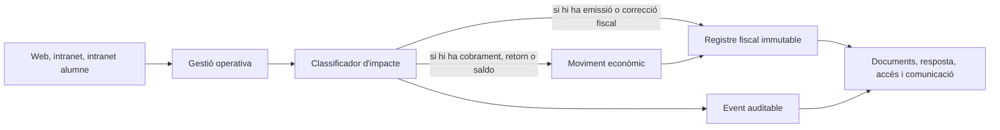
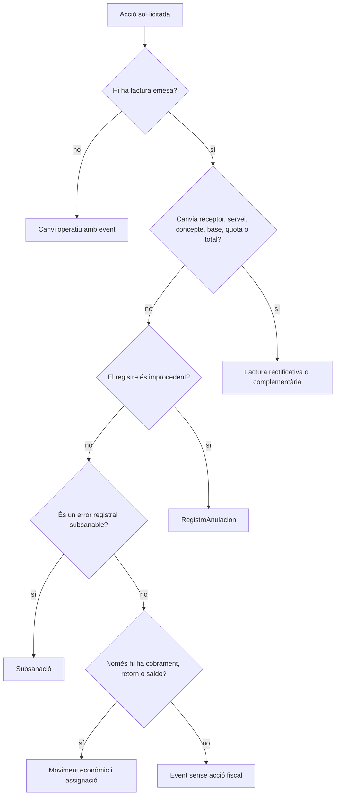
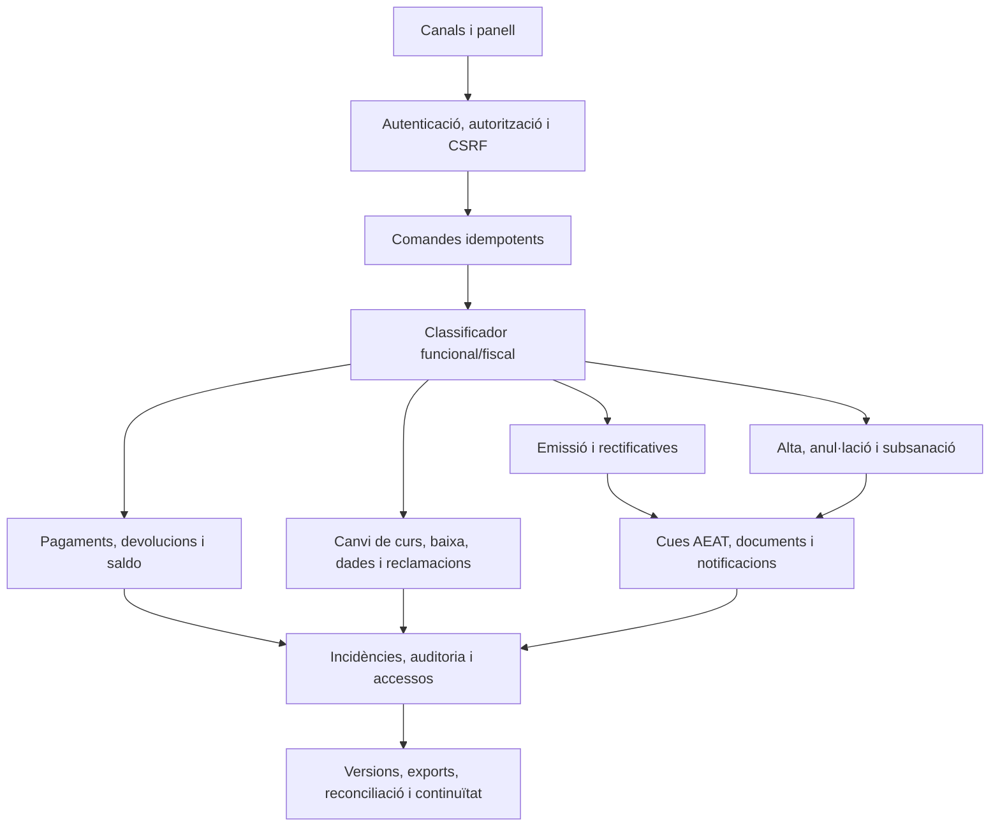

# 38 - Matriu de transformació funcional i registral VERI*FACTU

Data de tall: 2026-09-15

## 1. Conclusió

L'adaptació de PrisMa no consisteix només a moure el cobrament a `pay.prisma.cat`. El canvi complet té quatre capes inseparables:

1. els canals continuen gestionant alumnes, cursos, entitats, reclamacions i vendes;
2. qualsevol acció amb efecte econòmic o fiscal passa per un decisor controlat;
3. el SIF conserva registres immutables, estats, relacions, evidències i intents;
4. la intranet, la web i els portals deixen de modificar silenciosament dades que ja tenen transcendència fiscal.

La regla de disseny és:

```text
gestió operativa -> event auditable -> moviment econòmic -> acció fiscal -> evidència
```

No tots els events generen moviment econòmic i no tots els moviments generen una factura nova. El decisor ha de conservar igualment el motiu i el resultat.



## 2. Evidència de l'estat actual

### 2.1. Codi dels canals candidats

La revisió de `codi-drive/intranet-nova-canvis-verifactu` i `codi-drive/pay-prisma-cat-canvis-verifactu` mostra:

- cap crida detectada als tres endpoints SIF existents;
- cap referència detectada a `factura_registres`, `fiscal_queue`, `fiscal_sequence`, `factura_documents`, `payment_transaction`, `payment_allocation`, `credit_balance`, `fact_rels` o `errors_verifactu`;
- cap implementació detectada de `RegistroAnulacion`, subsanació, `RechazoPrevio` o `SinRegistroPrevio`;
- cap capa comuna detectada d'auditoria, registre d'accessos, outbox, versions o enllaç segur;
- continuïtat d'updates directes sobre `inscripcions`, `factures`, `PAGAMENT`, `A_PAGAR`, `FACTURA_RELACIONADA` i camps de fraccionament.

Per tant, canviar el domini o la URL de pagament no converteix aquestes carpetes en una adaptació VERI*FACTU completa.

### 2.2. Nucli `sif/`

El nucli actual ja aporta una base real per a:

- emissió idempotent;
- numeració i cadena fiscal interna;
- factura i línies;
- pagaments i assignacions;
- rectificativa manual;
- devolució, saldo i compensació;
- snapshots de curs, pack, grup, regal i USOC;
- migració històrica;
- callbacks Redsys bàsics;
- repositoris inicials de documents i incidències.

Però el codi base revisat encara no aporta un circuit productiu complet de:

- client i worker AEAT;
- anul·lació registral i subsanació;
- generació i custòdia segura de PDF/QR/XML;
- autenticació, autorització, CSRF i auditoria transversals;
- panell SIF;
- events administratius de canvi de curs i baixa;
- historial de dades fiscals d'alumne o entitat;
- outbox i evidència de comunicacions;
- registre d'accés a documents;
- versions, declaració responsable i activació;
- exportacions auditades;
- reconciliació SIF-llegat;
- backups/restauracions amb evidència.

## 3. Principis que canvien tota la gestió

| Principi | Abans o risc actual | Comportament final obligatori |
| --- | --- | --- |
| Font fiscal | `web.factures` i camps d'`inscripcions` barregen factura, cobrament i operativa. | La BD SIF és la font de factura, registre, pagament, document i incidència fiscal. |
| Edició | Es poden actualitzar imports, receptor, data de pagament o factura relacionada. | Després d'emetre, la factura és immutable; qualsevol correcció passa pel decisor fiscal. |
| Identitat | `IDPAG`, `FACTURA_RELACIONADA` o número antic actuen com a identificadors principals. | UUID i claus idempotents SIF són principals; els identificadors antics només correlacionen. |
| Dades fiscals | Es poden rellegir dades vives de l'alumne o entitat. | El receptor i les línies es congelen en un snapshot en l'emissió. |
| Estat | Estat acadèmic, cobrament i factura es confonen. | Es mostren separats: operació, factura, cobrament, document i AEAT. |
| Canvis | Canvi de curs, baixa o ajust poden acabar en updates sense traça. | Primer es registra l'event, després la decisió econòmica i, si cal, l'acció fiscal. |
| Errors | Notes, correus o fitxers poden ser l'única evidència. | Incidència persistent, responsable, estat, intents, accions i resolució. |
| Comunicació | El constructor d'un objecte o el mateix PHP pot enviar correu immediatament. | Outbox després del commit, plantilla/versionat, destinatari, intents i resultat. |
| Documents | El PDF es pot regenerar des de dades vives o servir des d'una ruta. | Document conservat amb hash, estat, storage no públic, permisos i registre d'accés. |
| Governança | Configuració i desplegament poden quedar fora del SIF. | Versió activa, declaració, configuració, secrets, proves i decisió d'activació traçats. |

## 4. Matriu completa de transformació

| Àrea | Gestió actual que s'ha de revisar | Gestió final | Registres o evidències obligatoris | Estat actual |
| --- | --- | --- | --- | --- |
| Dades de facturació | Editar dades d'alumne o entitat i reutilitzar-les. | Validar, normalitzar, confirmar pagador/receptor i congelar snapshot. | Snapshot de receptor; historial de dades mestres; usuari/data/motiu. | `[DISSENY/PARCIAL]` |
| Emissió | Inserció dispersa des de web/intranet/callback. | Únic `issueInvoice()` idempotent al SIF. | Factura, línies, seqüència, alta, hash, cua, relacions i event. | `[BASE]`, canals pendents |
| Factura abans de cobrar | Risc de segona factura quan arriba el pagament. | Factura real pendent; pagament posterior contra el mateix UUID. | Marca d'emissió prèvia, URL correcta, cobrament i assignació. | `[BASE/PARCIAL]` |
| Cobrament | Actualitzar `PAGAMENT`, data, banc o import de factura. | `registerPayment()` sense alterar factura ni cadena. | Transacció, assignació, idempotència, conciliació i auditoria. | `[BASE]`, UI pendent |
| Fraccionament | Resum en `FRACCIO` i `FRACCIONAT`. | Un moviment per fracció i saldo calculat. | Intents, `DS_ORDER`, transaccions, assignacions i estat derivat. | `[BASE/PARCIAL]` |
| Transferència/manual | Actualització manual des de `Passar pagaments`. | Validació servidor, referència bancària i assignació controlada. | Usuari, data, mètode, referència, motiu i clau idempotent. | `[BASE/PARCIAL]` |
| Descomptes/promocions | Canviar `A_PAGAR` o validar un descompte. | Regla validada abans d'emetre i resultat congelat per línia. | Origen, regla, import/percentatge, vigència, validador i motiu. | `[PARCIAL]` |
| Ajust manual/despeses | Import final modificable o despeses incloses sense línia. | Previsualització, motiu obligatori i línia econòmica si té import. | Event d'ajust, valor anterior/nou, motiu, aprovador i línia fiscal. | `[DISSENY]` |
| Canvi de curs | Actualitza inscripció, import i pagament; efectes fiscals manuals. | Event administratiu, comparació abans/després i decisió separada. | Històric, inscripcions origen/destí, diferència, descompte, despeses i acció fiscal. | `[DISSENY/PARCIAL]` |
| Baixa | Marca `INSC CURS = X` i pot barrejar correu/devolució. | Event de baixa; després decisió `RETORN`, `SALDO` o `NO_RETORN`. | Motiu, usuari, data, decisió, relacions i justificació. | `[DISSENY/PARCIAL]` |
| Devolució | Restar pagament o escriure observacions. | Moviment `REFUND`; rectificativa separada quan redueix factura. | Referència real del retorn, assignació, factura, baixa/canvi i rectificativa. | `[BASE/PARCIAL]` |
| Saldo/compensació | Import reservat explicat en notes o correu. | Crèdit persistent i consum atòmic com `COMPENSATION`. | Titular, origen, import original/disponible, ús, factura i estat. | `[BASE/PARCIAL]` |
| Rectificativa | “Anul·lar factura” o editar-la. | Factura sèrie R, motiu i mode, vinculada a l'original. | Nova factura/alta, relació, imports rectificats, pagament/retorn associat. | `[BASE/PARCIAL]` |
| Anul·lació AEAT | Es pot confondre amb baixa o rectificativa. | `RegistroAnulacion` només per registre improcedent. | Registre immutable, hash, encadenament, cua, intents i resposta. | `[DISSENY/BLOQUEJANT]` |
| Subsanació | No existeix circuit complet. | Nou registre corrector amb mateix identificador quan correspongui. | Registre anterior/nou, indicadors, `RechazoPrevio`, intents i resposta. | `[DISSENY/BLOQUEJANT]` |
| Reclamació/morositat | Estat i correus sobre `inscripcions`. | Seguiment operatiu; si es cobra, pagament contra factura vigent. | Fase, dates, import pendent, missatges, actor i resultat. | `[PARCIAL]` |
| Redsys/TPV | Callbacks i fitxers poden actualitzar llegat directament. | Intenció, callback curt, deduplicació, worker i conciliació. | Payload signat normalitzat, intents, cua, resultat i incidència. | `[ASYNC/PARCIAL]` |
| PDF/QR/XML | Generació en consulta o fitxer servit directament. | Worker, hash, storage privat i accés autoritzat. | Job, document, versió, hash, estat, intents, descàrrega i incidència. | `[PARCIAL/DISSENY]` |
| Correus/notificacions | HTML dispers i enviament immediat. | Outbox posterior al commit, retries i contingut coherent amb l'estat real. | Plantilla/versió, destinataris, document/enllaç, intents i resultat. | `[DISSENY]` |
| Incidències | Notes o avís sense workflow comú. | Registre oficial al SIF amb assignació i resolució. | Tipus, prioritat, estat, objecte, responsable, accions i resolució. | `[PARCIAL/DISSENY]` |
| Visibilitat | Relació llegada pot exposar factura de grup/empresa. | Autorització per receptor i relació de visibilitat. | Decisió d'accés, actor, factura, document, data i resultat. | `[DISSENY]` |
| Migració històrica | Factures antigues a `web.factures`. | Importació `NO_VERIFACTU`, sense alta retroactiva. | Control de totals, incidències, relacions i hash de document antic. | `[BASE/PARCIAL]` |
| Reconciliació | Resums llegats poden divergir del SIF. | Procés de comparació i correcció controlada. | Execució, criteris, diferències, decisió, actor i resultat. | `[DISSENY]` |
| Exportació/auditoria | Descàrrega sense expedient complet. | Export persistent, mínim necessari i controlat per rol. | Criteris, fitxer, hash, sol·licitant, motiu i accessos. | `[DISSENY]` |
| Versió/declaració | Documents fora del runtime. | Versió activa vinculada a configuració, proves i declaració. | Versió, canvis, estat, declaració, signatura, activació i substitució. | `[DISSENY]` |
| Configuració/secrets | Risc de literals i configuració dins webroot. | Secrets externs, metadades visibles i canvi auditat. | Actor, camp no secret, valor anterior/nou protegit, entorn i prova. | `[DISSENY/BLOQUEJANT]` |
| Backup/continuïtat | Procediment documental. | Backup xifrat, restauració provada i reconciliació posterior. | Execució, abast, hash, custòdia, restauració, RPO/RTO i evidència. | `[DISSENY]` |

## 5. Classificador obligatori abans de qualsevol canvi crític

La UI no ha de decidir directament “fer update” o “anul·lar”. Ha d'enviar una proposta i el servidor ha de classificar-la.



Entrades mínimes del classificador:

- actor, rol i canal;
- objecte d'origen i versió de dades llegida;
- factura i registre relacionats;
- estat de factura, cobrament, document i AEAT;
- valors anterior i proposat;
- motiu estructurat i observació;
- existència de moviment econòmic real;
- clau idempotent;
- previsualització dels registres que es crearan;
- permís servidor per a cada acció resultant.

## 6. Registres funcionals i tècnics que falten o s'han d'ampliar

Els noms finals de taula es poden ajustar, però aquestes responsabilitats no poden desaparèixer.

| Registre | Finalitat | Camps mínims |
| --- | --- | --- |
| `operational_event` | Traçar una decisió administrativa amb o sense efecte fiscal. | tipus, origen, actor, data, motiu, abans/després, estat, correlació. |
| `billing_profile_history` | Conservar canvis de dades mestres sense reescriure snapshots emesos. | subjecte, dades normalitzades, vigència, actor, motiu. |
| `course_change_event` | Enllaçar inscripció antiga/nova i resultat econòmic/fiscal. | imports, descomptes, despeses, diferència, decisió i factures. |
| `enrollment_cancellation_event` | Separar baixa de retorn/saldo/no retorn. | motiu, data, actor, decisió, imports i referències. |
| ampliació `factura_registres` | Suportar alta, anul·lació i subsanació. | tipus, indicadors AEAT, registre anterior, hash, XML i estat. |
| `aeat_submission_attempt` | Conservar cada intent i resposta, no només l'últim error. | registre, request hash, timestamps, resultat, CSV, error i retry. |
| `document_job` | Generar o reintentar PDF/QR/XML sense alterar factura. | factura, tipus, estat, intents, versió generador i error. |
| `notification_outbox` | Desacoblar el commit de l'enviament. | event, plantilla/versió, destinatari, payload, estat i idempotència. |
| `notification_delivery_attempt` | Provar entrega o error de correu/notificació. | outbox, canal, intent, timestamp, resposta i error. |
| `sif_incident_action` | Historial immutable de cada incidència. | incidència, actor, acció, estat anterior/nou, nota i data. |
| `sif_audit_event` | Auditoria comuna de comandes i canvis sensibles. | actor/procés, acció, objecte, resultat, correlació, IP/context. |
| `fiscal_document_access` | Traçar consulta, descàrrega o denegació. | actor/token, document, acció, resultat, data i context. |
| `sif_version` | Controlar versió activa i historial. | codi, estat, artefacte, configuració, dates i responsables. |
| `sif_declaration` | Vincular declaració responsable a una versió. | versió, document/hash, estat, signant i data. |
| `fiscal_export` | Conservar export i criteris d'auditoria. | sol·licitant, rang, filtres, motiu, fitxer, hash i estat. |
| `reconciliation_run/item` | Detectar divergències SIF-llegat. | execució, objecte, valor SIF/llegat, severitat, decisió i resolució. |
| `backup_restore_evidence` | Demostrar continuïtat i restauració. | abast, hash, ubicació protegida, dates, resultat i incidències. |

## 7. Punts actuals de codi que no es poden conservar com estan

| Punt actual | Risc | Transformació requerida |
| --- | --- | --- |
| `guardarDadesPagament_modalsresultatCerca()` | Modifica camps econòmics i fiscals de la inscripció. | Vista d'estat + comandes específiques de pagament, ajust, reclamació o correcció. |
| `realitzarCanviCurs_modalCanviCurs()` | Pot canviar inscripció/import/pagament sense decisió fiscal comuna. | `CourseChangeService` amb event, preview, concurrència i resultats vinculats. |
| `confirmaBaixa_modalDonarBaixa()` | La baixa pot barrejar estat acadèmic, correu i economia. | Event de baixa; decisió econòmica posterior i separada. |
| `efectuarPagament*()` | Calcula factura i actualitza `PAGAMENT`, data, fracció o factura llegada. | Adaptador a `issueInvoice()` o `registerPayment()`; sync mínima posterior. |
| `guardarDadesFactura_Factures()` | Edició directa de factura emesa. | Bloqueig servidor i inici de rectificativa/subsanació segons classificació. |
| `anularFactura()` | Un sol verb cobreix casos fiscalment diferents. | Decisor: cancel·lació operativa, rectificativa, anul·lació AEAT o subsanació. |
| `generaFactura()` en consulta | Pot regenerar document des de dades vives. | Descàrrega del document SIF immutable o estat pendent/error. |
| plantilles i correus directes | Es pot comunicar un estat no confirmat i sense retry. | Outbox posterior al commit i evidència d'entrega. |
| `obtenirUrlPagament()` de l'alumne | URL derivada de dades llegades. | Intenció/token servidor, caducitat, tipus, estat i revocació al SIF. |

## 8. Canvis de pantalla per canal

### 8.1. Intranet principal

Cada acció sensible ha de mostrar:

- estat operatiu, factura, cobrament, document i AEAT per separat;
- dades actuals i proposta;
- conseqüència prevista abans de confirmar;
- motiu obligatori quan hi ha ajust, baixa, canvi o correcció;
- registres que es crearan;
- actor i permís requerit;
- resultat, UUIDs i incidència si alguna fase queda pendent.

La intranet no ha de permetre un update alternatiu quan el SIF rebutja l'acció.

### 8.2. Web i `pay.prisma.cat`

- confirmar dades fiscals abans d'ordenar el pagament;
- crear intenció immutable abans de Redsys;
- resoldre URLs actives, caducades, substituïdes, pagades o inactives;
- no emetre des de la pàgina de retorn del navegador;
- mostrar factura/document només quan el SIF ho confirma;
- derivar errors i incoherències a incidència, no a una segona emissió.

### 8.3. Intranet de l'alumne i accessos externs

- consultar pendent derivat del SIF;
- demanar enllaç/intenció segura al servidor;
- veure només factures permeses;
- distingir “cobert per empresa” de “factura visible”;
- servir PDF/QR per endpoint autoritzat i registrar accés;
- mostrar document pendent o error sense regenerar-lo.

### 8.4. Panell `pay.prisma.cat/sif`

El panell ha de gestionar, no només visualitzar:

- factures, línies, relacions i snapshots;
- pagaments, assignacions, conciliació i excessos;
- alta, anul·lació, subsanació, cua, intents i respostes AEAT;
- documents i jobs;
- incidències i historial d'accions;
- outbox i entregues;
- versions, declaració, configuració i processos;
- exports, accessos auditors, reconciliació, backups i restauracions.

### 8.5. Col·laboradors i intranet antiga

Les factures/rebuts de tutors i honoraris són un circuit adjacent de proveïdors. No entren automàticament al SIF de factures de venda. S'han d'inventariar i protegir, però només s'integraran si es pren una decisió fiscal i comptable específica.

## 9. Arquitectura funcional que falta programar



Les classes de disseny corresponents es detallen al document 31 i les seqüències al document 32. No s'han de considerar implementades només perquè constin als diagrames.

## 10. Casos d'ús addicionals necessaris

El document 33 incorpora UC-69 a UC-86 per cobrir la transformació funcional i registral que no quedava explícita:

- confirmar i versionar dades fiscals;
- editar dades mestres sense alterar factures;
- registrar canvi de curs i baixa;
- documentar ajusts, despeses i descomptes;
- classificar la correcció fiscal;
- anul·lar o subsanar registres;
- operar enviaments AEAT i dead-letter;
- generar/custodiar documents;
- operar outbox i accessos segurs;
- gestionar incidències;
- reconciliar llegat;
- activar versions/declaracions;
- exportar evidència;
- provar backup i restauració;
- registrar qualsevol acció sobre un pagament des de qualsevol entorn.

## 11. Ordre d'implementació recomanat

### Bloc A - Tallar les mutacions perilloses

1. reconciliar les còpies candidates amb els punts d'entrada actius;
2. afegir autenticació, autorització, CSRF, idempotència i auditoria comunes;
3. bloquejar edició directa de factura emesa i updates econòmics alternatius;
4. integrar adaptadors de web, intranet i intranet alumne amb el SIF.

### Bloc B - Completar el registre fiscal

1. ampliar camps normatius i model de registres;
2. implementar anul·lació i subsanació;
3. implementar client/worker AEAT, intents, resposta i dead-letter;
4. provar cadena, concurrència, reintents i recuperació.

### Bloc C - Completar la gestió funcional

1. dades fiscals i historial de mestres;
2. canvi de curs, baixa, ajusts i reclamacions;
3. documents, enllaços segurs, outbox i visibilitat;
4. incidències i reconciliació.

### Bloc D - Governança i operació

1. panell SIF complet;
2. versions i declaració responsable;
3. exports i accés auditor;
4. backup/restauració, monitoratge i evidències go/no-go.

## 12. Criteri de completitud per cada flux

Cap pantalla, mètode o cas d'ús queda complet fins que existeixi:

1. regla funcional i fiscal aprovada;
2. actor, permís i validació servidor;
3. estat anterior, proposta i previsualització;
4. clau idempotent i control de concurrència;
5. event d'auditoria i registres de negoci/fiscals corresponents;
6. resposta clara sense fallback a updates llegats;
7. tractament d'error, retry i incidència;
8. documents i comunicacions coherents amb el commit real;
9. prova unitària, integració, permisos i preproducció;
10. captura/evidència i traça a la pantalla de la matriu de 192 elements.

## 13. Fonts i límits

Fonts contrastades:

- `documentacio/01-compliment-aeat/documentacio-sif-aeat.md`;
- inventari, fluxos, pantalles, correus i procediments de `documentacio/03-canvis-pendents`;
- estat final, operació, panell i diagrames de `documentacio/04-estat-final`;
- seguretat, manual, proves i diccionari de `documentacio/05-governanca-operacio`;
- codi actual i candidat de les set carpetes de `codi-drive`;
- esquema, classes, endpoints, scripts i proves de `sif/`.

No s'ha carregat ni recorregut el JSONL complet de `xat-original`. Tampoc s'afirma que les còpies locals coincideixin amb producció fins que se'n congeli la versió i data de tall.

## 14. Ledger universal d'accions sobre pagaments

### 14.1. Regla obligatòria

A partir d'ara, qualsevol acció iniciada des de qualsevol entorn sobre un pagament ha de deixar traça persistent, encara que l'acció:

- només consulti o exporti informació;
- reutilitzi un pagament per idempotència i no produeixi cap canvi;
- sigui rebutjada per validació o permisos;
- falli tècnicament;
- provingui d'un procés automàtic, callback, worker, CLI, migració o reconciliació;
- intenti modificar directament un registre immutable i quedi bloquejada.

La unitat auditada és cada petició, comanda o decisió funcional visible, no cada `SELECT` intern repetit dins la mateixa operació. Totes les transicions de negoci i tots els accessos externs queden inclosos.

```text
cap acció sobre un pagament sense payment_action_event
cap payment_action_event editable o esborrable per l'aplicació
```

### 14.2. Entorns inclosos

- web/ecommerce;
- intranet principal;
- intranet de l'alumne;
- panell `pay.prisma.cat/sif`;
- callback i worker Redsys;
- API SIF;
- scripts CLI i tasques programades;
- importació/migració;
- conciliació TPV o bancària;
- sincronització amb BD llegada;
- eines d'administració autoritzades.

L'accés SQL manual a producció no és un canal funcional vàlid. Si excepcionalment s'autoritza una intervenció tècnica, ha d'executar-se mitjançant una eina controlada que generi la mateixa traça.

### 14.3. Accions mínimes que s'han de tipificar

| Família | Accions |
| --- | --- |
| Alta/idempotència | `CREATE_REQUEST`, `CREATE`, `IDEMPOTENCY_REUSE`, `DUPLICATE_DETECTED` |
| Consulta | `SEARCH`, `VIEW`, `VIEW_ALLOCATIONS`, `EXPORT` |
| Assignació | `ALLOCATE`, `REALLOCATE`, `UNALLOCATE`, `SPLIT_ALLOCATION` |
| Conciliació | `RECONCILE`, `MARK_PENDING_REVIEW`, `RESOLVE_RECONCILIATION` |
| Moviment relacionat | `LINK_REFUND`, `LINK_COMPENSATION`, `LINK_CLAIM_PAYMENT` |
| Estat operatiu | `CANCEL_OPERATION`, `MARK_ERROR`, `RETRY`, `RECOVER_LOCK` |
| Integració | `REDSYS_CALLBACK`, `REDSYS_WORKER_RESULT`, `SYNC_LEGACY`, `IMPORT` |
| Seguretat | `ACCESS_DENIED`, `VALIDATION_REJECTED`, `IMMUTABILITY_BLOCKED` |

`REALLOCATE` i `UNALLOCATE` no editen una assignació anterior: creen una correcció append-only o una nova versió/contramoviment segons el model definitiu.

### 14.4. Resultat de l'acció

Cada event ha d'indicar un resultat controlat:

- `REQUESTED`;
- `SUCCEEDED`;
- `REUSED`;
- `NO_CHANGE`;
- `REJECTED`;
- `FAILED`;
- `QUEUED`;
- `PARTIAL`.

No es pot deduir el resultat només d'un text lliure.

### 14.5. Camps mínims de `payment_action_event`

| Camp | Criteri |
| --- | --- |
| `UUID_EVENT` | Identificador immutable de l'event. |
| `UUID_PAYMENT` | Pot ser nul només abans que el pagament existeixi o quan l'intent sigui rebutjat. |
| `PAYMENT_IDEMPOTENCY_KEY` | Permet correlacionar intents previs a la creació. |
| `CORRELATION_ID` | Uneix canal, callback, worker, servei i resposta. |
| `CAUSATION_ID` | Event o comanda que ha provocat aquesta acció. |
| `ACTION` | Valor tipificat del diccionari. |
| `RESULT` | Resultat tipificat. |
| `SOURCE_ENVIRONMENT` | Producció, preproducció, test o migració. |
| `SOURCE_CHANNEL` | Intranet, web, alumne, SIF, Redsys, CLI, procés o reconciliació. |
| `ACTOR_TYPE`, `ACTOR_ID`, `ACTOR_ROLE` | Persona, sistema o procés identificat. |
| `REQUEST_ID` | Identificador tècnic de la petició o execució. |
| `REASON_CODE` | Obligatori per reassignacions, cancel·lacions, ajusts i accions excepcionals. |
| `BEFORE_HASH`, `AFTER_HASH` | Resum de l'estat abans/després quan correspongui. |
| `CHANGESET_JSON` | Diferències mínimes, normalitzades i sense secrets. |
| `ERROR_CODE` | Codi controlat si es rebutja o falla. |
| `OCCURRED_AT`, `RECORDED_AT` | Hora de l'acció i hora de persistència, amb zona horària definida. |

No s'hi han de copiar PAN, CVV, claus, signatures completes, credencials, tokens reutilitzables ni payloads Redsys sense redacció.

### 14.6. Garantia transaccional

Per a una mutació crítica:

1. el gateway crea `CORRELATION_ID` i intenta registrar `CREATE_REQUEST` o l'acció equivalent;
2. si no pot registrar l'intent, l'acció queda bloquejada;
3. la mutació de domini i l'event terminal `SUCCEEDED`, `REUSED` o `NO_CHANGE` es confirmen atòmicament;
4. si la validació, el permís o l'execució fallen, es conserva `REJECTED` o `FAILED` amb el mateix `CORRELATION_ID`;
5. si falta l'event terminal esperat, el monitor obre una incidència de traça incompleta.

Per a una consulta o exportació, l'accés només retorna dades després que la traça s'hagi pogut persistir. El sistema adopta comportament `fail closed`: sense auditoria disponible, no es fa l'acció.

### 14.7. Immutabilitat i permisos

- `payment_transaction`, `payment_allocation` i `payment_action_event` no tenen edició lliure;
- l'aplicació només pot inserir events, no actualitzar-los ni esborrar-los;
- una correcció genera nous events i moviments compensatoris;
- l'actor no pot declarar el seu propi rol: el gateway el resol de la sessió o identitat tècnica;
- els processos automàtics tenen identitat i versió desplegada;
- el panell mostra la cronologia completa per `UUID_PAYMENT` i `CORRELATION_ID`;
- les exportacions del ledger també generen un event `EXPORT`.

### 14.8. Criteri de completitud

El control de pagaments no queda complet fins que una prova demostri, per cada entorn:

- alta correcta;
- reutilització idempotent;
- consulta;
- assignació i repartiment;
- intent sense permís;
- payload invàlid;
- callback duplicat;
- conciliació;
- devolució o compensació relacionada;
- error tècnic i retry;
- exportació;
- intent de modificació directa bloquejat.

Cada prova ha de poder reconstruir cronològicament què es va intentar, qui o quin procés ho va fer, des d'on, amb quin resultat i quins registres en van derivar.

## 15. Materialització en base de dades i codi base

La migració `2026_09_15_000003_add_functional_audit_control.sql` incorpora les
responsabilitats de l'apartat 6 sense presentar-les com a integrades:

- ledger universal `payment_action_event`;
- auditoria comuna i event operatiu;
- historial de dades fiscals, canvi de curs i baixa;
- control d'anul·lació/subsanació i intents AEAT;
- jobs documentals, accessos, outbox i intents de notificació;
- historial d'incidències;
- versió, declaració, exportacions i accessos;
- conciliació i evidència de backup/restauració;
- context auditable de `fact_rels`.

També existeixen dos repositoris append-only:

- `PaymentActionEventRepository`, amb validació de resultats i distinció
  obligatòria entre `REQUESTED` no terminal i resultats terminals;
- `OperationalEventRepository`, amb snapshots abans/després i hashes SHA-256.

Aquest checkpoint no compleix encara la regla universal: `PaymentService`, les
consultes, callbacks, workers i adaptadors llegats no passen tots pel gateway.
Per tant, UC-86 continua bloquejant producció.

## 16. Casuística funcional recuperada

La primera reconciliació de les 145 `Fitxes mare` del tauler 2 va elevar a cas
explícit dinou responsabilitats, UC-87 a UC-105. La revisió posterior ha
corregit l'abast: existeixen 185 targetes `Fitxes mare` entre els taulers 2, 3
i 6, i el mapatge dels títols no substitueix la lectura del contingut.

El contrast amb el codi actual ha afegit set responsabilitats que no estaven
representades de manera suficient: UC-106 a UC-112. Es detallen al document 33,
a les fitxes de `documentacio/06-fitxes-funcionals/` i a l'auditoria 40.

La regla de cobertura és:

1. una vista o botó no crea automàticament un cas nou;
2. una decisió de negoci amb precondicions, resultat o registre propi sí;
3. els duplicats del Trello es mapen al mateix cas canònic;
4. les normes de catàleg/diccionari es marquen com a metadades, no com a UC;
5. cap element pot quedar sense mapping o sense justificació;
6. cap mapping per títol es pot usar com a prova de cobertura del contingut;
7. un flux observat al codi pot crear un cas nou encara que no tingui targeta.

El resultat auditable és `39-auditoria-fitxes-funcionals.md`: 185 targetes
inventariades/classificades i 142 fitxes canòniques, sense declarar-les
completes. Els documents 40 i 41 conserven els buits i la correspondència amb
les superfícies executables.

## 17. Operació comercial prèvia al SIF fiscal

La gestió real requereix una capa que abans quedava implícita:

```text
inscripció/reserva
    -> classificació facturable, gratuïta, subvencionada o pendent
    -> snapshot de parts, preu, descompte, places i fiscalitat
    -> enllaç/intenció de pagament, si cal
    -> pagament i factura segons la regla aprovada
```

| Responsabilitat | Casos | Persistència objectiu |
| --- | --- | --- |
| Reserva i duplicat | UC-106, UC-107 | `commercial_operation`, event operatiu |
| Operació gratuïta | UC-108 | classificació `NON_BILLABLE/FREE_SAMPLE`, sense factura/pagament |
| Operació subvencionada | UC-109 | classificació i evidència del finançador pendents de decisió |
| Parts múltiples/un pagador | UC-110 | `commercial_operation_party`, línies i assignacions explícites |
| Validació i dret futur | UC-111 | `discount_validation`, referència idempotent al benefici |
| Snapshot abans del TPV | UC-112 | snapshots de preu, capacitat i fiscalitat; `payment_link`/intenció |

La migració `2026_09_16_000004_add_commercial_operation_and_fiscal_fields.sql`
materialitza aquesta separació i completa camps fiscals documentats. No està
aplicada ni integrada; el codi candidat continua `NO-GO`.

## 18. Ampliació per cicles comercials i acadèmics detectats al codi

La matriu executable del document 41 amplia la transformació amb dotze casos i
les responsabilitats següents:

| Àrea | Llegat observat | Transformació obligatòria | Casos |
| --- | --- | --- | --- |
| Importació d'inscripcions | Alta/CSV Moodle i estat acadèmic | Run/item idempotent, error per fila i cap cobrament inferit | UC-113, UC-124 |
| Producte/edició | `UPDATE` de curs/aula | Versió, previsualització d'afectats i decisió per reserva oberta | UC-114 |
| Capacitat | recomptes i flags d'obertura | reserva atòmica, expiració, alliberament i llista d'espera | UC-115 |
| Evidències | fitxer/correu i camps de validació | custòdia protegida, hash, accés i retenció | UC-116 |
| Promocions/drets | codi creat o marcat | ledger d'emissió, reserva, consum, expiració i reversió | UC-117 |
| Grups | participants/tram/`IDPAG` compartit | composició mutable, línies/places i lock pre-TPV | UC-118 |
| Regals | `regal`, `FACT_REL`, nou `IDPAG` | compra, dret, beneficiari i bescanvi separats | UC-119 |
| Dades personals | petició per correu | expedient, aprovació, propagació i exclusió d'històrics | UC-120 |
| Reserva caducada | regeneració d'URL | nova versió de preu/plaça, acceptació i enllaç nou | UC-121 |
| Packs | concepte agregat | línies/components, fiscalitat i decisió de baixa parcial | UC-122 |
| Factura electrònica | flag `E_FACT` | document, format, hash, entrega, error i retry | UC-123 |
| Acadèmic vs econòmic | certificat/Moodle condicionats pel deute | events correlacionats sense mutar pagaments | UC-124 |

Regla de migració: cap writer llegat es considera retirat perquè existeixi una
taula nova. Cal adaptador únic, prova de no doble escriptura i evidència que la
ruta antiga queda bloquejada o redirigida.

## 19. Transformació dels controls transversals descoberts

| Àrea | Llegat observat | Transformació obligatòria | Casos |
| --- | --- | --- | --- |
| Consentiment | `INSC_MAILING`, `mailing` i `subscriptors` amb alta/confirmació disperses | consentiment per finalitat/canal/text versionat, events i retirada propagada | UC-108, UC-125 |
| Identitat | DNI, correu i usuari Moodle comparats puntualment | subjecte canònic, enllaços externs, conflicte i decisió sense fusionar històrics | UC-107, UC-120, UC-126 |
| Estat d'edició | `PENDENT/ACTIU/ANUL·LAT`, baixes i correus dins un únic mètode | event d'edició, inventari d'afectats i decisió econòmica/fiscal per operació | UC-27, UC-74, UC-114, UC-127 |
| CP/població | inserció a `poblacions_validar` sense cicle acreditat | original/proposta/regla/decisió/propagació i exclusió de snapshots emesos | UC-69, UC-120, UC-128 |
| Prisma/Moodle | comparació de recomptes, usuaris, correus, cursos i rols | run/item de reconciliació, autoritat per camp, correcció idempotent i evidència | UC-124, UC-129 |

Cap d'aquests fluxos pot escriure `PAGAMENT`, `IDPAG`, factura o registre fiscal
com a efecte lateral. Si l'edició cancel·lada o una correcció de dades exigeix
un efecte econòmic/fiscal, es deriva a l'ordre canònica corresponent amb la
mateixa correlació i sense perdre el moviment o document original.
