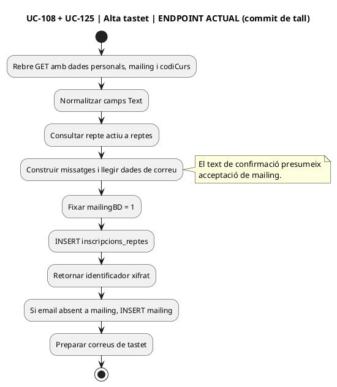
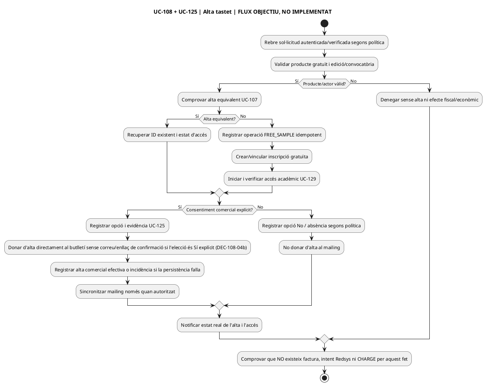

# Auditoria funcional pendent — lot 01 · alta i checkout web (22/09/2026)

**Tall del codi:** `main` a `e71958b3026549bde09fb4b25f2ec3ba370937ec`. **Estat:** primera revisió de 9 UC: 106, 107, 108, 109, 110, 112, 115, 122 i 125. **No és** una validació dels altres UC, de les 192 pantalles, dels desplegaments ni una execució de proves. Els enllaços de codi apunten a la versió de tall. La revisió contrasta l'endpoint existent **com a codi versionat**, no acredita que el mateix fitxer sigui el desplegat.

[Registre mestre RM-001–037](../00-index-i-pla/42-registre-mestre-cobertura-funcional-implementacio-documentacio.md) · [matriu d'accions precedent](../04-estat-final/41-matriu-superficie-executable-casos.md) · [matriu de pantalles](../03-canvis-pendents/12-matriu-pantalles-abans-despres.md).

## 1. Resultat per cas d'ús: codi actual → fitxa → canvi → prova

| UC | Què existeix en aquest tall | Troballa documental / funcional | Implementació pendent / prova |
| --- | --- | --- | --- |
| [106](uc-106-crear-reserva-abans-pagament.md) · reserva abans de pagar | [Alta curs](../../codi-drive/web-actual/ajax/enviarInscripcio.php) i [alta pack](../../codi-drive/web-actual/ajax/enviarInscripcioPack.php) escriuen inscripcions llegades i deriven `IDPAG` llegint l'últim valor; [RedsysPaymentIntentService](../../sif/src/Service/RedsysPaymentIntentService.php) crea intenció `PENDING`. | La fitxa distingeix correctament intenció Redsys de reserva de plaça. Falta traçar cada variant: alta confirmada/provisional, reintent, edició, compte empresa, pack N i situació del correu prepagament. No equiparar alta a la BD llegada amb `capacity_reservation` efectiva. | Servei de comercial/reserva, idempotència entre canals, vincle ID_INSC/operació/plaça i política de caducitat. **P-106-01:** dues sol·licituds simultànies, una sola reserva/IDPAG segons política; cap factura/cobrament per la reserva. |
| [107](uc-107-detectar-inscripcio-duplicada.md) · alta duplicada | [enviarInscripcio.php, 164–189](../../codi-drive/web-actual/ajax/enviarInscripcio.php#L164-L189) consulta si la persona **ja ha realitzat** el curs per CURS/DNI/GENERAT=1 i construeix un text informatiu; no es desprèn d'aquesta consulta el bloqueig d'alta simultània en la mateixa edició. [Pack](../../codi-drive/web-actual/ajax/enviarInscripcioPack.php#L175-L185) consulta historial per reconèixer antic alumne, no una clau única de nova reserva. | Cal separar «ja havia fet el curs» i «ja té aquesta inscripció/checkout actiu». La fitxa estableix objectiu, però no fa una matriu contrastada de cada handler ni la política de baixa/nova alta. | Unicitat de negoci persona+producte+edició+estat, reús idempotent i bloqueig concurrent sobre llegat/operació. **P-107-01:** doble clic i dos DS_ORDER de mateixa compra → cap alta/càrrec duplicats; distingir dues edicions legítimes i email compartit. |
| [108](uc-108-tastet-repte-gratuit.md) · tastet gratuït | [handler real, 15–51](../../codi-drive/web-actual/ajax/enviarInscripcioTastet.php#L15-L51): rep `nom,cog,dni,email,poblacio,conegut,comentaris,mailing,codiCurs`; consulta `reptes` actiu. [90–117](../../codi-drive/web-actual/ajax/enviarInscripcioTastet.php#L90-L117): diu «gratuït», avisa d'alta en 24/48 h laborals i una setmana d'accés després de l'alta. [222–234](../../codi-drive/web-actual/ajax/enviarInscripcioTastet.php#L222-L234): insereix `inscripcions_reptes`, sense factura/CHARGE en aquesta ruta. | **Correcció necessària:** la fitxa deia que `web-actual` no era accessible; ara sí. El camp `mailing` es llegeix però el handler fixa [`$mailingBD = '1'`](../../codi-drive/web-actual/ajax/enviarInscripcioTastet.php#L210-L214), insereix l'email a `mailing` si no existia [255–269](../../codi-drive/web-actual/ajax/enviarInscripcioTastet.php#L255-L269) i mostra en el correu un text que pressuposa acceptació [75–79](../../codi-drive/web-actual/ajax/enviarInscripcioTastet.php#L75-L79). **Això contradiu el resultat objectiu UC-108/125.** No hi ha comprovació prèvia visible de duplicat per DNI+repte abans d'INSERT en aquest handler. | Separar consentiment; no mostrar acceptació no produïda; antidualta idempotent i seguiment de l'accés real Moodle; operació FREE_SAMPLE si s'adopta el model comercial. **P-108-01:** `mailing=No` → alta gratuïta sense insert a mailing ni text fals; **P-108-02:** doble alta per mateix repte → reús/estat explicitat; cap factura/cobrament. |
| [109](uc-109-inscripcio-curs-subvencionat.md) · subvenció | [enviarInscripcio.php, 586–610](../../codi-drive/web-actual/ajax/enviarInscripcio.php#L586-L610): `tipusCurs == 'S'` força `$preuDescompte = 0` en la inscripció llegada; continua amb `IDPAG`/comunicacions del flux d'alta. | El codi **no identifica per aquesta branca** el finançador, conveni, import finançat, receptor fiscal o ingrés de l'entitat. La fitxa l'explica com a decisió pendent, no com a `FREE_SAMPLE`; cal revisar els programes reals en dades i pantalla abans de fixar variants. | Contracte per programa: quota individual, finançament, copagament i receptor/s, estat `SUBSIDISED_PENDING_DECISION`; prohibir factura/càrrec de zero com a substitut. **P-109-01:** quota alumne 0 i finançador pendent → dues magnituds diferenciades, cap ingrés fictici. |
| [110](uc-110-descompte-amics-dues-inscripcions.md) · amics | [DescompteAmic::__insertBD](../../codi-drive/web-actual/DescompteAmic.php#L92-L138) fixa **`TIPUS_INSC='G'`**, `INSC_MAILING='0'`, calcula preu individual via `__getPriceOffer()`; [preu](../../codi-drive/web-actual/DescompteAmic.php#L423-L462) usa paràmetre `descompteAmics`; [enviament dels dos participants](../../codi-drive/web-actual/DescompteAmic.php#L1360-L1394) comparteix un `IDPAG`. [`respGrups`](../../codi-drive/web-actual/DescompteAmic.php#L149-L163) rep el responsable. | **Correcció de la fitxa:** no deixar «tipologia G no acreditada»; el codi actual sí que l'estableix. Però `G` i `respGrups` **no acrediten** que es pugui facturar amb les regles fiscals d'un grup ordinari o amb receptor únic sense verificar el destí i els imports de les dues persones. | Decidir receptor/s; preservar 2 cursos/edicions/imports, 1 fet bancari si es cobra conjuntament; prova del builder real amb `G` i comparació del contracte de grup. **P-110-01:** dos amics en cursos diferents, mateix IDPAG → 2 inscripcions, 2 imports, receptor/s classificats, cap doble CHARGE. |
| [112](uc-112-congelar-snapshot-abans-tpv.md) · snapshot | [RedsysPaymentIntentService::create](../../sif/src/Service/RedsysPaymentIntentService.php#L15-L72) exigeix `snapshot` JSON no buit i conserva import/DS_ORDER/origen; compara intents amb el mateix DS_ORDER; [alta web de curs](../../codi-drive/web-actual/ajax/enviarInscripcio.php#L15-L82) rep preus/descomptes i [pack](../../codi-drive/web-actual/ajax/enviarInscripcioPack.php#L64-L67) preus via GET. | La fitxa ja diferencia intenció persistent de snapshot comercial complet. Falta traçar els camps reals de cada modal/pantalla i la recomputació independent al servidor: el fet de rebre preu de formulari no n'acredita l'origen autoritzat, i JSON no buit no implica esquema fiscal/comercial vàlid. | Constructor/validador per tipus de producte, snapshot acceptat i versionat abans d'intent; comparar amb ID_INSC i reserva. **P-112-01:** modificar preu/receptor al client o després de DS_ORDER → preu servidor i conflicte/noves oferta i ordre segons estat; cap callback recalculant el preu mutable. |
| [115](uc-115-reservar-alliberar-places.md) · capacitat | [SQL 000005](../../sif/database/migrations/2026_09_16_000005_add_operation_lifecycle_tables.sql) defineix `capacity_reservation`/`LOCK_VERSION`; les altes llegades consulten edicions però no s'ha acreditat al conjunt de crides revisat una operació SIF transaccional que reservi una plaça. | La fitxa separa correctament reserva acadèmica i intenció Redsys. Queda pendent comparar els límits efectius de places d'aula/edició del llegat, les excepcions, llista d'espera i el comportament actual del callback amb plaça vençuda. | Servei de capacitat amb lock d'aforament, venciment/reobertura, workers i conciliació acadèmica; comprovar les rutes reals de plaça (no inferir absència global d'un fragment). **P-115-01:** 1 plaça + 2 peticions concurrents → una sola reserva confirmable; callback confirmat després de caducar → incidència, no plaça fictícia. |
| [122](uc-122-composicio-pack-component-indisponible.md) · component pack | [enviarInscripcioPack.php, 486–542](../../codi-drive/web-actual/ajax/enviarInscripcioPack.php#L486-L542) escriu una inscripció per edició amb **IDPAG comú**, `TIPUS_INSC='P'`, `OBSERVACIONS='PACK|idPack'`, i distribueix `$preuPack` seqüencialment entre components segons preu original. | El model objectiu demana línies i import per component, però la distribució actual del net s'obté per **ordre de la llista**, no equival automàticament al descompte fiscal/econòmic de cada component ni a una política de substitució. La fitxa ja alerta del 25 % suposat al builder SIF i d'`A_PAGAR` mutable; afegir aquest contrast concret d'alta. | Congelar ordinal, base/discount/net per component i lligam UUID_LINE–ID_INSC–factura_linia; decidir components substituïbles i canvis postfactura. **P-122-01:** pack N amb preus dispars: suma dels imports individuals = net acordat i l'atribució no es reconstrueix per ordre després del cobrament; component indisponible → nova acceptació abans de TPV. |
| [125](uc-125-consentiment-comunicacions-separat.md) · consentiment | [mailing.php, 9–24](../../codi-drive/web-actual/ajax/mailing.php#L9-L24) consulta email i mostra Sí/No si no hi consta; [mailingNou.php, 20–57](../../codi-drive/web-actual/ajax/mailingNou.php#L20-L57) desa sol·licitud a `subscriptors` i envia correu amb link de confirmació; [inscripcio_mailing.php](../../codi-drive/web-actual/ajax/inscripcio_mailing.php) consulta email; [SQL 000006](../../sif/database/migrations/2026_09_16_000006_add_cross_system_control_tables.sql#L5-L53) **JA defineix** `communication_consent` i `communication_consent_event`. | **Dues correccions documentals:** la fitxa diu que no s'ha identificat taula específica, però existeix a 000006; diu que els scripts no hi són a la branca, però sí a main. A més, [UC-108] força mailing a Sí independentment de l'opció. Els scripts llegats només mostren la seqüència de sol·licitud, no acrediten per si sols confirmació/retirada/auditoria de text i finalitat ni la implantació del nou SQL. | Implementar servei/repo/connector i verificació de consentiment abans de cada transport comercial; respectar alta gratuïta sense mailing. Revisar les rutes llegades de SQL construït amb email abans de modificar-les. **P-125-01:** opció No al tastet; **P-125-02:** petició sense confirmar no subscripció vigent; retirada + campanya pendent no s'envia. |

**Prioritat de sortida del lot:** P0 UC-108/125 (decisió comercial assumida erròniament en el handler); P0 UC-106/107/112/115 (doble alta/plaça/snapshot/checkout); P0 UC-110/122 quan el flux s'habiliti per cobrament i emissió; P1 UC-109 fins que les regles del programa concret es decideixin, bloquejant l'emissió automàtica del flux afectat. Les prioritats són de treball i no acrediten explotabilitat ni que el fitxer estigui desplegat.

## 2. Traça actual concreta — alta al tastet UC-108/125

| Pas | Font PHP | Efecte acreditat al codi versionat | Diferència objectiu |
| --- | --- | --- | --- |
| 1 | [enviarInscripcioTastet.php L15–26](../../codi-drive/web-actual/ajax/enviarInscripcioTastet.php#L15-L26) | Llegeix dades personals, `mailing` i `codiCurs` via GET. | Definir contracte de petició/actor, separar identitat i decisió de comunicacions. |
| 2 | [L43–51](../../codi-drive/web-actual/ajax/enviarInscripcioTastet.php#L43-L51) | Consulta `reptes.CODI_CURS` i `ESTAT=1`; no es veu una comprovació explícita del resultat abans de construir `Text($titol)`. | Rebutjar codi invàlid amb resultat explícit i cap alta. |
| 3 | [L70–116](../../codi-drive/web-actual/ajax/enviarInscripcioTastet.php#L70-L116) | Comunica alta en 24/48 hores laborals, una setmana d'accés des de l'alta i missatge que pressuposa consentiment al mailing. | Revisar veracitat i vigència del text/termini; no atribuir consentiment si no existeix. |
| 4 | [L204–235](../../codi-drive/web-actual/ajax/enviarInscripcioTastet.php#L204-L235) | Fixa `mailingBD=1` i insereix a `inscripcions_reptes` (sense camp de decisió del mailing en aquest INSERT). | Consentiment independent UC-125, control idempotent de duplicat i estat d'accés real. |
| 5 | [L255–269](../../codi-drive/web-actual/ajax/enviarInscripcioTastet.php#L255-L269) | Consulta `mailing` per correu i insereix el contacte si no existia. | No crear aquesta alta si opció No; guardar evidència per finalitat, canal i subjecte, no inferir per email. |
| 6 | [L290–296](../../codi-drive/web-actual/ajax/enviarInscripcioTastet.php#L290-L296) | Conté actualització de `promocions.USED` sota `$promocioAplicada != ''`; no s'ha identificat assignació prèvia d'aquesta variable en aquest fitxer. | Confirmar si és codi residual; classificar i eliminar/adaptar sense alterar promocions per una alta gratuïta no vinculada. |
| 7 | [L320–344](../../codi-drive/web-actual/ajax/enviarInscripcioTastet.php#L320-L344) | Prepara correus de tastet. L'alta a BD no demostra per si mateixa la matrícula efectiva a Moodle. | Separar confirmació d'alta, notificació i confirmació de l'accés UC-129, amb reintent sense duplicitat. |

**Nota sobre seguretat de codi llegat:** `mailing.php` i `inscripcio_mailing.php` construeixen SELECT interpolant un email rebut de la petició; cal inspeccionar validació/connexió de la versió desplegada i substituir-ho per consultes preparades a l'adaptació. No reproduir exemples d'explotació ni credencials al registre. No afirmar vulnerabilitat explotada ni exposició de producció sense verificació d'entorn.

## 2 bis. UC-108 — decisions acordades després de l'auditoria i PENDENTS D'APLICAR AL PHP

**Data de decisió:** 22/09/2026. **Origen:** definició funcional expressa de Meriem durant la revisió d'UC-108. **Estat tècnic:** **PENDENT D'IMPLEMENTAR EN PHP, JS, persistència i accés acadèmic; NO PROVAT NI DESPLEGAMENT VERIFICAT**. La decisió no canvia retroactivament el comportament ACTUAL descrit als apartats 1 i 2. No s'ha fet una nova revisió de la versió desplegada després del tall de codi indicat a la capçalera.

| Referència | Decisió funcional ACORDADA | Divergència actual, adaptació pendent i criteri de prova |
| --- | --- | --- |
| **AUD-108-PHP-01 · DEC-108-03a** | Si l'accés al tastet **ha caducat**, la persona només pot tornar-s'hi a inscriure **després que secretaria o suport hagi desbloquejat la inscripció web per a aquella persona i aquell tastet**. És **la persona qui torna a emplenar i enviar el formulari**; secretaria/suport **no fa la reinscripció en nom seu**. No reactivar la matrícula/accés automàticament per caducitat ni per un desbloqueig sense nova sol·licitud de la persona. | **PENDENT PHP/JS:** [`buscarSiHaRealitzatElTastet.php`](../../codi-drive/web-actual/ajax/buscarSiHaRealitzatElTastet.php#L20-L45) detecta historial `CURS+DNI+INSC_CURS=1` però no acredita la caducitat de l'accés ni el desbloqueig; [`mostrarInscripcionsTastets.min.js`](../../codi-drive/web-actual/js1619773569/mostrarInscripcionsTastets.min.js#L835-L931) mostra el modal informatiu actual i envia l'alta; [`enviarInscripcioTastet.php`](../../codi-drive/web-actual/ajax/enviarInscripcioTastet.php#L204-L235) insereix la petició sense una verificació de desbloqueig acreditada al fragment analitzat. Cal definir gestió autoritzada del desbloqueig, vincle persona+tastet, comprovació **al servidor abans d'INSERT**, resultat específic a la web i traça de qui autoritza. El navegador sol no és una barrera de seguretat. |
| **AUD-108-PHP-02 · P-108-03** | Tastet amb accés caducat, **sense desbloqueig**: el formulari no pot crear una altra alta; indicar a la persona que ho ha de gestionar amb secretaria/suport. | **PENDENT DE PROVA:** verificar bloqueig tant per UI com per crida directa a l'endpoint, sense nou registre `inscripcions_reptes` ni reactivació a Moodle. |
| **AUD-108-PHP-03 · P-108-04** | Tastet amb accés caducat i **desbloqueig concedit**: la persona torna a fer la seva inscripció web. | **PENDENT DE PROVA:** validar que el servidor associa desbloqueig a la mateixa persona i tastet, accepta una nova petició autoritzada i no crea dobles altes si rep dos clics/reintents. Secretaria/suport no inscriu directament. |
| **AUD-108-PHP-04 · DEC-108-03b ACORDADA** | Si la mateixa persona torna a presentar el formulari del mateix tastet **mentre la primera sol·licitud continua pendent d'alta al campus**, mostrar-li que **ja té una sol·licitud pendent** i **no crear-ne cap altra**. La sol·licitud pendent no requereix el desbloqueig de secretaria/suport previst exclusivament per a accessos caducats. | **PENDENT PHP/JS/BD:** [`buscarSiHaRealitzatElTastet.php`](../../codi-drive/web-actual/ajax/buscarSiHaRealitzatElTastet.php#L20-L45) filtra `INSC_CURS=1`; no detecta per aquesta consulta sol·licituds amb `INSC_CURS=0` (cal verificar que 0 representa realment la petició pendent). Fer la comprovació de la mateixa persona+tastet **al servidor abans d'INSERT a `enviarInscripcioTastet.php`**, amb protecció davant doble clic i concurrència, i tornar un resultat «ja tens una sol·licitud pendent» sense alta nova. El JS ha de mostrar el missatge adequat. |
| **AUD-108-PHP-05 · P-108-05d** | Segon enviament de la mateixa persona i tastet abans que secretaria hagi completat la primera alta al campus. | **PENDENT DE PROVA:** missatge de petició pendent, un únic registre de sol·licitud, cap segon correu d'alta comercial ni nou accés acadèmic, sense consum de cap permís de desbloqueig; provar també crida directa a PHP i dues peticions simultànies. |
| **AUD-108-PHP-06 · DEC-108-03c ACORDADA** | Si la mateixa persona torna a intentar inscriure's al mateix tastet mentre **l'accés és actiu**, la web li mostra que **ja està inscrita** i **no crea una segona sol·licitud**. No exigeix ni consumeix un desbloqueig de secretaria/suport, reservat a accessos caducats. | **PENDENT PHP/JS/BD:** distingir al servidor un accés efectivament actiu de `INSC_CURS=1` sense accés acreditat o ja caducat; adaptar detector web i endpoint `enviarInscripcioTastet.php` per retornar un resultat explícit «ja estàs inscrita» sense INSERT ni alta acadèmica addicional, també davant crida directa i concurrència. Cal establir font fiable d'estat i dates reals d'accés al campus (UC-129). |
| **AUD-108-PHP-07 · P-108-05e** | La mateixa persona, mateix tastet, accés real encara vigent: prova de reinscripció web i crida PHP directa. | **PENDENT DE PROVA:** mostrar «ja estàs inscrita», no afegir sol·licitud, matrícula, correu duplicat ni consumir cap desbloqueig; protegir doble clic/enviaments simultanis. |
| **AUD-108-PHP-08 · DEC-108-03d ACORDADA** | Si la persona **s'ha donat de baixa del tastet** o **secretaria li ha denegat la sol·licitud anterior**, pot presentar una **nova inscripció directament al formulari web**, sense autorització ni desbloqueig de secretaria/suport. Conservar la baixa/denegació anterior com a historial i no reactivar-la automàticament. **No aplicar aquesta regla als accessos caducats**, que requereixen desbloqueig. | **PENDENT PHP/JS/BD:** identificar l'estat real de baixa/denegació de la persona i tastet; adaptar `buscarSiHaRealitzatElTastet.php` i `enviarInscripcioTastet.php` per no bloquejar per simple historial `CURS+DNI+INSC_CURS=1` quan la petició anterior s'ha donat de baixa o denegat, però sí impedir segona petició si la nova està pendent o activa. Validar novament el formulari al servidor abans d'INSERT, preservar historial i crear una nova petició idempotent només quan la persona l'envia. No s'ha acreditat que la BD llegada exposi un codi únic per a cadascun d'aquests estats sense revisar totes les rutes acadèmiques. |
| **AUD-108-PHP-09 · P-108-05f/05g** | Reinscripció des de web després de baixa de la persona o denegació per secretaria. | **PENDENT DE PROVA:** permetre nova alta sense desbloqueig, conservar el registre/estat de l'anterior i no crear-ne dues amb doble clic o concurrència; comprovar el mateix flux des del PHP i el missatge al navegador. Provar per separat que un accés **caducat** continua bloquejat sense permís. |
| **AUD-108-DOC-10 · DEC-108-02a ACORDADA** | Mantenir el termini comunicat de **24–48 hores laborals** perquè secretaria doni d'alta la persona al campus després de rebre la sol·licitud web. La confirmació del formulari **no** equival a matrícula o accés Moodle efectius. | **JA HI HA TEXT AL CODI VERSIONAT:** `enviarInscripcioTastet.php` anuncia 24–48 hores laborals; cal contrastar que formulari, correu operatiu i confirmació coincideixin amb la regla. **PENDENT DE VERIFICAR/ADAPTAR SI CAL PHP/JS/TEXTOS i UC-129:** comprovar les dates reals de sol·licitud, alta i accés al campus i evitar missatges que declarin accés abans que s'hagi concedit. No classificar com a PHP absent un text que ja apareix al tall de codi. **DEC-108-02b ACORDADA:** una setmana d'accés a partir de l'activació real per secretaria al campus, no de la sol·licitud. Només resten pendents la comprovació de l'aplicació efectiva i el detall del còmput tècnic de venciment. |
| **AUD-108-TEST-11 · TG-108-14** | Sol·licitud rebuda al web però alta al campus encara pendent. | **PENDENT DE PROVA:** formulari/correu/confirmació comuniquen alta en 24–48 hores laborals, no accés immediat; es pot comprovar per separat quan es produeix l'alta real. Documentar incidència si el termini compromès no es compleix; no donar l'execució per acreditada per la sola presència del text. |
| **AUD-108-DOC-12 · DEC-108-02b ACORDADA** | Mantenir **una setmana d'accés al tastet des del moment en què secretaria activa realment l'accés al campus**; no iniciar el còmput amb l'enviament de formulari ni amb una alta no activada. | **JA HI HA TEXT AL PHP VERSIONAT** que indica una setmana després de l'alta, però això no acredita ni l'hora efectiva d'activació ni que Moodle fixi el venciment una setmana després. **PENDENT D'APLICAR/VERIFICAR PHP + MOODLE + ESTATS ACADÈMICS:** identificar data/hora real d'activació, configurar/registrar venciment i contrastar-los, adaptar textos o integració si no coincideixen, no afirmar accés actiu per la mera sol·licitud. La regla de desbloqueig per accés caducat es comprovarà sobre el venciment real. El còmput tècnic exacte de l'instant final queda per concretar. |
| **AUD-108-TEST-13 · TG-108-10** | Sol·licitud presentada, alta posterior i activació real de l'accés al campus en un moment diferent de la petició. | **PENDENT DE PROVA:** comprovar que la setmana comença amb l'activació efectiva per secretaria i no amb la petició; verificar que l'accés es manté durant el període acordat, que el venciment Moodle coincideix i que una petició repetida després de caducar requereix desbloqueig. Cap test ni desplegament acreditat. |
| **AUD-108-DOC-14 · DEC-108-02c ACORDADA** | Tastet amb inscripció **contínua: es pot sol·licitar en qualsevol moment mentre estigui actiu**. No hi ha convocatòries ni dates d'obertura/tancament d'inscripció pròpies d'aquest flux. Aquesta disponibilitat no invalida les regles ja acordades de petició pendent, accés actiu/caducat i baixa/denegació. | **CÒDI VERSIONAT PARCIALMENT COHERENT:** el llistat i `enviarInscripcioTastet.php` consulten `reptes.ESTAT=1`, i el formulari actual no envia cap convocatòria; no inventar-ne una al SIF per a aquest cas. **PENDENT DE VERIFICAR/ADAPTAR PHP/JS SI CAL:** comprovar la resposta quan no es troba un tastet actiu, revalidar l'estat al servidor immediatament abans d'INSERT i no confiar en un formulari obert abans de desactivar-lo. |
| **AUD-108-TEST-15 · TG-108-01/01a** | (1) Tastet actiu en qualsevol data, sense convocatòria; (2) tastet desactivat mentre la persona té obert el formulari i després envia. | **PENDENT DE PROVA:** permetre sol·licitud del tastet actiu segons les altres regles de la persona; rebutjar l'inactiu amb missatge d'indisponibilitat i cap INSERT, alta Moodle o comunicació de confirmació. Provar també la crida directa al PHP i reintents. |
| **AUD-108-PHP-16 · DEC-108-04a ACORDADA** | **Subscripció al butlletí opcional amb elecció explícita «Sí/No» al formulari de tastet.** Triar «No» no impedeix crear la sol·licitud gratuïta ni rebre els avisos operatius. No atribuir «Sí» pel sol fet d'enviar el formulari i no crear una alta comercial quan la persona tria «No». | **PENDENT D'APLICAR PHP/JS/VISTA/CORREUS:** `InscripcioTastet::__mostrarFinal` anuncia alta automàtica al butlletí; `mostrarInscripcionsTastets.min.js` força `mailing=yes`; `enviarInscripcioTastet.php` fixa `mailingBD=1`, insereix a `mailing` si l'email no hi consta i construeix un missatge que pressuposa acceptació. Substituir-ho per elecció «Sí/No» visible al formulari, enviar/validar l'opció al servidor, no forçar «Sí», no fer INSERT comercial ni enviar afirmacions d'acceptació si s'ha triat «No», i tramitar igualment l'alta gratuïta i els correus operatius. **DEC-108-04b ACORDADA:** amb «Sí» explícit en aquest formulari, alta comercial directa en enviar-lo **sense correu/enllaç addicional de confirmació**, sempre que la persistència es completi; amb fallada, incidència comercial i no afirmar alta efectiva. El text/evidència/versió del consentiment resten pendents, i la política de les altres vies UC-125 no es modifica. |
| **AUD-108-TEST-17 · TG-108-06/06a/06b** | (1) Persona tria «No»; (2) tria «Sí» explícit; (3) manca «Sí» o paràmetre manipulat, en tots els casos mentre sol·licita un tastet actiu. | **PENDENT DE PROVA:** amb «No» alta gratuïta i avisos operatius possibles, cap subscripció comercial, cap «Sí» forçat a petició/BD ni missatge fals; amb «Sí» explícit i alta comercial persistent, subscripció directa sense correu de confirmació addicional; si falla, incidència comercial sense afirmar alta efectiva ni bloquejar inscripció gratuïta; amb manca d'elecció afirmativa no crear consentiment positiu per defecte. Provar vista, JS, endpoint PHP, BD, correus i reintents. |
| **AUD-108-PHP-18 · DEC-108-04b ACORDADA** | Quan la persona marca **«Sí» explícit** al butlletí del formulari del tastet, queda **subscrita directament en enviar-lo, sense correu/enllaç de confirmació addicional**, un cop s'ha registrat amb èxit la seva alta comercial. «No» continua sense generar subscripció i no impedeix el tastet. Aquesta regla només afecta el butlletí ofert al formulari UC-108, no altres modalitats UC-125. | **PENDENT D'APLICAR PHP/JS/BD/CORREUS:** llegir i validar «Sí» explícit al servidor (no `mailing=yes` forçat); registrar-ne la decisió i evidència; alta comercial immediata, idempotent i diferenciada de la matrícula acadèmica, **sense pas de doble confirmació ni correu amb enllaç**. Amb alta comercial fallida, registrar incidència/reintent segur i no anunciar la subscripció com a efectiva, mantenint la sol·licitud gratuïta. El codi actual fa alta directa però **forçada, sense opció de negativa**, de manera que NO constitueix implantació acreditada d'aquesta regla. Text/versió/evidència de consentiment pendents de DEC-108-04/UC-125. |
| **AUD-108-TEST-19 · TG-108-06a/07** | «Sí» explícit i alta comercial satisfactòria; «Sí» amb error de persistència; doble clic/reintent, i control de «No». | **PENDENT DE PROVA:** «Sí» genera una sola subscripció directa sense email de confirmació; error comercial no es declara alta efectiva ni duplica subscripció o petició acadèmica; «No» conserva inscripció gratuïta/avisos operatius i cap alta comercial. Contrastar vista, JS, PHP, BD i correus. |
| **AUD-108-DOC-20 · DEC-108-05a ACORDADA** | **FASE ACTUAL:** la web només rep la sol·licitud del tastet i la deixa pendent. **Secretaria dona d'alta la persona MANUALMENT al campus** després de rebre la petició; l'accés només és actiu quan secretaria l'ha activat realment. Mantenir 24–48 hores laborals per a l'alta i una setmana d'accés a partir de l'activació efectiva. **FUTUR DESITJAT PER AL 2027:** alta automàtica al campus; **fora de l'abast de programació d'aquesta fase**, no considerar-la implementada ni usar-la per tancar UC-108. Aquesta alta manual és diferent del desbloqueig autoritzat per a reinscripcions d'accessos caducats. | **PENDENT DE VERIFICAR I DOCUMENTAR:** procediment manual real de secretaria, correspondència de petició amb curs/persona al campus, com queda anotada l'activació efectiva i el venciment, quan i com s'envia l'avís operatiu d'accés, i coherència d'estat entre BD acadèmica/web i Moodle (UC-129). **NO crear ara worker o servei que matriculi automàticament** després de l'enviament web; adaptar els diagrames finals que ho suggerien com a pas immediat. Els registres de petició web no acrediten la matrícula manual ja efectuada; no atribuir al PHP l'operació manual ni declarar-la provada amb l'auditoria estàtica. |
| **AUD-108-TEST-21 · TG-108-09/09a** | Sol·licitud web rebuda; secretaria encara no ha tramitat l'alta, i després la completa manualment. | **PENDENT DE PROVA:** en rebre la petició web, no hi ha alta Moodle automàtica i la pantalla diu «pendent»; després de la tramitació manual de secretaria, verificar identitat/tastet, dates d'activació real i setmana de venciment, canvi d'estat i comunicació operativa sense afirmar accés abans d'hora. No incloure cap test d'un motor automàtic de 2027 a la porta de sortida de la fase actual. |
| **AUD-108-DOC-22 · DEC-108-05b ACORDADA** | **Correu operatiu d'accés activat:** després que secretaria completi manualment l'alta al campus i l'accés sigui real, **secretaria envia a la persona un correu informant-la que ja hi pot accedir**. És diferent del correu de sol·licitud rebuda i independent de l'elecció «Sí/No» del butlletí: també s'envia si la persona ha triat «No». No enviar l'avís d'accés abans de l'activació efectiva. | **PENDENT DE VERIFICAR/DOCUMENTAR:** procediment real que utilitza secretaria per enviar-lo, plantilla, destinatari, estat d'activació i data/hora, evidència d'enviament i gestió de fallades/reintents. L'endpoint web revisat prepara correus de la petició però **NO acredita l'enviament del correu posterior després d'una alta manual Moodle**; **DEC-108-05c ACORDADA:** secretaria el redacta i envia manualment en la fase actual; pendent de verificar la plantilla, el destinatari i la traça de l'enviament, no decidir-ne l'automatització. Qualsevol adaptació PHP o de plantilla necessària es determinarà després de contrastar el circuit real, sense incloure una automatització de matrícula Moodle de 2027. |
| **AUD-108-TEST-23 · TG-108-09b** | Persona amb butlletí «No»: petició web pendent i posterior alta manual real feta per secretaria. | **PENDENT DE PROVA:** mentre l'alta és pendent, només el correu/estat de sol·licitud rebuda; després de l'activació real, secretaria envia el correu operatiu d'accés al destinatari correcte encara que no sigui subscriptor comercial. No crear subscripció de butlletí, evitar correus duplicats en reintents i registrar incidència si falla l'enviament. Verificar separadament dates d'accés i lliurament del correu. |
| **AUD-108-DOC-24 · DEC-108-05c ACORDADA** | En la **fase actual**, **secretaria prepara el correu a partir d'una plantilla existent i l'envia MANUALMENT** a la persona el correu operatiu d'accés només després d'haver completat l'alta manual i activat efectivament el campus. No hi ha enviament automàtic d'aquest correu des del formulari web ni com a conseqüència del canvi d'estat acadèmic. S'envia també a qui ha triat «No» al butlletí; el correu de sol·licitud rebuda és diferent. | **REGLA DE NEGOCI ACORDADA, PROCEDIMENT REAL PENDENT DE CONTRASTAR:** verificar plantilla/contingut, destinatari, via i evidència d'enviament per secretaria. No incloure cap tasca d'automatitzar la tramesa d'aquest correu en l'abast actual; un registre de petició o un accés activat no acredita per si sol que la persona ja hagi rebut el correu manual. No confondre la futura automatització de matrícula desitjada per al 2027 amb una autorització de tramesa automàtica del correu. |
| **AUD-108-TEST-25 · TG-108-09c** | Secretaria activa manualment l'accés real al campus i, després, redacta i envia manualment el correu d'accés. | **PENDENT DE PROVA DEL PROCÉS MANUAL:** verificar que la web/worker no envia aquest correu automàticament, que secretaria comprova el destinatari i envia el missatge després de l'activació i que també arriba a qui va triar «No» al butlletí. Registrar la incidència d'una tramesa pendent o errònia sense convertir-la en alta Moodle o subscripció comercial; no declarar test PHP d'enviament automàtic. |
| **AUD-108-DOC-26 · DEC-108-05d ACORDADA** | Per informar que ja pot accedir al campus, secretaria **utilitza una plantilla de correu ja preparada** i **envia manualment** el missatge després de completar l'alta manual i activar l'accés real. La decisió no autoritza generar ni enviar el correu automàticament, ni atribuir a la plantilla un text o camps que no s'han revisat. La comunicació és operativa i també s'envia a qui hagi triat «No» al butlletí. | **PENDENT DE CONTRASTAR:** localitzar la plantilla real que utilitza secretaria, obtenir-ne text/versió si escau, documentar-ne camps variables i instruccions d'emplenament, comprovar el destinatari, el moment i l'evidència d'enviament manual. No declarar aquest contingut verificat ni generar una nova plantilla substitutòria sense necessitat. La mera existència de correus dins el PHP web no acredita que siguin la plantilla manual de secretaria. |
| **AUD-108-TEST-27 · TG-108-09d** | Secretaria ha completat l'alta manual i necessita informar la persona que ja té accés al campus. | **PENDENT DE PROVA DEL PROCÉS MANUAL:** verificar que recupera i fa servir la plantilla existent, que emplena només els camps que corresponen segons el procediment real i comprova el destinatari abans d'enviar manualment. Contrastar que la plantilla informa d'accés efectivament activat, no de petició pendent, i que l'enviament no depèn del consentiment al butlletí. No provar ni implementar cap tramesa automàtica en aquesta fase. |
| **AUD-108-DOC-28 · DEC-108-05e ACORDADA** | **Contingut del correu manual de secretaria:** la plantilla ja preparada **només informa que l'accés al tastet està activat**; no cal que inclogui l'enllaç al campus ni instruccions per obtenir les claus. **Ja membre del campus:** conserva les credencials existents. **Encara no membre:** en fer l'alta al campus se li faciliten claus d'accés, per un circuit diferent del correu manual que anuncia l'activació. En ambdós casos, secretaria envia el missatge informatiu després de l'alta real, també amb butlletí «No». | **REGLA FUNCIONAL ACORDADA, EVIDÈNCIA TÈCNICA PENDENT:** contrastar el text literal/ubicació de la plantilla, com es reconeix la membresia al campus i com es generen/faciliten les claus als nous membres (canal, instant, estat i responsable), **DEC-108-05f ACORDADA:** el campus envia automàticament un correu de credencials als comptes nous; resten per verificar el disparador/plantilla i la tramesa efectiva, sense consignar credencials en aquest repositori. No confondre facilitar credencials de nova alta amb reemetre claus a persones ja membres; no atribuir aquesta comunicació al PHP del formulari. No canviar la plantilla ni automatitzar l'alta o el correu com a conseqüència d'aquest acord. |
| **AUD-108-TEST-29 · TG-108-09e** | (1) Persona amb compte Moodle preexistent; (2) persona sense compte quan secretaria tramita manualment la petició. | **PENDENT DE PROVA DEL PROCÉS REAL:** per a membre existent, verificar que conserva l'accés amb les claus ja disponibles; per a membre nou, acreditar que les claus se li faciliten en fer l'alta al campus per un canal real i segur. Després, en tots dos casos, secretaria envia manualment la plantilla que només informa d'accés activat, sense enllaç ni instruccions de claus, independent de la subscripció comercial; cap avís prematur ni nova matrícula per reintent. No incloure claus reals a les evidències. |
| **AUD-108-DOC-30 · DEC-108-05f ACORDADA** | Quan secretaria dona d'alta MANUALMENT al campus una persona que encara no n'era membre, **el CAMPUS envia AUTOMÀTICAMENT per correu les claus d'accés a aquesta persona**. Els membres existents continuen fent servir les credencials que ja tenen. El correu automàtic del CAMPUS per a un compte nou és diferent del correu operatiu que secretaria prepara amb plantilla existent i envia MANUALMENT després d'activar l'accés al tastet (DEC-108-05b/c/d/e). L'automatització del correu de credencials **no** significa que la matrícula/alta al campus sigui automàtica. | **DECISIÓ FUNCIONAL ACORDADA, IMPLEMENTACIÓ REAL PER CONTRASTAR A MOODLE/UC-129:** verificar quin esdeveniment de creació de compte dispara el correu automàtic, quin destinatari/canal es fa servir, l'estat de tramesa i la relació amb l'alta manual, sense registrar ni reproduir claus o altres secrets. No suposar contrasenyes en text pla ni un format determinat del missatge; no atribuir-ne l'enviament al PHP de la petició web. La plantilla i l'enviament MANUAL posterior de secretaria continuen separats. |
| **AUD-108-TEST-31 · TG-108-09e/09f** | (1) Alta manual del tastet per a un membre existent del campus; (2) alta manual d'una persona sense compte, amb correu automàtic de credencials emès pel campus; (3) fallada/no recepció d'aquest correu del campus. | **PENDENT DE PROVA REAL:** a membre existent no se li crea un compte nou ni se li reemeten claus només per inscriure's al tastet. A nou membre, la creació MANUAL per secretaria desencadena el correu AUTOMÀTIC del campus a la persona correcta; separar-ne el resultat d'enviament de l'alta al campus i del correu informatiu MANUAL que secretaria envia després de l'activació efectiva, també amb butlletí «No». Contrastar incidència de lliurament sense duplicar comptes ni enregistrar credencials reals a evidències. |
| **AUD-108-DOC-32 · DEC-108-05g ACORDADA** | **Dos circuits independents:** si un membre nou no rep el correu AUTOMÀTIC de claus del campus, **secretaria envia igualment el correu MANUAL amb la plantilla d'accés activat**, sempre després que l'alta i l'activació del tastet siguin reals. La incidència del correu de claus es gestiona per separat; no és condició prèvia a l'enviament de l'avís manual. Aquest avís informa de l'activació, però no és prova de recepció de claus, inici de sessió ni possibilitat pràctica d'entrar-hi sense credencials. | **PENDENT DE VERIFICAR:** com es detecta/atén la no recepció de claus, el responsable, la comprovació de destinatari i eventual reenviament/recuperació segons el procediment real del campus. Separar l'estat d'activació, l'enviament manual de secretaria, la tramesa/recepció de credencials i l'accés efectiu de la persona. No generar compte addicional ni reenviar credencials fictícies; no incloure secrets en evidències. No implementar cap automatització d'alta al campus ni de l'avís manual en aquesta fase. |
| **AUD-108-TEST-33 · TG-108-09g** | Compte nou creat manualment al campus, accés al tastet realment activat, però la persona no ha rebut el correu automàtic de claus. | **PENDENT DE PROVA:** secretaria envia igualment la plantilla MANUAL informativa, independentment de la incidència de claus; la incidència es gestiona en circuit propi sense duplicar compte ni matrícula. Comprovar que el correu manual no es pren com a acreditació de claus rebudes ni sessió iniciada i que no s'envia abans de l'activació real; distingir els dos enviaments i els seus resultats. |
| **AUD-108-DOC-34 · DEC-108-05h ACORDADA** | **Ordre d'atenció i escalat d'incidències de claus:** **secretaria** és el primer nivell; si no resol la incidència, la trasllada a **Isa (suport tècnic)**; si continua sense resolució, a **desenvolupament (Meriem)**. Aquesta cadena només afecta la incidència de credencials, no la matrícula ja efectuada ni l'enviament MANUAL independent de l'avís d'accés activat (DEC-108-05g). | **PENDENT DE CONTRASTAR:** procediment real de derivació, permisos, forma de registrar seguiment i resolució, sense incloure contrasenyes o secrets al repositori; no atribuir al PHP un sistema automàtic de tiquets ni marcar aquestes accions com a provades. |
| **AUD-108-DOC-35 · DEC-108-05i ACORDADA** | **Primera intervenció de secretaria:** davant la no recepció de les claus, secretaria intenta **reenviar-les o regenerar-les des del campus**. Si la incidència no es resol, aplica l'escalat secretaria → Isa (suport tècnic) → desenvolupament (Meriem), d'acord amb DEC-108-05h. El correu MANUAL d'accés activat no espera la resolució si l'alta ja és real. | **PENDENT DE VERIFICAR:** accions efectivament disponibles al campus per reenviar o regenerar claus, permisos autoritzats, destinatari, resultat i traça; no inferir la funció exacta ni suposar que es poden recuperar contrasenyes existents. No crear un altre compte, reenviar credencials fora del canal autoritzat ni exposar secrets. |
| **AUD-108-TEST-36 · TG-108-09h/09i** | Nou membre amb alta i accés activats però sense rebre les claus; secretaria intenta reenviament o regeneració des del campus, amb possibles derivacions. | **PENDENT DE PROVA OPERATIVA:** secretaria intenta l'acció del campus que correspongui; si no resol, escalar a Isa i, si persisteix, a desenvolupament. Contrastar permisos, destinatari i evidència del resultat sense mostrar claus; la plantilla MANUAL d'accés activat s'envia igualment després de l'alta, sense confondre avís enviat amb credencials rebudes, i no es dupliquen comptes ni matrícules. |
| **AUD-108-DOC-37 · DEC-108-05j ACORDADA** | Si una incidència de claus impedeix a una persona entrar al tastet durant part de la setmana d'accés ordinària, **se li PRORROGA l'accés per compensar el temps perdut**. No conservar sense canvis el venciment original i no crear una nova inscripció com a substitut de la pròrroga. La confirmació manual d'accés activat i el correu automàtic de claus continuen sent dos circuits separats; cap dels dos acredita per si sol que la persona hagi pogut entrar al campus. | **DEC-108-05k ACORDADA:** el nou període és una setmana completa des de la resolució de la incidència, no dies perduts afegits al venciment original. **PENDENT DE CONTRASTAR:** moment real de resolució, hora final/inclusivitat, permisos i acció real de secretaria o Isa (DEC-108-05l) per ajustar el venciment al campus, correspondència amb BD acadèmica i eventual comunicació del nou termini. La nova setmana completa ja és una decisió acordada (DEC-108-05k); no inferir un recàlcul des del correu manual ni una pròrroga automàtica; registrar-ne l'evidència sense claus ni dades sensibles. |
| **AUD-108-TEST-38 · TG-108-09j** | Tastet activat amb venciment ordinari d'una setmana; incidència acreditada amb les claus impedeix entrar durant part del període i després es resol. | **PENDENT DE PROVA OPERATIVA:** comprovar que es prorroga realment el venciment al campus per compensar el temps perdut i que el venciment final queda coherent amb el registre acadèmic i l'estat de consulta, sense nova sol·licitud, compte ni matrícula. **DEC-108-05k:** validar una nova setmana completa des de la resolució, no una suma de dies perduts; contrastar el moment real de resolució, hora final/inclusivitat i el procediment d'aplicació al campus. L'avís manual d'activació s'envia segons la seva regla independent i no prova accés de la persona ni resolució de claus. |
| **AUD-108-DOC-39 · DEC-108-05k ACORDADA** | **Còmput concret de la pròrroga per incidència de claus:** una vegada es resol la incidència que ha impedit entrar durant part de la setmana de tastet, la persona rep una **NOVA SETMANA COMPLETA d'accés A PARTIR DE LA RESOLUCIÓ**. No sumar només els dies perduts al venciment original. Modificar el venciment de l'accés existent, sense nova sol·licitud, compte o matrícula. La resolució efectiva de la incidència, i NO la data d'enviament de la plantilla MANUAL d'accés activat, determina l'inici del nou període. | **ACORDAT el criteri de negoci, PENDENT DE CONTRASTAR/EXECUTAR:** moment real de resolució, hora final/inclusivitat, permisos i funció efectiva de secretaria o Isa per ajustar el venciment al campus (DEC-108-05l), registre del canvi i coherència amb BD acadèmica i consulta web. No declarar que la pròrroga és automàtica ni que l'avís d'activació acredita recepció de claus. |
| **AUD-108-TEST-40 · TG-108-09k** | Incidència de credencials impedeix entrar al tastet durant part de la setmana ordinària; es registra i resol la incidència en un moment diferent del de l'activació inicial. | **PENDENT DE PROVA OPERATIVA:** comprovar que el venciment real permet una NOVA SETMANA COMPLETA des de la resolució acreditada, independentment dels dies perduts, sense sumar-los al venciment anterior, i sense duplicar inscripció, compte o matrícula. Contrastar hora/inclusivitat i coherència Moodle/BD/web. El correu MANUAL de secretaria és independent de la resolució i no inicia aquest nou període. |
| **AUD-108-DOC-41 · DEC-108-05l ACORDADA** | **Responsable de la pròrroga per incidència de claus:** quan la incidència que ha impedit entrar es resol, **secretaria o Isa (suport tècnic) poden modificar la data de venciment al campus** per donar una NOVA SETMANA COMPLETA a partir de la resolució (DEC-108-05k). No assignar la tasca en exclusiva a cap de les dues ni convertir desenvolupament en executor ordinari; mantenir el compte i la inscripció existents. | **PENDENT DE VERIFICAR EN EL CAMPUS:** permisos de secretaria i Isa, acció real per canviar el venciment, moment acreditat de resolució, registre d'actor que fa el canvi, hora/inclusivitat del nou venciment i sincronització amb BD/web. No afirmar que la pròrroga sigui automàtica ni donar per provada l'execució. |
| **AUD-108-TEST-42 · TG-108-09l** | Incidència de claus que ha impedit entrar, resolta, amb pròrroga gestionada alternativament per secretaria o Isa. | **PENDENT DE PROVA OPERATIVA:** verificar que secretaria o Isa poden aplicar l'ajust autoritzat de venciment al mateix accés, que el nou període correspon a una setmana completa des de la resolució i que l'actor i les dates reals són traçables, sense duplicar compte, matrícula ni sol·licitud. Contrastar permisos i coherència del venciment campus/BD/web. |
| **AUD-108-DOC-43 · DEC-108-05m ACORDADA** | **Avís de nova data de venciment:** després que secretaria o Isa concedeixin al campus la NOVA SETMANA COMPLETA d'accés des de la resolució de la incidència de claus (DEC-108-05k/l), **s'avisa la persona PER CORREU de la nova data de venciment real**. El canvi de data al campus per si sol no substitueix aquest avís. No confondre aquest correu de pròrroga amb el correu MANUAL inicial que confirma l'activació ni amb el correu AUTOMÀTIC del campus que facilita claus a comptes nous. | **PENDENT DE CONTRASTAR:** qui prepara/envia l'avís de pròrroga, enviament manual o automàtic, plantilla/text, destinatari, moment, data de venciment efectiva i evidència de tramesa. No deduir el mecanisme d'enviament del procediment dels altres dos correus ni inventar-lo com a funció del PHP; no posar una data que no estigui aplicada al campus. |
| **AUD-108-TEST-44 · TG-108-09m** | Incidència de claus resolta, secretaria o Isa concedeixen una nova setmana completa al campus i queda un nou venciment real. | **PENDENT DE PROVA OPERATIVA:** comprovar que la persona rep un avís per correu que identifica la NOVA DATA DE VENCIMENT real després de la pròrroga, coherent amb el campus i amb el període començat en resoldre la incidència. Separar aquest avís del correu inicial d'activació i de l'enviament de claus; validar destinatari i evidència d'enviament sense atribuir encara un remitent o mecanisme concret. |
| **AUD-108-DEC-PENDENT** | La via per sol·licitar el desbloqueig, la pantalla/servei que utilitza secretaria/suport, la vigència i la reutilització del permís encara **NO estan definides**. **DEC-108-03a/b/c/d ja ACORDADES** per a accessos caducats, sol·licituds pendents, accessos actius i baixa/denegació, respectivament. | **NO inventar la implementació** fins a definir els detalls pendents. L'exigència de desbloqueig s'aplica als accessos caducats, no a baixes/denegacions ni a peticions pendents o accessos actius. |

**Documents actualitzats:** [fitxa funcional UC-108](../06-fitxes-funcionals/uc-108.md), [diagrames d'activitat ACTUAL/FINAL per pàgina i apartat](uc-108-activitats-pagines-tastets-actual-final.md) i [vistes gràfiques GitHub](uc-108-vistes-grafiques-activitats-pagines.md). Els diagrames finals són disseny; cap fitxer PHP ha estat modificat per aquesta decisió.

## 3. Exemple inicial de diagrama d'activitat per una acció de la pàgina de tastet — RM-037

**Aquest diagrama descriu l'endpoint d'alta, NO totes les pàgines/apartats ni el recorregut visual complet.** En completar RM-001/RM-037, afegir la pàgina/URL de formulari real, client JS, validacions i pantalla de resultat a aquests fluxos. Els comentaris sobre absències es limiten al fitxer revisat.

### Activitat ACTUAL — endpoint d'alta del tastet

### Activitat FINAL — contracte objectiu PENDENT

**A completar a RM-037:** diagrama d'activitat **actual i final per a cada pàgina i cada apartat**, no només aquest endpoint; afegir actors/particions, totes les alternatives de la interfície, claus de traça, punts d'entrada, UC/variants, classes/taules i proves per pantalla.

## 4. Canvis documentals a aplicar al catàleg

- **UC-108:** substituir la nota «codi web-actual no disponible» per la traça concreta de L15–344; explicitar `mailingBD=1` i missatge de consentiment assumit; separar una setmana d'accés descrita al correu de confirmació efectiva Moodle; revisar promoció residual sense assignació identificada.
- **UC-110:** rectificar l'afirmació que el tipus `G` no està acreditat a DescompteAmic, perquè el codi fixa `TIPUS_INSC='G'`. Mantenir pendent, però, si les regles de factura/receptor de grup ordinari són reutilitzables en el descompte d'amics.
- **UC-125:** corregir dues notes de versió anteriors: SQL `communication_consent`/`communication_consent_event` existeix a 000006 i tres endpoints de mailing consten a main. No deduir writer PHP ni retirada efectiva pel sol fet d'existir SQL i fitxers.
- **UC-106/107/109/112/115/122:** ampliar la traça per pantalla i variant, no marcar implementats serveis comercial/capacitat només perquè existeixen les migracions o intenció TPV.

## 5. Registre d'estats del lot i proves NO executades

| Element | Estat del LOT 01 |
| --- | --- |
| Fitxes i PHP de nou UC | Revisió dirigida de contingut i fragments de codi actual; **no** traça exhaustiva de totes les accions/ramificacions o del desplegament. |
| Contrastos amb evidència nova | UC-108: handler/mailing; UC-110: TIPUS_INSC=G; UC-125: SQL consentiment i endpoints presents; UC-107: alerta d'antic alumne ≠ deduplicació de checkout; UC-122: distribució seqüencial de preu. |
| Documentació a corregir | Notes anteriors a l'arbre actual de main i matriu acció → UC → mètode → BD → prova. |
| Classes/serveis proposats | Comercial, reserva/capacitat, alta gratuïta, consentiment, atribució per inscripció, composició pack: **DISSENY/parcial segons cas**, no acreditar implementació pel diagrama. |
| Proves/DB/desplegament | **NO EXECUTAT / NO VERIFICAT** en aquesta auditoria. Tots P-106..P-125 són proves proposades, no resultats. |
| Casos no revisats en aquest lot | Els altres 133 UC del catàleg de 142, incloses variants a/b/c, romanen amb l'estat previ; no pressuposa que siguin absents o incorrectes. |

**Propera unitat de traçabilitat:** fitxa de pantalla/acció amb URL efectiva → control JS → endpoint → classe/mètode → query/taula i efectes → UC principal/variants → diagrama activitat actual/final → prova reproduïble. Prioritzar el checkout de curs, packs, grup/amics i tastets, perquè comparteixen escriptors antics i tenen regles diferents.
