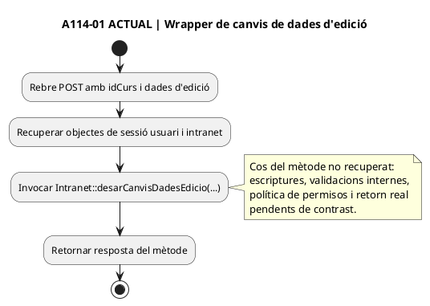
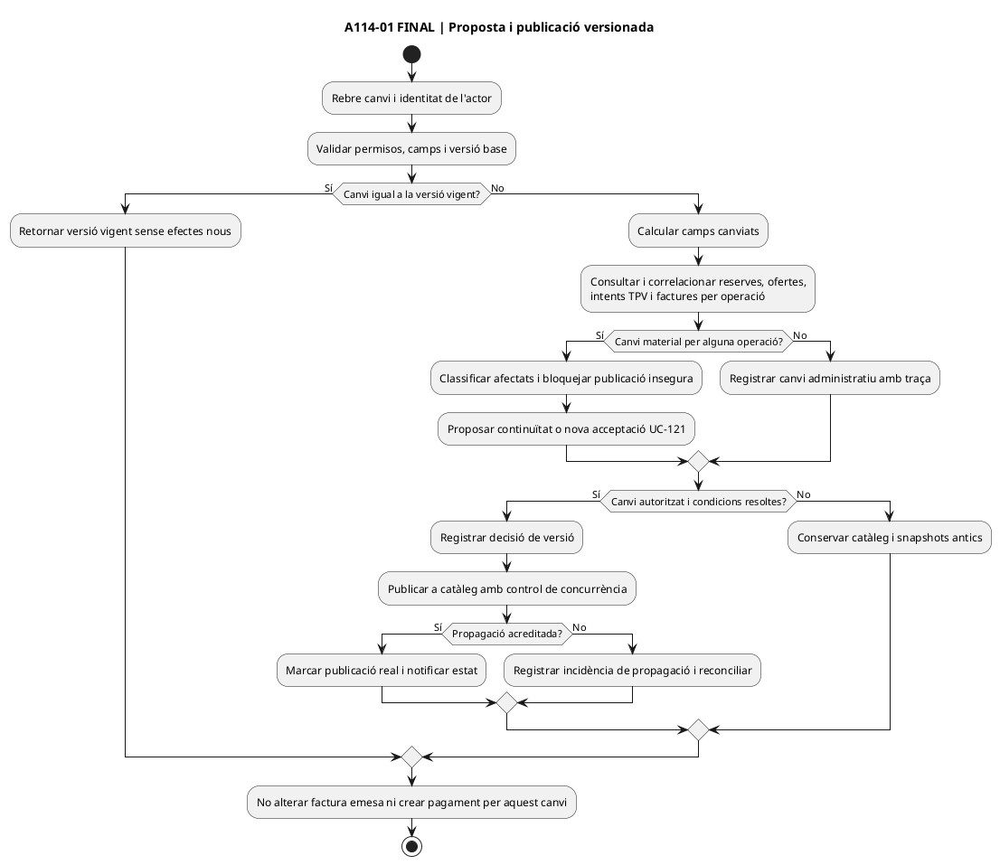
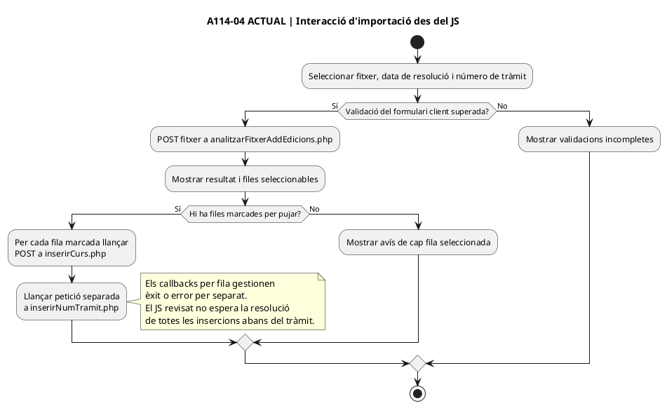
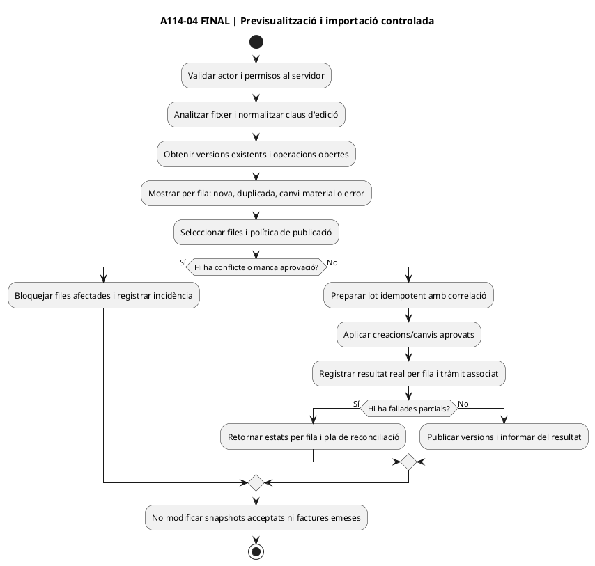

# Auditoria de casos d'ús pendents — lot 03 · UC-114 · Versionar producte o edició

**Data de revisió:** 22/09/2026. **Tall del codi contrastat:** `main`, commit `e71958b3026549bde09fb4b25f2ec3ba370937ec`. **Branca documental:** `docs/registre-mestre-auditoria-2026-09-22`. **Estat:** auditoria dirigida de l'UC-114, oberta; no s'han revisat els UC-111 ni UC-113 en aquest lot. No hi ha execució de PHP, MySQL, Redsys ni comprovació del desplegament real.

[Fitxa UC-114](uc-114-versionar-producte-edicio.md) · [Registre mestre RM-001–037](../00-index-i-pla/42-registre-mestre-cobertura-funcional-implementacio-documentacio.md) · [UC-112 snapshot](uc-112-congelar-snapshot-abans-tpv.md) · [UC-115 places](uc-115-reservar-alliberar-places.md) · [UC-121 nova oferta](uc-121-repreuar-renovar-reserva-caducada.md).

## 1. Resultat

**El UC ja defineix la necessitat de preservar l'oferta acceptada, però li falta una correspondència contrastada amb les diferents accions executables de l'edició actual.** S'han identificat quatre punts d'entrada diferents —modificació de dades d'edició, modificació de dades d'aula, canvi d'estat i importació/creació massiva— que no s'han de representar com una única acció genèrica ni donar per integrats al SIF perquè existeixi la taula `master_data_change_request`.

| Dimensió | Comprovació de la versió de tall | Estat |
| --- | --- | --- |
| Cas d'ús i objectiu | La fitxa UC-114 defineix versions, impacte sobre operacions obertes, aprovació i protecció dels snapshots previs. | **Documentat com a objectiu**, variants d'acció actual encara per completar. |
| Edició de dades | El wrapper existent passa diversos camps de l'edició a `Intranet::desarCanvisDadesEdicio()`. | **Punt d'entrada existent**, cos del mètode, totes les escriptures i controls interns no acreditats en aquesta revisió. |
| Canvi d'estat | El wrapper invoca `Intranet::desarCanvisEstatEnviarMsg_PreviIniciCursos()` amb estat anterior i nou. | **Punt d'entrada existent**; la política real per estat i resultats posteriors s'ha de confrontar amb el cos del mètode i el desplegament. |
| Creació per CSV | La pantalla analitza un fitxer, permet seleccionar registres i envia `inserirCurs.php` per registre, més una petició separada del número de tràmit. | **Flux JS identificat**; no és una publicació atòmica o versionada demostrada. |
| Persistència SIF | Migració `000005`: `master_data_change_request` té versions, `CHANGESET_JSON`, `AFFECTED_OPEN_OPERATIONS_JSON`, aprovador i correlació; `commercial_operation_line` té `PRICE_RULE_VERSION` i `SNAPSHOT_JSON`. | **SQL definit**; no prova de writer/orquestrador PHP ni de migració aplicada en un entorn concret. |
| Intenció Redsys | `RedsysPaymentIntentService` guarda snapshot/import i rebutja reutilitzar el mateix `DS_ORDER` amb dades diferents. | **Protecció parcial implementada**; no consulta per si mateix l'impacte del canvi en totes les operacions obertes. |
| Pàgines i diagrames | `cursos-afegir-modificar-edicions.php` carrega un main dinàmic i el JS d'importació; la resta de botons/fluxos poden venir de HTML generat per `Intranet.php`. | **Traça parcial**; els diagrames adjunts són d'accions identificades, NO els diagrames exhaustius de totes les pàgines/apartats exigits a RM-037. |

## 2. Inventari accionable: acció real → funcionalitat actual → canvi

| ID d'acció | Font del codi actual | Comportament comprovat | Buit de documentació i implementació | UC relacionats i prova |
| --- | --- | --- | --- | --- |
| A114-01 · Desar dades d'edició | [`desarCanvisDadesEdicio.php` L16–32](../../codi-drive/intranet-actual/ajax/cursos/desarCanvisDadesEdicio.php#L16-L32) | Rep per POST `idCurs`, `nomCurs`, `dataI/dataF`, `hores`, `cursEsc`, codis GTAF/FISS, dates de resolució/qualificació/bloqueig, valors associats i observacions; els passa al mètode de la intranet. **Aquest wrapper NO rep `idPreu`.** | Recuperar el cos del mètode per registrar taules, claus, permisos i validacions reals; diferenciar nom/hores/dates contractuals dels camps administratius. Identificar la ruta **independent** que canvia el preu, en lloc de presumir que aquest formulari ho fa. Fer previsualització de les operacions obertes, proposta versionada, autorització i publicació controlada quan hi ha efecte comercial/fiscal. | UC-114/112/115/121; **V114-01**. |
| A114-02 · Desar dades d'aula | [`desarCanvisDadesAulaEdicio.php` L16–24](../../codi-drive/intranet-actual/ajax/cursos/desarCanvisDadesAulaEdicio.php#L16-L24) | Rep `idCurs`, `idAula`, aula, dates de revisió/informe i observacions; invoca `desarCanvisDadesAulaEdicio()`. | Comprovar si només canvia ubicació/dades administratives o si afecta hores, assistència, aforament i prestació contractada; definir si exigeix avís/reacceptació o només traça interna. Sense contingut del mètode no es pot afirmar que modifica places o factures. | UC-114/115/129 segons efecte real; **V114-02**. |
| A114-03 · Canviar estat i comunicar | [`desarCanvisEstatEnviarMsg.php` L15–27](../../codi-drive/intranet-actual/ajax/cursos/desarCanvisEstatEnviarMsg.php#L15-L27) | Rep `any/mes/curs/estatAnt/estat` **encara per GET malgrat un comentari «Canviar GET per POST»**; invoca `desarCanvisEstatEnviarMsg_PreviIniciCursos()` i retorna la resposta. | Inventariar estats admissibles i escriptors/avisos dins del mètode; no confondre «canvi d'estat» amb modificació de dades de catàleg ni amb baixa, devolució, anul·lació fiscal o execució Moodle. Comprovar autenticació, rol, autorització, transicions, efectes i idempotència a servidor; canviar mètode HTTP segons contracte aprovat. | UC-114/26/29/71/115/127/129 segons variant; **V114-03**. |
| A114-04 · Afegir edicions des de CSV | [pàgina d'importació](../../codi-drive/intranet-actual/cursos-afegir-modificar-edicions.php), [JS L50–115](../../codi-drive/intranet-actual/js/cursos-afegir-modificar-edicions.js#L50-L115), [JS L210–310](../../codi-drive/intranet-actual/js/cursos-afegir-modificar-edicions.js#L210-L310), [`inserirCurs.php` L16–33](../../codi-drive/intranet-actual/ajax/cursos/inserirCurs.php#L16-L33) | Després de validar fitxer/data/tràmit en client i analitzar CSV, l'usuari selecciona files; el JS envia una petició `inserirCurs.php` per fila i una altra petició `inserirNumTramit.php`, **sense esperar la resolució de totes les insercions al codi JS examinat**. `inserirCurs.php` rep entre altres `idCurs`, any/mes, `idPreu`, `public`, dates i hores. | Tractar creació d'edició nova i canvi d'edició ja existent com a variants diferents; deduplicar reimportació, definir tractament d'errors parcials, política de publicació i versió inicial. Verificar possible rollback/transaction al servidor abans d'afirmar que realment es produeixen escriptures parcials; traçar canvis de preu per aquesta ruta. | UC-114/106/115 i cas d'importació a classificar; **V114-04/05**. |

**Limitació concreta del codi:** la consulta de `Intranet.php` completa no ha retornat el cos dels tres mètodes des del connector en aquest lot. Les afirmacions sobre l'efecte real sobre les taules del llegat, comprovació de permisos interna i interaccions amb Moodle/correu són **pendents de contrast**, no absències demostrades. El fitxer pot tenir controls que els wrappers no mostren.

## 3. Dades i variants que s'han de decidir

- **Identitat estable de producte/edició:** confirmar claus efectives a les BDs `informacio`, `curs`, `preus`, `aula`, reserves i inscripcions; separar ID intern d'edició, codi de curs, any/mes, ID_PREU, codi GTAF/FISS i versió aprovada. No assumir que modificar any/mes conserva la mateixa identitat.
- **Canvi de camps no econòmics vs canvi de l'oferta:** observacions internes, data d'informe o aula sense alteració contractual; dates, hores, títol visible, modalitat, preu, regla de descompte, places o classificació fiscal amb impacte variable. Aprovar una **matriu camp × estat de l'operació × efecte/consentiment**.
- **Operació sense alta / amb reserva / checkout DS_ORDER pendent / cobrament confirmat / factura abans de cobrar / pack o grup / servei iniciat o finalitzat:** documentar decisions diferenciades; conservar l'antic `SNAPSHOT_JSON` i identificar canvis que exigeixen nova acceptació UC-121, incidència UC-53 o tractament fiscal posterior. Actualitzar el catàleg no ha de crear `CHARGE`, `REFUND` ni modificar `factura_linia`.
- **Edició anul·lada, ajornada, publicada/oculta o reprogramada:** comprovar codis d'estat reals i contingut de `desarCanvisEstatEnviarMsg_PreviIniciCursos()` abans d'assignar semàntica exacta; distingir operació comercial, matriculació/accés i decisió econòmica.
- **Importacions i concorrència:** duplicat per mateixa edició en dues pujades; dues persones editen una versió base; reimportació després d'error parcial; número de tràmit sense totes les edicions creades; intent TPV antic confirmat durant la publicació de versió nova.
- **Codi web:** [`Curs.php` L124–138](../../codi-drive/web-actual/Curs.php#L124-L138) selecciona preu/hores segons propera edició visible; [`Edicio.php` L39–110](../../codi-drive/web-actual/Edicio.php#L39-L110) construeix l'objecte llegint informació viva i perfils de `curs`. Una consulta nova al catàleg pot oferir valors diferents del snapshot prèviament acceptat; **no** és prova que el callback real recalculi el preu. Cal verificar el camí checkout per cada producte.

## 4. Contracte objectiu i modificacions pendents

**DOC-114:** completar les seccions de la fitxa i matrius de pantalles amb les accions A114-01–04; localitzar formularis, botons, mètodes reals de `Intranet.php`, taules/camps llegits/escrits i efectes de notificació, PDF, places i Moodle. Identificar el flux de preus que no apareix al wrapper A114-01. Per cada acció fer diagrama actual/final, incloent alternatives; el diagrama de canvi d'estat no substitueix els de modificació de dades ni importació CSV. No modificar UC-111 ni UC-113 en aquest lot.

**IMP-114:** introduir un `MasterDataChangeService` / repositori / `OpenOperationsLookup` **com a DISSENY, no classes PHP acreditades**, i un adaptador autoritzat per a l'operació llegat: validar versió base (control d'edició concurrent), previsualitzar afectats, classificar impacte per operació i línia, aprovar segons rol, publicar de manera idempotent i registrar el resultat real de cada sistema o incidència. L'estat fiscal i econòmic no es modifica a través de simples canvis de catàleg. Per CSV, definir idempotència per edició i retorn de resultats per fila abans de publicar una operació completa; no equiparar la selecció de files a una transacció conjunta demostrada.

**BD-114:** `master_data_change_request` ja està **DEFINIDA** a [000005 L196–217](../../sif/database/migrations/2026_09_16_000005_add_operation_lifecycle_tables.sql#L196-L217) amb versions, JSON d'impacte, aprovació i índex únic per `ENTITY_TYPE + ENTITY_KEY + PROPOSED_VERSION`; `commercial_operation_line` ja defineix `PRICE_RULE_VERSION` i `SNAPSHOT_JSON` a [L6–35](../../sif/database/migrations/2026_09_16_000005_add_operation_lifecycle_tables.sql#L6-L35). **No hi ha prova aquí de writer PHP, aplicació de la migració ni reconstrucció consistent de totes les operacions afectades:** la llista JSON no substitueix la consulta, bloqueig i correlació real amb les dades d'origen.

**Redsys-114:** [`RedsysPaymentIntentService::create()` L19–65](../../sif/src/Service/RedsysPaymentIntentService.php#L19-L65) persisteix import, ordre i snapshot, i rebutja contradicció per mateix `DS_ORDER`; NO substitueix la cerca per edició de reserves, pagaments reals i factures emeses. Un callback de l'oferta antiga requereix conciliació, sense reescriure el snapshot ni una segona factura automàtica.

## 5. Diagrames d'activitat per acció — exemple parcial, no pàgina completa

### A114-01 · Desar dades de l'edició — ACTUAL, límit al wrapper verificat

### A114-01 · Desar dades de l'edició — FINAL, contracte proposat

### A114-04 · Importació CSV — ACTUAL, observat al JS de la pantalla

### A114-04 · Importació CSV — FINAL, contracte proposat

**RM-037 pendent:** aquests diagrames cobreixen només dos punts d'entrada identificats, no el contingut complet de les pantalles. Cal recuperar tots els formularis generats a `mostrarMain` / `Intranet.php` i elaborar també els diagrames actual/final de canvi d'estat i dades d'aula amb les seves branques i proves pròpies.

## 6. Proves d'acceptació proposades — NO executades

| ID | Variant verificable i resultat necessari |
| --- | --- |
| V114-01 | Canviar només observacions internes sense prestació afectada: versió/actor/efecte documentats, cap factura o pagament nou; canviar hores/dates/preu contractual amb checkout obert → impact analysis i decisió explícita. |
| V114-02 | Canviar aula o data d'informe: comprovar en el codi real si varia plaça, horari o prestació; si no, cap reacceptació comercial injustificada; si sí, gestionar afectats segons política. |
| V114-03 | Canviar estat pendent→anul·lat amb factura pendent, pagament confirmat i matrícula Moodle: efectes i avisos separats; cap refund, baixa acadèmica o rectificació fiscal automàtics sense operació real acreditada; rol no autoritzat → denegació. |
| V114-04 | Importar el mateix CSV dues vegades o amb dues persones concurrents: una versió/edició lògica per identitat de negoci, error o reús explícit per fila, sense duplicar número de tràmit ni modificar ofertes prèvies. |
| V114-05 | Importació parcial: fallada d'una fila o del número de tràmit no provoca missatge de «lot íntegrament creat»; reconciliació reproduïble, sense segones insercions dels registres ja confirmats. |
| V114-06 | Canviar preu amb `DS_ORDER` pendent: mateix ordre/snapshot es conserva o s'obre nova oferta/ordre després d'acceptació; callback antic real es concilia sense preu nou ni segona factura. |
| V114-07 | Pack amb dos components i canvi de data/preu d'un: detectar les dues operacions/inscripcions relacionades i prendre decisió per línia, sense reescriure imports emesos ni desfer l'altre component per defecte. |
| V114-08 | Dues persones aproven des de la mateixa `BASE_VERSION`: una sola publicació segons control de concurrència i conflicte identificat, amb dades llegades i SIF reconciliables. |

## 7. Estat i pròxims punts de la traça

**DOC UC-114:** ampliació amb accions i diagrames parcials; **no** revisió de tota la UI o variants de tota la base de codi. **IMP UC-114:** SQL proposat/existent i protecció Redsys parcial; orquestració i adaptació de canals pendents d'acreditar. **TEST/BD/DEPLOY:** no executat/no verificat. **Cap modificació de codi ni de la BD d'explotació** en aquesta auditoria. **UC-111 i UC-113:** exclosos deliberadament del lot.

**Abans de declarar UC-114 cobert:** recuperar el cos dels mètodes `Intranet::desarCanvisDadesEdicio`, `desarCanvisDadesAulaEdicio`, `desarCanvisEstatEnviarMsg_PreviIniciCursos` i `insertCurs`; mapar la ruta de canvi de preu i les consultes de tots els editors; identificar totes les accions de les pantalles i el desplegament actiu; executar proves V114 amb BD i callbacks d'entorn de proves. No interpretar la impossibilitat de recuperar el cos del fitxer de grans dimensions com absència del mètode o dels seus controls.
