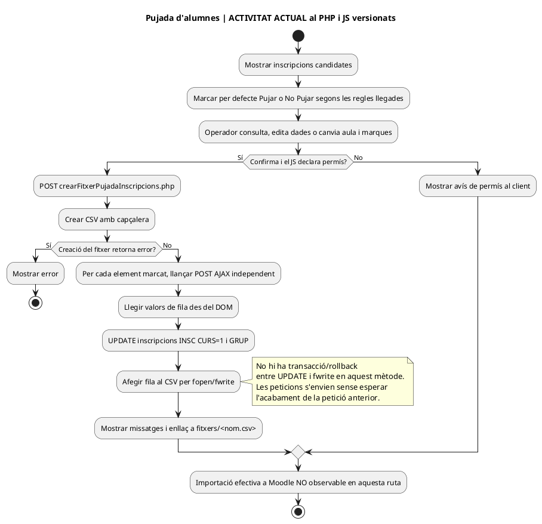
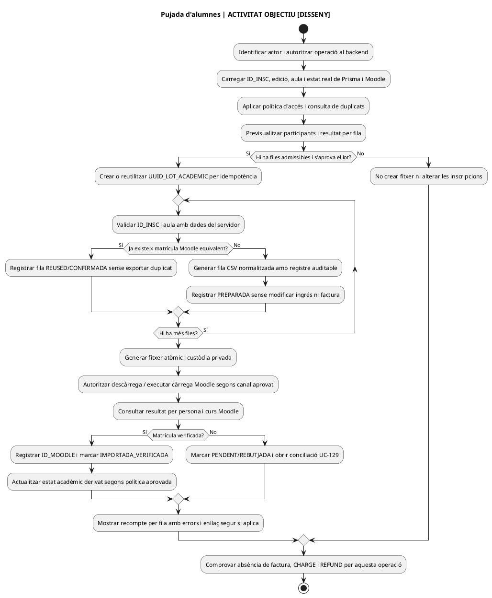

# Auditoria funcional — lot 04 · UC-113 (sense UC-111) · 22/09/2026

**Numeració del lot:** els lots 02 (UC-111) i 03 (UC-114) ja consten a la branca; aquest treball és el lot 04 i revisa exclusivament UC-113, sense revisar UC-111.

**Font del codi:** `main` a `e71958b3026549bde09fb4b25f2ec3ba370937ec`. **Àmbit auditat:** una fitxa funcional, UC-113, i el flux llegat relacionat que el seu nom podia confondre amb una importació. **Estat:** AUDITAT PARCIALMENT / FITXA NO TANCADA / PROVES NO EXECUTADES. El PHP versionat no prova què hi ha desplegat en producció.

**Conclusió verificable:** `Cursos > Inici de cursos > Pujada d'alumnes` de la intranet **no importa noves inscripcions a PrisMa**: llegeix inscripcions existents, les marca `INSC CURS=1` i construeix un CSV de càrrega a Moodle. L'operació de **crear/importar inscripcions a PrisMa** descrita per UC-113 és una funcionalitat objectiu diferent; es conserva el seu UC. La preparació/exportació del CSV és una funcionalitat existent amb inici, actor, estat i resultat propis: **CAND-UC-MOODLE-CSV-01**, que no s'ha de barrejar automàticament amb UC-113 ni amb la conciliació posterior UC-129. Cal comparar aquest candidat amb tot el catàleg abans d'assignar-li un número nou.

## 1. Inventari verificat de la pantalla i les accions actuals

| Acció / variant | Codi i comportament del fitxer actual | UC i límits |
| --- | --- | --- |
| Obrir la pàgina de pujada d'alumnes | [pàgina](../../codi-drive/intranet-actual/cursos-inici-cursos-pujar-alumnes.php), [Intranet::__mostrarPage_Cursos_Pujada_Inscripcions](../../codi-drive/intranet-actual/Intranet.php#L3615-L3658) recupera inscripcions d'edicions candidates. | CAND-UC-MOODLE-CSV-01 + consulta acadèmica; no UC-113 per si sola. |
| Filtrar/mostrar i escollir alumnes i aula | [Intranet.php L3745–3800](../../codi-drive/intranet-actual/Intranet.php#L3745-L3800) mostra avisos REALITZAT, DUPLICADA, DEUTOR, dades, aula i botó Pujar/No Pujar; si detecta deute, inicialitza No Pujar. [JS L49–82](../../codi-drive/intranet-actual/js/cursos-inici-cursos-pujar-alumnes.js#L49-L82) alterna marca, aula i selecció. | CAND-UC-MOODLE-CSV-01; UC-107 com a avís de duplicat, UC-95/124 per decidir accés per deute, UC-129 per identificar destí Moodle. La marca visual no imposa sola la regla al servidor. |
| Consultar i editar dades personals abans de preparar el CSV | [Intranet::actualitzaDadesPersonals_pujadaAlumnes](../../codi-drive/intranet-actual/Intranet.php#L4068-L4095) executa UPDATE de dades de la inscripció; [JS L221–388](../../codi-drive/intranet-actual/js/cursos-inici-cursos-pujar-alumnes.js#L221-L388) obre modal i desa canvis. | Acció separada de modificació de dades: comprovar UC específic d'identitat/dades i UC-128 per domicili/normalització. Un UPDATE de `CORREU` no modifica automàticament receptor de factura emesa ni identitat Moodle. |
| Confirmar pujada, crear CSV | [JS L85–110](../../codi-drive/intranet-actual/js/cursos-inici-cursos-pujar-alumnes.js#L85-L110) invoca [crearFitxerPujadaInscripcions.php](../../codi-drive/intranet-actual/ajax/inici/crearFitxerPujadaInscripcions.php) i [Intranet::crearFitxerPujadaInscripcions](../../codi-drive/intranet-actual/Intranet.php#L4120-L4149), que crea un fitxer `pujada-inscripcions-<data-hora>.csv` al directori `fitxers/` amb capçalera de camps de càrrega Moodle. | CAND-UC-MOODLE-CSV-01; el servidor crea un fitxer, **no** es veu una crida a l'API Moodle en aquest recorregut. |
| Marcar cada inscripció i afegir fila al CSV | [JS L112–168](../../codi-drive/intranet-actual/js/cursos-inici-cursos-pujar-alumnes.js#L112-L168) envia un POST per cada fila marcada a [pujarInscripcions.php](../../codi-drive/intranet-actual/ajax/inici/pujarInscripcions.php#L19-L30), que delega en [Intranet::pujar_Inscripcions](../../codi-drive/intranet-actual/Intranet.php#L4151-L4201). [SQL L1075–1076](../../codi-drive/intranet-actual/Intranet.php#L1073-L1077) fa `UPDATE inscripcions SET INSC CURS=1, GRUP=?` per `USUARI, CURS, ANY, MES, INSC CURS=0`; a continuació el PHP afegeix al CSV usuari, nom, cognoms, email, població i codi de curs+aula. | **No crea cap inscripció nova**; escriu estat acadèmic de la inscripció existent i un fitxer extern. La semàntica `INSC CURS=1` NO acredita per si sola que Moodle hagi processat amb èxit la fila. |
| Retornar enllaç al CSV | [JS L150–165](../../codi-drive/intranet-actual/js/cursos-inici-cursos-pujar-alumnes.js#L150-L165) insereix un enllaç `https://intranet.prisma.cat/fitxers/<fitxer>`; el fitxer incorpora dades personals. | No s'ha comprovat l'autorització efectiva del directori al servidor. Requereix descàrrega autenticada, retenció i accés restringit; no interpretar la URL com a prova de càrrega real a Moodle. |

**Variant existent d'aula oberta:** [crearFitxerAO.php](../../codi-drive/intranet-actual/ajax/inici/crearFitxerAO.php), [pujarAulesObertes.php](../../codi-drive/intranet-actual/ajax/inici/pujarAulesObertes.php) i [Intranet::pujar_AO L3515–3565](../../codi-drive/intranet-actual/Intranet.php#L3515-L3565) fan un procés de CSV separat i modifiquen `PERENNE`, no són una importació UC-113. Inventariar-la com a variant pròpia abans de donar per complet el cas d'ús d'exportació acadèmica.

## 2. Diferències entre la fitxa UC-113 i el codi verificat

1. **Nom ambigu:** «Importar/crear inscripcions manualment o en lot» significa altes al registre de PrisMa; «Pujada d'inscripcions» a la pàgina real significa preparar matriculacions de persones **ja inscrites** per al campus. La nota actual de la fitxa que parla dels handlers web d'alta de curs/tastet és correcta però **insuficient per inventariar aquesta pantalla**.
2. **Importació UC-113 encara no acreditada:** [migració 000005 L154–193](../../sif/database/migrations/2026_09_16_000005_add_operation_lifecycle_tables.sql#L154-L193) defineix `enrollment_import_run` i `enrollment_import_item`, però l'arbre `sif/src` del commit revisat no té `EnrollmentImportService`, `EnrollmentImportRepository` ni `MoodleEnrollmentGateway`. Els seus UML són disseny, no codi executable. Tampoc s'ha identificat un parser actual de CSV que insereixi inscripcions en aquest recorregut. **No concloure que no hi ha altres vies d'alta manual a tota la intranet** sense inventariar les seves pantalles i els seus mètodes.
3. **Identitat de fila insuficient en el SQL objectiu:** `UNIQUE(UUID_IMPORT_RUN,ROW_NUMBER)` i `UNIQUE(UUID_IMPORT_RUN,ROW_HASH)` detecten repetits DINS d'un lot, però no identifiquen la mateixa matrícula en dos lots diferents; un hash de fila idèntic en dues files del mateix lot pot provocar conflicte que cal definir com a resultat de fila, no només error SQL. `SOURCE_HASH` del lot no és clau única de negoci. UC-107/126 han d'aportar identitat fiable, amb subjecte, edició i estat.
4. **Separació fiscal i econòmica:** UC-113 no pot convertir `PAGAMENT`, `A_PAGAR` o marca de matrícula en una prova bancària, factura o nou `CHARGE`. La preparació de CSV tampoc no els crea en el recorregut verificat. Canviar `INSC CURS` és estat acadèmic, no cobrament.
5. **Permisos i exposició de dades:** [el JavaScript comprova `tePermisEdicio`](../../codi-drive/intranet-actual/js/cursos-inici-cursos-pujar-alumnes.js#L85-L90); els dos endpoints PHP examinats fan `session_start()`, recuperen objectes de sessió i criden el mètode, sense comprovació explícita de rol/recurs en aquest tram. La configuració externa del servidor i la classe de sessió poden afegir controls: **no s'ha verificat l'exposició anònima**. [`pujar_Inscripcions` escriu a la resposta la consulta SQL](../../codi-drive/intranet-actual/Intranet.php#L4158-L4165); no és necessari i cal retirar-ho a l'adaptació. Per al CSV, evitar dades en URL indiscriminada i comprovar permís i període de conservació.
6. **Ordre i recuperació:** `pujar_Inscripcions` actualitza primer la BD web i escriu després al fitxer. Si `fopen`/`fwrite` falla, la inscripció pot quedar marcada malgrat que el CSV no tingui la fila. A més, el JS llança POSTs per fila sense esperar l'anterior i posa l'enllaç quan acaba la petició **de l'última posició del bucle**, que no garanteix que totes les altres hagin acabat. Falta resultat persistent per fila, bloqueig/nom segur del fitxer, retries i comprovació real del destí Moodle.
7. **CSV i confidencialitat:** la capçalera [L4124–4134](../../codi-drive/intranet-actual/Intranet.php#L4124-L4134) defineix `username;password;firstname;lastname;email;city;lang;course1;autosubscribe;maildisplay`; les files [L4178–4197](../../codi-drive/intranet-actual/Intranet.php#L4178-L4197) s'afegeixen per concatenació amb `;`. Cal decidir tractament de separadors, salts de línia i codificació de dades, preservar identitat de destinació i no incloure informació sobrera. La columna `password` queda buida en la fila revisada: **no** pressuposa que el fitxer contingui contrasenyes reals.
8. **Alta acadèmica ≠ matrícula Moodle confirmada:** no s'ha identificat en el PHP de la pantalla una resposta de Moodle amb `userId/courseId/enrollmentId`. Si el CSV es puja manualment en una eina externa, documentar aquest pas com a actuació de l'operador i verificar-ne la importació amb UC-129 abans de mostrar una matrícula com a confirmada.

## 3. Cas d'ús candidat per a la funcionalitat actual que faltava descriure

**Identificador provisional: CAND-UC-MOODLE-CSV-01 · Preparar i confirmar la pujada d'inscripcions existents a Moodle.** No sumar-lo encara al catàleg de 142 ni assignar-li número fins a contrastar els UC adjacents.

| Camp | Contracte a validar |
| --- | --- |
| Actor i disparador | Operador de gestió acadèmica amb permís; inicia la pantalla «Pujada d'alumnes», selecciona participants i confirma una pujada per una o diverses edicions/aules. |
| Precondicions | `ID_INSC` existent; edició/aula real i política d'accés aprovada; subjecte i curs Moodle identificats; inexistència d'alta confirmada equivalent. Deute no és per si sol una regla universal de baixa: validar UC-95/124. |
| Entrades actuals | ANY, MES, CURS, AULA, USUARI, FITXER, NOM, COGNOMS, EMAIL, POBLACIÓ; dades llegides del DOM i enviades a l'endpoint. `ID_INSC` real del registre és necessari com a identificador de fila objectiu. |
| Resultat actual | CSV i actualització de `INSC CURS` a 1 i `GRUP` quan el WHERE troba fila; **la matrícula Moodle real no està acreditada per aquest codi**. |
| Resultat objectiu | Exportació identificada (lot/fila) → fitxer generat i descarregable només a actor autoritzat → importació manual o automàtica confirmada per Moodle → mapeig de la matrícula real o incidència amb reintent sense duplicar. |
| Dades i estats | `ID_INSC`, ANY/MES/CURS/AULA, actor, `CSV_EXPORT_RUN/ITEM` o registre d'operació acadèmica **proposat** (no confondre amb `enrollment_import_run`, que avui modela la importació d'ALTES a PrisMa), estat `PREPARAT/EXPORTAT/IMPORTAT_VERIFICAT/REBUTJAT` **proposat** i id Moodle real. |
| Controls | Permís backend per fila i fitxer, identitat correcta, format CSV, resultat escrit per fila, reconciliació de destí UC-129, visibilitat i política d'accés UC-95/124, cap moviment monetari/fiscal. |
| Variants pròpies | Cap fila marcada; dos usuaris amb mateix email; duplicat al mateix curs; persona ja matriculada Moodle; aules diferents; deutor/empresa pagadora; error a la N-èsima fila; CSV creat però no importat; càrrega parcial a Moodle; aula oberta `PERENNE`; canvi de dades abans/després del fitxer. |

**Abast 2026/2027:** cap part d'aquest disseny exigeix automatitzar el tràmit manual de secretaria ni l'alta dels tastets abans de 2027; el flux de CSV pot continuar manual amb registre, permisos i verificació del resultat real.

**Punt de decisió documental:** si UC-129 es limita, com diu actualment, a **comparar i reparar** diferències entre sistemes, aquesta acció d'operador que construeix un fitxer/lot és un cas d'ús separat amb inclusió de la verificació UC-129. Si la revisió detallada del catàleg troba un UC existent que ja defineix aquesta acció i resultat, incorporar-hi totes les variants i tancar el candidat amb justificació d'equivalència.

## 4. Diagrames d'activitat de l'apartat verificat

**Cobertura RM-037:** aquests dos diagrames corresponen **només** a «Cursos > Inici de cursos > Pujada d'alumnes / Confirmar», i no substitueixen els diagrames de la resta de pàgines i apartats.

### 4.1. ACTUAL: codi versionat (el fitxer es prepara, Moodle no queda verificat)

### 4.2. FINAL: proposta, NO implementada

## 5. UC-113 original: especificació que cal completar sense confondre-la amb Moodle

**DOC:** inventariar la ruta **real** de les altes manuals a PrisMa (si existeix), els formats d'importació de matrícules a PrisMa, els rols, la persona/edició/estat, el tractament de `PAGAMENT`/factures històriques, mètodes i proves. No reutilitzar com a font actual el procés `pujar_Inscripcions` perquè aquest fa UPDATE + CSV Moodle, no INSERT de matrícula PrisMa. Distingir UC-113 de la importació històrica de FACTURES UC-011.

**IMP:** quan s'aprovin formats i política, programar EnrollmentImportService i repo sobre `enrollment_import_run/item` i integració idempotent per fila; validar identitat entre lots, evitar efectes monetaris/fiscals ficticis, controlar recuperació després de fallada de la BD acadèmica; garantir permisos backend. No materialitzar un importador imaginant columnes no corroborades.

**Proves UC-113 encara pendents:** fitxer repetit, mateixa inscripció en lots diferents, dues persones amb email compartit, mateixa persona dues edicions, error d'una fila entre 20, reintent després d'alta escrita però sense resposta, marca llegat `PAGAMENT=1` sense prova bancària, inscripció amb factura anterior, cap nova factura/CHARGE per importació.

## 6. Proves d'acceptació del candidat Moodle CSV (totes pendents d'execució)

| ID | Escenari | Evidència exigida |
| --- | --- | --- |
| MO-CSV-01 | No hi ha cap participant marcat i es confirma | No es crea fitxer inútil ni es modifica `INSC CURS`; registrar el comportament actual diferent si es manté temporalment. |
| MO-CSV-02 | El segon `fwrite` falla després que la BD actualitzi la inscripció | Estat d'exportació pendent/incoherent recuperable, no «Moodle matriculat»; reintent sense fila perduda. |
| MO-CSV-03 | Arriben 10 POST en ordre diferent; últim DOM acaba primer | El resultat final i enllaç només apareixen quan les 10 files estan registrades; recompte = 10 o errors explícits. |
| MO-CSV-04 | L'operador confirma la pujada dues vegades | Una sola operació/fila per idempotència, sense duplicar CSV ni matrícula al destí. |
| MO-CSV-05 | S'exporta CSV però Moodle no el carrega / el rebutja parcialment | Estado PREPARAT/PENDENT, incidència i verificació per ID_INSC; cap falsa matrícula confirmada. |
| MO-CSV-06 | Inscripció d'empresa amb deute i plaça acadèmica per participant | Política d'accés aplicada a participant amb responsable/pagador diferenciat; no deduir baixa o factura nova. |
| MO-CSV-07 | Usuari sense permís invoca endpoints sense passar per la pàgina JS | Backend denega creació de fitxer i canvi d'estat; arxiu només accessible a actor autoritzat. |
| MO-CSV-08 | Dades amb separadors CSV, salts de línia i accents | Importació exacta d'una sola fila per participant sense desplaçar columnes ni filtrar dades personals en missatges. |
| MO-CSV-09 | Una inscripció de la mateixa persona ja té matrícula Moodle | Recuperar ID Moodle existent, no reimportar ni duplicar usuari/aula; cap canvi fiscal. |
| MO-CSV-10 | Aula oberta (PERENNE) versus alta a curs (INSC CURS) | Cada estat i CSV segueixen la variant correcta, amb prova independent de destí. |

## 7. Estat i següents comprovacions

- **UC-113 DOC:** revisió dirigida amb nova evidència, però NO TANCAT perquè falta localitzar/validar TOTES les rutes d'alta manual o d'importació a PrisMa. **UC-113 IMP:** SQL DEFINIT; servei d'importació i canal NO ACREDITATS. **UC-113 TEST:** NO EXECUTAT.
- **CAND-UC-MOODLE-CSV-01 DOC:** acció i mètodes reals CONTRASTATS AMB CODI; falta verificar pantalla desplegada, regla empresarial d'accés, permisos i importació externa efectiva. **IMP:** codi llegat EXISTENT, mecanisme final de control/conciliació NO ACREDITAT; **TEST:** NO EXECUTAT.
- **Per continuar sense barrejar casos:** completar aquest candidat com a UC amb número després de revisar el catàleg, continuar UC-114 (versionat de producte/edició) en una auditoria separada quan pertoqui. **UC-111 explícitament EXCLÒS d'aquest lot.**

[Fitxa UC-113](uc-113-importar-inscripcions-manualment-lot.md) · [fitxa original](../06-fitxes-funcionals/uc-113.md) · [UC-107](uc-107-detectar-inscripcio-duplicada.md) · [UC-095](uc-095-estat-academic-deute-pendent.md) · [UC-124](uc-124-reconciliar-acces-certificat-baixa-deute.md) · [UC-129](uc-129-reconciliar-prisma-moodle-matricules.md) · [reg. mestre](../00-index-i-pla/42-registre-mestre-cobertura-funcional-implementacio-documentacio.md).
