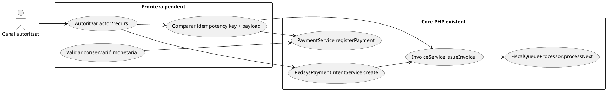
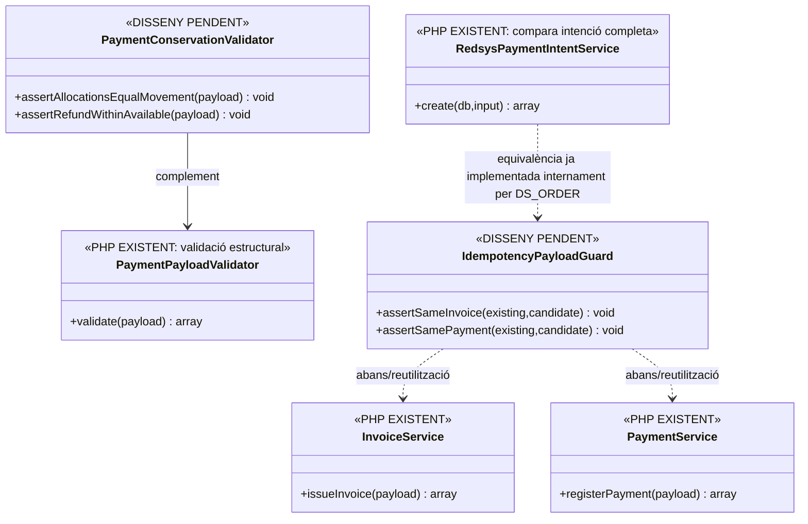
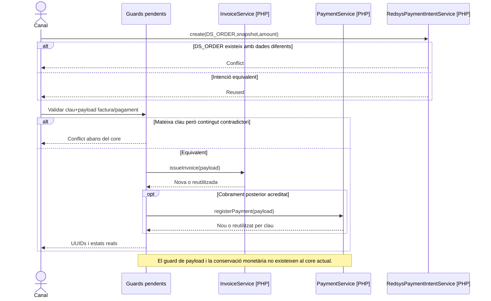

# Auditoria de contractes core PHP després de la revisió 142/142

**Objectiu:** fixar, amb signatures i comportament verificats al codi actual, què garanteixen realment els serveis centrals de factura, pagament, intenció Redsys, cua AEAT i documents. Aquest document **corregeix interpretacions massa fortes** que podrien deduir-se de les fitxes funcionals. No és una execució de tests.

## 1. InvoiceService · idempotència de factura i pagament inicial

### Signatura verificada

```php
InvoiceService::issueInvoice(array $payload): array
```

Flux real:
1. `InvoicePayloadValidator::validate($payload)`.
2. Transacció:
   - cerca `factura.IDEMPOTENCY_KEY` amb `FOR UPDATE`;
   - si existeix, retorna la factura existent;
   - si no existeix, reserva seqüència, bloqueja cadena, crea graf de factura i opcionalment un pagament inicial.
3. Si hi ha duplicate key SQL, torna a buscar la mateixa clau i reutilitza.

### Límit crític

**No hi ha comparació de payload de la factura nova contra el payload original quan la clau idempotent ja existeix.** `existingResult()` retorna només:

- `ok=true`
- `idempotency_reused=true`
- `UUID_FACTURA`
- `NUM_VISIBLE`

Per tant:

> mateixa `idempotency_key` **no implica** que receptor, línies, totals, relacions o snapshot coincideixin amb la petició original.

Aquesta validació s'ha de fer **abans d'InvoiceService** o afegir-se al propi servei/repository.

### Cas especialment delicat: retry amb bloc payment

Quan la factura ja existeix i la petició reutilitzada porta `payment`, `existingResultWithPaymentIfPresent()`:

1. construeix el payload del pagament;
2. valida;
3. busca `payment_transaction` per la seva clau idempotent;
4. si existeix, retorna `uuid_payment`;
5. **si no existeix, no crea el pagament** i retorna només la factura existent.

Això vol dir que:

- un primer intent que va crear factura **sense** arribar a crear el pagament,
- seguit d'un retry amb la mateixa clau de factura i bloc `payment`,

**no converteix automàticament aquell retry en registre del cobrament**.

Cal un contracte explícit: o l'operació factura+pagament és atòmica en el primer intent, o el cobrament posterior entra per `PaymentService/ManualPaymentService` com una acció separada i acreditada.

## 2. PaymentService · idempotència sense equivalència de payload

### Signatura verificada

```php
PaymentService::registerPayment(array $payload): array
```

`PaymentService`:
- valida el payload;
- busca `payment_transaction.IDEMPOTENCY_KEY` amb lock;
- si existeix, retorna `UUID_PAYMENT`;
- si no existeix, crea moviment i assignacions;
- davant duplicate key, torna a cercar i reutilitza.

**No compara el nou payload amb el `PAYLOAD_HASH` de la fila existent.** El hash es desa a `PaymentRepository::createPayment()`, però `PaymentService` no el llegeix per decidir si el retry és equivalent.

Conseqüències:
- mateixa clau + import diferent → avui pot retornar l'operació anterior com a reutilitzada;
- mateixa clau + `DS_ORDER`/referència diferent → mateix risc;
- una **clau nova** per la mateixa transferència externa pot crear un segon `CHARGE` si l'orquestrador no reconcilia la referència bancària/proveïdor.

## 3. PaymentPayloadValidator · validació estructural, no conservació monetària

### Signatura

```php
PaymentPayloadValidator::validate(array $payload): array
```

Comprova:
- camps obligatoris;
- `movement_type ∈ {CHARGE, REFUND, COMPENSATION}`;
- `method ∈ {REDSYS, TRANSFERENCIA, COMPENSACIO, MANUAL}`;
- `amount` numèric;
- almenys una `allocation`;
- cada assignació amb `uuid_factura, amount, allocation_type`;
- imports d'assignació numèrics.

**No comprova al codi revisat:**
- que `amount > 0`;
- que cada `allocation.amount > 0`;
- que la suma de `allocations.amount` sigui igual a `payment.amount`;
- que `allocation_type` pertanyi a un enum determinat;
- que una factura de l'assignació sigui compatible amb el pagador/origen;
- que un `REFUND` no superi el cobrament real anterior.

Aquests invariants són especialment importants abans de construir el futur ledger per inscripció.

## 4. PaymentRepository · què actualitza realment

`PaymentRepository::createPayment()`:
1. crea una fila `payment_transaction` amb `ESTAT='CONFIRMED'`;
2. calcula i desa `PAYLOAD_HASH`;
3. crea cada `payment_allocation`;
4. recalcula `factura.ESTAT_COBRAMENT`.

Per calcular l'estat:
- suma `CHARGE + COMPENSATION`;
- resta/considera `REFUND` via `PaymentStatusCalculator`.

**No hi ha `ID_INSC` a `payment_allocation`.** L'actualització és per `UUID_FACTURA`, no per participant.

## 5. RedsysPaymentIntentService · idempotència més forta que PaymentService

### Signatura

```php
RedsysPaymentIntentService::create(PDO $db, array $input): array
```

En aquest servei sí que hi ha comparació explícita quan `DS_ORDER` ja existeix. `sameIntent()` comprova:

- `IDPAG`;
- `SOURCE_TYPE`;
- `SOURCE_ID`;
- `EXPECTED_AMOUNT`;
- `CURRENCY`;
- `TERMINAL`;
- `SNAPSHOT_JSON` canonitzat;
- `CREATED_BY`;
- `EXPIRES_AT`.

Si difereix, llança conflicte.

Per tant, **no s'ha d'estendre la debilitat de `PaymentService` a `RedsysPaymentIntentService`**: la intenció TPV té avui un contracte d'equivalència més estricte.

## 6. PaymentActionGateway · traça i fronteres transaccionals

### Signatura

```php
PaymentActionGateway::run(array $auditContext, callable $operation): mixed
```

Comportament verificat:
1. `REQUESTED` s'escriu amb `$this->db` **abans** de la transacció de l'operació.
2. L'operació i l'event terminal `SUCCEEDED/REUSED` s'executen dins de `TransactionRunner`.
3. Si hi ha excepció, després del rollback intenta escriure `FAILED` amb `$this->db`.
4. Si aquest últim event falla, l'excepció de l'event es descarta per preservar l'error original.

Això implica:
- no hi ha una sola transacció que garanteixi `REQUESTED + operació + terminal`;
- pot existir `REQUESTED` sense terminal si hi ha fallades encadenades;
- `FAILED` és **best effort** després del rollback;
- només les accions que **passen realment pel gateway** obtenen aquesta traça.

## 7. FiscalQueueProcessor · SENT i estat AEAT

`FiscalQueueProcessor::processNext()` només accepta del transport els estats:

- `ACCEPTED`
- `ACCEPTED_WITH_ERRORS`
- `REJECTED`

Si el transport retorna un d'aquests, `FiscalQueueRepository::complete()`:
- marca la fila de cua `STATUS='SENT'`;
- desa XML/resposta;
- posa `factura_registres.ESTAT_AEAT` a l'estat retornat;
- actualitza `factura.ESTAT_AEAT`.

Per tant:

> `fiscal_queue.STATUS='SENT'` vol dir **tramesa processada pel worker**, no «acceptada sense errors».

La interpretació funcional s'ha de fer amb `ESTAT_AEAT`, no només amb l'estat de cua.

### Stale locks

`recoverStaleLocks()` transforma `PROCESSING` antic a `RETRY`. **No consulta remotament si l'AEAT va acceptar la petició abans que es perdés la resposta.** Per això UC-77/85 mantenen la conciliació de resultat incert com a bloqueig.

## 8. DocumentRepository · hash calculat, storage no escrit

### Signatura

```php
DocumentRepository::registerDocument(
    PDO $db,
    string $uuidFactura,
    string $type,
    string $path,
    string $contents
): array
```

Fa:
- valida `type ∈ {PDF, XML, QR}`;
- valida el text del path;
- calcula `sha256($contents)`;
- insereix `PATH_FITXER`, `HASH_FITXER`, `ESTAT='CREATED'`.

**No escriu `$contents` al filesystem ni comprova que `$path` contingui els bytes.** Per tant, registrar metadades/hash no acredita que el document físic existeixi o sigui recuperable.

## 9. Contracte transversal corregit







## 10. Impacte documental

Aquesta auditoria reforça o corregeix la lectura de:
- [Revisió transversal](00-revisio-transversal-142-casos.md)
- [Moviments per inscripció](00-revisio-moviments-inscripcions.md)
- [UC-62 · intranet](uc-062-iniciar-factura-cobrament-intranet.md)
- [UC-77 · cua AEAT](uc-077-operar-enviament-aeat-retry-dead-letter.md)
- [UC-86 · auditoria de pagaments](uc-086-auditar-accio-pagament.md)
- [UC-92 · venda manual](uc-092-registrar-venda-manual-intranet-telefon.md)
- [UC-103 · canvi/anul·lació web](uc-103-delegar-canvi-anullacio-pagament-web-sif.md)
- [UC-112 · snapshot abans TPV](uc-112-congelar-snapshot-abans-tpv.md)
- [UC-121 · reserva caducada](uc-121-repreuar-renovar-reserva-caducada.md)

**No s'han executat tests en aquesta auditoria.** Les conclusions anteriors provenen de lectura directa de les classes PHP de la branca/repo actuals.
