# Auditoria visual — Alumnes / Consulta - Modifica

**Pantalla:** `https://intranet.prisma.cat/alumnes/mostrar-alumne/`. **Data del contrast:** 22/09/2026. **Font visual:** set captures facilitades a la conversa; **els originals NO es publiquen en aquest repositori**, perquè contenen informació identificable d'alumnes i dades de facturació. Les captures de pantalla permeten identificar controls i formularis visibles, **no demostren que s'hagi executat una baixa, canvi de curs, pagament o emissió**. **Font de codi:** `main` al tall `e71958b3026549bde09fb4b25f2ec3ba370937ec`. **Abast:** àrea d'alumnes de la intranet principal; no forma part de la pàgina «Mostrar curs» de UC-114 ni de la pantalla d'estats UC-127. **Proves:** no executades; captures i codi revisats documentalment.

## 1. Inventari de les set vistes rebudes — sense reproduir dades privades

| Referència interna | Vista / element visible | Què acredita la captura; què NO acredita |
| --- | --- | --- |
| VIS-AL-01 | Pàgina de cerca i resultat d'alumne | Cerca bàsica per NIF/NIE, email, nom i cognoms; botons «Cerca» i «Cerca avançada». Resultat amb «Dades personals» (icona editar), llistats d'inscripcions pendents i acabades, columna de tipus/any/mes/curs/estat/títol i icones d'accions; «Mostra tots els registres», observacions generals i acció d'afegir observació. No mostra el formulari de cerca avançada o les validacions del desament personal. |
| VIS-AL-02 | Modal «Dades del curs» + «Dades personals» de la inscripció | Dades acadèmiques, curs/hores/dates, tutor, inscripcions i icones de consulta acadèmica/Moodle; dades de la inscripció amb estat, certificat, mailing, data i observacions. Les icones d'editar són visibles; no prova permisos al servidor ni sincronització amb Moodle. |
| VIS-AL-03 | Continuació inferior del mateix modal d'inscripció | «Dades pagament», import comercial, import registrat com a pagat, referència a operació i factura, data, observacions, fraccionament i camp de reclamació; avís visible de recordar les dates de pagament i botó «Tanca». **És una consulta visual**, no evidència de cobrament bancari, factura emesa per aquest clic ni modificació de pagaments. |
| VIS-AL-04 | Modal de visualització de factura | Factura mostrada en modal amb emissor, receptor, dades de document, concepte, import i text fiscal. No es presumeix que pertanyi a la mateixa inscripció que VIS-AL-02/03: les vistes aportades poden correspondre a registres diferents. No inferir pagament, efecte AEAT, correcció fiscal ni descàrrega d'un PDF a partir de la visualització. |
| VIS-AL-05 | «Mostra tots els registres» desplegat | Botó passa a «Oculta tots els registres», taula «Totes les inscripcions» i secció d'acabades amb etiquetes d'estat; icones que poden aparèixer actives o atenuades segons fila. **No** es pot concloure que una icona atenuada garanteixi denegació al servidor. |
| VIS-AL-06 | Modal «Dades inscripció / Dades baixa» | Desglossament econòmic informatiu, camp «Motiu baixa», casella «No enviar correu a l'alumne/a» i botó «Confirma la baixa». **Només captura prèvia a confirmar**, sense efecte provat; la necessitat de motiu es contrasta amb JS i servidor. |
| VIS-AL-07 | Modal de canvi de curs/edició | Dades d'origen (estat/imports/motiu), selectors any/mes/curs/variant, import nou, pagat, pendent, despeses, observacions, motiu, casella d'exclusió de correu i botó «Previsualitza el canvi». **No** inclou la pantalla de previsualització posterior, l'acceptació final ni el resultat al servidor: cap traspàs de fons, canvi fiscal o acadèmic està acreditat per aquesta imatge. |

**Protecció de dades:** les imatges originals contenen NIF/DNI, identitat, dades de contacte i domicili, dades de curs vinculables a persones, referències d'operacions i detalls de factura. **No reproduir-ne valors, ni copiar els originals o miniatures al repositori públic.** Per publicar proves visuals, generar i comprovar versions amb ocultació *opaca i irreversible* de totes aquestes dades, incloses les capçaleres de cerca, els registres de fons, els modals, les notes i els rebuts. No n'hi ha prou amb pixelació lleu, retall d'un sol camp o supressió de metadades. Fins que hi hagi còpies verificades aptes per a publicació, les referències VIS-AL són **índex de captures rebudes en conversa, no enllaços a imatges del repositori**.

## 2. Identificació de la pàgina i els punts d'entrada reals

- [`alumnes-mostrar-alumne.php`](../../codi-drive/intranet-actual/alumnes-mostrar-alumne.php) carrega el JS minificat `alumnes-mostrar-alumne.min.js?ver=1.4` [L47–48](../../codi-drive/intranet-actual/alumnes-mostrar-alumne.php#L47-L48). La correspondència exacta entre el JS no minificat de repositori i l'asset servit s'ha de verificar abans de donar els números de línia següents com a proves del paquet desplegat.
- [`js/alumnes-mostrar-alumne.js`](../../codi-drive/intranet-actual/js/alumnes-mostrar-alumne.js) documenta els handlers llegibles. [L810–900](../../codi-drive/intranet-actual/js/alumnes-mostrar-alumne.js#L810-L900): «Mostra/Oculta tots els registres», consulta inscripció, canvi de curs, baixa, factura i certificats. [L905–995](../../codi-drive/intranet-actual/js/alumnes-mostrar-alumne.js#L905-L995): afegir/amagar observacions. La cerca es canalitza pels endpoints `searchUserBy*`, `mostrarTaulaUsuaris.php` i `mostrarInformacioUsuari.php`.
- [`mostrarModalConsultaInformacio.php`](../../codi-drive/intranet-actual/ajax/alumnes/mostraModalConsultaInformacio.php) llegeix `idInsc` i invoca `Intranet::modalConsultaInformacio_resultatCerca()`; el JS [L1009–1115](../../codi-drive/intranet-actual/js/alumnes-mostrar-alumne.js#L1009-L1115) carrega el modal i permet editar **dades d'inscripció** i, de manera diferent, **dades de pagament**.
- [`mostraModalConsultaFactura.php`](../../codi-drive/intranet-actual/ajax/alumnes/mostraModalConsultaFactura.php) fa consulta per `idInsc`; [JS L2169–2240](../../codi-drive/intranet-actual/js/alumnes-mostrar-alumne.js#L2169-L2240) distingeix error, manca de factura i modal amb factura, i ofereix una acció posterior de descàrrega. **Consulta de factura UC-007 ≠ emissió de factura**.
- [`mostraModalDonarBaixa.php`](../../codi-drive/intranet-actual/ajax/alumnes/mostraModalDonarBaixa.php) mostra el modal; [JS L2035–2135](../../codi-drive/intranet-actual/js/alumnes-mostrar-alumne.js#L2035-L2135) comprova `idInsc` i motiu no buit en client i envia una petició **GET** a `confirmacioBaixa_DonarBaixa.php`, inclosa la casella de no enviar correu. **No donar per provada la baixa mentre només hi ha la captura VIS-AL-06.** Casos propis: UC-027, UC-072 i efectes sobre UC-124.
- [`mostrarModalCanviCurs.php`](../../codi-drive/intranet-actual/ajax/alumnes/mostrarModalCanviCurs.php) obre el canvi per `idInsc`; [JS L1543–1695](../../codi-drive/intranet-actual/js/alumnes-mostrar-alumne.js#L1543-L1695) presenta selectors/inputs i passa a un **modal de confirmació** posterior a la previsualització; només en clicar `#confirmar-canvi` prepara GET a [`realitzarCanviCurs_CanviCurs.php`](../../codi-drive/intranet-actual/ajax/alumnes/realitzarCanviCurs_CanviCurs.php), que accepta imports (`apagar/pagat/pendent/despeses`), motiu i control de correu com a paràmetres. Que el navegador enviï aquests imports **no els fa imports verificats pel servidor**. Casos propis: UC-071 i UC-105 segons la situació real; cap pagament nou és implícit.

## 3. Matriu de traça d'accions, subcasos i proves pendents

| Acció identificada | UC responsable | Contrast ACTUAL i diferència FINAL | Prova necessària |
| --- | --- | --- | --- |
| Cerca bàsica/avançada i llista per estat | UC-042 | Cerca, resultats i control de mostrar/ocultar registres. FINAL: cerca per subjecte autoritzat, dades mínimes, estats de matrícula llegits realment. | AL-VIS-01: cerca amb diversos registres, absència de resultat, filtratge per rol i cerca avançada. |
| Editar dades personals i de la inscripció | UC-042/120/126 | Dues icones/panells diferents; el modal pot incloure mailing i estat. FINAL: traça del camp editat, destinacions reals i consentiment comercial separat; perfil actual ≠ dades fiscals d'una factura emesa. | AL-VIS-02: edició parcial d'inscripció, dues matrícules, mateix correu, DNI després d'emissió. |
| Consultar/editar «Dades pagament» | UC-042 com a entrada, UC-002/062/074/105 segons efecte | La vista mostra imports i factura vinculada; el modal permet edició diferenciada de dades de pagament. FINAL: no equiparar camp llegat `PAGAMENT` amb un cobrament bancari nou, ni editar factura immutable. | AL-VIS-03: discrepància entre camp llegat, assignació i ingrés real; autorització, audit i resultat. |
| Mostrar factura i descarregar-la | UC-007 i UC-049 si s'envia | Modal visual; possible descàrrega posterior. FINAL: autoritzar per receptor/subjecte/representació, distingir PDF antic i fiscal vigent, no generar fiscal per una consulta. | AL-VIS-04: cap factura, factura de grup amb tercer pagador, PDF existent i error de descàrrega. |
| Donar de baixa | UC-027/072/124 | Captura de modal, no de resultat; JS requereix motiu i envia GET. FINAL: petició identificada, decisió acadèmica, notificació, tractament econòmic/fiscal individual **separat**; no executar devolució per obrir modal. | AL-VIS-05: motiu buit, opció no enviar correu, dues peticions i factura/cobrament existents. |
| Canviar curs o edició | UC-026/071/105 | Captura només del formulari anterior a «Previsualitza»; JS té modal posterior `#modalConfirmacioCanvi` i petició GET d'execució separada. FINAL: imports calculats/validats al servidor, plaça/snapshot/inscripció origem-destí, fons realment ingressats i efecte fiscal classificat. | AL-VIS-06: mateix import, superior/inferior, canvis repetits, origen pagat per empresa, reintent i desistiment abans de confirmar. |
| Observacions generals i icones acadèmiques | UC-042 i cas acadèmic/Moodle corresponent | Accions de veure/afegir/amagar observacions i enllaços a consulta acadèmica, certificat/Moodle. FINAL: permisos de visualització i traça sense moviments fiscals pel simple clic. | AL-VIS-07: observació buida, ocultació, modal, consulta d'alumne diferent, enllaç sense autorització. |

## 4. Diagrames d'activitat ACTUAL/FINAL: pàgina i accions mostrades

**Llegenda:** ACTUAL = el que acredita conjuntament la captura i el controlador JS/PHP indicat; FINAL = contracte objectiu proposat a fitxes del SIF. Cap `FINAL` es considera implementat sense proves. El diagrama de pàgina dona visió global; els subdiagrames de baixa i canvi **no** s'han de fondre en UC-042 com si fossin edició personal.

### AL-PAG · Página completa «Consulta - Modifica» — ACTUAL

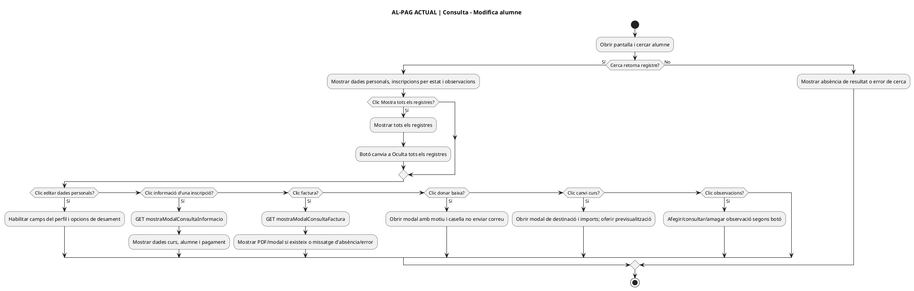

### AL-PAG · Pàgina completa — FINAL

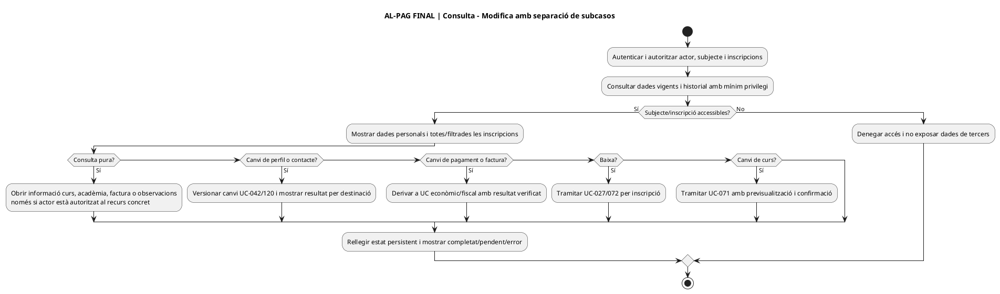

### AL-BAIXA · «Confirma la baixa» — ACTUAL vs FINAL

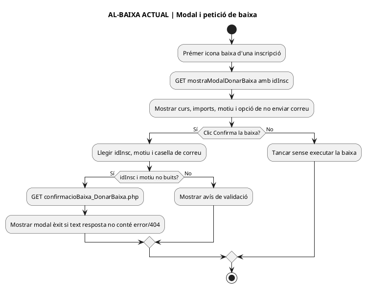

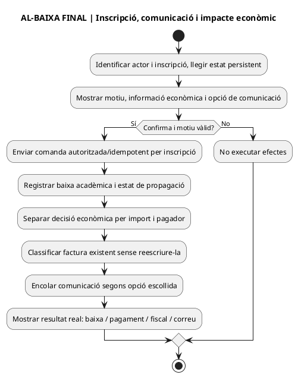

### AL-CANVI · «Previsualitza el canvi» — ACTUAL vs FINAL

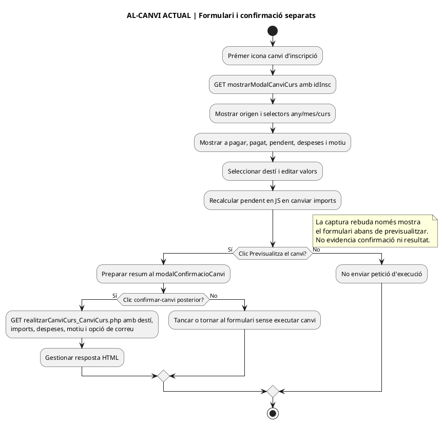

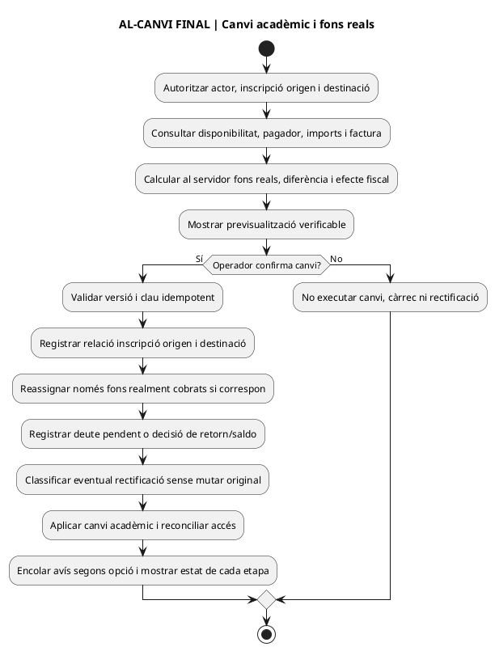

## 5. Captures i fases que FALTEN per donar per completa aquesta pàgina

Els set originals permeten reconstruir l'inventari visual principal però **no** mostren: cerca avançada oberta, edició de dades personals amb validació/guardat, accions d'editar inscripció i pagament en ús, formulari complet d'observacions, modal acadèmic accionat, previsualització posterior al botó de canvi, confirmació final, resultat/error de la baixa i del canvi, modal de factura sense document i gestió de permisos per cada acció. Cal contrastar el JS **minificat carregat** amb el codi llegible, mètodes PHP llargs de l'alumnat, autoritzacions de cada endpoint, BD i proves d'entorn. **No inferir** que l'absència de captura equival a absència de funcionalitat.

**Estat del lot visual:** inventari de set vistes i diagrames globals + dos subfluxos integrats documentalment; **NO** auditoria exhaustiva de totes les accions ni implementació. Les captures originals queden fora del repositori públic; no inventar enllaços d'imatges.

## 6. Continuació sense més captures: codi de les accions executables

**Límit de la font:** aquest apartat és lectura **estàtica del codi** que hi ha a GitHub, no una captura addicional ni un test de producció. S'ha recuperat el cos complet d'`Intranet.php` i els mètodes indicats a la taula, contrastat el JS no minificat i examinat el fitxer minificat inclòs per la pàgina. La presència al minificat dels noms de mètode i rutes següents **corrobora la correspondència d'aquests punts d'entrada**, però no acredita que l'asset servit al navegador sigui idèntic al del repositori ni que totes dues versions siguin semànticament equivalents.

| Acció | Circuit existent comprovat i punts sensibles | Diferència FINAL i test |
| --- | --- | --- |
| AL-CONSULTA · Informació d'inscripció | [`modalConsultaInformacio_resultatCerca()` L6917–7472](../../codi-drive/intranet-actual/Intranet.php#L6917-L7472): consulta `buscarInfoMostraInfo` per `idInsc`, complementa dades del curs, tutor, inscripcions i Moodle nou/antic i construeix el modal amb dades personals, acadèmiques i de pagament. El JS ofereix editar **dades de la inscripció** i **dades de pagament** per separat [L1009–1115](../../codi-drive/intranet-actual/js/alumnes-mostrar-alumne.js#L1009-L1115). | Autorització a servidor per identificador d'inscripció, estat d'origen de cada camp i resultat de Moodle; consulta no ha de modificar pagament ni factura. **T-AL-08:** ID d'una inscripció aliena, curs absent, Moodle indisponible, modal d'edició vs consulta. |
| AL-EDICIONPERSONAL · Dades personals | [`guardarDadesPersonals_resultatCerca()` L6099–6123](../../codi-drive/intranet-actual/Intranet.php#L6099-L6123): executa `updInscDadesPersCerca` amb identificador de registre; aquest mètode llegat no demostra propagació a totes les matrícules/Moodle ni actualització d'un receptor fiscal de factura emesa. | Separar contacte corrent de receptor fiscal històric; camp/actor/inscripció i destinacions traçables (UC-042/120/126). **T-AL-09:** canviar dades amb factura existent no reescriu document original. |
| AL-EDITPAG · Edició de dades de pagament al modal | [`guardarDadesPagament_modalsresultatCerca()` L7525–7571](../../codi-drive/intranet-actual/Intranet.php#L7525-L7571) passa `A_PAGAR`, `PAGAMENT`, dates, `IDPAG`, observacions, fraccionament, `FACTURA_RELACIONADA` i reclamació a una consulta `updInscDadesPagInfo` en el registre de la inscripció. **És una escriptura directa del resum llegat, no prova d'un cobrament bancari, d'un nou moviment `CHARGE` ni de l'emissió d'una factura.** | Formulari de gestió amb permís, justificació i conciliació contra diners/document real; no editar el PDF fiscal ni crear un ingrés perquè un camp canvia; UC-002/062/074/105 segons fet. **T-AL-10:** modificar `PAGAMENT` sense ingrés → no inventar transacció. |
| AL-BAIXA · Confirmar baixa individual | [`confirmaBaixa_modalDonarBaixa()` L9172–9465](../../codi-drive/intranet-actual/Intranet.php#L9172-L9465) consulta la inscripció, si `INSC CURS='1'` intenta baixa Moodle nou i després antic, inclosa aula oberta si `PERENNE='1'`; consulta altres dades, pot preparar correu al tutor, invoca [`__donarBaixaRegistreInscripcions()` L9472–9495](../../codi-drive/intranet-actual/Intranet.php#L9472-L9495), que executa `updInscBaixaCurs`, i segons la casella envia comunicació d'alumne i gestió. **Són efectes seqüencials; el mètode revisat no mostra una transacció única entre BD, Moodle i correu ni un assentament bancari.** | Distingir canvi administratiu, baixa acadèmica efectiva, missatge, deute/saldo/devolució i document fiscal; registrar fase/actor i reintentar només etapes pendents. **T-AL-11:** Moodle falla després d'alguna baixa, email falla després d'UPDATE i reintent; cap devolució automàtica implícita. |
| AL-CANVI · Realitzar canvi de curs després de confirmar | [`realitzarCanviCurs_modalCanviCurs()` L8513–9082](../../codi-drive/intranet-actual/Intranet.php#L8513-L9082) llegeix inscripció d'origen, utilitza els imports `apagarC/pagatC/despesesC` rebuts com a arguments, incorpora textos de canvi i observacions, crea una inscripció de destí amb `insertRegInscCanvi` i [L8767–8779](../../codi-drive/intranet-actual/Intranet.php#L8767-L8779), dona de baixa origen amb `updInscCanviCurs` segons estat i prova baixes Moodle en branques concretes [L8796–8888](../../codi-drive/intranet-actual/Intranet.php#L8796-L8888). **El mètode inclou `echo` de SQL i valors de la inscripció** [L8522–8546 i L8759–8765](../../codi-drive/intranet-actual/Intranet.php#L8522-L8546); no cal replicar aquestes dades privades a la documentació. Cap transacció conjunta amb Moodle/correu ni write fiscal SIF es veu en aquest mètode. | Validar destí i tots els imports/qualificació al servidor, conservar origen i destí amb correlació, conciliar fons reals per titular, preservar factura immutable i registrar cada fase; no repetir canvi per refresc/doble clic. **T-AL-12:** falla destí, fallada Moodle, petició duplicada, pagament parcial i factura de tercers. |
| AL-FACTURA · Consultar i descarregar | [`modalConsultaFactura_resultatCerca()` L9624–9653](../../codi-drive/intranet-actual/Intranet.php#L9624-L9653) busca factura relacionada i invoca `generaFactura(factura,false)` per mostrar-la en el modal; això no acredita que **el clic** emeti una factura fiscal nova. El JS [L2169–2240](../../codi-drive/intranet-actual/js/alumnes-mostrar-alumne.js#L2169-L2240) controla factura absent/error, modal i petició separada de descàrrega. | Consultar PDF/estat del document vigent amb permís de receptor i traça de descàrrega; no confondre representació HTML o PDF històric amb emissió fiscal. **T-AL-13:** factura inexistent, grup amb tercer pagador, falla generació/descàrrega, consulta repetida sense registre fiscal addicional. |

**Troballes de codi que no depenen de captures noves:**

- **Descàrrega de factura:** [JS L2224–2240](../../codi-drive/intranet-actual/js/alumnes-mostrar-alumne.js#L2224-L2240) declara callback `.done(function(res){...})` però al seu interior utilitza `resD` per comprovar error, construir URL i nom de fitxer. En el JS no minificat de tall no hi ha cap altra aparició de `resD`; en aquesta ruta això pot provocar `ReferenceError` i interrompre la descàrrega. **Verificar al minificat i navegador abans de concloure que falla al desplegament**; corregir amb resposta tipificada/variable coherent i permisos sobre l'arxiu.
- **Canvi de curs:** [JS L1543–1560](../../codi-drive/intranet-actual/js/alumnes-mostrar-alumne.js#L1543-L1560) accepta el modal si `!conté(error) || !conté(404)`: l'OR fa que n'hi hagi prou que manqui una de les dues cadenes i pot interpretar una resposta d'error com a èxit. [JS L1675–1695](../../codi-drive/intranet-actual/js/alumnes-mostrar-alumne.js#L1675-L1695) i el wrapper [`realitzarCanviCurs_CanviCurs.php` L20–37](../../codi-drive/intranet-actual/ajax/alumnes/realitzarCanviCurs_CanviCurs.php#L20-L37) envien/importen imports per GET. El cos de backend no mostra un recàlcul comercial independent dels imports aportats com a arguments abans de crear la inscripció de destí. **No afirmar que s'ha produït frau ni import incorrecte**; definir test de manipulació de petició i comparació contra valors autoritatius.
- **Baixa individual ≠ anul·lació d'edició:** `confirmaBaixa_modalDonarBaixa()` és una decisió sobre una inscripció concreta i pot efectuar baixa Moodle i `updInscBaixaCurs`. **No utilitzar-la per inferir el comportament final de l'anul·lació massiva UC-127**, on la regla confirmada és conservar inicialment les inscripcions a l'edició anul·lada mentre s'ofereix canvi d'edició o de curs.
- **Minificat existent al repositori:** [pàgina PHP L47–48](../../codi-drive/intranet-actual/alumnes-mostrar-alumne.php#L47-L48) inclou `alumnes-mostrar-alumne.min.js?ver=1.4`. El minificat del `main` conté els noms dels quatre modals, endpoints d'execució de baixa/canvi, consulta/descàrrega de factura i botons «Mostra tots els registres»; no s'ha fet comparació sintàctica completa ni prova del fitxer servit. Això **no** és justificació per deixar tota la fitxa pendent fins a noves captures.

### AL-INFO · Modal complet d'informació d'inscripció — ACTUAL / FINAL

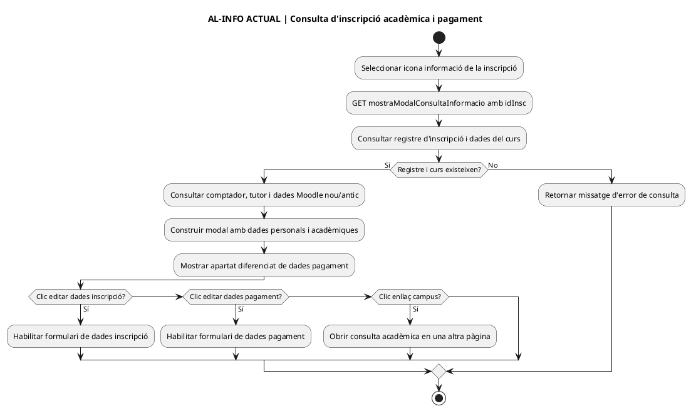

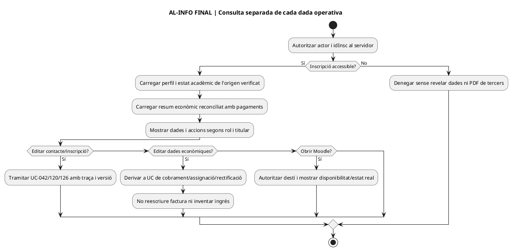

### AL-EDITPAG · Desar dades de pagament al llegat — ACTUAL / FINAL

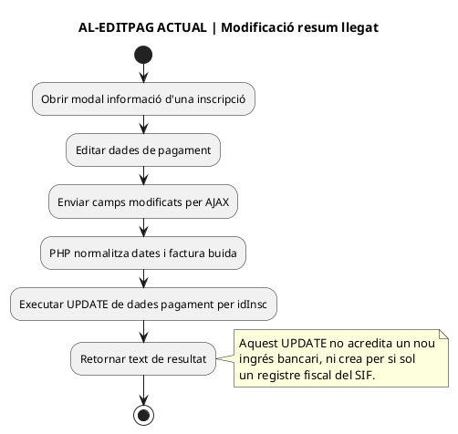

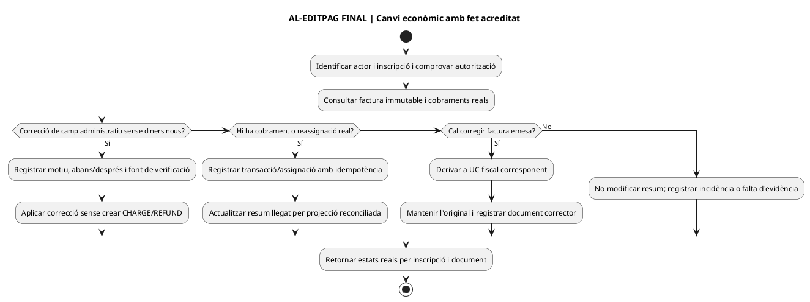

### AL-FACTURA · Consulta de factura i acció de descàrrega — ACTUAL / FINAL

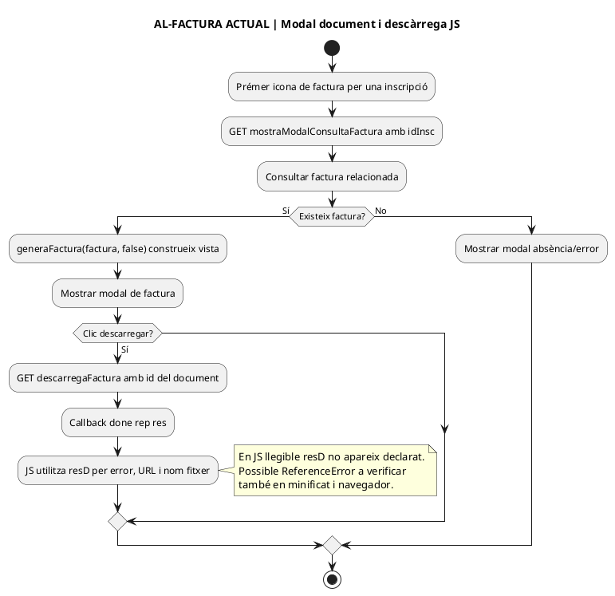

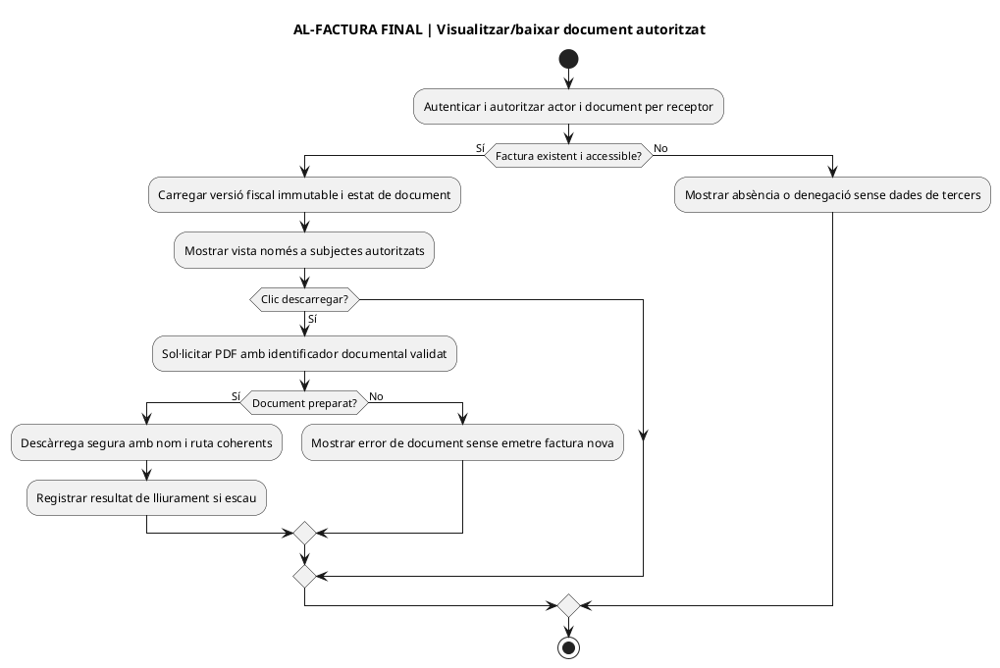

**Tancament d'aquest contrast sense captures:** mètodes d'inscripció, baixa, canvi i consulta de factura llegits al `main`; diagrames d'informació/pagament/factura afegits per completar accions de la pàgina. Encara NO s'han executat transaccions, proves de navegador, callbacks ni proves de seguretat i no es dona per fet que el servidor real executi aquesta versió del codi.

