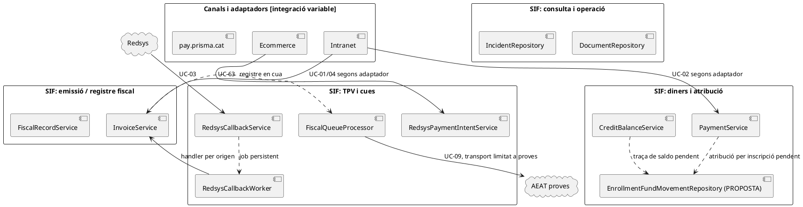
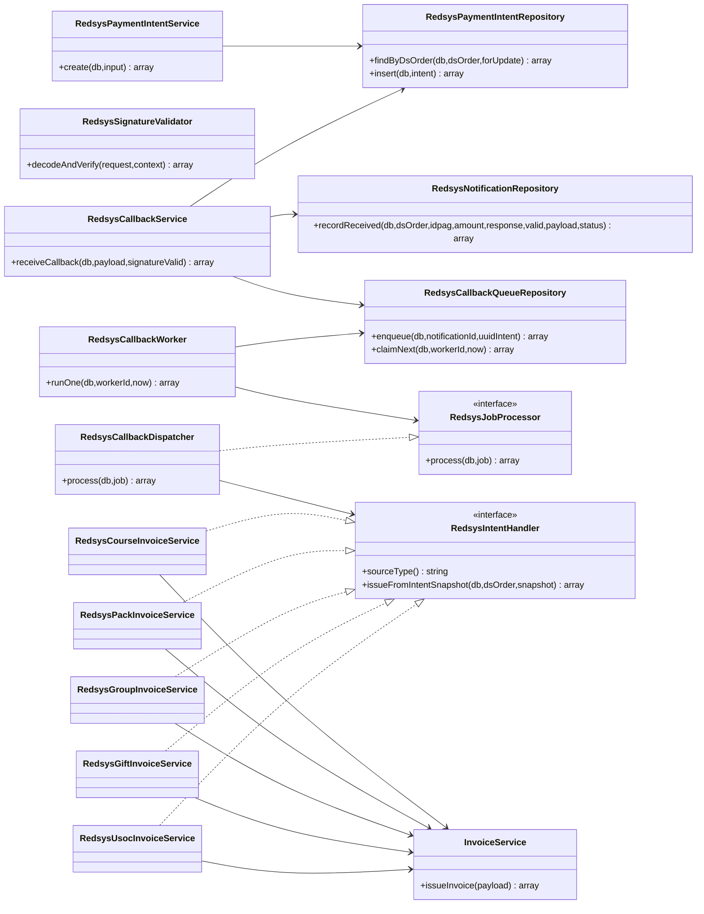
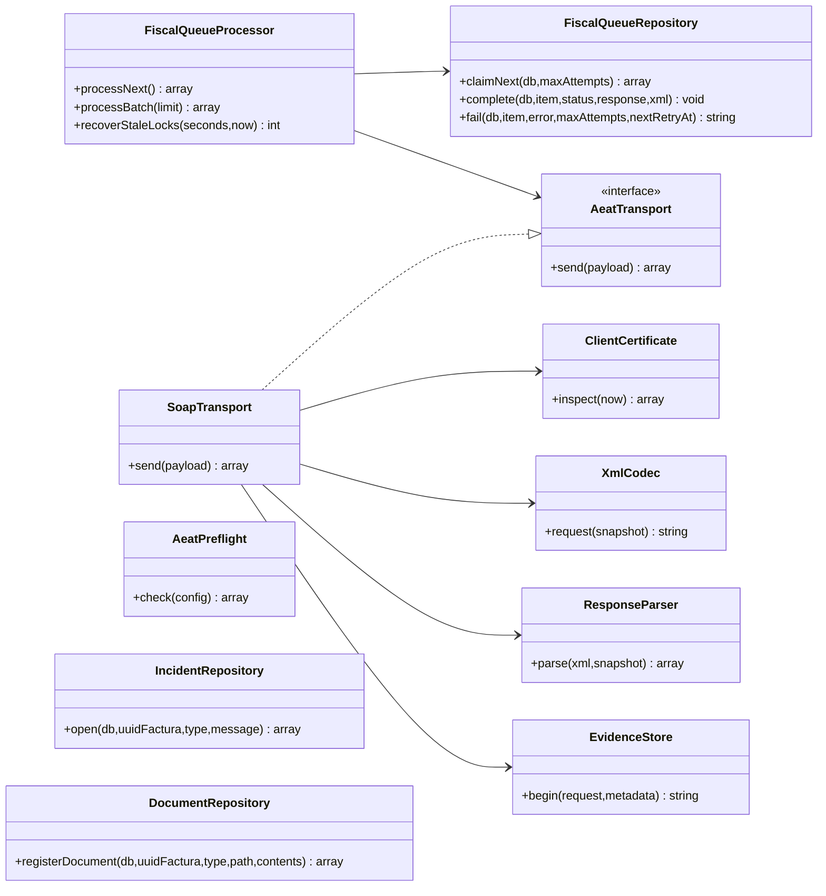
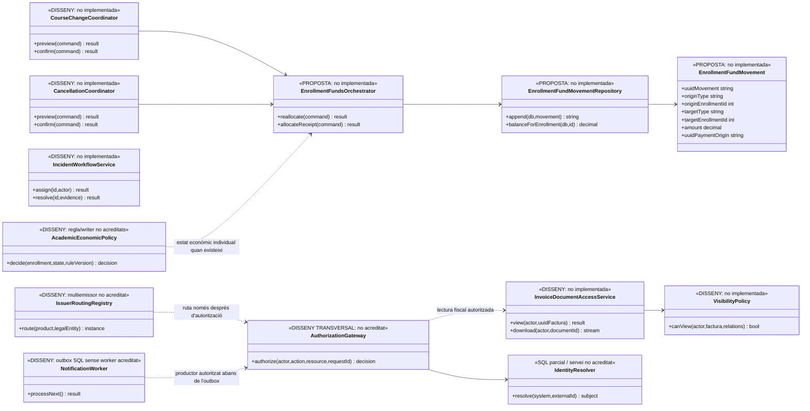

# UML transversal · Model de classes general del SIF

**Objectiu:** mantenir un únic model de classes de referència per a les fitxes individuals i evitar que cada cas d'ús inventi un sistema diferent. **Font contrastada:** fitxers PHP existents a `sif/src/` en `main` i els fluxos dels casos que s'enllacen al final. **Àmbit del document:** dependències PHP i interfícies executables; les taules SQL s'identifiquen com a persistència, **no** com si fossin automàticament entitats/classes PHP.

**Estat:** model lògic de revisió de codi, no diagrama desplegat ni prova d'integració de l'ecommerce, intranet, AEAT productiva o llegat. Quan una dependència és del disseny final i no apareix al codi, es representa **només** al diagrama de classes proposades de l'última secció.

## 1. Diagrama de paquets del sistema i casos d'ús relacionats (PlantUML)

**Precisió UML:** les fletxes puntejades de la vista de paquets signifiquen **relació funcional via dades/cua o proposta**, no una crida PHP directa: `InvoiceService` no invoca `FiscalQueueProcessor` i `RedsysCallbackService` no invoca `RedsysCallbackWorker` dins la mateixa petició HTTP. Les dependències de classes **directes** són les dels subdiagrames següents.

## 2. Classes executives del nucli de factura i correcció

**Fronteres:** UC-05 crea factura R i després vincula la rectificativa/estat de l'original en passos separats: no inventar una transacció conjunta. UC-30 i UC-31 generen **nous registres fiscals per una factura existent**, no una nova factura fiscal amb un número nou. Les responsabilitats concretes consten a [UC-01](uc-001-emetre-o-reutilitzar-factura.md), [UC-04](uc-004-emetre-factura-abans-cobrar.md), [UC-05](uc-005-rectificar-factura.md), [UC-30](uc-030-anul-lar-registre-improcedent.md) i [UC-31](uc-031-subsanar-registre.md).

## 3. Classes executives de pagament, devolució i crèdit

**Font de veritat:** `payment_transaction` és el **moviment real** `CHARGE`/`REFUND` o l'aplicació `COMPENSATION`; `payment_allocation` enllaça amb la factura. `credit_balance` és un saldo disponible. **Cap d'aquestes taules registra avui per si sola l'origen/destí quantitatiu a cada inscripció.** Consulteu [revisió dels fons per inscripció](00-revisio-moviments-inscripcions.md). Les accions d'auditoria sobre pagaments es gestionen en `payment_action_event`, diferent de l'assentament econòmic.

## 4. Classes executives de Redsys i integracions de venda

**Fases separades:** intenció UC-63 → recepció i encolat UC-03 → worker UC-03 → handler per producte UC-14/15/16/17/19a → UC-01. La creació d'una intenció no acredita pagament; el callback HTTP no emet factura; un job `PROCESSED` no implica que l'operació del llegat hagi quedat reconciliada. El model de classes no dibuixa una dependència directa fictícia entre el servei de recepció i el worker.

## 5. Classes executives de cua fiscal i consulta/operació

`SoapTransport` només accepta l'endpoint AEAT de **proves** segons el seu constructor; `AeatPreflight` comprova prerequisits locals, no una acceptació externa ni l'aptitud de producció. `DocumentRepository` registra metadades i hash, no serveix un document autoritzat. `IncidentRepository` obre incidències, no implementa tot el cicle d'assignació/resolució. [UC-09](uc-009-remetre-registre-aeat.md), [UC-07](uc-007-consultar-factura-estat-document.md), [UC-08](uc-008-gestionar-incidencia-sif.md).

## 6. Classes del **disseny pendent** (NO són el PHP actual)

Aquest últim diagrama és un **contracte de treball**, no una afirmació que hi ha classes, repositoris o migracions implementats. No s'ha creat la taula proposada `enrollment_fund_movement` en aquesta branca de documentació. Després de revisar els 142 casos, també es consideren transversals pendents l'**autorització servidor de les comandes**, la resolució d'identitat, el routing multiemissor, el worker d'outbox i la política acadèmica-econòmica. El detall i les evidències són a [Revisió transversal 142/142](00-revisio-transversal-142-casos.md).

**Contrast nominal de l'API del model general:** s'han comparat les **47 classes PHP identificades** i les **70 declaracions de mètode** que els seus subdiagrames mostren amb el codi de les classes homònimes; no hi ha cap nom de mètode absent d'aquests fitxers. Les **13 classes sense fitxer PHP homònim** són propostes/disseny pendent al diagrama final. Aquesta verificació és només **existència del nom**, no equival a validar paràmetres, tipus, visibilitat, instanciació, relacions UML, fluxos o proves d'execució. Les proves que sí estan escrites al repositori i els contrasts no coberts figuren a l'[auditoria de consistència, apartat 4](00-auditoria-consistencia-142-fitxes.md#4-què-demostren-les-proves-existents-i-quina-evidència-falta).

## 7. Traçabilitat i criteri de manteniment

- [Model de classes ja existent al projecte](../04-estat-final/31-diagrames-classes-sif.md) i [matriu transversal de diagrames](../04-estat-final/35-matriu-tracabilitat-diagrames.md).
- [Fitxes integrades i estat individual](README.md).
- Codi base a [`sif/src/Service`](../../sif/src/Service/), [`sif/src/Repository`](../../sif/src/Repository/), [`sif/src/Aeat`](../../sif/src/Aeat/) i [`sif/src/Contract`](../../sif/src/Contract/).

**Regla:** qualsevol dependència nova que es vulgui representar com a **implementada** ha de tenir un fitxer/mètode PHP i una crida real a la branca que s'estigui documentant. Les taules SQL, les pantalles de disseny i les interaccions entre processos via cua es representen separadament. Els mètodes mostrats resumeixen l'API rellevant i no pretenen ser un inventari exhaustiu de signatures.
