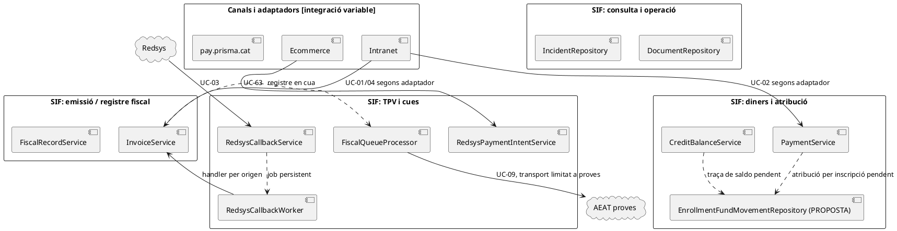
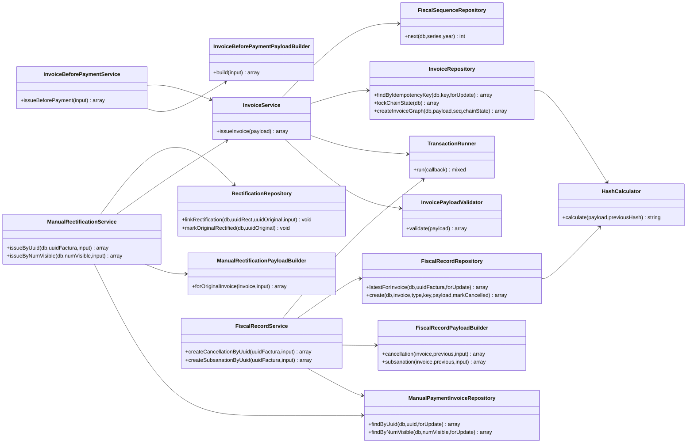
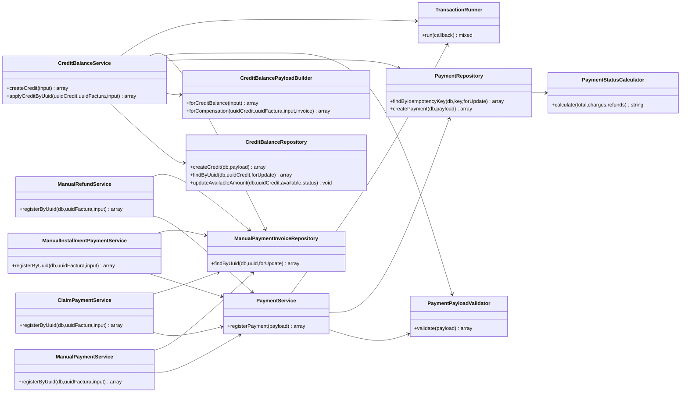
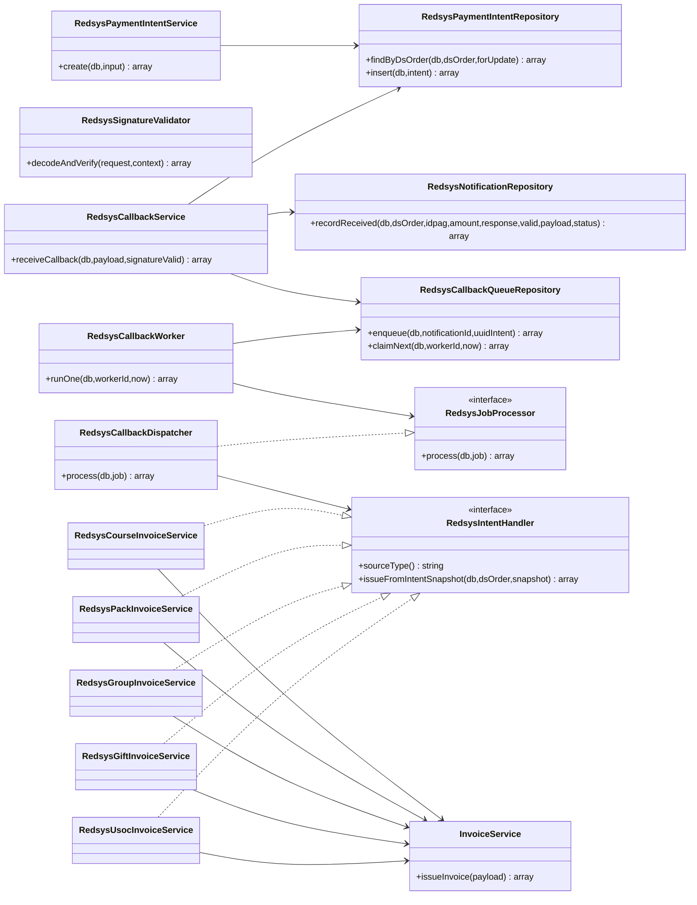
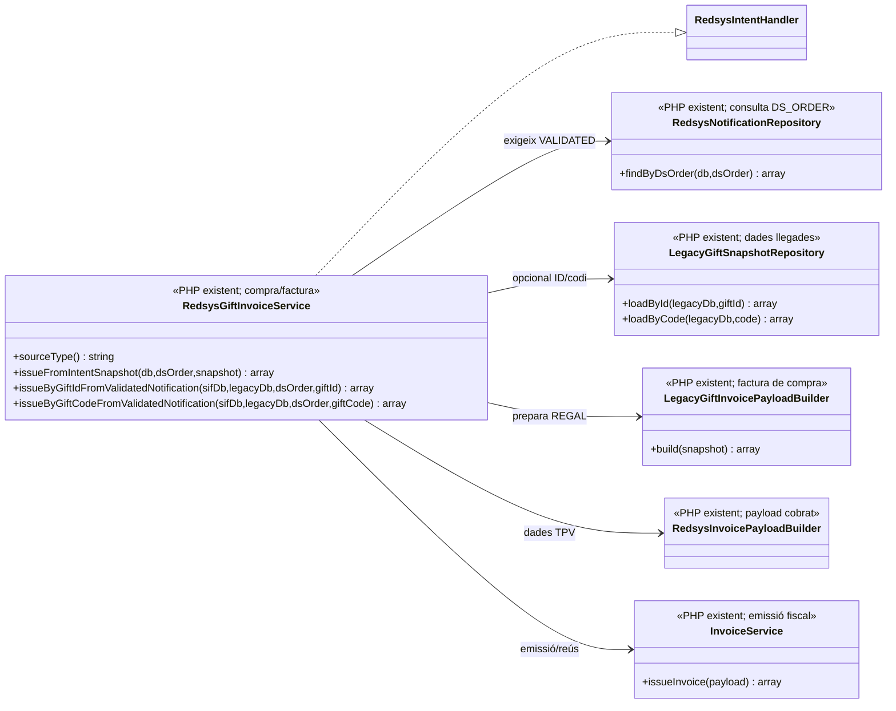
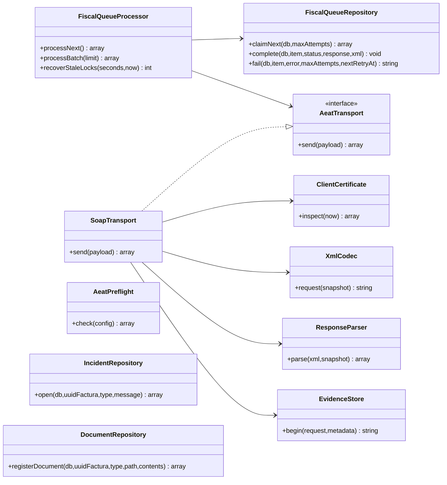
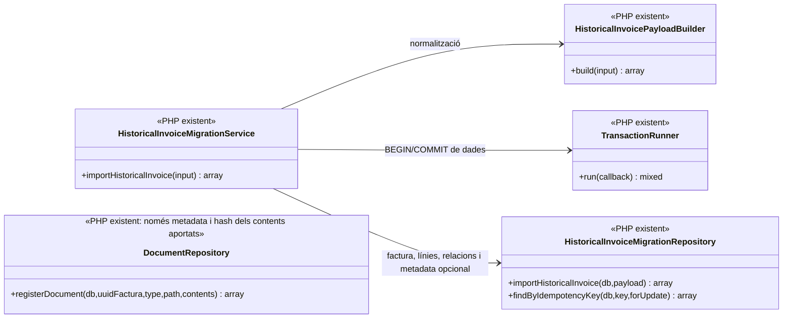
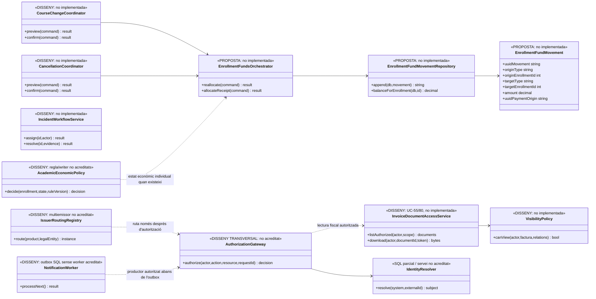
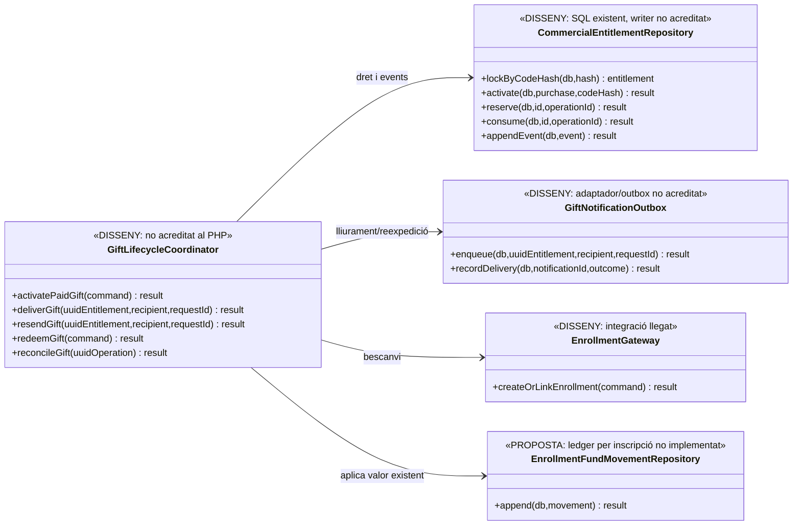
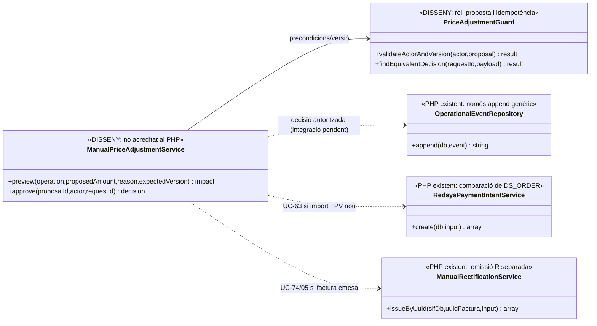

# UML transversal · Model de classes general del SIF

**Objectiu:** mantenir un únic model de classes de referència per a les fitxes individuals i evitar que cada cas d'ús inventi un sistema diferent. **Font contrastada:** fitxers PHP llegits a `sif/src/` de la branca documental `docs/uml-fitxes-integrades-2026-09-20` i els fluxos dels casos que s'enllacen al final. **Àmbit del document:** dependències PHP i interfícies executables; les taules SQL s'identifiquen com a persistència, **no** com si fossin automàticament entitats/classes PHP.

**Estat:** model lògic de revisió de codi, no diagrama desplegat ni prova d'integració de l'ecommerce, intranet, AEAT productiva o llegat. Quan una dependència és del disseny final i no apareix al codi, es representa **només** al diagrama de classes proposades de l'última secció.

## 1. Diagrama de paquets del sistema i casos d'ús relacionats (PlantUML)



**Precisió UML:** les fletxes puntejades de la vista de paquets signifiquen **relació funcional via dades/cua o proposta**, no una crida PHP directa: `InvoiceService` no invoca `FiscalQueueProcessor` i `RedsysCallbackService` no invoca `RedsysCallbackWorker` dins la mateixa petició HTTP. Les dependències de classes **directes** són les dels subdiagrames següents.

## 2. Classes executives del nucli de factura i correcció



**Fronteres:** UC-05 crea factura R i després vincula la rectificativa/estat de l'original en passos separats: no inventar una transacció conjunta. UC-30 i UC-31 generen **nous registres fiscals per una factura existent**, no una nova factura fiscal amb un número nou. Les responsabilitats concretes consten a [UC-01](uc-001-emetre-o-reutilitzar-factura.md), [UC-04](uc-004-emetre-factura-abans-cobrar.md), [UC-05](uc-005-rectificar-factura.md), [UC-30](uc-030-anul-lar-registre-improcedent.md) i [UC-31](uc-031-subsanar-registre.md).

## 3. Classes executives de pagament, devolució i crèdit



**Font de veritat:** `payment_transaction` és el **moviment real** `CHARGE`/`REFUND` o l'aplicació `COMPENSATION`; `payment_allocation` enllaça amb la factura. `credit_balance` és un saldo disponible. **Cap d'aquestes taules registra avui per si sola l'origen/destí quantitatiu a cada inscripció.** Consulteu [revisió dels fons per inscripció](00-revisio-moviments-inscripcions.md). Les accions d'auditoria sobre pagaments es gestionen en `payment_action_event`, diferent de l'assentament econòmic.

## 4. Classes executives de Redsys i integracions de venda



**Fases separades:** intenció UC-63 → recepció i encolat UC-03 → worker UC-03 → handler per producte UC-14/15/16/17/19a → UC-01. La creació d'una intenció no acredita pagament; el callback HTTP no emet factura; un job `PROCESSED` no implica que l'operació del llegat hagi quedat reconciliada. El model de classes no dibuixa una dependència directa fictícia entre el servei de recepció i el worker.

### 4.1. Subvista de classes del regal — compra PHP i frontera del dret comercial

El diagrama executiu de Redsys de l'apartat 4 mostra `RedsysGiftInvoiceService` com a handler; aquesta subvista concreta el camí **comprovat al codi de compra**, sense convertir el bescanvi o l'enviament de la targeta en mètodes existents de la classe.



**Límit verificat:** `LegacyGiftInvoicePayloadBuilder::build()` incorpora `CODI` en clar a `lines[].detail` i `gift.code`, i deriva la clau fiscal de `gift.ID`. `RedsysGiftInvoiceService` verifica `STATUS=VALIDATED` i coincidència d'import abans de delegar a `InvoiceService`; **no** crea `commercial_entitlement`, no valida el consum de codi i no lliura cap targeta. Vegeu [UC-119, activació i lliurament](uc-119-cicle-complet-regal.md#6-activació-i-comunicació-del-regal--accions-diferenciades).
## 5. Classes executives de cua fiscal i consulta/operació



`SoapTransport` només accepta l'endpoint AEAT de **proves** segons el seu constructor; `AeatPreflight` comprova prerequisits locals, no una acceptació externa ni l'aptitud de producció. `DocumentRepository` registra metadades i hash, no serveix un document autoritzat. `IncidentRepository` obre incidències, no implementa tot el cicle d'assignació/resolució. [UC-09](uc-009-remetre-registre-aeat.md), [UC-07](uc-007-consultar-factura-estat-document.md), [UC-08](uc-008-gestionar-incidencia-sif.md).

### 5.1. Subvista real de la importació de dades històriques — UC-11; bytes originals fora d'aquest PHP



**Frontera real:** `HistoricalInvoiceMigrationRepository::insertDocument()` insereix path/hash/estat declarat sense verificar físicament l'arxiu i `DocumentRepository::registerDocument()` només calcula SHA-256 del contingut **que se li passa**, no en fa la custòdia. `HistoricalInvoiceMigrationRepository` tampoc no crida `InvoiceService`, la cua AEAT ni `DocumentRepository` en importar metadades. El SQL `factura` té `UNIQUE(NUM_VISIBLE)` i `UNIQUE(TIPUS_SERIE,ANY_FACT,NUM_SEQ)` sense emissor. [UC-11](uc-011-importar-factura-historica.md), [UC-97](uc-097-consultar-historic-associacio-sl.md).

## 6. Classes del **disseny pendent** (NO són el PHP actual)



Aquest últim diagrama és un **contracte de treball**, no una afirmació que hi ha classes, repositoris o migracions implementats. No s'ha creat la taula proposada `enrollment_fund_movement` en aquesta branca de documentació. Després de revisar els 142 casos, també es consideren transversals pendents l'**autorització servidor de les comandes**, la resolució d'identitat, el routing multiemissor, el worker d'outbox i la política acadèmica-econòmica. El detall i les evidències són a [Revisió transversal 142/142](00-revisio-transversal-142-casos.md).

**Contrast nominal de l'API de l'auditoria anterior:** s'han comparat les **47 classes PHP del subconjunt inicial** i les **70 declaracions de mètode** que els seus subdiagrames mostren amb el codi de les classes homònimes; no hi ha cap nom de mètode absent d'aquests fitxers. Les **13 classes sense fitxer PHP homònim del subconjunt auditat original** eren propostes/disseny pendent; les subvistes de regal, conciliació i ajust incorporades després afegeixen altres classes expressament etiquetades `DISSENY` i **no** queden cobertes per aquell recompte inicial. Aquesta verificació **no inclou automàticament les subvistes afegides posteriorment sobre el regal, l'històric i la custòdia** i és només existència del nom, no equival a validar paràmetres, tipus, visibilitat, instanciació, relacions UML, fluxos o proves d'execució. Les proves que sí estan escrites al repositori i els contrasts no coberts figuren a l'[auditoria de consistència, apartat 4](00-auditoria-consistencia-142-fitxes.md#4-què-demostren-les-proves-existents-i-quina-evidència-falta).

### 6.1. Subvista de disseny del dret de regal, entrega i consum — NO IMPLEMENTAT

Les taules `commercial_entitlement`/`commercial_entitlement_event` existeixen com a model SQL, però els noms següents són **classes/serveis proposats** i no es poden incloure dins del nucli PHP executiu fins que tinguin codi i proves. El model permet seguir `UUID_PAYMENT` original, titular del dret, estat/versió del codi, notificació i `ID_INSC` de destí sense duplicar el cobrament.



**Fronteres de transacció:** confirmar la compra/factura no és la mateixa operació que activar el dret o lliurar el codi; enviar/reenviar una targeta tampoc no és consumir-la. Entre la BD fiscal, notificacions i el llegat no s'ha acreditat un commit distribuït. [UC-17](uc-017-comprar-regal.md), [UC-18](uc-018-bescanviar-regal.md), [UC-18a](uc-018a-regal-caducat-duplicat.md), [UC-119](uc-119-cicle-complet-regal.md).
### 6.2. Subvista única de conciliació SIF–llegat — UC-82 per lot, UC-53 per item (DISSENY)

`reconciliation_run` té `IDEMPOTENCY_KEY` única; `reconciliation_item` té UUID propi i relació amb run, però **no** clau única de discrepància semàntica dins del run. Les taules existeixen en SQL i **no** equivalen a repositoris PHP implementats. Les fitxes [UC-82](uc-082-reconciliar-sif-bd-llegada.md) i [UC-53](uc-053-detectar-resoldre-divergencies.md) comparteixen expressament **una sola classe coordinadora proposada**; no convertir `ReconciliationService` i `SifLegacyReconciliationService` en serveis redundants d'un mateix flux.


**Separació real/proposada:** les dependències `LegacySyncService → LegacySyncRepository` i el mètode `IncidentRepository::open()` consten al PHP. El coordinador, el repositori de runs/items, el guard d'autorització, la captura/versionat del llegat i el writer de resultat continuen pendents. La reconciliació no és un `UPDATE factura.TOTAL` ni una transacció distribuïda entre dues BDs.

### 6.3. Subvista de proposta i aprovació d'ajust manual — UC-94 (DISSENY amb peces PHP)



**No executar en cadena automàticament:** `OperationalEventRepository::append()` desa un event però no aprova l'import; `RedsysPaymentIntentService::create()` rebutja reusar `DS_ORDER` amb snapshot/import diferent; `ManualRectificationService` emet una factura R separada quan una classificació fiscal ho justifica. La UC-94 no té un únic commit demostrable que englobi proposta, canvi d'intenció, document fiscal, transferència i llegat.

### 6.4. Subvista transversal de job, integritat, descàrrega i històric — UC-55/80/11/97 (DISSENY)

`factura_documents` només imposa un ID únic de fila i `document_job` només una `IDEMPOTENCY_KEY` única; **no** hi ha garantia automàtica d'un document per factura/tipus/versió ni de fitxer físic disponible. El repo PHP `DocumentRepository::registerDocument()` **no** retorna `factura_documents.ID`. Les classes proposades de custòdia han de recuperar/contrastar la identitat de la metadata i els bytes abans de marcar un job com a complet.

```mermaid
classDiagram
direction LR
class DocumentWorker {
 <<DISSENY: no PHP acreditat>>
 +runOne(now) result
 +recover(jobId) result
}
class DocumentJobRepository {
 <<DISSENY: document_job SQL>>
 +enqueue(command) job
 +claimNext() job
 +complete(job,documentId,hash) result
 +fail(job,error,nextAttempt) result
}
class FiscalDocumentGenerator {
 <<DISSENY: PDF/QR/XML, no PHP acreditat>>
 +generate(snapshot,type,version) bytes
}
class PrivateDocumentStore {
 <<DISSENY: custòdia físicament verificada>>
 +writeAndVerify(bytes) key
 +readVerified(key,sha256) bytes
}
class DocumentAvailabilityService {
 <<DISSENY: no PHP acreditat>>
 +verify(uuidFactura,documentId) status
}
class HistoricalOriginalCustodyService {
 <<DISSENY: original antic, no importador PHP>>
 +attachOriginal(uuidFactura,issuer,sourceId,bytes) result
 +auditInventory(scope) report
}
class InvoiceDocumentAccessService {
 <<DISSENY: servei únic UC-55/80>>
 +listAuthorized(actor,scope) documents
 +download(actor,documentId,token) bytes
}
class VisibilityPolicy {
 <<DISSENY: autorització per actor/document>>
 +canView(actor,factura,relations) bool
}
class DocumentRepository {
 <<PHP real: metadata sense storage>>
 +registerDocument(db,uuidFactura,type,path,contents) array
}
DocumentWorker --> DocumentJobRepository : encolat/reintent
DocumentWorker --> FiscalDocumentGenerator : bytes de font fiscal
DocumentWorker --> PrivateDocumentStore : desar/verificar
DocumentWorker ..> DocumentRepository : registra metadata; recuperar ID per via addicional
HistoricalOriginalCustodyService --> PrivateDocumentStore : bytes ORIGINALS de l'arxiu llegat
HistoricalOriginalCustodyService ..> DocumentRepository : només si metadata no existent i validada
DocumentAvailabilityService --> PrivateDocumentStore : llegir i recalcular hash
InvoiceDocumentAccessService --> VisibilityPolicy : consulta per document
InvoiceDocumentAccessService --> DocumentAvailabilityService : prova de bytes
```

**Límit multiemissor:** `HistoricalOriginalCustodyService` només ha d'adjuntar l'original a la factura **unívocament** identificada. Si Associació i SL aporten dues factures amb mateix número, l'únic model `factura` actual no pot guardar-les com dues files (UNIQUE global). El model d'emissor/persistència històrica és una decisió prèvia bloquejant de [UC-97](uc-097-consultar-historic-associacio-sl.md), no una funcionalitat que la classe proposada resolgui per màgia.

## 7. Traçabilitat i criteri de manteniment

- [Model de classes ja existent al projecte](../04-estat-final/31-diagrames-classes-sif.md) i [matriu transversal de diagrames](../04-estat-final/35-matriu-tracabilitat-diagrames.md).
- [Fitxes integrades i estat individual](README.md).
- Codi base a [`sif/src/Service`](../../sif/src/Service/), [`sif/src/Repository`](../../sif/src/Repository/), [`sif/src/Aeat`](../../sif/src/Aeat/) i [`sif/src/Contract`](../../sif/src/Contract/).

**Regla:** qualsevol dependència nova que es vulgui representar com a **implementada** ha de tenir un fitxer/mètode PHP i una crida real a la branca que s'estigui documentant. Les taules SQL, les pantalles de disseny i les interaccions entre processos via cua es representen separadament. Els mètodes mostrats resumeixen l'API rellevant i no pretenen ser un inventari exhaustiu de signatures.
