# UML transversal · Model de classes general del SIF

**Objectiu:** mantenir un únic model de classes de referència per a les fitxes individuals i evitar que cada cas d'ús inventi un sistema diferent. **Font contrastada:** fitxers PHP llegits a `sif/src/` de la branca documental `docs/uml-fitxes-integrades-2026-09-20` i els fluxos dels casos que s'enllacen al final. **Àmbit del document:** dependències PHP i interfícies executables; les taules SQL s'identifiquen com a persistència, **no** com si fossin automàticament entitats/classes PHP.

**Estat:** model lògic de revisió de codi, no diagrama desplegat ni prova d'integració de l'ecommerce, intranet, AEAT productiva o llegat. Quan una dependència és del disseny final i no apareix al codi, es representa **només** al diagrama de classes proposades de l'última secció.

## 1. Diagrama de paquets del sistema i casos d'ús relacionats (PlantUML)

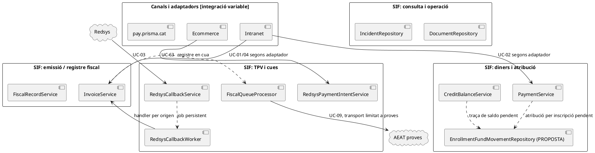

**Precisió UML:** les fletxes puntejades de la vista de paquets signifiquen **relació funcional via dades/cua o proposta**, no una crida PHP directa: `InvoiceService` no invoca `FiscalQueueProcessor` i `RedsysCallbackService` no invoca `RedsysCallbackWorker` dins la mateixa petició HTTP. Les dependències de classes **directes** són les dels subdiagrames següents.

## 2. Classes executives del nucli de factura i correcció

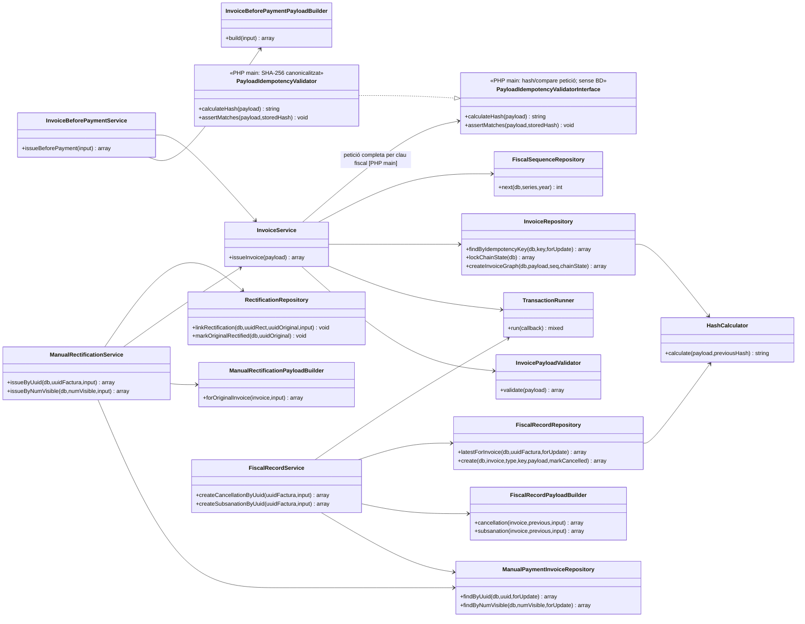

**Reús d'emissió i cobrament inicial:** `InvoiceService::existingResultWithPaymentIfPresent()` torna una factura existent per clau fiscal i, si rep bloc `payment`, **només cerca** la clau econòmica; no crida `createPayment()` en el reús. Pot retornar `ok=true` i `uuid_factura` **sense** `uuid_payment` encara que el canal hagi aportat una entrada real posterior. **A main**, `InvoiceService::existingResultWithPaymentIfPresent()` ja crida `PayloadIdempotencyValidatorInterface::assertMatches()` sobre la **petició completa** i `factura.IDEMPOTENCY_PAYLOAD_HASH` abans del reús; files anteriors a la migració sense fingerprint fallen tancat. El hash **no** prova cobertura entre dues claus fiscals diferents, i el reús d'un bloc `payment` original idèntic no crea un `CHARGE` si falta. [UC-01, seqüències 4.1–4.2](uc-001-emetre-o-reutilitzar-factura.md). 

**Fronteres:** UC-05 crea factura R i després vincula la rectificativa/estat de l'original en passos separats: no inventar una transacció conjunta. UC-30 i UC-31 generen **nous registres fiscals per una factura existent**, no una nova factura fiscal amb un número nou. Les responsabilitats concretes consten a [UC-01](uc-001-emetre-o-reutilitzar-factura.md), [UC-04](uc-004-emetre-factura-abans-cobrar.md), [UC-05](uc-005-rectificar-factura.md), [UC-30](uc-030-anul-lar-registre-improcedent.md) i [UC-31](uc-031-subsanar-registre.md).

## 3. Classes executives de pagament, devolució i crèdit

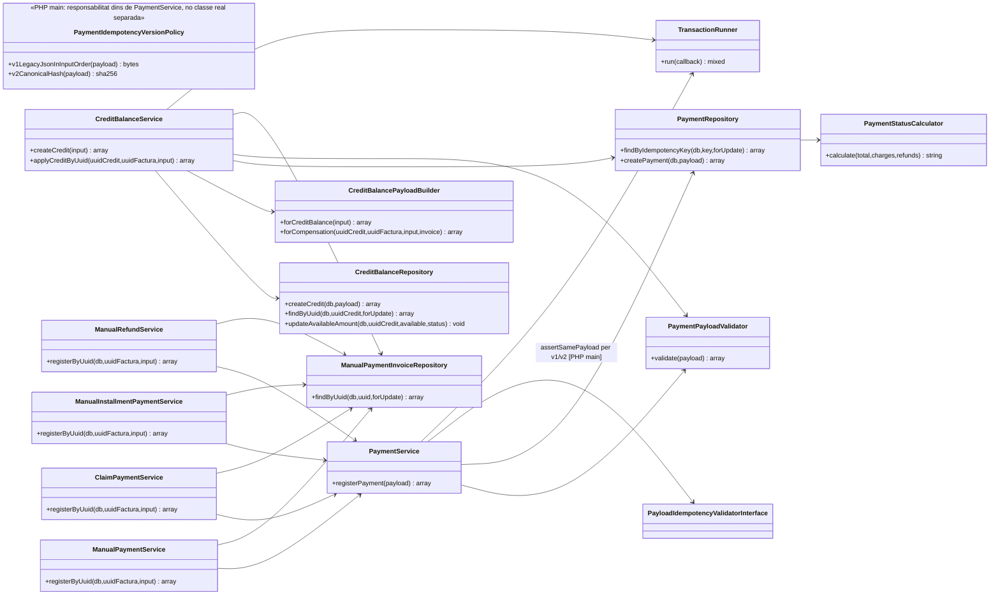

**Font de registre SIF, no prova bancària automàtica:** `payment_transaction` desa moviments etiquetats `CHARGE`/`REFUND` (el repositori els insereix amb `ESTAT=CONFIRMED`) o aplicacions `COMPENSATION`; això no verifica per si sol que el banc hagi executat l'ingrés o el retorn. `payment_allocation` enllaça el moviment amb una factura. `credit_balance` és un saldo disponible. **Cap d'aquestes taules registra avui per si sola l'origen/destí quantitatiu a cada inscripció.** Consulteu [revisió dels fons per inscripció](00-revisio-moviments-inscripcions.md). Les accions d'auditoria sobre pagaments es gestionen en `payment_action_event`, diferent de l'assentament econòmic.

### 3.1. Subvista real del registre manual de retorns — UC-28

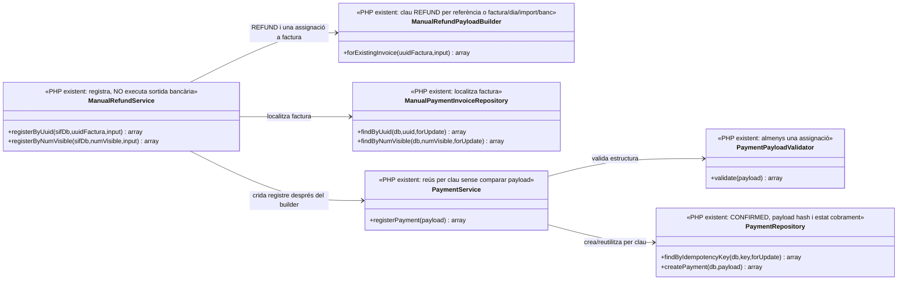

**Frontera d'evidència:** `PaymentRepository::createPayment()` insereix un `payment_transaction.ESTAT=CONFIRMED` i calcula `PAYLOAD_HASH` **sobre les dades que li envia el canal**, però `PaymentService` no consulta aquell hash per comparar una petició recuperada. `ManualRefundPayloadBuilder` no rep `UUID_PAYMENT` original, titular del retorn ni confirmació bancària. Amb `reference`, la clau de devolució no incorpora factura/import; sense `reference`, dos retorns reals coincidents en factura/dia/import/banc compartirien clau. **A més**, `ManualRefundService::registerForInvoice()` afegeix al resultat el `uuid_factura` i `num_visible` de la **factura sol·licitada** fins i tot si `PaymentService` ha reutilitzat per aquella clau un `UUID_PAYMENT` assignat a una altra factura: el retorn de l'API pot barrejar `UUID_PAYMENT_A` amb `UUID_FACTURA_B`. La seqüència concreta consta a [UC-28, 4.3a](uc-028-registrar-devolucio.md). [UC-28](uc-028-registrar-devolucio.md).

### 3.2. Subvista real del reús de pagament manual entre factures — UC-02; mateixa identitat econòmica, diferents destins

```mermaid
classDiagram
direction LR
class ManualPaymentService {
 <<PHP: afegeix al resultat factura de petició actual>>
 +registerByUuid(sifDb,uuidFactura,input) array
 +registerByNumVisible(sifDb,numVisible,input) array
}
class ManualPaymentPayloadBuilder {
 <<PHP: reference dóna clau sense factura/import>>
 +forExistingInvoice(uuidFactura,input) array
}
class ManualPaymentInvoiceRepository {
 <<PHP: cerca factura sol·licitada>>
 +findByUuid(db,uuid,forUpdate) array
 +findByNumVisible(db,numVisible,forUpdate) array
}
class PaymentService {
 <<PHP: reús per clau, sense comprovar allocation>>
 +registerPayment(payload) array
}
class PaymentRepository {
 <<PHP: crea movement + allocation només en alta>>
 +findByIdempotencyKey(db,key,forUpdate) array
 +createPayment(db,payload) array
}
ManualPaymentService --> ManualPaymentInvoiceRepository : factura demanada
ManualPaymentService --> ManualPaymentPayloadBuilder : CHARGE assignat a factura demanada
ManualPaymentService --> PaymentService : registerPayment
PaymentService --> PaymentRepository : cerca per K; si existeix no insereix allocation nova
```

**Risc compartit amb la devolució:** `ManualPaymentPayloadBuilder` produeix `TRANSFERENCIA|REF:<referència>` sense factura/import. Si la referència ja va crear `UUID_PAYMENT_A` amb assignació a factura A, `PaymentService` recupera aquest UUID en una petició posterior per B i **no afegeix** l'assignació B. `ManualPaymentService::registerForInvoice()` retorna aquell `UUID_PAYMENT_A` però sobreescriu `uuid_factura` amb B, de manera que la resposta pot semblar un cobrament vàlid de B sense que la BD l'hagi imputat. La mateixa forma de resposta contradictòria pot produir-se amb `ManualRefundService`, però els efectes econòmics `CHARGE` i `REFUND` són diferents i no s'han de barrejar. [UC-02, seqüència 5.3](uc-002-registrar-cobrament-factura.md); [UC-28, seqüència 4.3a](uc-028-registrar-devolucio.md).

### 3.3. Subvista real de fraccions i reclamacions — UC-23/24, dues claus que no acrediten l'event extern

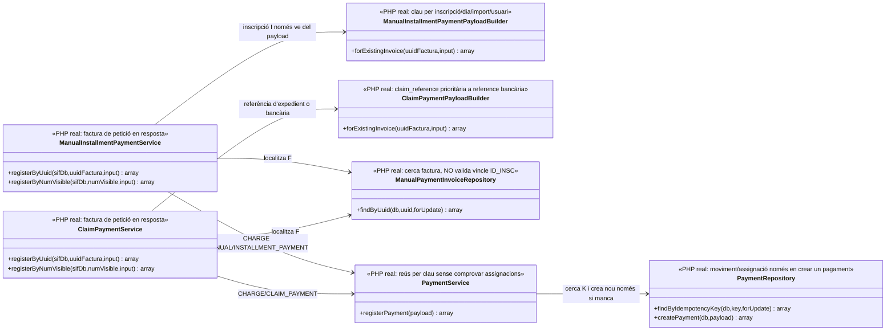

**Límits exactes:** `ManualInstallmentPaymentPayloadBuilder` desa `reference` en el payload si s'aporta, però **no** la incorpora a la clau; la clau tampoc inclou `UUID_FACTURA`, ni el constructor comprova `fact_rels`. `ClaimPaymentPayloadBuilder` tria `claim_reference`/variants **abans** de `reference`; si aquesta clau identifica l'expedient i no l'entrada bancària, dos pagaments parcials legítims del mateix expedient poden col·lidir. **A més**, el valor seleccionat entra a `payload['reference']` i `PaymentRepository::createPayment()` el desa a `payment_transaction.REFERENCIA_BANCARIA`: un identificador intern de reclamació pot quedar registrat falsament com a referència bancària. `created_by` forma part del payload que es passa al repositori, però no s'escriu en una columna d'actor pròpia del moviment. Una mateixa entrada bancària registrada per UC-22 i després UC-24/23 pot generar **dues claus diferents i dos CHARGE** perquè `PaymentService` només deduplica per la clau rebuda. Els dos serveis manuals sobreescriuen els camps de factura del resultat després de recuperar el `UUID_PAYMENT`, amb risc de resposta contradictòria entre factures. [UC-23](uc-023-registrar-fraccio.md) i [UC-24](uc-024-registrar-cobrament-reclamacio.md).

### 3.4. Subvista real d'invariants monetaris en el registre genèric — UC-02/56/105

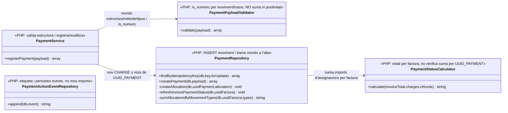

**Invariant absent al codi:** `PaymentPayloadValidator` exigeix `is_numeric(amount)` i `is_numeric(allocation.amount)` però no els exigeix **positius** ni comprova `SUM(allocations) <= amount`. `PaymentRepository::createPayment()` persisteix cada tram i recalcula `ESTAT_COBRAMENT` **per factura** sense limitar la suma de trams al nominal de l'ingrés. La BD bàsica té FKs però cap `CHECK` de positivitat ni límit agregat en `payment_allocation`. Per tant, un únic P/100 amb F1/80 i F2/80 pot atribuir 160 € mentre cada factura té un estat local aparentment coherent; un tram negatiu podria modificar l'estat sense un `REFUND` bancari ni una reversió amb història. `PaymentActionEventRepository` accepta `REALLOCATE/UNALLOCATE/SPLIT_ALLOCATION`, **no** implementa canvi real de trams. [UC-02, secció 5.5](uc-002-registrar-cobrament-factura.md); [UC-56, 4.2–4.3](uc-056-cercar-assignar-cobrament.md); [UC-105, 4.1–4.3](uc-105-reassignar-repartir-pagament.md).


### 3.5. Subvista de main: hash de petició fiscal, pagament V1/V2 i integritat de cua — NO equivalència de hash Redsys

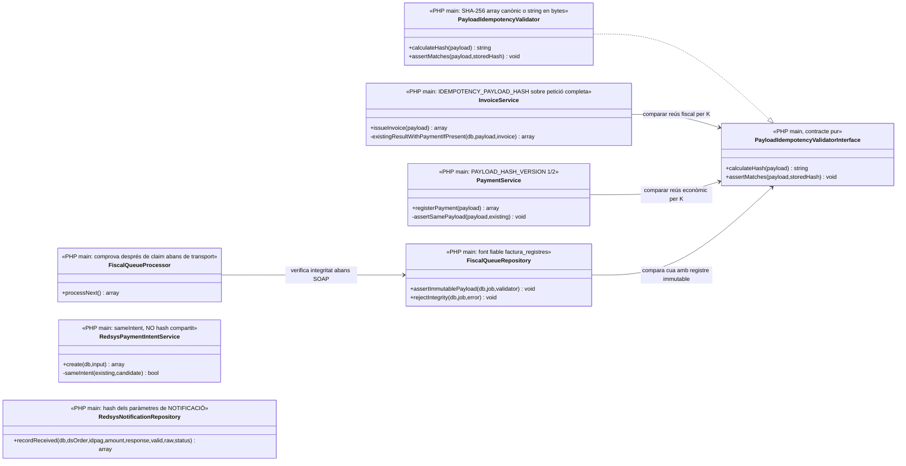

**No confondre quatre payloads:** (1) la petició completa a InvoiceService i el seu IDEMPOTENCY_PAYLOAD_HASH per clau d'emissió; (2) el payload complet a PaymentService i PAYLOAD_HASH_VERSION per clau de moviment; (3) el payload fiscal immutabilitzat a factura_registres i el HASH_FACT encadenat que FiscalQueueRepository ja contrasta amb la cua a main; (4) el SHA-256 dels bytes Ds_MerchantParameters de la **notificació** Redsys a redsys_notifications. El servei d'intenció Redsys **no** guarda encara un hash propi ni fa servir el validador compartit, i la signatura **sortint** del formulari correspon a l'adaptador web no acreditat, no a RedsysPaymentIntentService. El guard SQL V1/V2 d'un pagament per K no prova la identitat externa entre **dues claus** diferents. [UC-01](uc-001-emetre-o-reutilitzar-factura.md), [UC-02](uc-002-registrar-cobrament-factura.md), [UC-03](uc-003-processar-cobrament-redsys-asincron.md), [UC-63](uc-063-crear-intencio-redsys.md), [UC-77](uc-077-operar-enviament-aeat-retry-dead-letter.md).

## 4. Classes executives de Redsys i integracions de venda

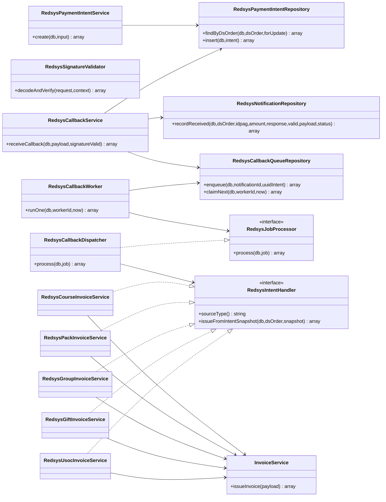

**Fases separades:** intenció UC-63 → recepció i encolat UC-03 → worker UC-03 → handler per producte UC-14/15/16/17/19a → UC-01. La creació d'una intenció no acredita pagament; el callback HTTP no emet factura; un job `PROCESSED` no implica que l'operació del llegat hagi quedat reconciliada. El model de classes no dibuixa una dependència directa fictícia entre el servei de recepció i el worker.

### 4.1. Subvista de classes del regal — compra PHP i frontera del dret comercial

El diagrama executiu de Redsys de l'apartat 4 mostra `RedsysGiftInvoiceService` com a handler; aquesta subvista concreta el camí **comprovat al codi de compra**, sense convertir el bescanvi o l'enviament de la targeta en mètodes existents de la classe.

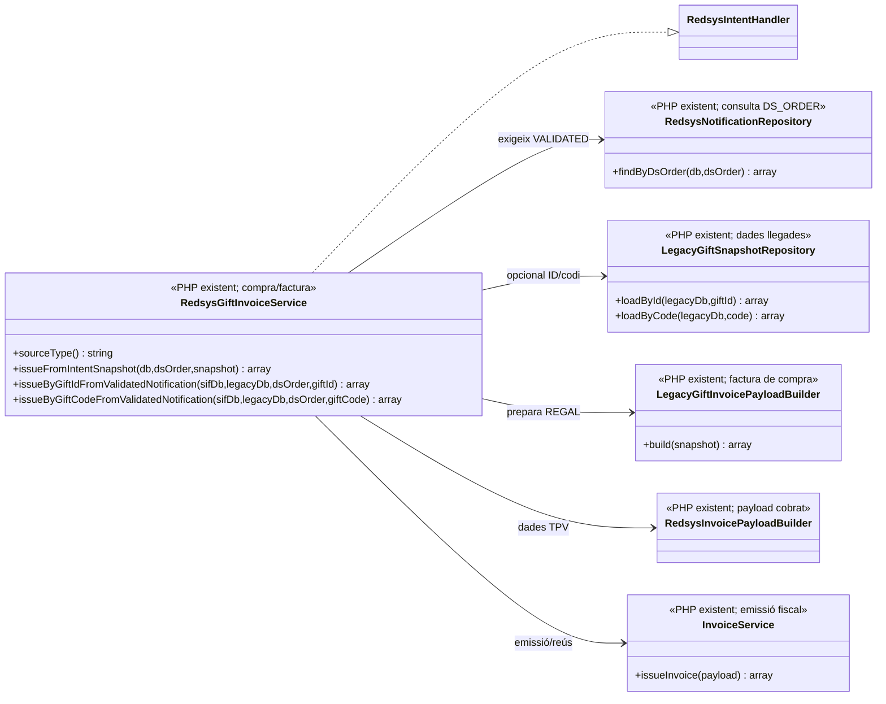

**Límit verificat:** `LegacyGiftInvoicePayloadBuilder::build()` incorpora `CODI` en clar a `lines[].detail` i `gift.code`, i deriva la clau fiscal de `gift.ID`. `RedsysGiftInvoiceService` verifica `STATUS=VALIDATED` i coincidència d'import abans de delegar a `InvoiceService`; **no** crea `commercial_entitlement`, no valida el consum de codi i no lliura cap targeta. Vegeu [UC-119, activació i lliurament](uc-119-cicle-complet-regal.md#6-activació-i-comunicació-del-regal--accions-diferenciades).
### 4.2. Subvista executable de doble factura USOC — UC-19a/19b

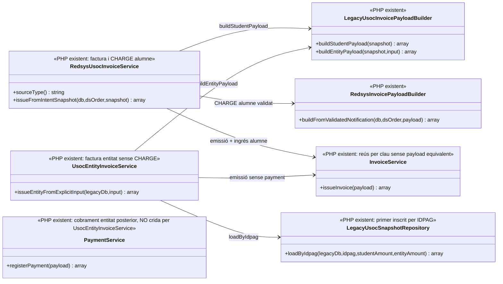

**Fronteres verificades:** `UsocEntityInvoiceService` només comprova `student_invoice_uuid` no buit i no rep la BD SIF per verificar-lo; `LegacyUsocSnapshotRepository` fa `WHERE IDPAG=? ORDER BY ID LIMIT 1`, sense seleccionar un `ID_INSC` exacte. La clau entitat de `LegacyUsocInvoicePayloadBuilder` inclou inscripció i UUID de factura alumne, **no import ni receptor**; `InvoiceService` retorna una factura existent per clau sense comparar-ne el contingut nou. `PaymentService` registra el cobrament real d'entitat més tard i no és una dependència de l'emissor. [UC-19b](uc-019b-facturar-part-entitat-usoc.md).

### 4.3. Subvista executable de cua Redsys: reservar i marcar un job no són un únic lock de negoci — UC-03/52

```mermaid
classDiagram
direction LR
class RedsysCallbackWorker {
 <<PHP real: claim, process, mark>>
 +runOne(db,workerId,now) array
}
class RedsysCallbackQueueRepository {
 <<PHP real: marques filtren ID i STATUS, NO propietari>>
 +recoverStaleLocks(db,now) int
 +claimNext(db,workerId,now) array
 +markProcessed(db,id,result,now) void
 +markRetry(db,id,availableAt,error) void
 +markIncident(db,id,error) void
}
class RedsysJobProcessor {
 <<interface>>
 +process(db,job) array
}
class RedsysCallbackDispatcher {
 <<PHP real: processador del job>>
 +process(db,job) array
}
class InvoiceService {
 <<PHP real: emissió/reús i payment inicial opcional>>
 +issueInvoice(payload) array
}
class IncidentRepository {
 <<PHP real: error, no transacció conjunta automàtica>>
 +open(db,uuidFactura,type,message) array
}
RedsysCallbackWorker --> RedsysCallbackQueueRepository : recoverStaleLocks + claimNext + marques terminals
RedsysCallbackWorker --> RedsysJobProcessor : process fora transacció del claim
RedsysCallbackWorker --> IncidentRepository : obriment d'incidència després de markIncident
RedsysCallbackDispatcher ..|> RedsysJobProcessor
RedsysCallbackDispatcher ..> InvoiceService : via handler específic; NO crida directa
```

**Frontera de propietat i completitud:** `claimNext()` fa `BEGIN/SELECT FOR UPDATE/UPDATE PROCESSING,LOCKED_BY,ATTEMPTS/COMMIT` abans del handler. `recoverStaleLocks()` reobre després de 15 min fins i tot si el primer worker encara és viu. `markProcessed/markRetry/markIncident` comproven `ID + STATUS=PROCESSING`, **no** `LOCKED_BY` o generació: una execució A antiga pot escriure mentre B té el job recuperat. `runOne()` passa a `markProcessed()` qualsevol array retornat per `RedsysJobProcessor`, sense exigir `ok`, UUID de factura o de pagament; el repositori desa els UUIDs opcionals com a `NULL`. `PROCESSED_AT` rep l'instant `now` del començament de `runOne`. [UC-52, seccions 4.1–4.4](uc-052-operar-cua-redsys.md), [UC-03, secció 5.1](uc-003-processar-cobrament-redsys-asincron.md).

## 5. Classes executives de cua fiscal i consulta/operació

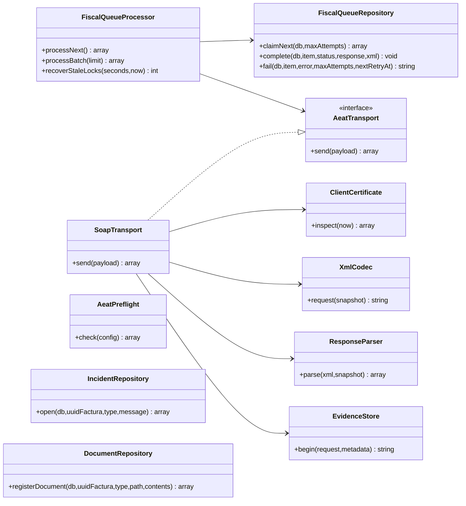

`SoapTransport` només accepta l'endpoint AEAT de **proves** segons el seu constructor; `AeatPreflight` comprova prerequisits locals, no una acceptació externa ni l'aptitud de producció. `DocumentRepository` registra metadades i hash, no serveix un document autoritzat. `IncidentRepository` obre incidències, no implementa tot el cicle d'assignació/resolució. [UC-09](uc-009-remetre-registre-aeat.md), [UC-07](uc-007-consultar-factura-estat-document.md), [UC-08](uc-008-gestionar-incidencia-sif.md).

### 5.0. Subvista real de les transicions de cua fiscal — UC-09/54

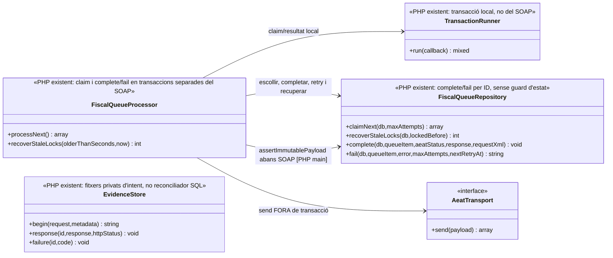

**Frontera de propietat:** `claimNext()` posa `PROCESSING`, incrementa `ATTEMPTS` i `LOCKED_AT` però no desa `LOCKED_BY` ni generació; `complete()` i `fail()` actualitzen la tasca **per ID, sense filtrar STATUS=PROCESSING ni titular del claim**. La recuperació d'un lock pot fer que A i B processin el mateix registre alhora; A pot marcar `SENT` i B posteriorment `DEAD_LETTER/ERROR` malgrat una resposta `ACCEPTED` anterior. `FiscalQueueProcessor::processNext()` també tracta l'excepció de `complete()` per la mateixa via `failure()` que els errors de SOAP: una resposta externa ja rebuda pot quedar representada com a fallada local. `EvidenceStore` conserva fitxers privats de transport, però el processor no escriu ni concilia automàticament una fila d'intent correlacionada per generació. [UC-09, 4.2–4.3](uc-009-remetre-registre-aeat.md); [UC-54, 4.1–4.3](uc-054-operar-cua-fiscal-respostes.md).

### 5.1. Subvista real de la importació de dades històriques — UC-11; bytes originals fora d'aquest PHP

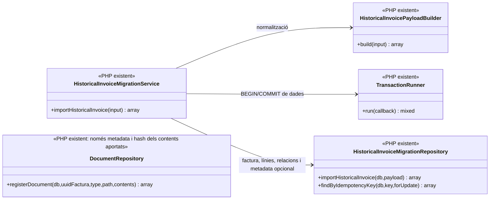

**Frontera real:** `HistoricalInvoiceMigrationRepository::insertDocument()` insereix path/hash/estat declarat sense verificar físicament l'arxiu i `DocumentRepository::registerDocument()` només calcula SHA-256 del contingut **que se li passa**, no en fa la custòdia. `HistoricalInvoiceMigrationRepository` tampoc no crida `InvoiceService`, la cua AEAT ni `DocumentRepository` en importar metadades. El SQL `factura` té `UNIQUE(NUM_VISIBLE)` i `UNIQUE(TIPUS_SERIE,ANY_FACT,NUM_SEQ)` sense emissor. [UC-11](uc-011-importar-factura-historica.md), [UC-97](uc-097-consultar-historic-associacio-sl.md).

## 6. Classes del **disseny pendent** (NO són el PHP actual)

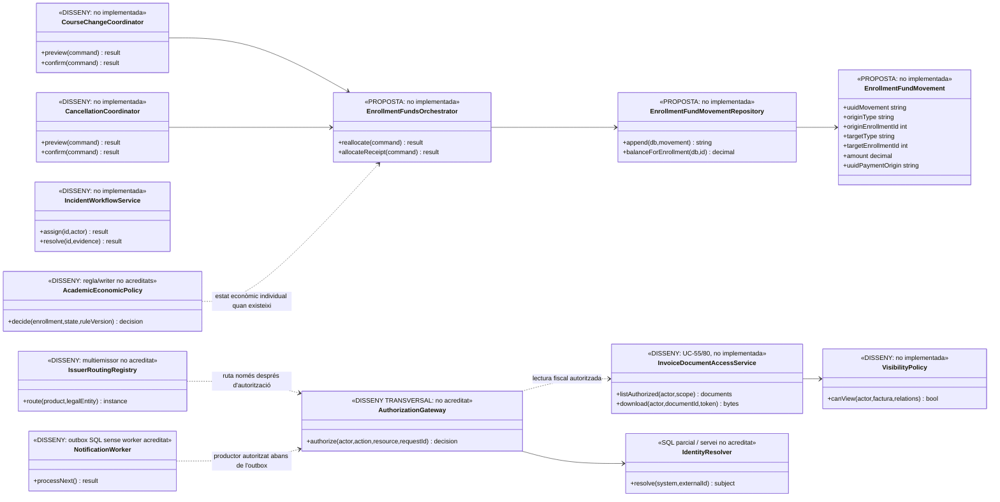

Aquest últim diagrama és un **contracte de treball**, no una afirmació que hi ha classes, repositoris o migracions implementats. No s'ha creat la taula proposada `enrollment_fund_movement` en aquesta branca de documentació. Després de revisar els 142 casos, també es consideren transversals pendents l'**autorització servidor de les comandes**, la resolució d'identitat, el routing multiemissor, el worker d'outbox i la política acadèmica-econòmica. El detall i les evidències són a [Revisió transversal 142/142](00-revisio-transversal-142-casos.md).

**Contrast nominal de l'API de l'auditoria anterior:** s'han comparat les **47 classes PHP del subconjunt inicial** i les **70 declaracions de mètode** que els seus subdiagrames mostren amb el codi de les classes homònimes; no hi ha cap nom de mètode absent d'aquests fitxers. Les **13 classes sense fitxer PHP homònim del subconjunt auditat original** eren propostes/disseny pendent; les subvistes de regal, conciliació, ajust, històric, custòdia i USOC incorporades després afegeixen altres classes expressament etiquetades `DISSENY` i **no** queden cobertes per aquell recompte inicial. Aquesta verificació **no inclou automàticament les subvistes afegides posteriorment sobre el regal, l'històric, la custòdia i USOC** i és només existència del nom, no equival a validar paràmetres, tipus, visibilitat, instanciació, relacions UML, fluxos o proves d'execució. Les proves que sí estan escrites al repositori i els contrasts no coberts figuren a l'[auditoria de consistència, apartat 4](00-auditoria-consistencia-142-fitxes.md#4-què-demostren-les-proves-existents-i-quina-evidència-falta).

### 6.1. Subvista de disseny del dret de regal, entrega i consum — NO IMPLEMENTAT

Les taules `commercial_entitlement`/`commercial_entitlement_event` existeixen com a model SQL, però els noms següents són **classes/serveis proposats** i no es poden incloure dins del nucli PHP executiu fins que tinguin codi i proves. El model permet seguir `UUID_PAYMENT` original, titular del dret, estat/versió del codi, notificació i `ID_INSC` de destí sense duplicar el cobrament.

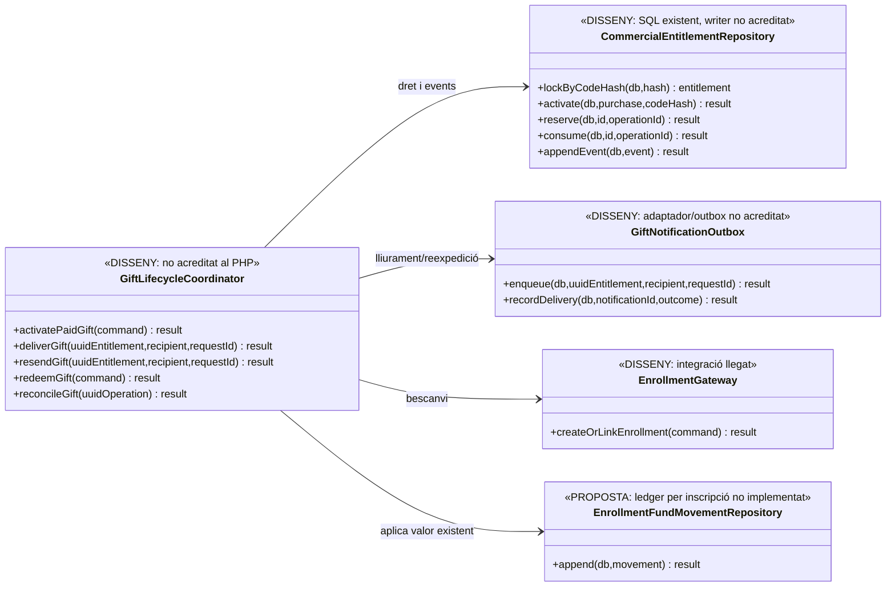

**Fronteres de transacció:** confirmar la compra/factura no és la mateixa operació que activar el dret o lliurar el codi; enviar/reenviar una targeta tampoc no és consumir-la. Entre la BD fiscal, notificacions i el llegat no s'ha acreditat un commit distribuït. [UC-17](uc-017-comprar-regal.md), [UC-18](uc-018-bescanviar-regal.md), [UC-18a](uc-018a-regal-caducat-duplicat.md), [UC-119](uc-119-cicle-complet-regal.md).
### 6.2. Subvista única de conciliació SIF–llegat — UC-82 per lot, UC-53 per item (DISSENY)

`reconciliation_run` té `IDEMPOTENCY_KEY` única; `reconciliation_item` té UUID propi i relació amb run, però **no** clau única de discrepància semàntica dins del run. Les taules existeixen en SQL i **no** equivalen a repositoris PHP implementats. Les fitxes [UC-82](uc-082-reconciliar-sif-bd-llegada.md) i [UC-53](uc-053-detectar-resoldre-divergencies.md) comparteixen expressament **una sola classe coordinadora proposada**; no convertir `ReconciliationService` i `SifLegacyReconciliationService` en serveis redundants d'un mateix flux.

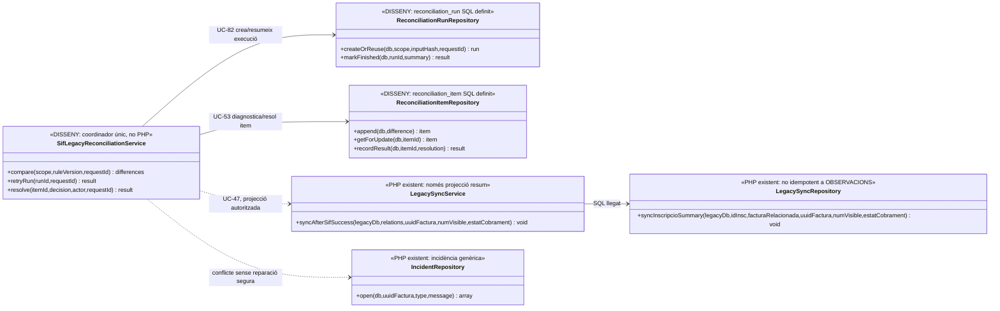

**Separació real/proposada:** les dependències `LegacySyncService → LegacySyncRepository` i el mètode `IncidentRepository::open()` consten al PHP. El coordinador, el repositori de runs/items, el guard d'autorització, la captura/versionat del llegat i el writer de resultat continuen pendents. La reconciliació no és un `UPDATE factura.TOTAL` ni una transacció distribuïda entre dues BDs.

### 6.3. Subvista de proposta i aprovació d'ajust manual — UC-94 (DISSENY amb peces PHP)

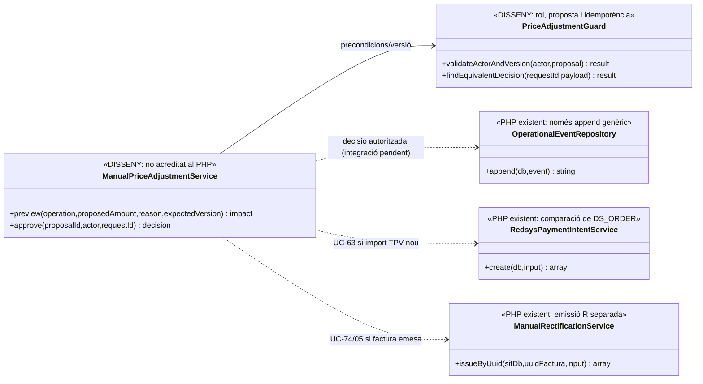

**No executar en cadena automàticament:** `OperationalEventRepository::append()` desa un event però no aprova l'import; `RedsysPaymentIntentService::create()` rebutja reusar `DS_ORDER` amb snapshot/import diferent; `ManualRectificationService` emet una factura R separada quan una classificació fiscal ho justifica. La UC-94 no té un únic commit demostrable que englobi proposta, canvi d'intenció, document fiscal, transferència i llegat.

### 6.4. Subvista transversal de job, integritat, descàrrega i històric — UC-55/80/11/97 (DISSENY)

`factura_documents` només imposa un ID únic de fila i `document_job` només una `IDEMPOTENCY_KEY` única; **no** hi ha garantia automàtica d'un document per factura/tipus/versió ni de fitxer físic disponible. El repo PHP `DocumentRepository::registerDocument()` **no** retorna `factura_documents.ID`. Les classes proposades de custòdia han de recuperar/contrastar la identitat de la metadata i els bytes abans de marcar un job com a complet.

```mermaid
classDiagram
direction LR
class DocumentWorker {
 <<DISSENY: no PHP acreditat>>
 +runOne(now) result
 +recover(jobId) result
}
class DocumentJobRepository {
 <<DISSENY: document_job SQL>>
 +enqueue(command) job
 +claimNext() job
 +complete(job,documentId,hash) result
 +fail(job,error,nextAttempt) result
}
class FiscalDocumentGenerator {
 <<DISSENY: PDF/QR/XML, no PHP acreditat>>
 +generate(snapshot,type,version) bytes
}
class PrivateDocumentStore {
 <<DISSENY: custòdia físicament verificada>>
 +writeAndVerify(bytes) key
 +readVerified(key,sha256) bytes
}
class DocumentAvailabilityService {
 <<DISSENY: no PHP acreditat>>
 +verify(uuidFactura,documentId) status
}
class HistoricalOriginalCustodyService {
 <<DISSENY: original antic, no importador PHP>>
 +attachOriginal(uuidFactura,issuer,sourceId,bytes) result
 +auditInventory(scope) report
}
class InvoiceDocumentAccessService {
 <<DISSENY: servei únic UC-55/80>>
 +listAuthorized(actor,scope) documents
 +download(actor,documentId,token) bytes
}
class VisibilityPolicy {
 <<DISSENY: autorització per actor/document>>
 +canView(actor,factura,relations) bool
}
class DocumentRepository {
 <<PHP real: metadata sense storage>>
 +registerDocument(db,uuidFactura,type,path,contents) array
}
DocumentWorker --> DocumentJobRepository : encolat/reintent
DocumentWorker --> FiscalDocumentGenerator : bytes de font fiscal
DocumentWorker --> PrivateDocumentStore : desar/verificar
DocumentWorker ..> DocumentRepository : registra metadata; recuperar ID per via addicional
HistoricalOriginalCustodyService --> PrivateDocumentStore : bytes ORIGINALS de l'arxiu llegat
HistoricalOriginalCustodyService ..> DocumentRepository : només si metadata no existent i validada
DocumentAvailabilityService --> PrivateDocumentStore : llegir i recalcular hash
InvoiceDocumentAccessService --> VisibilityPolicy : consulta per document
InvoiceDocumentAccessService --> DocumentAvailabilityService : prova de bytes
```

**Límit multiemissor:** `HistoricalOriginalCustodyService` només ha d'adjuntar l'original a la factura **unívocament** identificada. Si Associació i SL aporten dues factures amb mateix número, l'únic model `factura` actual no pot guardar-les com dues files (UNIQUE global). El model d'emissor/persistència històrica és una decisió prèvia bloquejant de [UC-97](uc-097-consultar-historic-associacio-sl.md), no una funcionalitat que la classe proposada resolgui per màgia.

### 6.5. Frontera del model històric amb la numeració fiscal de noves emissions — UC-11/97 (DISSENY)

```mermaid
classDiagram
direction LR
class HistoricalInvoiceMigrationService {
 <<PHP real: importa sense reservar número nou>>
 +importHistoricalInvoice(input) array
}
class HistoricalInvoiceMigrationRepository {
 <<PHP real: factura HISTORICAL>>
 +importHistoricalInvoice(db,payload) array
}
class FiscalSequenceRepository {
 <<PHP real: numeració nova>>
 +next(db,series,year) int
}
class InvoiceRepository {
 <<PHP real: emissió/registre fiscal nou>>
 +createInvoiceGraph(db,payload,seq,chainState) array
}
class InvoiceService {
 <<PHP real: orquestra seq i graf fiscal>>
 +issueInvoice(payload) array
}
class HistoricalNumberingPreflight {
 <<DISSENY: guard multiemissor no implementat>>
 +verify(issuer,originId,series,year,numSeq) decision
}
class HistoricalIssuerIdentityResolver {
 <<DISSENY: origen/emissor acreditat>>
 +resolve(sourceSystem,sourceId,evidence) identity
}
class HistoricalInvoicePersistenceModel {
 <<DISSENY: decisió de persistència pendent>>
 +persistDistinctOriginal(identity,invoice,document) result
}
HistoricalInvoiceMigrationService --> HistoricalInvoiceMigrationRepository : import actual de dades
InvoiceService --> FiscalSequenceRepository : next(series,year)
InvoiceService --> InvoiceRepository : createInvoiceGraph(...,seq,...)
HistoricalNumberingPreflight --> HistoricalIssuerIdentityResolver : emissor + sistema + ID
HistoricalNumberingPreflight ..> FiscalSequenceRepository : preflight de domini numèric [DISSENY]
HistoricalNumberingPreflight --> HistoricalInvoicePersistenceModel : no importar si incompatible
```

**Restriccions confirmades del model base:** `factura` imposa `UNIQUE(NUM_VISIBLE)` i `UNIQUE(TIPUS_SERIE,ANY_FACT,NUM_SEQ)` **sense columna d'emissor**. L'importador històric no crida `FiscalSequenceRepository::next()` ni avança `LAST_NUM`; el numerador de noves emissions no reserva ni desambigua els números que un històric hagi ocupat. Aquesta subvista **no proposa alterar la política de numeració amb un salt arbitrari**: identifica el guard previ i una decisió d'arquitectura necessària per preservar els documents antics i la numeració/cadena fiscal nova. [UC-11, preflight](uc-011-importar-factura-historica.md), [UC-97, emissors homònims](uc-097-consultar-historic-associacio-sl.md).

### 6.6. Subvista de disseny de la validació i conciliació USOC — UC-19/13/19b

```mermaid
classDiagram
direction LR
class UsocEligibilityService {
 <<DISSENY: verificació de condició>>
 +requestValidation(inscriptionId,evidence,actor,requestId) result
 +decide(inscriptionId,decision,evidence,actor,requestId) result
}
class UsocFundingCaseValidator {
 <<DISSENY: verifica factura alumne i parts>>
 +verify(inscriptionId,idpag,studentUuid,studentAmount,entityAmount,billing) decision
}
class UsocCaseReconciler {
 <<DISSENY: dos pagadors, dos fets de cobrament>>
 +recoverUsocCase(inscriptionId,dsOrder,studentUuid) result
 +reconcileAndClose(inscriptionId) result
}
class LegacyUsocSnapshotRepository {
 <<PHP real: flags llegats; primer ID per IDPAG>>
 +loadByIdpag(legacyDb,idpag,studentAmount,entityAmount) array
}
class UsocEntityInvoiceService {
 <<PHP real: UUID alumne no es contrasta amb SIF>>
 +issueEntityFromExplicitInput(legacyDb,input) array
}
class InvoiceService {
 <<PHP real: recupera factura per clau>>
 +issueInvoice(payload) array
}
class UsocInvoiceReader {
 <<DISSENY: lector SIF de factura alumne i relacions>>
 +verifyStudentInvoice(uuidFactura,idInsc,amount) decision
}
class PaymentService {
 <<PHP real: ingrés posterior>>
 +registerPayment(payload) array
}
UsocEligibilityService ..> LegacyUsocSnapshotRepository : estat USOC llegat; writer decisió PENDENT
UsocFundingCaseValidator --> LegacyUsocSnapshotRepository : comprovar ID_INSC exacte, NO resolt pel repo actual
UsocFundingCaseValidator --> UsocInvoiceReader : lectura SIF, NO crida a issueInvoice
UsocCaseReconciler --> UsocFundingCaseValidator : identitat i imports per part
UsocCaseReconciler ..> UsocEntityInvoiceService : factura entitat després d'aprovació
UsocCaseReconciler ..> PaymentService : només ingrés bancari entitat verificat
```

**Cautela de dependències:** les fletxes entre classes `DISSENY` i PHP actual expressen punts d'integració **proposats**, no crides implementades. `InvoiceService` emet o reutilitza factures; **no** és avui un servei de consulta per verificar UUID alumne. La validació requereix un lector de `factura/fact_rels` i una identitat d'inscripció unívoca abans d'invocar la UC-19b. Les dades `TIPUS_DESC/VALID_DESC` del llegat no equivalen a verificació externa d'afiliació. Vegeu [UC-19](uc-019-validar-afiliacio-usoc.md), [UC-13](uc-013-orquestrar-doble-facturacio-usoc.md), [UC-19b](uc-019b-facturar-part-entitat-usoc.md).

### 6.7. Subvista d'autorització, execució externa i conciliació de retorns — UC-06/28/104 (DISSENY)

```mermaid
classDiagram
direction LR
class EconomicDecisionCoordinator {
 <<DISSENY: drets d'origen i particions>>
 +preview(originPayment,enrollmentId,amounts) proposal
 +approve(proposal,actor,requestId) decision
}
class ReturnDecisionService {
 <<DISSENY: retorn pendent ≠ REFUND>>
 +approveRefund(originPayment,holder,amount,requestId) decision
}
class RefundEvidenceGuard {
 <<DISSENY: només sortida externa acreditada>>
 +validate(externalRefundId,requestId,originPayment,uuidFactura,enrollmentId,amount) result
}
class RefundReconciliationService {
 <<DISSENY: no executa TPV/banc>>
 +reconcile(externalRefundId,originPayment,uuidFactura) result
}
class EnrollmentFundMovementRepository {
 <<PROPOSTA: atribució quantitativa per ID_INSC>>
 +append(db,movement) result
 +balanceForEnrollment(db,idInsc) decimal
}
class ManualRefundService {
 <<PHP real: registra REFUND assignat a factura>>
 +registerByUuid(sifDb,uuidFactura,input) array
}
class PaymentService {
 <<PHP real: reús per clau sense comparar payload>>
 +registerPayment(payload) array
}
EconomicDecisionCoordinator --> EnrollmentFundMovementRepository : guard de fons/reserva [PENDENT]
EconomicDecisionCoordinator --> ReturnDecisionService : tram de retorn pendent [DISSENY]
ReturnDecisionService --> RefundEvidenceGuard : només quan banc confirma [DISSENY]
RefundEvidenceGuard ..> ManualRefundService : registre SIF després de guard [PENDENT]
RefundReconciliationService --> RefundEvidenceGuard : identifica operació externa única
RefundReconciliationService ..> ManualRefundService : recuperar només registre SIF absent [PENDENT]
ManualRefundService --> PaymentService : delegació PHP existent
```

**Limitació d'excés no assignat:** el builder manual exigeix `UUID_FACTURA` i crea una assignació `INVOICE_REFUND`; **no** serveix per retornar directament diners sobrants d'un ingrés que no s'han atribuït a cap factura. UC-104 requereix un contracte econòmic específic per al retorn extern d'aquest sobrant sense contaminar `factura.ESTAT_COBRAMENT`. Ni l'ordre bancària, ni l'autorització, ni el ledger per inscripció ni el reconciliador formen part del codi PHP acreditat.

### 6.8. Subvista de disseny: identitat bancària transversal i estat de reclamació — UC-22/23/24/56

```mermaid
classDiagram
direction LR
class ExternalReceiptReconciler {
 <<DISSENY: identifica fet extern independentment de prefix>>
 +identify(externalEventId,bankEvidence) receipt
}
class InstallmentDestinationGuard {
 <<DISSENY: valida ID_INSC ↔ UUID_FACTURA>>
 +preview(invoiceId,enrollmentId,externalEventId,amount) result
}
class ClaimExternalReceiptResolver {
 <<DISSENY: expedient != entrada bancària>>
 +identify(claimCaseId,externalEventId,invoiceId) result
}
class ClaimCaseReconciler {
 <<DISSENY: tancament per deute net reclamat>>
 +reviewClaim(claimCaseId,invoiceId) decision
}
class PaymentPayloadEquivalenceGuard {
 <<DISSENY: compara operació K i assignacions>>
 +validateMoneyAndReuse(payload,existing) decision
}
class PaymentRepository {
 <<PHP real: no fa cerca transversal de banc/expedient>>
 +findByIdempotencyKey(db,key,forUpdate) array
}
class ManualInstallmentPaymentService {
 <<PHP real: alta manual quota>>
 +registerByUuid(db,invoiceId,input) array
}
class ClaimPaymentService {
 <<PHP real: alta per reclamació>>
 +registerByUuid(db,invoiceId,input) array
}
ExternalReceiptReconciler ..> PaymentRepository : cerca global de fet per definir [DISSENY]
InstallmentDestinationGuard --> ExternalReceiptReconciler : verificar ingressos UC-22/23/Redsys
InstallmentDestinationGuard --> PaymentPayloadEquivalenceGuard : I-F i idempotència
ClaimExternalReceiptResolver --> ExternalReceiptReconciler : E bancari separat de CASE-ID
ClaimExternalReceiptResolver --> PaymentPayloadEquivalenceGuard : K i trams preexistents
ClaimCaseReconciler --> ClaimExternalReceiptResolver : ingressos del cas, sense inventar CHARGE
InstallmentDestinationGuard ..> ManualInstallmentPaymentService : només alta nova legitimada [PENDENT]
ClaimExternalReceiptResolver ..> ClaimPaymentService : només alta nova legitimada [PENDENT]
```

**Frontera de transaccions:** la inspecció del PHP acredita el bloqueig per `IDEMPOTENCY_KEY` en `PaymentService`, no una clau universal d'operació bancària ni una reserva de dret per `ID_INSC`. Un `SELECT` de consulta transversal **fora** de la mateixa política de bloqueig que el `INSERT` no resol la cursa de dos canals; el guard, l'alta i les assignacions han de garantir una identitat estable del mateix ingrés. `ClaimCaseReconciler` descriu el **tancament de l'expedient** i no s'ha d'usar per modificar `factura` ni per marcar `ESTAT_COBRAMENT=PAID` sense deute net real. [UC-22](uc-022-registrar-transferencia.md), [UC-23](uc-023-registrar-fraccio.md), [UC-24](uc-024-registrar-cobrament-reclamacio.md).

### 6.9. Subvista de disseny: fencing de worker i reconciliació de resultats Redsys — UC-03/52

```mermaid
classDiagram
direction LR
class RedsysClaimLease {
 <<DISSENY: identitat d'execució del job>>
 +uuidJob string
 +workerId string
 +generation int
 +token string
 +claimedAt datetime
}
class RedsysJobFencedRepository {
 <<DISSENY: transicions per propietari/generació>>
 +claimWithGeneration(db,workerId,now) RedsysClaimLease
 +markProcessedIfOwner(db,lease,result,finishedAt) decision
 +markRetryIfOwner(db,lease,error,at) decision
 +markIncidentIfOwner(db,lease,error) decision
}
class RedsysJobEffectReconciler {
 <<DISSENY: factura i pagament originals>>
 +recover(uuidJob,lease) result
}
class RedsysJobResultValidator {
 <<DISSENY: resultat fiscal+econòmic complet>>
 +verify(job,result,lease) decision
}
class RedsysCallbackWorker {
 <<PHP real: no passa token a marques terminals>>
 +runOne(db,workerId,now) array
}
class RedsysCallbackQueueRepository {
 <<PHP real: només STATUS en marques>>
 +claimNext(db,workerId,now) array
 +markProcessed(db,id,result,now) void
}
RedsysClaimLease --> RedsysJobFencedRepository : propietat vigent
RedsysJobEffectReconciler --> RedsysJobResultValidator : recuperar i verificar dades reals
RedsysJobResultValidator --> RedsysJobFencedRepository : només resultat complet + token vigent
RedsysCallbackWorker ..> RedsysJobEffectReconciler : integració proposada, no crida PHP
RedsysCallbackWorker --> RedsysCallbackQueueRepository : integració real actual
```

**Límit transaccional:** un fencing token protegeix les marques terminals i rebutja un `STALE_ATTEMPT`, però **no desfà un commit fiscal/econòmic** que el worker antic hagi fet abans de perdre el lease. La unicitat i equivalència d'emissió/pagament, l'identificador bancari de cada `DS_ORDER` i el guard de cobertura de factura prèvia continuen necessaris. La comprovació de resultat no equival a `ESTAT_AEAT=ACCEPTED`, PDF disponible, alta acadèmica sincronitzada o cobrament de la part entitat USOC. Cap de les classes `DISSENY` de la subvista existeix al PHP contrastat.

### 6.10. Subvista de disseny: fencing de cua fiscal i conciliació d'intents remots — UC-09/54

```mermaid
classDiagram
direction LR
class FiscalAttemptLease {
 <<DISSENY: propietari i generació de claim>>
 +queueId int
 +uuidFactura string
 +fiscalOrder bigint
 +workerId string
 +attemptToken string
}
class FiscalAttemptOwnershipGuard {
 <<DISSENY: transició final per generació vigent>>
 +verify(lease,queueState) decision
}
class FiscalQueueFencedRepository {
 <<DISSENY: guard atòmic de complete/fail>>
 +claimWithToken(db,workerId) lease
 +completeIfOwner(db,lease,status,response,xml) decision
 +failIfOwner(db,lease,error,nextAt) decision
}
class FiscalSubmissionAttemptReconciler {
 <<DISSENY: resposta real i rastre de cada SOAP>>
 +review(uuidFactura,fiscalOrder,queueId) diagnosis
}
class FiscalAttemptEvidenceReader {
 <<DISSENY: lector privat i índex de metadades d'intent>>
 +findByRecord(uuidFactura,fiscalOrder) attempts
 +readAuthorized(evidenceId) evidence
}
class FiscalQueueRepository {
 <<PHP real: actualitzacions per ID sense token>>
 +complete(db,item,status,response,xml) void
 +fail(db,item,error,maxAttempts,nextRetryAt) string
}
class EvidenceStore {
 <<PHP real: fitxers privats, sense index SQL de lease>>
 +begin(request,metadata) string
 +response(id,response,httpStatus) void
}
FiscalAttemptLease --> FiscalAttemptOwnershipGuard : identitat d'execució
FiscalAttemptOwnershipGuard --> FiscalQueueFencedRepository : bloqueig i transició local
FiscalSubmissionAttemptReconciler --> FiscalAttemptEvidenceReader : llegir evidència per registre i intent [DISSENY]
FiscalAttemptEvidenceReader ..> EvidenceStore : llegeix fitxers custodiats; EvidenceStore no ofereix API de lectura
FiscalSubmissionAttemptReconciler --> FiscalQueueFencedRepository : transició de recuperació idempotent
FiscalQueueFencedRepository ..> FiscalQueueRepository : substitució de contracte pendent, NO crida real
```

**No confondre garanties:** un token de generació evita que A sobreescrigui el job de B però **no pot retirar un SOAP que A ja ha enviat**. La conciliació de la resposta remota per `UUID_FACTURA+FISCAL_ORDER` i evidència d'intent és independent de l'existència del lock i de la disponibilitat productiva del transport, actualment limitat a l'endpoint de proves. `REMOTE_UNCERTAIN` és diagnosi objectiu, no un enum fiscal implementat, i `SENT` no significa `ACCEPTED`. `SoapTransport` posa `uuid_factura` i `fiscal_order` als metadades privats de l'intent i retorna `response.evidence_id` en èxit, però quan falla la persistència local l'identificador no queda garantit a `AEAT_RESPONSE_JSON`. `EvidenceStore` només escriu fitxers append-only, **no exposa `findByRecord` ni `readAuthorized`**; aquesta API és una proposta i hauria de controlar permisos d'accés a resposta/XML i no exposar credencials.

### 6.11. Subvista de disseny: quantia assignable, història de trams i consum concurrent — UC-02/56/105

```mermaid
classDiagram
direction LR
class MoneyAllocationInvariantGuard {
 <<DISSENY: prova externa, imports positius i suma>>
 +validateNewExternalReceipt(payload,evidence) decision
}
class PaymentAvailableBalanceReader {
 <<DISSENY: import - suma efectiva - compromisos>>
 +previewAvailable(uuidPayment) balance
}
class ExistingPaymentAllocationService {
 <<DISSENY: writer per P existent, sense nou CHARGE>>
 +allocate(uuidPayment,target,amount,requestId) result
}
class PaymentReallocationService {
 <<DISSENY: reversió traçada i nova assignació>>
 +preview(uuidPayment,command) result
 +apply(command) result
}
class PaymentAllocationInvariantGuard {
 <<DISSENY: valida trams efectius i titular>>
 +validateAllocationPlan(uuidPayment,plan) decision
}
class PaymentAllocationHistoryRepository {
 <<DISSENY: trams versionats i reversions correlacionades>>
 +lockPaymentAndAllocations(db,uuidPayment) state
 +recordReversalAndAssignments(db,command) result
}
class EnrollmentFundMovementRepository {
 <<PROPOSTA: ledger per inscripció i identitat bancària>>
 +append(db,movement) string
}
class PaymentService {
 <<PHP real: NO implementa assignar P existent>>
 +registerPayment(payload) array
}
MoneyAllocationInvariantGuard ..> PaymentService : precondició objectiu, NO crida real
PaymentAvailableBalanceReader --> PaymentAllocationInvariantGuard : disponibilitat del moviment
ExistingPaymentAllocationService --> PaymentAvailableBalanceReader : revalidar saldo sota lock
ExistingPaymentAllocationService --> PaymentAllocationHistoryRepository : nou tram sobre mateix P
PaymentReallocationService --> PaymentAllocationInvariantGuard : reversió sobre tram efectiu
PaymentReallocationService --> PaymentAllocationHistoryRepository : història append-only i projecció
PaymentReallocationService --> EnrollmentFundMovementRepository : drets per ID_INSC
```

**Precaució de model:** una `payment_allocation` negativa normal **no és** una reversió segura del tram antic: la consulta PHP actual simplement suma imports i no guarda `reversed_by_event`, versió efectiva o origen de la correcció. La previsualització de saldo no el reserva: la comprovació de `UUID_PAYMENT`, import, titular, event extern, retorns i peticions idempotents s'ha de repetir sota bloqueig de l'arrel P quan s'aplica. Dos operadors que reparteixin els mateixos 20 € han de serialitzar-se i no crear F2/20 + F3/20 sobre P amb saldo únic 20. Les classes de la subvista són **disseny**, no mètodes de `PaymentRepository` existents.

## 7. Traçabilitat i criteri de manteniment

- [Model de classes ja existent al projecte](../04-estat-final/31-diagrames-classes-sif.md) i [matriu transversal de diagrames](../04-estat-final/35-matriu-tracabilitat-diagrames.md).
- [Fitxes integrades i estat individual](README.md).
- Codi base a [`sif/src/Service`](../../sif/src/Service/), [`sif/src/Repository`](../../sif/src/Repository/), [`sif/src/Aeat`](../../sif/src/Aeat/) i [`sif/src/Contract`](../../sif/src/Contract/).

**Regla:** qualsevol dependència nova que es vulgui representar com a **implementada** ha de tenir un fitxer/mètode PHP i una crida real a la branca que s'estigui documentant. Les taules SQL, les pantalles de disseny i les interaccions entre processos via cua es representen separadament. Els mètodes mostrats resumeixen l'API rellevant i no pretenen ser un inventari exhaustiu de signatures.
