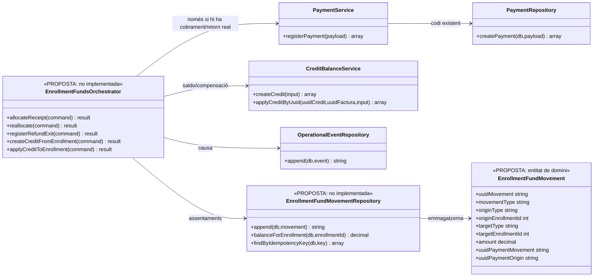

# Revisió transversal · Traçabilitat dels fons associats a cada inscripció

**Estat:** revisió funcional i proposta d'arquitectura; **NO és una migració executada ni un ledger PHP implementat**. La necessitat d'aquesta peça s'ha detectat en revisar les fitxes UC-01…06, 21…24, 26…29a i les migracions/repositoris del repositori `main`. Les fitxes actuals no es consideren tancades fins que aquesta traçabilitat estigui resolta o s'acrediti una alternativa equivalent.

## 1. Diagnòstic contrastat: què existeix i què falta

| Taula/servei existent | Dada que proporciona | Límit respecte dels diners d'una inscripció |
| --- | --- | --- |
| `payment_transaction` + `PaymentRepository::createPayment()` | Moviment `CHARGE`, `REFUND` o `COMPENSATION`, import, mètode, data i clau idempotent. | No conté `ID_INSC` ni destí econòmic de cada participant; un traspàs intern **no** és un nou `CHARGE`. |
| `payment_allocation` | `UUID_PAYMENT`, `UUID_FACTURA`, `IMPORT_ASSIGNAT`, tipus i data. | Assigna a **factura**, no a inscripció. Si una factura cobreix N participants, aquesta fila no diu quant correspon a cadascun ni quin import es traspassa entre inscripcions. |
| `fact_rels` i `factura_linia.SOURCE_ID` | Relacions entre factura/línia i inscripció o altre origen, quan el canal les ha aportat. | No és una taula de moviments amb import origen/destí; una relació documental no acredita una transferència econòmica concreta. |
| `operational_event`, `course_change_event`, `enrollment_cancellation_event` | Events i snapshots, dades generals de canvi o baixa i referències a factura/pagament/crèdit. | L'event únic no desglossa **cada moviment**: 80 € transferits al nou curs + 40 € retornats, per exemple, exigeixen dues operacions econòmiques amb quantitats i destins diferents. Les taules d'events consten a migracions, però no hi ha una orquestració de canvi/baixa acreditada que les ompli completament. |
| `payment_action_event` + `PaymentActionGateway` | Auditoria de peticions/accions/resultats; el repositori enumera `REALLOCATE`, `UNALLOCATE` i `SPLIT_ALLOCATION`. | Disposar d'aquests valors i d'un gateway d'auditoria **no és** tenir el llibre quantitatiu de moviments entre inscripcions. `PaymentService` no crida automàticament el gateway ni registra `ID_INSC` per cada assignació. |
| `credit_balance` + `CreditBalanceService` | Saldo original/disponible, titular, origen i consum per compensació. | La creació/consum canvia imports disponibles, però no deixa, per si sola, un assentament immutable per cada sortida des d'una inscripció i cada aplicació del saldo a una altra. |
| `academic_economic_state_event` | Esquema de transicions acadèmiques/d'accés i una fotografia econòmica. | Un snapshot d'estat no reemplaça la traçabilitat quantitativa per cada moviment de fons. |

**Conclusió documental:** per reconstruir què passa amb un import cobrat per una inscripció concreta falta un **registre persistent, immutable i consultable per inscripció, import, origen i destí**. El nom i els camps de la taula següent són **proposta nova**, no realitat del codi actual.

## 2. Separar tres fets que no són sinònims

1. **Cobrament/retorn de diners reals:** va a `payment_transaction` (`CHARGE` o `REFUND`), amb `payment_allocation` per reflectir la factura afectada. Una sola transferència bancària pot cobrir diverses inscripcions, i no ha de generar N cobraments externs ficticis.
2. **Atribució o traspàs intern de diners ja cobrats:** ha de deixar un registre per cada inscripció d'origen/destí, però **no crea un altre `CHARGE`**. Cal distingir una atribució inicial, una reassignació, l'assignació a saldo i el consum posterior. La incidència fiscal sobre la factura és una decisió independent.
3. **Variació del preu, descompte o import degut:** es documenta en l'event/operació i, si afecta una factura emesa, en el procés fiscal procedent. No és un moviment de diners cobrats fins que realment se'n cobra, retorna, traspassa o aplica una part. Un descompte comercial no s'ha de fer passar per un `CHARGE` o un crèdit monetari creat de diners inexistents.

`inscripcions.PAGAMENT`, `FRACCIO`, `A_PAGAR` i altres valors del llegat poden servir com a **resums sincronitzats**, però no com a única evidència de moviments; qualsevol reconstrucció del saldo ha de tenir les entrades originals i la seva correlació.

## 3. Proposta concreta de taula: `enrollment_fund_movement` (PENDENT DE DISSENY/IMPLEMENTACIÓ)

**Una fila representa un canvi d'atribució de fons identificable**: origen → destí, import positiu, tipus, responsable i referències. La mateixa operació es pot repartir en **diverses files** si afecta diverses inscripcions o destins. Per al traspàs A → B, es registra **una fila amb A com a origen i B com a destí** (no dos cobraments).

| Camp proposat | Funció |
| --- | --- |
| `UUID_MOVEMENT` (PK), `IDEMPOTENCY_KEY` (UNIQUE) | Identitat immutable de la fila i reintent segur d'aquesta acció concreta; per lots de repartiment, clau individual per partida, no només per ordre bancària. |
| `MOVEMENT_TYPE` | `RECEIPT_ALLOCATION`, `REALLOCATION`, `REFUND_EXIT`, `CREDIT_CREATE`, `CREDIT_APPLY`, `REVERSAL`. Els codis són **proposats** i encara no formen part del diccionari canònic aprovat. |
| `ORIGIN_TYPE`, `ORIGIN_ENROLLMENT_ID`, `ORIGIN_UUID_CREDIT` | Tipus d'origen `EXTERNAL` / `ENROLLMENT` / `CREDIT` i identificador corresponent. `EXTERNAL` en recepció o retorn representa l'exterior de les atribucions internes; **no és una identificació bancària**. |
| `TARGET_TYPE`, `TARGET_ENROLLMENT_ID`, `TARGET_UUID_CREDIT` | Destí `ENROLLMENT` / `CREDIT` / `EXTERNAL`, amb identificador quan sigui intern. |
| `AMOUNT DECIMAL(12,2)`, `CURRENCY CHAR(3)` | Import **positiu** de l'atribució, moneda (EUR en els fluxos actuals). Evitar `FLOAT` per a saldos. |
| `UUID_PAYMENT_MOVEMENT`, `PAYMENT_ALLOCATION_ID` | FK al moviment real corresponent, **quan existeix**, i a la seva imputació a factura. Per un `REALLOCATION` intern, `UUID_PAYMENT_MOVEMENT` és `NULL`. |
| `UUID_PAYMENT_ORIGIN`, `UUID_ORIGIN_MOVEMENT` | Traça del cobrament o assentament original del qual s'han reassignat els fons; evita fer passar els traspassos per noves entrades de caixa. |
| `UUID_OPERATIONAL_EVENT`, `UUID_CHANGE`, `UUID_CANCELLATION` | Correlació amb el canvi de curs, baixa o altre event que justifica l'operació. Aquests enllaços poden requerir backfill quan un event es confirma en fases diferents. |
| `UUID_FACTURA_ORIGEN`, `UUID_FACTURA_DESTI` | Referències als documents afectats **sense presumir** que un traspàs intern modifica automàticament una factura emesa. |
| `CORRELATION_ID`, `REASON_CODE`, `ACTOR_ID`, `OCCURRED_AT`, `RECORDED_AT` | Motiu, actor, cronologia i recorregut d'auditoria sense dependre d'una observació lliure del llegat. |
| `UUID_REVERSAL_OF` | Correcció per una **nova fila inversa** (origen/destí intercanviats); no sobreescriure ni esborrar el moviment anterior. |

**Integritat obligatòria per dissenyar:** un origen/destí intern ha de tenir el seu identificador; `AMOUNT > 0`; origen i destí no poden ser la mateixa inscripció i compte; no es pot traspassar més import del que està disponible en l'atribució d'origen; `RECEIPT_ALLOCATION` i `REFUND_EXIT` han de referenciar un moviment real confirmat; `CREDIT_CREATE` i `CREDIT_APPLY` han de mantenir reconciliació amb `credit_balance`; cap reintent no pot crear una fila addicional equivalent.

**Important:** aquesta taula **no és un segon banc ni un segon `payment_transaction`**. La font del diner extern continua sent el moviment de pagament; la nova taula és el detall de qui té atribuït cada import i com s'ha redistribuït entre inscripcions i saldos.

### Exemples que la taula ha de poder explicar

| Moviment | Origen → destí | Import | Referència econòmica |
| --- | --- | ---: | --- |
| Un client paga 120 € pel curs A | `EXTERNAL → INSCRIPCIÓ A` | 120 € | `UUID_PAYMENT_MOVEMENT` del `CHARGE` real. |
| Canvia a curs B que costa 80 € | `INSCRIPCIÓ A → INSCRIPCIÓ B` | 80 € | `UUID_PAYMENT_ORIGIN` del cobrament inicial i event UC-26/71; **sense `CHARGE` nou**. |
| Es retornen els 40 € restants | `INSCRIPCIÓ A → EXTERNAL` | 40 € | `UUID_PAYMENT_MOVEMENT` del `REFUND` real i event UC-28. |

Després de les tres files, l'atribució neta al curs A és 0 € i al curs B és 80 €; els diners externs nets són 120 € cobrats menys 40 € retornats. La factura original i les correccions fiscals necessàries es tracten **a banda**, amb enllaç als UUIDs que pertoquin.

**Un altre cas crític:** si una empresa paga 200 € per dues inscripcions, pot haver-hi **un sol** `payment_transaction` de 200 €, però **dues atribucions inicials** de 100 € cadascuna, referenciant el mateix moviment d'origen. Si hi ha una factura comuna, cal particionar-la per línia/inscripció sense comptar dues vegades l'import global.

## 4. Invariants que cal exigir abans de donar els casos per acabats

- **Conservació:** cada reassignació té import sortint i entrant igual; el total de fons cobrats **no creix** quan es canvia d'inscripció.
- **No doble comptatge:** separar `UUID_PAYMENT_MOVEMENT` (nou fet de caixa) de `UUID_PAYMENT_ORIGIN` (traça); els reports de caixa sumen només `payment_transaction` confirmats, no tots els imports de `enrollment_fund_movement`.
- **Reconciliació:** suma de les atribucions inicials per pagament/assignació = import efectivament distribuït; suma de sortides i entrades per inscripció = atribució actual derivada, amb controls de saldos negatius. Una factura que cobreix N alumnes exigeix N quantitats explícites, no un repartiment implícit per nombre de participants.
- **Concurrència/idempotència:** el registre del pagament, les seves assignacions i les atribucions **han de confirmar-se conjuntament quan comparteixen la BD SIF**. Els traspassos han de bloquejar i validar la disponibilitat d'origen; si hi ha BD llegades diferents, cal comanda idempotent, estat intermedi, reintent i conciliació: no fingir una transacció SQL única entre sistemes.
- **Auditoria:** `payment_action_event` registra peticions, denegacions, reintents i resultats; `operational_event` conserva causa, actor i abans/després; la nova taula conté les **quantitats i el recorregut**. Cap de les tres substitueix les altres.
- **Correccions:** no canviar silenciosament `payment_allocation` ni esborrar assentaments antics: rectificar l'atribució amb moviment invers i aplicació nova, coordinada amb les assignacions per factura i la classificació fiscal.
- **Sense moviment:** emetre factura abans de cobrar o rectificar-la **no implica** registrar moviment de fons fins que hi ha cobrament, devolució, aplicació de saldo o reassignació real. Una diferència pendent tampoc no és un cobrament fictici.

## 5. UML transversal proposat — model de classes, sense fingir implementació



**Les tres classes marcades PROPOSTA no existeixen al PHP revisat.** Les taules actuals tampoc no es converteixen en classes automàticament. Aquest model s'ha de validar contra les pantalles, la BD de llegat, les relacions fiscals i els casos amb múltiples participants.

## 6. Seqüència transversal proposada — traspàs entre cursos ja cobrats

```mermaid
sequenceDiagram
autonumber
actor O as Operador
participant UI as Intranet [adaptador pendent]
participant Or as EnrollmentFundsOrchestrator [PROPOSTA]
participant Ev as OperationalEventRepository [existent]
participant Ledger as EnrollmentFundMovementRepository [PROPOSTA]
participant SIF as BD SIF
participant Fiscal as Decisió/UC-05 [separada]
O->>UI: Confirmar canvi A → B i import que es traspassa
UI->>Or: reallocate(command idempotent)
Or->>SIF: BEGIN operació de fons
Or->>Ledger: Lock i llegir atribució disponible a A
Ledger-->>Or: Saldo A i pagament origen
alt Duplicat exacte de la mateixa comanda
 Or-->>UI: Retornar moviment ja registrat
else Saldo insuficient o destí incongruent
 Or--xUI: Bloqueig; cap assentament nou
else Reassignació vàlida
 Or->>Ev: append(causa/actor/origen/destí)
 Or->>Ledger: append(A → B, import, UUID_PAYMENT_ORIGIN, event)
 Ledger->>SIF: INSERT moviment immutable
 Or->>SIF: COMMIT de l'atribució
 Or-->>UI: UUID_MOVEMENT i nova atribució
end
UI->>Fiscal: Revisar si canvi de servei/import exigeix correcció fiscal
Note over Or,SIF: No hi ha cap nou payment_transaction CHARGE per un traspàs intern
Note over UI,Fiscal: La correcció fiscal i el canvi de BD llegada necessiten coordinació/reconciliació explícites
```

## 7. Revisió per cas d'ús i impacte documental

| UC | Exigència documental nova |
| --- | --- |
| UC-01/03/21 | En una venda cobrada, registrar **una entrada de caixa real** i atribuir-ne l'import **per cada inscripció afectada**; l'emissió sense pagament no crea atribució de diners. |
| UC-02/22/23/24 | Una fracció, transferència o reclamació confirmada augmenta l'atribució de la inscripció indicada. Si una entrada cobreix N participants/factures, desglossar quantitats, no duplicar `CHARGE`. |
| UC-04 | Factura emesa i pendent de cobrament: zero entrada al ledger fins que es confirma el cobrament posterior; enllaçar-la llavors a la mateixa factura. |
| UC-05 | Rectificativa fiscal sense moviment econòmic real o traspàs: **cap assentament fictici**. La compensació/devolució vinculada té el seu moviment per separat. |
| UC-06/28 | Cada devolució de diners confirmada provoca una sortida des de la inscripció que tenia fons atribuïts, amb el `REFUND` real i import vinculat; el cas mare no executa les tres variants conjuntament. |
| UC-26 | El canvi de curs determina quantitat traspassada A→B, import addicional pendent, saldo i/o devolució; **cada tram executat es registra individualment** i conserva la procedència del cobrament original. |
| UC-27 | Baixa sense devolució/saldo/traspàs: event administratiu, cap sortida fictícia. Amb devolució/saldo, cada import que surt de la inscripció necessita moviment propi. |
| UC-29 | Crear saldo amb diners ja atribuïts: inscripció→`credit_balance` i correlació amb la creació. Un crèdit comercial no provinent de diners cobrats s'ha de classificar per separat, sense inventar entrada de caixa. |
| UC-29a | Aplicar saldo: `credit_balance`→inscripció amb el `COMPENSATION` i l'assignació a factura corresponents, sense confondre-ho amb nou ingrés extern. |

**Casos que s'han d'afegir o desplegar més enllà d'aquesta revisió:** UC-71 (historial complet de canvi), UC-72 (expedient complet de baixa), repartiment d'una transferència a diversos alumnes/factures, reassignació/correcció d'una imputació ja confirmada i reconciliació SIF↔llegat. Els IDs definitius d'aquests darrers s'han de contrastar amb el catàleg abans de crear fitxes noves.

## 8. Traçabilitat amb el codi i la documentació existents

- [Migració SIF: payment_transaction, payment_allocation, fact_rels i credit_balance](../../sif/database/migrations/2026_06_02_000001_create_sif_core.sql).
- [Migració d'auditoria: payment_action_event, operational_event, course_change_event i enrollment_cancellation_event](../../sif/database/migrations/2026_09_15_000003_add_functional_audit_control.sql).
- [Esquema academic_economic_state_event](../../sif/database/migrations/2026_09_16_000005_add_operation_lifecycle_tables.sql).
- [PaymentRepository: INSERT de moviment i assignació per factura](../../sif/src/Repository/PaymentRepository.php).
- [PaymentPayloadValidator: camps mínims del moviment i les assignacions](../../sif/src/Service/PaymentPayloadValidator.php).
- [PaymentActionGateway](../../sif/src/Service/PaymentActionGateway.php) i [PaymentActionEventRepository](../../sif/src/Repository/PaymentActionEventRepository.php): auditoria existent però no substitut de l'atribució monetària per inscripció.
- [CreditBalanceService](../../sif/src/Service/CreditBalanceService.php) i [OperationalEventRepository](../../sif/src/Repository/OperationalEventRepository.php).
- [Diccionari de camps i valors](../05-governanca-operacio/24-diccionari-camps-i-valors.md), [fluxos de facturació](../03-canvis-pendents/04-fluxos-facturacio.md) i [matriu de transformació](../04-estat-final/38-matriu-transformacio-funcional-verifactu.md).

**Validació pendent:** determinar el contracte exacte dels identificadors d'inscripció per tots els canals, gestionar import de línies/grups/USOC, acordar semàntica de reassignació vs factura original, definir permisos i casos negatius, aprovar migració i repositori i executar proves de conservació/reconciliació. Aquesta revisió no canvia cap dada real.
