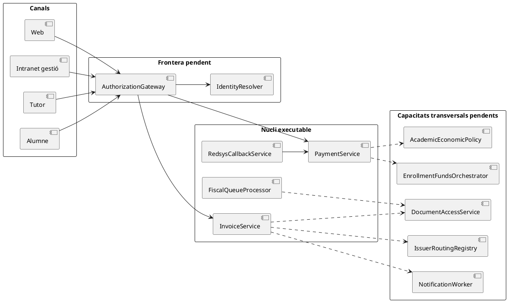
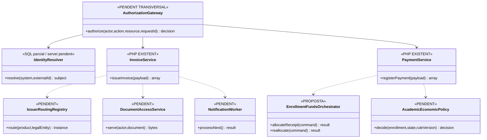
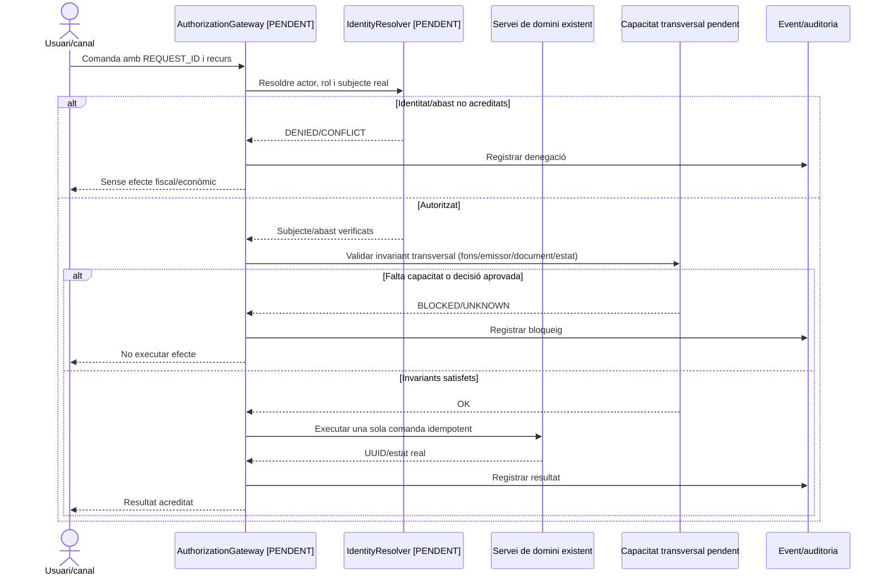

# Revisió transversal després de cobrir els 142 casos d'ús

**Abast:** contrastar el paquet complet de fitxes UML i les peces PHP/SQL comunes que apareixen repetidament. **No és una certificació de conformitat ni un resultat de proves end-to-end.** La cobertura documental és 142/142; aquesta revisió identifica els **bloquejos transversals** que impedeixen interpretar «documentat» com «implementat/desplegable».

## 1. Conclusions executives

| Bloc transversal | Evidència actual | Conseqüència sobre els casos |
| --- | --- | --- |
| Autorització dels endpoints fiscals | `public/api/factures/issue.php` i `public/api/payments/register.php` construeixen els serveis des del JSON d'entrada; **no hi ha comprovació visible de sessió/rol als fitxers revisats**. Pot existir protecció externa, però no està acreditada al repo. | UC-41/42/49/62/92/99/101/102 i qualsevol adaptador d'intranet/web no es pot donar per segur només perquè el servei de domini existeixi. |
| Idempotència de pagaments | `PaymentService` busca per `idempotency_key` i, si existeix, retorna el moviment anterior; **no compara tot el payload nou** amb el moviment existent. | Una mateixa clau amb import/origen contradictori necessita validació de negoci superior. Una clau nova per la mateixa transferència continua sent risc de doble `CHARGE`. |
| Diners per inscripció | `payment_allocation` assigna a factura i `fact_rels` relaciona orígens, però **cap dels dos modela l'import atribuït a cada `ID_INSC`**. `enrollment_fund_movement` continua proposta. | Canvis de curs, grups, packs, descomptes tardans, refund parcials, saldos i transferències internes no poden reconstruir-se quantitativament per participant amb l'esquema actual. |
| Grup i línia fiscal | `LegacyGroupInvoicePayloadBuilder` crea una línia per inscrit i el responsable com a receptor; `InvoiceRepository::insertRelations()` no omple `ID_FACTURA_LINIA`. | Relacionar tres inscrits a una factura no prova quina línia/import correspon a cadascun ni concedeix accés al PDF. |
| Aritmètica de línies | `InvoicePayloadValidator` comprova camps i numericitat, però no totes les invariants aritmètiques transversals. El builder de curs sí comprova alguns totals; el de grup no acredita la mateixa regla en tots els inputs. | Cal un validador monetari comú amb decimals/cèntims abans de donar per tancats UC-88/90/91/94 i combinacions multiconcepte. |
| Receptor/identitat fiscal | El validador exigeix `billing.name/nif`, però no aplica una matriu per país/tipus d'identificador. `ManualRectificationPayloadBuilder` reutilitza el receptor original. | UC-87 i UC-93 segueixen bloquejats: receptor estranger i substitució de subjecte no estan resolts pel PHP existent. |
| Multiemissor Associació/SL | `config/sif.php` té un únic `issuer` per entorn; el SIF no acredita routing multiemissor per factura. L'importador històric marca `NO_VERIFACTU`. | UC-97/98 i cistelles mixtes no poden compartir numeració/cadena per inferència. Cal decisió d'arquitectura i fiscal per entitat. |
| Històric | `HistoricalInvoicePayloadBuilder` usa per defecte `HISTORIC|FACT:<NUM_VISIBLE>` com a clau; no discrimina emissor si no s'aporta clau explícita. | En històrics de dues entitats pot existir col·lisió lògica. La importació no crea `ALTA` AEAT i no converteix documents antics en VERI*FACTU. |
| Documents | `DocumentRepository` registra metadades/hash; no acredita storage físic ni servei autoritzat. `fiscal_document_access` és esquema SQL sense controlador/writer acreditat. | UC-07/36/49/78/79/80/84/102 necessiten custòdia de bytes, token/autorització i traça real. |
| Notificacions | `notification_outbox` i `notification_delivery_attempt` existeixen a SQL, però no s'ha acreditat worker PHP complet ni protocol de claim/lock. | UC-43/49/58/79: «SENT» no es pot equiparar a lliurat/llegit i els reintents concurrents queden per implementar. |
| Estat acadèmic | `academic_economic_state_event` existeix a SQL, però no s'ha acreditat motor/writer transversal ni control segur de pròrrogues/baixes. | UC-95/96/124/129: pagament, matrícula, accés i certificat són estats separats que s'han de reconciliar amb Prisma/Moodle. |
| AEAT | `FiscalQueueProcessor` i transport de proves existeixen; el transport revisat està limitat a endpoint de proves i el preflight comprova prerequisits locals. | UC-09/35/38/60/77/83/84/85 no acrediten producció ni acceptació remota per un estat local `SENT`. |
| Runtime i desplegament | Scripts manuals i d'històric revisats rebutgen `SIF_ENV=production`; no s'ha comparat la branca amb el PHP/FTP, DNS/TLS, crons i callbacks reals. | UC-39/46/57/60/64/67/68/83/85/101 continuen necessitant inventari i prova de runtime. |

## 2. Bloquejos que convé resoldre abans d'ampliar més PHP

### B1 · Gateway d'autorització únic per accions fiscals

**Problema verificat:** les rutes HTTP d'emissió i registre de pagament consultades no mostren cap comprovació de sessió/rol abans de construir `InvoiceService` o `PaymentService`. Això no prova que siguin públicament accessibles al servidor, però sí que **el contracte d'autorització no és una propietat del codi d'aquells endpoints**.

**Contracte mínim a dissenyar/provar:**
- actor autenticat, rol i canal verificats pel servidor;
- acció concreta (`ISSUE_INVOICE`, `REGISTER_PAYMENT`, `REFUND`, `RECTIFY`, lectura de document);
- subjecte/empresa/inscripció/factura sobre què té abast;
- `REQUEST_ID` + correlació + rebuig d'una mateixa petició amb payload contradictori;
- denegació auditada **abans** de qualsevol numeració, `CHARGE` o lectura sensible;
- callback Redsys separat: autorització per signatura + intenció, no sessió d'usuari.

**Casos directament dependents:** UC-01/02/05/06/07, UC-41/42/44/49, UC-59/62, UC-80, UC-92, UC-99/101/102/103.

### B2 · Ledger quantitatiu de fons per inscripció

La proposta [`enrollment_fund_movement`](00-revisio-moviments-inscripcions.md) continua sent necessària. No s'ha trobat cap substitut que expliqui de manera quantitativa:
- una transferència externa única que paga diverses inscripcions;
- un canvi A→B sense nou ingrés;
- una devolució parcial a una persona d'una factura de grup;
- la conversió d'un excés en saldo i l'aplicació posterior;
- la distribució d'un pagament parcial dins d'un pack/grup.

**Invariant transversal:** el report de caixa suma `payment_transaction`; el ledger individual explica **atribució**, no crea diners.

**Casos dependents:** UC-13/16/21/23/26-29a, UC-53/54, UC-71-73, UC-88/90/91/94-96, UC-104-106/110/118.

### B3 · Model d'emissor i partició fiscal

Abans d'incorporar la botiga/SL:
1. identificar emissor real per producte/operació;
2. decidir instància/partició de BD, seqüència i cadena;
3. definir certificat/credencials i declaració per emissor;
4. impedir que un únic `fiscal_chain_state.ID=1` representi entitats diferents sense un redisseny explícit;
5. desambiguar claus d'històric per **emissor + origen + ID**, no només número visible.

**Casos dependents:** UC-88, UC-97, UC-98 i qualsevol venda mixta futura.

### B4 · Document real, storage i accés

Hi ha una diferència important entre:
- **metadada** `factura_documents`,
- **bytes** disponibles en storage privat,
- **hash** verificat en el moment de servir,
- **permís** de l'actor sobre aquell document,
- **traça** del resultat de la descàrrega.

Cap d'aquests cinc conceptes s'ha de substituir pels altres. El controlador de lectura i el token d'accés continuen pendents.

**Casos dependents:** UC-07/36/37/49/59/78-80/84/102/123.

### B5 · Motor acadèmic-econòmic i pròrrogues

`academic_economic_state_event` permet representar transicions, però una taula no implementa:
- regla d'accés mentre hi ha deute;
- disponibilitat del certificat;
- baixa automàtica;
- «segona setmana» i còmput de venciment;
- conciliació efectiva amb Moodle;
- què passa amb pagament parcial/grup.

La UC-96 deixa expressament pendent **la data exacta** i la base de còmput de la pròrroga. Automatitzar sense aquesta política convertiria una decisió de negoci no aprovada en comportament de codi.

## 3. Inconsistències o riscos de falsa confiança que ja s'han detectat

1. **Etiquetes històriques `[BASE]/[CONFIRMAT]` ≠ implementació.** L'índex conserva l'estat original només com a context.
2. **SQL definit ≠ servei executable.** És especialment rellevant per `notification_outbox`, `fiscal_export`, `backup_restore_evidence`, `academic_economic_state_event`, `external_identity_link`, `commercial_entitlement` i altres taules de les migracions 000003–000006.
3. **`SENT` ≠ acceptat AEAT.** Cal mirar l'estat/response real del registre.
4. **`factura_documents.CREATED` ≠ fitxer disponible.** Cal verificar bytes i hash.
5. **`PAGAMENT=1`/text llegat ≠ moviment bancari.** Cal `UUID_PAYMENT` i prova externa.
6. **`IDPAG` ≠ persona.** Pot agrupar pagador, participants i múltiples inscripcions.
7. **`VISIBLE_ALUMNE` ≠ autorització completa.** Continua calguent identitat, receptor/representació i rol.
8. **clau idempotent reutilitzada ≠ payload equivalent.** `PaymentService` no compara tot el nou payload.
9. **rectificativa executable ≠ classificació fiscal automàtica.** El servei de rectificació necessita una decisió prèvia.
10. **backup existent ≠ recuperació acreditada.** Cal restaurar, reconciliar banc/AEAT posteriors al tall i aprovar reobertura.

## 4. Ordre de tancament tècnic recomanat per dependència

Això **no és una prioritat de negoci**, sinó un ordre de dependències tècniques que minimitza reimplementacions:

1. **Autorització/gateway de comandes** + identitat i recursos.
2. **Validació monetària comuna** i idempotència amb comparació de payload.
3. **Ledger de fons per inscripció** i invariants de grup/pack.
4. **Routing d'emissor** i decisió botiga/SL abans d'afegir més tipus de venda.
5. **Storage/document access** amb hash i auditoria.
6. **Outbox de comunicacions** i claims/retries.
7. **Motor d'estat acadèmic/pròrrogues** amb Prisma/Moodle.
8. **Runtime/go-no-go**: DNS/TLS, secrets, callbacks, workers, backup/restore i reconciliació.
9. **Producció AEAT** només quan els gates anteriors tenen evidència.

## 5. UML transversal dels bloquejos

## 6. Fonts i navegació

- [Índex complet 142/142](README.md)
- [Matriu del catàleg](00-matriu-cobertura-cataleg.md)
- [Model general de classes](00-model-classes-general.md)
- [Moviments quantitatius per inscripció](00-revisio-moviments-inscripcions.md)
- [UC-64 · candidata vs runtime](uc-064-reconciliar-candidata-codi-actual.md)
- [UC-80 · accés documental](uc-080-servir-registrar-acces-document-fiscal.md)
- [UC-95 · estat acadèmic/deute](uc-095-estat-academic-deute-pendent.md)
- [UC-97 · històric multiemissor](uc-097-consultar-historic-associacio-sl.md)
- [UC-98 · botiga/SL](uc-098-classificar-circuit-fiscal-botiga-llibres-sl.md)
- [UC-101 · entorns](uc-101-domini-tls-separacio-entorns-pay-prisma.md)
- [UC-102 · accés alumne](uc-102-autoritzar-acces-alumne-sense-rol-intranet.md)
- [API d'emissió](../../sif/public/api/factures/issue.php)
- [API de pagament](../../sif/public/api/payments/register.php)
- [PaymentService](../../sif/src/Service/PaymentService.php)
- [Importador històric](../../sif/src/Service/HistoricalInvoicePayloadBuilder.php)
