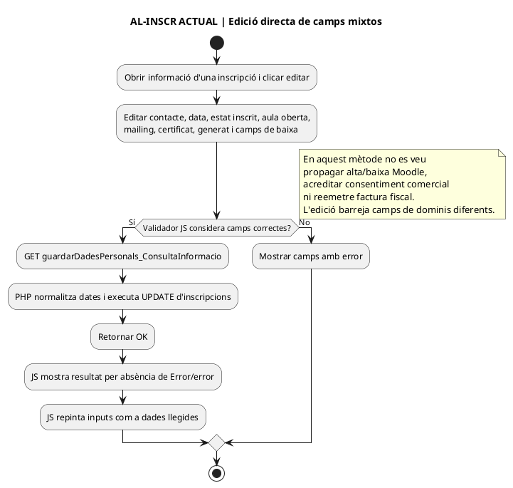
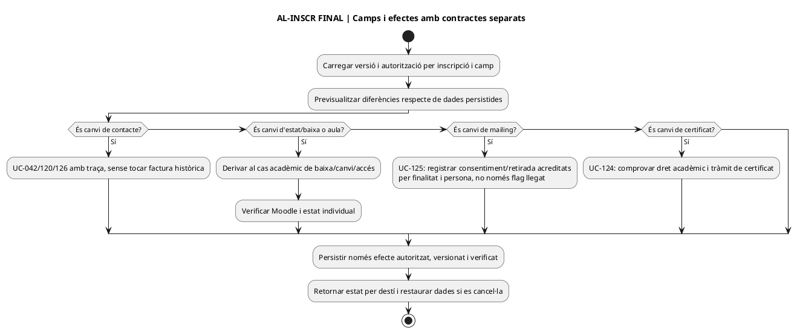
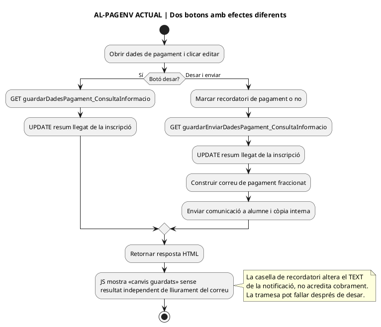
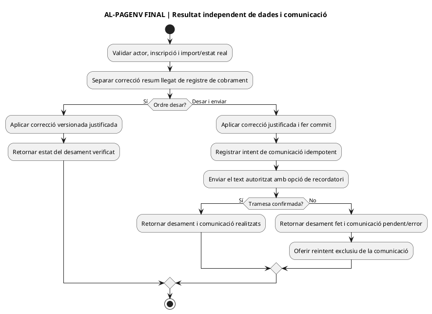
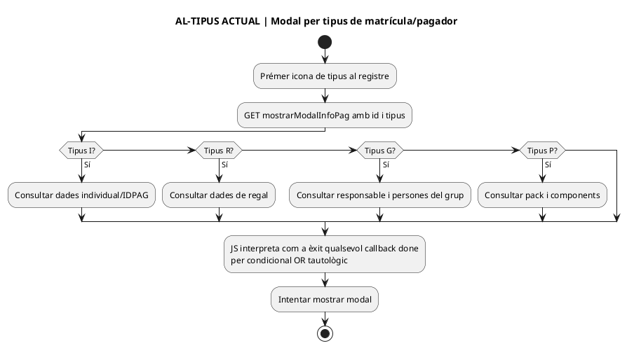
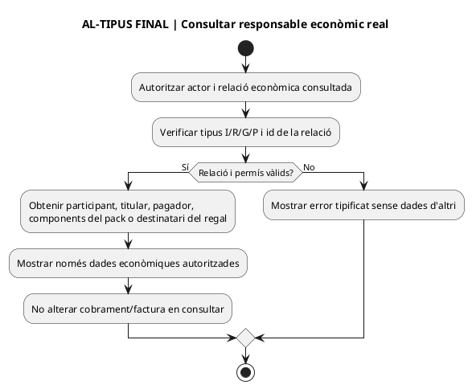
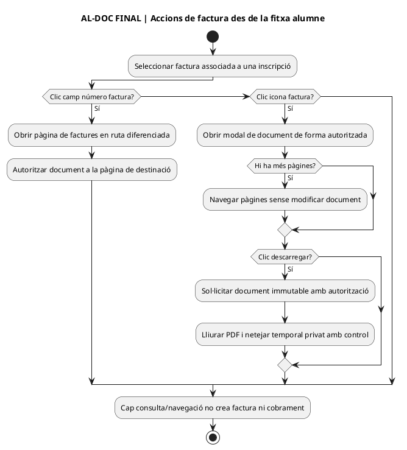

# Tancament documental de la pantalla — Alumnes / Consulta - Modifica

**Abast:** pantalla `/alumnes/mostrar-alumne/`, inclosa la cerca, les seccions de la fitxa i els modals/accions del seu JS. **Tall de codi llegat:** `main` SHA `e71958b3026549bde09fb4b25f2ec3ba370937ec`; documents actualitzats en la branca `docs/registre-mestre-auditoria-2026-09-22`. **Fonts visuals:** les 7 captures facilitades, amb originals privats i NO copiats al GitHub públic. **Fonts funcionals:** [inventari de les captures i 26 diagrames actual/final](00-captures-auditoria-alumnes-consulta-modifica-2026-09-22.md), [UC-042 funcional](../06-fitxes-funcionals/uc-042.md), [UML UC-042](uc-042-consultar-modificar-alumne.md), [UC-027 baixa](uc-027-donar-de-baixa.md), [UC-071 canvi](uc-071-registrar-canvi-curs-complet.md), [UC-124 acadèmic/certificat](uc-124-reconciliar-acces-certificat-baixa-deute.md), [UC-125 consentiment](uc-125-consentiment-comunicacions-separat.md).

**Exclusió de proves acordada el 23/09/2026:** no revisar ni executar **cap prova de Moodle ni de correus** en aquest punt. Els botons, les rutes i les etapes d'enviament/accés es descriuen únicament per delimitar el flux, sense verificar-ne resultat, lliurament, contingut, matrícula, qualificació o comunicacions. Aquestes proves no són una condició de tancament del **lot documental** ni es marcaran com a superades.

**Significat de «tancament»:** es tanca en aquest tall **l'inventari DOCUMENTAL dels controls i rutes identificats al JS llegible de la pantalla**, amb classificació actual/final, propietari funcional i test necessari; no es declaren tancats la implementació, el desplegament, la seguretat, els efectes a BD/Moodle/correu, els resultats de navegador ni el projecte SIF de 142 UC. Les variants de formulari que no consten a les 7 captures deriven de codi; no afirmar que s'han fotografiat o executat. Si el codi-drive es torna a actualitzar, comparar el nou commit i reobrir només els recorreguts que canviïn.

## 1. Matriu completa dels punts d'interacció identificats

| ID | Pantalla, apartat o acció | ACTUAL acreditat al JS/PHP del tall | Cas d'ús / flux FINAL i prova de tancament |
| --- | --- | --- | --- |
| AL-01 | Entrar i obrir fitxa a partir del hash | [JS L1–52](../../codi-drive/intranet-actual/js/alumnes-mostrar-alumne.js#L1-L52), `mostrarMain_v5.php`; si hi ha hash, omple el camp de cerca i inicia cerca automàtica. | UC-042/126: autoritzar rol i subjecte a servidor; T-AL-F01 hash aliè o caducat no exposa fitxa. |
| AL-02 | Cerca bàsica: DNI, correu, nom, cognoms; Enter | [JS L115–195](../../codi-drive/intranet-actual/js/alumnes-mostrar-alumne.js#L115-L195); cerca buida dona avís. | UC-042/126: validació al servidor; T-AL-14-A cerca buida, inexistent, una/múltiples coincidències. |
| AL-03 | Obrir/tancar cerca avançada, criteris múltiples i netejar filtres | [JS L121–195 i L307–329](../../codi-drive/intranet-actual/js/alumnes-mostrar-alumne.js#L307-L329); quan s'oculta, la cerca desactiva els filtres avançats; netejar els posa a buit. | UC-042: evitar filtres invisibles actius i resultats obsolets; T-AL-14-B cerca múltiple, tancar/obrir, netejar. |
| AL-04 | Cerca per filtre i combinació | [JS L331–511](../../codi-drive/intranet-actual/js/alumnes-mostrar-alumne.js#L331-L511): un GET `searchUserBy{camp}` per criteri i intersecció de DNI retornats al client; camins 0/1/múltiples/mes de 2000. | UC-042/126: query i permisos al servidor; cancel·lar respostes de cerques anteriors; T-AL-14-C solapament i falla un dels endpoints. |
| AL-05 | Taula de resultats, ordenació, seleccionar una persona | [JS L512–560](../../codi-drive/intranet-actual/js/alumnes-mostrar-alumne.js#L512-L560), `mostrarTaulaUsuaris.php`. | UC-042: llista mínima autoritzada i fitxa per objecte; T-AL-F02 selecció d'altre subjecte, ordenació i paginació/límit. |
| AL-06 | Mostrar fitxa i inscripcions per situació | [JS L560–636](../../codi-drive/intranet-actual/js/alumnes-mostrar-alumne.js#L560-L636); [`mostrarInformacioUsuari_Alumnes()` L5983–6051](../../codi-drive/intranet-actual/Intranet.php#L5983-L6051) construeix apartats i modals. | UC-042/124: inscripció, situació i econòmic separats; T-AL-F03 diversos tipus/edicions i manca de dades. |
| AL-07 | Mostrar/Ocultar tots els registres | [JS L821–836](../../codi-drive/intranet-actual/js/alumnes-mostrar-alumne.js#L821-L836), captures VIS-AL-01/05. | UC-042: consulta, sense alterar matrícula; T-AL-F04 no revela registres fora del permís. |
| AL-08 | Icona de tipus d'inscripció: modal d'informació del pagador | [JS L590–636](../../codi-drive/intranet-actual/js/alumnes-mostrar-alumne.js#L590-L636), [`mostrarModalInfoPag()` L10849–11129](../../codi-drive/intranet-actual/Intranet.php#L10849-L11129) té branques `I` (individual), `R` (regal), `G` (grup/responsable) i `P` (pack). El condicional de resposta del JS és lògicament sempre cert per a una resposta AJAX completada; no garanteix contingut vàlid. | UC-042/105/122: modal de consulta de relacions i pagador, sense tractar participant=pagador; T-AL-F05 quatre tipus, grup amb tercer pagador i error real. |
| AL-09 | Editar dades personals de la vista general | [JS L639–793](../../codi-drive/intranet-actual/js/alumnes-mostrar-alumne.js#L639-L793), [`guardarDadesPersonals_resultatCerca()` L6099–6123](../../codi-drive/intranet-actual/Intranet.php#L6099-L6123), GET amb dades a URL; només UPDATE d'un registre. | UC-042/120/126: validar autorització de camp/versió, no reescriure receptor fiscal antic; T-AL-15 desament parcial/error/concurrència. |
| AL-10 | Cancel·lar edició de dades personals | [JS L795–812](../../codi-drive/intranet-actual/js/alumnes-mostrar-alumne.js#L795-L812): repinta el valor temporal no desat. | UC-042: restaurar valors originals; T-AL-15-A valor visible = lectura real després de cancel·lar. |
| AL-11 | Icona informació d'inscripció i navegació acadèmica | [JS L837–845 i L1009–1072](../../codi-drive/intranet-actual/js/alumnes-mostrar-alumne.js#L1009-L1072); mostra modal i enllaços a curs, Moodle nou/antic, participants, qualificacions i seguiment segons icona. | UC-042/124: autorització per inscripció i destí; T-AL-F06 consulta d'inscripcions i permisos dels botons de la intranet, sense provar cap accés ni resultat Moodle. |
| AL-12 | Editar i desar les dades de la INSCRIPCIÓ en modal | [JS L1072–1310](../../codi-drive/intranet-actual/js/alumnes-mostrar-alumne.js#L1072-L1310), [`guardarDadesPersonals_ConsultaInformacio.php`](../../codi-drive/intranet-actual/ajax/alumnes/guardarDadesPersonals_ConsultaInformacio.php), [`guardarDadesPersonals_modalsresultatCerca()` L7473–7510](../../codi-drive/intranet-actual/Intranet.php#L7473-L7510): GET, UPDATE directe de persona, data, situació d'inscripció/baixa, aula oberta, certificat, `INSC_MAILING` i observacions. La UI pot repintar valors temporals també després d'una resposta d'error en el callback diferit. | UC-042/120/124/125 i UC de baixa si realment es canvia estat: separar dades de contacte, estats, consentiment i efectes operatius amb validacions/traça per camp; T-AL-F07 passar `INSC CURS` a baixa per edició i comprovar que no se salta el circuit acadèmic ni el consentiment. |
| AL-13 | Cancel·lar edició d'inscripció o pagament | [JS L1344–1366, L1995–2033](../../codi-drive/intranet-actual/js/alumnes-mostrar-alumne.js#L1995-L2033): funció compartida `cancelEditarApartat` repinta el valor temporal d'inputs, sense UPDATE. | UC-042: restaurar dades originals per apartat; T-AL-F08 cancel·lar import/data/estat amb dades persistides diferents. |
| AL-14 | Editar dades de pagament — «Desar» | [JS L1311–1326, L1388–1490](../../codi-drive/intranet-actual/js/alumnes-mostrar-alumne.js#L1388-L1490), [`guardarDadesPagament_modalsresultatCerca()` L7525–7571](../../codi-drive/intranet-actual/Intranet.php#L7525-L7571): GET i UPDATE del resum llegat `PAGAMENT/A_PAGAR/IDPAG/FACTURA_RELACIONADA`. | UC-042/002/062/074/105: aquest valor no crea cobrament bancari ni corregeix factura immutable; T-AL-10 conciliació i permisos. |
| AL-15 | Editar dades de pagament — «Desar i enviar» i recordatori | [JS L1319–1343 i L1388–1490](../../codi-drive/intranet-actual/js/alumnes-mostrar-alumne.js#L1319-L1343) envia GET separat a [`guardarEnviarDadesPagament_ConsultaInformacio.php`](../../codi-drive/intranet-actual/ajax/alumnes/guardarEnviarDadesPagament_ConsultaInformacio.php), que executa **primer** UPDATE de resum i **després** `enviarNotificacioObsPagament_modalsresultatCerca()` [L7572–7674](../../codi-drive/intranet-actual/Intranet.php#L7572-L7674). El control «recordatori» canvia una classe visual i una bandera que modifica el text del correu. El missatge d'èxit del JS és «canvis guardats», **no prova de lliurament**. | UC-042 i UC de reclamacions/comunicació operativa (NO UC-125 de consentiment publicitari): desar i enviar són fases amb resultats diferents; T-AL-F09 validar únicament desament a BD i estat que mostra la UI; excloure enviament, lliurament, recordatoris i qualsevol altra prova de correu. |
| AL-16 | Obrir fitxa de factura des del camp del modal | [JS L1352–1357](../../codi-drive/intranet-actual/js/alumnes-mostrar-alumne.js#L1352-L1357) navega a `/alumnes/factura/#/factRel/...`; aquesta és una **altra pantalla**. | UC-007: en aquest inventari és només navegació; l'auditoria de totes les accions de la pantalla de factures és un lot separat. T-AL-F10 permís de factura de grup amb pagador diferent. |
| AL-17 | Icona de factura: consulta i pàgines | [JS L2169–2325](../../codi-drive/intranet-actual/js/alumnes-mostrar-alumne.js#L2169-L2325): consulta `mostraModalConsultaFactura.php`; botons anterior/següent paginen la vista en el navegador; no són emissió fiscal. | UC-007/049 si s'envia: modal autoritzat, pàgina vàlida i estat documental; T-AL-F11 factura multipàgina, absent i tercer pagador. |
| AL-18 | Descarregar factura i netejar temporal | [JS L2219–2267](../../codi-drive/intranet-actual/js/alumnes-mostrar-alumne.js#L2219-L2267), [`descarregaFactura.php`](../../codi-drive/intranet-actual/ajax/alumnes/descarregaFactura.php): l'asset llegible i minificat del repositori usen `resD` sense declaració local en un callback `res`; el JS sol·licita `eliminarArxiu.php` després del clic al fitxer. | UC-007: callback coherent, descàrrega autenticada i temporal privat; T-AL-13 PDF real, error, permisos, neteja/retenció i absència de nova emissió. |
| AL-19 | Baixa individual i missatge opcional | [JS L2035–2135](../../codi-drive/intranet-actual/js/alumnes-mostrar-alumne.js#L2035-L2135), [PHP L9172–9495](../../codi-drive/intranet-actual/Intranet.php#L9172-L9495); motiu, confirmació, estat Moodle/inscripció i avís es tracten successivament. | UC-027/072/124: no confondre amb anul·lació massiva d'edició UC-127; T-AL-11 baixa a la BD, factura/pagador i doble petició, sense executar ni revisar Moodle o correus. |
| AL-20 | Canvi de curs: destinació, preu, despeses i previsualització | [JS L1543–1674 i L1812–2034](../../codi-drive/intranet-actual/js/alumnes-mostrar-alumne.js#L1812-L2034): selectors d'any/mes/curs/variant; AJAX de cerca de preu del destí i despeses de gestió; càlcul de pendent al client; modal de previsualització separat. El preu cercat al backend per al formulari **no demostra que l'endpoint final el torni a calcular**. | UC-071/105/112: previsualització basada en snapshot comercial autoritatiu, plaça i ingressos reals; T-AL-12 preu/condicions variables, pagaments parcials, peticions tardanes. |
| AL-21 | Confirmar, tornar enrere o tancar canvi | [JS L1675–1811](../../codi-drive/intranet-actual/js/alumnes-mostrar-alumne.js#L1675-L1811), [PHP L8513–9082](../../codi-drive/intranet-actual/Intranet.php#L8513-L9082); torna al modal anterior sense execució o envia GET amb imports quan es confirma. | UC-071/105: executar canvi idempotent només després de confirmació, validar import/actor/plaça i fases d'origen/destí; T-AL-12 i prova de previsualització descartada. |
| AL-22 | Certificat: modal, tipus, preview i PDF | [JS L881–900 i L2327–2487](../../codi-drive/intranet-actual/js/alumnes-mostrar-alumne.js#L2327-L2487); variants `INSCRIT`, `DIGITAL`, `PAPER`, `SOBRE`, PDF temporal i petició de neteja. | UC-124: consulta/acreditació diferents de factura; PDF privat, autoritzat i amb nom opac, elegibilitat acadèmica; T-AL-17: validar variants, permisos i fitxer PDF de prova, sense provar Moodle. |
| AL-23 | Observacions generals: consultar, afegir, ocultar | [JS L903–1003](../../codi-drive/intranet-actual/js/alumnes-mostrar-alumne.js#L903-L1003), [PHP L6765–6884](../../codi-drive/intranet-actual/Intranet.php#L6765-L6884): INSERT de nota; UPDATE de `VISIBLE=0` quan s'oculta, sense esborrar físicament. | UC-042: permisos per alumne/nota, traça i retorn per operació; T-AL-16. |
| AL-24 | Tancar modals, recarregar després de consulta, navegar a Moodle/curs | [JS L1029–1070 i L2532–2574](../../codi-drive/intranet-actual/js/alumnes-mostrar-alumne.js#L2532-L2574): tanca modal sense executar la seva acció, consulta enllaços externs de Moodle/curs i en alguns casos torna a disparar cerca. | UC-042/124: consulta/navegació no equival a efecte fiscal; T-AL-F12 tancar cada modal i verificar que no hi ha escriptures/petició de canvi. |
| AL-25 | Observació individual de la inscripció: ruta existent independent | [`saveObservacionsInscripcio.php`](../../codi-drive/intranet-actual/ajax/alumnes/saveObservacionsInscripcio.php) i [`Intranet::saveObservacionsInscripcio()` L20355–20484](../../codi-drive/intranet-actual/Intranet.php#L20355-L20484) existeixen i poden generar un CSV/comunicacions. **No s'ha acreditat un botó en `alumnes-mostrar-alumne.js` que invoqui aquest endpoint en aquesta pàgina**; no computar-lo com a acció visible coberta. | UC-042/124: inventariar-lo en la seva pàgina/circuit d'origen quan s'identifiqui el consumidor, no atribuir-li efectes d'aquesta fitxa. |

**No incloure com a accions d'aquesta pàgina:** `/alumnes/factura/` és una destinació de navegació, la UI de curs de UC-114 és una altra pàgina, i la conciliació SIF/Moodle/AEAT no es completa amb els clics de consulta. La presència d'un endpoint al directori no demostra que sigui invocat des de la fitxa.

## 2. Subdiagrames nous per variants que no estaven separades al primer lot

### AL-INSCR · Editar directament estat, mailing i certificat de la inscripció — ACTUAL

### AL-INSCR · Editar camps mixtos — FINAL

### AL-PAGENV · «Desar» versus «Desar i enviar» — ACTUAL

### AL-PAGENV · «Desar» versus «Desar i enviar» — FINAL

### AL-TIPUS · Consultar pagador per tipus I/R/G/P — ACTUAL i FINAL

### AL-DOC · Navegar o descarregar factura — FINAL de subacció

## 3. Incidències comprovades al codi i treball d'implementació

| Ref | Evidència concreta del tall de codi | Modificació necessària i prova de sortida |
| --- | --- | --- |
| AL-IMP-01 · privacitat documental | Els fitxers temporals de certificat generats tenen noms basats en identificació personal i diversos artefactes amb aquest patró ja apareixen a l'arbre de GitHub; veure [incidència detallada](00-captures-auditoria-alumnes-consulta-modifica-2026-09-22.md#8-incidència-de-protecció-de-dades-detectada-al-repositori-sense-reproduir-cap-document). | Activar circuit privat de gestió d'incidències, revisar exposició, permisos, HEAD/historial i còpies, temporal privat amb nom opac, endpoint de descàrrega autenticat i exclusió de Git. **No considerar corregit sense verificació de l'equip responsable.** |
| AL-IMP-02 · neteja de temporals | [`eliminarArxiu.php`](../../codi-drive/intranet-actual/ajax/alumnes/eliminarArxiu.php) pren un nom de fitxer d'un GET i executa una operació d'eliminació al filesystem; al wrapper revisat no consta validació de nom, vinculació a l'actor ni comprovació de pertinença al directori de temporals. **No exposar al document cap ruta ni prova destructiva contra producció.** | Resoldre únicament un token opac cap a un temporal de l'actor al directori privat i restringir la neteja a objectes caducats/autoritzats; fer proves no destructives en entorn aïllat. Revisió de seguretat prioritària. |
| AL-IMP-03 · permisos | Molts handlers només consulten `tePermisEdicio` al navegador o desserialitzen sessió als wrappers; la revisió d'aquests mètodes no verifica autorització per recurs i per camp del SIF. | Controls d'actor/subjecte/inscripció/document/nota al backend, anti-CSRF en mutacions i proves de petició directa. No afirmar vulneració reproduïda sense proves. |
| AL-IMP-04 · dades d'inscripció | El formulari mixt deixa canviar `INSC CURS`, data/motiu de baixa, `INSC_MAILING` i certificat amb un UPDATE llegat; la mateixa petició no acredita Moodle, consentiment ni elegibilitat. | Separar comandaments i validació de UC-042/120/124/125 i baixa UC-027/072, amb estat abans/després i propagació real. Provar que editar un camp ordinari no canvia la situació acadèmica/fiscal. |
| AL-IMP-05 · import i enviament | «Desar i enviar» fa UPDATE + correu seqüencialment; un resultat de desament no acredita lliurament, i repetir la petició pot repetir l'enviament. | Outbox/estat per destinatari, idempotència i resposta per etapa; reconciliar amb pagaments reals i no equiparar text de recordatori a cobrament. |
| AL-IMP-06 · errors JS | `resD` de descàrrega, modal d'informació de pagador amb condició d'èxit tautològica, canvi de curs amb OR insuficient i confirmacions basades en absència de «error». | Resultats JSON tipificats, tractament d'errors completat, reconsulta després de commit i tests UI del fitxer minificat realment servit. |
| AL-IMP-07 · edicions no desades | «Cancel·lar» del perfil i dels apartats de modal repinta valors temporals; `save-result` d'inscripció també pot repintar inputs en un callback temporitzat després d'un error retornat al `.done()`. | Snapshot UI immutable original/versió, restauració real en cancel·lar/error i confirmació només amb persistència acreditada. |
| AL-IMP-08 · canvi curs/baixa | Fluxos seqüencials amb import del navegador i integracions Moodle; documentats a [UC-071](uc-071-registrar-canvi-curs-complet.md) i [UC-027](uc-027-donar-de-baixa.md). | Idempotència, previsualització coherent, places/ingressos/factura reals, resultats per fase sense efectes duplicats. |
| AL-IMP-09 · operació sobre factura | Botons de modal/paginació/descàrrega i URL de factures conflueixen a la fitxa però no han de ser tractats com a emissió fiscal. | Desacoblar consulta/descàrrega d'issueInvoice, validar receptor/titular i preservació documental per UC-007; prova «consultar N vegades → 0 emissions noves». |

## 4. Proves de sortida i evidència que encara falta (no fingir-les)

**Conjunt de comprovacions de la pàgina, excloent explícitament Moodle i correus:** T-AL-08–17 i T-AL-F01–F12, més les parts de BD/preu/fiscal de T-AL-11/12 i T-125-INTRA de consentiment, a executar **en un entorn amb dades sintètiques i autorització**. Qualsevol subpas de Moodle o correu ja inclòs als identificadors històrics queda «EXCLÒS EN AQUEST PUNT», no pendent necessari d'aquest lot. Cobertura mínima: una persona amb diverses inscripcions, una de grup amb pagador diferent, una de pack, una de regal, factura existent/absent, modal certificat i les variants d'error. Cada test ha de registrar: commit desplegat, fitxer JS minificat real, actor/rol, dades de prova sintètiques, passos, evidència de resposta tipificada, lectura BD abans/després, resultat real i responsable de validació; **sense cap prova de Moodle ni de correus**.

**Bloquejos externs de tancament funcional:** (a) contrastar els formularis/confirmacions mitjançant proves UI amb dades sintètiques en entorn autoritzat; no exigir que l'usuària aporti més captures per acabar l'inventari documental; (b) verificar els permisos dels endpoints i el deployed asset; (c) provar resultats i reversió d'errors a la BD i a la UI de l'intranet, sense tocar alumnes reals ni executar proves de Moodle/correus; (d) resoldre per un canal privat la revisió dels fitxers generats publicats i la neteja de temporals; (e) implantar els canvis del backend/JS i repetir la suite. Cap d'aquests punts es considera realitzat per la mera existència de diagrames.

**Regla d'edició confirmada en el projecte:** el personal que pot accedir a intranet decideix els canvis habituals sense segona aprovació interna; això **no** elimina l'obligació de validar permisos/actor a servidor ni autoritza una inscripció de baixa automàtica pel fet d'anul·lar l'edició. Els canvis de les condicions no econòmiques notificables es regeixen per UC-114/127 i l'anul·lació de l'edició manté inicialment l'alta original fins a resoldre les opcions ofertes a cada persona.

## 5. Estat formal del lliurable

**Inventari dels controls de `alumnes-mostrar-alumne.js` revisat documentalment:** AL-01–24 amb AL-25 expressament identificat com a ruta backend **sense acció acreditada en aquesta pàgina**. Els diagrames de pantalla i subcasos existents [a l'auditoria base](00-captures-auditoria-alumnes-consulta-modifica-2026-09-22.md) i les **7 representacions addicionals d'aquest tancament** cobreixen les accions i variants descrites a la matriu, sense duplicar artificialment el còmput de casos d'ús del catàleg.

**Resultat declarat:** `DOCUMENTALMENT_INVENTARIAT_AL_TALL_MAIN`; `FUNCIONALMENT_PENDENT_DE_TEST`; `IMPLEMENTACIÓ_FINAL_NO_ACREDITADA`; `SEGURETAT_DE_CERTIFICATS_PENDENT_DE_REVISIÓ_PRIORITÀRIA`; `PROVES_MOODLE_I_CORREUS_EXCLOSES_PER_DECISIÓ_USUÀRIA`. **No** ampliar aquesta etiqueta a totes les aplicacions ni als 142 UC.

## 6. Condicions concretes per declarar acabat aquest punt sense proves de Moodle ni correus

El **lliurable documental** de la pantalla està inventariat AL-01–24 i traçat als 26 diagrames de l'auditoria base i als 7 diagrames addicionals d'aquest tancament, amb el subcas AL-25 delimitat com a ruta backend no acreditada en aquesta pàgina. No requereix més captures per continuar la revisió de codi, i **no requereix proves de Moodle ni de correus**.

Per declarar-ne **finalitzada la funcionalitat de la intranet/SIF** en lloc de només el document, continuen essent necessàries les comprovacions següents, que no s'han executat des del connector de GitHub: (1) contrastar l'asset JS efectivament desplegat amb el codi-drive; (2) aplicar i verificar les correccions d'autorització per actor/objecte, cancel·lació, resultat tipificat, canvi de curs, pagament i document immutable; (3) validar amb dades sintètiques cerca, edició/baixa a BD, consentiment, previsualització, saldo, fiscalitat, consulta/descàrrega de factura i certificat **sense accedir al campus Moodle**; (4) registrar resultats i evidències d'acceptació de les proves no excloses; (5) gestionar **de forma separada i prioritària** la incidència de dades personals dels fitxers de certificat i la seguretat de la neteja de temporals. **Cap prova de lliurament, plantilla, SMTP o Moodle no forma part d'aquesta llista.**

**Resultat en aquest tall:** `DOCUMENTACIO_DEL_PUNT_COMPLETADA_AMB_FONTS_DISPONIBLES`; `CORRECCIONS_EXECUTIVES_NO_APLICADES`; `PROVES_NO_EXCLOSES_NO_EXECUTADES`. Aquest estat no autoritza afirmar que la pàgina és segura, que les dades de producció estan reconciliades ni que s'ha resolt la privacitat del repositori. Els UC-111 i UC-113 continuen fora d'aquest lot.

