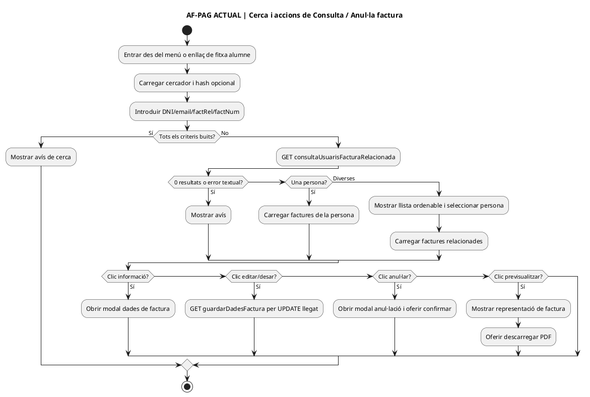
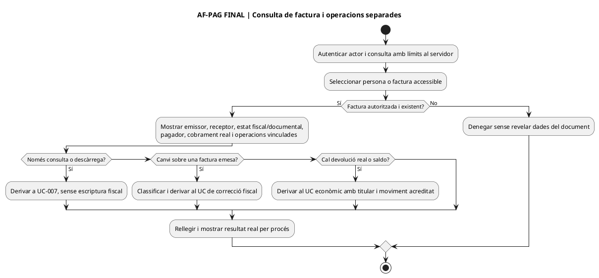
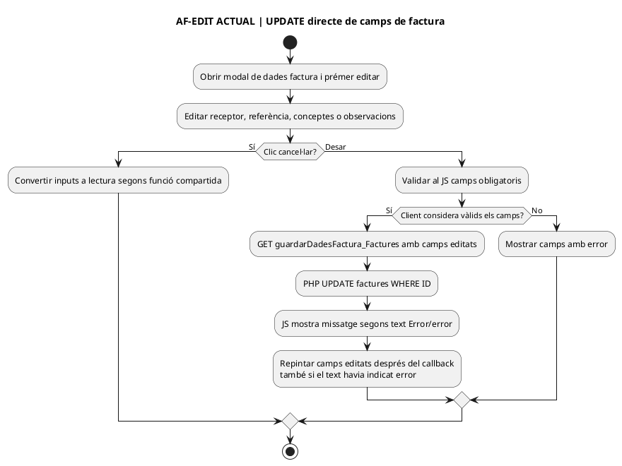
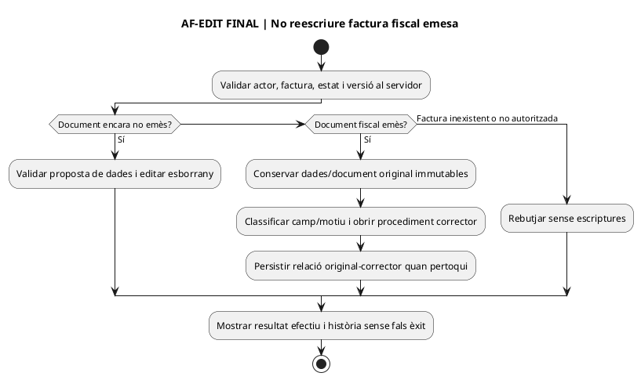
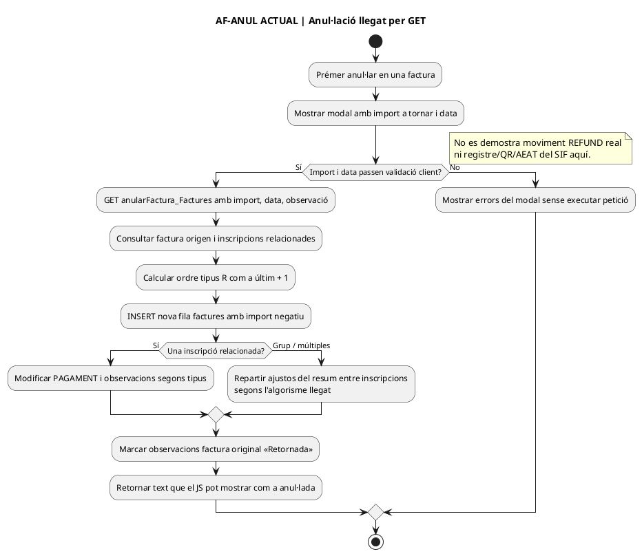
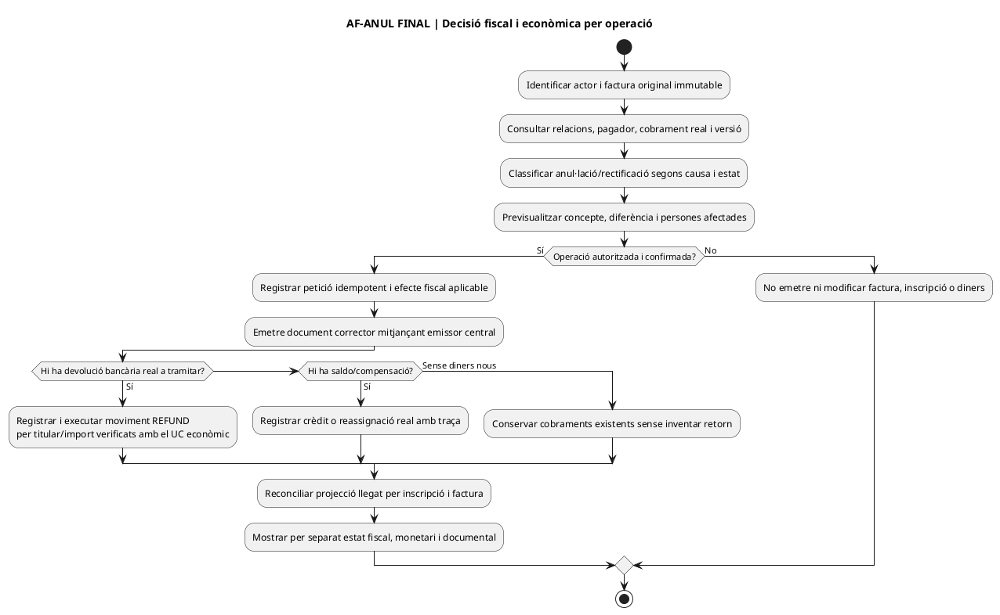
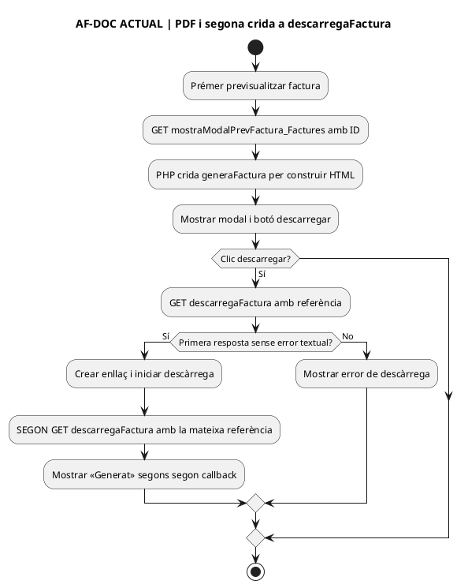
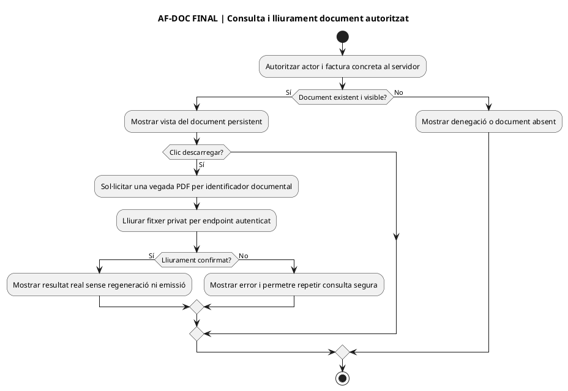

# Auditoria funcional de la pantalla «Consulta / Anul·la factura» — lot inicial

**Ruta UI:** `/alumnes/factura/`; **entrada des de la fitxa alumne:** clic al camp de factura del modal, que navega a `/alumnes/factura/#/factRel/...`. **Font:** tall GitHub `main` `1001d37cbc84d0241b57f58a1153c5c59567237e`; [pàgina PHP](../../codi-drive/intranet-actual/alumnes-factura.php), [JS de la pàgina](../../codi-drive/intranet-actual/js/alumnes-factura.js), [classe llegat `Intranet.php`](../../codi-drive/intranet-actual/Intranet.php) i wrappers [`ajax/alumnes/`](../../codi-drive/intranet-actual/ajax/alumnes/). **Abast:** lectura estàtica de codi versionat de la intranet principal; no són captures d'aquesta pantalla, prova del JS efectivament servit, lectura de BD real ni test de producció. Les 7 captures rebudes anteriorment són **de la fitxa alumne**, no d'aquest mòdul. Cap dada privada, número de factura real o PDF s'ha transcrit aquí. **No s'ha modificat codi executable.**

**Propietat funcional:** consulta i document UC-007; correcció d'una factura emesa UC-005 (i classificació UC-074 si escau en la matriu del projecte); devolució real UC-006/028; factures de grup UC-016 i fons per inscrit UC-105. La paraula llegat «anul·lar» i la denominació del mètode `anularFactura()` **no demostren per si soles que s'hagin creat la rectificativa, el moviment bancari, la cua AEAT o la cadena fiscal del SIF**.

## 1. Inventari d'accions identificades, per apartat

| ID | Acció de pantalla / precondició | Flux ACTUAL del JS/PHP | Diferència FINAL i prova necessària |
| --- | --- | --- | --- |
| AF-01 | Entrar, carregar cercador i obrir fitxa des d'un hash | [JS L1–46, L92–203](../../codi-drive/intranet-actual/js/alumnes-factura.js#L92-L203): `mostrarMain.php`, ompliment opcional de DNI, factura relacionada o número segons tipus de hash. Cerca per DNI/email/factura relacionada/número; si tots buits mostra error; GET `consultaUsuarisFacturaRelacionada.php`. | Autoritzar per actor i objecte al servidor; identificador de ruta no és permís; no incloure camps personals en logs/URL públiques. **AF-T01:** identificador inexistent i hash d'objecte no autoritzat. |
| AF-02 | Mostrar 0/1/diversos resultats, ordenar i seleccionar persona | [JS L147–179 i L213–286](../../codi-drive/intranet-actual/js/alumnes-factura.js#L147-L286) interpreta text de resposta i separa identificadors; una coincidència obre les factures; múltiples mostren `mostrarTaulaUsuaris2.php` i ordenació. **Error de control de volum:** `dnies.split('|') > 2000` compara un array amb un nombre en lloc d'utilitzar-ne la longitud. | Resultat tipificat, paginació/limitació al servidor i control de permisos per cada factura del llistat, amb titular diferent en grup. **AF-T02:** 0/1/diverses/més de 2000, resposta parcial i error servidor. |
| AF-03 | Consultar fitxa d'una factura de la llista | [JS L259–333](../../codi-drive/intranet-actual/js/alumnes-factura.js#L259-L333) carrega `mostrarTotesFacturesUsuari_Factures.php`; acció `.cns-informacio` obre `mostraModalConsultaInformacio_Factures.php`, que crida [`modalConsultaInformacio_Factures()` L14695–14810](../../codi-drive/intranet-actual/Intranet.php#L14695-L14810). Mostra camps de la factura i informació relacionada amb inscripcions. | Distingir factura original, document accessible, pagador, receptor, inscripcions i estat de cobrament real; **consulta no canvia document**. **AF-T03:** factura individual, grup, document absent i accés directe per identificador. |
| AF-04 | Editar, desar o cancel·lar camps de factura | [JS L338–522](../../codi-drive/intranet-actual/js/alumnes-factura.js#L338-L522) permet editar raó, identificació fiscal, adreça, concepte i referència; GET a [`guardarDadesFactura_Factures.php`](../../codi-drive/intranet-actual/ajax/alumnes/guardarDadesFactura_Factures.php), que invoca [`guardarDadesFactura_Factures()` L14811–14830](../../codi-drive/intranet-actual/Intranet.php#L14811-L14830) i executa **`updDadesFact`: UPDATE directe de `factures`** [SQL L1062](../../codi-drive/intranet-actual/Intranet.php#L1062-L1062). El JS decideix èxit per absència textual d'«Error/error» i, després del callback, repinta els valors editats encara que el missatge hagi estat d'error. `cancelEditarApartat()` s'ha de contrastar amb la prova de restauració d'originals. | **No aplicar UPDATE dels camps fiscals d'una factura emesa com si fos edició administrativa ordinària**; consultar estat i derivar canvi material al circuit fiscal aplicable, mantenint document/historial anterior. Validar rol, versió i resultat; POST amb camps limitats i respostes estructurades. **AF-T04:** canvi de receptor/concepte amb factura emesa, resposta d'error, cancel·lació i edició concurrent. |
| AF-05 | Obrir modal «Anul·lar factura» i validar import/data | [JS L529–634](../../codi-drive/intranet-actual/js/alumnes-factura.js#L529-L634): `.anula-factura` amb permís del navegador obre modal; import «a tornar», data i observacions; si camps passen validació client, **GET** `anularFactura_Factures.php` amb `id/tornar/dataAnulacio/obs`. El modal [`modalAnularFactura_Factures()` L14837–14918](../../codi-drive/intranet-actual/Intranet.php#L14837-L14918) mostra camps/observacions; un avís sobre factures amb múltiples inscripcions hi figura **comentat**, no s'ha d'atribuir com a text de pantalla. | Mostrar abans d'executar classe de correcció, efecte per factura/inscripció i distinció entre import fiscal, import cobrat i retorn bancari. Autorització/validació econòmica exclusivament al servidor i idempotència. **AF-T05:** import 0, negatiu, superior a ingressos, data invàlida, factura amb múltiples inscripcions. |
| AF-06 | Executar l'anul·lació llegat | [`anularFactura()` L14931–15193](../../codi-drive/intranet-actual/Intranet.php#L14931-L15193) obté l'original, pren **any fiscal de la data actual**, cerca darrer ordre per tipus `R` i calcula `últim+1`; fa `insertFacturaAut` a `factures` amb import negatiu del valor rebut [L14969–15023](../../codi-drive/intranet-actual/Intranet.php#L14969-L15023). Segons tipus de registre i nombre d'inscripcions, actualitza camps llegats `PAGAMENT`, dates/fraccionament i observacions [L15025–15164](../../codi-drive/intranet-actual/Intranet.php#L15025-L15164); finalment actualitza observacions de l'original [L15166–15192](../../codi-drive/intranet-actual/Intranet.php#L15166-L15192). **En aquest mètode no es veu una transacció conjunta, relectura d'import bancari real, clau d'idempotència, reserva atòmica de numeració SIF ni creació de moviment `REFUND`/registre AEAT.** Això no descarta que existeixin altres circuits del projecte. | Classificar el motiu i la relació amb factura original, generar només el document fiscal que pertoqui a través del servei emissor central, amb registre immutable i idempotent; decidir **separadament** devolució/saldo amb moviment bancari i pagador acreditats. Actualitzar el resum llegat com a projecció conciliada, no com a prova de retorn real; no alterar observacions fiscals de l'original com a substitut del document corrector. **AF-T06:** doble clic, dos operadors, error després d'INSERT abans de resum, pagament parcial, facturació de grup i no devolució. |
| AF-07 | Previsualitzar factura de la llista | [JS L635–656](../../codi-drive/intranet-actual/js/alumnes-factura.js#L635-L656): modal i HTML de `mostraModalPrevFactura_Factures.php`; [`modalPrevisualitzaFactura_Factures()` L15199–15221](../../codi-drive/intranet-actual/Intranet.php#L15199-L15221) cerca factura i crida `generaFactura(factRel,false)` per mostrar-la. Paginar la vista al navegador no prova emissió fiscal nova. | Mostrar el document emès immutable i el seu estat, distingir previsualitzar de generar/reemetre; comprovar permís del receptor. **AF-T07:** document original i corrector, absència de PDF i factura de pagador tercer. |
| AF-08 | Descarregar PDF des del modal | [JS L658–707](../../codi-drive/intranet-actual/js/alumnes-factura.js#L658-L707) fa GET a `descarregaFactura.php` i crea enllaç al resultat; **a continuació el JS fa una SEGONA petició al mateix `descarregaFactura.php`**, encara que el missatge d'error parli d'eliminar un temporal. En aquesta ruta no invoca `eliminarArxiu.php`. És una diferència comprovable respecte a la descàrrega de factura de la fitxa alumne, on es va detectar la variable `resD` incoherent. | Un únic servei de document autoritzat per objecte, amb nom/ubicació privada de temporal i neteja explícita controlada; segona crida no ha de regenerar el mateix PDF ni mostrar èxit si el navegador no l'ha rebut. **AF-T08:** una descàrrega genera un lliurament, no dos; error de la segona petició, accés no autoritzat i PDF absent. |

**Regla de traçabilitat:** aquestes vuit accions són de la pantalla `alumnes-factura.php`; la consulta/modal de factura dins `alumnes-mostrar-alumne.php` és una altra UI. Tant `anularFactura()` com `guardarDadesFactura_Factures()` són **codi llegat**, no prova que el flux fiscal SIF final ja estigui connectat a aquesta pàgina. Ni l'avís visual «Factura anul·lada!» ni reduir `PAGAMENT` certifiquen un retorn bancari.

## 2. Diagrames d'activitat per pantalla i acció

### AF-PAG — ACTUAL: cerca, llistat i modals

### AF-PAG — FINAL: cerca autoritzada i derivació de fluxos

### AF-EDIT — ACTUAL: editar dades de factura llegat

### AF-EDIT — FINAL: separar correcció i edició administrativa

### AF-ANUL — ACTUAL: modal, factura negativa i resum llegat

### AF-ANUL — FINAL: classificar efecte fiscal i diners

### AF-DOC — ACTUAL: previsualització i descàrrega doble

### AF-DOC — FINAL: document únic, protegit i recuperable

## 3. Classificació de l'estat i límits

**Acreditat amb codi:** punts de clic JS, wrappers PHP, mètodes de consulta, UPDATE de camps fiscals a la taula llegada, INSERT de fila negativa, escriptures de resum per tipus d'inscripció i crides de previsualització/descàrrega. **No acreditat:** captures de la pantalla de facturació, valor real desat a BD, instal·lació del SIF en aquesta ruta, resultat bancari, connexió AEAT, permisos efectius en tots els endpoints i proves de concurrència. Les comprovacions del navegador `tePermisEdicio` no substitueixen l'autorització al servidor. No executar una anul·lació en producció per obtenir una captura.

**Diferències d'implementació prioritàries:** substituir el desament directe de camps fiscals emesos pel procediment de correcció aplicable; impedir que «Anul·lar» equipari import escrit al formulari amb diners realment retornats; centralitzar l'emissió i la numeració amb idempotència/versions i controlar fallades entre fases; resoldre l'algorisme d'assignació per grup/packs segons fons i receptor real; separar consulta de PDF i la neteja de temporals. **Aquestes són tasques documentades, no correccions executades.** Les proves de correus i Moodle no són necessàries per documentar aquesta pantalla; no se n'han fet.

**Relacions:** [UC-007 consulta factura](uc-007-consultar-factura-estat-document.md), [UC-005 rectificar factura](uc-005-rectificar-factura.md), [UC-006 devolució o saldo](uc-006-devolucio-saldo-compensacio.md), [UC-028 registrar devolució](uc-028-registrar-devolucio.md), [UC-016 facturar grup](uc-016-facturar-grup.md), [UC-105 traçar moviments d'inscripció](uc-105-traçar-fons-per-inscripcio.md). [Inventari anterior de «Consulta - Modifica alumne»](01-tancament-documental-pantalla-alumnes-consulta-modifica-2026-09-23.md) és un document diferent: aquí s'amplia la navegació AL-16 i **no** es reobre la fitxa completa d'alumnes.
