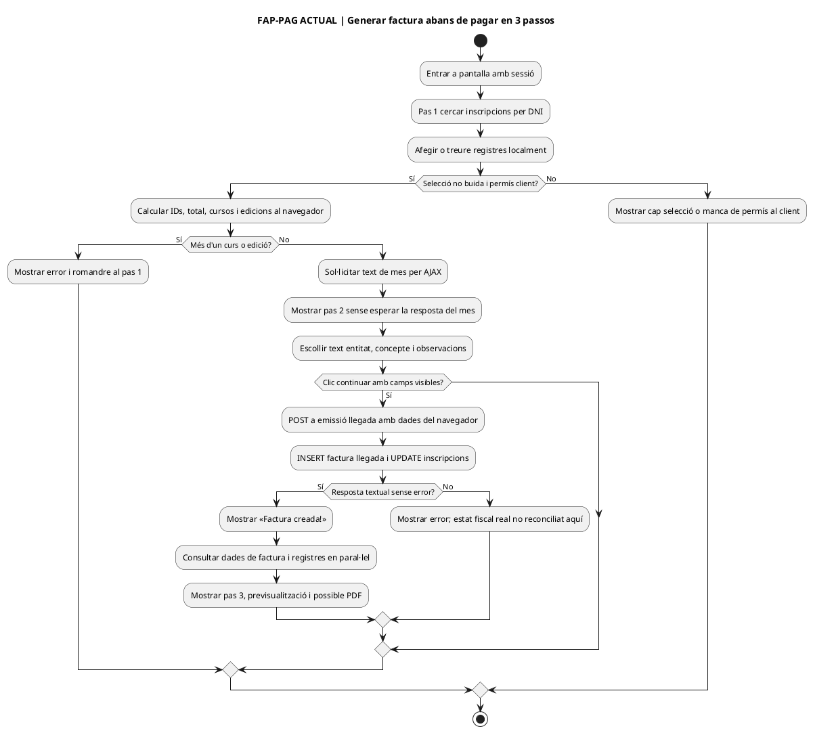
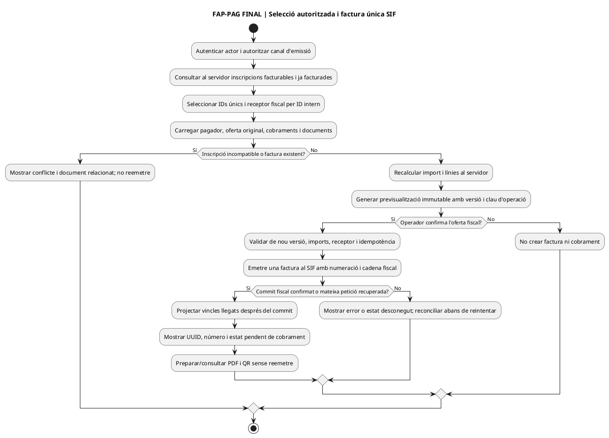
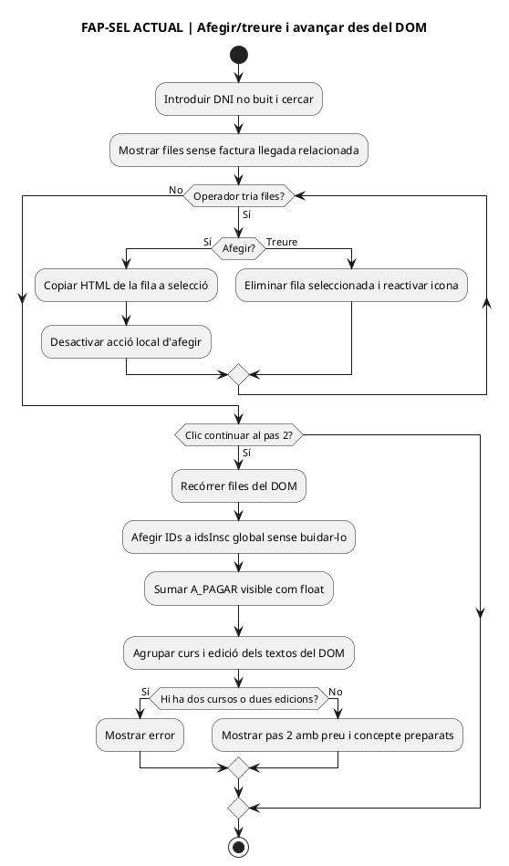
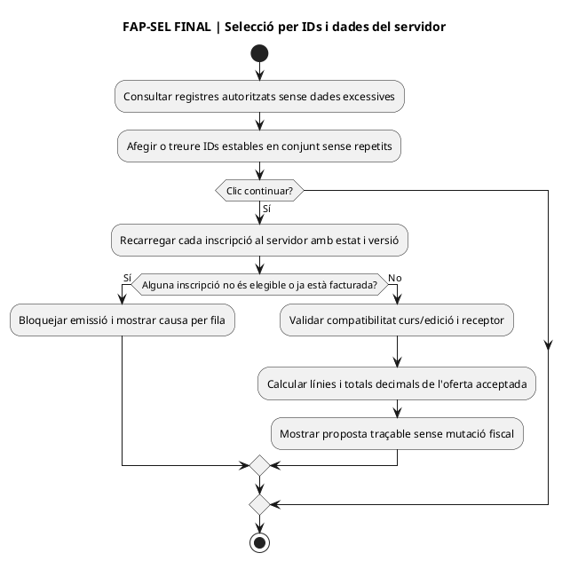
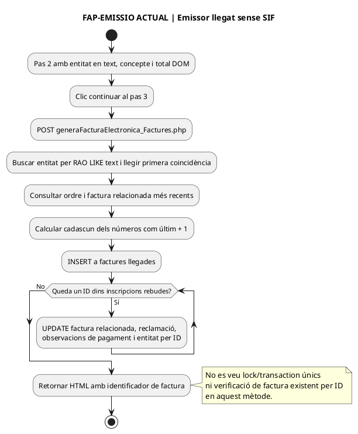
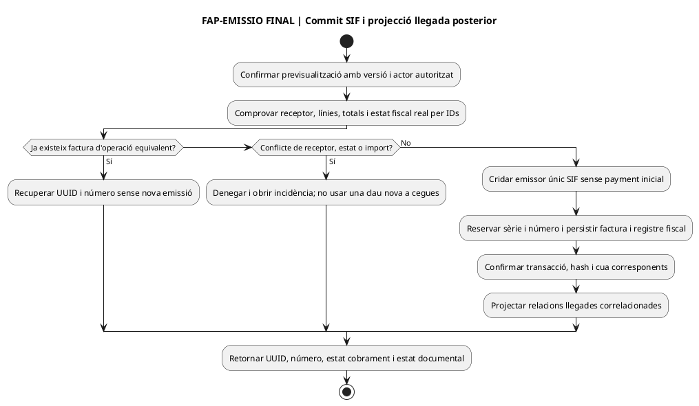
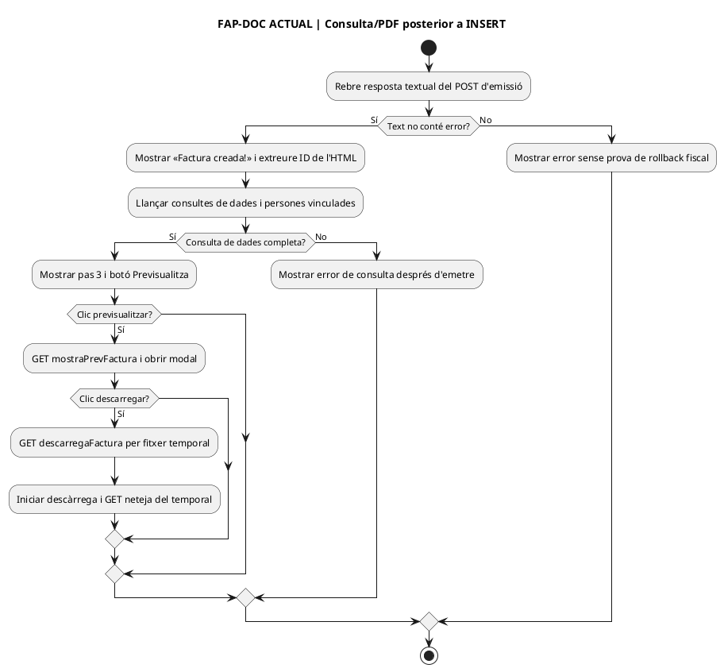
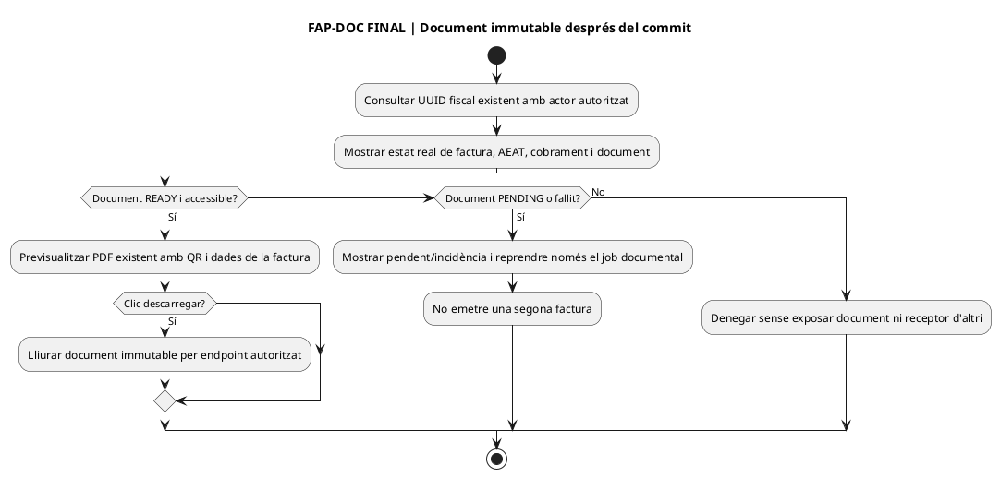

# Auditoria de pantalla — Alumnes / Generar factura abans de pagar

**Data del contrast:** 25/09/2026. **Pantalla:** `/alumnes/genera-factura-abans-pagar/`, corresponent al PHP [`alumnes-genera-factura-abans-pagar.php`](../../codi-drive/intranet-actual/alumnes-genera-factura-abans-pagar.php). **Fonts:** [JS de pantalla](../../codi-drive/intranet-actual/js/alumnes-genera-factura-abans-pagar.js) del `main` (SHA de fitxer `7ed2f0a013c0e42c566a1a650bbfed4c77e866e0`), wrappers AJAX i [`Intranet.php` L13175–13509](../../codi-drive/intranet-actual/Intranet.php#L13175-L13509) (blob `9604cb855a3381dde85def2574b3bc843dbfc2fe`). **Evidència:** lectura estàtica; no s'han aportat captures d'aquesta pantalla, executat l'emissió, comprovat la versió desplegada, inspeccionat BD productiva ni alterat codi de producció. La vinculació amb el nou SIF és DISSENY/PENDENT, encara que els serveis fiscals existents es descriguin a [UC-004](uc-004-emetre-factura-abans-cobrar.md). Aquesta pàgina **selecciona inscripcions existents; no crea inscripcions noves**.

## 1. Fitxes funcionals de cada acció i rastre del codi ACTUAL

| Acció real | Precondició/entrada i resultat ACTUAL verificat | Diferència FINAL i prova |
| --- | --- | --- |
| FAP-01 · Cercar inscripcions | [JS L77–110](../../codi-drive/intranet-actual/js/alumnes-genera-factura-abans-pagar.js#L77-L110): cerca per DNI/NIE no buit via GET `mostrarInformacioInscripcio_generaFactura.php`. [`Intranet.php` L13175–13236](../../codi-drive/intranet-actual/Intranet.php#L13175-L13236) utilitza `buscarInfoInscDniData`: retorna inscripcions per DNI **amb `FACTURA_RELACIONADA` nul·la o buida** i dades de curs; mostra icona afegir, `A_PAGAR` i `IDPAG`. No es prova dret d'accés per objecte només per disposar d'una sessió. | Autoritzar actor i inscripcions per ID al backend, revelar dades mínimes, comprovar factura fiscal real/relacions (no només el camp llegat nul), i retornar errors estructurats. **FAP-T01:** sense criteri, ID aliè, camp llegat desincronitzat i inscripció ja facturada. |
| FAP-02 · Afegir/treure inscripció | [JS L113–192](../../codi-drive/intranet-actual/js/alumnes-genera-factura-abans-pagar.js#L113-L192) copia cel·les HTML a una taula de selecció i desactiva/restitueix l'acció d'afegir segons la fila. **Afegir i treure són canvis locals de pantalla**, no actualitzen encara `inscripcions` ni generen factura. | Conservar selecció per IDs estables i únics, actualitzar estat de botó sense confiar en text/HTML del DOM, tornar a validar totes les inscripcions en continuar. **FAP-T02:** afegir, treure, afegir de nou, dos clics i selecció d'una fila que canvia d'estat. |
| FAP-03 · Continuar del pas 1 al pas 2 | [JS L203–331](../../codi-drive/intranet-actual/js/alumnes-genera-factura-abans-pagar.js#L203-L331): només segueix si hi ha taula seleccionada i `tePermisEdicio` al client, suma els `A_PAGAR` visibles de l'HTML amb `parseFloat`, agrupa cursos i edicions, i rebutja **més d'un curs o d'una edició**. La variable `idsInsc` s'inicialitza globalment però **no es buida en aquest handler**: si el pas es recalcula, pot acumular IDs repetits. Forma `concepte1` amb text de curs/participants i sol·licita asíncronament el text de mes per a `concepte2`; mostra pas 2 sense esperar el callback de data. | Validar unicitat, estat i compatibilitat d'edició al servidor, import per components amb decimals, imports ja cobrats i referències de factures existents. Generar concepte determinista abans de permetre confirmació. **FAP-T03:** anar endavant/enrere i repetir pas, dues inscripcions del mateix curs, dues edicions, import HTML manipulat i retard de resposta de data. |
| FAP-04 · Seleccionar receptor i preparar emissió | [JS L340–361](../../codi-drive/intranet-actual/js/alumnes-genera-factura-abans-pagar.js#L340-L361): comprova que hi hagi **text** d'entitat, concepte1 i preu visible; envia POST a `generaFacturaElectronica_Factures.php` amb `empresa=entitatMarcada`, conceptes, `preuTotal` i JSON de cursos, edicions i IDs extrets del navegador. [PHP wrapper](../../codi-drive/intranet-actual/ajax/alumnes/generaFacturaElectronica_Factures.php) els trasllada a `generarFacturaElectronica_Alumnes()`. No existeix un pas de previsualització fiscal **anterior** a aquest POST en el recorregut JS revisat: el botó que passa al tercer pas ja inicia l'emissió llegada. | Seleccionar **ID fiscal d'entitat**, resoldre receptor i dades vigents al servidor, reconstruir oferta/total i mostrar previsualització amb confirmació explícita **abans del commit fiscal**. **FAP-T04:** entitats amb raó social igual/similar, canvi de receptor i import/concepte manipulats. |
| FAP-05 · Crear la factura llegada i vincular altes | [`Intranet.php` L13255–13372](../../codi-drive/intranet-actual/Intranet.php#L13255-L13372) resol entitat amb `buscarEntitat` per **`RAO LIKE ?`** i consumeix la primera fila; calcula `ordre` amb `buscarLastOrdreFact` i `factura_relacionada` amb `buscarLastFact` (**últim + 1**), fa INSERT a `factures` i després UPDATE `inscripcions.FACTURA_RELACIONADA`, `reclamat`, `pag_observacions` i `ENTITAT` per cadascun dels IDs rebuts. Els UPDATE no inclouen condició `FACTURA_RELACIONADA IS NULL` al SQL, i el mètode no mostra una transacció/lock únics entre selecció, número, INSERT i tots els UPDATE. No verifica en aquest mètode que la selecció siga del mateix curs/edició, ni recalcula el total d'una font de preus al servidor. **Això és un flux emissor fiscal llegat independent del SIF**; no afirmar que és només simulació. | Un únic emisor SIF, autorització d'inscripcions/receptor, valoració i estat econòmic rellegits, comprovació de document existent, clau idempotent derivada d'operació, reserva fiscal transaccional de numeració, snapshot de línies/receptor i relacions per ID, i cap pagament fictici en emetre. Projecció llegada només **després** de confirmar el SIF. **FAP-T05:** dues emissions simultànies, reintent amb mateixa/una altra clau, fallada al segon UPDATE i inscripció ja facturada. |
| FAP-06 · Consultar resultat, persones vinculades, vista i PDF | [JS L365–553](../../codi-drive/intranet-actual/js/alumnes-genera-factura-abans-pagar.js#L365-L553) mostra «Factura creada!» si la resposta textual no conté «error»; extreu l'ID d'HTML i llança en paral·lel dues consultes POST per dades de factura i inscripcions. [`Intranet.php` L13380–13509](../../codi-drive/intranet-actual/Intranet.php#L13380-L13509) construeix les taules de consulta. La previsualització de la factura s'obre **després d'emetre** i el botó de descàrrega crida `descarregaFactura.php` amb fitxer temporal i neteja posterior. Una fallada de consulta/PDF no prova que l'INSERT anterior s'hagi revertit. | Resultat estructurat fiscal/estat de cobrament/estat documental per UUID, consulta per autorització, vista de PDF existent amb custòdia immutable i recuperació del job documental sense emetre segona factura. **FAP-T06:** emissió confirmada seguida d'error a la vista o document, doble clic i factura amb cobrament posterior. |

**Contrast SQL:** [`buscarInfoInscDniData` L177–183](../../codi-drive/intranet-actual/Intranet.php#L177-L183) filtra els registres disponibles pel camp de factura llegat; [`buscarLastOrdreFact`/`buscarLastFact` L358–361](../../codi-drive/intranet-actual/Intranet.php#L358-L361) llegeixen la darrera numeració; [`insertFactura` L1019–1023](../../codi-drive/intranet-actual/Intranet.php#L1019-L1023) insereix `factures`; [`updInscFacturaPrePag` L1049–1050](../../codi-drive/intranet-actual/Intranet.php#L1049-L1050) és UPDATE per ID sense condició de no facturat. La lectura estàtica del mètode no demostra si un nivell extern ha obert una transacció, si hi ha índexos únics addicionals o si el desplegament ja talla el circuit llegat: comprovar-ho abans d'afirmar efectes observats a BD.

## 2. Diagrames d'activitat de la pàgina i dels passos — ACTUAL versus FINAL

### FAP-PAG · Pàgina completa — ACTUAL

### FAP-PAG · Pàgina completa — FINAL

### FAP-SEL · Selecció i validació de curs/edició — ACTUAL

### FAP-SEL · Selecció i validació — FINAL

### FAP-EMISSIO · Confirmar factura a empresa — ACTUAL

### FAP-EMISSIO · Confirmar factura — FINAL

### FAP-DOC · Consultar factura ja emesa — ACTUAL

### FAP-DOC · Consultar factura — FINAL

## 3. Decisions de negoci existents i límits d'aquesta pantalla

La factura prèvia per empresa es pot emetre **abans d'ingressar diners**; això no equival a marcar les inscripcions com a cobrades. Si el pagament arriba més tard, registrar el fet bancari una vegada i **assignar-lo a la factura ja emesa**, amb detall per inscripció i titular; no generar una nova factura. Si es canvia curs/edició entre emissió i cobrament, consultar la fotografia fiscal original i classificar la correcció pertinent abans de reassignar diners. No s'inventa aquí una política d'agrupar cursos diferents: el formulari llegat els rebutja, i una eventual ampliació s'ha de decidir/implementar com a variant explícita, no assumir-la.

**No s'ha verificat el desplegament de l'adaptador intranet → SIF**; [UC-004](uc-004-emetre-factura-abans-cobrar.md) descriu els serveis que existeixen i els passos d'integració pendents. Aquest lot no implica treball sobre Moodle o lliurament de correus, ni executa proves d'aquestes integracions. Les proves FAP-T01–06 són **casos definits i NO executats**, a fer en entorn de dades sintètiques i mai provocant una emissió fiscal real només per provar el botó.

## 4. Estat i treball pendent ordenat

**Documentat al codi del tall indicat:** cerca/filtre, selecció, edició local, progressió pas 1→2, tria de receptor per text, POST emissor llegat, dues consultes després de l'emissió i previsualització/descàrrega posteriors. **No acreditat:** captura i asset servit de la pàgina, controls d'autorització per ID en cada AJAX, receptor correcte quan hi ha homònims, integritat del total i de totes les línies contra la BD, idempotència funcional per inscripció, numeració central aplicant SIF, migracions/proves executades i resultat fiscal real. Els tres passos estan representats per parells de diagrames ACTUAL/FINAL, sense donar per tancada implementació ni producció.

**Canvis executius a portar a backlog:** tallar l'INSERT fiscal llegat d'aquest endpoint i redirigir cap a emissor SIF únic; previsualitzar abans d'emetre, resoldre l'entitat per ID i snapshot, netejar selecció en cada reentrada, validar elegibilitat i total al backend, crear correlació fiscal per inscrit, gestionar error de projecció llegada posterior al commit, i distingir consulta/descàrrega d'emissió. No canviar el codi live d'aquesta pantalla fins tenir pla de migració i proves de concurrència/document fiscal.
