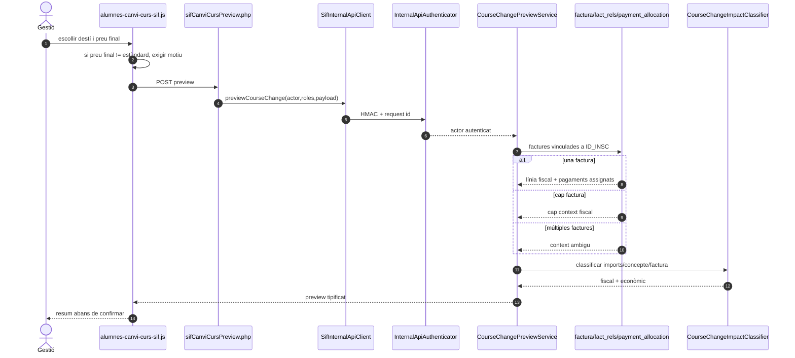

# UC-071 · Disseny i implementació de la nova interfície de canvi de curs

**Data de tall:** 2026-09-29  
**Branca:** `feature/uc-071-canvi-curs-preu-2026-09-29`  
**Estat:** `PREVIEW_SIF_IMPLEMENTAT` · `UI_FEATURE_FLAG` · `PREFLIGHT_SERVIDOR_FEATURE_FLAG` · `EXECUCIO_RECTIFICATIVA_PENDENT_UC-005/074`

## 1. Objectiu

La pantalla «Canvi de curs» deixa de tractar el nou `A_PAGAR` com un simple camp editable. La interfície separa:

1. **destinació acadèmica**: curs/edició origen i destí;
2. **preu estàndard calculat** del curs de destinació;
3. **preu final proposat**, que pot coincidir amb l'estàndard o ser un preu manual;
4. **motiu específic del preu manual**, independent del motiu del canvi de curs;
5. **despeses de gestió**;
6. **diners realment atribuïts** quan el SIF té una factura/pagament relacionat;
7. **proposta de tractament fiscal**;
8. **impacte econòmic**: sense diferència, pendent de cobrar o excés a resoldre.

La previsualització **no** registra per si mateixa factura, rectificativa, cobrament, devolució ni saldo.

## 2. Casos que ha de distingir la UI

| Curs / preu final | Factura emesa | Proposta fiscal | Impacte econòmic possible |
| --- | --- | --- | --- |
| Mateix servei, mateix import | No | `NONE` | segons diners reals |
| Mateix servei, mateix import | Sí | `NONE` | segons diners reals |
| Mateix servei, import superior | Sí | `RECTIFY_DIFFERENCE` | `AMOUNT_DUE` si falta cobrar |
| Mateix servei, import inferior | Sí | `RECTIFY_DIFFERENCE` | `EXCESS_TO_RESOLVE` si hi ha més diners atribuïts |
| Curs/concepte diferent, mateix import | Sí | `RECTIFY_AND_REISSUE` | pot ser `NONE` |
| Curs/concepte diferent, import superior/inferior | Sí | `RECTIFY_AND_REISSUE` | pendent o excés segons diners reals |
| Qualsevol cas amb >1 factura SIF relacionada | Sí | `REVIEW_REQUIRED` | no confirmar automàticament |
| Sense factura | No | `NONE` | no inventar una rectificativa |

`RECTIFY_AND_REISSUE` és la política interna que deriva a la via de rectificació per substitució/reemissió d'UC-005/074. No s'ha d'interpretar com una emissió automàtica des de la pantalla UC-071.

## 3. Preu manual

El sistema conserva l'opció actual de modificar el que s'hauria de pagar, però amb un contracte explícit:

- **preu estàndard**: valor calculat pel backend llegat per curs/edició/descompte;
- **preu final**: valor que l'operador vol aplicar;
- si són diferents, `pricing_mode=MANUAL`;
- un preu manual **requereix `manual_price_reason`**;
- el motiu del preu manual no substitueix el `motiu-canvi` acadèmic;
- el SIF retorna el delta respecte de l'import original i l'impacte econòmic;
- l'existència d'un preu manual no prova cap cobrament ni devolució.

Exemples:

| Original | Estàndard destí | Final | Mode | Relació |
| ---: | ---: | ---: | --- | --- |
| 100,00 | 100,00 | 100,00 | STANDARD | SAME |
| 100,00 | 130,00 | 130,00 | STANDARD | HIGHER |
| 100,00 | 80,00 | 80,00 | STANDARD | LOWER |
| 100,00 | 130,00 | 115,00 | MANUAL | HIGHER |
| 100,00 | 80,00 | 70,00 | MANUAL | LOWER |
| 100,00 | 120,00 | 100,00 | MANUAL | SAME |

## 4. Fonts monetàries

La previsualització intenta evitar que els imports de la URL/navegador esdevinguin autoritatius.

### Si hi ha una única factura SIF vinculada a `ID_INSC`

- import original: línia SIF relacionada amb la inscripció; si no es pot resoldre i només hi ha una inscripció vinculada, total de factura;
- pagat: suma d'assignacions `CHARGE` confirmades menys `REFUND` confirmats;
- la UI rep `original_amount_source=SIF_INVOICE_LINE|SIF_INVOICE_TOTAL`;
- la UI rep `paid_amount_source=SIF_PAYMENT_ALLOCATION`.

### Si no hi ha factura SIF

La previsualització conserva els valors llegats com a informació operativa, però la classificació fiscal és `NONE`.

### Si hi ha múltiples factures SIF

La previsualització retorna:

- `invoice_resolution=MULTIPLE`;
- `fiscal_decision=REVIEW_REQUIRED`;
- `can_confirm_legacy_change=false`.

No es tria automàticament una factura només perquè sigui la més recent.

## 5. Càlcul econòmic

```text
effective_target_amount =
    proposed_target_amount ?? standard_target_amount

target_total =
    effective_target_amount + management_fee

si paid_amount < target_total:
    AMOUNT_DUE = target_total - paid_amount

si paid_amount = target_total:
    NONE

si paid_amount > target_total:
    EXCESS_TO_RESOLVE = paid_amount - target_total
```

`EXCESS_TO_RESOLVE` **no és sinònim de refund**. La resolució posterior pot ser retorn real UC-028, saldo UC-029, reassignació UC-105 o una altra decisió justificada.

## 6. Classificació fiscal implementada a la previsualització

```text
si no existeix factura SIF:
    NONE

si existeix una factura i canvia el servei/concepte:
    RECTIFY_AND_REISSUE

si existeix una factura, no canvia el servei/concepte
i canvia l'import total:
    RECTIFY_DIFFERENCE

si existeix una factura, mateix servei/concepte i mateix import:
    NONE

si existeixen múltiples factures:
    REVIEW_REQUIRED
```

La classificació és una **proposta de procés** que UC-074 ha de convertir en la decisió fiscal executable. La pantalla no modifica `factura.TOTAL` ni cap PDF emès.

## 7. Interfície implementada

Fitxer nou:

- `codi-drive/intranet-actual/js/alumnes-canvi-curs-sif.js`

La UI:

- mostra «Preu calculat del curs»;
- manté **`Pagat` com a camp de només lectura**: el valor es rellegeix del SIF i, si no hi ha factura SIF, del llegat servidor;
- recalcula visualment `Pendent` amb el `paid_amount` retornat pel SIF/servidor;
- detecta si `#apagar-nou-registre` s'ha separat del preu calculat;
- obre «Motiu de modificació manual del preu» només quan cal;
- abans de «Previsualitza el canvi» demana classificació al SIF;
- mostra preu origen, estàndard, final, despeses i total;
- mostra SAME/HIGHER/LOWER;
- mostra la proposta fiscal amb text comprensible;
- mostra pendent o excés;
- incorpora el resum SIF al modal final de confirmació;
- converteix la confirmació final a **POST** quan la nova UI està activa, evitant posar imports i motius a la URL;
- bloqueja confirmació automàtica quan el SIF detecta múltiples factures.

La pantalla principal carrega aquest fitxer només amb:

`SIF_COURSE_CHANGE_UI_ENABLED=1`.

## 8. Preflight servidor abans del canvi llegat

Quan `SIF_COURSE_CHANGE_PREVIEW_ENFORCED=1`, `realitzarCanviCurs_CanviCurs.php`:

1. extreu actor i rols de la sessió;
2. recalcula al servidor el preu estàndard de destinació amb `buscarPreuAPagar_modalCanviCurs()`;
3. envia al SIF preu original, estàndard, final, despeses, curs origen/destí i motiu de preu manual;
4. el SIF substitueix import original/pagat pels valors SIF quan existeix una única factura; el wrapper també rellegeix origen i `PAGAMENT` des de BD llegada en absència de SIF, de manera que el navegador no pot imposar un import ja pagat;
5. compara la decisió recalculada amb la vista just abans de confirmar;
6. si la decisió ha canviat o el cas és ambigu, **no executa** `realitzarCanviCurs_modalCanviCurs()`;
7. el wrapper accepta POST per la ruta nova i conserva GET únicament com a compatibilitat del flux llegat mentre dura la migració.

Aquesta capa encara no converteix el PHP llegat en una transacció distribuïda ni resol Moodle/correu.

## 9. Components SIF creats

| Component | Estat | Responsabilitat |
| --- | --- | --- |
| `CourseChangeImpactClassifier` | IMPLEMENTAT | Aritmètica en cèntims, preu manual, SAME/HIGHER/LOWER, fiscal i econòmic |
| `CourseChangePreviewService` | IMPLEMENTAT | Context de factura i pagaments SIF per `ID_INSC` |
| `CourseChangePreviewGateway` | IMPLEMENTAT | Autorització per rols del servidor |
| `/api/course-changes/preview.php` | IMPLEMENTAT | Endpoint intern HMAC |
| `sifCanviCursPreview.php` | IMPLEMENTAT | Pont Intranet → SIF |
| `SifInternalApiClient::previewCourseChange()` | IMPLEMENTAT | Crida server-to-server signada |
| `CourseChangeImpactClassifierTest` | ESCRIT | Matriu d'import/fiscal/econòmic |
| `CourseChangePreviewServiceTest` | ESCRIT | Factura/línia/pagament real i múltiples factures |

## 10. Diagrama de classes

```mermaid
classDiagram
direction LR
class AlumnesCanviCursSifJs {
 <<JS IMPLEMENTAT · feature flag>>
 +preview()
 +renderPreview()
 +requireManualPriceReason()
}
class SifCanviCursPreviewBridge {
 <<PHP IMPLEMENTAT>>
}
class SifInternalApiClient {
 <<PHP IMPLEMENTAT>>
 +previewCourseChange(actor,roles,payload) array
}
class InternalApiAuthenticator {
 <<PHP EXISTENT>>
 +authenticate(...) actor
}
class CourseChangePreviewGateway {
 <<PHP IMPLEMENTAT>>
 +preview(actor,payload) array
}
class CourseChangePreviewService {
 <<PHP IMPLEMENTAT>>
 +preview(input) array
}
class CourseChangeImpactClassifier {
 <<PHP IMPLEMENTAT>>
 +classify(input) array
}
class InvoiceReadRepository {
 <<PHP EXISTENT>>
}
class LegacyCourseChangeExecutor {
 <<LLEGAT EXISTENT>>
 +realitzarCanviCurs_modalCanviCurs(...)
}
class CourseChangeCoordinator {
 <<FINAL PENDENT>>
 +confirm(command) result
}
AlumnesCanviCursSifJs --> SifCanviCursPreviewBridge
SifCanviCursPreviewBridge --> SifInternalApiClient
SifInternalApiClient --> InternalApiAuthenticator : endpoint SIF
InternalApiAuthenticator --> CourseChangePreviewGateway
CourseChangePreviewGateway --> CourseChangePreviewService
CourseChangePreviewService --> InvoiceReadRepository
CourseChangePreviewService --> CourseChangeImpactClassifier
SifCanviCursPreviewBridge ..> LegacyCourseChangeExecutor : preflight abans de l'executor
CourseChangeCoordinator ..> CourseChangePreviewService
```



## 11. Seqüència implementada de previsualització



## 12. Seqüència del preflight obligatori

```mermaid
sequenceDiagram
autonumber
actor O as Gestió
participant UI as Modal confirmació
participant W as realitzarCanviCurs_CanviCurs.php
participant L as Intranet llegat
participant S as SIF preview
participant E as realitzarCanviCurs_modalCanviCurs()
O->>UI: Confirmar
UI->>W: petició llegat + decisions que s'havien mostrat
W->>L: recalcular preu estàndard destí
L-->>W: preu autoritatiu llegat
W->>S: recalcular preview amb actor/rol
S-->>W: decisió actual
alt canvi de decisió / múltiples factures / preu manual sense motiu
 W-->>UI: error; no executar canvi
else preflight consistent
 W->>E: executar circuit llegat existent
 E-->>UI: resultat llegat
end
```

## 13. Què continua pendent

### P0 abans d'activar a producció

- executar els tests en MySQL aïllat;
- provar UI amb dades sintètiques;
- confirmar els noms de rols que poden previsualitzar/confirmar;
- verificar que `buscarPreuAPagar_modalCanviCurs()` retorna únicament el valor monetari esperat a tots els tipus de descompte;
- verificar que `Pagat` no es pot editar a la UI nova i que `Pendent` coincideix amb la relectura SIF/llegat;
- verificar l'asset real desplegat i els dos feature flags.

### P1 per completar UC-071

- substituir definitivament el GET compatible de l'executor llegat per un comandament POST autenticat amb protecció CSRF/anti-replay d'usuari;
- substituir l'executor llegat per `CourseChangeCoordinator`;
- persistir `course_change_event` de forma idempotent;
- implementar ledger `enrollment_fund_movement`;
- executar UC-005/074 segons la decisió fiscal;
- emetre rectificativa per diferència o substitució només després de confirmació;
- crear nova factura quan correspongui;
- registrar `AMOUNT_DUE` sense `CHARGE`;
- resoldre `EXCESS_TO_RESOLVE` via refund/saldo/reassignació;
- conservar cadena A→B→C i reversions.

## 14. Fonts normatives utilitzades per la classificació

- BOE, RD 1619/2012, art. 15: la factura rectificativa expressa la rectificació i pot consignar directament l'import rectificat o els imports resultants indicant la rectificació.
- AEAT, FAQ de facturació/IVA: la rectificació es pot registrar per **substitució** o per **diferències**; en diferències s'informa directament de l'import de la rectificació.
- AEAT, FAQ VERI*FACTU de procediments de facturació: diferencia el tractament de rectificació per substitució i per diferències.

Aquestes fonts donen suport a separar tècnicament els dos modes. La regla «canvi de concepte → proposar substitució/reemissió» és una decisió de disseny conservadora del projecte i ha de continuar passant per UC-074 abans d'emetre.
