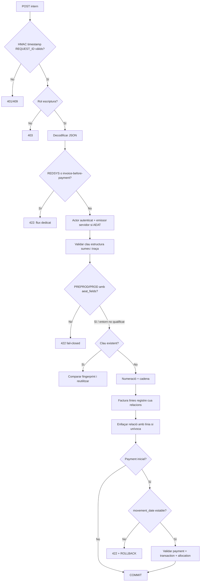
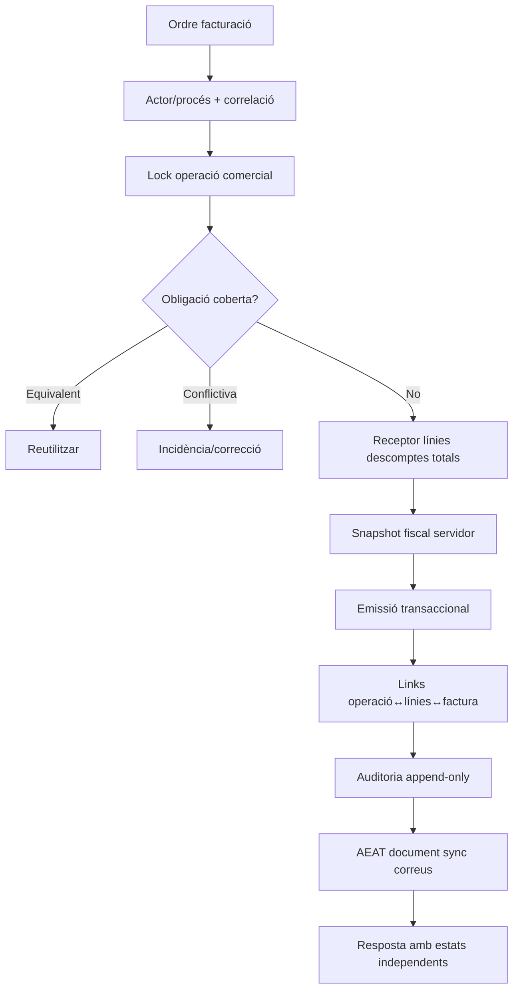
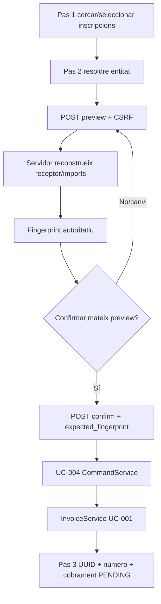

# UC-001 · Activitats i superfícies ACTUAL / FINAL

## 1. Superfícies

| ID | Superfície | ACTUAL | FINAL / límit |
| --- | --- | --- | --- |
| P-UC001-01 | `/api/factures/issue.php` | POST intern signat, rol, actor servidor, no Redsys/no UC-004; emissor/SistemaInformatico server-owned, resposta d’estats i traça append-only. | Operació comercial transversal i desglossament fiscal complet generat pels builders. |
| P-UC001-02 | `/api/factures/before-payment.php` | UC-004 amb auth, rol, selecció servidor i coverage. | No saltar-lo via P-UC001-01. |
| P-UC001-03 | Worker Redsys | Handlers especialitzats després de callback/intenció validats. | Coherència intent↔snapshot i fencing. |
| P-UC001-04 | Serveis manuals | Builders + idempotència del nucli. | Identificador d'operació comercial independent. |
| P-UC001-05 | Cua/worker AEAT | Procés postcommit separat, `aeat_submission_attempt`, fencing `CLAIM_TOKEN`, `REVIEW` i reconciliació sense reenviament cec. | Resolució operativa dels casos realment `UNCERTAIN`. |
| P-UC001-06 | `alumnes-factura.php` | Consulta SIF read-only + fallback llegat; mutacions llegades amb guards. | Activar/provar flags de cutover; correccions SIF per flux dedicat. |
| P-UC001-07 | `alumnes-genera-factura-abans-pagar.php` | UC-004: selecció, preview/fingerprint, confirmació i resultat. | UC-004 prepara l’ordre; UC-001 emet/reutilitza. |

## 2. Activitat ACTUAL del generic endpoint

## 3. Activitat FINAL comuna

El FINAL continua parcial: audit writer i projecció d’estats ja són ACTUAL; resten cobertura comercial transversal, links d’operació↔línia i assembler fiscal servidor complet.

## 4. Activitats ACTUAL per pàgina i apartat real

### 4.1. `alumnes-factura.php`

| Apartat | Codi real | ACTUAL | FINAL / criteri |
| --- | --- | --- | --- |
| Cerca | `alumnes-factura.js` → `sifFactures.php` | POST SIF read-only; fallback llegat. | SIF autoritatiu per factura migrada. |
| Resultats/modal SIF | `search/view` | Estats i dades només lectura. | Cap edició fiscal directa. |
| Documents | `sifDocument.php` | POST i descàrrega. | Custòdia UC-036/78. |
| Edició llegada | `guardarDadesFactura_Factures.php` | Sessió, rol, same-origin i guard SIF. | Bloquejada si governada pel SIF. |
| Anul·lació llegada | `anularFactura_Factures.php` | Mateixos guards; no és anul·lació fiscal SIF. | Derivar al flux fiscal. |

**Càrrega JS:** `alumnes-factura-sif.js` es carrega abans de `alumnes-factura.js`; tots dos assignen `window.uc007SifSearch`, i la definició global final és la del segon.

### 4.2. `alumnes-genera-factura-abans-pagar.php` — UC-004

El browser envia identificadors, entitat, observacions i fingerprint; no decideix lliurement `series/year/type/totals/lines/aeat_fields`.

### 4.3. Generic endpoint, Redsys i manual

- `/api/factures/issue.php`: frontera interna signada, sense JS públic emissor.
- Redsys: notificació/snapshot validats → handler → `InvoiceService`; la data del payment ve de la notificació.
- Manual: builder/servei intern → `InvoiceService`; si hi ha cobrament inicial ha d’aportar `movement_date` real/estable.

## 5. Estat verificat / pendent

- **Inspecció:** superfícies i guards revisats.
- **Tests:** core, endpoint, UC-004 i callers Redsys/manuals PASS a `88e5c922…`.
- **Corregit 03/10:** `movement_date` obligatòria; prova afegida a `276fb390…`.
- **Pendent preprod:** flags llegats, HMAC/rol/emissor/SIF, builders AEAT, reconciliació amb `main`.
