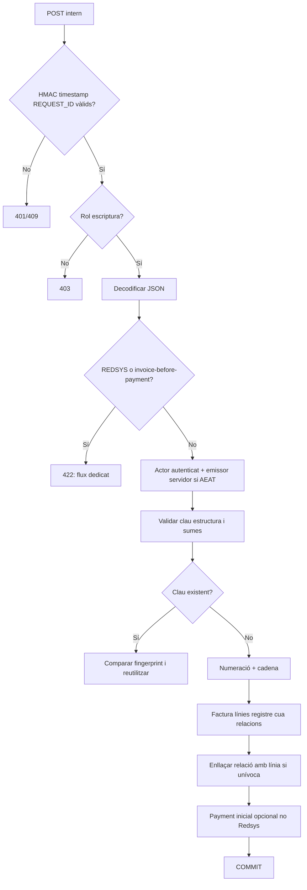
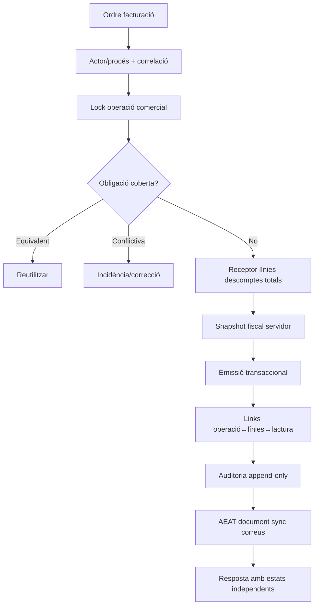

# UC-001 · Activitats i superfícies ACTUAL / FINAL

## 1. Superfícies

| ID | Superfície | ACTUAL | FINAL / límit |
| --- | --- | --- | --- |
| P-UC001-01 | `/api/factures/issue.php` | POST intern signat, rol, actor servidor, no Redsys/no UC-004. | Operació comercial, audit writer i resposta d'estats completa. |
| P-UC001-02 | `/api/factures/before-payment.php` | UC-004 amb auth, rol, selecció servidor i coverage. | No saltar-lo via P-UC001-01. |
| P-UC001-03 | Worker Redsys | Handlers especialitzats després de callback/intenció validats. | Coherència intent↔snapshot i fencing. |
| P-UC001-04 | Serveis manuals | Builders + idempotència del nucli. | Identificador d'operació comercial independent. |
| P-UC001-05 | Cua/worker AEAT | Procés postcommit separat. | Historial per intent i reconciliació remota incerta. |

## 2. Activitat ACTUAL del generic endpoint

## 3. Activitat FINAL comuna

El FINAL no es marca com a implementat.
