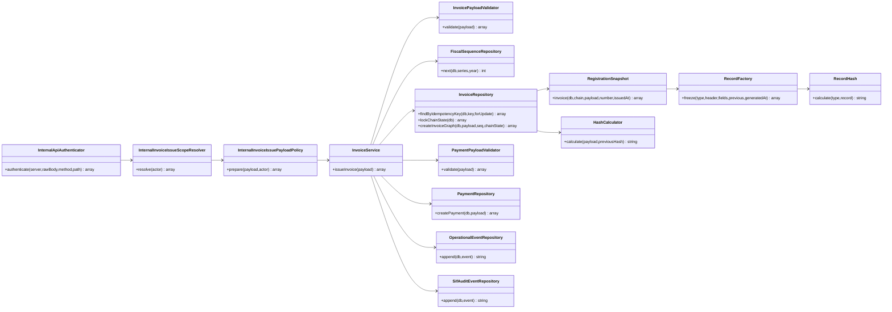
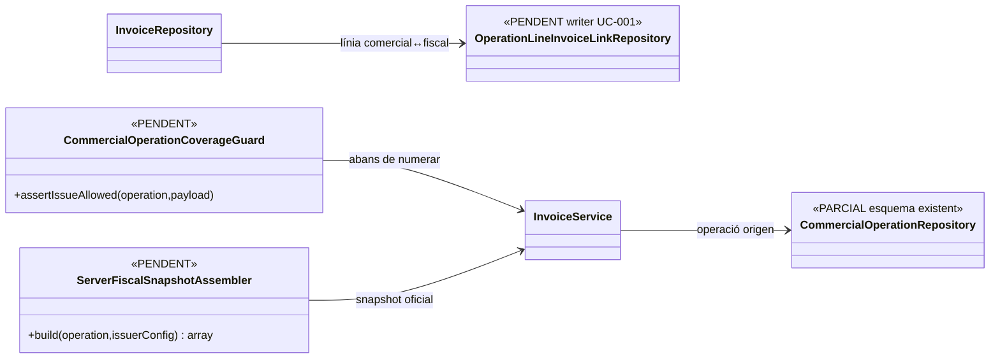

# UC-001 · Classes ACTUAL / FINAL

**Base:** `main` reauditat el 2026-10-02 i branca `audit/uc-001-hardening-2026-10-02`.

## 1. ACTUAL

**Límits ACTUAL:** l'autenticador acredita petició interna i anti-replay; el resolver comprova rol; la policy impedeix bypass Redsys/UC-004 i fixa actor/emissor servidor al generic endpoint. `InvoiceService` retorna projecció d’estats i persisteix `operational_event` + `sif_audit_event`; `InvoiceRepository` persisteix també `factura_registre_control` per l’ALTA. `HashCalculator` i `RecordHash` són empremtes diferents.

## 2. FINAL pendent

**No acreditat:** implementació completa del diagrama FINAL, prova AEAT productiva ni desplegament.
