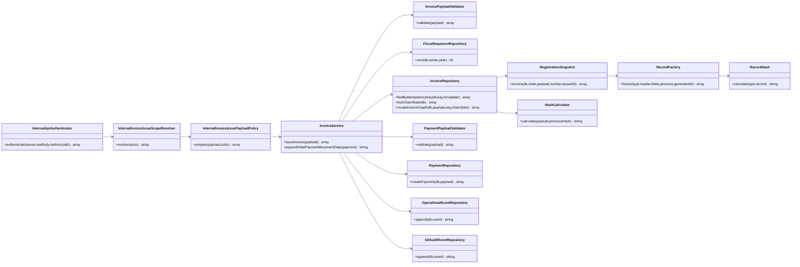
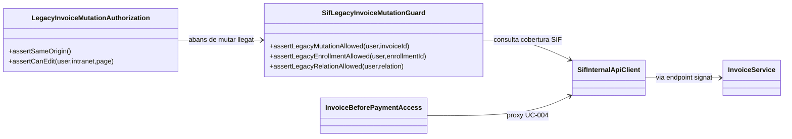
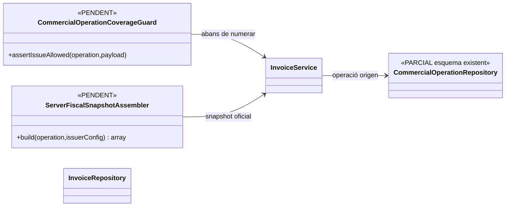

# UC-001 · Classes ACTUAL / FINAL

**Base:** `main` reauditat el 2026-10-02 i branca `audit/uc-001-hardening-2026-10-02`.

## 1. ACTUAL

**Límits ACTUAL:** l'autenticador acredita petició interna i anti-replay; el resolver comprova rol; la policy impedeix bypass Redsys/UC-004 i fixa actor/emissor servidor al generic endpoint. `InvoiceService` retorna projecció d’estats i persisteix `operational_event` + `sif_audit_event`; `InvoiceRepository` persisteix `factura_registre_control` per l’ALTA i materialitza `operation_line_invoice_link` quan existeix `uuid_operation_line`. `HashCalculator` i `RecordHash` són empremtes diferents.

## 1.1. Frontera intranet ACTUAL relacionada

**Límit:** el guard de mutació llegada és executable però feature-gated; la seva presència al repositori no demostra que `SIF_BLOCK_LEGACY_INVOICE_MUTATIONS=1` estigui activat a preproducció/producció.

## 2. FINAL pendent

**No acreditat:** implementació completa del diagrama FINAL, prova AEAT productiva ni desplegament.

## 3. Revalidació 03/10

`InvoiceService` exigeix ara una `movement_date` explícita i no buida per al payment inicial. Aquesta dada forma part del payload econòmic material i evita que un mateix reintent de negoci generi fingerprints diferents només pel rellotge del servidor.
