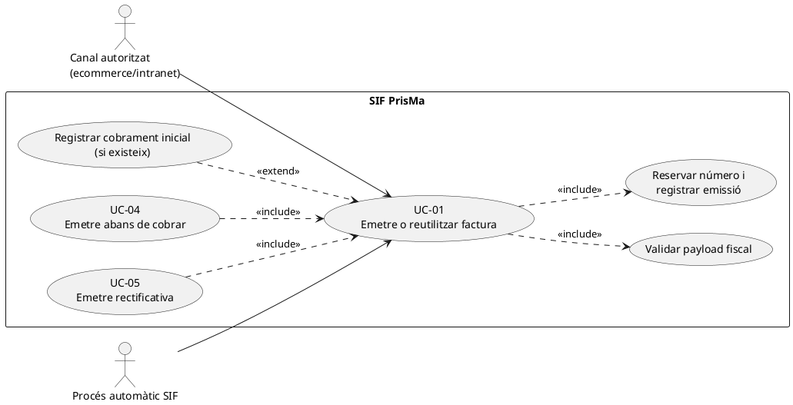
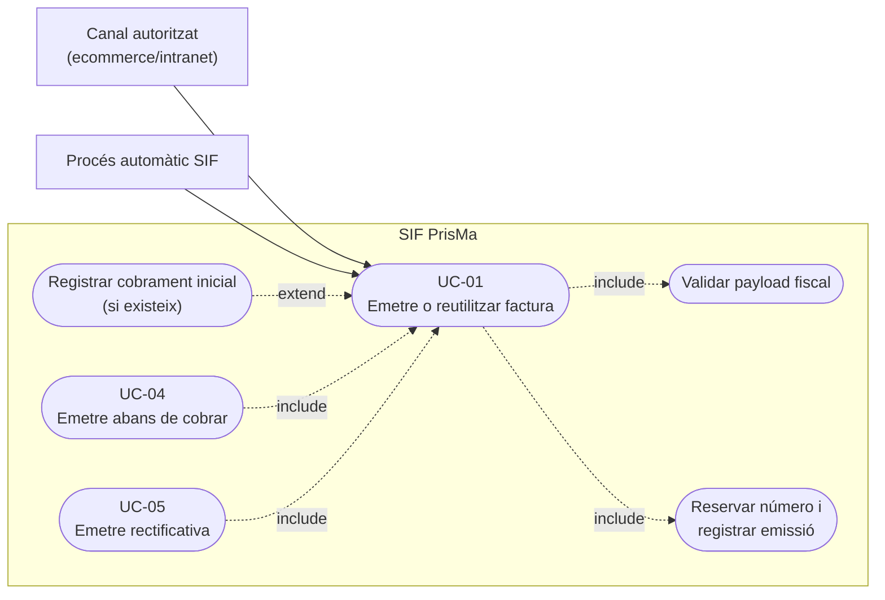
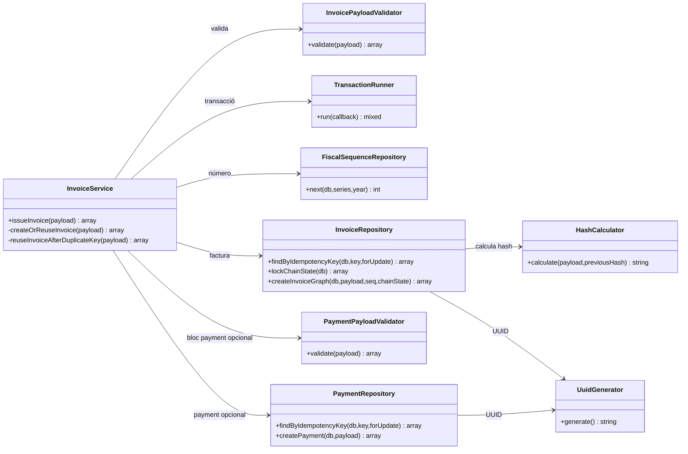
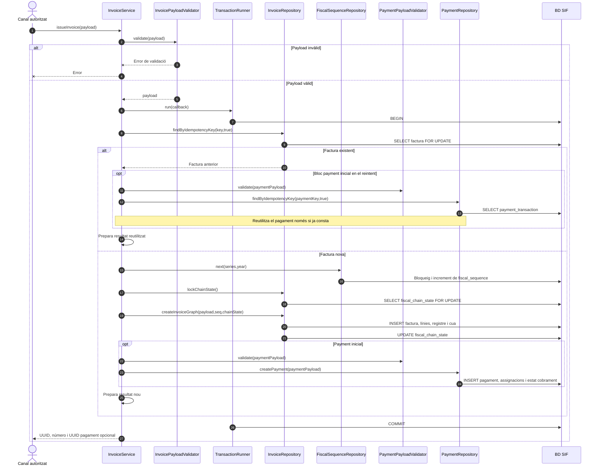
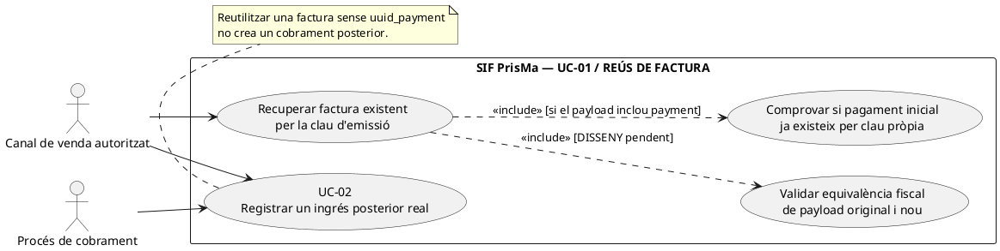
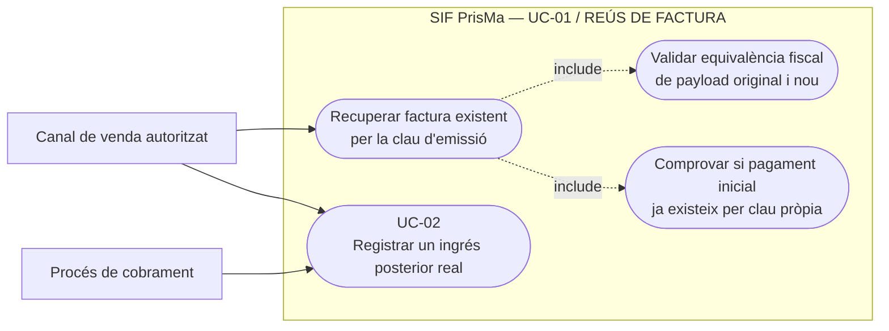
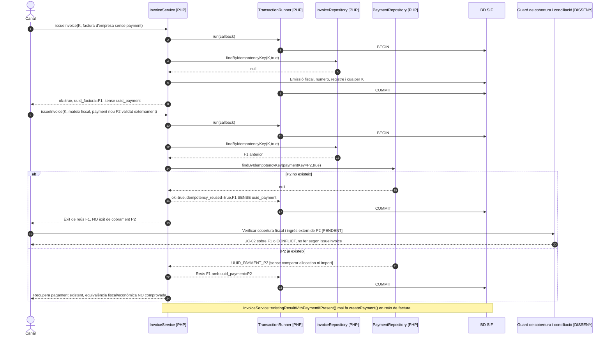
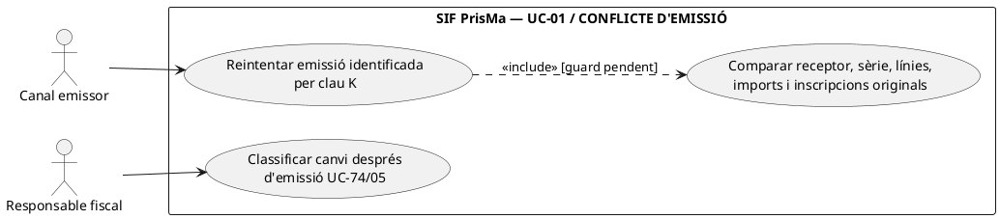
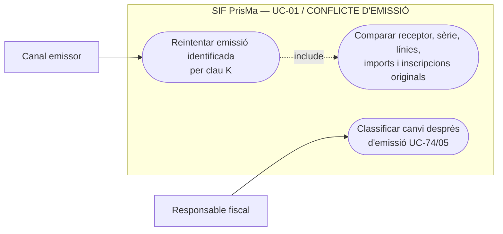
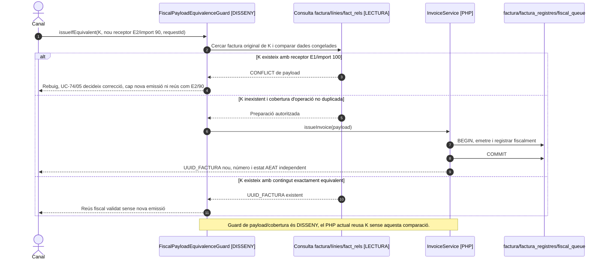

# UC-01 · Emetre o reutilitzar una factura — fitxa i UML integrats

**Estat:** nucli d'emissió contrastat als fitxers PHP de la branca documental `docs/uml-fitxes-integrades-2026-09-20`; l'ús des de cadascun dels canals, els permisos i el desplegament no queden acreditats per aquest fet. **Relacions:** UC-04 (abans de cobrar), UC-05 (rectificativa), UC-14/15/16/17 (orígens de venda), UC-02 (pagament sobre factura existent), UC-09/54/77 (remissió AEAT).

## 1. Fitxa del cas d'ús

| Element | Definició específica |
| --- | --- |
| Actors | Ecommerce, intranet o procés automàtic **a través d'un adaptador autoritzat**. L'endpoint genèric no demostra que tots els canals finals estiguin connectats. |
| Disparador | Un canal demana emetre una factura per una operació facturable, o reintenta una emissió prèvia. |
| Entrada mínima verificada al validador | `idempotency_key`, `series`, `type`, `source_channel`, `billing`, `totals`, `lines`. |
| Identificació fiscal verificada | `billing.name` i `billing.nif` no buits. El validador actual accepta sèries `A` i `R`, tipus `F1`, `F2`, `R1`…`R5`; **aquestes validacions no demostren per si soles conformitat fiscal completa**. |
| Imports i línies verificats | `totals.import_base`, `taxable_base`, `total` numèrics; almenys una línia amb `concept`, `quantity`, `unit_price`, `base` i `total` i imports numèrics. |
| Cobrament inicial opcional | Si hi ha bloc `payment`, el servei necessita `PaymentPayloadValidator` i `PaymentRepository`, i crea el moviment dins la mateixa transacció d'emissió. |
| Resultat | `ok`, `uuid_factura`, `num_visible`, `idempotency_reused` i, si es registra un pagament inicial, `uuid_payment`. |

### 1.1. Flux principal executable

1. El canal específic ha d'haver determinat receptor, línies, imports, sèrie, tipus i origen; el nucli rep el payload.
2. `InvoiceService::issueInvoice()` crida `InvoicePayloadValidator::validate()`.
3. `TransactionRunner` obre la transacció. `InvoiceRepository::findByIdempotencyKey(..., true)` cerca una factura amb la mateixa clau.
4. Si no existeix, `FiscalSequenceRepository::next()` reserva el número per sèrie i any; `InvoiceRepository::lockChainState()` bloqueja l'estat de cadena.
5. `InvoiceRepository::createInvoiceGraph()` crea `factura`, `factura_linia`, registre fiscal, actualitza la cadena, crea l'entrada de `fiscal_queue` i incorpora les relacions d'origen aportades.
6. **Només si el payload inclou `payment` no nul**, el servei valida el bloc econòmic i crea `payment_transaction` i `payment_allocation` en la mateixa transacció.
7. Es confirma la transacció i es retorna el resultat. La inserció a `fiscal_queue` no significa acceptació de l'AEAT.

### 1.2. Alternatives, errors i fronteres

| Situació | Resultat documentat en el codi |
| --- | --- |
| A1. Clau d'emissió ja existent | Retorna identificador i número preexistents amb `idempotency_reused=true`, sense consumir un altre número. Si el nou payload inclou pagament, només recupera el pagament inicial existent per la seva clau; **no crea un pagament nou en aquesta branca**. |
| A2. Col·lisió de clau concurrent | El servei captura l'excepció SQL de duplicat (`23000`) i rellegeix la factura en una nova transacció; si no la pot localitzar, propaga l'error. |
| E1. Dades mínimes absents o malformades | El validador rebutja la petició abans de crear la factura. |
| E2. Bloc `payment` invàlid o dependències econòmiques absents | L'operació falla i no s'hauria de confirmar parcialment la transacció. |
| E3. Creació del document o enviament AEAT després de l'emissió | **No es confonen** amb l'emissió: són processos posteriors, amb estats i recuperació propis. |
| Límits | Classificació fiscal real de cada venda, autorització, congelació de dades fiscals completes i configuració del canal final requereixen anàlisi específica: no es dedueixen de `InvoicePayloadValidator`. |

**Persistència principal:** `factura`, `factura_linia`, `factura_registres`, `fiscal_sequence`, `fiscal_chain_state`, `fiscal_queue`, `fact_rels` quan hi ha relacions; opcionalment `payment_transaction`, `payment_allocation` i actualització de l'estat de cobrament.

**Proves localitzades (no executades en aquesta revisió):** `IssueInvoiceTest::testIssueInvoiceCreatesFiscalRecordAndQueue`, `testIssueInvoiceReusesExistingInvoiceForSameIdempotencyKey`, `testIssueInvoiceWithPaymentCreatesPaymentTransactionAndAllocation`.

### 1.3. Revisió de la traçabilitat dels fons per inscripció — PENDENT

**Emetre una factura no és ingressar diners.** UC-01 només crea una atribució monetària per inscripció si el payload conté un cobrament inicial real i validat; si `payment=null`, el ledger proposat no rep cap `RECEIPT_ALLOCATION`. Amb cobrament inicial, l'operació ha de registrar **un sol** `payment_transaction` i atribuir-ne la quantitat exacta a cadascuna de les inscripcions d'origen, fins i tot si diverses comparteixen una factura. El camí actual d'`InvoiceService` no fa aquests assentaments per inscripció. La creació fiscal, l'assignació per factura i el detall per inscripció han de confirmar-se conjuntament quan comparteixin BD; si el canal no pot identificar el desglossament, no s'ha de suposar un repartiment equitatiu.

Vegeu [revisió i model proposat de moviments per inscripció](00-revisio-moviments-inscripcions.md).

### 1.4. Reutilització d'una factura davant cobertura existent i contingut canviat

**Unicitat fiscal diferent de la clau de petició.** El circuit històric de «Generar factura abans de pagar» agrupa diverses inscripcions del mateix curs/edició en una factura real d'empresa/responsable. El TPV i «Passar pagaments» poden arribar **més tard** amb una altra `DS_ORDER`, un `IDPAG` compartit o una referència manual. El fet que `InvoiceRepository::findByIdempotencyKey()` no localitzi la **nova** clau no acredita que les mateixes inscripcions no estiguin ja cobertes per una factura anterior. L'adaptador ha de comprovar `fact_rels`, `ID_INSC`, obligació, receptor, estat fiscal i composició exacta abans de decidir entre `issueInvoice()`, `registerPayment()` o incidència, incloent l'eventual rectificativa si ha canviat el servei/import.

**Límit verificat del reús.** `InvoiceService::issueInvoice()`, si troba factura per `idempotency_key`, retorna el UUID i número existents; en la branca de `payment` només cerca un pagament inicial **ja existent** per la clau econòmica i el retorna si hi és. **No compara el payload fiscal nou amb l'original, ni crea un cobrament posterior nou per aquesta branca de reús.** Per tant, (a) una repetició **exacta** ha de retornar el mateix resultat, (b) igual clau amb receptor, total, línies o participants diferents ha de marcar **conflicte de contingut** mitjançant un control encara pendent i (c) una factura real emesa abans de cobrar requereix el servei UC-02 per registrar el pagament efectiu. No documentar el retorn `idempotency_reused=true` com una prova que el contingut comercial/fiscal coincideix.

**Línies i identitat d'inscripció.** Un pack pot incloure dues inscripcions amb el 25 % descomptat només al segon curs; un grup de participants té una línia/inscripció per persona en el circuit de facturació acordat. Cal validar identitat de cada `ID_INSC`, descompte i quantitat de cada línia, total i `UUID_FACTURA` afectat. La simple coincidència de `IDPAG` o `FACTURA_RELACIONADA` no demostra que una factura única sigui correcta, ni autoritza emetre una segona factura per la part que ja existeix.

**Èxit local i fases posteriors.** Un resultat `uuid_factura/num_visible` indica que s'ha confirmat el nucli d'emissió; la cua AEAT encara pot estar pendent o en incidència i el PDF/QR pot no estar generat. Quan falli una sincronització llegat, URL, correu o document després del commit fiscal, recuperar **el UUID existent** i reexecutar només la fase fallida. Si un import encara no s'ha ingressat, no afegir bloc `payment` per fer que la factura aparegui cobrada.

### 1.5. Proves d'unicitat comercial i contingut (no executades)

| ID | Escenari | Resultat exigible |
| --- | --- | --- |
| EI-01 | Factura d'empresa ja emesa, després arriba Redsys amb una altra DS_ORDER | Registrar pagament sobre UUID existent; cap nova factura. |
| EI-02 | Mateixa clau d'emissió amb import o CIF diferent | Detectar conflicte de contingut abans de donar per reutilitzada l'operació. |
| EI-03 | Una inscripció ja coberta per factura de grup i nova petició individual | Denegar la segona emissió/derivar a revisió, no deduplicar només per IDPAG. |
| EI-04 | Pack de dos cursos i grup de N participants | Línies i imports/beneficiaris reals congelats; no repartiment automàtic per IDPAG. |
| EI-05 | Emissió confirmada però PDF/AEAT/sync fallits | Mantenir UUID i número; recuperar la fase fallida sense recrear factura. |
| EI-06 | Factura existent amb nou cobrament posterior i clau de factura repetida | UC-02 crea/reutilitza només el CHARGE real; UC-01 no crea un nou ingrés a la branca de reús. |

## 2. Diagrama UML de casos d'ús

Font UML editable PlantUML; l'emissió abans de cobrar i les rectificatives utilitzen el nucli d'emissió però tenen fitxes diferenciades.

### Vista del cas d'ús a GitHub (Mermaid)

## 3. Subdiagrama UML de classes

Representa **classes PHP comprovades**, no pantalles imaginades ni taules SQL convertides en classes.

## 4. Diagrama de seqüència — emissió i reutilització

**Incidència de concurrència:** si la inserció falla per clau duplicada, el servei rellegeix la factura existent en una nova transacció. Els errors de BD diferents d'aquest cas es propaguen.

### 4.1. Acció independent: consultar l'estat de reús d'una factura amb possible cobrament posterior — PHP existent i contracte de canal pendent

**Actor/disparador:** un adaptador de venda reintenta `issueInvoice(payload)` amb clau fiscal ja confirmada, ara incloent un bloc `payment` corresponent a una entrada bancària posterior. **Precondicions de negoci objectiu:** contrastar el payload fiscal original, la seva cobertura d'inscripcions/receptor i la identitat bancària de l'entrada nova; si la factura ja està emesa, una entrada real posterior correspon a **UC-02** i no a una segona emissió. **Postcondició PHP real:** `idempotency_reused=true`, `uuid_factura`, `num_visible` i `uuid_payment` **només si la mateixa clau de pagament ja existeix**. `ok=true` del reús fiscal **no acredita** el `CHARGE` sol·licitat.

### Vista del cas d'ús a GitHub (Mermaid)

### 4.2. Acció independent: rebutjar un reintent d'emissió amb mateix identificador però contingut fiscal diferent — DISSENY

**Actor/disparador:** dues peticions del mateix canal reutilitzen una clau fiscal `K` amb receptor, total, línies, inscripcions o sèrie diferents. **Postcondició exigible:** `CONFLICT` amb referència a la factura original i revisió de possible correcció fiscal UC-74/05; sense nova factura ni mutació de la primera. **PHP actual:** `InvoiceService` cerca `K` i retorna `existingResult()` **sense comparar** el payload nou amb `factura`, `factura_linia` o `fact_rels` persistents. `InvoicePayloadValidator` valida estructura, però no equivalència fiscal respecte de l'original. El fet que `InvoiceRepository` registri un hash del registre fiscal de la primera factura **no** implica que es compari amb el nou payload.

### Vista del cas d'ús a GitHub (Mermaid)

| Prova pendent | Escenari | Resultat objectiu i comportament actual a contrastar |
| --- | --- | --- |
| EI-07 | F1 emesa sense payment, posteriorment `issueInvoice(K,payment=P2)` amb la mateixa K | El PHP actual retorna F1 i `ok=true` sense `uuid_payment` si P2 no existeix. El canal objectiu tracta l'ingrés real per UC-02, no declara cobrat per reús fiscal. |
| EI-08 | F1 emesa amb `paymentKey=P1`; reús de K amb `paymentKey=P2` inexistent | Retorna F1 sense P2; no registrar fals cobrament ni tornar a crear F1. |
| EI-09 | Mateixa K però receptor/total/línies/inscripcions diferents | PHP actual pot retornar F1; guard objectiu exigeix `CONFLICT` i UC-74/05 si ja s'ha emès. |
| EI-10 | Un `paymentKey` preexistent apunta a un pagament d'una altra factura | Reús fiscal/econòmic no s'ha de declarar equivalent fins a comprovar `payment_allocation.UUID_FACTURA`, import i titular; guard pendent. |

## 5. Traçabilitat

[Catàleg UC-01](../04-estat-final/33-casos-us-sif.md) · [Model de classes](../04-estat-final/31-diagrames-classes-sif.md) · [Seqüències existents](../04-estat-final/32-diagrames-sequencia-sif.md) · [Fitxa base](../06-fitxes-funcionals/uc-001.md) · [InvoiceService](../../sif/src/Service/InvoiceService.php) · [InvoicePayloadValidator](../../sif/src/Service/InvoicePayloadValidator.php) · [InvoiceRepository](../../sif/src/Repository/InvoiceRepository.php) · [FiscalSequenceRepository](../../sif/src/Repository/FiscalSequenceRepository.php) · [IssueInvoiceTest](../../sif/tests/Integration/IssueInvoiceTest.php).

**No acreditat:** execució de tests en aquest canvi documental, conformitat fiscal integral, integracions finals ni posada en producció.
