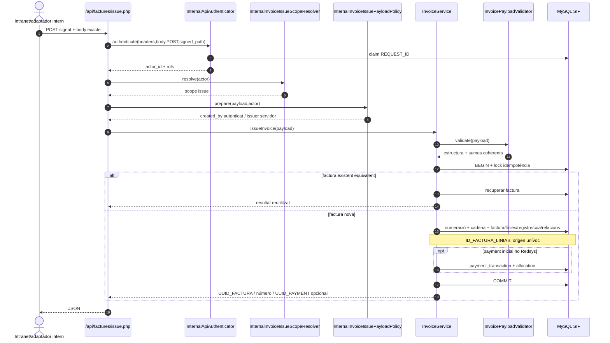
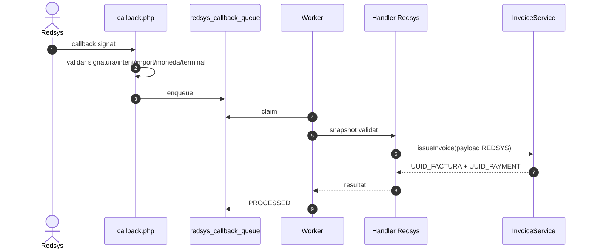
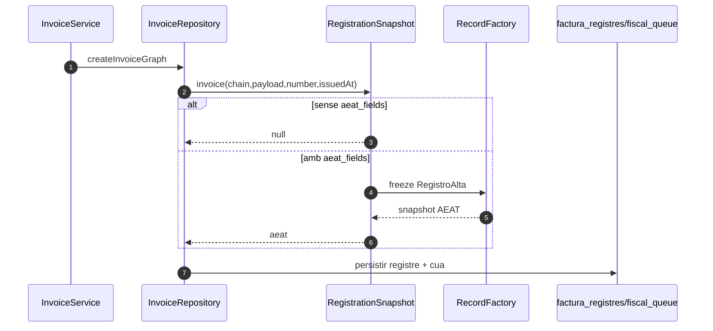
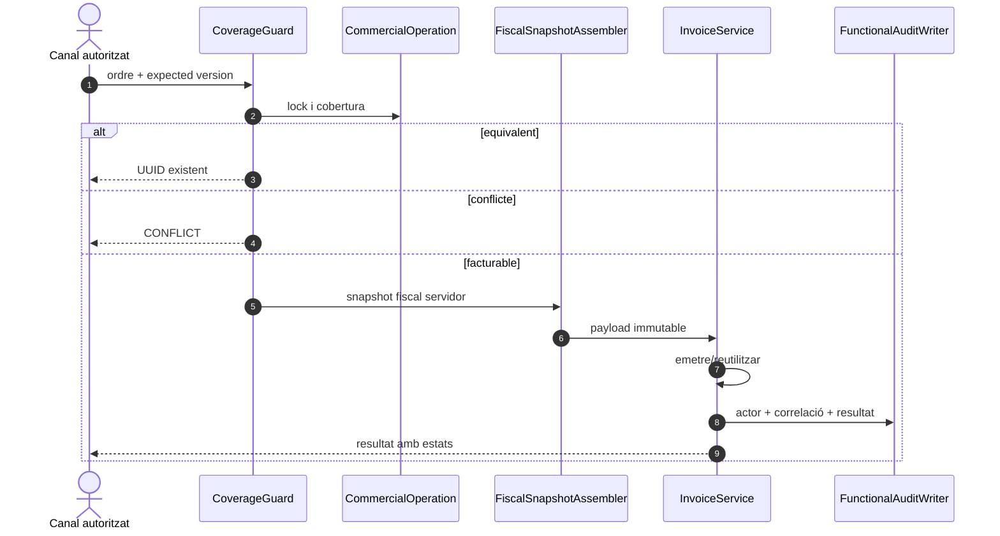

# UC-001 · Seqüències ACTUAL / FINAL

## 1. ACTUAL — endpoint intern genèric

## 2. ACTUAL — Redsys separat del generic endpoint

## 3. ACTUAL — branca AEAT condicional

## 4. FINAL pendent

La seqüència FINAL continua pendent d'implementació completa.
