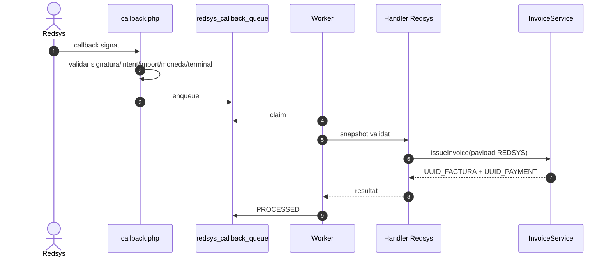
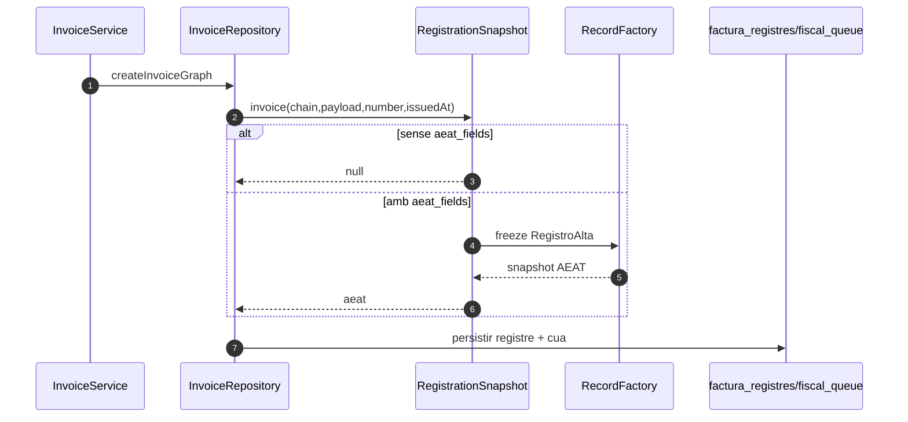
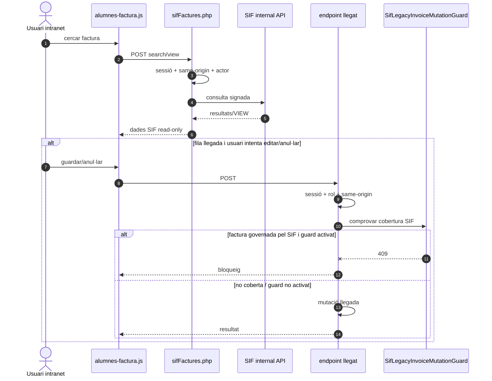
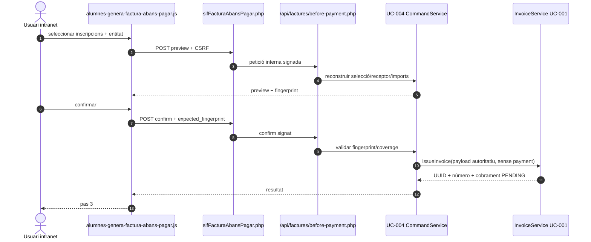
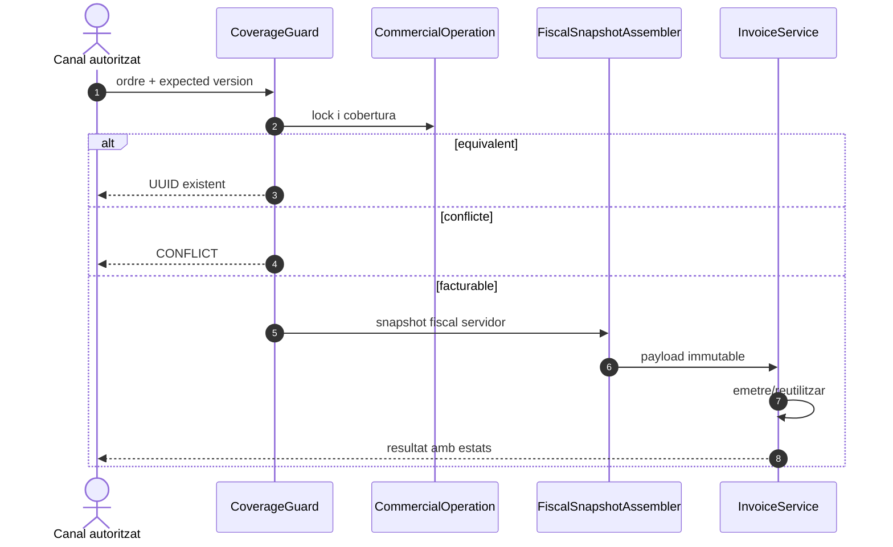

# UC-001 · Seqüències ACTUAL / FINAL

## 1. ACTUAL — endpoint intern genèric

```mermaid
sequenceDiagram
autonumber
actor I as Intranet/adaptador intern
participant API as /api/factures/issue.php
participant A as InternalApiAuthenticator
participant R as InternalInvoiceIssueScopeResolver
participant P as InternalInvoiceIssuePayloadPolicy
participant S as InvoiceService
participant V as InvoicePayloadValidator
participant DB as MySQL SIF
I->>API: POST signat + body exacte
API->>A: authenticate(headers,body,POST,signed_path)
A->>DB: claim REQUEST_ID
A-->>API: actor_id + rols
API->>R: resolve(actor)
R-->>API: scope issue
API->>P: prepare(payload,actor)
P-->>API: actor + emissor + SistemaInformatico server-side
API->>S: issueInvoice(payload)
S->>V: validate(payload)
V-->>S: estructura + sumes coherents
S->>S: si PREPROD/PROD, exigir aeat_fields
S->>DB: BEGIN + lock idempotència
alt factura existent equivalent
 S->>DB: recuperar factura
 S-->>API: resultat reutilitzat
else factura nova
 S->>DB: numeració + cadena + factura/línies/registre/control/cua/relacions
 Note over S,DB: ID_FACTURA_LINIA si origen unívoc
 opt payment inicial no Redsys
  S->>S: exigir movement_date explícita i estable
  alt data absent/buida
   S--xAPI: 422; TransactionRunner fa ROLLBACK
  else data vàlida
   S->>DB: payment_transaction + allocation
  end
 end
 S->>DB: projectar estats factura/cobrament/AEAT/cua/document
 S->>DB: append operational_event + sif_audit_event
 S->>DB: COMMIT
 S-->>API: UUIDs + número + correlació + estats
end
API-->>I: JSON
```

## 2. ACTUAL — Redsys separat del generic endpoint



## 3. ACTUAL — branca AEAT condicional



## 4. ACTUAL — `alumnes-factura.php`: consulta SIF i mutació llegada protegida



## 5. ACTUAL — `alumnes-genera-factura-abans-pagar.php`: preview i confirmació UC-004



## 6. FINAL pendent



La seqüència FINAL continua pendent només en la cobertura comercial transversal i l’assembler fiscal servidor complet; la traça i la resposta d’estats ja formen part de l’ACTUAL.

## 7. Evidència 03/10

Les seqüències del nucli, UC-004 i callers Redsys/manuals tenen proves específiques PASS a l’execució del commit `88e5c922…`. La nova validació de `movement_date` queda coberta per `IssueInvoiceTest::testInvoiceInitialPaymentRequiresStableMovementDateBeforeMutation` al commit `276fb390…` i necessita el seu run de CI.
