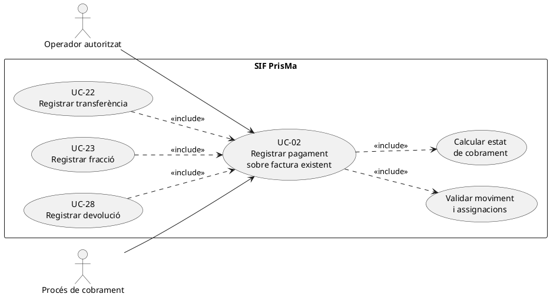
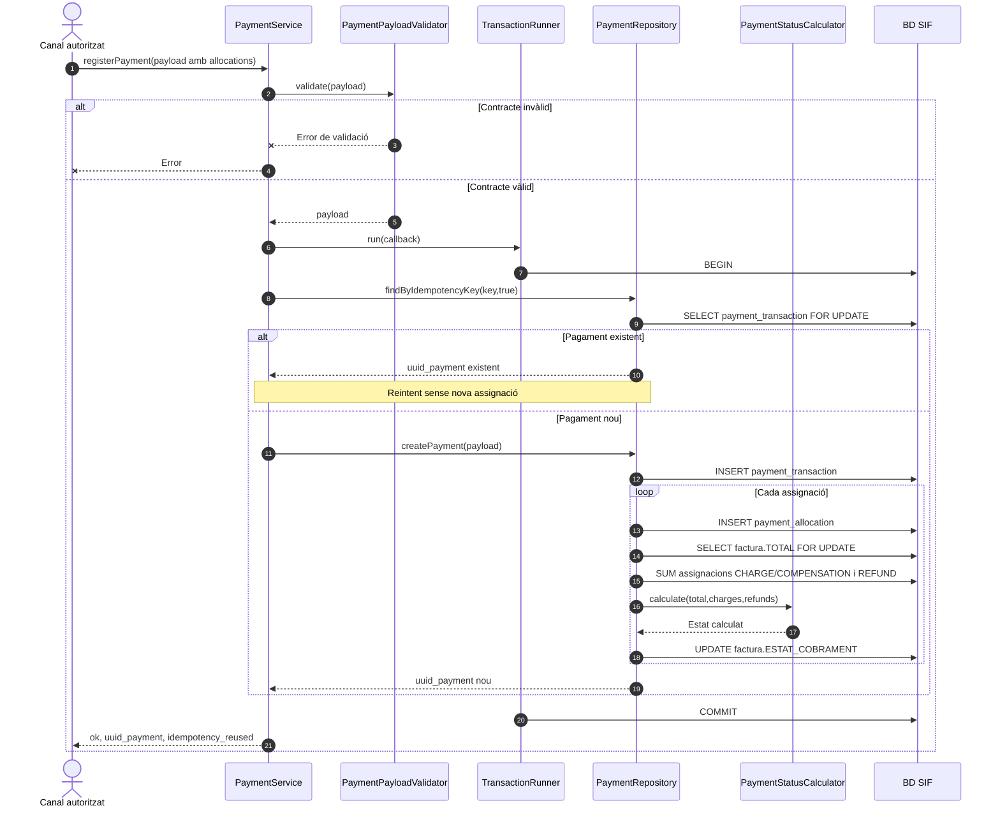
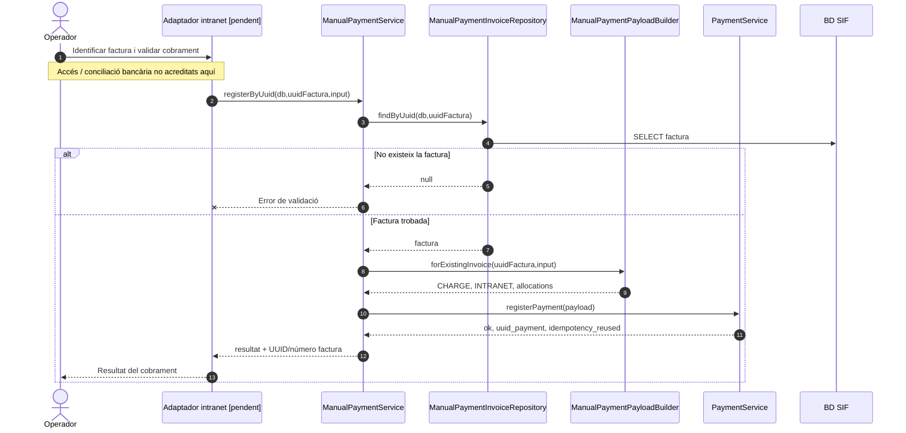

# UC-02 · Registrar un pagament sobre factura existent — fitxa i UML integrats

**Estat:** `PaymentService` i `PaymentRepository` existeixen al codi `main`; la vinculació final de cadascuna de les pantalles i les regles d'autorització no es consideren acreditades. **Casos relacionats:** UC-01 (emissió inicial), UC-04 (factura emesa abans de cobrar), UC-22 (transferència), UC-23 (fracció), UC-24 (cobrament de reclamació), UC-28 (devolució) i UC-29a (compensació).

## 1. Fitxa de cas d'ús

| Camp | Especificació |
| --- | --- |
| Actor que inicia l'acció | Operador o procés automàtic mitjançant el canal corresponent, amb validació de permisos **pendent d'acreditar en la integració final**. |
| Objectiu | Registrar un moviment econòmic confirmat i assignar-lo a una factura fiscal ja existent; no tornar a emetre aquesta factura. |
| Precondicions | Factura SIF identificada; confirmació del cobrament obtinguda fora d'aquest servei; import i assignació coneguts; clau idempotent pròpia del moviment. |
| Entrada comuna exigida pel validador actual | `idempotency_key`, `movement_type`, `method`, `source_channel`, `amount`, `movement_date`, `allocations`. |
| Tipus i mètodes admesos pel validador | Tipus `CHARGE`, `REFUND`, `COMPENSATION`; mètodes `REDSYS`, `TRANSFERENCIA`, `COMPENSACIO`, `MANUAL`. Les normes específiques de cada tipus pertanyen als casos relacionats. |
| Assignacions | `allocations` ha de contenir almenys una entrada amb `uuid_factura`, `amount` i `allocation_type`; el repositori les recorre individualment. |
| Resultat del servei | `ok`, `idempotency_reused`, `uuid_payment`. El servei genèric **no retorna necessàriament** el nou `ESTAT_COBRAMENT`. |

### 1.1. Flux principal executable

1. L'adaptador específic obté l'evidència del cobrament confirmat i identifica la factura preexistent. **El servei genèric no comprova per si sol la identitat de l'operador ni l'evidència bancària.**
2. `PaymentService::registerPayment(payload)` valida els camps amb `PaymentPayloadValidator`.
3. Obre una transacció i cerca `payment_transaction` amb la mateixa clau idempotent, amb bloqueig.
4. Si no existeix el moviment, `PaymentRepository::createPayment()` genera un UUID, crea el registre econòmic amb `ESTAT=CONFIRMED` i enregistra cada assignació.
5. Després de cada assignació, el repositori bloqueja i consulta la factura, suma moviments `CHARGE`/`COMPENSATION` i `REFUND` i recalcula `factura.ESTAT_COBRAMENT` mitjançant `PaymentStatusCalculator`.
6. Confirma la transacció i retorna `uuid_payment`. **No genera `factura_registres`, número fiscal, hash ni cua fiscal.**

### 1.2. Alternatives i situacions d'error

| Situació | Comportament implementat o pendent |
| --- | --- |
| A1. Mateixa clau idempotent | El servei retorna el moviment existent amb `idempotency_reused=true`; no crea una segona assignació. |
| A2. Col·lisió SQL de clau única | Captura l'error `23000`, rellegeix el pagament per la clau en una nova transacció i retorna el moviment trobat. |
| A3. Pagament inferior al total | `PaymentStatusCalculator` retorna `PARTIAL` quan l'import net és positiu però inferior al total. |
| A4. Pagament igual al total | L'estat calculat és `PAID`. |
| A5. Pagament superior al total | L'estat calculat és `OVERPAID`; la decisió operativa sobre l'excés correspon a UC-104, no queda resolta automàticament aquí. |
| E1. Assignació a factura inexistent | El repositori falla en intentar consultar la factura; la transacció no s'ha de confirmar parcialment. |
| E2. Falta un camp o un mètode no és admès | El validador rebutja la petició. |
| Límits coneguts | El validador genèric verifica la forma i la numericitat dels imports però **no acredita per si sol** saldo disponible, autorització, suma d'assignacions igual a l'import, evidència del cobrament ni coherència semàntica entre mètode i tipus. Cal cobrir-ho per canal i cas específic. |

La implementació també calcula estats `PENDING`, `PARTIALLY_REFUNDED` i `REFUNDED` segons càrrecs i devolucions; **aquestes devolucions no equivalen a tornar a emetre una factura ni substitueixen el procés fiscal que pugui correspondre**.

**Persistència principal:** `payment_transaction`, `payment_allocation` i actualització de `factura.ESTAT_COBRAMENT`. No atribuir al servei genèric l'escriptura dels registres d'auditoria funcionals que estan previstos als documents d'estat final però no apareixen en aquest camí de codi.

**Proves localitzades (no executades en aquesta revisió):** `RegisterPaymentTest::testRegisterPaymentCreatesTransactionAndAllocationOnly` i `testRegisterPaymentReusesSamePaymentForSameIdempotencyKey`.

### 1.3. Revisió: la imputació a factura no és una imputació a inscripció — PENDENT

El registre existent `payment_transaction` → `payment_allocation` actualitza l'estat de la **factura**, però l'assignació no conté `ID_INSC`. UC-02 ha d'identificar i validar també l'import corresponent a **cada inscripció** abans de donar per completat un cobrament, una fracció, una devolució o una compensació. Si una transferència de 200 € cobreix dues inscripcions, hi ha **un moviment extern** de 200 € i **dues atribucions internes** (p. ex. 100 € i 100 € quan les dades reals ho justifiquin), vinculades al mateix cobrament; no dues entrades de caixa. La suma atribuïda s'ha de reconciliar amb la suma assignada a les factures i amb el moviment extern. Una reassignació posterior entre inscripcions no pot cridar `registerPayment(CHARGE)` com si arribessin diners nous.

**Risc addicional comprovat al codi:** `PaymentPayloadValidator` només exigeix imports numèrics i no acredita que `SUM(allocations.amount)=payment.amount`, que cada import sigui estrictament positiu ni que una clau reutilitzada porti el mateix payload; són validacions pendents. [Model i invariants de fons per inscripció](00-revisio-moviments-inscripcions.md).

## 2. Diagrama UML de casos d'ús

El cas de cobrament posterior utilitza l'operació comuna UC-02; les variants de transferència i fracció afegeixen les seves regles i fitxes pròpies.

## 3. Subdiagrama de classes executables

**Observació:** `ManualPaymentService` és l'adaptador de servei per al pagament manual d'una factura identificada per UUID o número; `sif/public/api/payments/register.php` instancia **directament** `PaymentService`. No donar per implementat un recorregut de pantalla que no s'ha traçat.

## 4. Diagrama de seqüència — registre genèric del moviment

## 5. Diagrama de seqüència — variant manual d'una factura existent

En la variant manual, el constructor normalitza l'import positiu, admet `TRANSFERENCIA` o `MANUAL`, requereix la data i genera la clau idempotent per referència o per combinació factura/data/import/banc. **L'evidència que una transferència ha arribat realment no es pot inferir d'aquesta construcció del payload.**

## 6. Traçabilitat

[Catàleg UC-02](../04-estat-final/33-casos-us-sif.md) · [Fitxa base UC-02](../06-fitxes-funcionals/uc-002.md) · [PaymentService](../../sif/src/Service/PaymentService.php) · [PaymentPayloadValidator](../../sif/src/Service/PaymentPayloadValidator.php) · [PaymentRepository](../../sif/src/Repository/PaymentRepository.php) · [PaymentStatusCalculator](../../sif/src/Domain/PaymentStatusCalculator.php) · [ManualPaymentService](../../sif/src/Service/ManualPaymentService.php) · [ManualPaymentPayloadBuilder](../../sif/src/Service/ManualPaymentPayloadBuilder.php) · [RegisterPaymentTest](../../sif/tests/Integration/RegisterPaymentTest.php).

**No acreditat:** execució de proves, conciliació bancaria real, permisos de la interfície, auditories transversals completes ni posada en producció.
