# UC-02 · Registrar un pagament sobre factura existent — fitxa i UML integrats

**Estat:** `PaymentService` i `PaymentRepository` estan contrastats a la branca documental `docs/uml-fitxes-integrades-2026-09-20`; la vinculació final de cadascuna de les pantalles i les regles d'autorització no es consideren acreditades. **Casos relacionats:** UC-01 (emissió inicial), UC-04 (factura emesa abans de cobrar), UC-22 (transferència), UC-23 (fracció), UC-24 (cobrament de reclamació), UC-28 (devolució) i UC-29a (compensació).

## 1. Fitxa de cas d'ús

| Camp | Especificació |
| --- | --- |
| Actor que inicia l'acció | Operador o procés automàtic mitjançant el canal corresponent, amb validació de permisos **pendent d'acreditar en la integració final**. |
| Objectiu | Registrar un moviment econòmic confirmat i assignar-lo a una factura fiscal ja existent; no tornar a emetre aquesta factura. |
| Precondicions | Factura SIF identificada; confirmació del cobrament obtinguda fora d'aquest servei; import i assignació coneguts; clau idempotent pròpia del moviment. |
| Entrada comuna exigida pel validador actual | `idempotency_key`, `movement_type`, `method`, `source_channel`, `amount`, `movement_date`, `allocations`. |
| Tipus i mètodes admesos pel validador | Tipus `CHARGE`, `REFUND`, `COMPENSATION`; mètodes `REDSYS`, `TRANSFERENCIA`, `COMPENSACIO`, `MANUAL`. Les normes específiques de cada tipus pertanyen als casos relacionats. |
| Assignacions | `allocations` ha de contenir almenys una entrada amb `uuid_factura`, `amount` i `allocation_type`; el repositori les recorre individualment. |
| Resultat del servei | `ok`, `idempotency_reused`, `uuid_payment`. El servei genèric **no retorna necessàriament** el nou `ESTAT_COBRAMENT`. |

### 1.1. Flux principal executable

1. L'adaptador específic obté l'evidència del cobrament confirmat i identifica la factura preexistent. **El servei genèric no comprova per si sol la identitat de l'operador ni l'evidència bancària.**
2. `PaymentService::registerPayment(payload)` valida els camps amb `PaymentPayloadValidator`.
3. Obre una transacció i cerca `payment_transaction` amb la mateixa clau idempotent, amb bloqueig.
4. Si no existeix el moviment, `PaymentRepository::createPayment()` genera un UUID, crea el registre econòmic amb `ESTAT=CONFIRMED` i enregistra cada assignació.
5. Després de cada assignació, el repositori bloqueja i consulta la factura, suma moviments `CHARGE`/`COMPENSATION` i `REFUND` i recalcula `factura.ESTAT_COBRAMENT` mitjançant `PaymentStatusCalculator`.
6. Confirma la transacció i retorna `uuid_payment`. **No genera `factura_registres`, número fiscal, hash ni cua fiscal.**

### 1.2. Alternatives i situacions d'error

| Situació | Comportament implementat o pendent |
| --- | --- |
| A1. Mateixa clau idempotent | El servei retorna el moviment existent amb `idempotency_reused=true`; no crea una segona assignació. |
| A2. Col·lisió SQL de clau única | Captura l'error `23000`, rellegeix el pagament per la clau en una nova transacció i retorna el moviment trobat. |
| A3. Pagament inferior al total | `PaymentStatusCalculator` retorna `PARTIAL` quan l'import net és positiu però inferior al total. |
| A4. Pagament igual al total | L'estat calculat és `PAID`. |
| A5. Pagament superior al total | L'estat calculat és `OVERPAID`; la decisió operativa sobre l'excés correspon a UC-104, no queda resolta automàticament aquí. |
| E1. Assignació a factura inexistent | El repositori falla en intentar consultar la factura; la transacció no s'ha de confirmar parcialment. |
| E2. Falta un camp o un mètode no és admès | El validador rebutja la petició. |
| Límits coneguts | El validador genèric verifica la forma i la numericitat dels imports però **no acredita per si sol** saldo disponible, autorització, suma d'assignacions igual a l'import, evidència del cobrament ni coherència semàntica entre mètode i tipus. Cal cobrir-ho per canal i cas específic. |

La implementació també calcula estats `PENDING`, `PARTIALLY_REFUNDED` i `REFUNDED` segons càrrecs i devolucions; **aquestes devolucions no equivalen a tornar a emetre una factura ni substitueixen el procés fiscal que pugui correspondre**.

**Persistència principal:** `payment_transaction`, `payment_allocation` i actualització de `factura.ESTAT_COBRAMENT`. No atribuir al servei genèric l'escriptura dels registres d'auditoria funcionals que estan previstos als documents d'estat final però no apareixen en aquest camí de codi.

**Proves localitzades (no executades en aquesta revisió):** `RegisterPaymentTest::testRegisterPaymentCreatesTransactionAndAllocationOnly` i `testRegisterPaymentReusesSamePaymentForSameIdempotencyKey`.

### 1.3. Revisió: la imputació a factura no és una imputació a inscripció — PENDENT

El registre existent `payment_transaction` → `payment_allocation` actualitza l'estat de la **factura**, però l'assignació no conté `ID_INSC`. UC-02 ha d'identificar i validar també l'import corresponent a **cada inscripció** abans de donar per completat un cobrament, una fracció, una devolució o una compensació. Si una transferència de 200 € cobreix dues inscripcions, hi ha **un moviment extern** de 200 € i **dues atribucions internes** (p. ex. 100 € i 100 € quan les dades reals ho justifiquin), vinculades al mateix cobrament; no dues entrades de caixa. La suma atribuïda s'ha de reconciliar amb la suma assignada a les factures i amb el moviment extern. Una reassignació posterior entre inscripcions no pot cridar `registerPayment(CHARGE)` com si arribessin diners nous.

**Risc addicional comprovat al codi:** `PaymentPayloadValidator` només exigeix imports numèrics i no acredita que `SUM(allocations.amount)=payment.amount`, que cada import sigui estrictament positiu ni que una clau reutilitzada porti el mateix payload; són validacions pendents. [Model i invariants de fons per inscripció](00-revisio-moviments-inscripcions.md).

### 1.4. Identificar factura prèvia a «Passar pagaments» i a Redsys

**Intranet llegada.** A `/alumnes/pagaments/`, el procediment `efectuarPagamentFacturaGenerada()` consulta `buscarPagamentsByFact`, `A_PAGAR`, `PAGAMENT`, `FACTURA_RELACIONADA`, `FRACCIO`, `IDPAG` i dades del receptor; en el circuit antic calcula el nou pendent amb imports de la inscripció. En la integració SIF, si la factura fiscal ja és real i està emesa —inclosa la d'empresa abans de cobrar—, registrar el moviment amb `UUID_FACTURA` i la clau de la **transacció externa**, sense modificar receptor, concepte, import ni número de factura. Els camps `PAGAMENT` i `DATA PAG` del llegat només poden sincronitzar-se **després** del commit econòmic com a resum.

**Redsys i una factura ja emesa amb una altra clau.** La validació de `DS_ORDER` acredita quin intent TPV ha notificat Redsys; **no acredita que calgui emetre factura nova**. La factura prèvia pot haver estat emesa per un procés de grup/empresa o manual amb un `idempotency_key` diferent del callback. El despatxador ha de localitzar la cobertura per `fact_rels/ID_INSC/UUID_FACTURA` i, si és inequívoca, registrar el `CHARGE` contra el document existent. Si hi ha diversos candidats o la inscripció ha canviat/ha estat donada de baixa, conservar prova del cobrament real i derivar a conciliació; no forçar un nou `issueInvoice()`.

**Límits monetaris del servei actual.** `PaymentPayloadValidator` comprova camps, que les assignacions siguin un array no buit i la numericitat dels imports, però no acredita que la **suma de trams** coincideixi amb l'entrada externa ni que tot tram estigui disponible. `PaymentService::existingResult()` retorna un `UUID_PAYMENT` per la mateixa clau sense comparar el nou payload amb el `PAYLOAD_HASH` antic: l'operació objectiu ha de detectar conflictes de mateixa clau/import/destí diferents. `PaymentRepository::createPayment()` crea un moviment **nou** amb totes les assignacions, no permet afegir trams a un UUID ja confirmat; la cerca i l'assignació d'un cobrament existent corresponen a UC-56/105 encara pendents d'un writer segur.

**Diverses factures i participants.** Una transferència real pot cobrir més d'una factura; cada `payment_allocation` ha de referenciar quantitat i UUID de destí, mentre que en grups/packs el futur registre de fons **per `ID_INSC`** ha de reflectir l'atribució individual exacta. `FACTURA_RELACIONADA` i `IDPAG` poden agrupar diversos participants i intents i no són claus de deduplicació de diner. La factura fiscal emesa abans del cobrament manté `EMESA_ABANS_COBRAMENT=1` encara després de quedar pagada; el fet econòmic posterior no ha de canviar aquesta dada històrica ni marcar `E_FACT` automàticament.

### 1.5. Proves d'un pagament posterior amb cobertura fiscal (no executades)

| ID | Escenari | Resultat exigible |
| --- | --- | --- |
| CP-02-01 | Factura prèvia d'empresa pagada per una transferència real | Un `UUID_PAYMENT`, assignació contra la factura existent, sense factura nova. |
| CP-02-02 | Redsys confirma una DS_ORDER nova sobre una factura SIF antiga | Deduplicar per transacció i vincular a la factura prèvia, no pel nou IDPAG sol. |
| CP-02-03 | Factura de grup amb N inscrits i un CHARGE únic | Assignació a factura i atribucions individuals documentades segons import real. |
| CP-02-04 | Mateixa clau econòmica però import o assignacions nous | Conflicte de contingut; no retornar èxit de la petició incompatible. |
| CP-02-05 | Transferència de 150 € ja registrada però falta assignar 50 € | Reutilitzar l'UUID amb UC-56/105; no fer un segon CHARGE de 50 €. |
| CP-02-06 | `PAGAMENT` llegat diu cobrat però no hi ha prova externa | Investigar banc/TPV, sense moviment fiscal/econòmic inventat. |
| CP-02-07 | Cobrat real però sincronització acadèmica fallida | Conservar UUID_PAYMENT i reprendre UC-47/53; no reprocessar l'ingrés. |

### 1.6. Idempotència de pagament v2 a main: hash de petició i compatibilitat històrica

A main, PaymentService depèn de PayloadIdempotencyValidatorInterface i **compara el contingut del reintent amb PAYLOAD_HASH** abans de retornar un UUID_PAYMENT existent. Per a PAYLOAD_HASH_VERSION=2, assertMatches() utilitza SHA-256 de la petició canonitzada: importa el contingut i no l'ordre arbitrari de claus associatives JSON. Per a files històriques amb versió 1, serialitza la petició en l'ordre original d'entrada i compara els bytes amb el hash antic; **no reinterpretar un hash v1 com v2**. Una versió desconeguda i una petició diferent retornen conflicte. PaymentRepository::createPayment() escriu PAYLOAD_HASH_VERSION=2 a main; la migració 2026_09_21_000007 afegeix la columna amb DEFAULT 1 per a files prèvies.

**Abast del hash:** protegeix la petició del moviment i totes les allocations que s'hi passen en aquella alta. No prova que el banc hagi rebut dos ingressos diferents quan s'han fet servir claus diferents, no recupera automàticament un saldo parcial disponible per una altra factura i **no resol** que PaymentPayloadValidator encara accepti imports de trams zero/negatius o SUM(allocations)>amount. La comprovació addicional de referència externa real, titular, assignació econòmica a una altra factura i saldo roman pendent a UC-22/56/105.

| Prova de main o pendent | Resultat |
| --- | --- |
| PayloadIdempotencyFlowTest::testPaymentRetryComparesAmountAndAllocations [definida] | Mateixa clau amb import/assignacions diferents no es reutilitza en silenci; és conflicte. |
| PayloadIdempotencyFlowTest::testLegacyPaymentHashUsesLegacySerializationUntilMigrated [definida] | V1 conserva semàntica de bytes/ordre d'entrada; V2 compara payload canonitzat. |
| CP-02-17 [pendent] | Dues claus diferents referides a un únic abonament bancari exigeixen prova del fet extern; el hash de cada clau no deduplica entre claus. |

## 2. Diagrama UML de casos d'ús

El cas de cobrament posterior utilitza l'operació comuna UC-02; les variants de transferència i fracció afegeixen les seves regles i fitxes pròpies.

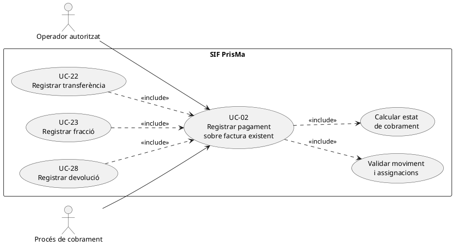

### Vista Mermaid del cas general de cobrament sobre factura

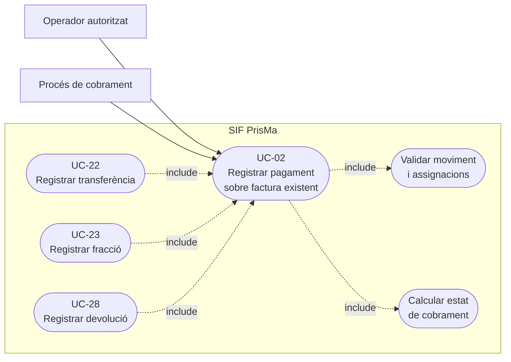

## 3. Subdiagrama de classes executables

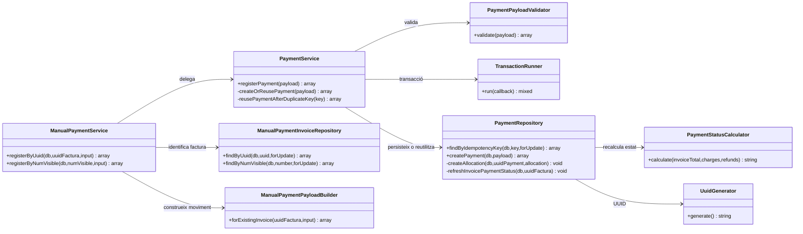

**Observació:** `ManualPaymentService` és l'adaptador de servei per al pagament manual d'una factura identificada per UUID o número; `sif/public/api/payments/register.php` instancia **directament** `PaymentService`. No donar per implementat un recorregut de pantalla que no s'ha traçat.

### 3.1. Projecció del model general: control d'identitat de l'ingrés i invariants monetaris — DISSENY PENDENT

El subdiagrama executiu anterior descriu el PHP que hi ha; aquest **segon subdiagrama és exclusivament contracte de disseny** i no afegeix mètodes ficticis a `PaymentService` actual. El guard ha d'identificar un fet extern únic abans de crear un `CHARGE`, verificar titularitat/assignacions i comparar reintents contradictoris.

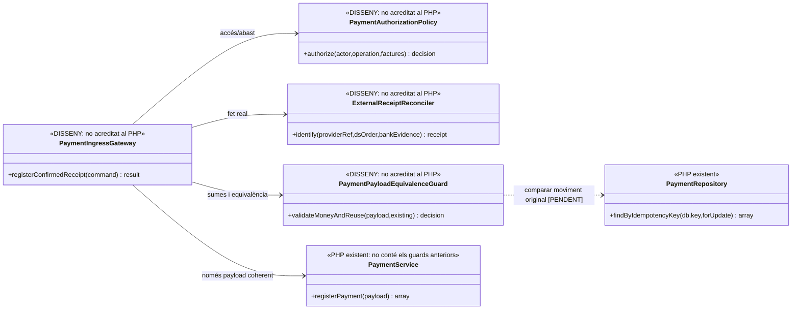
## 4. Diagrama de seqüència — registre genèric del moviment

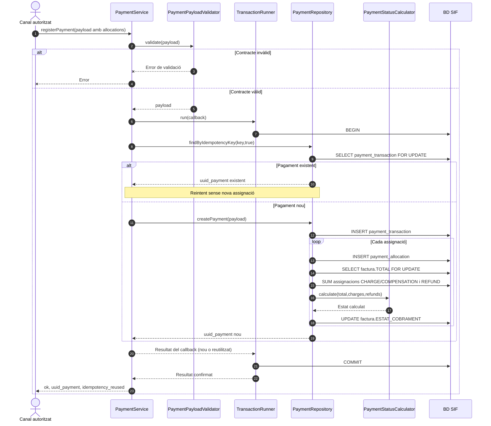

## 5. Diagrama de seqüència — variant manual d'una factura existent

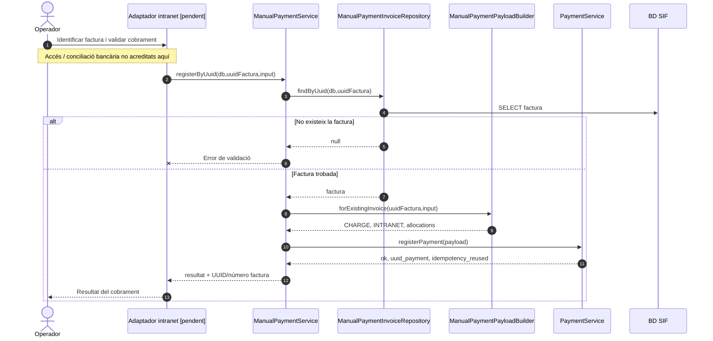

En la variant manual, el constructor normalitza l'import positiu, admet `TRANSFERENCIA` o `MANUAL`, requereix la data i genera la clau idempotent per referència o per combinació factura/data/import/banc. **L'evidència que una transferència ha arribat realment no es pot inferir d'aquesta construcció del payload.**

## 5.1. Seqüència d'error, reintent i conflicte de payload — nucli actual versus control objectiu

**Lectura del PHP actual:** `PaymentPayloadValidator::validate()` comprova camps i numericitat, però no exigeix `amount > 0`, imports assignats positius, suma d'assignacions igual al moviment ni una coincidència entre factura, titular i ingrés extern. A main, `PaymentRepository::hashPayload()` persisteix `PAYLOAD_HASH` versionat i `PaymentService::assertSamePayload()` **el compara** en reús de la clau; les comprovacions externes de titularitat/saldo continuen pendents. L'endpoint `public/api/payments/register.php` crida el servei directament; autorització de l'actor i prova bancària no queden acreditades només pel PHP de la ruta.

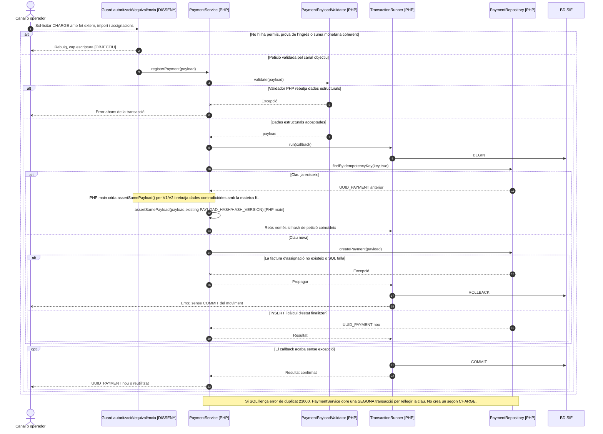

**El guard extern dibuixat no està implementat.** La comparació del PAYLOAD_HASH sobre **la mateixa clau** sí que és PHP main; no demostra identitat bancària entre claus diferents, titularitat del saldo ni disponibilitat per reassignar. El hash de petició no substitueix els controls monetaris pendents.

## 5.2. Acció específica: ingrés nou versus imputació d'un ingrés ja registrat

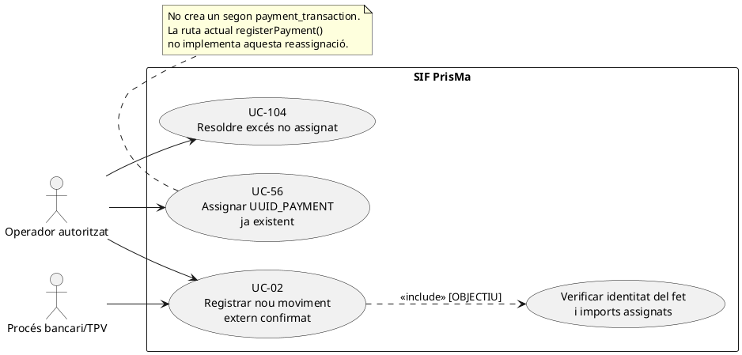

### Vista Mermaid de registre d'un ingrés extern nou

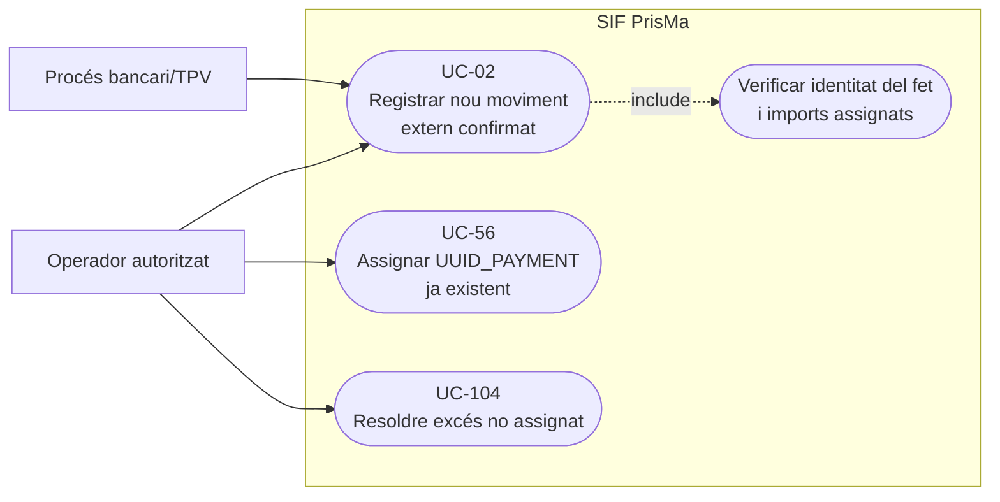

| ID prova pendent | Petició | Resultat exigible |
| --- | --- | --- |
| CP-02-01 | Mateixa clau i mateix ingrés/assignacions | Mateix `UUID_PAYMENT`, cap segon `CHARGE`. |
| CP-02-02 | Mateixa clau amb import, factura o tipus canviats | Conflicte abans de retornar èxit; no fingir equivalència pel reús. |
| CP-02-03 | Import del moviment diferent de suma assignacions | Rebuig abans de l'INSERT; sense import perdut o inventat. |
| CP-02-04 | Dues claus per la mateixa referència bancària confirmada | Una sola entrada externa; conciliació del fet abans de `registerPayment`. |
| CP-02-05 | Factura inexistent durant l'INSERT de l'assignació | `ROLLBACK` del moviment nou i de les assignacions; cap èxit prematur. |
| CP-02-06 | Factura prèvia UC-04, transferència posterior | Reutilitzar UUID_FACTURA; un `UUID_PAYMENT` nou i cap segona factura fiscal. |
### 5.3. Acció independent: comprovar si un ingrés manual ja existeix per referència abans d'atribuir-lo a una factura — PHP existent / guard pendent

**Actor/disparador:** gestió introdueix una transferència confirmada amb referència bancària i factura destí; la mateixa referència pot aparèixer de nou perquè es tracta d'un reintent real o perquè una transferència legítima de 200 € cobreix dues factures. **Precondició objectiu:** identificar **una única entrada de banc** i les assignacions originals i pendents, titular, import, factura i inscripcions d'origen; no interpretar dues peticions d'interfície com dos ingressos externs. **Postcondició:** reutilitzar un `UUID_PAYMENT` per **la mateixa operació externa**, sense crear segon `CHARGE`, i comprovar si la factura sol·licitada ja té un tram assignat; si falta repartir l'ingrés existent, tramitar UC-56/105 amb writer segur o bloquejar-ho com a pendent, no retornar un fals pagament de B.

**Límit PHP precís:** `ManualPaymentPayloadBuilder::idempotencyKey()` usa `<method>|REF:<reference>` quan hi ha referència, **sense factura ni import**. A `main`, `PaymentService::createOrReusePayment()` recupera el moviment per clau **i compara el hash de la petició completa** amb `assertSamePayload()`; per tant, una nova assignació a B sota la mateixa K produeix `CONFLICT`, no un reús silenciós. `ManualPaymentService::registerForInvoice()` afegeix a la resposta `uuid_factura` i `num_visible` de la **factura que ha rebut en aquesta petició**. Així, una primera alta A/100 i una segona sol·licitud B/100 amb la mateixa referència i K **s'han de rebutjar a `main` per divergència del payload**; no es crea cap assignació B. Si una petició duplicada és idèntica però el canal vol representar-la com a factura diferent, la resposta del servei s'ha de contrastar amb l'assignació real abans de mostrar-la com a cobrada. A diferència de dos ingressos reals, una transferència multifactura necessita conservar el mateix moviment i comprovar/repartir els trams; el PHP actual `PaymentRepository::createPayment()` només insereix assignacions en crear el moviment, no les afegeix a un moviment existent en el reús.

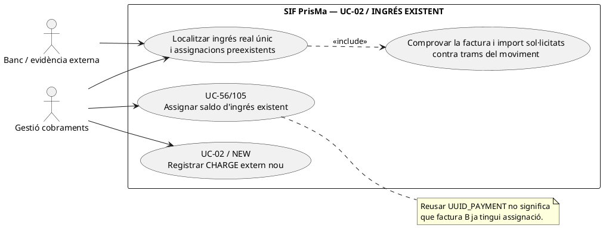

### Vista Mermaid de consulta d'un ingrés extern preexistent

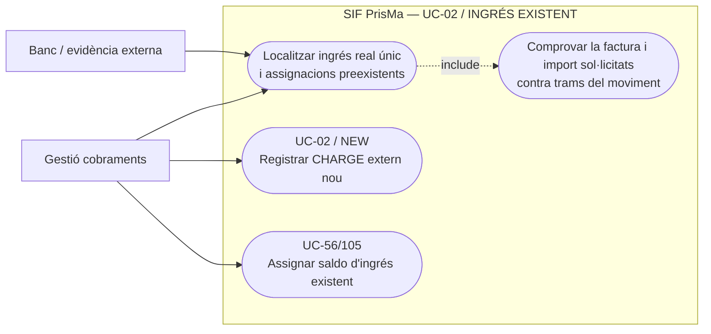

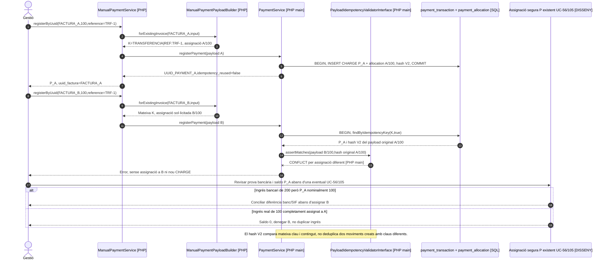

### 5.4. Acció independent: rebutjar la reutilització d'una clau econòmica amb contingut diferent — PHP main per payload de K; contrast del fet extern i saldo pendent

**Actor/disparador:** un callback o una alta manual repeteix `idempotency_key=K` amb `IMPORT`, `TIPUS_MOVIMENT`, `UUID_FACTURA` d'assignació, referència bancària o titular nous. **Resultat objectiu:** comparar **sota bloqueig** el moviment existent, referència externa i **totes** les assignacions persistides, més origen i import extern; retornar el mateix UUID només si és **la mateixa petició semàntica** i l'estat extern coincideix. Amb contingut canviat, `CONFLICT` i incidència en lloc d'un fals `idempotency_reused=true`. A main, `PaymentService::assertSamePayload()` **sí que compara** `PAYLOAD_HASH` segons versió 1/2 sota transacció abans de retornar el UUID existent. Aquest control cobreix la petició completa per K, però **no compara** necessàriament dues referències bancàries externes relacionades sota claus diferents, ni comprova disponibilitat d'una assignació addicional sobre P. Per a dues factures dins d'una transferència única, comparar els trams reals, no exigir que cada crida genèrica de `registerPayment()` modifiqui el mateix UUID, perquè no implementa aquesta extensió.

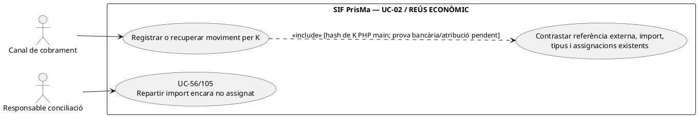

### Vista Mermaid de comprovació de reús econòmic per clau

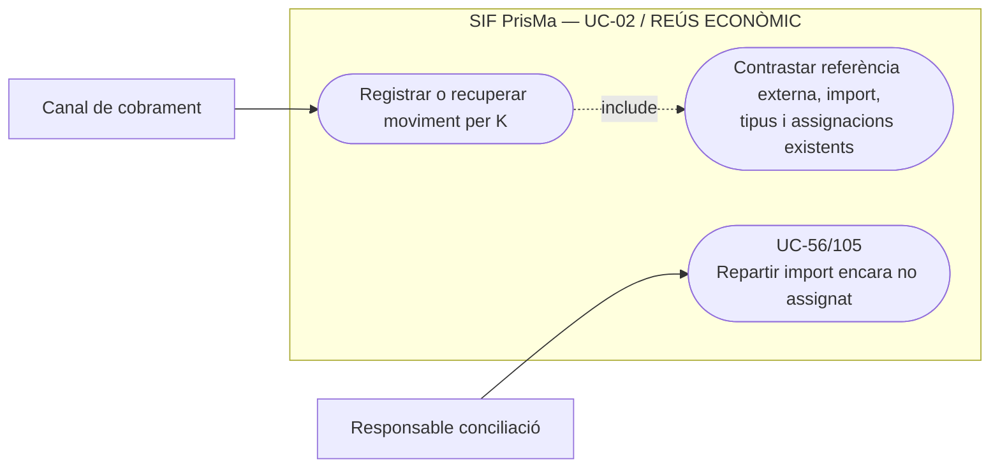

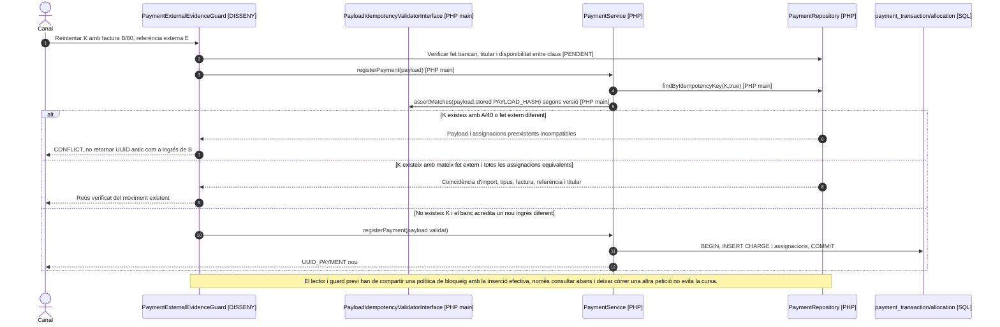

| Prova pendent | Escenari | Resultat objectiu i comportament PHP a reproduir |
| --- | --- | --- |
| CP-02-08 | Alta A/100 amb clau K i transferència TRF-1; segona petició per B/100 amb la mateixa K | **PHP main: CONFLICT per payload/assignació diferent**, no atribueix B. Si la segona petició utilitza **una K diferent** amb la mateixa transferència, cal guard d'identitat bancària extern pendent. |
| CP-02-09 | Entrada externa/SIF real de 200 amb una sola assignació de 100 a A i pendent 100 de B | Mateix `UUID_PAYMENT` i dues assignacions només després del writer UC-56/105 i conciliació del sobrant; mai un segon `CHARGE` extern. Si el moviment SIF inicial era de 100, primer resoldre la diferència respecte al banc. |
| CP-02-10 | Mateixa clau K de pagament però import/tipus/assignació nous | **PHP main ja rebutja per assertSamePayload()**, sense segona assignació. Provar contracte V1/V2 i no confondre'l amb el guard entre claus pendent. |
| CP-02-11 | Dos workers fan reús/alta de K amb payloads diferents alhora | **PHP main** usa transacció i relectura després de duplicat SQL amb assertSamePayload(); prova de concurrència i prova d'unicitat del fet bancari entre claus continuen pendents. |

### 5.5. Acció independent: validar els imports totals i els trams abans de crear un CHARGE nou — PHP existent insuficient / guard PENDENT

**Actor/disparador:** el canal ha verificat un ingrés extern nou de 100 € i vol crear-ne un `payment_transaction` amb assignacions a una o diverses factures. **Precondició objectiu:** import extern estrictament positiu i expressat en cèntims; cada tram estrictament positiu, factura existent i titular compatible; `SUM(trams) <= IMPORT` del mateix moviment, amb política explícita si hi ha import **no assignat**; comprovar que `IDEMPOTENCY_KEY` representa el mateix ingrés bancari i no un altre. **Postcondició:** un sol `UUID_PAYMENT` per fet extern i assignacions coherents, o rebuig abans del registre. La suma exactament igual a l'import **no és sempre obligatòria** quan existeix un import pendent de distribuir: el que és inacceptable és consumir més del que s'ha ingressat o tractar el sobrant com a saldo lliure sense verificar-ne l'origen i els compromisos. Per a `REFUND` i `COMPENSATION`, les regles d'elegibilitat de la destinació i de disponibilitat són específiques.

**PHP contrastat:** `PaymentPayloadValidator` només requereix `is_numeric(payload.amount)` i `is_numeric(allocation.amount)`, com a mínim una assignació i valors enumerats de moviment/mètode; **no comprova** positivitat ni suma de trams. `PaymentService` l'executa abans del seu `TransactionRunner` i `PaymentRepository::createPayment()` insereix moviment i cada tram; `refreshInvoicePaymentStatus()` suma `IMPORT_ASSIGNAT` de cada factura sense limitar-ho a `payment_transaction.IMPORT` del mateix ingrés. Un `CHARGE` nominal de 100 amb F1/80+F2/80 pot persistir amb **160 € atribuïts**; una assignació negativa altera el saldo de la factura sense esdevenir un moviment `REFUND` real ni una reversió traçada. El test `RegisterPaymentTest` comprova únicament l'alta coherent 120/120 i un reintent equivalent, **no** imports negatius, zero o repartiment inconsistent.

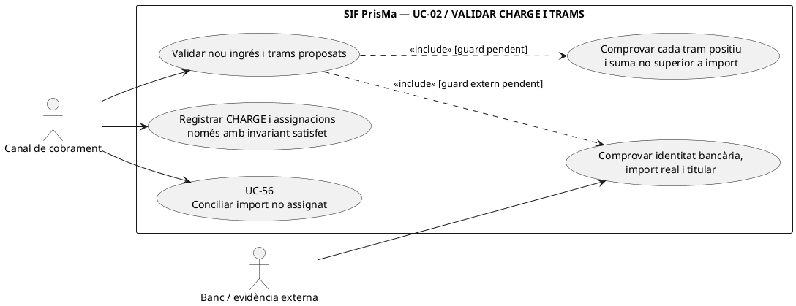

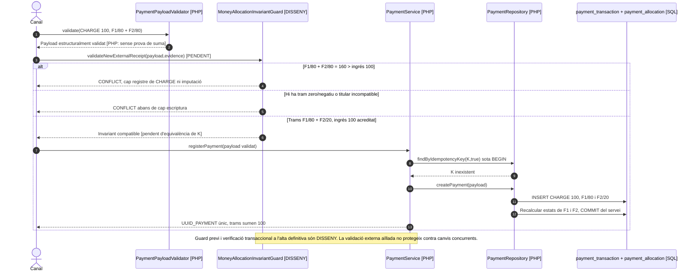

| Prova pendent | Escenari | Resultat objectiu |
| --- | --- | --- |
| CP-02-12 | `amount=100`, dues allocations F1/80 i F2/80 | Rebutjar sobreatribució abans de persistir res; validator PHP actual deixa passar estructura/imports numèrics. |
| CP-02-13 | `amount=100` i allocation F1/-20 o F1/0 | Rebutjar tram no positiu abans de qualsevol canvi d'`ESTAT_COBRAMENT`. |
| CP-02-14 | `amount=100`, F1/80 i 20 sense atribució | Admetre només amb política de saldo pendent i ingrés real acreditat; no mostrar F2 pagada fins a UC-56. |
| CP-02-15 | `amount=100`, F1/80 + F2/20 coherents; intent duplicat K amb repartiment F1/100 | Primer alta coherent; segon `CONFLICT` semàntic, no resposta que presenti distribució nova com a aplicada. |
| CP-02-16 | Pagament nominal 100, trams 160; estats individuals de les factures semblen coherents | Detectar invariant **per UUID_PAYMENT** independentment de `ESTAT_COBRAMENT` per factura, obrir diagnosi sense alterar factura fiscal. |

## 6. Traçabilitat

[Catàleg UC-02](../04-estat-final/33-casos-us-sif.md) · [Fitxa base UC-02](../06-fitxes-funcionals/uc-002.md) · [PaymentService](../../sif/src/Service/PaymentService.php) · [PaymentPayloadValidator](../../sif/src/Service/PaymentPayloadValidator.php) · [PaymentRepository](../../sif/src/Repository/PaymentRepository.php) · [PaymentStatusCalculator](../../sif/src/Domain/PaymentStatusCalculator.php) · [ManualPaymentService](../../sif/src/Service/ManualPaymentService.php) · [ManualPaymentPayloadBuilder](../../sif/src/Service/ManualPaymentPayloadBuilder.php) · [RegisterPaymentTest](../../sif/tests/Integration/RegisterPaymentTest.php).

**No acreditat:** execució de proves, conciliació bancaria real, permisos de la interfície, auditories transversals completes ni posada en producció.
