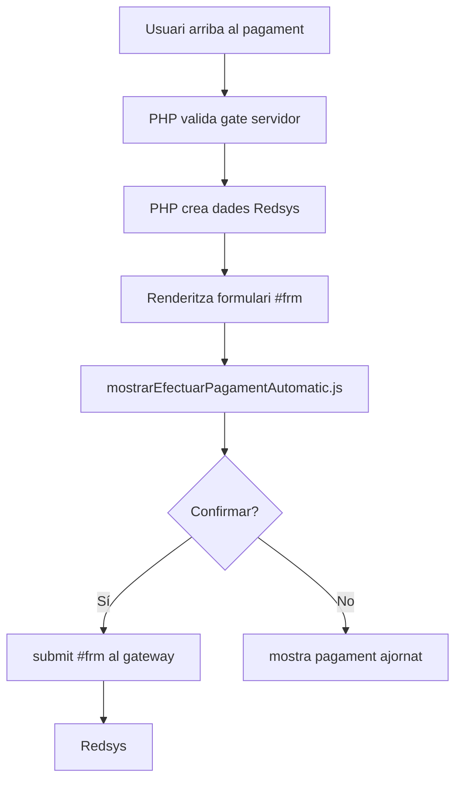
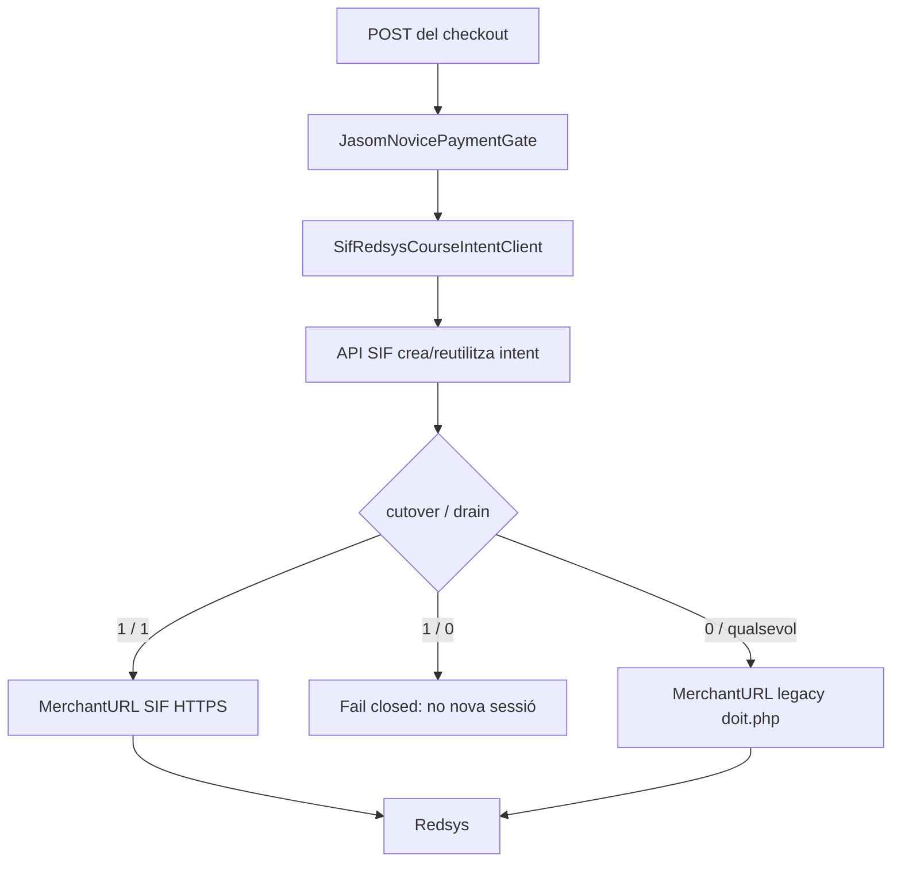
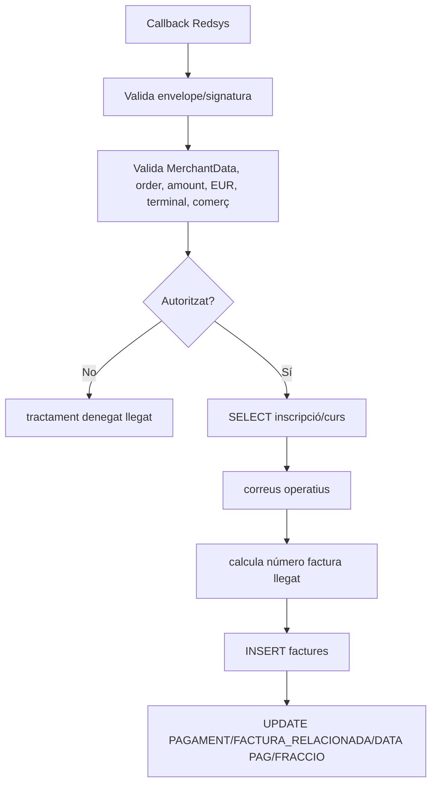
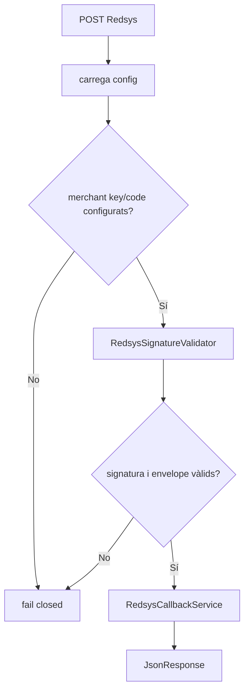
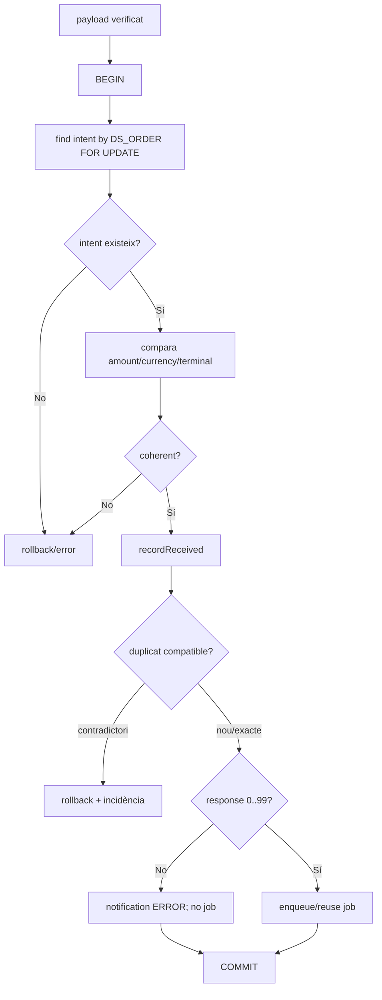
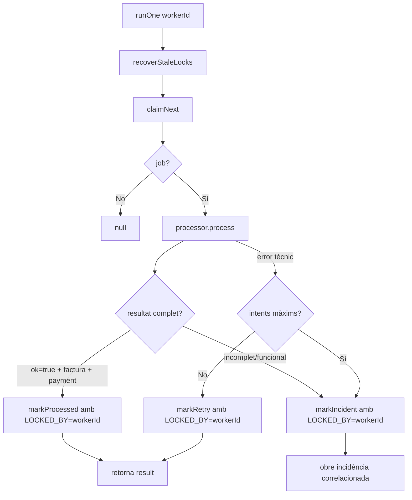
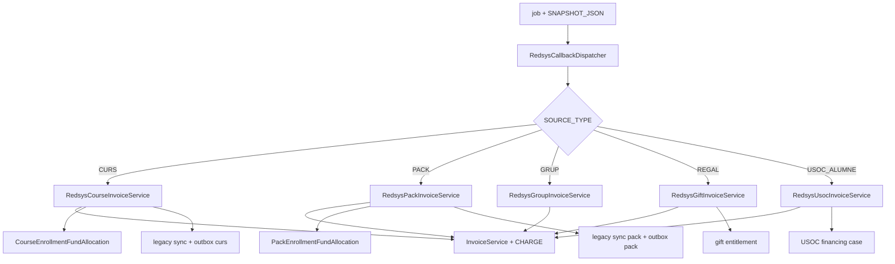
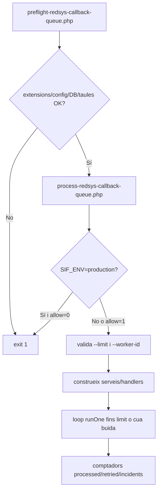

# UC-003 — Diagrames d'activitat ACTUAL/FINAL per superfície i apartat

**Data d'auditoria:** 03/10/2026  
**Nota de modelatge:** UC-003 no és una pantalla d'usuari. Per complir la traçabilitat "per pàgina/apartat", es documenten les superfícies executables que intervenen en el cas. El JS pre-TPV es documenta com a dependència de frontera, no com a processador del callback.

## Índex de superfícies

| ID | Superfície | Tipus | Estat |
| --- | --- | --- | --- |
| P-RED-03-01 | `web-actual/pagina_efectuar_pagament_automatic.php` + JS | pre-TPV ACTUAL | existent |
| P-RED-03-02 | candidata `pay.../pagina_efectuar_pagament_automatic.php` | pont de cutover | existent; JS referenciat no present al snapshot |
| P-RED-03-03 | callback llegat `realitzaPagamentAutomatic.php` / `doit.php` | callback ACTUAL | existent temporal |
| P-RED-03-04 | `sif/public/api/redsys/callback.php` | endpoint FINAL | existent |
| P-RED-03-05 | `RedsysCallbackService` | recepció/dedupe FINAL | existent |
| P-RED-03-06 | `RedsysCallbackWorker` + queue repository | worker FINAL | existent |
| P-RED-03-07 | dispatcher + handlers | domini FINAL | existent |
| P-RED-03-08 | scripts de worker/preflight | operació FINAL | existent; runtime pendent d'evidència |

## P-RED-03-01 — checkout ACTUAL i JS

**ACTUAL:** el JS només governa UX/submit. No valida signatura ni registra cobrament.  
**FINAL:** aquesta responsabilitat continua fora del callback; la preparació de la intenció correspon a UC-063/variant comercial.

## P-RED-03-02 — pont candidat de cutover

**Mancança documental/executable:** el PHP candidat carrega `https://pay.prisma.cat/js/mostrarEfectuarPagament.js`, però el fitxer no és dins de `codi-drive/pay-prisma-cat-canvis-verifactu`. Cal incorporar la còpia exacta desplegable o una evidència immutable del seu origen abans de declarar el frontal candidat completament auditat.

## P-RED-03-03 — callback llegat ACTUAL

**Risc:** segueix sent una escriptura fiscal/econòmica fora del SIF mentre el callback llegat sigui actiu. Els guards de cutover redueixen risc però no substitueixen la retirada final.

## P-RED-03-04 — endpoint FINAL

**Invariant:** no hi ha JavaScript ni efecte fiscal directe a l'endpoint.

## P-RED-03-05 — recepció, correlació i dedupe FINAL

## P-RED-03-06 — worker/cua FINAL

**Canvi d'aquesta auditoria:** les transicions terminals del worker queden condicionades a `LOCKED_BY`, i `PROCESSED` exigeix `ok=true`, `uuid_factura` i `uuid_payment`.

## P-RED-03-07 — dispatcher i handlers FINAL

**Cobertura desigual conscient:** l'atribució quantitativa `enrollment_fund_movement` és explícita per CURS i PACK. GRUP/REGAL/USOC tenen efectes específics diferents i s'han d'avaluar segons el seu contracte propi; UC-003 no ha de declarar-los equivalents sense prova.

## P-RED-03-08 — operació del worker

**Pendent operatiu:** el repositori acredita script i preflight, però aquesta auditoria no acredita encara cron/supervisor, freqüència, alertes, secrets ni execució real a `sif_pre`/producció.

## 9. Matriu ACTUAL/FINAL per apartat

| Apartat | ACTUAL | FINAL | Estat |
| --- | --- | --- | --- |
| Preparació TPV | web PHP + JS | intenció SIF abans del TPV | candidat/SIF implementat |
| Callback | script llegat monolític | endpoint curt + servei | implementat |
| Signatura | RedsysAPI llegat endurit | `RedsysSignatureValidator` | implementat |
| Dedupe | no autoritat central | notification + queue unique/reuse | implementat |
| Factura | INSERT llegat | InvoiceService | implementat |
| Cobrament | camps acumulatius | payment_transaction/allocation | implementat |
| Concurrència | no modelada | claim + LOCKED_BY + stale recovery | implementat; fencing reforçat |
| Retry | no homogeni | 1/5/15/60 min | implementat |
| Incidència | ad hoc | errors_verifactu | implementat |
| JS | present a web-actual | no necessari al callback; candidat incomplet al snapshot | parcial |
| Runtime worker | no | script + preflight | codi sí, operació pendent |
| Cutover | legacy actiu | flags/drain + MerchantURL SIF | codi sí, execució pendent |

## 10. Estat

**DOCUMENTAT:** 8 superfícies ACTUAL/FINAL.  
**IMPLEMENTAT:** nucli FINAL i pont de cutover al repositori.  
**VERIFICAT:** proves automatitzades específiques existents; CI del head de l'auditoria encara pendent.  
**PENDENT:** JS candidat, preproducció Redsys, cron/supervisió, factura prèvia i retirada final dels callbacks llegats.
