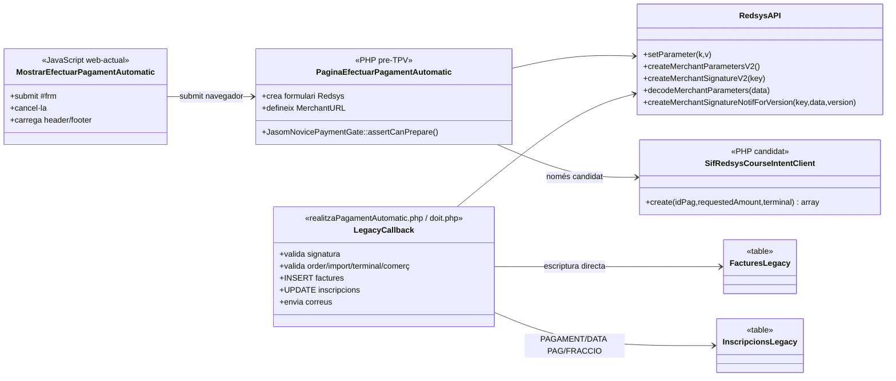
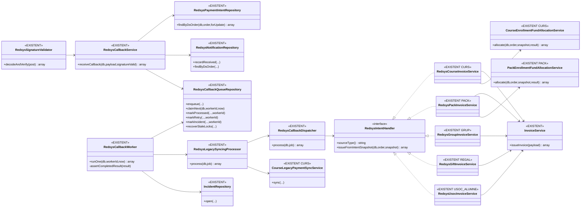
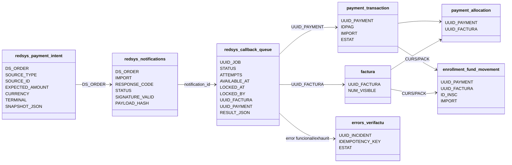

# UC-003 — Diagrames de classes ACTUAL i FINAL

**Data d'auditoria:** 03/10/2026  
**Abast:** recepció i processament asíncron d'un cobrament Redsys després que existeixi una intenció pre-TPV.  
**Regla d'evidència:** ACTUAL = codi llegat/candidat existent al repositori. FINAL = codi SIF executable existent; els elements encara no acreditats a preproducció es marquen com a pendents d'evidència.

## 1. ACTUAL — callback llegat i pont candidat

### Lectura ACTUAL

- El JS no processa el callback: només confirma/cancel·la i envia el formulari al TPV.
- La còpia `web-actual` conserva el circuit fiscal llegat, protegit per flags de cutover/drain però amb `INSERT factures` i `UPDATE inscripcions` mentre el fallback segueixi habilitat.
- La candidata `pay-prisma-cat-canvis-verifactu` ja crea/reutilitza una intenció SIF i pot seleccionar la MerchantURL SIF amb flags explícits.
- La candidata referencia `https://pay.prisma.cat/js/mostrarEfectuarPagament.js`, però aquesta còpia JS **no és present** dins del snapshot `codi-drive/pay-prisma-cat-canvis-verifactu`; per tant, el JS candidat no es pot declarar auditat 1:1 des del repositori.
- `doit.php` continua sent callback llegat temporal i muta dades llegades si no s'ha executat el cutover complet.

## 2. FINAL — recepció, cua i worker SIF

## 3. Persistència FINAL

## 4. Correspondència ACTUAL → FINAL

| Responsabilitat | ACTUAL | FINAL |
| --- | --- | --- |
| Preparar ordre | PHP del canal; candidat ja pot demanar intenció SIF | UC-063 + `redsys_payment_intent` |
| Validar resposta Redsys | callback monolític | `RedsysSignatureValidator` |
| Correlacionar import/divisa/terminal | dades/signatura del callback + context llegat | intenció bloquejada per `DS_ORDER` |
| Dedupe notificació | no acreditat globalment al llegat | `RedsysNotificationRepository` |
| Desacoblar HTTP | no | `redsys_callback_queue` |
| Exclusió entre workers | no | `claimNext()` + `LOCKED_BY`; endurit en aquesta auditoria també a transicions terminals |
| Factura/cobrament | callback escriu directament | handlers → `InvoiceService` |
| Resultat complet | implícit | worker exigeix `ok=true`, `uuid_factura` i `uuid_payment` abans de `PROCESSED` |
| Retry/incidència | ad hoc | `RETRY`/backoff/`INCIDENT` |
| Atribució per inscripció | camps acumulatius llegats | `enrollment_fund_movement` implementat per CURS i PACK |
| Sync llegat | dins callback | postprocés posterior al SIF; específic de CURS i modes amb `legacy_sync` |

## 5. Estat

**DOCUMENTAT:** classes ACTUAL i FINAL separades.  
**IMPLEMENTAT:** callback SIF, validació criptogràfica, intenció/notificació/cua, worker, dispatcher, cinc handlers, factura+cobrament, incidències, sync i atribució CURS/PACK. L'enduriment de resultat complet i propietat del lock està implementat a la branca d'auditoria.  
**VERIFICAT:** existeixen proves d'integració i unitàries específiques; la verificació CI del head d'aquesta auditoria queda pendent fins que s'executin els workflows del PR.  
**PENDENT:** cutover/preproducció Redsys real; resolució segura de factura preexistent amb clau diferent; evidència d'operació/cron; completar o justificar atribució quantitativa per les variants on sigui funcionalment necessària; JS candidat absent del snapshot.
