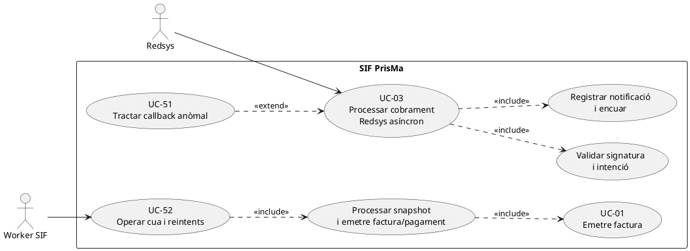
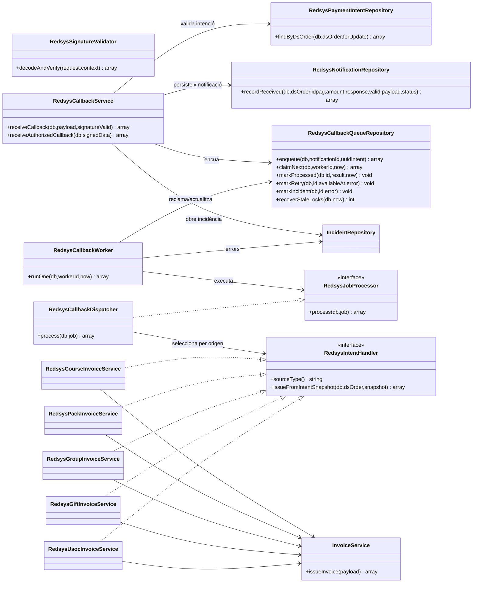
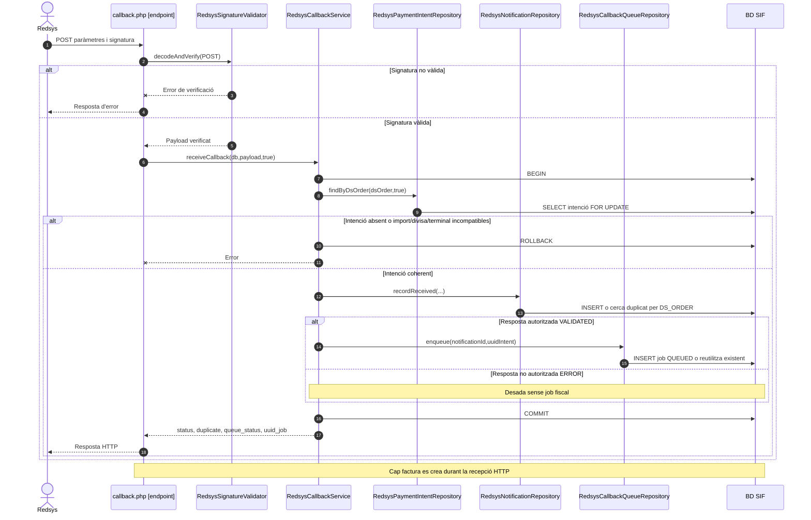
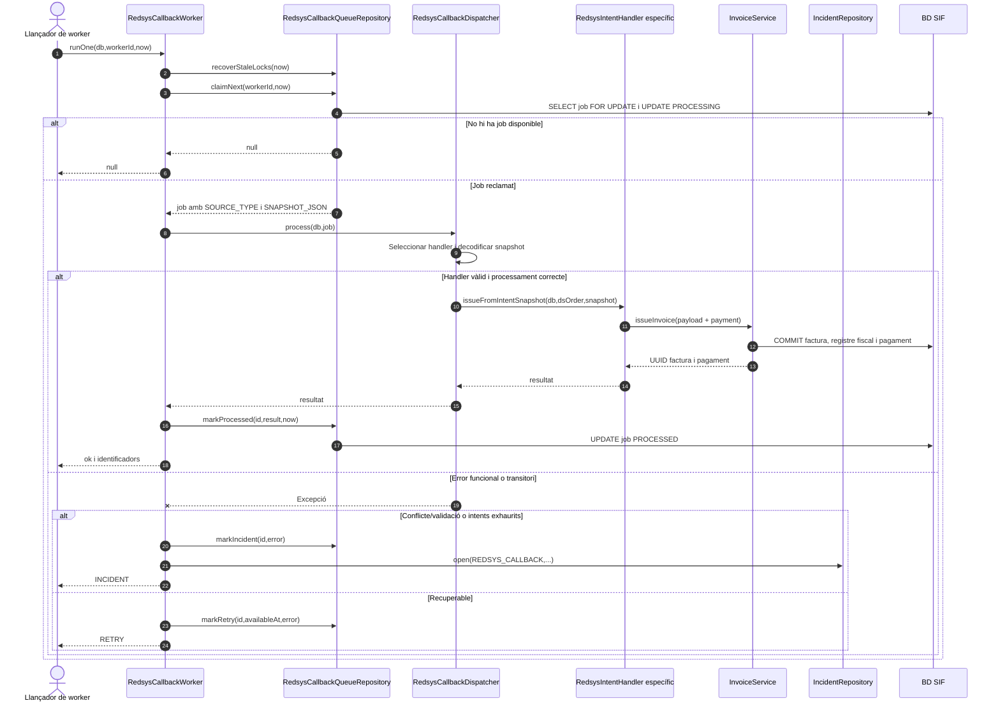
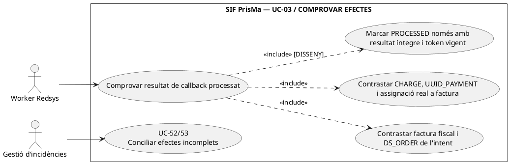

# UC-03 · Processar un cobrament Redsys asíncron — fitxa i UML integrats

**Estat:** codi de recepció, cua, worker i despatxador present al repositori consultat; les proves d'integració existeixen però **no s'han executat en aquesta revisió**. La integració productiva de tots els canals i la supervisió operativa continuen subjectes a verificació. **Relacions:** UC-63 (crear intenció pre-TPV), UC-14/15/16/17/19a (tipus de venda), UC-01 (factura), UC-02 (pagament), UC-51 (callbacks anòmals), UC-52 (operar cua), UC-08/81 (incidències). `redsys_callback_queue` i `fiscal_queue` són cues diferents.

## 1. Fitxa de cas d'ús

| Camp | Regla/acció específica |
| --- | --- |
| Actor iniciador | Redsys, com a sistema extern que envia la notificació HTTP; després, `RedsysCallbackWorker` com a actor automàtic. |
| Precondició de negoci | Existeix una intenció de pagament `redsys_payment_intent` amb `DS_ORDER`, import, divisa, terminal, tipus d'origen i snapshot del moment pre-TPV. |
| Precondició de seguretat | `RedsysSignatureValidator` verifica la signatura de `Ds_MerchantParameters`; si falla, el callback és rebutjat abans d'entrar a `receiveCallback()`. |
| Dades comprovades al callback | `ds_order`, `amount`, `response_code`, `currency`, `terminal`; s'exigeix coincidència d'import, divisa i terminal amb la intenció trobada per `DS_ORDER`. |
| Autorització de la notificació | El servei només encua quan el codi de resposta és numèric i comprès entre 0 i 99, amb estat `VALIDATED`. Altrament desa la notificació en estat `ERROR` i no crea job. |
| Postcondició inicial | Persistència de la notificació i, si és autoritzada, job a `redsys_callback_queue`; **no es crea cap factura durant la petició HTTP del callback**. |
| Postcondició asíncrona | El worker reclama el job, selecciona el handler segons `SOURCE_TYPE`, utilitza `SNAPSHOT_JSON`, invoca la generació fiscal/econòmica del SIF i marca `PROCESSED`, `RETRY` o `INCIDENT`. |

### 1.1. Flux principal, separat per responsabilitats

**Fase A · Abans del TPV (UC-63, condició de UC-03).** `RedsysPaymentIntentService::create()` valida `ds_order`, `source_type` (`CURS`, `PACK`, `GRUP`, `REGAL`, `USOC_ALUMNE`), import positiu, divisa, terminal, identificador d'origen i snapshot no buit; insereix o reutilitza la intenció quan `DS_ORDER` i dades coincideixen. Una mateixa ordre amb dades diferents produeix conflicte.

**Fase B · Recepció HTTP.**

1. `sif/public/api/redsys/callback.php` inicialitza el validador de signatura i `RedsysCallbackService`, verifica `$_POST` i lliura el payload validat.
2. El servei inicia una transacció; cerca i bloqueja la intenció per `DS_ORDER` i verifica import, divisa i terminal.
3. Classifica la resposta com a `VALIDATED` o `ERROR`; `RedsysNotificationRepository::recordReceived()` crea la notificació o reconeix el duplicat exacte.
4. Si és `VALIDATED`, `RedsysCallbackQueueRepository::enqueue()` crea o reutilitza el job associat a la notificació. Confirma la transacció i retorna `status`, `duplicate`, `queue_status` i `uuid_job` si n'hi ha.
5. La resposta HTTP **no espera el processament de factura i pagament**.

**Fase C · Execució asíncrona.**

6. `RedsysCallbackWorker::runOne()` recupera locks caducats i reclama un job amb estat `QUEUED` o `RETRY`, disponible segons `AVAILABLE_AT`. El repositori bloqueja el registre i passa l'estat a `PROCESSING`, incrementant `ATTEMPTS`.
7. `RedsysCallbackDispatcher` llegeix `SOURCE_TYPE` i `SNAPSHOT_JSON` i invoca el handler implementat de curs, pack, grup, regal o USOC; el flux del curs, per exemple, construeix el payload des del snapshot i la notificació validada i crida `InvoiceService::issueInvoice()` amb cobrament inicial.
8. Si el processament retorna resultat, la cua marca `PROCESSED`, conserva `RESULT_JSON`, `UUID_FACTURA` i `UUID_PAYMENT`.
9. Davant error funcional `409`/`422` o intents exhaurits, la cua marca `INCIDENT` i obre una incidència; altrament programa `RETRY` segons el retard definit al worker.

### 1.2. Alternatives i límits verificats

| Escenari | Comportament del codi consultat |
| --- | --- |
| Signatura incorrecta | `RedsysSignatureValidator` rebutja el callback abans que el servei creï notificació o job en aquest camí. |
| Ordre desconeguda | El servei rebutja una notificació sense intenció preexistent. |
| Import, divisa o terminal diferents | Error de validació abans de registrar la notificació. |
| Resposta no autoritzada | Es guarda amb estat `ERROR` i no s'encua cap feina fiscal. |
| Callback duplicat exacte per `DS_ORDER` | El repositori retorna `duplicate=true` i la notificació existent; un encolat repetit reutilitza el job corresponent. |
| Callback contradictori pel mateix `DS_ORDER` | El repositori retorna conflicte 409; el servei desfà la transacció i intenta obrir una incidència `REDSYS_CALLBACK` abans de propagar l'error. |
| Job sense handler admès o snapshot invàlid | El despatxador retorna error funcional; el worker el deriva a incidència. |
| Error transitori del worker | `RETRY` amb esperes de 1, 5, 15 o 60 minuts en funció de l'intent, segons el codi. |
| Job bloquejat més de 15 minuts | `recoverStaleLocks()` el torna a posar en `RETRY`; la idempotència d'emissió i pagament és essencial si l'execució anterior ja havia fet commits. |
| Límits pendents | Traçabilitat final d'inscripció i sincronització llegat, proves de producció, controls d'autorització de les operacions posteriors i recuperació d'incidències requereixen evidència addicional. |

**Dades afectades:** `redsys_payment_intent` (precondició), `redsys_notifications`, `redsys_callback_queue`, `errors_verifactu` o taules utilitzades pel repositori d'incidències segons l'esquema real, i, un cop executat el handler, `factura`, `factura_linia`, `factura_registres`, `fiscal_queue`, `payment_transaction`, `payment_allocation` i relacions d'origen.

**Proves localitzades, no executades:** `RedsysAsyncFlowTest::testAuthorizedCallbackIsProcessedAsynchronouslyFromSnapshot` i `testTwoConnectionsCannotClaimSameJob`, a més de proves de callback, worker, despatxador, signatura i handlers específics.

### 1.3. Revisió: recepció, cobrament i atribució a participants — PENDENT

El callback validat i l'encuat **no** són un assentament de diners per inscripció. Quan un handler del worker confirma una factura amb cobrament inicial, ha de conservar `DS_ORDER`, `IDPAG`, `UUID_PAYMENT` i, **per cadascuna de les inscripcions del snapshot**, l'import realment atribuït. El pagament extern és únic; el detall intern pot tenir diverses files per curs, pack, grup o finançament mixt. Una repetició de callback/worker ha de reutilitzar **tant** el cobrament **com** totes les atribucions, sense inserir línies econòmiques noves. El repositori actual crea `payment_allocation` per **factura**, no el registre quantitatiu per participant; la distribució i el control de reintents del nou ledger són **disseny pendent**.

[Model de moviments per inscripció](00-revisio-moviments-inscripcions.md).

### 1.4. El callback antic, la factura ja emesa i la sincronització acadèmica — contrast amb el xat original

**C-LEGACY — recorregut antic acreditat.** `realitzaPagamentAutomatic.php` rebia `Ds_MerchantParameters` i `Ds_Signature`, cercava la inscripció per `IDPAG`, creava una factura local `A{any}/{ordre}` amb `NUM_COMANDA=Ds_Order`, actualitzava `inscripcions.PAGAMENT`, `DATA PAG`, `FACTURA_RELACIONADA` i `FRACCIO`, i enviava correus de confirmació. El projecte indica que la signatura es calculava, però cal **verificar que el codi productiu la comparés abans de modificar BD**; no donar per segura la ruta antiga perquè en contingués el càlcul. El callback final del SIF valida signatura i ordre, persisteix notificació i encua, **sense generar numeració a l'endpoint HTTP**.

**C-FACTURA — deute facturat abans de Redsys.** El contracte llegat exigeix: si ja hi ha una factura fiscal real per la inscripció o factura d'empresa, `registerPayment()` sobre aquesta; només si no hi ha cobertura i la venda és facturable, `issueInvoice()` amb pagament inicial. El handler actual `RedsysCourseInvoiceService::issueFromIntentSnapshot()` construeix payload i crida `InvoiceService::issueInvoice()`; en la ruta consultada **no hi ha un branch acreditat de consulta de factura prèvia per inscripció**. La reutilització per clau Redsys no resol una factura real prèvia emesa amb **una altra** clau. Integrar aquest control abans de posar en producció el circuit de factura prèvia pagada per TPV; si el callback arriba i no es pot determinar una factura única, conservar l'ingrés real i obrir conciliació, no emetre una segona factura alternativa.

**C-FONS — estat del pagament vs estat de matrícula.** Una notificació autoritzada pot precedir a l'emissió pel worker; el resultat `VALIDATED` no equival encara a `UUID_FACTURA` ni a accés acadèmic. Quan el SIF confirma, l'adaptador sincronitza `PAGAMENT`, `DATA PAG`, `FRACCIO` i relacions del llegat **com a resum**, i tracta la concessió d'accés com a fase independent. Una fallada d'aquesta sincronització **no** reobre la venda fiscal ni autoritza un segon CHARGE. El correu de factura/PDF/QR s'envia quan el document corresponent està disponible i el receptor és autoritzat; si hi ha incidència documental, comunicar l'estat sense prometre un document encara inexistent.

**C-ESTAT CANVIAT — callback després de baixa/curs modificat.** El snapshot fiscal original roman intacte, però abans d'executar els efectes acadèmics del cobrament cal consultar si la inscripció continua vigent, ha canviat de curs, està cancel·lada o ha estat assumida per una factura de grup. Si el banc ja ha ingressat els diners, preservar `DS_ORDER` i `UUID_PAYMENT` i classificar-ne la destinació/retorn o incidència (UC-51/71/72); no reactivar la matrícula ni assignar-los automàticament al curs antic.

### 1.5. Proves d'integració específiques pendents (no executades)

| ID | Escenari | Evidència esperada |
| --- | --- | --- |
| RC-03-01 | Callback correcte per venda sense factura | Un CHARGE i una factura SIF, cap numeració fiscal al callback HTTP antic. |
| RC-03-02 | Callback per factura prèvia existent | Un CHARGE sobre el UUID_FACTURA anterior, sense una segona factura. |
| RC-03-03 | Doble callback mateixa DS_ORDER | Un moviment extern i una emissió/assignacions internes idempotents. |
| RC-03-04 | Callback denegat i després acceptat amb IDPAG compartit però ordres diferents | Només CHARGE de l'intent acceptat. |
| RC-03-05 | Commit fiscal correcte, sincronització acadèmica o PDF fallits | UUIDs conservats, incidència/reintent de fase, cap nova emissió fiscal. |
| RC-03-06 | Callback confirmat després de baixa o canvi de curs | Cap alta acadèmica automàtica sobre estat obsolet; cobrament reconciliat. |

## 2. Diagrama UML de casos d'ús



La frontera HTTP/worker apareix explícita al diagrama de seqüència: aquest diagrama de casos d'ús mostra l'abast funcional conjunt, **no** que el callback emeti immediatament.

## 3. Subdiagrama de classes del circuit Redsys



**Precisió:** `callback.php` és un script/endpoint, no una classe PHP. La creació de la intenció (`RedsysPaymentIntentService`) és UC-63, una operació anterior que no s'ha d'ocultar dins la recepció.

## 4. Diagrama de seqüència A — notificació HTTP i encuat



**Excepció separada:** si arriba una notificació contradictòria pel mateix `DS_ORDER`, es desfà la transacció; el servei intenta obrir una incidència i retorna conflicte. No s'ha dibuixat com a simple duplicat correcte.

## 5. Diagrama de seqüència B — consum asíncron del job



**Observació de fiabilitat:** el resultat fiscal i el marcador `PROCESSED` són operacions separades. Si s'ha confirmat la factura/pagament però falla el canvi d'estat del job, la repetició depèn de la idempotència i dels mecanismes de recuperació, no d'un rollback únic de tot el circuit.

### 5.1. Acció independent: constatar que el callback cobrat ha generat un resultat fiscal i econòmic complet — PHP parcial / DISSENY

**Actor/disparador:** després que el handler del worker retorni un array, es vol donar per completat el processament d'un **cobrament TPV validat**. **Precondicions objectiu:** `DS_ORDER` i intenció/notificació verificats; `UUID_FACTURA` real, cobertura i receptor coherents; `UUID_PAYMENT` del moviment `CHARGE` original amb assignació a la factura apropiada; estat de resultat i propietat de l'intent de cua verificats. **Postcondició:** confirmació de la fase fiscal/econòmica o incidència de conciliació; la disponibilitat del PDF, el resultat AEAT i la sincronització de matrícula són fases **independents**.

**Límit de codi comprovat:** `RedsysCallbackWorker::runOne()` considera que el retorn de `RedsysJobProcessor::process()` és suficient per cridar `markProcessed()`. No valida `result['ok']` ni exigeix que existeixin `uuid_factura`/`uuid_payment`. `markProcessed()` accepta `result['uuid_factura'] ?? null` i `result['uuid_payment'] ?? null`. Per tant, `redsys_callback_queue.STATUS=PROCESSED` **no és, per si sol, prova que s'hagi persistit un ingrés atribuït a la factura**; s'ha d'anar a les taules de factura/pagament/assignacions. A més, recuperar un lock de més de 15 minuts no garanteix que hagi mort el primer worker: les marques finals només exigeixen `STATUS=PROCESSING`, sense contrast de `LOCKED_BY` o generació (UC-52).



```mermaid
sequenceDiagram
autonumber
actor W as Worker
participant H as RedsysCallbackDispatcher/handler [PHP]
participant V as RedsysJobResultValidator [DISSENY]
participant F as factura + fact_rels + registres [LECTURA]
participant P as payment_transaction/allocation [LECTURA]
participant Q as RedsysCallbackQueueRepository [PHP]
W->>H: process(J amb DS_ORDER validat)
H-->>W: result array
W->>V: verify(J,result,claimToken) [PENDENT]
alt result.ok absent/false o no hi ha factura
 V-->>W: ERROR/RECONCILE; no marcar pagat
else Factura aparentment emesa
 V->>F: Verificar UUID_FACTURA, receptor/cobertura i ordre original
 V->>P: Verificar UUID_PAYMENT, CHARGE i assignacions coherents
 alt Cobrament absent, assignat a altra factura o quantia discrepant
  P-->>V: PAYMENT_MISSING/CONFLICT
  V-->>W: UC-02/56/53, cap PROCESSED econòmic fals
 else Resultat íntegre i propietat del job vigent
  P-->>V: UUID_FACTURA i UUID_PAYMENT verificats
  W->>Q: markProcessed(J,result,temps de finalització) [token PENDENT]
  Q-->>W: Job PROCESSED; AEAT/PDF/sync llegada continuen independents
 end
end
Note over V,Q: El PHP actual fa markProcessed directament en rebre qualsevol array. Validació d'efectes i fencing són objectiu.
```

| Prova pendent | Escenari | Resultat exigible |
| --- | --- | --- |
| RA-03-07 | El processador retorna `ok=true` sense `uuid_payment` per una venda TPV cobrada | Job pendent de conciliació, no resultat de cobrament complet per la sola marca PROCESSED. |
| RA-03-08 | El processador retorna `uuid_payment` aliè a `uuid_factura` de la mateixa ordre | Detectar assignació contradictòria abans de donar èxit al circuit. |
| RA-03-09 | El worker A supera 15 minuts i B reclama el mateix job, però A retorna abans que B | Resultat terminal només de l'intent vigent, o incidència controlada per intent obsolet; no sobrescriure B amb A. |
| RA-03-10 | Factura prèvia amb clau diferent existeix abans de processar el callback | Comprovar cobertura abans d'emetre; assignar ingrés únic a factura real original o obrir incidència, sense duplicar-la. |

## 6. Traçabilitat i punts pendents

[Fitxa anterior UC-03](../06-fitxes-funcionals/uc-003.md) · [Catàleg d'actors i casos](../04-estat-final/33-casos-us-sif.md) · [Diagrames generals](../04-estat-final/31-diagrames-classes-sif.md) · [RedsysCallbackService](../../sif/src/Service/RedsysCallbackService.php) · [RedsysSignatureValidator](../../sif/src/Service/RedsysSignatureValidator.php) · [RedsysNotificationRepository](../../sif/src/Repository/RedsysNotificationRepository.php) · [RedsysCallbackQueueRepository](../../sif/src/Repository/RedsysCallbackQueueRepository.php) · [RedsysCallbackWorker](../../sif/src/Service/RedsysCallbackWorker.php) · [RedsysCallbackDispatcher](../../sif/src/Service/RedsysCallbackDispatcher.php) · [RedsysAsyncFlowTest](../../sif/tests/Integration/RedsysAsyncFlowTest.php).

**Pendent:** verificar signatures i notificacions reals de Redsys amb el terminal de l'entorn, coherència de cada snapshot d'origen, permisos, execució del cron/worker, reconciliació amb llegat i registre d'auditoria operativa complet.
