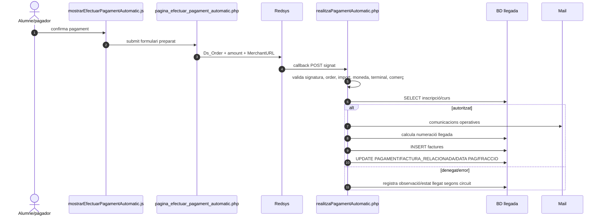
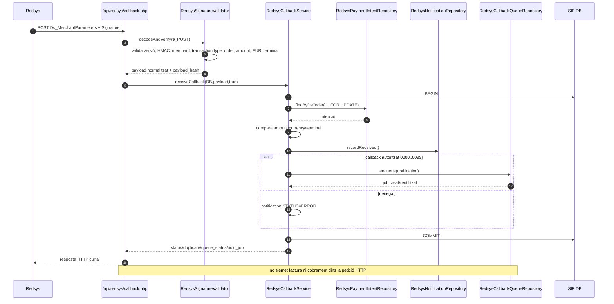
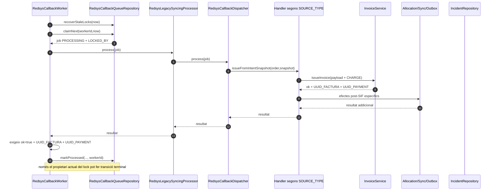
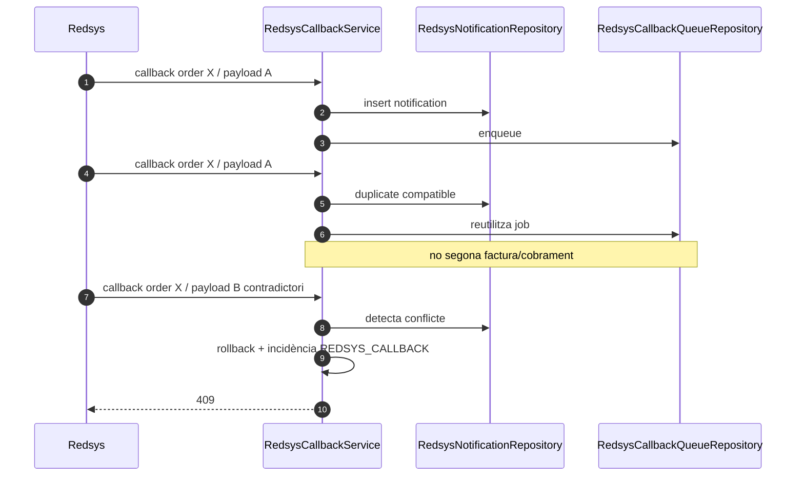
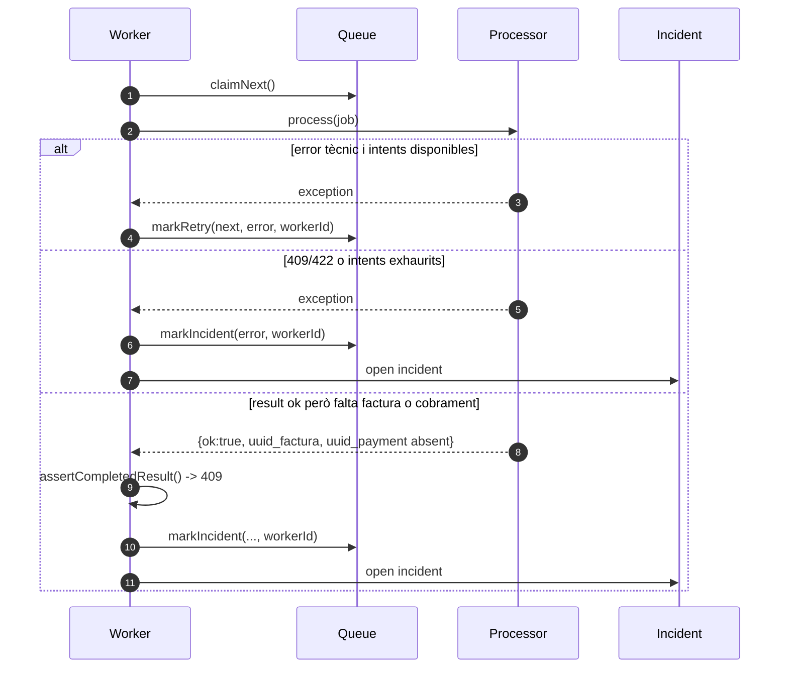
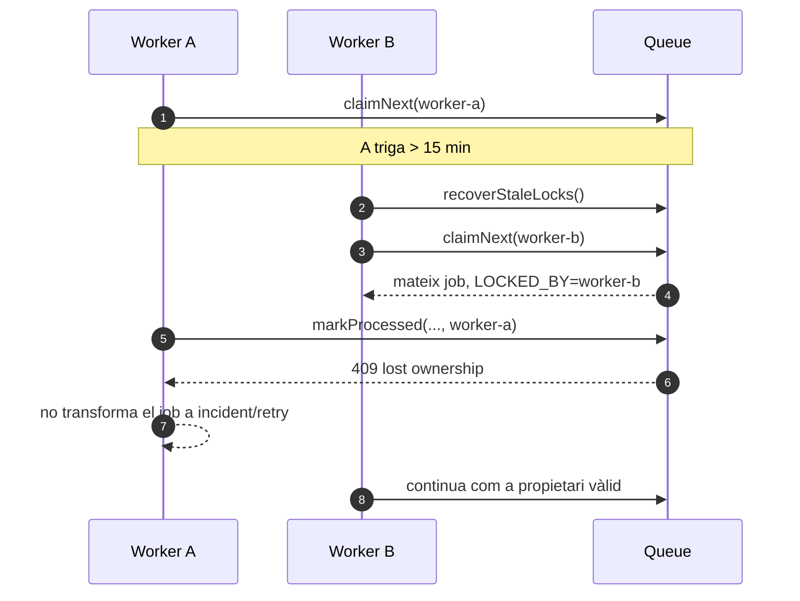
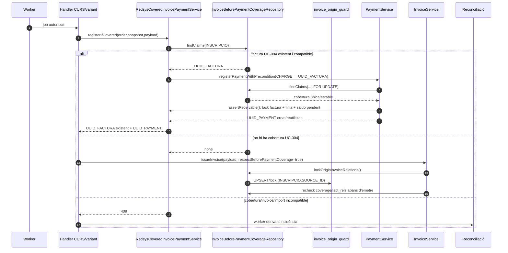

# UC-003 — Diagrames de seqüència ACTUAL i FINAL

**Data d'auditoria:** 03/10/2026  
**Objectiu:** separar el callback llegat síncron del circuit SIF asíncron i deixar explícits duplicats, retries, incidències i ownership del worker.

## 1. ACTUAL — web/callback llegat



**Risc estructural ACTUAL:** la recepció HTTP, la facturació, el cobrament, la projecció acadèmica i les notificacions conviuen al mateix script. Encara que el fallback s'ha endurit criptogràficament en auditories anteriors, no és el patró FINAL.

## 2. CANDIDAT — intenció SIF amb fallback de callback

```mermaid
sequenceDiagram
autonumber
actor U as Alumne/pagador
participant P as pay pagina_efectuar_pagament_automatic.php
participant IC as SifRedsysCourseIntentClient
participant SI as API intenció SIF
participant R as Redsys
participant L as doit.php
participant S as callback SIF

U->>P: prepara pagament
P->>IC: create(IDPAG, import, terminal)
IC->>SI: POST HMAC
SI-->>IC: DS_ORDER + import autoritatiu
IC-->>P: intenció creada/reutilitzada
alt cutover=0
  P->>R: MerchantURL = doit.php
  R->>L: callback llegat
else cutover=1 i drain=1
  P->>R: MerchantURL = SIF_REDSYS_CALLBACK_URL
  R->>S: callback SIF
else cutover=1 i drain=0
  P-->>U: fail-closed; no nova sessió
end
```

## 3. FINAL — recepció HTTP i encuat



## 4. FINAL — worker, factura i cobrament



## 5. FINAL — duplicat i contradicció



## 6. FINAL — error tècnic, error funcional i resultat incomplet



## 7. FINAL — fencing de worker caducat



## 8. FINAL implementat a la branca — factura UC-004 ja emesa abans del TPV



**Estat de branca:** implementat per **CURS + cobertura UC-004**. La ruta valida una factura única, total contractual, línia d'inscripció i saldo pendent; admet parcials sense nova factura. `InvoiceService` rep el guard com a paràmetre fora del payload idempotent. Les **rutes competidores d'emissió** UC-004 i Redsys bloquegen el mateix mutex persistent `invoice_origin_guard` abans de seqüència/cadena fiscal; els IDs es deduplicen i s'ordenen numèricament per reduir deadlocks. Quan la cobertura UC-004 ja existeix, el cobrament no necessita tornar a adquirir el mutex d'emissió: bloqueja la fila UNIQUE d'`invoice_before_payment_coverage` amb `FOR UPDATE` i després factura/línia abans de calcular el saldo. La prova de contenció usa dues connexions MySQL amb `READ COMMITTED`, de manera que la garantia d'emissió no depèn d'un gap lock implícit.

## 9. Estat

**DOCUMENTAT:** recorregut ACTUAL, candidat, recepció FINAL, worker, duplicat, errors, fencing i cas de factura prèvia.  
**IMPLEMENTAT:** seqüències 3–8 al codi SIF per CURS/UC-004, inclosos hardening del worker, cobrament sobre factura prèvia, parcials, binding estricte d'identitat Redsys i mutex durable d'origen.  
**VERIFICAT:** el hardening inicial passa SIF #1204; en la branca rebased, els heads `39799a1`, `8dc12f2`, `144aff7` i `23f8e07` han aportat runs verds de SIF/UC-004/UC-111, inclosa la prova MySQL de dues connexions a `READ COMMITTED`. El head actual encara espera cua d'Actions.  
**PENDENT:** verificar la seqüència 8 al CI i a preproducció; generalitzar només si el contracte de PACK/GRUP/REGAL/USOC ho requereix; cutover, cron/monitoratge i evidència operativa.
