# UC-004 · Diagrames d'activitat ACTUAL / FINAL per pàgina i apartat

**Cas d'ús:** UC-004 — Emetre factura abans de cobrar  
**Pantalla actual:** `/alumnes/genera-factura-abans-pagar/`  
**Data d'auditoria estàtica:** 2026-09-29  
**Cobertura RM-037:** pàgina completa + sis apartats funcionals; cada apartat té ACTUAL i FINAL.

## 1. Matriu de pàgina i apartats

| ID | Apartat / acció | Fonts principals | ACTUAL / FINAL |
| --- | --- | --- | --- |
| A004-P00 | Pàgina completa UC-004 | pàgina PHP, `mostrarMain.php`, JS UC-004, `Intranet.php` | 2 diagrames |
| A004-P01 | Accés, càrrega i permisos | `mostrarMain.php`, `general.js`, `Intranet::mostrarPage` | 2 diagrames |
| A004-P02 | Cerca, afegir i treure inscripcions | `mostrarInformacioInscripcio_generaFactura.php`, JS, `Intranet` | 2 diagrames |
| A004-P03 | Validar selecció i preparar imports/conceptes | JS UC-004, `calcularTextData.php` | 2 diagrames |
| A004-P04 | Receptor/entitat i dades de factura | vista `__mostrarPage_Alumnes_GeneraFacturaAbansPagar`, JS, BD intranet | 2 diagrames |
| A004-P05 | Emetre factura abans de cobrar | endpoint llegat + `Intranet::generarFacturaElectronica_Alumnes`; FINAL SIF | 2 diagrames |
| A004-P06 | Resultat, previsualització i document | endpoints de dades/preview/download/delete, `generaFactura` | 2 diagrames |

Total: **14 diagrames d'activitat**.

---

## 2. A004-P00 · PÀGINA COMPLETA

### A004-P00 — ACTUAL

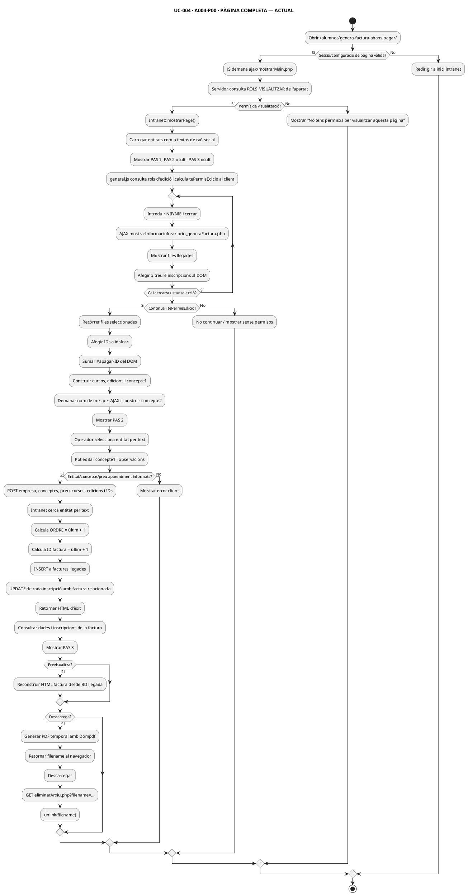

### A004-P00 — FINAL

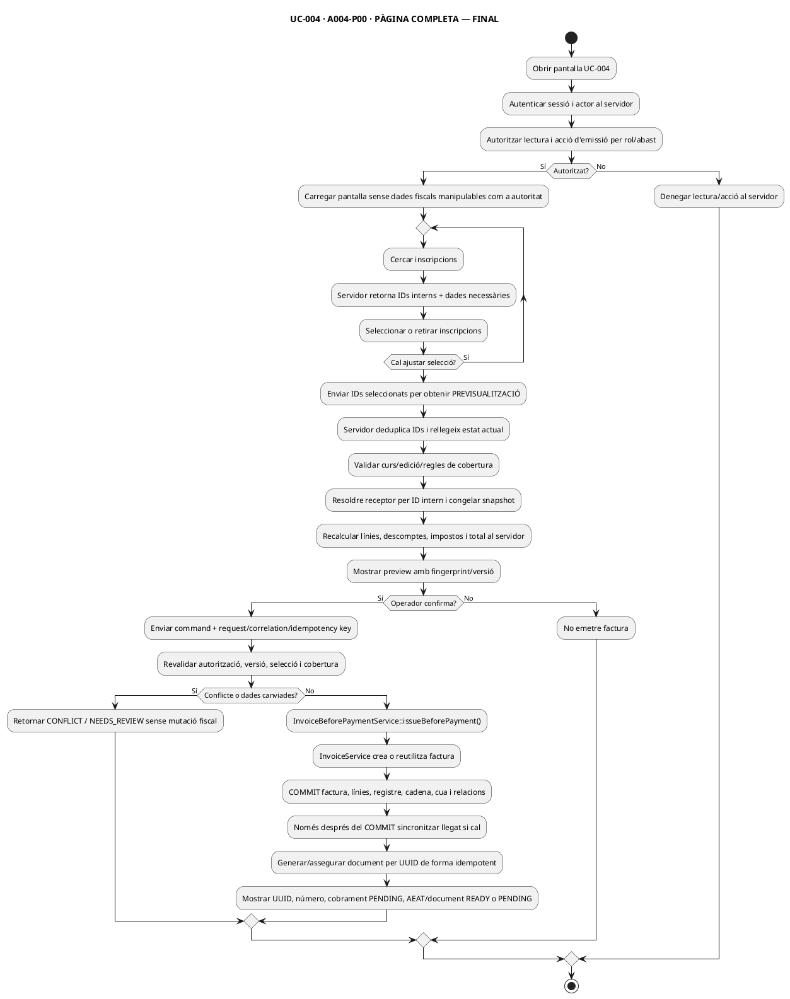

---

## 3. A004-P01 · ACCÉS, CÀRREGA I PERMISOS

### A004-P01 — ACTUAL

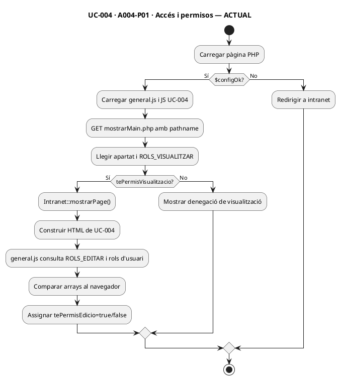

### A004-P01 — FINAL

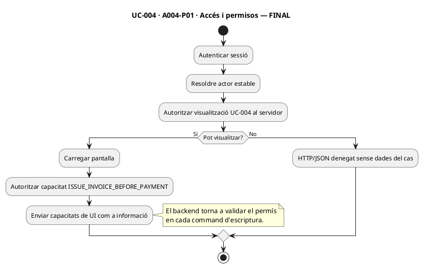

---

## 4. A004-P02 · CERCA I SELECCIÓ D'INSCRIPCIONS

### A004-P02 — ACTUAL

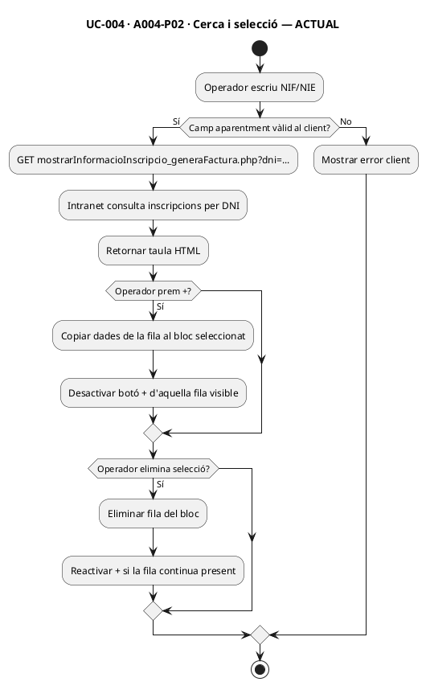

### A004-P02 — FINAL

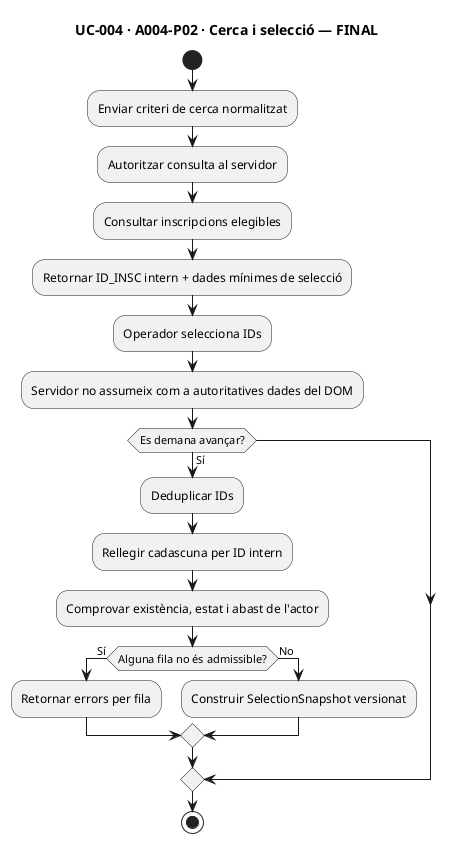

---

## 5. A004-P03 · VALIDAR SELECCIÓ, IMPORTS I CONCEPTES

### A004-P03 — ACTUAL

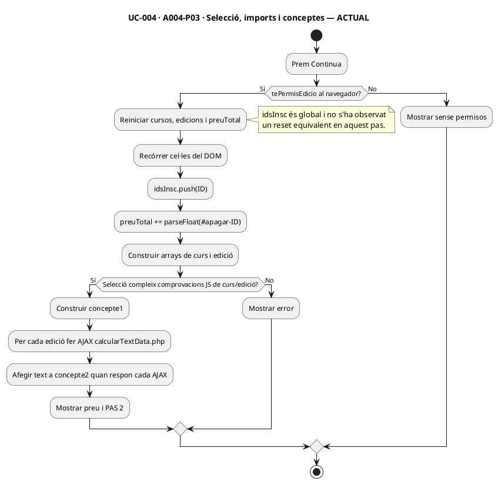

### A004-P03 — FINAL

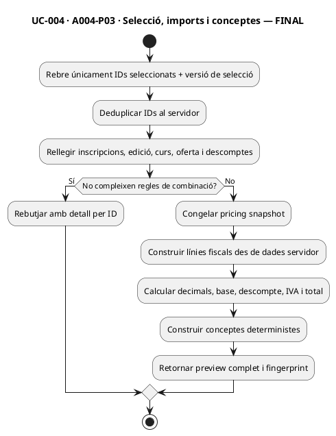

---

## 6. A004-P04 · RECEPTOR I DADES DE FACTURA

### A004-P04 — ACTUAL

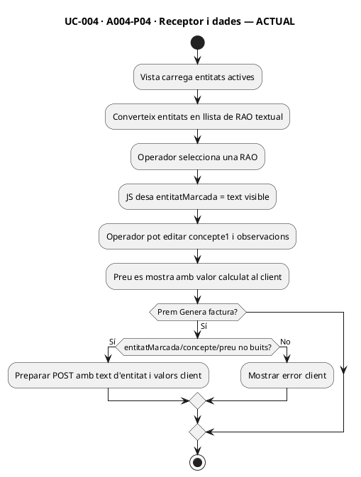

### A004-P04 — FINAL

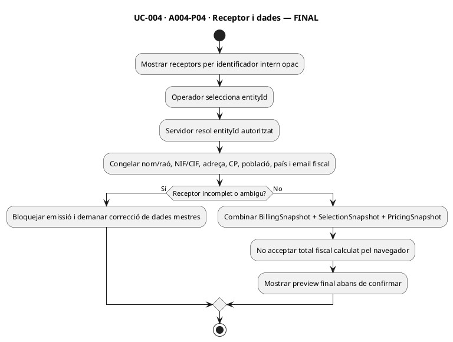

---

## 7. A004-P05 · EMISSIÓ DE FACTURA ABANS DE COBRAR

### A004-P05 — ACTUAL

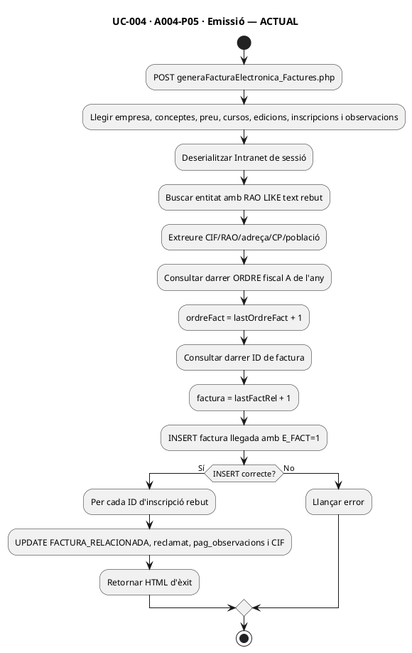

### A004-P05 — FINAL

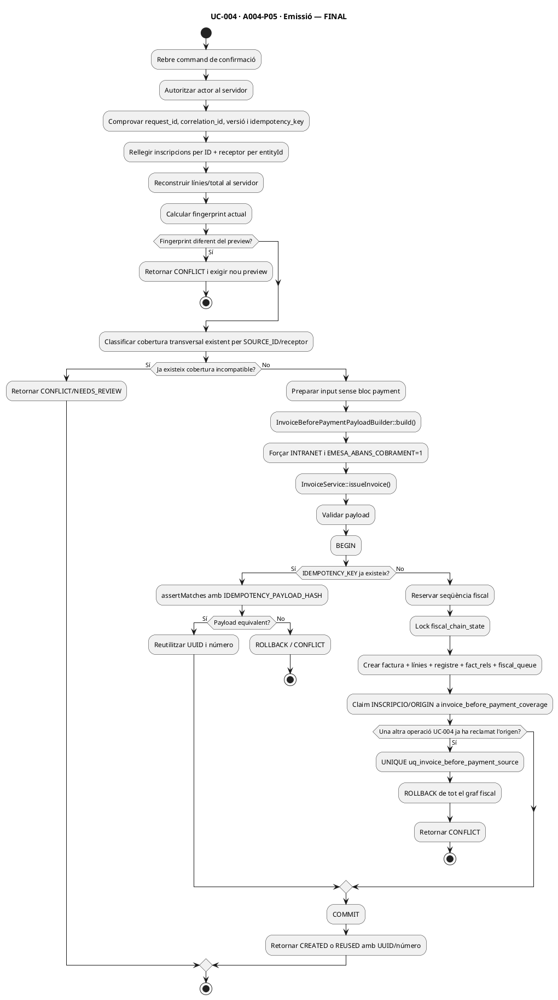

---

## 8. A004-P06 · RESULTAT, PREVISUALITZACIÓ I DOCUMENT

### A004-P06 — ACTUAL

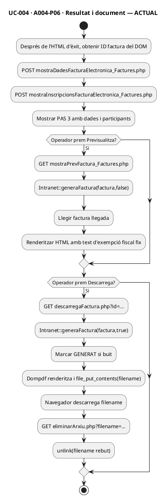

### A004-P06 — FINAL

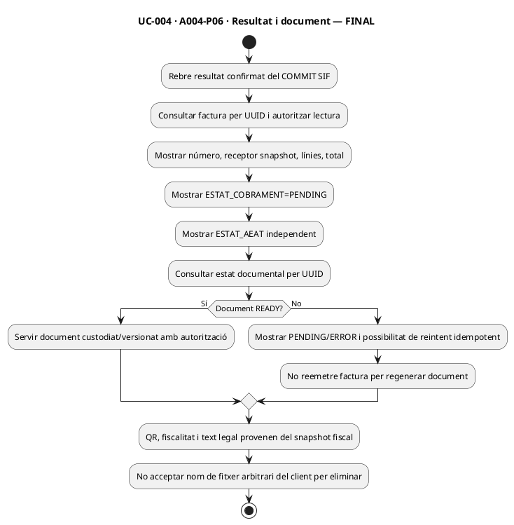

## 9. Criteris transversals derivats dels 14 diagrames

1. **Autoritat servidor:** IDs, receptor, preus, descomptes, impostos i cobertura es rellegeixen abans del commit.
2. **Idempotència i cobertura:** mateixa clau + mateix payload = reús; dues claus UC-004 sobre el mateix origen = conflicte transaccional. La cobertura entre canals/pagadors diferents es classifica separadament i no es resol amb una UNIQUE global.
3. **Atomicitat fiscal:** número, factura, línies, registre, hash, cadena, cua i relacions dins del domini transaccional SIF.
4. **Llegat posterior:** qualsevol sincronització amb `factures`/inscripcions antigues és posterior al COMMIT SIF i recuperable.
5. **Cobrament separat:** UC-004 deixa `ESTAT_COBRAMENT=PENDING`; el moviment econòmic posterior no reemet la factura.
6. **Document separat de la factura:** error de PDF/QR no anul·la ni torna a numerar una factura ja confirmada.
7. **Proves de pantalla obligatòries:** tornar enrere, doble clic, duplicats d'ID, canvis concurrents, canvi de receptor/import, selecció ja coberta i error després del commit.

## 10. Estat

- **ACTUAL:** reconstruït estàticament des del codi versionat.
- **FINAL:** selecció per IDs, receptor per entityId, línies/total des de servidor, fingerprint preview→confirm i claim concurrent UC-004 ja estan implementats a la branca en serveis/CLI. Continuen pendents el classificador transversal, autorització/CSRF i l'adaptador HTTP de la pantalla.
- **Execució de proves:** no feta en aquesta auditoria documental.
- **Integració pantalla UC-004 → SIF:** pendent; **integració CLI no productiva BDs llegades → preparació → SIF:** implementada a la branca, no executada aquí.
