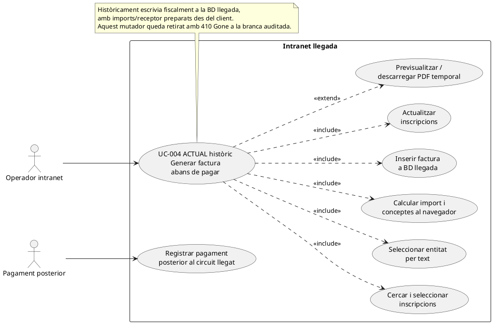
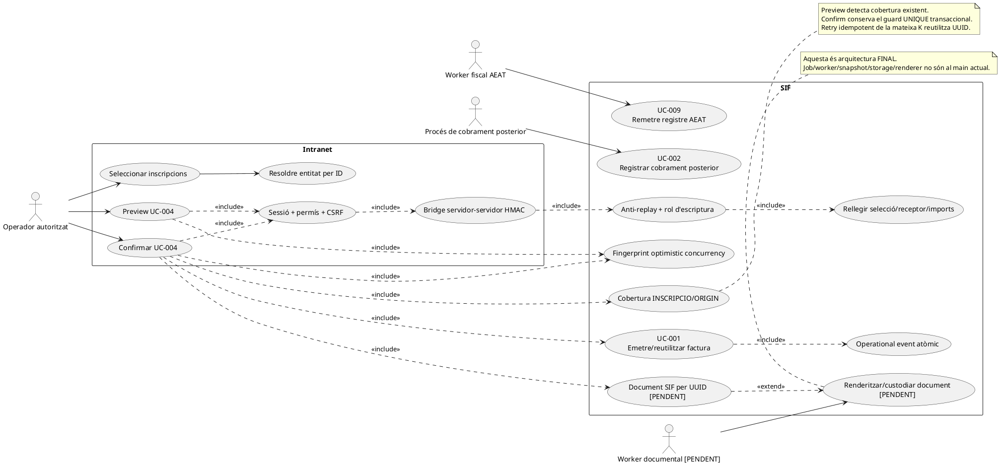
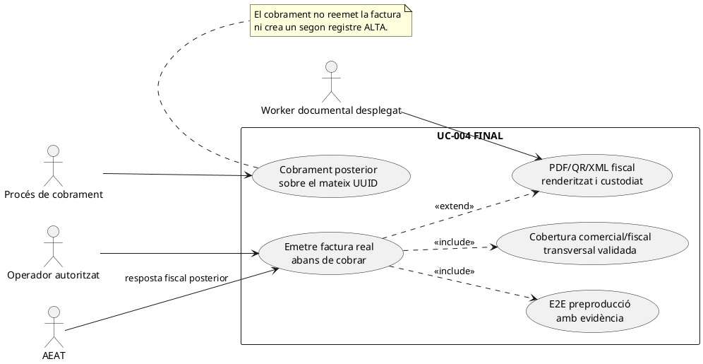

# UC-004 · Diagrama de cas d'ús ACTUAL / FINAL

**Cas d'ús:** UC-004 — Emetre factura abans de cobrar  
**Data de revisió:** 2026-10-04  
**Base auditada:** `main@6c8137ff1652ac89a1a81ad18cf79fc4689b1757`  
**Criteri:** es diferencia l'ACTUAL històric/llegat, l'ACTUAL versionat segur i el FINAL operatiu. L'ACTUAL versionat no inclou encara document SIF per UUID ni `aeat_fields` oficials per entorns qualificats.

## 1. ACTUAL històric — circuit llegat observat

## 2. ACTUAL versionat 04/10/2026 — pantalla + bridge segur + SIF

## 3. FINAL operatiu — condicions encara pendents

El FINAL funcional no requereix reescriure l'emissió: requereix completar i acreditar l'última milla operativa sobre el mateix contracte versionat.

## 4. Estat de responsabilitats

| Responsabilitat | ACTUAL històric | ACTUAL versionat 04/10 | FINAL / pendent |
| --- | --- | --- | --- |
| Cerca/selecció | HTML + DOM | UI existent; IDs enviats al bridge | E2E real |
| Permís d'emissió | control client parcial | **sessió + rol + CSRF + rol SIF** | evidència preproducció |
| Receptor | text visible | **`entity_id` + snapshot servidor** | validar casuística transversal |
| Imports | DOM/client | **rellegits/recalculats al servidor** | classificador fiscal/comercial transversal |
| Preview | llegat | **server-authoritative + fingerprint** | E2E manipulació DOM |
| Emissió | BD llegada | **`InvoiceBeforePaymentService` + `InvoiceService`** | desplegament |
| Idempotència | no | **key + payload hash** | prova concurrent d'entorn |
| Cobertura UC-004 | no | **preview + UNIQUE transaccional** | cobertura entre altres canals |
| Numeració/cadena/cua | llegat | **SIF amb lock/hash/fiscal_queue** | operació real |
| Auditoria | insuficient | **`ISSUE_INVOICE` + `sif_audit_event` atòmics** | inspecció d'evidència |
| Mutador llegat | executable | **410 Gone** | retirar dependències mortes quan sigui segur |
| Document | temporal/regenerat | **encara pendent al SIF UC-004** | job/worker/snapshot/storage + renderer fiscal + validació |
| Cobrament posterior | circuit separat | serveis SIF existents | E2E sobre mateix UUID |
| AEAT | no SIF | registre/cua SIF | preproducció/acceptació real |

## 5. Relació amb els artefactes detallats

- Fitxa funcional: [uc-004.md](../06-fitxes-funcionals/uc-004.md)
- Síntesi integrada: [uc-004-emetre-factura-abans-cobrar.md](uc-004-emetre-factura-abans-cobrar.md)
- Classes: [uc-004-classes-actual-final.md](uc-004-classes-actual-final.md)
- Seqüències: [uc-004-sequencies-actual-final.md](uc-004-sequencies-actual-final.md)
- Activitats per pàgina/apartat: [uc-004-activitats-actual-final.md](uc-004-activitats-actual-final.md)
- Auditoria/traçabilitat: [uc-004-auditoria-tracabilitat-mancances.md](uc-004-auditoria-tracabilitat-mancances.md)
- Inventari: [uc-004-inventari-artefactes.md](uc-004-inventari-artefactes.md)

**Conclusió del diagrama:** el circuit segur de pantalla → SIF és codi versionat. El document per UUID, l'assembler `aeat_fields` per PREPROD/PROD, el classificador transversal i l'E2E/preproducció continuen pendents.
