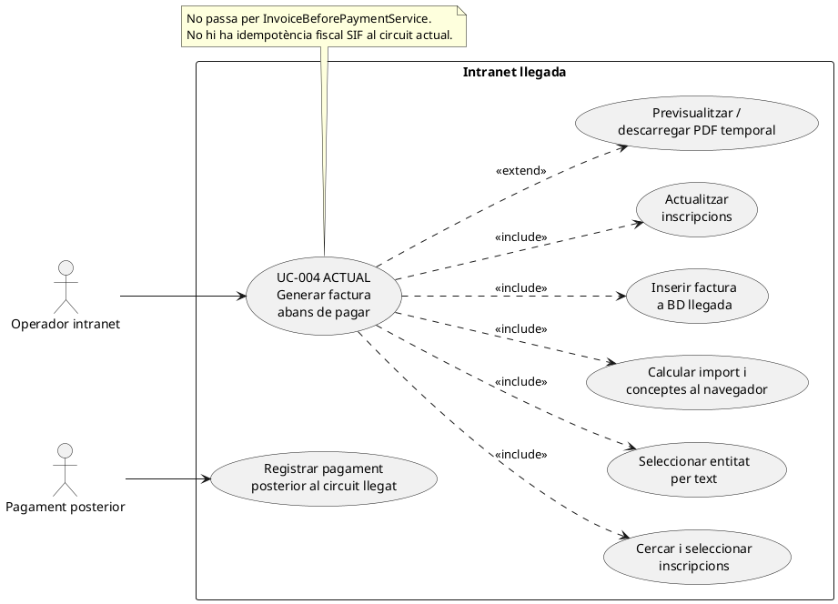
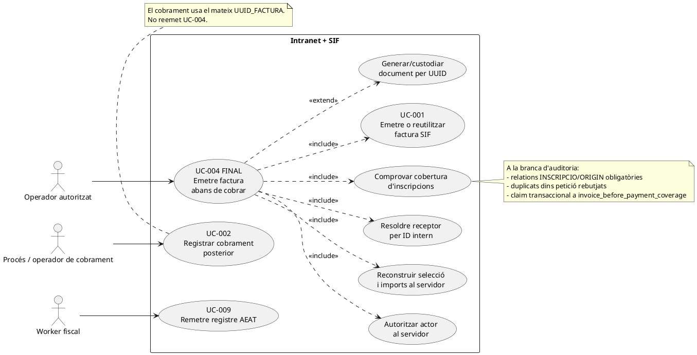

# UC-004 · Diagrama de cas d'ús ACTUAL / FINAL

**Cas d'ús:** UC-004 — Emetre factura abans de cobrar  
**Data de revisió:** 2026-09-29  
**Objectiu:** separar explícitament el comportament de la pantalla llegada del contracte FINAL SIF.

## 1. ACTUAL — pantalla llegada

## 2. FINAL — contracte UC-004 sobre SIF

## 3. Estat de cada responsabilitat

| Responsabilitat | ACTUAL | FINAL a la branca |
| --- | --- | --- |
| Cerca/selecció | implementada al llegat | **reconstrucció per IDs implementada a la branca; pendent UI** |
| Permís visualització | servidor | existent |
| Permís d'emissió | UI/client parcial | backend específic pendent |
| Receptor | text de RAO | **entityId + snapshot implementats a la branca; pendent UI** |
| Imports | DOM/client | **total/línies servidor implementats amb `A_PAGAR`; pendent classificador transversal i UI** |
| Cobertura entre operacions UC-004 | sense guard SIF | **builder + claim transaccional específic implementats** |
| Emissió | BD llegada | `InvoiceBeforePaymentService` + SIF implementats |
| Idempotència | no | implementada per key + payload hash |
| Numeració | últim + 1 | `FiscalSequenceRepository` amb lock |
| Registre/hash/cua | no SIF | implementats |
| Document | PDF temporal llegat | integració UUID/snapshot pendent |
| Cobrament posterior | circuit separat llegat | servei SIF existent; integració pantalla/canal pendent |

## 4. Relació amb la resta d'artefactes

- Fitxa funcional: [uc-004.md](../06-fitxes-funcionals/uc-004.md)
- Síntesi integrada: [uc-004-emetre-factura-abans-cobrar.md](uc-004-emetre-factura-abans-cobrar.md)
- Classes: [uc-004-classes-actual-final.md](uc-004-classes-actual-final.md)
- Seqüències: [uc-004-sequencies-actual-final.md](uc-004-sequencies-actual-final.md)
- Activitats: [uc-004-activitats-actual-final.md](uc-004-activitats-actual-final.md)
- Auditoria/traçabilitat: [uc-004-auditoria-tracabilitat-mancances.md](uc-004-auditoria-tracabilitat-mancances.md)
- Inventari: [uc-004-inventari-artefactes.md](uc-004-inventari-artefactes.md)
