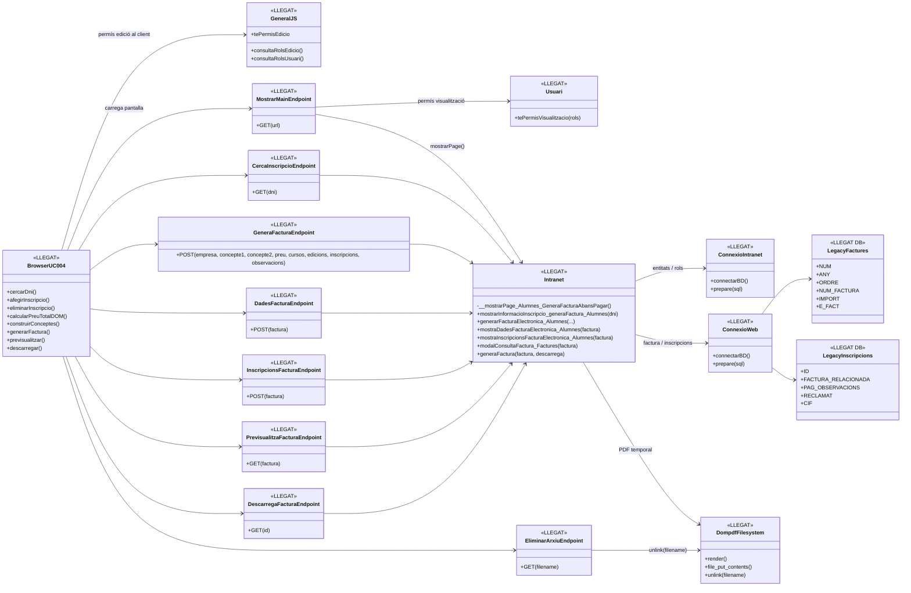
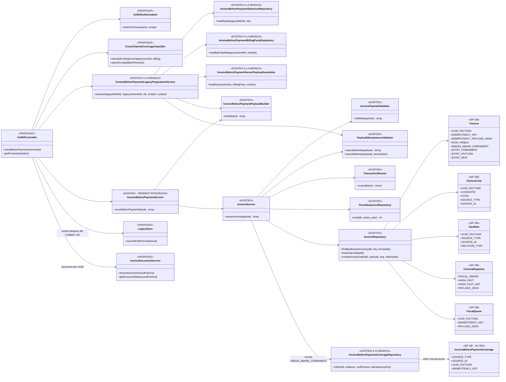

# UC-004 · Diagrames de classes ACTUAL / FINAL

**Cas d'ús:** UC-004 — Emetre factura abans de cobrar  
**Data d'auditoria estàtica:** 2026-09-29  
**Estat:** documentació d'auditoria. ACTUAL = codi llegat observat. FINAL = arquitectura objectiu, distingint classes ja implementades de components encara pendents.

## 1. Fonts directes contrastades

- `codi-drive/intranet-actual/alumnes-genera-factura-abans-pagar.php`
- `codi-drive/intranet-actual/js/alumnes-genera-factura-abans-pagar.js`
- `codi-drive/intranet-actual/js/general.js`
- `codi-drive/intranet-actual/ajax/mostrarMain.php`
- `codi-drive/intranet-actual/ajax/alumnes/mostrarInformacioInscripcio_generaFactura.php`
- `codi-drive/intranet-actual/ajax/alumnes/generaFacturaElectronica_Factures.php`
- `codi-drive/intranet-actual/ajax/alumnes/mostraDadesFacturaElectronica_Factures.php`
- `codi-drive/intranet-actual/ajax/alumnes/mostraInscripcionsFacturaElectronica_Factures.php`
- `codi-drive/intranet-actual/ajax/alumnes/mostraPrevFactura_Factures.php`
- `codi-drive/intranet-actual/ajax/alumnes/descarregaFactura.php`
- `codi-drive/intranet-actual/ajax/alumnes/eliminarArxiu.php`
- `codi-drive/intranet-actual/Intranet.php`
- `sif/src/Service/InvoiceBeforePaymentService.php`
- `sif/src/Service/InvoiceBeforePaymentPayloadBuilder.php`
- `sif/src/Service/InvoiceService.php`
- `sif/src/Service/InvoicePayloadValidator.php`
- `sif/src/Service/PayloadIdempotencyValidator.php`
- `sif/src/Repository/InvoiceRepository.php`
- `sif/src/Repository/FiscalSequenceRepository.php`
- `sif/public/api/factures/issue.php`
- `sif/tests/Integration/InvoiceBeforePaymentServiceTest.php`

## 2. Llegenda d'estat

- **[EXISTEIX]** classe o component localitzat al repositori.
- **[LLEGAT]** component existent del circuit actual de la intranet.
- **[PROPOSAT]** responsabilitat necessària per al FINAL però no acreditada com a classe executable actual.
- **[PENDENT INTEGRACIÓ]** codi existent que encara no està connectat al circuit real UC-004.

## 3. Classes ACTUAL — circuit llegat

El circuit real continua sent navegador → AJAX llegat → `Intranet` → BD web/intranet. La pantalla no invoca `InvoiceBeforePaymentService`.

### 3.1 Observacions del model ACTUAL

1. `mostrarMain.php` sí que comprova el rol de **visualització** de la pàgina.
2. `general.js` calcula `tePermisEdicio` al navegador consultant rols; aquest valor protegeix la interacció de la UI, no acredita una autorització de l'acció fiscal dins `generaFacturaElectronica_Factures.php`.
3. L'endpoint de generació rep del navegador el receptor com a text visible (`empresa`), conceptes, preu, cursos, edicions i IDs d'inscripció.
4. `Intranet::generarFacturaElectronica_Alumnes()` busca l'entitat per text, calcula número amb patró “últim + 1”, insereix a la taula llegada `factures` i després actualitza una a una les inscripcions.
5. No s'ha observat una transacció que englobi l'alta de factura i totes les actualitzacions d'inscripcions.
6. La previsualització i la descàrrega tornen a construir el document a partir de dades llegades; la descàrrega crea un fitxer temporal.
7. `eliminarArxiu.php` executa `unlink($filename)` amb un nom de fitxer rebut per GET. Ha de desaparèixer del contracte FINAL o quedar estrictament encapsulat i validat.

## 4. Classes FINAL — arquitectura objectiu UC-004

El FINAL ha de reutilitzar el nucli SIF que ja existeix i afegir l'adaptador que falta. Les classes marcades **PROPOSAT** són responsabilitats de disseny; no es presenten com a codi existent.

## 5. Responsabilitats que NO s'han de confondre

- `InvoiceBeforePaymentService` **existeix**, però la pantalla llegada UC-004 no l'invoca.
- `sif/public/api/factures/issue.php` **existeix**, però instancia `InvoiceService` directament; per tant no acredita per si sol el contracte “abans de cobrar” ni l'ús de `InvoiceBeforePaymentPayloadBuilder`.
- `InvoiceBeforePaymentSelectionRepository`, `InvoiceBeforePaymentBillingPartyRepository`, `InvoiceBeforePaymentServerPayloadAssembler` i `InvoiceBeforePaymentLegacyPreparationService` **ja existeixen a la branca** i eliminen del payload autoritatiu el total/receptor/conceptes construïts al navegador. Encara no estan connectats a la pantalla web.
- `InvoicePayloadValidator` valida camps estructurals bàsics; no acredita tota la validació fiscal, comercial, de cobertura ni d'autorització necessària per UC-004.
- `PayloadIdempotencyValidator` protegeix la repetició de **la mateixa clau** comparant el hash complet. `InvoiceBeforePaymentCoverageRepository` impedeix que dues operacions UC-004 amb claus diferents reclamin el mateix origen. Encara falta el classificador de cobertura **transversal** entre altres canals/pagadors, perquè no tota doble relació d'una inscripció és necessàriament il·legítima.
- `PaymentService` no forma part de l'emissió inicial UC-004. El cobrament posterior és UC-002/UC-022 segons canal.

## 6. Criteri de tancament del diagrama FINAL

Aquest diagrama passarà de **FINAL proposat** a **FINAL implementat/verificat** quan existeixi i s'hagi provat el camí:

`pantalla intranet → autorització servidor → InvoiceBeforePaymentLegacyPreparationService → fingerprint preview/confirm → classificador de cobertura transversal → InvoiceBeforePaymentService → InvoiceService → claim UC-004 + COMMIT SIF → sincronització llegada/document → resposta tipificada`.

Fins llavors, el nucli SIF és implementat però la integració completa UC-004 continua **PARCIAL**.
