# UC-04 · Emetre una factura abans de cobrar — fitxa i UML integrats

**Estat documental:** primera fitxa revisada per cas concret; no certifica el desplegament.
**Estat tècnic:** nucli de servei al repositori `main`; integració final de pantalla, autorització servidor i preproducció pendents segons la documentació existent.
**Relacions:** UC-01 (emissió comuna), UC-02 (cobrament posterior), UC-21 (empresa/responsable com a receptor/pagador), UC-22 (transferència, quan correspongui).
**Abast d'aquesta fitxa:** crear una factura fiscal sense registrar simultàniament un cobrament. El pagament posterior és un *altre* cas d'ús; es mostra únicament com a seqüència vinculada.

## 1. Fitxa de cas d'ús

| Camp | Especificació |
| --- | --- |
| Identificador | UC-04 |
| Nom | Emetre factura abans de cobrar |
| Actor principal | Operador autoritzat |
| Disparador | Cal emetre una factura real abans que arribi el cobrament |
| Canal objectiu | Intranet principal amb delegació al SIF; **no acreditat com a pantalla final operativa** |
| Precondicions | Operació i receptor identificats; dades necessàries per a la factura disponibles; autorització del canal pendent de verificació; petició amb clau idempotent o referència |
| Èxit | Factura emesa i persistida amb identificador/número fiscal, estat de cobrament pendent, registre fiscal encadenat i entrada a la cua fiscal; sense moviment de pagament inicial |
| Frontera funcional | Emissió de factura ≠ registre de cobrament; no es crea una segona factura quan el cobrament arriba després |

### 1.1. Entrades i validacions concretes del nucli executable

1. `InvoiceBeforePaymentPayloadBuilder::build(input)` rebutja un bloc `payment` que existeixi i no sigui `null`.
2. Si la petició no porta `idempotency_key` no buida, el constructor requereix una referència i genera una clau `INTRANET|FACTURA_ABANS_COBRAR|REF:<referència_normalitzada>`. Els noms acceptats per al camp de referència inclouen `reference`, `referencia`, `invoice_ref`, `external_ref` i `factura_relacionada`.
3. El constructor força `source_channel = INTRANET` i `emesa_abans_cobrament = 1`; conserva `created_by` quan consta i, si no, posa el valor per defecte `intranet-factura-abans-cobrar`.
4. El validador comú d'emissió requereix `idempotency_key`, `series`, `type`, `source_channel`, `billing`, `totals` i `lines`. Requereix `billing.name`, `billing.nif`, els imports `totals.import_base`, `totals.taxable_base`, `totals.total` i almenys una línia amb `concept`, `quantity`, `unit_price`, `base`, `total`. Aquestes són validacions **observades al codi**, no una afirmació que ja cobreixin tots els requisits fiscals finals.
5. Els criteris per determinar el receptor fiscal, la composició de línies, els permisos concrets de cada pantalla i totes les dades fiscals addicionals són objecte del disseny funcional i encara necessiten contrast específic per a aquest cas.

### 1.2. Flux principal: UC-04

| Pas | Actor / component | Acció i resultat |
| ---: | --- | --- |
| 1 | Operador / pantalla objectiu | Selecciona l'operació i el receptor fiscal, completa les dades i demana emetre la factura abans del cobrament. |
| 2 | Adaptador intranet **pendent d'acreditar** | Ha de validar la identitat i l'autorització i traslladar les dades al SIF. **La ruta final intranet → servei no es dona per implementada.** |
| 3 | `InvoiceBeforePaymentService` | Crida el constructor de payload per obtenir una petició d'emissió sense bloc de pagament. |
| 4 | `InvoiceBeforePaymentPayloadBuilder` | Verifica l'absència de pagament inicial, obté/genera la clau idempotent i fixa el canal i l'indicador d'emissió abans de cobrar. |
| 5 | `InvoiceService` | Valida el payload i inicia el procediment transaccional d'emissió o reutilització. |
| 6 | Repositoris del SIF | Cerquen la factura per clau idempotent; si no existeix, reserven número fiscal, bloquegen l'estat de la cadena i creen factura, línies, registre fiscal, cadena, entrada de cua i relacions d'origen. |
| 7 | SIF | Confirma la transacció i retorna `ok`, `uuid_factura`, `num_visible` i `idempotency_reused`. No es crea un moviment de pagament inicial en aquest cas. |

### 1.3. Fluxos alternatius i errors

| Escenari | Comportament verificat / estat |
| --- | --- |
| A1. Reintent amb la mateixa clau idempotent | **PHP main:** compara tota la petició contra IDEMPOTENCY_PAYLOAD_HASH original; només el payload equivalent recupera UUID/número sense nova seqüència. Un canvi o hash històric absent dóna conflicte. |
| A2. Clau duplicada per concurrència | `InvoiceService` captura la col·lisió de clau, obre una nova transacció i rellegeix la factura existent. |
| E1. El payload inclou un `payment` no nul | El constructor rebutja la petició abans de cridar el servei d'emissió. |
| E2. No hi ha clau idempotent ni referència utilitzable | El constructor rebutja la petició. |
| E3. Falta un camp requerit pel validador comú | L'emissió es rebutja; no es pot atribuir al validador actual una verificació fiscal exhaustiva. |
| E4. Error de persistència | La transacció de creació no s'ha de confirmar parcialment; cal contrastar els errors concrets del canal i les evidències operatives. |
| A3. Arriba el cobrament més tard | S'inicia **UC-02** (o la seva variant per transferència, etc.) sobre el mateix `uuid_factura`; no es torna a emetre UC-04. |

### 1.4. Dades persistides i resultat

La implementació d'emissió crea registres a `factura`, `factura_linia`, `factura_registres`, `fiscal_chain_state`, `fiscal_queue` i, quan s'han proporcionat les relacions, `fact_rels`. La factura es crea amb `EMESA_ABANS_COBRAMENT = 1`, `ESTAT_COBRAMENT = PENDING` i `ESTAT_FACTURA = ISSUED`. L'emissió no crea `payment_transaction` ni `payment_allocation` inicials. La cua fiscal **no** és prova d'acceptació per l'AEAT: la remissió i el seu resultat són processos separats.

### 1.5. Accions posteriors relacionades, però independents

- **UC-02 / UC-22:** després de validar un cobrament, registrar-lo amb una clau idempotent pròpia i assignar-lo a la factura preexistent; la factura pot quedar parcialment cobrada o cobrada. No repetir l'emissió.
- **UC-21:** quan qui paga o rep la factura és una empresa o responsable, concretar la identitat de l'emissor/receptor i la vinculació amb les inscripcions dins d'aquest cas específic. UC-04 no resol automàticament tota la casuística empresarial.
- **UC-09 / UC-54 / UC-77:** tractar la remissió i resposta fiscal independentment de l'estat econòmic.

### 1.6. Proves i punts pendents

**Proves localitzades al repositori (no executades en aquesta revisió):** `InvoiceBeforePaymentServiceTest::testIssuesInvoiceBeforePaymentWithoutCreatingPayment`, `testBuilderDerivesIdempotencyAndForcesInvoiceBeforePaymentFlags` i `testRejectsPaymentBlockBeforeIssuingInvoice`. També hi ha proves de flux i de scripts en `sif/tests/Integration/`.

**Pendent de demostrar per tancar funcionalment UC-04:** pantalla i accés real de l'operador; autorització al servidor; origen i fotografia de dades del receptor i de les línies; previsualització/confirmació i avís a l'operador; registre transversal d'auditoria quan correspongui; tractament d'errors en el canal; prova d'integració intranet → SIF → cobrament posterior; validació de les dades fiscals definitives.

### 1.7. Revisió: factura pendent ≠ diners atribuïts — PENDENT

En emetre UC-04, **no** es crea cap entrada de fons per inscripció: la factura és real, però el cobrament encara no existeix. Quan l'empresa, responsable o alumne paga, UC-02 ha de registrar el moviment confirmat i atribuir-lo explícitament a les inscripcions cobertes, conservant la mateixa factura original i la procedència del pagament. Un canvi de curs produït **entre** emissió i cobrament exigeix revisar la factura/concepte i l'assignació abans d'atribuir els diners; no s'ha d'assignar automàticament a dades vives diferents de les emeses.

[Registre proposat de fons per inscripció](00-revisio-moviments-inscripcions.md).

### 1.8. Pantalla real de selecció múltiple i riscos de recalcular al navegador

**Circuit antic concret.** `/alumnes/genera-factura-abans-pagar/` cerca per NIF/NIE mitjançant `mostrarInformacioInscripcio_generaFactura.php`, afegeix files d'inscripció amb `.add-inscripcio` i permet avançar només si el JS considera que les files seleccionades són del **mateix curs i edició**. Calcula `idsInsc`, `preuTotal` a partir de `#apagar-{id}` de l'HTML, `concepte1` i `concepte2`, aquest últim amb la crida asíncrona `calcularTextData.php`. El tercer pas envia `entitatMarcada`, concepte i preu a `generaFacturaElectronica_Factures.php` i després mostra dades/participants i previsualització. El mètode històric `generarFacturaElectronica_Alumnes` **emet una factura abans de pagar**, encara que el seu nom suggereixi `E_FACT`.

**Validacions d'integració pendents.** El JS pot acumular identificadors a `idsInsc` si es torna enrere; `entitatMarcada` és text visible i no una clau d'entitat amb dades fiscals congelades; el total procedeix del DOM; la unicitat de curs/edició i `tePermisEdicio` es comproven al navegador. El nou adaptador ha de reconstruir **al servidor** els ID seleccionats sense repeticions, verificar curs/edició i cobertura fiscal per cadascun, carregar per ID intern el receptor fiscal i recalcular les línies/total amb descomptes vigents de l'oferta confirmada. Ha d'esperar que `concepte2` estigui resolt abans de presentar la previsualització; no acceptar una ordre fiscal a partir d'un `preuTotal` manipulable del navegador.

**Factura prèvia i reintent no equivalent.** `InvoiceBeforePaymentPayloadBuilder` sí que rebutja `payment` inicial i força `EMESA_ABANS_COBRAMENT=1`; però una clau basada en una referència de formulari **no prova** que cap `ID_INSC` estigui ja facturat amb una altra clau. Abans d'invocar `issueInvoice()`, cercar factura real existent per inscripció i `fact_rels`, distingir la mateixa operació d'una selecció/receptor/import canviats i bloquejar/derivar un conflicte a revisió. Un reintent equivalent recupera **el mateix UUID i número**, i no reobre numeració fiscal; una petició amb la mateixa clau però contingut fiscal diferent ha de donar conflicte, no afirmar equivalència només perquè retorna `idempotency_reused`.

**URL, consulta i document.** Si s'emet a empresa/responsable, conservar relació exacta amb les inscripcions cobertes i desactivar al servidor els enllaços individuals incompatibles, sense impedir que un pagament Redsys iniciat abans sigui reconciliat (UC-33/50/51). La factura es mostra com a **emesa i pendent de cobrament**, amb `E_FACT` separat i amb PDF/QR `READY` o `PENDING`; el llegat regenera el PDF via `descarregaFactura.php` i elimina un fitxer temporal amb `eliminarArxiu.php`, que **no constitueixen custòdia immutable** (UC-36). Si cau el job documental o AEAT després de confirmar la factura, reprendre aquesta fase amb el UUID existent, no generar un document fiscal nou per error.

### 1.9. Proves de pantalla i cobertura prèvia (no executades)

| ID | Escenari | Resultat exigible |
| --- | --- | --- |
| FP-01 | Tornar enrere i tornar a afegir les mateixes files | Un `ID_INSC` una sola vegada al payload final, línies/total recalculats al servidor. |
| FP-02 | DOM presenta mateix curs/edició però una fila de BD és diferent | Servidor rebutja l'emissió malgrat el JS. |
| FP-03 | Text `entitatMarcada` diferent del receptor real | Carregar entitat per ID i snapshot fiscal complet abans d'emetre. |
| FP-04 | Un participant ja figura en factura prèvia d'empresa amb altra clau | Recuperar cobertura i impedir factura duplicada per inscripció. |
| FP-05 | Doble clic equivalent i després mateix identificador amb import/receptor nou | Retorn mateix UUID per repetició exacta; conflicte per canvi substancial. |
| FP-06 | Arriba el pagament sobre la factura ja emesa | `registerPayment()` contra UUID existent, sense nou `issueInvoice()`. |
| FP-07 | Factura confirmada però PDF encara no generat | Número real i document `PENDING`; no segona factura ni correu que prometi el PDF absent. |

### Actualització de reús d'emissió a main: la factura prèvia no admet afegir payment a la mateixa petició fiscal

InvoiceService de main desa IDEMPOTENCY_PAYLOAD_HASH de la **petició completa** d'emissió i l'exigeix en reús; mateixa clau amb dades fiscals modificades o amb bloc payment afegit després → CONFLICT per assertMatches(). Una factura històrica sense fingerprint complet original no es reutilitza a cegues. El reintent equivalent de la factura **sense payment** sí recupera el mateix UUID/NUM_VISIBLE, si hi ha hash verificable. Aquest guard per K no acredita que no existeixi **una altra** factura que cobreixi la inscripció amb una clau distinta: el control entre claus de fact_rels/ID_INSC/receptor continua pendent.

L'ingrés posterior de la factura prèvia es registra exclusivament per UC-02 amb clau de **fet bancari real** i la factura original com a destí; el hash de la petició fiscal no prova CHARGE ni assignació. [UC-01, seccions 1.6 i 4.1](uc-001-emetre-o-reutilitzar-factura.md) i [UC-02](uc-002-registrar-cobrament-factura.md). Prova definida a main: PayloadIdempotencyFlowTest::testRetryCannotAddAnInitialPaymentToAnAlreadyIssuedInvoice (no executada en aquesta revisió).

## 2. Diagrama UML de casos d'ús (font PlantUML)

El diagrama diferencia la petició inicial del cobrament posterior; `UC-01` és el nucli d'emissió reutilitzat per `UC-04`. PlantUML es conserva com a font UML editable.

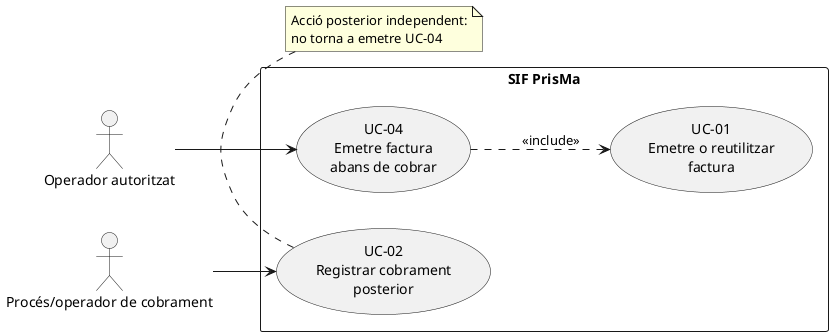

### Vista navegable a GitHub

## 3. Diagrama de classes del cas

Aquest és un **subdiagrama del model de classes del SIF**, no un segon model incompatible. Mostra només classes i dependències presents al codi consultat. La pantalla objectiu no es dibuixa com si fos una classe PHP existent.

El `PaymentService` no és dependència de `InvoiceBeforePaymentService`: participa en el **cas posterior UC-02**, no en l'emissió sense cobrament.

## 4. Diagrama de seqüència — UC-04 (emissió)

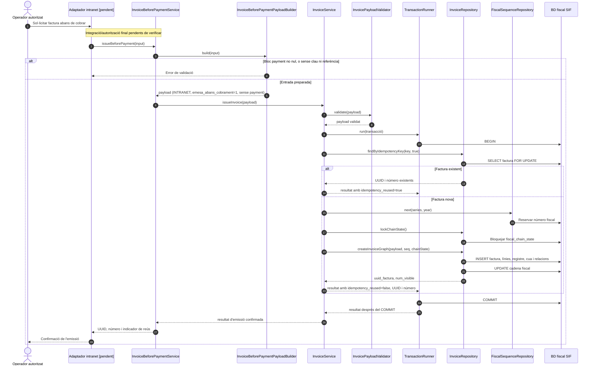

**Ordre transaccional verificat:** `TransactionRunner::run()` retorna el resultat del callback únicament després de confirmar `COMMIT`; si hi ha una excepció, executa `ROLLBACK` quan la transacció continua activa i propaga l'error. El diagrama representa la via d'èxit; la col·lisió SQL d'idempotència (`23000`) es recupera a `InvoiceService` mitjançant una **segona transacció** i rellegint la factura existent. No s'ha de comunicar èxit a l'operador abans d'aquesta confirmació. Aquest control transaccional no substitueix el guard pendent d'equivalència fiscal del payload.

**Precisió tècnica:** aquest diagrama combina el flux implementat de servei amb l'adaptador intranet *objectiu* identificat com a pendent. L'endpoint actual `sif/public/api/factures/issue.php` instancia `InvoiceService` directament; no s'ha de presentar com una crida ja demostrada a `InvoiceBeforePaymentService`.

## 5. Diagrama de seqüència vinculat — UC-02 (cobrament posterior)

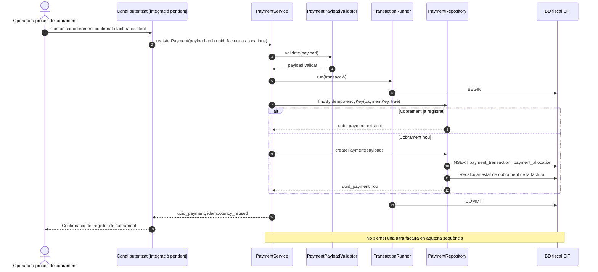

## 6. Traçabilitat de les fonts consultades

- [Fitxa anterior UC-04](../06-fitxes-funcionals/uc-004.md) — base a revisar, no traslladada automàticament com a contingut específic.
- [Catàleg de casos d'ús, apartat UC-04](../04-estat-final/33-casos-us-sif.md).
- [Diagrames de classes del SIF](../04-estat-final/31-diagrames-classes-sif.md).
- [Diagrames de seqüència, factura abans de cobrar](../04-estat-final/32-diagrames-sequencia-sif.md).
- [InvoiceBeforePaymentService.php](../../sif/src/Service/InvoiceBeforePaymentService.php).
- [InvoiceBeforePaymentPayloadBuilder.php](../../sif/src/Service/InvoiceBeforePaymentPayloadBuilder.php).
- [InvoiceService.php](../../sif/src/Service/InvoiceService.php).
- [InvoicePayloadValidator.php](../../sif/src/Service/InvoicePayloadValidator.php).
- [InvoiceRepository.php](../../sif/src/Repository/InvoiceRepository.php).
- [FiscalSequenceRepository.php](../../sif/src/Repository/FiscalSequenceRepository.php).
- [PaymentService.php](../../sif/src/Service/PaymentService.php).
- [InvoiceBeforePaymentServiceTest.php](../../sif/tests/Integration/InvoiceBeforePaymentServiceTest.php).

**Criteri de revisió:** «classe executable», «flux documental previst» i «integració acreditada» són afirmacions diferents. Aquesta fitxa acredita l'existència de codi i de proves al repositori; **no afirma haver executat les proves ni haver verificat el desplegament**.

## 7. Diagrames d'activitat de la pantalla real «Generar factura abans de pagar»

**Fonts:** [auditoria detallada de la pantalla i taula d'accions FAP-01–06](02-auditoria-pantalla-factura-abans-pagar-2026-09-25.md), [fitxa funcional UC-004, apartat 22](../06-fitxes-funcionals/uc-004.md#22-fitxa-funcional-per-accions-reals-de-generar-factura-abans-de-pagar-25092026), JS i PHP llegats referenciats en aquests documents. **ACTUAL = codi llegat llegit, no prova de desplegament; FINAL = integració fiscal SIF objectiu, no comportament implantat.** La previsualització del llegat és POSTERIOR a l'INSERT: no confondre-la amb una confirmació fiscal anterior a emetre. Els vuit diagrames representen la pàgina i subaccions separades; no compten com a vuit casos d'ús nous.

### FAP-PAG · Pàgina completa — ACTUAL

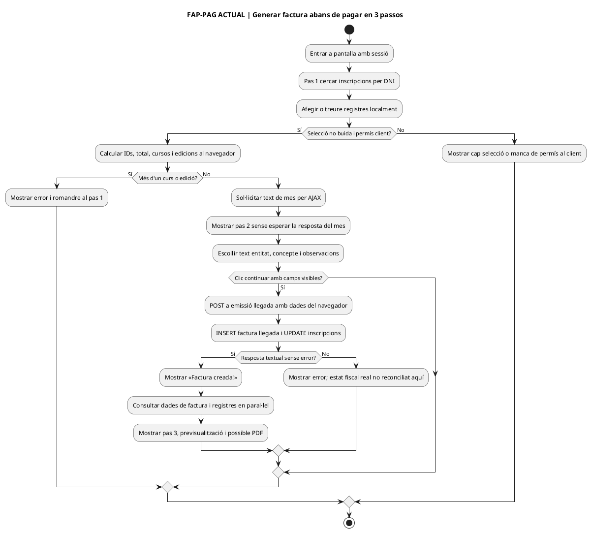

### FAP-PAG · Pàgina completa — FINAL

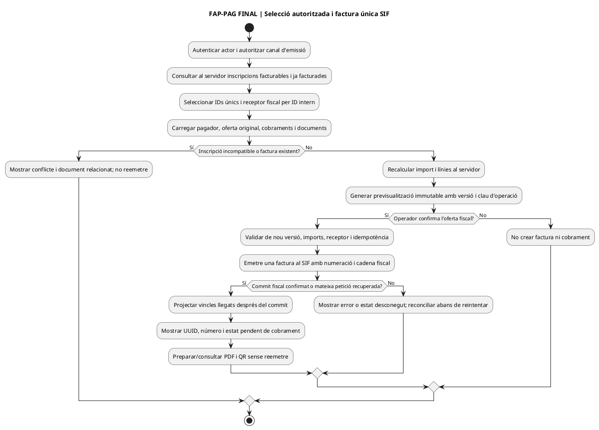

### FAP-SEL · Selecció i validació de curs/edició — ACTUAL

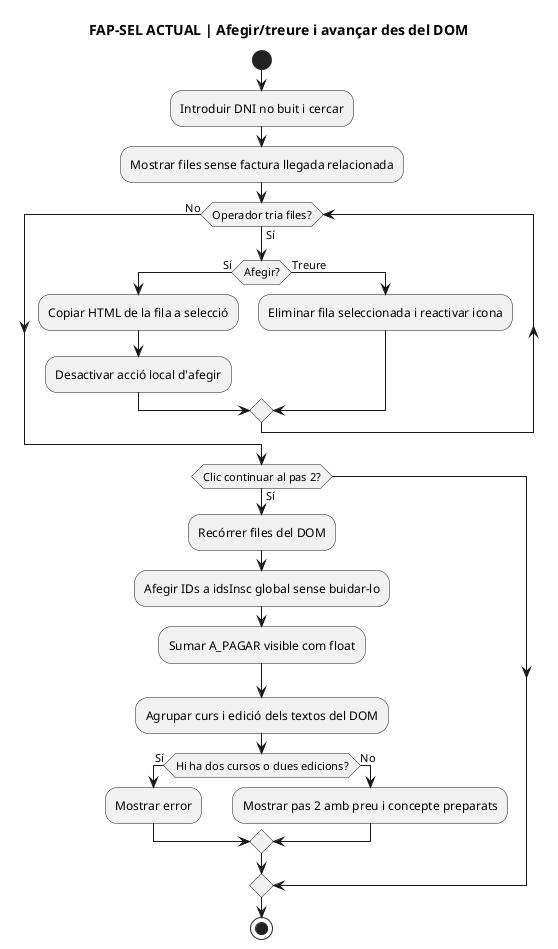

### FAP-SEL · Selecció i validació — FINAL

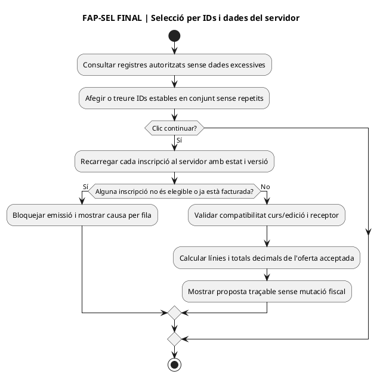

### FAP-EMISSIO · Confirmar factura a empresa — ACTUAL

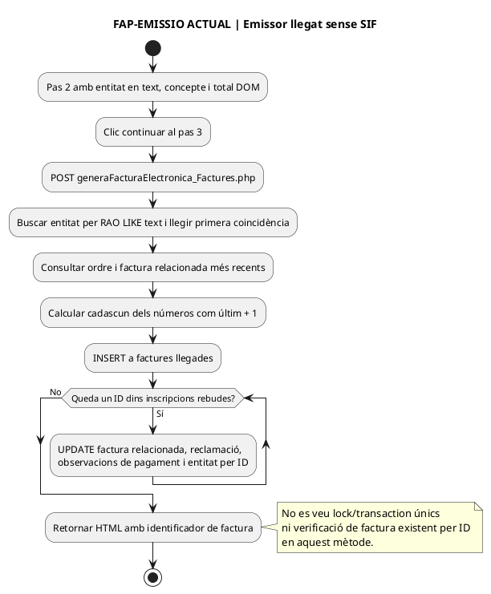

### FAP-EMISSIO · Confirmar factura — FINAL

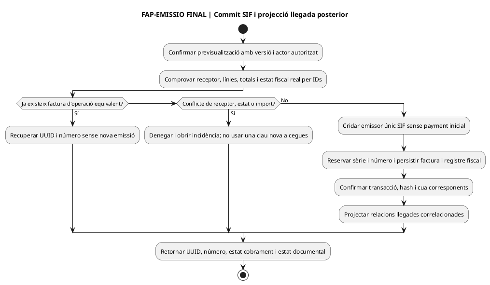

### FAP-DOC · Consultar factura ja emesa — ACTUAL

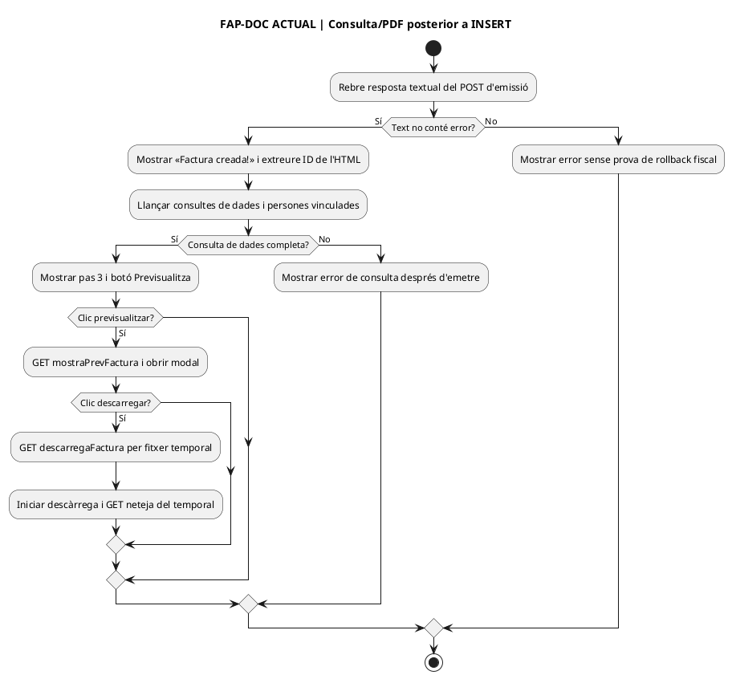

### FAP-DOC · Consultar factura — FINAL

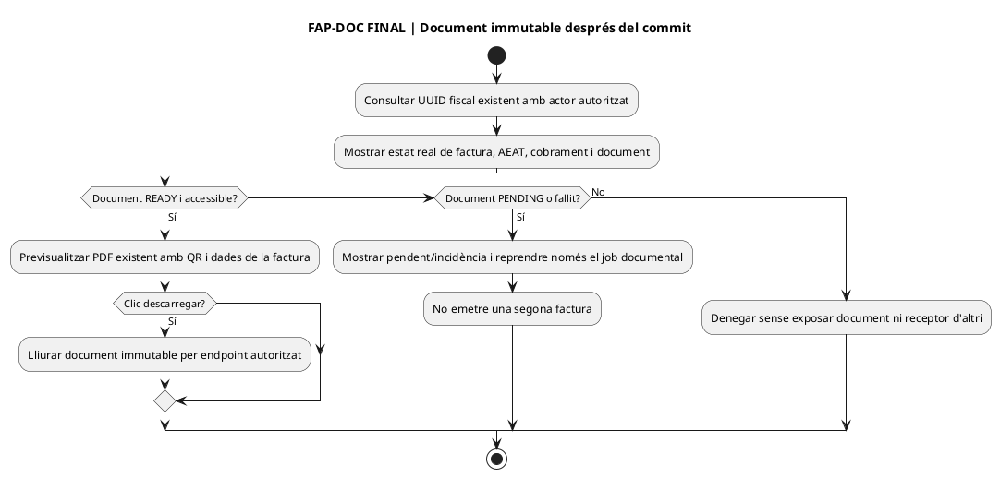

**Estat:** prova d'emissió, comprovació de numeració i autorització real, previsualització prèvia i connexió de l'adaptador intranet-SIF **pendents**. No modificar cap factura real per obtenir captures. [Punts de prova FAP-T01–06](02-auditoria-pantalla-factura-abans-pagar-2026-09-25.md#1-fitxes-funcionals-de-cada-acció-i-rastre-del-codi-actual).
