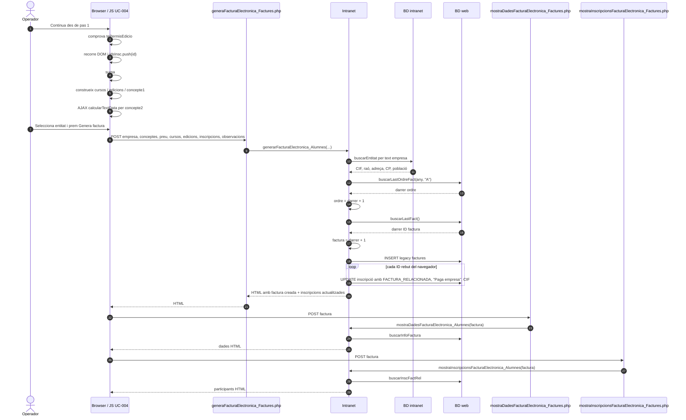
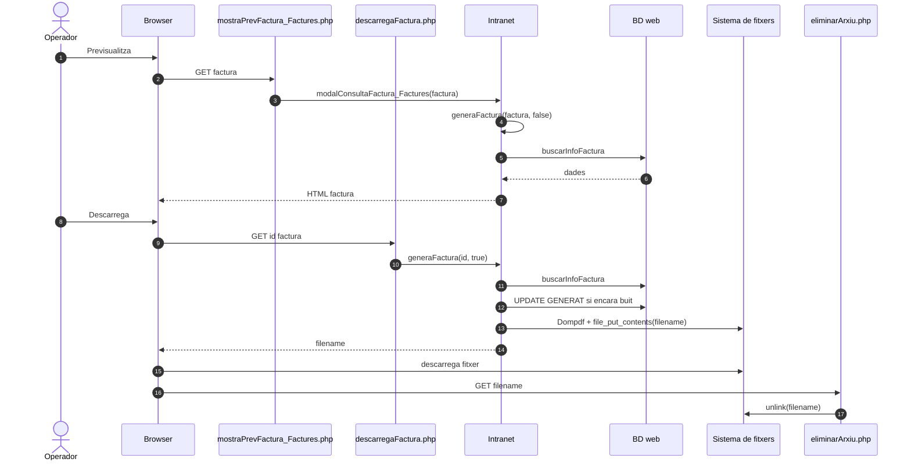
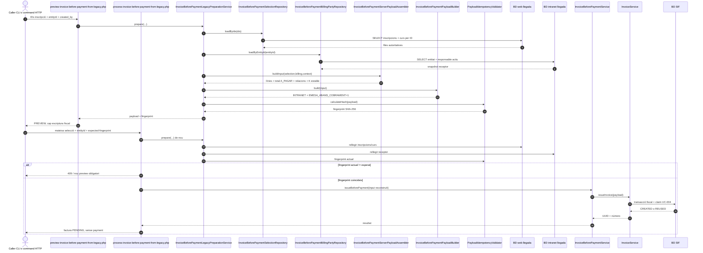
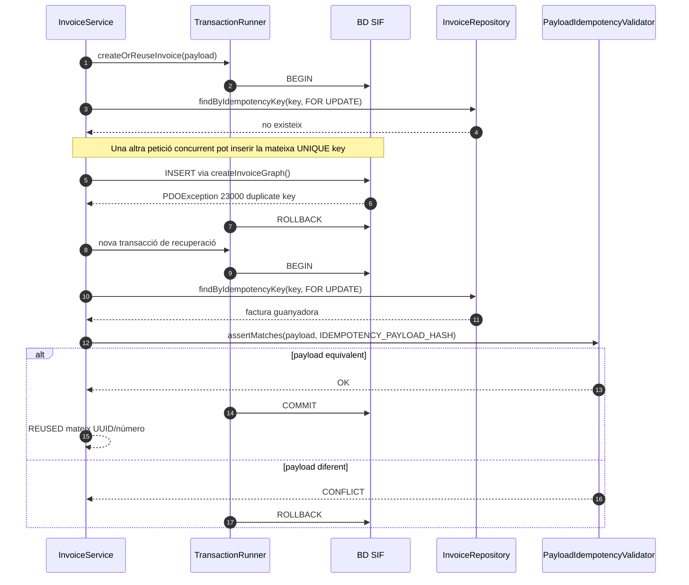
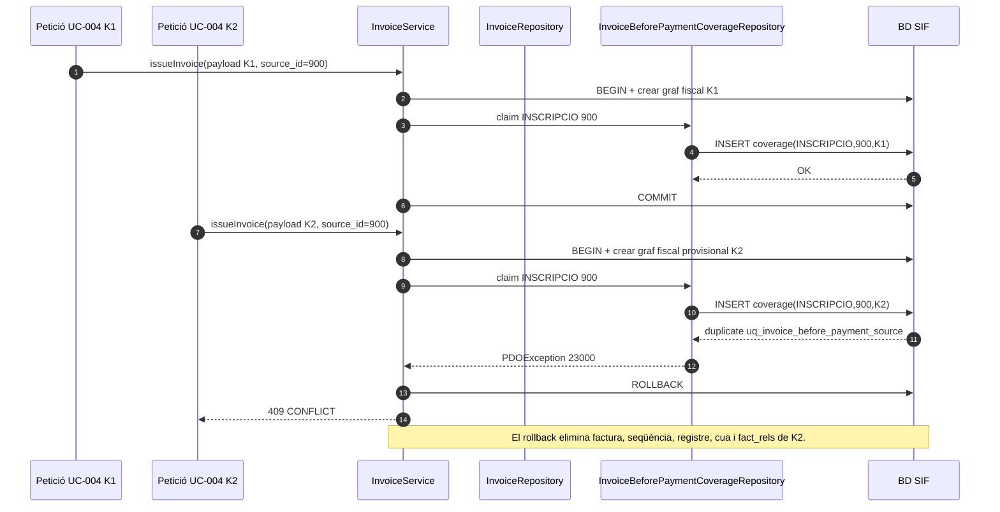
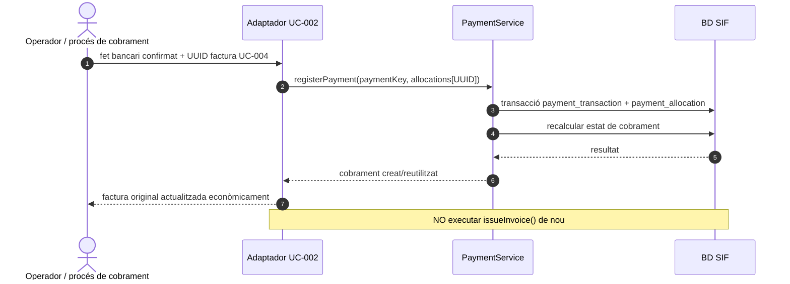

# UC-004 · Diagrames de seqüència ACTUAL / FINAL

**Cas d'ús:** UC-004 — Emetre factura abans de cobrar  
**Data d'auditoria estàtica:** 2026-09-29  
**Principi:** separar el flux que realment executa avui la intranet del flux FINAL SIF. Cap diagrama FINAL implica desplegament verificat.

## 1. Seqüència ACTUAL — càrrega, permís de pàgina i selecció

```mermaid
sequenceDiagram
autonumber
actor Op as Operador
participant B as Browser
participant G as general.js
participant MM as ajax/mostrarMain.php
participant I as Intranet
participant UI as Usuari
participant DBI as BD intranet
participant S as mostrarInformacioInscripcio_generaFactura.php
participant DBW as BD web

Op->>B: Obre /alumnes/genera-factura-abans-pagar/
B->>MM: GET mostrarMain.php?url=pathname
MM->>DBI: SELECT apartat + ROLS_VISUALITZAR
MM->>UI: tePermisVisualitzacio(rols)
alt sense permís de visualització
  MM-->>B: "No tens permisos..."
else amb permís
  MM->>I: mostrarPage(usuari)
  I->>DBI: buscarTotesEntitats()
  I-->>MM: HTML passos 1,2,3 + entitats
  MM-->>B: HTML
end

B->>G: carregar general.js
G->>DBI: via AJAX consultaRolsEdicio + consultaRolsUsuari
G-->>B: tePermisEdicio calculat al client

Op->>B: Cerca NIF/NIE
B->>S: GET dni
S->>I: mostrarInformacioInscripcio_generaFactura_Alumnes(dni)
I->>DBW: buscarInfoInscDniData
DBW-->>I: files
I-->>S: taula HTML amb valors i IDs
S-->>B: HTML
Op->>B: afegeix/elimina inscripcions
Note over B
El navegador conserva idsInsc, cursos, edicions,
preuTotal i conceptes.
end note
```

### Lectura d'auditoria

- La visualització de pàgina té comprovació servidor.
- El permís d'edició usat per la pantalla es calcula al client.
- Les dades econòmiques i funcionals que s'enviaran després es componen parcialment a partir del DOM.

## 2. Seqüència ACTUAL — emissió llegada de factura abans de cobrar



### Punts de fallada ACTUAL

1. **Concurrència de numeració:** el patró “darrer + 1” no mostra un lock fiscal equivalent al SIF.
2. **Confiança en client:** el servidor rep import, conceptes, llista d'inscripcions i text d'entitat compostos al navegador.
3. **Duplicació interna del client:** `idsInsc` és global; al pas 2 es reinicien `cursos`, `edicions` i `preuTotal`, però no s'ha observat el reset equivalent d'`idsInsc`.
4. **Atomicitat:** l'INSERT de factura i els UPDATE d'inscripcions no estan envoltats per una transacció unitària observada.
5. **Idempotència:** no hi ha clau idempotent del cas al circuit llegat.
6. **Resposta:** retorna fragments HTML, no un contracte tipificat CREATED/REUSED/CONFLICT/ERROR.
7. **Fiscalitat:** aquest camí no passa pel registre encadenat/cua fiscal del nou SIF.

## 3. Seqüència ACTUAL — previsualització i descàrrega



Aquest flux de document és llegat. No equival a custòdia immutable per UUID, versió i hash.

## 4. Seqüència FINAL — frontera HTTP interna implementada + bridge de pantalla pendent

El `main` del 2026-10-02 ja implementa la frontera SIF completa de command. El navegador **no** ha de cridar directament l'endpoint intern: continua pendent un bridge a la intranet llegada que, després de validar la sessió/permís local, signi la petició HMAC.

```mermaid
sequenceDiagram
autonumber
actor Op as Operador
participant UI as Pantalla UC-004 llegada
participant BRG as Bridge intranet [PENDENT]
participant HTTP as before-payment.php
participant AUTH as InternalApiAuthenticator
participant SCOPE as InternalInvoiceBeforePaymentScopeResolver
participant CMD as InvoiceBeforePaymentCommandService
participant PREP as InvoiceBeforePaymentLegacyPreparationService
participant SEL as InvoiceBeforePaymentSelectionRepository
participant BILL as InvoiceBeforePaymentBillingPartyRepository
participant ASM as InvoiceBeforePaymentServerPayloadAssembler
participant FP as PayloadIdempotencyValidator
participant WEB as BD web llegada
participant INTRA as BD intranet llegada
participant IBP as InvoiceBeforePaymentService
participant PB as InvoiceBeforePaymentPayloadBuilder
participant IS as InvoiceService
participant V as InvoicePayloadValidator
participant TR as TransactionRunner
participant SEQ as FiscalSequenceRepository
participant IR as InvoiceRepository
participant BPC as InvoiceBeforePaymentCoverageRepository
participant OE as OperationalEventRepository
participant DB as BD SIF

Op->>UI: Seleccionar inscripcions + entityId
UI->>BRG: preview(ids, entityId)
BRG->>BRG: validar sessió/permís local + construir headers signats
BRG->>HTTP: POST action=preview + HMAC + request_id
HTTP->>AUTH: authenticate(raw body, headers)
AUTH->>DB: INSERT internal_api_request
AUTH-->>HTTP: actor + rols + request_id
HTTP->>SCOPE: resolve(actor)
SCOPE-->>HTTP: issue=true / preview=true
HTTP->>CMD: preview(ids, entityId, actorId)
CMD->>PREP: prepare(...)
PREP->>SEL: loadByIds(ids)
SEL->>WEB: SELECT inscripcions + curs per ID
WEB-->>SEL: files autoritatives
PREP->>BILL: loadByEntityId(entityId)
BILL->>INTRA: SELECT entitat + responsable actiu
INTRA-->>BILL: snapshot receptor
PREP->>ASM: buildInput(selection,billing,context)
ASM-->>PREP: línies + totals + relacions + K estable
PREP->>PB: build(input)
PB-->>PREP: payload UC-004 sense payment
PREP->>FP: calculateHash(payload)
FP-->>PREP: fingerprint
PREP-->>CMD: preview autoritatiu
CMD-->>HTTP: fingerprint + resum
HTTP-->>BRG: JSON preview
BRG-->>UI: mostrar preview final

Op->>UI: Confirmar
UI->>BRG: confirm(ids, entityId, expectedFingerprint)
BRG->>HTTP: POST action=confirm + HMAC + request_id nou
HTTP->>AUTH: authenticate(...)
AUTH->>DB: claim request_id anti-replay
HTTP->>SCOPE: resolve(actor)
HTTP->>CMD: confirm(ids, entityId, actorId, fingerprint)
CMD->>PREP: prepare(...) de nou
PREP->>WEB: rellegir selecció
PREP->>INTRA: rellegir receptor
PREP->>FP: fingerprint actual
alt fingerprint ha canviat
  CMD-->>HTTP: 409 nou preview obligatori
  HTTP-->>BRG: CONFLICT
  BRG-->>UI: dades canviades; tornar a previsualitzar
else fingerprint coincideix
  Note over CMD,IBP: Classificador de cobertura transversal entre canals encara PENDENT.
  CMD->>IBP: issueBeforePayment(input reconstruït)
  IBP->>PB: build(input)
  PB-->>IBP: uc004_invoice_before_payment=1
  IBP->>IS: issueInvoice(payload)
  IS->>V: validate(payload)
  IS->>TR: run()
  TR->>DB: BEGIN
  IS->>IR: findByIdempotencyKey(key, FOR UPDATE)
  alt mateixa K ja existeix
    IR-->>IS: factura existent
    IS->>FP: assertMatches(payload, storedHash)
    FP-->>IS: equivalent o CONFLICT
  else nova K
    IS->>SEQ: next(series,year)
    SEQ->>DB: lock + reserva
    IS->>IR: createInvoiceGraph()
    IR->>DB: factura + línies + registre + cadena + cua + fact_rels
    IS->>BPC: claim(relations, UUID, K)
    BPC->>DB: INSERT invoice_before_payment_coverage
    IS->>OE: append(ISSUE_INVOICE_BEFORE_PAYMENT)
    OE->>DB: INSERT operational_event
  end
  TR->>DB: COMMIT
  IS-->>IBP: CREATED/REUSED + UUID + número
  IBP-->>CMD: resultat
  CMD-->>HTTP: JSON factura PENDING
  HTTP-->>BRG: resultat
  BRG-->>UI: número/UUID/estat
  Note over UI,DB: Document per UUID i sincronització llegada post-COMMIT continuen pendents.
end
```

## 4.1. Seqüència compartida — preview/confirmació autoritatius des de les BDs llegades



**Implementat:** lectura per IDs, entityId, mateix curs/edició, total des de `A_PAGAR`, receptor fiscal, fingerprint i relectura abans de confirmar.  
**Implementat també via HTTP intern:** autenticació HMAC, anti-replay, rol, preview i confirmació. **Encara pendent:** bridge de la pantalla intranet, classificador de cobertura transversal, document per UUID i sincronització llegada post-COMMIT. L'auditoria operacional s'integra en aquesta branca.

## 5. Seqüència FINAL — col·lisió concurrent de la mateixa clau



## 5.1. Seqüència FINAL — dues claus UC-004 sobre la mateixa inscripció



Aquest guard és **específic d'UC-004**. No substitueix la classificació de cobertura entre una factura UC-004 i factures d'altres canals o esquemes de pagador dividit.

## 6. Seqüència FINAL — cobrament posterior és un altre cas d'ús



## 7. Frontera amb l'endpoint genèric existent

`sif/public/api/factures/issue.php` crea directament `InvoiceService` i executa `issueInvoice($payload)`. Això és útil com a endpoint genèric d'emissió, però **no substitueix** el contracte UC-004 perquè:

- no passa per `InvoiceBeforePaymentPayloadBuilder`;
- no força per si mateix `source_channel=INTRANET`;
- no força `EMESA_ABANS_COBRAMENT=1`;
- el servei genèric permet bloc inicial `payment` si se li proporcionen dependències;
- no reconstrueix selecció, receptor ni imports des de fonts de servidor;
- no configura `InvoiceBeforePaymentCoverageRepository`; per tant un payload amb `EMESA_ABANS_COBRAMENT` falla tancat al servei i l'endpoint genèric no s'ha d'usar com a endpoint UC-004;
- no aplica el classificador de cobertura transversal entre altres canals/pagadors.

Per tancar UC-004 cal un adaptador explícit o un endpoint específic que invoqui el servei de cas d'ús corresponent.

## 8. Estat de verificació

- **Documentat:** sí, ACTUAL i FINAL separats.
- **Implementat:** circuit llegat ACTUAL i nucli SIF d'emissió/idempotència.
- **Integrat:** **no acreditat** per a pantalla UC-004 → `InvoiceBeforePaymentService`.
- **Proves:** existeixen proves d'integració del servei, però **no s'han executat en aquesta auditoria**.
- **Producció/preproducció:** no verificada.
