# UC-005 · Activitats per pàgina/apartat ACTUAL / FINAL

**Tall:** 2026-10-03 · branca `audit/uc-005-2026-10-03`

## P01 — Cerca i consulta de factura

### ACTUAL
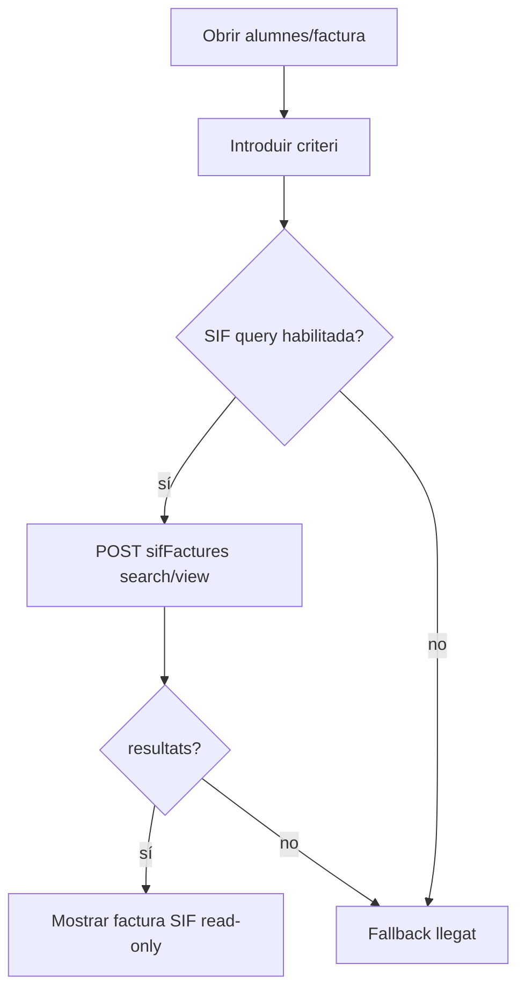

### FINAL
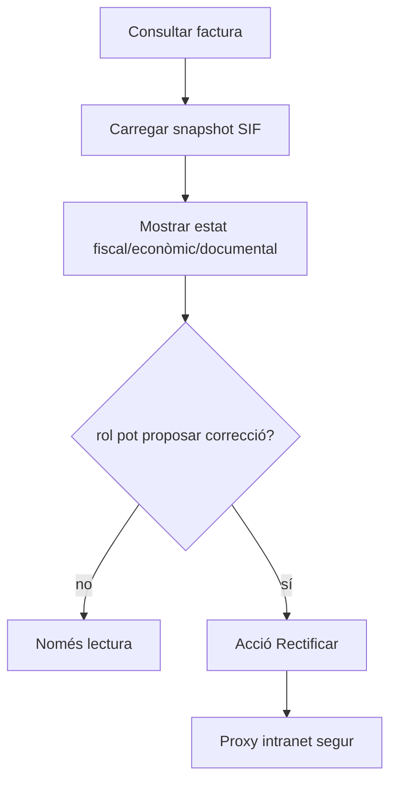

## P02 — Proposar canvi sobre factura emesa

### ACTUAL
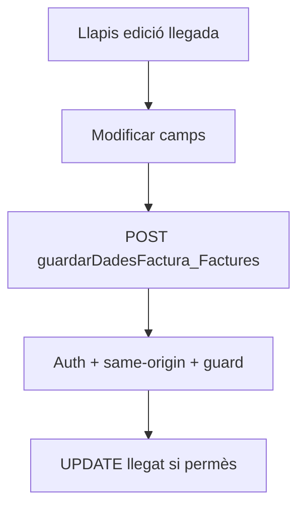

### FINAL
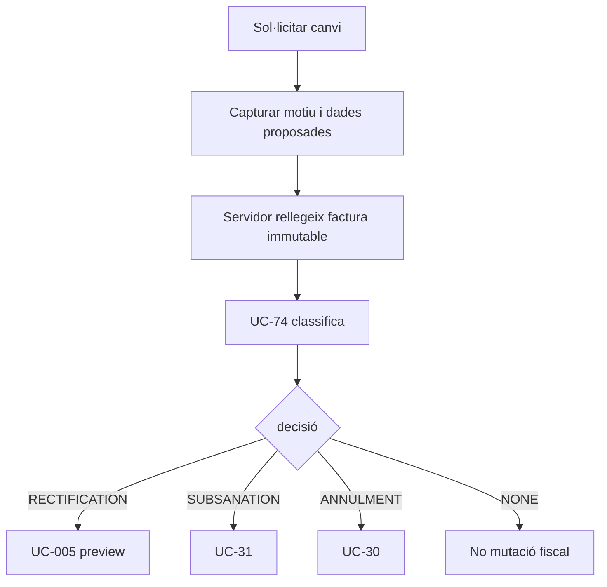

**Regla:** el navegador no pot autoassignar `source_uc=UC-74`; la decisió fiscal ha de provenir del servidor.

## P03 — Preview UC-005

### BACKEND IMPLEMENTAT
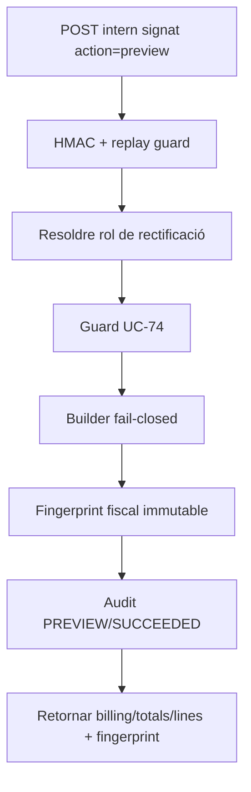

### INTRANET PENDENT
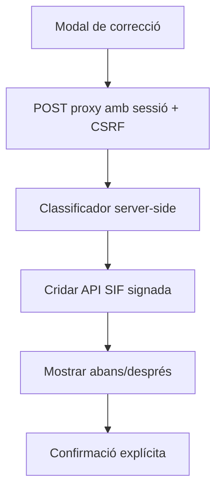

## P04 — Rectificació per diferències

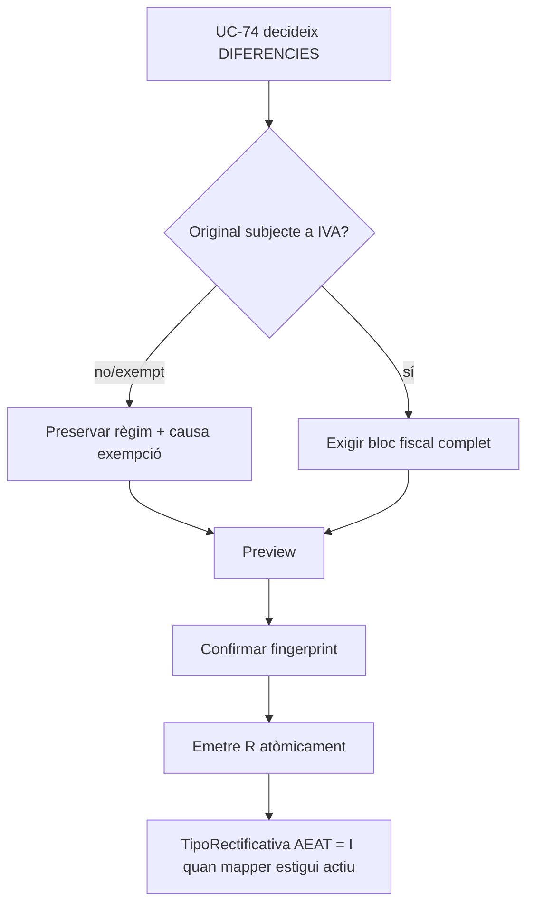

**Implementat:** el builder no torna a assumir que `amount = base = total` per factures amb IVA.  
**Pendent:** mapper AEAT complet i classificador R1-R5.

## P05 — Rectificació per substitució

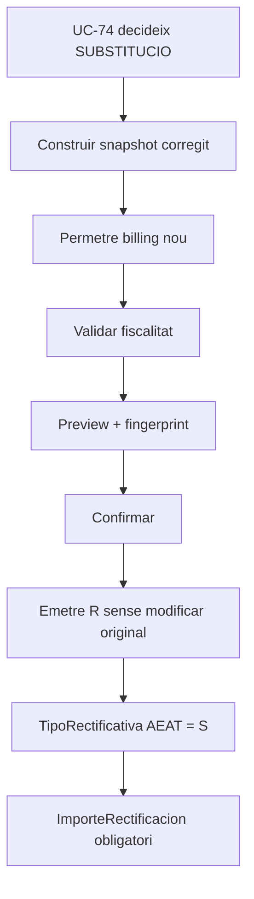

**Implementat:** la nova R pot congelar nom/CIF/adreça corregits; `DIFERENCIES` rebutja mutacions de receptor.  
**Pendent:** obtenir `ImporteRectificacion` i identitat original des del snapshot AEAT congelat, no de dades vives.

## P06 — Confirmació i commit

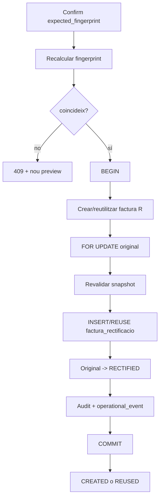

**Garantia:** si falla vincle, lock, revalidació o auditoria terminal, la factura R nova no es confirma.

## P07 — Reintent idempotent

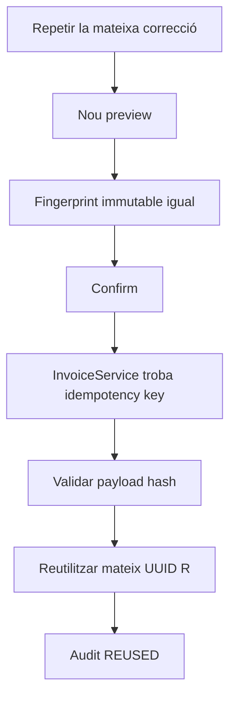

El canvi esperat de l'original `ISSUED -> RECTIFIED` no forma part del fingerprint immutable i no força una segona factura R.

## P08 — “Anul·lar” factura llegada

### ACTUAL
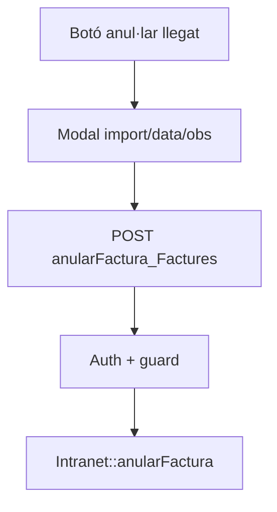

### FINAL
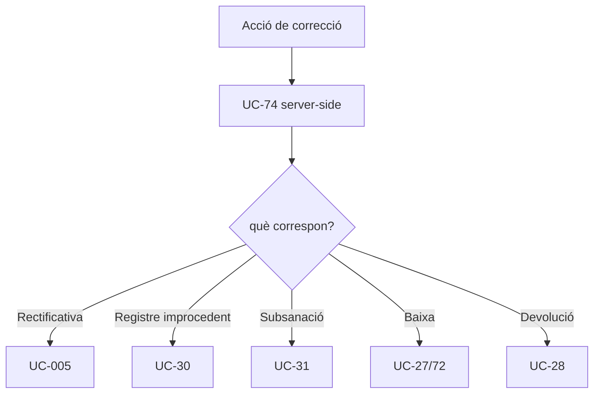

El text històric del botó no determina la figura fiscal.

## P09 — Resultat, document i AEAT

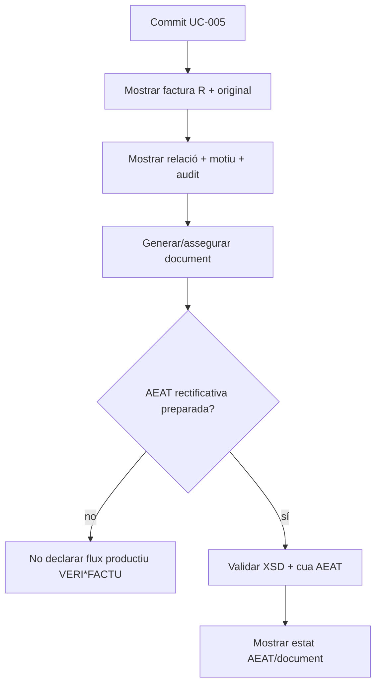

## P10 — Estat per capa

| Capa | Estat |
|---|---|
| Consulta SIF intranet | **IMPLEMENTADA / read-only** |
| Mutació llegada protegida | **IMPLEMENTADA**, però no és UC-005 |
| Builder rectificatiu local | **IMPLEMENTAT / fail-closed** |
| SUBSTITUCIO amb receptor corregit | **IMPLEMENTADA al backend** |
| Atomicitat R + vincle + original | **IMPLEMENTADA** |
| Fingerprint + reintent | **IMPLEMENTAT** |
| HMAC/replay + rol backend | **IMPLEMENTAT** |
| Audit SIF/operacional | **IMPLEMENTAT** |
| Guard de decisió UC-74 | **IMPLEMENTAT** |
| Classificador UC-74 genèric | **PENDENT / BLOQUEJANT** |
| Proxy intranet sessió+CSRF UC-005 | **PENDENT** |
| `RecordFactory` AEAT S/I | **IMPLEMENTAT** |
| Mapper AEAT rectificatiu R1-R5 | **PENDENT / BLOQUEJANT** |
| Suite MySQL UC-005 | **DEFINIDA; CI EN CUA** |
| E2E/preproducció | **PENDENT** |
