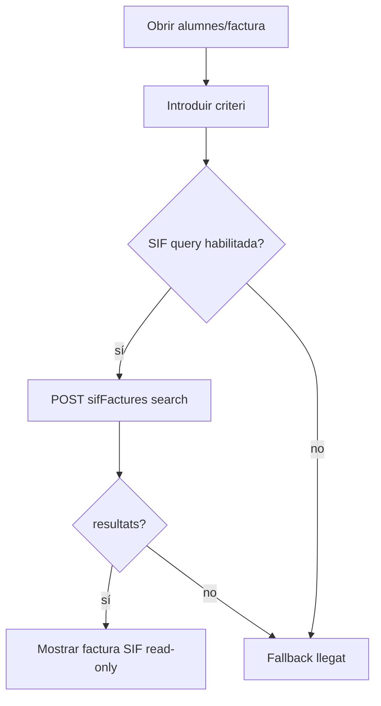
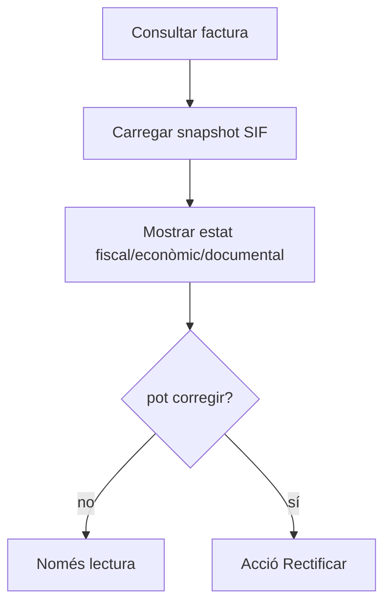
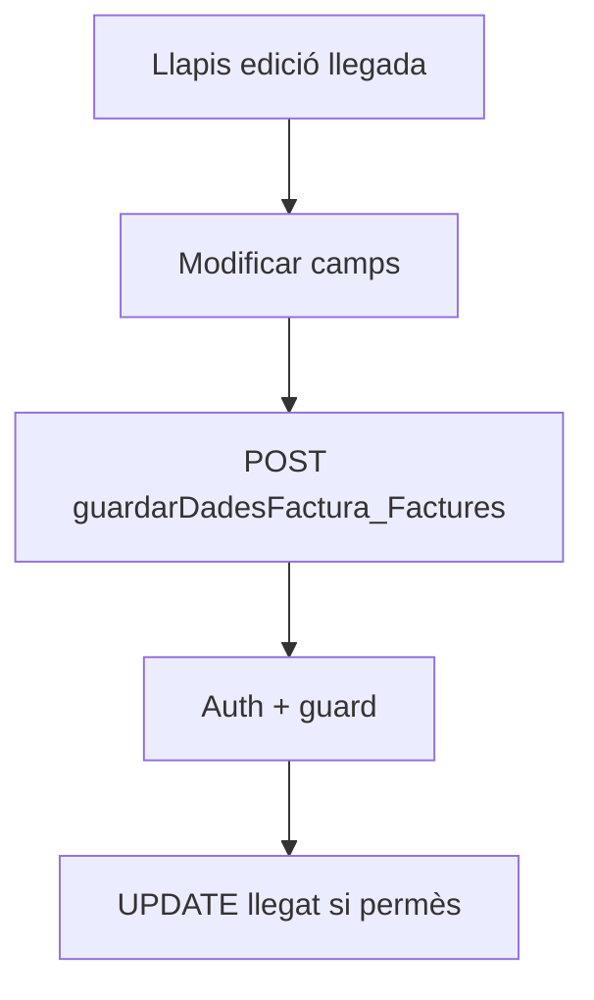
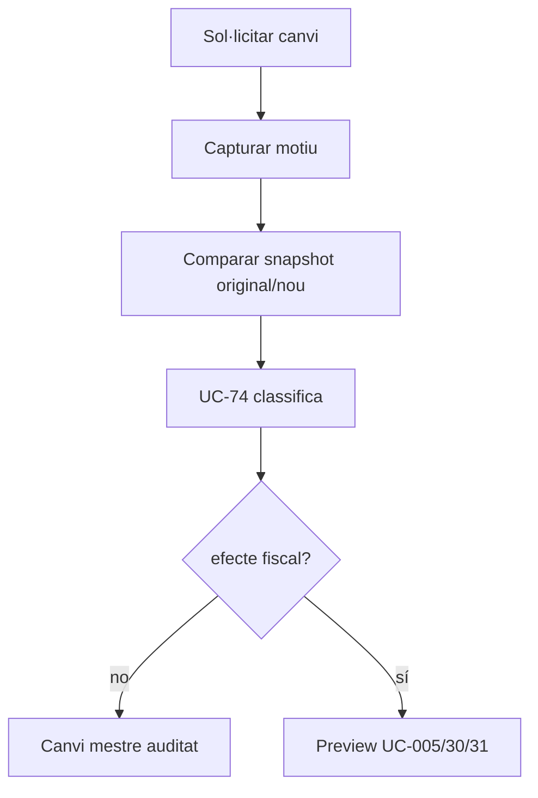
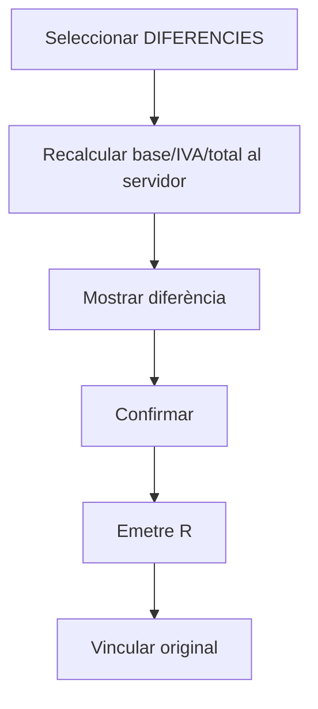
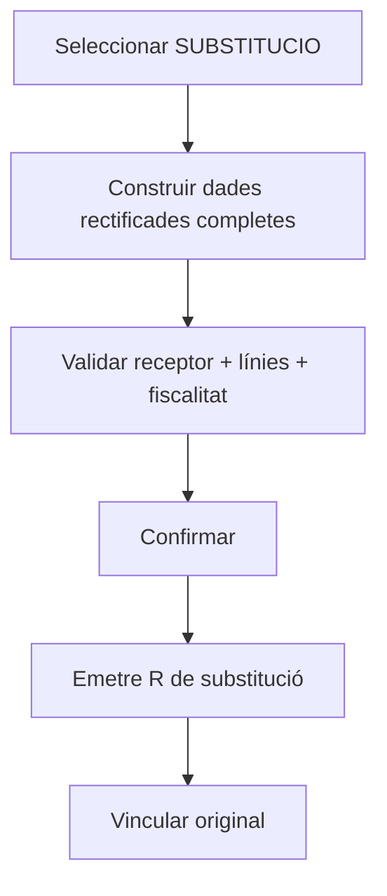
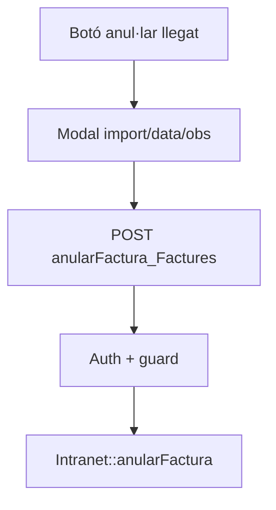
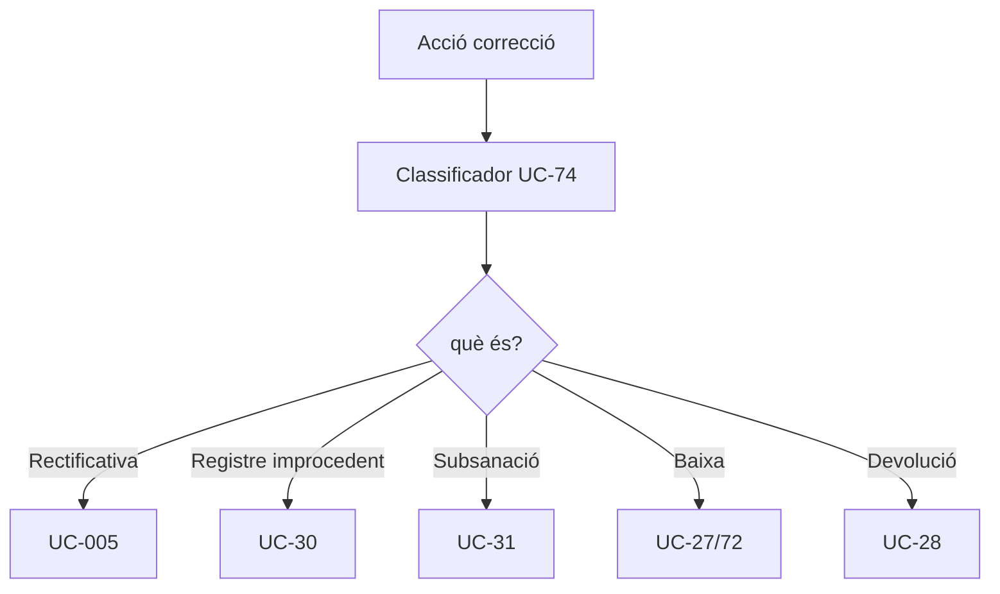
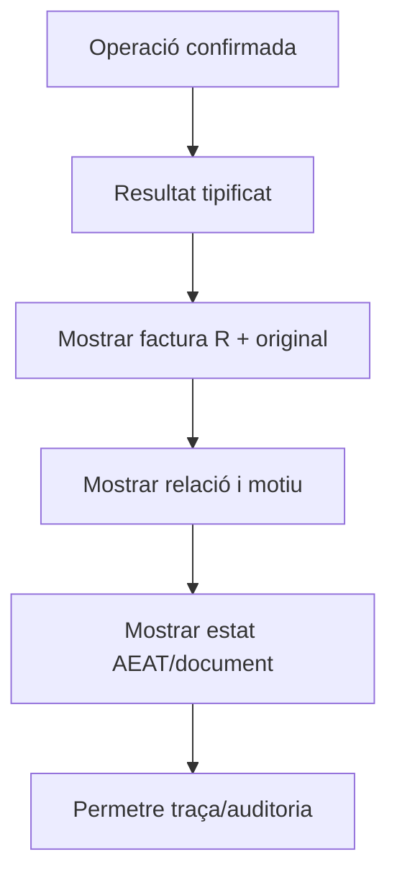

# UC-005 · Activitats per pàgina/apartat ACTUAL / FINAL

## P01 — Cerca i consulta de factura

### ACTUAL

### FINAL

## P02 — Editar dades de factura

### ACTUAL

### FINAL

## P03 — Rectificació per diferències

## P04 — Rectificació per substitució

**Buit actual:** el builder vigent hereta el receptor de l'original i no acredita la substitució real de nom/CIF/adreça.

## P05 — “Anul·lar” factura

### ACTUAL

### FINAL

## P06 — Resultat i consulta posterior

