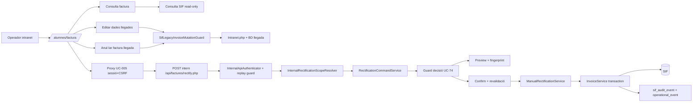

# UC-005 · Cas d'ús ACTUAL / FINAL — Rectificar factura

## ACTUAL — branca d'auditoria

L'ACTUAL de la branca ja disposa de **backend i consumidor intranet UC-005** fail-closed. La consulta SIF continua immutable/read-only, però el detall pot mostrar la decisió UC-74 vigent i executar preview/confirm sobre el snapshot `correction` aprovat; les mutacions llegades protegides continuen sense equivaldre al command UC-005.

## FINAL

```mermaid
flowchart LR
  CLASS[UC-74 productor fiscal<br/>PENDENT] --> DEC[(sif_audit_event<br/>classification + correction)]
  OP[Operador autoritzat] --> UI[Factura SIF]
  UI --> Q[Consulta SIF FULL]
  Q --> DEC
  DEC --> READY{Decisió executable<br/>RECTIFICATION?}
  READY -- no --> BLOCK[Bloqueig / derivar a altre UC]
  READY -- sí --> PX[Proxy intranet<br/>sessió + permís + CSRF]
  PX --> API[POST signat UC-005]
  API --> AUTH[HMAC + replay + role scope]
  AUTH --> RES[FiscalCorrectionDecisionResolver]
  RES --> DEC
  RES --> PRE[Preview + fingerprint]
  PRE --> CONF[Confirmació usuari]
  CONF --> CMD[RectificationCommandService]
  CMD --> RS[ManualRectificationService]
  CMD --> MAP[AeatRectificationMapper]
  RS --> IS[InvoiceService]
  IS --> DB[(SIF)]
  DB --> LINK[factura R + factura_rectificacio + original RECTIFIED]
  LINK --> AUD[sif_audit_event + operational_event]
  LINK --> DOC[PDF/QR/XML]
  LINK --> OUT[Resposta tipificada + consulta posterior]
```

## Regles

- Una rectificativa no equival a una devolució monetària.
- Una baixa o canvi de curs pot provocar UC-005, però també UC-28/29/71/72 segons la decisió econòmica.
- El FINAL no permet editar in-place una factura emesa.
- La figura fiscal s'ha de decidir abans d'emetre la sèrie R; el consumidor UC-005 ja exigeix event UC-74 + fingerprint + snapshot executable, però el productor/classificador UC-74 general encara s'ha d'implementar.
- La protecció web ja està implementada al proxy intranet: sessió, permís d'edició, same-origin, CSRF i posterior HMAC cap al SIF.
- Un reintent equivalent ha de reutilitzar la mateixa R i quedar auditat com `REUSED`.
