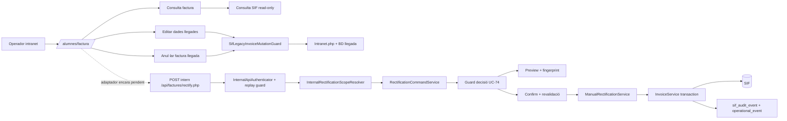
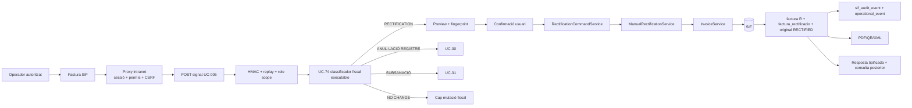

# UC-005 · Cas d'ús ACTUAL / FINAL — Rectificar factura

## ACTUAL — branca d'auditoria

L'ACTUAL de la branca ja disposa d'un **backend UC-005 específic** i fail-closed, però la pantalla intranet encara no el consumeix. La consulta SIF de `/alumnes/factura/` continua read-only; les mutacions llegades protegides no equivalen al command UC-005.

## FINAL

## Regles

- Una rectificativa no equival a una devolució monetària.
- Una baixa o canvi de curs pot provocar UC-005, però també UC-28/29/71/72 segons la decisió econòmica.
- El FINAL no permet editar in-place una factura emesa.
- La figura fiscal s'ha de decidir abans d'emetre la sèrie R; el guard backend ja ho exigeix, però el classificador UC-74 general encara s'ha d'implementar.
- El backend intern no substitueix la protecció web: el proxy intranet FINAL ha de validar sessió, permís i CSRF abans de signar la petició SIF.
- Un reintent equivalent ha de reutilitzar la mateixa R i quedar auditat com `REUSED`.
