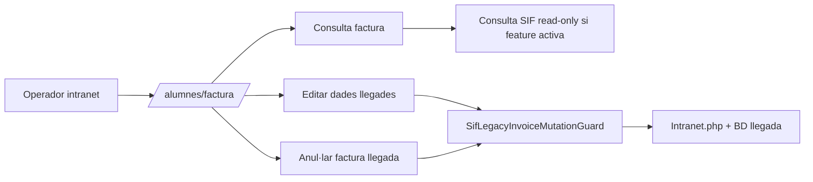
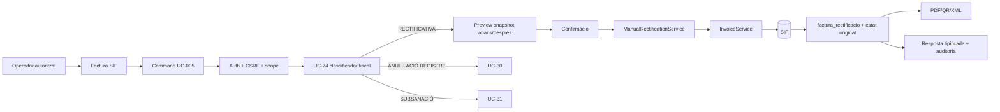

# UC-005 · Cas d'ús ACTUAL / FINAL — Rectificar factura

## ACTUAL

El flux de consulta SIF és principalment read-only. Els botons de mutació continuen actuant sobre el llegat quan el guard ho permet; no invoquen `ManualRectificationService`.

## FINAL

## Regles

- Una rectificativa no equival a una devolució monetària.
- Una baixa o canvi de curs pot provocar UC-005, però també UC-28/29/71/72 segons la decisió econòmica.
- El FINAL no permet editar in-place una factura emesa.
- La figura fiscal s'ha de decidir abans d'emetre la sèrie R.
