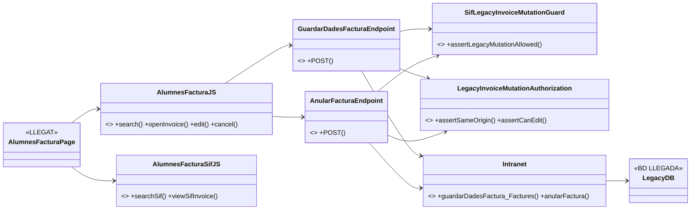
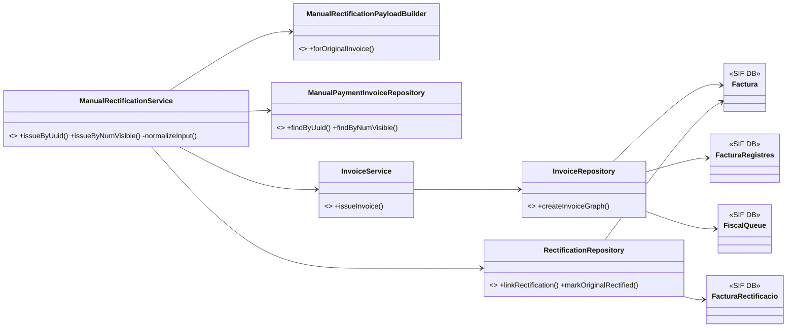
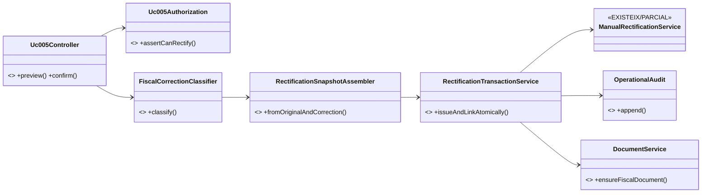

# UC-005 · Diagrames de classes ACTUAL / FINAL

**Data:** 2026-10-03

## 1. ACTUAL — pantalla i llegat

## 2. SIF existent

## 3. FINAL objectiu

## 4. Mismatch principal

El servei actual fa `InvoiceService::issueInvoice()` i, quan aquest ja ha confirmat la seva transacció, executa `linkRectification()` i `markOriginalRectified()`. Per tant el FINAL no es pot dibuixar com una única transacció fins que el codi ho implementi realment.
