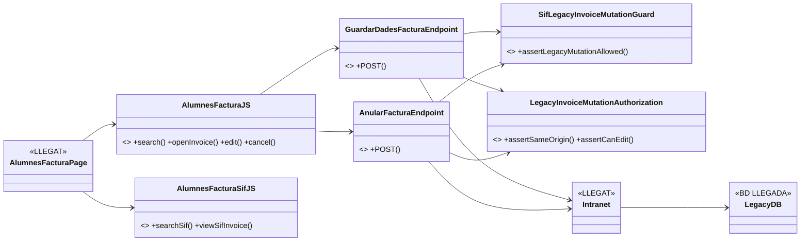
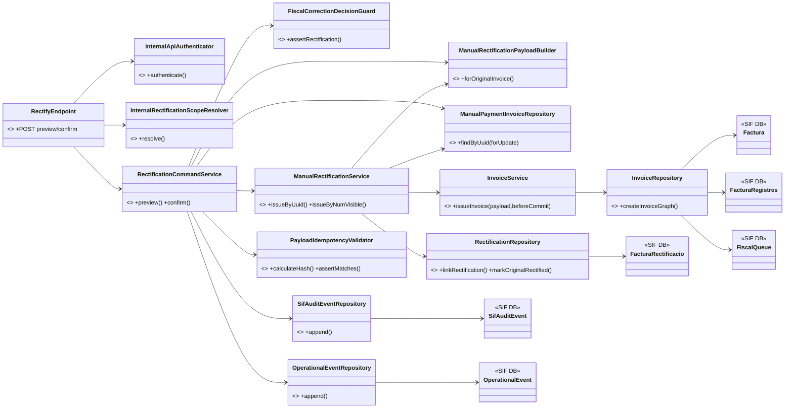

# UC-005 · Diagrames de classes ACTUAL / FINAL

**Data:** 2026-10-03  
**Tall:** branca `audit/uc-005-2026-10-03`

## 1. ACTUAL — intranet

La factura SIF continua immutable/read-only, però la branca ja disposa del consumidor UC-005: `SifRectificationAccess`, proxy intranet, read model de decisió UC-74 i panell JS preview/confirm. No hi ha edició directa.

## 2. ACTUAL — backend UC-005 implementat a la branca

## 3. FINAL objectiu

```mermaid
classDiagram
direction LR
class InvoiceQueryService { <<IMPLEMENTAT>> +view() }
class InvoiceReadRepository { <<IMPLEMENTAT>> +latestFiscalCorrectionDecision() }
class AlumnesFacturaSifJS { <<IMPLEMENTAT>> +renderDecision() +previewRectification() +confirmRectification() }
class SifRectificationAccess { <<IMPLEMENTAT>> +resolve() +csrfToken() +assertCsrf() }
class IntranetRectificationProxy { <<IMPLEMENTAT>> +preview() +confirm() }
class FiscalCorrectionClassifier { <<PENDENT/UC-74 PRODUCTOR>> +classify() +persistDecision() }
class FiscalCorrectionDecisionResolver { <<IMPLEMENTAT>> +resolve() }
class RectifyEndpoint { <<IMPLEMENTAT>> +POST() }
class RectificationCommandService { <<IMPLEMENTAT>> +preview() +confirm() }
class ManualRectificationService { <<IMPLEMENTAT>> +issueByUuid() }
class AeatRectificationMapper { <<PARCIAL/FAIL-CLOSED>> +map() }
class DocumentService { <<TRANSVERSAL/PENDENT E2E>> +ensureFiscalDocument() }

FiscalCorrectionClassifier ..> InvoiceReadRepository : persisteix event UC-74 [pendent]
InvoiceQueryService --> InvoiceReadRepository
InvoiceReadRepository --> AlumnesFacturaSifJS : decisió projectada via API/proxy consulta
AlumnesFacturaSifJS --> IntranetRectificationProxy
IntranetRectificationProxy --> SifRectificationAccess
IntranetRectificationProxy --> RectifyEndpoint
RectifyEndpoint --> FiscalCorrectionDecisionResolver
RectifyEndpoint --> RectificationCommandService
RectificationCommandService --> ManualRectificationService
RectificationCommandService --> AeatRectificationMapper
ManualRectificationService --> DocumentService
```

## 4. Estat reconciliat

- **Atomicitat:** implementada mitjançant el callback `beforeCommit` d'`InvoiceService`.
- **Concurrència:** `FOR UPDATE` + revalidació del snapshot abans del COMMIT; pendent prova E2E amb sessions concurrents.
- **Fiscalitat local:** fail-closed; IVA subjecte exigeix bloc fiscal explícit.
- **SUBSTITUCIO:** receptor corregit congelat a la nova R; original immutable.
- **Decisió fiscal:** guard UC-74 implementat; classificador UC-74 genèric pendent.
- **Auditoria:** `sif_audit_event` + `operational_event` integrats al command.
- **Canal web:** endpoint intern signat, proxy intranet sessió+permís+same-origin+CSRF i panell JS preview/confirm implementats. El panell només s'habilita amb snapshot de correcció UC-74 executable.
- **AEAT/document:** mapper rectificatiu implementat per un únic desglossament compatible; perfils fiscals complexos, document E2E i evidència preproducció continuen pendents.
