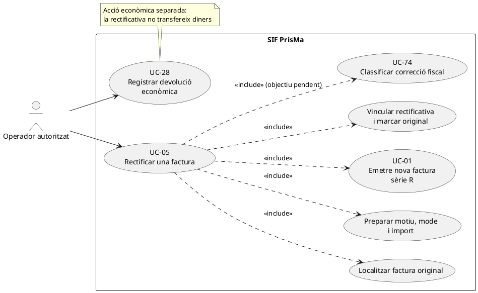
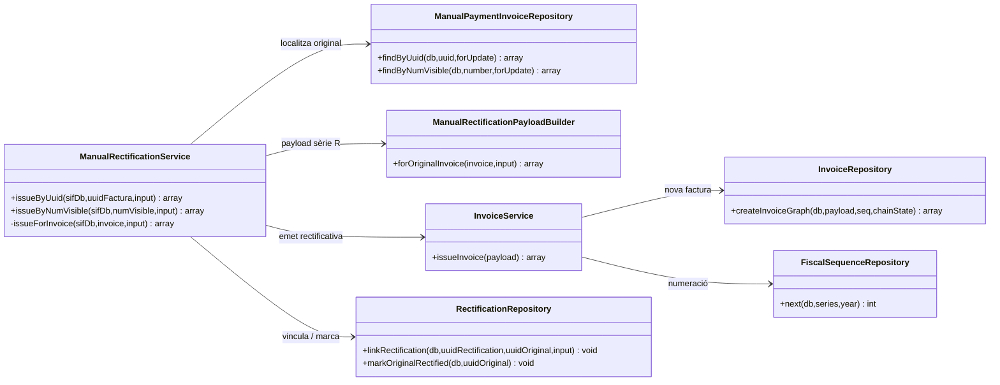
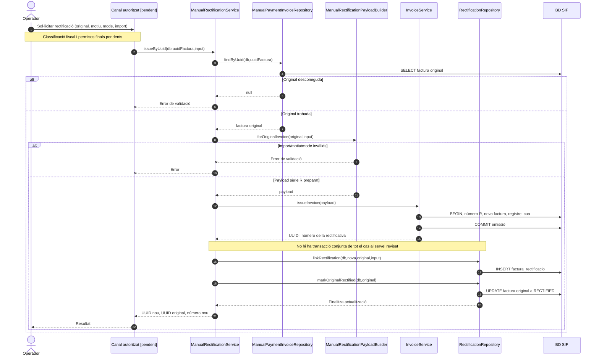

# UC-05 · Rectificar una factura — fitxa i UML integrats

**Estat documental:** nucli de rectificació manual existent; **no s'acredita** que la classificació fiscal, la pantalla final, les garanties de transacció conjunta ni tots els escenaris de rectificació estiguin resolts. **Casos relacionats:** UC-01 (emissió del nou document), UC-26/71 (canvi de curs), UC-27/72 (baixa), UC-28 (devolució econòmica), UC-30 (anul·lació de registre), UC-31 (subsanació) i UC-74 (classificació de correcció fiscal).

## 1. Fitxa del cas d'ús

| Camp | Especificació de l'operació |
| --- | --- |
| Actor principal | Operador autoritzat, a través d'una pantalla/adaptador amb control d'autorització pendent de verificació. |
| Disparador | Una factura emesa requereix una rectificació per un motiu justificat i classificat. |
| Precondicions implementades | Identificació de la factura original per `UUID_FACTURA` o `NUM_VISIBLE`; existència de l'original; import, motiu i mode vàlids. |
| Entrades específiques | `amount`/`import` numèric no nul; `reason`/`motiu` no buit; `mode`/`mode_rectificacio` igual a `DIFERENCIES` o `SUBSTITUCIO`; `concept`, `detail`, `reference`, `created_by`, `year` i `type` opcionalment segons el constructor actual. |
| Resultat | Nova factura amb sèrie `R`; retorn de `uuid_factura` i `num_visible` nous, `uuid_factura_rectificada` i `num_visible_rectificada` de l'original, i indicador de reutilització. |
| Límits | Emetre la rectificativa **no és** executar una devolució monetària, anul·lar un registre improcedent ni subsanar un registre fiscal. No confondre'ls en el diagrama. |

### 1.1. Flux existent verificat

1. `ManualRectificationService::issueByUuid()` o `issueByNumVisible()` valida que l'identificador no sigui buit i localitza la factura original mitjançant `ManualPaymentInvoiceRepository`.
2. Si l'original no existeix, retorna error i no inicia la creació de la rectificativa.
3. `ManualRectificationPayloadBuilder::forOriginalInvoice()` prepara el payload: sèrie `R`; any d'entrada o de l'original; tipus per defecte `R1`; dades del receptor recuperades de la factura original; imports i línia de rectificació; relació d'origen `RECTIFIES`.
4. El constructor genera una clau idempotent pròpia per referència o, si no n'hi ha, a partir de número original, mode, motiu i import.
5. `InvoiceService::issueInvoice()` crea o reutilitza la factura rectificativa; executa la persistència i el registre fiscal comuns a UC-01.
6. **Després del retorn d'aquest servei**, `RectificationRepository::linkRectification()` insereix la relació a `factura_rectificacio`, i `markOriginalRectified()` actualitza `factura.ESTAT_FACTURA` de l'original a `RECTIFIED`.
7. El servei retorna identificadors de la rectificativa i de l'original.

### 1.2. Variants, errors i qüestions específiques

| Variant o risc | Dada comprovada / tractament documental |
| --- | --- |
| A1. Identificar per número visible | `issueByNumVisible()` busca la factura original per `NUM_VISIBLE` i reutilitza el mateix procés. |
| A2. Rectificació per diferències | Mode `DIFERENCIES`. La prova d'integració cobreix un exemple d'import `-40.00` i motiu `DEVOLUCIO_PARCIAL`. Això **no equival** a registrar una transferència de devolució. |
| A3. Rectificació per substitució | Mode `SUBSTITUCIO` admès pel constructor i cobert en una prova amb import negatiu; cal definir i validar el tractament fiscal de cada cas real. |
| A4. Reintent exacte | La clau idempotent permet que `InvoiceService` reutilitzi la rectificativa. La inserció de `factura_rectificacio` evita duplicats amb `ON DUPLICATE KEY UPDATE MOTIU = MOTIU`. |
| E1. Original desconeguda | L'orquestrador rebutja la petició abans d'emetre. |
| E2. Import zero, motiu absent o mode invàlid | El constructor rebutja la petició. |
| **Risc R1: manca d'atomicitat de l'operació completa** | `issueInvoice()` confirma la transacció de la factura **abans** de la inserció de l'enllaç i de l'actualització de l'original. Aquestes darreres operacions usen el `PDO` rebut i no estan englobades per la mateixa transacció al servei consultat. Una fallada intermèdia podria deixar rectificativa emesa sense relació o sense original marcat com a rectificat. No representar el flux com una única transacció atòmica. |
| **Risc R2: fiscalitat del constructor** | El constructor actual fixa `IVA_REGIM=EXEMPT`, `IVA_PCT=0` i `IVA_IMPORT=0` per defecte i recupera el receptor de l'original. **No s'ha acreditat** que aquesta simplificació sigui adequada per a totes les factures, tipus i motius possibles. |
| **Risc R3: elecció de figura fiscal** | Els fluxos d'anul·lació de registre i subsanació són casos diferents i la seva elecció s'ha de classificar abans de cridar la rectificativa. La selecció automàtica completa no està acreditada en aquest servei. |

**Resultats persistits:** nova `factura` sèrie `R`, les seves `factura_linia`, `factura_registres`, entrada `fiscal_queue`, `fact_rels` d'origen i `factura_rectificacio`; actualització de l'estat de la factura original. **No** es crea un moviment `payment_transaction` per aquest servei.

**Proves localitzades (no executades en aquesta revisió):** `ManualRectificationServiceTest::testIssuesRectificationInvoiceAndLinksOriginalInvoice`, `testIssuesRectificationByVisibleInvoiceNumber` i `testRejectsUnknownOriginalInvoiceBeforeIssuingRectification`. No demostren recuperació davant de fallada entre emissió, vinculació i actualització de l'original.

### 1.8. Revisió: correcció fiscal ≠ moviment intern o extern de fons — PENDENT

UC-05 conserva factura i registre originals i emet la rectificativa; **això no crea per si mateix un `REFUND`, un traspàs entre inscripcions ni una nova entrada de caixa**. Quan la causa és un canvi de curs o una baixa, la decisió econòmica ha d'enllaçar la rectificativa a cadascun dels moviments **efectius** del saldo d'inscripció: transferència a destí, retorn real o creació de saldo. Un canvi només de receptor o concepte pot necessitar document fiscal, però no té per què alterar l'atribució econòmica. La coordinació i la recuperació entre l'emissió de la factura R, la relació fiscal i els moviments econòmics són pendents, sense suposar un únic commit existent.

[Revisió transversal de fons per inscripció](00-revisio-moviments-inscripcions.md).

### 1.3. Contrast de la pantalla «Consulta - Edita - Anul·la factura» i de les decisions del xat original

**R-PANTALLA — flux històric real, no adaptador SIF acreditat.** A `/alumnes/factura/` es cerca per DNI/NIE, correu, `FACTURA_RELACIONADA` o número; un clic a `.cns-informacio` obre el modal de factura. El llapis `.editar-apartat` permet canviar `rao`, `cif`, adreça, `concepte1`, `concepte2`, observacions i identificació; `.save-result` crida `guardarDadesFactura_Factures.php` per **GET**, que delega a `guardarDadesFactura_Factures()` i a l'UPDATE `updDadesFact` del llegat. Aquesta edició directa és un comportament **antic** que s'ha de substituir per una acció amb motiu, snapshot de l'original i classificació fiscal; la pantalla SIF no pot presentar el mateix llapis com a modificació en lloc d'una factura emesa.

**R-ANUL — botó antic ambigu.** `.anula-factura` obre `mostrarModalAnulaFactura_Factures.php`; `.confirma-baixa` recull `id`, `A TORNAR`, `DATA DEVOLUCIO` i observacions i crida `anularFactura_Factures.php` per **GET**. El procediment històric `anularFactura()` genera una nova fila de factura **R negativa** i altera resums econòmics d'inscripcions; el xat original confirma les sèries separades A i R i que el llegat feia rectificatives negatives. **El nom del botó «anul·lar» no determina la figura del SIF**: distingir correcció d'import/concepte/receptor (UC-05), baixa d'inscripció (UC-27/72), devolució (UC-28), anul·lació de registre improcedent (UC-30) i subsanació de registre (UC-31), sense disparar-los tots per defecte.

**R-RECEPTOR — dades fiscals canviades després d'emetre.** El xat confirma canvis de nom/CIF i expressa preferència per una rectificativa de valor zero o per substitució en aquests casos. Aquesta és la **necessitat de negoci comunicada**, no l'elecció fiscal validada de la modalitat: el classificador UC-74 ha de decidir tipus i dades que cal rectificar en funció del cas documentat abans d'invocar `ManualRectificationPayloadBuilder`. El constructor actual recupera el receptor de la factura original per defecte; **això no demostra que pugui corregir el receptor real en un sol pas** amb l'entrada actual. No etiquetar «canvi de CIF resolt» sense una prova del payload final, relació amb original i document generat.

**R-DIFERÈNCIA — servei i imports.** El xat confirma canvis de curs successius, canvis d'import després de pagar, descomptes excepcionals que històricament només alteraven el preu final, i canvis de curs amb **el mateix import però concepte diferent**. El procediment objectiu ha de congelar el concepte antic/nou i l'import original, demanar motiu, distingir diferència positiva/negativa i valorar també la correcció de concepte encara que el total sigui idèntic. No inventar un CHARGE o REFUND pel simple fet de registrar una rectificativa. Si la factura inclou diversos participants, cal identificar línia/part afectada: el builder manual genèric d'una línia no és un classificador de delta de grup.

**R-CORRELACIÓ — rectificativa emesa, enllaç pendent.** En el servei actual `InvoiceService::issueInvoice()` confirma la nova factura abans de `RectificationRepository::linkRectification()` i `markOriginalRectified()`. El canal ha de conservar UUID de la rectificativa emesa si falla el vincle posterior, registrar incidència i recuperar l'enllaç idempotentment: mai tornar a emetre una segona factura R per reparar un error de sincronització. La parella original/rectificativa no es dedueix només del camp històric `FACTURA_RELACIONADA`, que pot agrupar diversos documents.

### 1.4. Proves d'acceptació específiques de la pantalla i els motius (no executades)

| ID | Escenari | Resultat exigible |
| --- | --- | --- |
| RF-01 | Llapis antic canvia raó/CIF d'una factura SIF emesa | No UPDATE fiscal directe; acció nova amb motiu i classificació UC-74. |
| RF-02 | Canvi de receptor amb proposta de rectificativa a zero/substitució | Modalitat motivada i payload de receptor nou verificat, sense clonar el receptor erroni. |
| RF-03 | Curs diferent amb el mateix import | Revisar diferència de servei/concepte, no declarar «sense efecte» per comparar només totals. |
| RF-04 | Descompte excepcional posterior a factura | Import anterior, nou, motiu i línia afectada congelats; document corrector si correspongui. |
| RF-05 | Modal antic «A TORNAR» després de baixa però retorn encara no fet | Rectificació i decisió econòmica separades; cap REFUND per una data declarada. |
| RF-06 | Factura conjunta, baixa d'un participant | Rectificar només parts justificades, sense reconstruir la resta del document fiscal. |
| RF-07 | Error d'enllaç `factura_rectificacio` després d'emetre R | Conservar UUID R i reprendre vinculació; no segona rectificativa. |
| RF-08 | Clic al botó històric «anul·lar» | Classificar primer UC-05/30/31/27/28 segons fet real, no mapatge directe pel text del botó. |
## 2. Diagrama UML de casos d'ús



**Nota de traçabilitat:** la relació amb UC-74 representa una precondició del model **objectiu pendent**; `ManualRectificationService` no conté avui cap crida executable a un classificador fiscal complet.

## 3. Subdiagrama UML de classes



El diagrama de classes omet deliberadament una classe `RectificationClassifier`: la seva existència executable no està acreditada en aquest camí.

## 4. Diagrama de seqüència — rectificació manual actual



### 4.1. Seqüència excepcional que cal resoldre al disseny

```mermaid
sequenceDiagram
autonumber
participant M as ManualRectificationService
participant IS as InvoiceService
participant RR as RectificationRepository
participant DB as BD SIF
M->>IS: issueInvoice(payload sèrie R)
IS->>DB: COMMIT nova factura i registre fiscal
IS-->>M: uuid_rectificativa
M->>RR: linkRectification(uuid_rectificativa, original)
alt Error en inserir relació
 RR--xM: Excepció
 Note over M,DB: Factura R ja emesa. Cal conciliació i recuperació explícita; no reescriure-la ni fingir rollback.
else Relació inserida
 RR->>DB: INSERT factura_rectificacio
 M->>RR: markOriginalRectified(original)
 alt Error actualitzant original
  RR--xM: Excepció
  Note over M,DB: Enllaç pot existir i estat original pot no haver canviat. Cal reconciliar.
 else Actualització correcta
  RR->>DB: UPDATE factura.ESTAT_FACTURA
 end
end
```

### 4.2. Seqüència de migració — editar receptor o anul·lar al llegat (OBJECTIU)

```mermaid
sequenceDiagram
autonumber
actor O as Operador
participant UI as Consulta/Edita/Anul·la [adaptació pendent]
participant C as Classificador UC-74 [PENDENT]
participant R as ManualRectificationService [existent]
participant P as Registre REFUND/saldo [serveis separats]
participant H as Enllaç d'original/rectificativa
O->>UI: Corregir CIF/concepte/import o triar anul·lar
UI->>UI: Llegir factura immutable, cobrament real i participants
UI->>C: Identificar causa, receptor antic/nou, línies i modalitat
alt Correcció de factura classificada
 C->>R: Emetre rectificativa amb payload i motiu verificats
 R-->>UI: UUID_FACTURA_R (commit fiscal efectuat)
 UI->>H: Verificar vincle amb original i estat
 opt Falla vincle postemissió
  UI-->>O: Incidència; reintentar vincle, no segona factura R
 end
else Registre improcedent o a subsanar
 C-->>UI: Derivar UC-30/31 amb autorització separada
else Baixa o simple devolució econòmica
 C-->>UI: Tramitar UC-27/72 o UC-28 segons decisió
end
opt Existeix retorn efectivament executat
 UI->>P: Registrar REFUND amb referència real, una sola vegada
end
Note over UI,C: Aquest diagrama descriu l'orquestració pendent, no la pantalla actual ni una transacció distribuïda acreditada.
```
## 5. Decisions pendents per completar l'operació

1. Definir i implementar el criteri per escollir rectificativa, anul·lació de registre o subsanació a partir de la casuística real (UC-74/75/76).
2. Garantir o compensar formalment la **unitat lògica** emissió + vinculació + estat original, sense alterar una factura fiscal ja emesa ni una cadena registrada.
3. Verificar el càlcul d'imports, tipus fiscal, IVA i receptor per cada variant i contrastar el contracte del constructor amb el model fiscal final.
4. Determinar si i quan hi ha un moviment econòmic separat (UC-28) i com s'enllaça amb la rectificativa.
5. Dissenyar permisos, pantalla, comprovacions d'estat, confirmació i proves de fallada entre cadascun dels passos del servei.

## 6. Traçabilitat

[Catàleg UC-05](../04-estat-final/33-casos-us-sif.md) · [Fitxa base UC-05](../06-fitxes-funcionals/uc-005.md) · [ManualRectificationService](../../sif/src/Service/ManualRectificationService.php) · [ManualRectificationPayloadBuilder](../../sif/src/Service/ManualRectificationPayloadBuilder.php) · [RectificationRepository](../../sif/src/Repository/RectificationRepository.php) · [InvoiceService](../../sif/src/Service/InvoiceService.php) · [ManualRectificationServiceTest](../../sif/tests/Integration/ManualRectificationServiceTest.php) · [Diagrames generals](../04-estat-final/31-diagrames-classes-sif.md) · [Seqüències existents](../04-estat-final/32-diagrames-sequencia-sif.md).

**Límit:** no s'han executat les proves ni verificat el desplegament. L'existència del codi i de les proves no tanca les decisions fiscals ni els riscos d'atomicitat.
