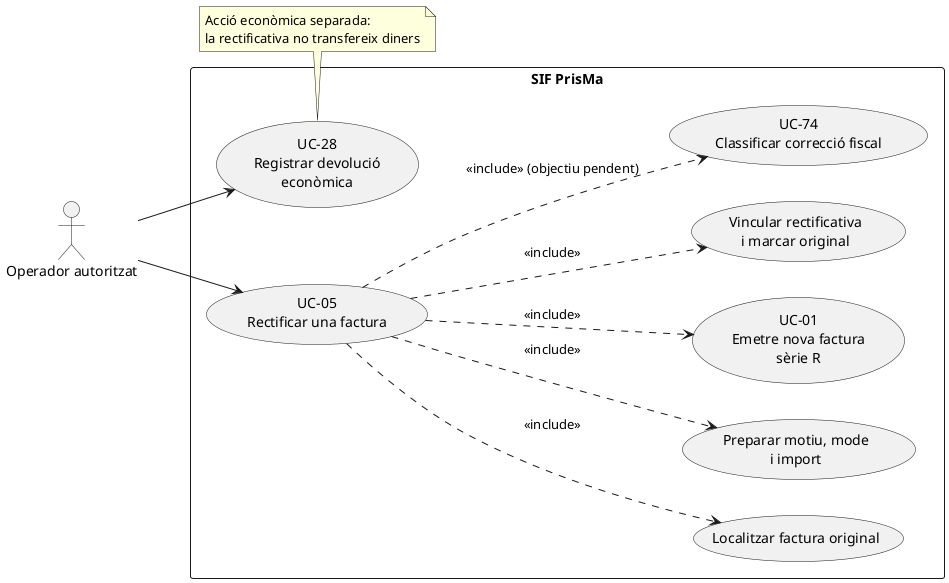
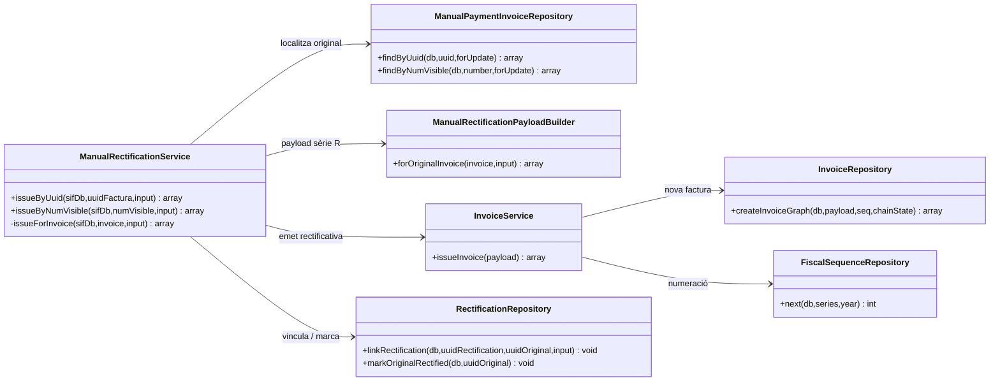
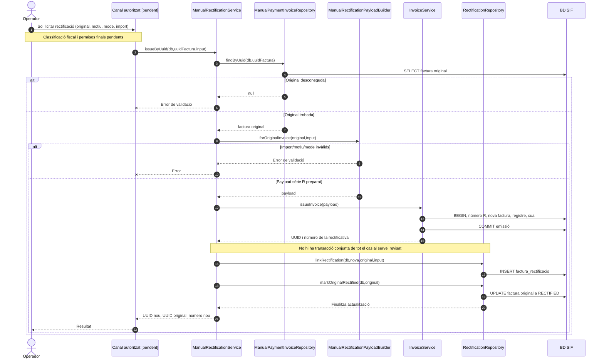

# UC-05 · Rectificar una factura — fitxa i UML integrats

**Estat documental:** nucli de rectificació manual existent; **no s'acredita** que la classificació fiscal, la pantalla final, les garanties de transacció conjunta ni tots els escenaris de rectificació estiguin resolts. **Casos relacionats:** UC-01 (emissió del nou document), UC-26/71 (canvi de curs), UC-27/72 (baixa), UC-28 (devolució econòmica), UC-30 (anul·lació de registre), UC-31 (subsanació) i UC-74 (classificació de correcció fiscal).

## 1. Fitxa del cas d'ús

| Camp | Especificació de l'operació |
| --- | --- |
| Actor principal | Operador autoritzat, a través d'una pantalla/adaptador amb control d'autorització pendent de verificació. |
| Disparador | Una factura emesa requereix una rectificació per un motiu justificat i classificat. |
| Precondicions implementades | Identificació de la factura original per `UUID_FACTURA` o `NUM_VISIBLE`; existència de l'original; import, motiu i mode vàlids. |
| Entrades específiques | `amount`/`import` numèric no nul; `reason`/`motiu` no buit; `mode`/`mode_rectificacio` igual a `DIFERENCIES` o `SUBSTITUCIO`; `concept`, `detail`, `reference`, `created_by`, `year` i `type` opcionalment segons el constructor actual. |
| Resultat | Nova factura amb sèrie `R`; retorn de `uuid_factura` i `num_visible` nous, `uuid_factura_rectificada` i `num_visible_rectificada` de l'original, i indicador de reutilització. |
| Límits | Emetre la rectificativa **no és** executar una devolució monetària, anul·lar un registre improcedent ni subsanar un registre fiscal. No confondre'ls en el diagrama. |

### 1.1. Flux existent verificat

1. `ManualRectificationService::issueByUuid()` o `issueByNumVisible()` valida que l'identificador no sigui buit i localitza la factura original mitjançant `ManualPaymentInvoiceRepository`.
2. Si l'original no existeix, retorna error i no inicia la creació de la rectificativa.
3. `ManualRectificationPayloadBuilder::forOriginalInvoice()` prepara el payload: sèrie `R`; any d'entrada o de l'original; tipus per defecte `R1`; dades del receptor recuperades de la factura original; imports i línia de rectificació; relació d'origen `RECTIFIES`.
4. El constructor genera una clau idempotent pròpia per referència o, si no n'hi ha, a partir de número original, mode, motiu i import.
5. `InvoiceService::issueInvoice()` crea o reutilitza la factura rectificativa; executa la persistència i el registre fiscal comuns a UC-01.
6. **Després del retorn d'aquest servei**, `RectificationRepository::linkRectification()` insereix la relació a `factura_rectificacio`, i `markOriginalRectified()` actualitza `factura.ESTAT_FACTURA` de l'original a `RECTIFIED`.
7. El servei retorna identificadors de la rectificativa i de l'original.

### 1.2. Variants, errors i qüestions específiques

| Variant o risc | Dada comprovada / tractament documental |
| --- | --- |
| A1. Identificar per número visible | `issueByNumVisible()` busca la factura original per `NUM_VISIBLE` i reutilitza el mateix procés. |
| A2. Rectificació per diferències | Mode `DIFERENCIES`. La prova d'integració cobreix un exemple d'import `-40.00` i motiu `DEVOLUCIO_PARCIAL`. Això **no equival** a registrar una transferència de devolució. |
| A3. Rectificació per substitució | Mode `SUBSTITUCIO` admès pel constructor i cobert en una prova amb import negatiu; cal definir i validar el tractament fiscal de cada cas real. |
| A4. Reintent exacte | La clau idempotent permet que `InvoiceService` reutilitzi la rectificativa. La inserció de `factura_rectificacio` evita duplicats amb `ON DUPLICATE KEY UPDATE MOTIU = MOTIU`. |
| E1. Original desconeguda | L'orquestrador rebutja la petició abans d'emetre. |
| E2. Import zero, motiu absent o mode invàlid | El constructor rebutja la petició. |
| **Risc R1: manca d'atomicitat de l'operació completa** | `issueInvoice()` confirma la transacció de la factura **abans** de la inserció de l'enllaç i de l'actualització de l'original. Aquestes darreres operacions usen el `PDO` rebut i no estan englobades per la mateixa transacció al servei consultat. Una fallada intermèdia podria deixar rectificativa emesa sense relació o sense original marcat com a rectificat. No representar el flux com una única transacció atòmica. |
| **Risc R2: fiscalitat del constructor** | El constructor actual fixa `IVA_REGIM=EXEMPT`, `IVA_PCT=0` i `IVA_IMPORT=0` per defecte i recupera el receptor de l'original. **No s'ha acreditat** que aquesta simplificació sigui adequada per a totes les factures, tipus i motius possibles. |
| **Risc R3: elecció de figura fiscal** | Els fluxos d'anul·lació de registre i subsanació són casos diferents i la seva elecció s'ha de classificar abans de cridar la rectificativa. La selecció automàtica completa no està acreditada en aquest servei. |

**Resultats persistits:** nova `factura` sèrie `R`, les seves `factura_linia`, `factura_registres`, entrada `fiscal_queue`, `fact_rels` d'origen i `factura_rectificacio`; actualització de l'estat de la factura original. **No** es crea un moviment `payment_transaction` per aquest servei.

**Proves localitzades (no executades en aquesta revisió):** `ManualRectificationServiceTest::testIssuesRectificationInvoiceAndLinksOriginalInvoice`, `testIssuesRectificationByVisibleInvoiceNumber` i `testRejectsUnknownOriginalInvoiceBeforeIssuingRectification`. No demostren recuperació davant de fallada entre emissió, vinculació i actualització de l'original.

## 2. Diagrama UML de casos d'ús



**Nota de traçabilitat:** la relació amb UC-74 representa una precondició del model **objectiu pendent**; `ManualRectificationService` no conté avui cap crida executable a un classificador fiscal complet.

## 3. Subdiagrama UML de classes



El diagrama de classes omet deliberadament una classe `RectificationClassifier`: la seva existència executable no està acreditada en aquest camí.

## 4. Diagrama de seqüència — rectificació manual actual



### 4.1. Seqüència excepcional que cal resoldre al disseny

```mermaid
sequenceDiagram
autonumber
participant M as ManualRectificationService
participant IS as InvoiceService
participant RR as RectificationRepository
participant DB as BD SIF
M->>IS: issueInvoice(payload sèrie R)
IS->>DB: COMMIT nova factura i registre fiscal
IS-->>M: uuid_rectificativa
M->>RR: linkRectification(uuid_rectificativa, original)
alt Error en inserir relació
 RR--xM: Excepció
 Note over M,DB: Factura R ja emesa. Cal conciliació i recuperació explícita; no reescriure-la ni fingir rollback.
else Relació inserida
 RR->>DB: INSERT factura_rectificacio
 M->>RR: markOriginalRectified(original)
 alt Error actualitzant original
  RR--xM: Excepció
  Note over M,DB: Enllaç pot existir i estat original pot no haver canviat. Cal reconciliar.
 else Actualització correcta
  RR->>DB: UPDATE factura.ESTAT_FACTURA
 end
end
```

## 5. Decisions pendents per completar l'operació

1. Definir i implementar el criteri per escollir rectificativa, anul·lació de registre o subsanació a partir de la casuística real (UC-74/75/76).
2. Garantir o compensar formalment la **unitat lògica** emissió + vinculació + estat original, sense alterar una factura fiscal ja emesa ni una cadena registrada.
3. Verificar el càlcul d'imports, tipus fiscal, IVA i receptor per cada variant i contrastar el contracte del constructor amb el model fiscal final.
4. Determinar si i quan hi ha un moviment econòmic separat (UC-28) i com s'enllaça amb la rectificativa.
5. Dissenyar permisos, pantalla, comprovacions d'estat, confirmació i proves de fallada entre cadascun dels passos del servei.

## 6. Traçabilitat

[Catàleg UC-05](../04-estat-final/33-casos-us-sif.md) · [Fitxa base UC-05](../06-fitxes-funcionals/uc-005.md) · [ManualRectificationService](../../sif/src/Service/ManualRectificationService.php) · [ManualRectificationPayloadBuilder](../../sif/src/Service/ManualRectificationPayloadBuilder.php) · [RectificationRepository](../../sif/src/Repository/RectificationRepository.php) · [InvoiceService](../../sif/src/Service/InvoiceService.php) · [ManualRectificationServiceTest](../../sif/tests/Integration/ManualRectificationServiceTest.php) · [Diagrames generals](../04-estat-final/31-diagrames-classes-sif.md) · [Seqüències existents](../04-estat-final/32-diagrames-sequencia-sif.md).

**Límit:** no s'han executat les proves ni verificat el desplegament. L'existència del codi i de les proves no tanca les decisions fiscals ni els riscos d'atomicitat.
