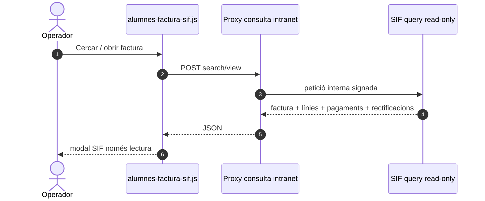
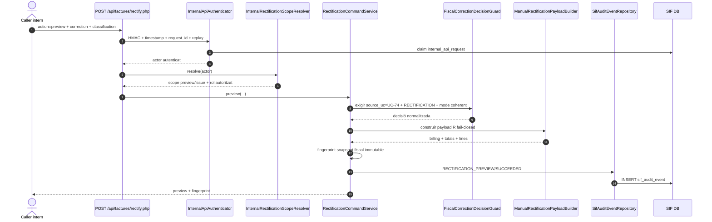
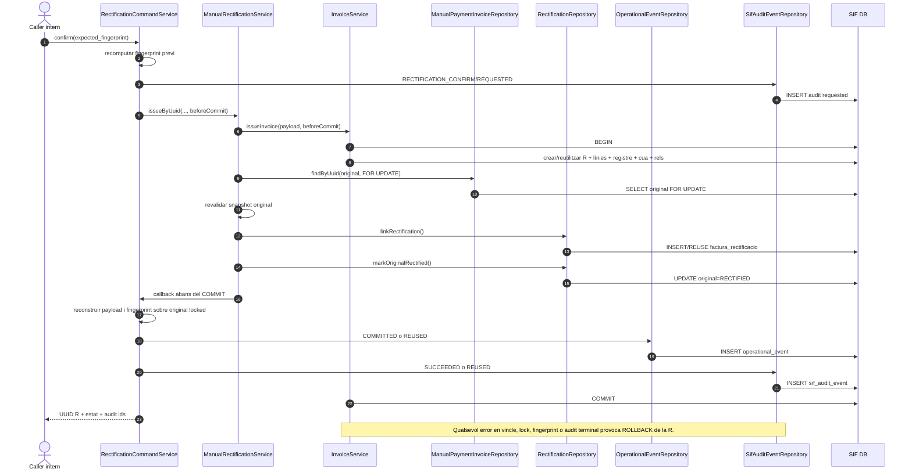
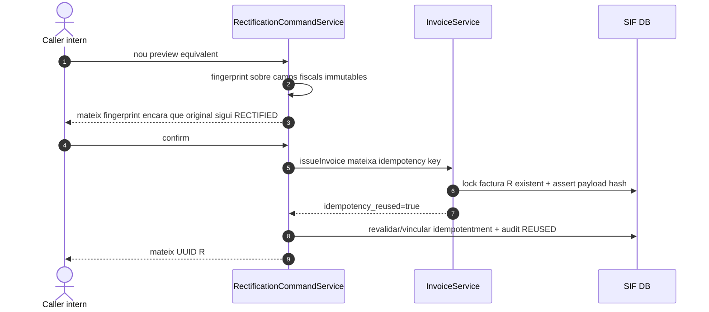
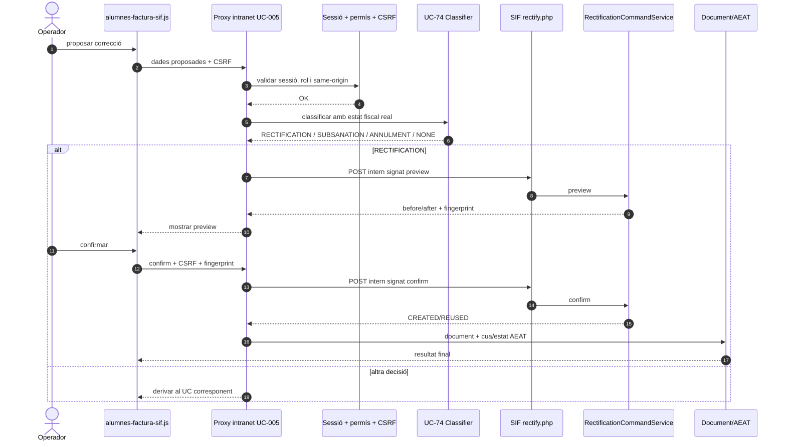
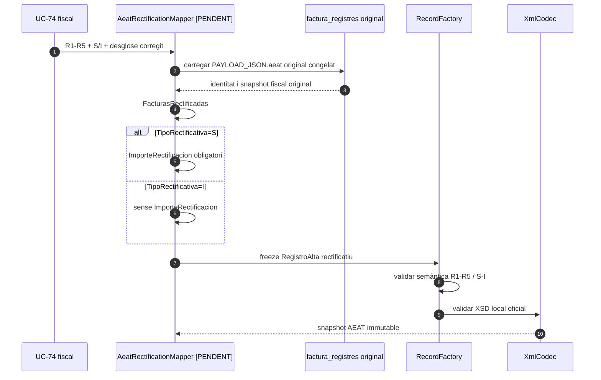

# UC-005 · Diagrames de seqüència ACTUAL / FINAL

**Tall:** 2026-10-03 · branca `audit/uc-005-2026-10-03`

## 1. ACTUAL — consulta SIF intranet

## 2. ACTUAL — backend UC-005 preview

## 3. ACTUAL — confirmació UC-005 atòmica

## 4. ACTUAL — reintent idempotent

## 5. FINAL — intranet segura

## 6. AEAT rectificativa — frontera pendent

**Estat:** `RecordFactory` ja valida S/I i la presència/absència d'`ImporteRectificacion`; falta el mapper que construeixi els camps des de snapshot original i classificació fiscal fiable.

## 7. Garanties i pendents

- **Implementat:** HMAC/replay, rol server-side, preview/confirm, fingerprint doble, `FOR UPDATE`, idempotència, audit terminal dins del COMMIT.
- **No confiar en el navegador:** el client no pot declarar unilateralment `source_uc=UC-74`; la classificació FINAL ha de néixer al servidor.
- **Implementat al protocol AEAT:** validació local de `TipoRectificativa=S|I`; S exigeix `ImporteRectificacion`, I el rebutja.
- **Pendent:** classificador UC-74 executable, mapper AEAT rectificatiu complet, proxy sessió/CSRF, document E2E, concurrència real i preproducció.
